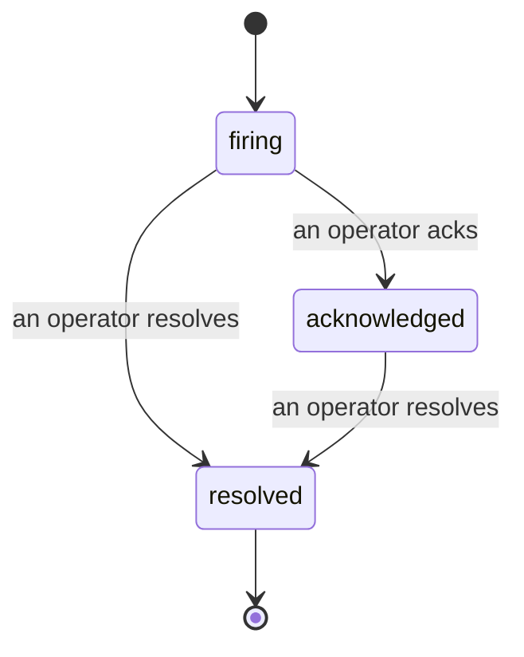

알림이 발생하면 가장 먼저 드는 질문은 항상 "누가 처리하고 있지?"입니다. 인시던트가 그 답을 줍니다. 무언가 임계값을 초과하는 순간, 누구나 인시던트가 열려 있다는 것, 담당자가 누구인지, 지금까지 정확히 무슨 일이 있었는지를 확인할 수 있으며, 사후 분석에 바로 활용할 수 있는 깔끔한 귀속 기록이 남습니다.

*인박스는 열린 인시던트를 상태별로 그룹화하고 심각도와 담당자로 필터링하므로, 지금 당장 사람이 필요한 것만 볼 수 있습니다.*

## 한눈에 담당자 파악

채팅 스레드에서 "누가 보고 있어요?"라고 묻는 일은 이제 없습니다. 임계값 초과 시 인시던트가 자동으로 열리고 공유 인박스에 상태별로 그룹화되어 추가됩니다. 인시던트를 확인(acknowledge)하면 내 이름이 표시되어 팀 나머지 구성원들이 처리 중임을 알 수 있습니다. 확인은 공유 방식으로 이루어집니다. 여러 운영자가 같은 인시던트를 확인할 수 있고 각각 개별적으로 기록되므로, 전체 대응 팀이 서로 겹치지 않고 이름별로 표시됩니다. 트리아지를 위해 단일 담당자를 지정하고, 심각도나 담당자로 인박스를 필터링하여 내 것만 추려볼 수 있습니다.

## 전체 경과를 하나의 타임라인에서

인시던트가 종료되면 이미 작성 보고서가 준비되어 있습니다. 인시던트를 열면 임계값 초과 증거, 담당자 및 구독자, 그 자리에서 협업할 수 있는 댓글 스레드, 그리고 추가 전용 활동 타임라인을 확인할 수 있습니다.

*발생한 모든 일이 순서대로, 각 항목에는 처리한 사람의 서명이 붙어 있습니다.*

모든 액션(열림, 확인, 해결 등)은 타임라인에 기록되며 절대 수정되지 않습니다. 각 항목은 귀속됩니다. 직접 처리한 운영자에게는 이메일로, Failproof AI Observability가 자체적으로 수행한 모든 작업(예: 임계값 초과 시 인시던트 열기)에는 **automated**로 표시됩니다. 익명으로 처리되는 것도, 사라지는 것도 없으므로 사후 분석이 거의 저절로 작성됩니다.

## 인시던트 진행 흐름

- **열림 (firing):** 임계값 초과 시 인시던트가 열리고 채널에 한 번 페이지가 전송됩니다. 반복적인 임계값 초과는 같은 인시던트에 통합되어 증거가 갱신되며, 반복해서 알림을 보내지 않습니다.
- **확인됨 (acknowledged):** 운영자가 인수합니다. 인시던트는 열린 상태로 유지되며, 이후 임계값 초과 시 증거가 조용히 업데이트됩니다.
- **해결됨 (resolved):** 운영자가 종료 처리합니다. 조건이 해소될 때 자동 해결 기능은 계획 중이나 아직 활성화되어 있지 않으므로, 실제로 해소되었는지 모두가 정직하게 확인할 수 있도록 사람이 해결할 때까지 인시던트는 열린 상태로 유지됩니다. 이후 같은 알림에서 새로운 인시던트가 다시 열릴 수 있습니다.

하나의 알림에는 동시에 열린 인시던트가 최대 하나만 존재할 수 있으므로, 불안정하게 반복되는 규칙이 중복 인시던트로 뒤덮이는 일이 없습니다. 또한 수동으로 인시던트를 열 수도 있습니다. 알림이 감지하지 못한 상황을 위한 독립형 인시던트나, 기존 알림에 연결된 인시던트를 `incidents:write` 권한이 있으면 직접 생성할 수 있습니다.

## 찾는 방법

인시던트는 `/<org-slug>/incidents`에 있습니다. 조회에는 **`incidents:read`**, 수동 인시던트 열기에는 **`incidents:write`**, 확인·지정·댓글·해결에는 **`incidents:ack`**가 필요합니다. 더 이상 사용되지 않는 `alerts:ack`가 부여된 이전 키는 `incidents:ack`로 인정되어 계속 작동하므로, 온콜 로테이션을 재발급할 필요가 없습니다.

## 관련 항목

- [알림](/ko/agenteye/alerts): 임계값 초과 시 인시던트를 여는 규칙입니다.
- [오류 추적](/ko/agenteye/error-tracking): 모든 실패를 한 곳에서 확인하고 알림으로 승격시킵니다.
- [감사](/ko/agenteye/audits): 어떤 규칙도 감시하지 않던 실패를 찾아내는 예약된 분석가입니다.