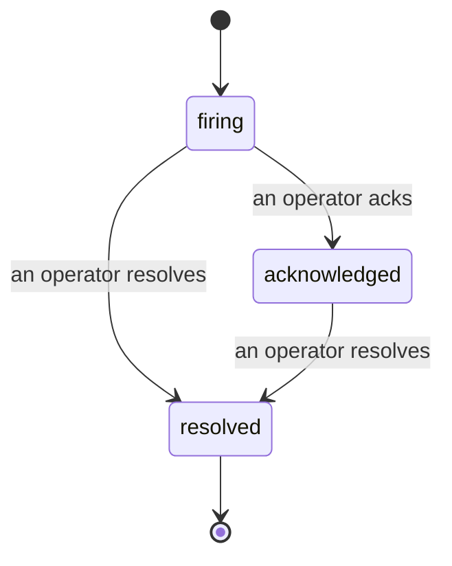

알림이 발생하면 가장 먼저 드는 질문은 항상 "누가 담당하고 있나요?"입니다. 인시던트가 그 답을 제공합니다. 무언가 임계값을 초과하는 순간, 누구나 인시던트가 열려 있는지, 담당자가 누구인지, 지금까지 정확히 어떤 일이 있었는지를 확인할 수 있습니다. 깔끔하게 정리된 기록은 사후 분석(post-mortem)에 바로 활용할 수 있습니다.

*인박스는 열린 인시던트를 상태별로 그룹화하고 심각도 및 담당자로 필터링하여, 지금 당장 사람의 조치가 필요한 항목만 보여줍니다.*

## 누가 담당하는지 한눈에 파악

채팅 스레드에서 "지금 누가 보고 있나요?"라고 물어볼 필요가 없습니다. 임계값을 초과하면 자동으로 인시던트가 열리고 공유 인박스에 상태별로 그룹화되어 표시됩니다. 인시던트를 확인(acknowledge)하면 담당자 이름이 표시되어 나머지 팀원들이 처리 중임을 알 수 있습니다. 확인은 공유 방식으로 동작합니다. 여러 운영자가 동일한 인시던트를 확인할 수 있으며 각자의 기록이 별도로 남습니다. 따라서 워룸 전체 인원이 서로 겹치지 않고 이름으로 표시됩니다. 트리아지를 위한 단일 담당자를 지정하고, 인박스를 심각도나 담당자로 필터링하면 내 것만 빠르게 볼 수 있습니다.

## 전체 경과를 하나의 타임라인에서

인시던트가 종료될 때면 이미 보고서 작성이 완료된 상태입니다. 인시던트를 열면 임계값 초과 증거, 담당자 및 구독자 목록, 현장에서 협업할 수 있는 댓글 스레드, 그리고 추가 전용(append-only) 활동 타임라인을 확인할 수 있습니다.

*발생한 모든 일이 시간 순서대로 정리되어 있으며, 각 항목은 처리한 담당자의 이름이 기재됩니다.*

모든 작업(열림, 확인, 해결 등)은 타임라인에 기록되며 절대 수정되지 않습니다. 각 항목은 담당 운영자의 이메일로 귀속되거나, Failproof AI Observability가 임계값 초과 시 인시던트를 자동으로 열었을 경우 **automated**로 표시됩니다. 익명 처리되거나 누락되는 항목은 없으므로 사후 분석은 거의 저절로 작성됩니다.

## 인시던트의 상태 흐름

- **열림 (firing):** 임계값 초과 시 인시던트가 열리고 연결된 채널에 한 번 알림이 발송됩니다. 이후 반복되는 임계값 초과는 동일한 인시던트에 통합되어 증거만 갱신되며, 알림이 반복 발송되지 않습니다.
- **확인됨 (acknowledged):** 운영자가 인시던트를 담당합니다. 인시던트는 열린 상태를 유지하며, 이후 임계값 초과가 발생해도 증거만 조용히 업데이트됩니다.
- **해결됨 (resolved):** 운영자가 인시던트를 종결합니다. 조건이 해소될 때 자동 해결하는 기능은 계획 중이지만 아직 활성화되지 않았습니다. 따라서 인시던트는 사람이 직접 해결하기 전까지 열린 상태를 유지하며, 실제로 무엇이 해소되었는지 모두가 분명히 확인할 수 있습니다. 이후 동일한 알림에서 새로운 인시던트가 다시 열릴 수 있습니다.

알림 하나에는 동시에 열린 인시던트가 최대 하나만 존재할 수 있으므로, 불안정하게 반복되는 규칙이 중복 인시던트를 쏟아내는 상황을 방지합니다. `incidents:write` 권한이 있다면 인시던트를 수동으로 열 수도 있습니다. 어떤 알림과도 연결되지 않은 독립형 인시던트로 생성하거나, 기존 알림에 연결된 형태로 생성할 수 있습니다.

## 위치

인시던트는 `/<org-slug>/incidents`에 있습니다. 조회에는 **`incidents:read`**, 수동 인시던트 생성에는 **`incidents:write`**, 확인·지정·댓글·해결에는 **`incidents:ack`** 권한이 필요합니다. 이전에 부여된 `alerts:ack` 키는 `incidents:ack`로 그대로 인정되므로, 온콜 로테이션을 재발급할 필요가 없습니다.

## 관련 항목

- [알림](/ko/agenteye/alerts): 임계값 초과 시 인시던트를 여는 규칙입니다.
- [오류 추적](/ko/agenteye/error-tracking): 모든 장애를 한 곳에서 확인하고 알림으로 승격할 수 있습니다.
- [감사](/ko/agenteye/audits): 어떤 규칙도 감시하지 않던 장애를 찾아내는 예약 분석기입니다.