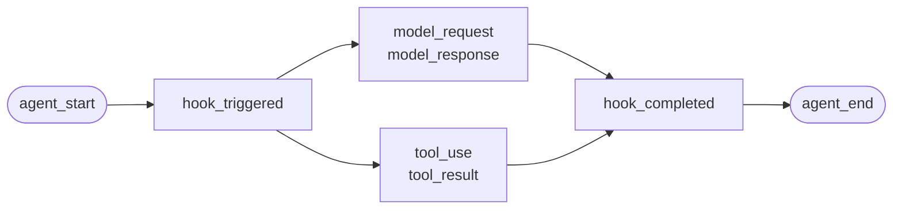
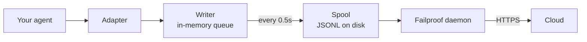

직접 작성한 에이전트나 Failproof AI에 어댑터가 없는 프레임워크에 사용합니다. 별도로 계측할 것은 없습니다. 이벤트를 직접 발행하면 됩니다.

이는 네 가지 프레임워크 어댑터가 내부적으로 호출하는 것과 동일한 API입니다. 어댑터들은 이 API에 대한 변환 테이블입니다.

## 설치

```bash
pip install failproofai-sdk
```

추가 패키지나 의존성이 없습니다.

## 계측

```python
import failproofai_sdk

failproofai_sdk.configure(environment="production")

with failproofai_sdk.session():                 # 하나의 실행
    with failproofai_sdk.agent("planner"):      # 하나의 작업 단위
        with failproofai_sdk.tool_call("search", input={"q": q}) as t:
            t.output = search(q)                # 하나의 도구 호출
```

위에서 아래로 읽으면 그 의미가 그대로 드러납니다:

| 감싸는 것 | 의미 |
| --- | --- |
| `session()` | 이 이벤트들은 동일한 실행에 속합니다 |
| `agent()` | 무언가 작업을 수행하고 있습니다 — 목록에서 알아볼 수 있는 이름을 붙이세요 |
| `tool_call()` | 이것은 하나의 도구이며, 반환한 값입니다 |

각각이 실제로 발행하는 이벤트:

| 스코프 | 발행 이벤트 | 목적 |
| --- | --- | --- |
| `session()` | 없음 | 세션 id를 바인딩하여 하나의 실행을 그룹화합니다 |
| `agent()` | `agent_start`, `agent_end` | 작업 단위를 괄호로 묶습니다 |
| `tool_call()` | `tool_use`, `tool_result` | 하나의 도구를 괄호로 묶고 측정합니다 |

내부의 모든 코드는 `session_id`와 `agent_id`를 생략할 수 있습니다. 스코프는 컨텍스트 변수에 식별자를 바인딩하며, 모든 이벤트 호출이 이를 읽어오므로 함수를 통해 id를 전달할 필요가 없습니다.

세 가지 모두 `with`뿐만 아니라 `async with`에서도 동작합니다.

에이전트를 중첩하면 트리가 만들어집니다. `parent_id`와 깊이는 스택에서 자동으로 계산됩니다:

```python
with failproofai_sdk.session():
    with failproofai_sdk.agent("supervisor"):
        with failproofai_sdk.agent("researcher"):    # parent_id = "supervisor"
            ...
```

## 스코프가 닫히는 방식

`agent()`는 예외를 자동으로 처리합니다:

| 발생한 상황 | 이벤트 | 결과 |
| --- | --- | --- |
| 예외 없음 | `agent_end` | `success` |
| `Exception` | `error`, 이후 `agent_end` | `failed` |
| `KeyboardInterrupt`, `SystemExit` | `error`, 이후 `agent_end` | `failed` |
| `CancelledError`, `GeneratorExit` | `agent_end`만 | `cancelled` |

`agent_end` 이전에 오류가 발행되는 이유는, 대시보드가 `agent_end`에서 스팬을 닫고 그 이후의 이벤트는 아무것에도 귀속되지 않기 때문입니다. 취소는 실패가 아니므로 취소된 실행은 오류 목록을 오염시키지 않습니다. 예외는 항상 다시 발생됩니다. 스코프는 예외를 삼키지 않습니다.

## 이벤트 메서드

여섯 가지 계열에 걸쳐 열다섯 가지 메서드가 있습니다. 대부분은 쌍으로 이루어져 있으며, 여는 이벤트를 발행한 뒤 닫는 이벤트를 발행하면 SDK가 그 사이의 스팬을 측정합니다.

| 계열 | 여는 이벤트 | 닫는 이벤트 | 단독 이벤트 |
| --- | --- | --- | --- |
| **에이전트** | `agent_start` | `agent_end` | — |
| | `agent_pause` | `agent_resume` | — |
| **모델** | `model_request` | `model_response` | — |
| **도구** | `tool_use` | `tool_result` | — |
| **훅** | `hook_triggered` | `hook_completed` | — |
| **사람** | `human_wait` | `human_input` | `human_pause`, `human_interrupt` |
| **실패** | — | — | `error` |

<Tip>
  가능하면 `agent()`와 `tool_call()` 스코프를 사용하세요. 본문에서 예외가 발생해도 닫는 이벤트를 보장합니다. 제어 흐름이 중첩되지 않는 경우, 예를 들어 헬퍼 함수 내부의 모델 호출처럼 스코프가 맞지 않을 때는 이벤트 메서드를 직접 사용하세요.
</Tip>

<CodeGroup>
```python Agents
failproofai_sdk.event.agent_start(agent_id="planner", goal="find the cheapest flight")
failproofai_sdk.event.agent_end(agent_id="planner", outcome="success", summary="...")
failproofai_sdk.event.agent_pause(pause_id="p1", reason="awaiting approval")
failproofai_sdk.event.agent_resume(pause_id="p1")
```

```python Models
failproofai_sdk.event.model_request(
    model="gpt-4o-mini",
    messages=[{"role": "user", "content": "..."}],
    request_id="req-1",
)
failproofai_sdk.event.model_response(
    model="gpt-4o-mini",
    content="...",
    input_tokens=139,
    output_tokens=21,
    request_id="req-1",
    duration_ms=5202,
)
```

```python Tools
failproofai_sdk.event.tool_use(tool_name="search", tool_call_id="c1", input={"q": "..."})
failproofai_sdk.event.tool_result(tool_name="search", tool_call_id="c1", output="...")
```

```python Hooks
failproofai_sdk.event.hook_triggered(hook_name="retrieve", hook_id="h1", trigger_event="node")
failproofai_sdk.event.hook_completed(hook_name="retrieve", hook_id="h1", outcome="success")
```

```python Humans
failproofai_sdk.event.human_wait(input_id="i1", prompt="Approve?", options=["yes", "no"])
failproofai_sdk.event.human_input(input_id="i1", response="yes")
failproofai_sdk.event.human_pause(reason="operator paused the run", user_id="dana")
failproofai_sdk.event.human_interrupt(reason="operator stopped the run", at_step="step_3")
```

```python Failures
failproofai_sdk.event.error(
    error_type="TimeoutError",
    message="provider timed out after 30s",
    traceback="...",
)
```
</CodeGroup>

<Note>
  **두 가지 사람 관련 계열은 방향이 반대입니다.**

  | 메서드 | 의미 |
  | --- | --- |
  | `human_wait` / `human_input` | **에이전트가 사람에게 요청** — 승인 게이트, 확인 질문 |
  | `human_pause` / `human_interrupt` | **사람이 에이전트에 개입** — 중지 버튼, 운영자 일시 정지 |

  두 번째 쌍은 어떤 프레임워크도 신호를 보내지 않으므로, 항상 직접 발행해야 합니다.
</Note>

<Warning>
  **모델 호출이 동시에 실행될 때는 `request_id`를 전달하세요.** 전달하지 않으면 에이전트별로 요청과 응답이 도착 순서대로 쌍을 이루기 때문에, 동시 호출 시 잘못된 요청에 응답이 연결될 수 있습니다.
</Warning>

## 예시

에이전트 프레임워크 없이 OpenAI API를 사용하는 도구 호출 루프:

```python
import json

import failproofai_sdk
from openai import OpenAI

failproofai_sdk.configure(environment="production")
client = OpenAI()
MODEL = "gpt-4o-mini"


def turn(messages: list):
    """One model call, bracketed by the pair."""
    failproofai_sdk.event.model_request(model=MODEL, messages=messages)
    reply = client.chat.completions.create(model=MODEL, messages=messages, tools=TOOLS)
    usage = reply.usage
    failproofai_sdk.event.model_response(
        model=MODEL,
        content=reply.choices[0].message.content or "",
        input_tokens=usage.prompt_tokens,
        output_tokens=usage.completion_tokens,
    )
    return reply.choices[0].message


with failproofai_sdk.session():
    with failproofai_sdk.agent("inventory", goal="price report"):
        for _ in range(4):          # bounded; an unbounded agent loop is its own bug
            message = turn(messages)
            if not message.tool_calls:
                break
            messages.append(message.model_dump(exclude_none=True))
            for call in message.tool_calls:
                args = json.loads(call.function.arguments or "{}")
                with failproofai_sdk.tool_call(
                    call.function.name, tool_call_id=call.id, input=args
                ) as handle:
                    handle.output = run_tool(call.function.name, args)
                messages.append({
                    "role": "tool",
                    "tool_call_id": call.id,
                    "content": str(handle.output),
                })
```

이 코드는 어댑터가 생성하는 것과 동일한 여섯 가지 이벤트 타입을 생성합니다. 도구 정의를 포함한 완전히 실행 가능한 버전은 SDK 저장소의 `docs/manual/examples/` 경로에 포함되어 있습니다.

## 스레드와 비동기

컨텍스트 변수는 asyncio 태스크에 자동으로 전파됩니다. 하지만 새 스레드는 빈 컨텍스트로 시작하기 때문에 스레드로는 자동 전파되지 않습니다.

```python
# asyncio: 별도 작업 불필요
async with failproofai_sdk.session():
    await asyncio.gather(worker(1), worker(2))

# 스레드: callable을 감쌀 것
pool.submit(failproofai_sdk.propagate(work), x)
threading.Thread(target=failproofai_sdk.propagate(work)).start()
loop.run_in_executor(None, failproofai_sdk.propagate(work), x)
```

`propagate()`를 사용하지 않으면, 워커의 이벤트는 세션 없이 처리되는 대신 수정 방법을 알려주는 `TypeError`를 발생시킵니다. 이는 의도적인 동작입니다. 세션이 없는 이벤트는 인제스트에서 건너뛰어지고 `200`으로 응답되는데, 이는 식별자 레이어가 방지하려는 무음 실패이기 때문입니다.

## 어댑터 없이 프레임워크 계측하기

모든 에이전트 프레임워크는 동일한 세 가지 연결 지점을 제공합니다. 이를 매핑하면 완전한 트레이스를 얻을 수 있습니다. 출시된 네 가지 어댑터도 이것 이상을 하지 않습니다.

| 연결 지점 | 작성할 코드 | 생성되는 이벤트 |
| --- | --- | --- |
| 실행 | `session()` + `agent()` | `agent_start`, `agent_end` |
| 각 도구 | `tool_call()` | `tool_use`, `tool_result` |
| 각 모델 호출 | `model_*` 쌍 | `model_request`, `model_response` |

<Steps>
  <Step title="실행을 괄호로 묶기">
    ```python
    with failproofai_sdk.session():
        with failproofai_sdk.agent(agent_name, goal=task):
            result = framework.run(task)
    ```
  </Step>
  <Step title="각 도구를 괄호로 묶기">
    프레임워크에서 도구 래퍼나 미들웨어라고 부르는 곳에서 처리합니다.

    ```python
    with failproofai_sdk.tool_call(name, input=args) as call:
        call.output = original(**args)
    ```
  </Step>
  <Step title="각 모델 호출을 쌍으로 처리하기">
    ```python
    failproofai_sdk.event.model_request(model=model, messages=messages)
    reply = provider.complete(...)
    failproofai_sdk.event.model_response(
        model=model,
        content=text,
        input_tokens=usage.prompt_tokens,
        output_tokens=usage.completion_tokens,
    )
    ```
  </Step>
</Steps>

<Tip>
  **노드, 스텝, 미들웨어 경계를 추적하고 싶다면?** 중첩된 `agent()` 대신 훅 쌍(`hook_triggered` / `hook_completed`)으로 감싸세요. `agent_id`는 저기수성 패싯이라 노드마다 항목이 생기면 목록이 넘쳐납니다. 훅 스팬은 동일하게 렌더링되면서 노드별 레이턴시를 제공합니다.
</Tip>

<Note>
  **수동 계측과 자동 계측은 함께 동작합니다.** 직접 작성한 스코프 안에서 실행되는 어댑터는 해당 세션에 참여하고 해당 에이전트의 하위에 위치하므로, 두 개의 트리가 아닌 하나의 트리를 얻을 수 있습니다. 지원되는 프레임워크와 함께 다른 프레임워크를 직접 계측할 때 유용합니다.
</Note>

<Accordion title="AutoGen 어댑터가 없는 이유">
  두 가지 이유가 있으며, 위의 세 가지 연결 지점이 두 경우 모두에 대한 답입니다:

  - `autogen-core`는 2025년 9월 이후 유지 관리가 중단되었습니다.
  - AG2는 다른 프레임워크들의 훅에 해당하는 프로세스 수준의 등록 지점을 제공하지 않기 때문에, 계측하려면 에이전트를 생성하는 모든 위치에서 래핑해야 합니다.

  연결 지점을 직접 매핑하면 출시된 어댑터와 동일한 이벤트를, 동일한 정밀도로 기록할 수 있습니다.
</Accordion>

## 더 깊이 알아보기

레코딩이 실제로 동작하는 방식입니다. 시작하는 데 필요한 내용은 아닙니다.

<AccordionGroup>

<Accordion title="프레임워크별 레코딩의 모습" icon="eye">

모든 레코딩은 동일한 형태를 가집니다. 스팬이 열리고, 그 안에 작업이 중첩되며, 각 열린 이벤트에 닫는 이벤트가 생깁니다.



**쌍**이 기본 단위입니다. 각 닫는 이벤트는 SDK가 여는 이벤트부터 측정한 지속 시간을 가집니다.

아래는 프레임워크별 실제 실행 결과입니다. SDK와 함께 제공되는 예시에서 캡처했으며 모델 이름은 정규화했습니다. 단 한 번의 호출에서 얼마나 많은 정보가 반환되는지 확인해 보세요.

<Tabs>
  <Tab title="LangGraph">
    ```text 14 events
     1  +0.000s  agent_start       LangGraph
     2  +0.001s    hook_triggered  agent
     3  +0.002s      model_request   gpt-4o-mini
     4  +3.023s      model_response  gpt-4o-mini · 21 out-tok
     5  +3.024s    hook_completed  agent
     6  +3.024s    hook_triggered  tools
     7  +3.025s      tool_use      word_count
     8  +3.025s      tool_result   word_count · ok
     9  +3.025s    hook_completed  tools
    10  +3.026s    hook_triggered  agent
    11  +3.027s      model_request   gpt-4o-mini
    12  +5.717s      model_response  gpt-4o-mini · 5 out-tok
    13  +5.720s    hook_completed  agent
    14  +5.721s  agent_end         LangGraph · success
    ```

    노드가 훅 쌍이 되므로, 에이전트 목록을 복잡하게 만들지 않고도 노드별 레이턴시를 얻을 수 있습니다.
  </Tab>

  <Tab title="CrewAI">
    ```text 10 events
     1  +0.000s  agent_start       crew
     2  +0.050s    agent_start     analyst · under crew
     3  +0.057s      model_request   gpt-4o-mini
     4  +3.475s      model_response  gpt-4o-mini · 19 out-tok
     5  +3.478s      tool_use      lookup_metric
     6  +3.478s      tool_result   lookup_metric · ok
     7  +3.486s      model_request   gpt-4o-mini
     8  +5.694s      model_response  gpt-4o-mini · 9 out-tok
     9  +5.727s    agent_end       analyst · success
    10  +5.739s  agent_end         crew · success
    ```

    각 에이전트의 `role`이 스팬 이름이 되므로, 레이턴시와 토큰 사용량을 역할별로 분석할 수 있습니다.
  </Tab>

  <Tab title="LlamaIndex">
    ```text 26 events
     1  +0.000s  agent_start       Agent
     2  +0.001s    hook_triggered  init_run
     4  +0.501s    hook_triggered  setup_agent
     6  +0.503s    hook_triggered  run_agent_step
     7  +0.505s      model_request   gpt-4o-mini
     8  +3.083s      model_response  gpt-4o-mini · 18 out-tok
    10  +3.197s    hook_triggered  parse_agent_output
    12  +3.355s    hook_triggered  call_tool
    13  +3.355s      tool_use      city_population
    14  +3.355s      tool_result   city_population · ok
    16  +3.356s    hook_triggered  aggregate_tool_results
       ...                        second iteration
    26  +7.038s  agent_end         Agent · success
    ```

    에이전트 루프 자체가 보이며, 모델 호출만 보이는 것이 아닙니다.
  </Tab>

  <Tab title="Pydantic AI">
    ```text 8 events
    1  +0.000s  agent_start       agent
    2  +0.001s    model_request   gpt-4o-mini
    3  +4.413s    model_response  gpt-4o-mini · 17 out-tok
    4  +4.415s    tool_use        population
    5  +4.415s    tool_result     population · ok
    6  +4.416s    model_request   gpt-4o-mini
    7  +8.118s    model_response  gpt-4o-mini · 6 out-tok
    8  +8.119s  agent_end         agent · success
    ```

    훅 쌍 없음: Pydantic AI에는 괄호로 묶을 노드나 스텝 경계가 없습니다.
  </Tab>

  <Tab title="Custom agents">
    ```text 6 events
    1  +0.000s  agent_start       main
    2  +0.000s    tool_use        population
    3  +0.000s    tool_result     population · ok
    4  +0.000s    model_request   gpt-4o-mini
    5  +0.000s    model_response  gpt-4o-mini · 3 out-tok
    6  +0.000s  agent_end         main · success
    ```

    직접 발행합니다. 동일한 이벤트 타입, 동일한 정밀도 — 호출 위치를 직접 작성하는 비용이 있습니다.
  </Tab>
</Tabs>

</Accordion>

<Accordion title="세션이 시작되고 끝나는 방식" icon="circle-play">

**세션 종료 이벤트는 없습니다.** 세션은 닫는 것이 아니라, `session_id`를 공유하는 이벤트들의 그룹입니다.

상태는 트레이스의 형태에서 도출됩니다:

| 상태 | 조건 |
| --- | --- |
| `ongoing` | 적어도 하나의 스팬이 아직 열려 있음 |
| `paused` | `agent_pause`에 대응하는 `agent_resume`이 없음 |
| `error` | 열린 스팬이 없고, 적어도 하나의 이벤트가 실패함 |
| `done` | 열린 스팬이 없고, 실패한 이벤트도 없음 |

즉, 모든 쌍이 닫히면 세션이 종료됩니다. 어댑터는 `agent_end`를 자동으로 발행하며, 종료 시 아직 열려 있는 것들을 닫고 불완전으로 표시합니다. 충돌한 실행은 보이는 공백과 함께 `done`으로 정리되며 영원히 대기 상태로 남지 않습니다.

<Note>
  이것이 세션이 두 번의 호출에 걸쳐 있을 수 있는 이유입니다. LangGraph의 `interrupt()`는 실행을 일시 정지하고, 루트 스팬은 의도적으로 열린 상태를 유지하며, 재개하는 호출이 그것을 닫습니다. 두 호출은 하나의 세션입니다.
</Note>

</Accordion>

<Accordion title="식별자: session_id, agent_id, 그리고 누가 생성하는가" icon="fingerprint">

`session_id`와 `agent_id`는 모든 이벤트 메서드에서 선택 사항입니다. 생략하면 감싸는 스코프에서 해결됩니다:

```python
with failproofai_sdk.session():
    with failproofai_sdk.agent("planner"):
        failproofai_sdk.event.tool_use(tool_name="search", tool_call_id="c1")
```

명시적으로 전달하면 여전히 동작하며 우선순위를 가집니다. 바인딩된 것도 없고 전달된 것도 없으면, 세션 없이 이벤트를 발행하는 대신 수정 방법을 알려주는 `TypeError`가 발생합니다. 세션 없는 이벤트는 인제스트에서 건너뛰어지고 `200`으로 응답됩니다.

스코프는 컨텍스트 변수에 식별자를 바인딩합니다. 이는 asyncio 태스크에는 자동으로 전파되지만 새 스레드에는 전파되지 않으므로, 워커를 `failproofai_sdk.propagate()`로 감싸야 합니다.

#### 누가 어떤 id를 생성하는가

| Id | 생성자 | 비고 |
| --- | --- | --- |
| `session_id` | 사용자 또는 SDK | `session("chat-42")`는 그대로 사용됨; 생략하면 SDK가 `uuid4().hex`를 생성 |
| `agent_id` | 사용자 또는 프레임워크 | `agent("analyst")`, CrewAI `role`, `FunctionAgent.name`에서 옴. UUID처럼 보이는 값은 거부되고 대체됨 |
| `tool_call_id`, `hook_id`, `request_id` | 사용자 또는 프레임워크 | 어댑터는 프레임워크 자체의 실행 id를 재사용하므로 쌍이 스레드 전환에서도 유지됨 |
| **이벤트 id** | **클라우드, 인제스트 시** | SDK는 발행하지 않음 |
| **`dedup_key`** | **클라우드, 인제스트 시** | 조직, 세션, 타임스탬프, 타입, 페이로드의 해시. 이것이 실제 식별자로, 재시도된 배치가 중복 대신 하나로 합쳐지게 함 |

#### 어댑터가 `session_id`를 해결하는 방식

첫 번째 매칭이 우선:

1. 명시적인 `session_id` 옵션
2. 호출별 메타데이터
3. 감싸는 `session()` 스코프
4. 프레임워크 메타데이터
5. 프레임워크 자체 실행 id

이 중 하나가 존재하는 동안에는 임의로 생성되지 않습니다. 합성된 id는 하나의 실행을 여러 세션으로 분리하게 됩니다.

#### `agent_id`는 저기수성으로 유지하세요

모든 대시보드 화면의 주요 패싯이며 `LowCardinality(String)` 컬럼입니다. 실행별 값을 사용하면 컬럼 성능이 저하되고 필터 드롭다운에 실행마다 하나씩 항목이 쌓입니다.

어댑터는 이 컬럼을 자동으로 보호합니다:

| 프레임워크가 전달한 값 | 기록되는 값 | 이유 |
| --- | --- | --- |
| `3f9a1c2b-…` (UUID) | `main` | 보존할 읽기 가능한 부분 없음 |
| 긴 순수 16진수 문자열 | `main` | 동일 |
| `agent-3f9a1c2b-…` | `agent` | 실행별 id 제거, 읽기 가능한 부분 유지 |
| `agent-v2` | `agent-v2` | 짧은 세그먼트는 그대로 유지 |
| `step-3` | `step-3` | 동일 |

실제 id는 `fw_agent_id` / `fw_run_id`에 보존되어 패싯이 되지 않으면서도 쿼리 가능합니다.

<Warning>
  **이 보호는 프레임워크가 선택한 레이블에만 적용됩니다.** `event.*` 또는 `failproofai_sdk.agent(...)`에 직접 전달한 `agent_id`는 그대로 기록됩니다. 명시적인 인자를 조용히 재작성하는 것은 방지하려는 기수성 문제보다 더 나쁘기 때문입니다. 직접 작성하는 스팬 이름에 주의하세요.
</Warning>

</Accordion>

<Accordion title="이벤트 타입 목록 및 프레임워크별 기록 여부" icon="table">

| 그룹 | 이벤트 |
| --- | --- |
| 에이전트 | `agent_start`, `agent_end`, `agent_pause`, `agent_resume` |
| 모델 | `model_request`, `model_response` |
| 도구 | `tool_use`, `tool_result` |
| 훅 | `hook_triggered`, `hook_completed` |
| 사람 | `human_wait`, `human_input`, `human_pause`, `human_interrupt` |
| 실패 | `error` |

위의 실행 결과를 기준으로 프레임워크별 기록 여부:

| 이벤트 | LangGraph | CrewAI | LlamaIndex | Pydantic AI | 커스텀 |
| --- | :--: | :--: | :--: | :--: | :--: |
| 에이전트 시작/종료 | 예 | 예 | 예 | 예 | 직접 |
| 모델 요청/응답 | 예 | 예 | 예 | 예 | 직접 |
| 도구 사용/결과 | 예 | 예 | 예 | 예 | 직접 |
| 훅 시작/완료 | 노드 | 태스크 | 스텝 | — | 직접 |
| 오류 | 예 | 예 | 예 | 예 | 자동 |
| 사람 대기/입력 | 예 | 예 | 예 | — | 직접 |
| 에이전트 일시정지/재개 | 예 | 예 | 예 | — | 직접 |

대시(—)는 프레임워크에 해당 개념이 없음을 의미합니다. `human_pause`와 `human_interrupt`는 에이전트에 _사람_이 개입하는 것을 나타내며, 어떤 프레임워크도 신호를 보내지 않으므로 직접 발행해야 합니다.

</Accordion>

<Accordion title="쌍, 상관관계, 지속 시간" icon="link">

이벤트는 단독으로 도착하지 않습니다. 하나가 스팬을 열고, 하나가 닫으며, 닫는 이벤트는 SDK가 여는 이벤트부터 측정한 지속 시간을 가집니다.

| 여는 이벤트 | 닫는 이벤트 | 닫는 이벤트에 포함된 내용 |
| --- | --- | --- |
| `agent_start` | `agent_end` | `outcome`, `summary` |
| `model_request` | `model_response` | 토큰, `stop_reason`, 레이턴시 |
| `tool_use` | `tool_result` | `output` 또는 `error`, 지속 시간 |
| `hook_triggered` | `hook_completed` | `outcome`, 지속 시간 |
| `agent_pause` | `agent_resume` | 일시 정지 지속 시간 |
| `human_wait` | `human_input` | 응답, 응답까지 걸린 시간 |

<Warning>
  닫는 이벤트가 없는 여는 이벤트는 영원히 끝나지 않는 스팬입니다. 세션은 계속 실행 중으로 표시되고 활성 지속 시간이 계속 증가합니다. 이것이 수동 계측 시 주의해야 할 실패 패턴입니다.
</Warning>

#### 상관관계 규칙

- 매칭되는 완료 이벤트에 동일한 `tool_call_id`, `hook_id`, `pause_id`, `input_id`를 재사용하세요.
- SDK는 `tool_result`, `hook_completed`, `agent_resume`, `human_input`에 대해 `duration_ms`를 계산합니다. 이 메서드들에 전달하면 `ValueError`가 발생합니다.
- `duration_ms`는 `model_response`에서 **허용됩니다**. 실제 프로바이더 레이턴시는 호출자만 알기 때문입니다. 정수여야 합니다. 부동소수점은 호출 시점에 `ValueError`를 발생시킵니다. 서버가 해당 컬럼을 부호 없는 32비트 정수로 읽어 다른 값은 NULL로 저장하기 때문입니다.
- 상관관계 키는 종류와 세션별로 범위가 지정되므로, 도구 호출과 훅이 같은 id를 안전하게 공유할 수 있으며, 동시 세션도 동일한 id를 충돌 없이 재사용할 수 있습니다. 에이전트별로는 범위가 지정되지 않습니다. 한 에이전트 아래서 열리고 다른 에이전트 아래서 닫히는 쌍도 여전히 상관관계를 유지합니다. 이는 다중 에이전트 프레임워크에서 일반적인 경우입니다.
- `request_id`는 `model_request`와 `model_response`를 쌍으로 묶습니다. 없으면 모델 이벤트가 에이전트별 순서대로 쌍을 이루므로, 동시 호출 시 잘못된 쌍이 생깁니다.
- 프로세스를 넘나드는 쌍은 다운스트림에서도 상관관계를 유지하지만, SDK는 프로세스 내 지속 시간을 계산할 수 없습니다.
- 대기 중인 맵은 최대 10,000개의 시작 이벤트를 보유하며, 가득 차면 가장 오래된 항목을 삭제합니다.

</Accordion>

<Accordion title="패키지 내용 및 instrument()의 프레임워크 탐지 방식" icon="box">

`failproofai-sdk`를 설치하면 네 가지 어댑터를 포함한 모든 것이 설치됩니다. extras는 어댑터가 아닌 **프레임워크**를 가져옵니다.

```python
import failproofai_sdk        # 표준 라이브러리 외 아무것도 로드하지 않음
failproofai_sdk.instrument()  # 실제로 필요한 어댑터만 임포트
```

`import failproofai_sdk`는 계약상 의존성이 없으며, `--no-deps`로 빌드된 wheel을 설치하는 테스트와 어떤 프레임워크도 `sys.modules`에 없음을 증명하는 테스트로 강제됩니다.

<Warning>
  `failproofai_sdk.crewai` 속성은 없습니다. 어댑터는 의도적으로 최상위 패키지에 노출되지 않습니다. 하나를 건드리면 속성 접근의 부작용으로 프레임워크가 임포트되어 의존성 없음 약속이 깨집니다. `instrument()`를 사용하세요.
</Warning>

```python
failproofai_sdk.instrument()              # 이미 임포트된 모든 프레임워크
failproofai_sdk.instrument("crewai")      # 이름으로 정확히 하나
failproofai_sdk.uninstrument("crewai")    # 되돌리기
```

| 이름 | 대체 이름 허용 |
| --- | --- |
| `langchain` | `langgraph`, `langchain_core` |
| `crewai` | — |
| `llama_index` | `llamaindex`, `llama-index` |
| `pydantic_ai` | `pydantic-ai`, `pydanticai` |

자동 탐지는 설치된 패키지 목록이 아닌 `sys.modules`를 읽으므로, 설치했지만 임포트하지 않은 프레임워크는 계측되지 않으며 임의로 임포트되지도 않습니다. 현재 연결된 것을 확인하려면:

```python
from failproofai_sdk.integrations import active, available

available()   # ('crewai', 'langchain', 'llama_index', 'pydantic_ai')
active()      # ('langchain',)
```

<Note>
  **CrewAI가 없는 머신에서 `instrument("crewai")`를 호출해도 예외가 발생하지 않습니다.** 경고를 로그에 남기고 `()`를 반환하므로, 하나의 프레임워크가 없어도 다른 프레임워크를 계측하는 프로세스가 중단되지 않습니다.

  경고에는 기본 `ImportError`가 포함되며, 해당 메시지에 정확한 설치 명령이 나와 있습니다. 수정 방법이 숨겨지지 않고 로그에 있습니다.

  ```text
  ImportError: failproofai_sdk: cannot instrument 'crewai' because 'crewai.events'
  is not importable. Install it with:  pip install 'failproofai_sdk[crewai]'
  ```

  예외를 발생시키려면 `FAILPROOFAI_SDK_STRICT=1`을 설정하세요. 이 플래그는 **한 번 읽히고 캐시되므로**, 실행 중에 설정하지 말고 프로세스 시작 전에 내보내세요.
</Note>

<Warning>
  **`instrument()`는 프레임워크 임포트 *이후*에 와야 합니다.** 자동 탐지는 `sys.modules`를 읽으므로, 임포트 전에 빈 호출을 하면 아무것도 찾지 못하고, 아무것도 설치하지 않고, `()`를 반환합니다.
</Warning>

<CodeGroup>
```python Wrong
import failproofai_sdk
failproofai_sdk.instrument()   # sys.modules에 langchain 없음 -> ()

import langchain               # 너무 늦음, 아무것도 연결되지 않음
```

```python Right
import langchain               # 프레임워크를 먼저 임포트
import failproofai_sdk

failproofai_sdk.instrument()   # 찾음 -> ('langchain',)
```

```python Right, order-proof
import failproofai_sdk

# 이름으로 지정하면 요청 시 어댑터를 임포트하므로 어디서든 동작합니다.
failproofai_sdk.instrument("langchain")
```
</CodeGroup>

잘못하면 SDK는 임포트되고 어댑터는 설치된 것처럼 보이지만 **이벤트가 하나도 발행되지 않습니다**. 정확히 그 내용을 알리는 경고를 로그에 남기므로, 실행이 아무것도 기록하지 않을 때 로그를 먼저 확인하세요.

</Accordion>

<Accordion title="이벤트가 클라우드에 도달하는 방식" icon="cloud-upload">



| 단계 | 역할 | 실행 위치 |
| --- | --- | --- |
| 어댑터 | 프레임워크 콜백을 15가지 이벤트 타입 중 하나로 변환 | 사용자 프로세스 |
| 라이터 | 큐에 넣고, 배치로 묶어, JSONL을 원자적으로 쓰기 | 사용자 프로세스, 백그라운드 스레드 |
| 스풀 | 프로세스 종료에도 살아남는 내구성 있는 전달 지점 | 로컬 디스크 |
| 데몬 | 스풀을 감시하고, 배치를 전송하고, 전송한 것을 삭제 | 사용자 머신 |
| 인제스트 | 행 id와 dedup 키를 부여하고, 쿼리 가능한 컬럼으로 승격 | 클라우드 |

스풀이 안전성의 핵심입니다. 에이전트는 네트워크에서 절대 차단되지 않으며, 클라우드 장애 시 이벤트가 유실되는 대신 디렉터리가 커집니다.

각 플러시는 하나의 배치 파일을 씁니다. `.tmp`로 먼저 쓰고, `fsync`한 뒤, 원자적으로 이름을 변경합니다:

```text
~/.failproofai/custom-agents/events/
  event-2026-08-20T10-15-00-123Z-48213-0.jsonl
```

데몬은 `.jsonl`만 읽으므로 절반만 쓰인 파일을 읽을 수 없습니다. 파일명에 타임스탬프, 프로세스 id, 시퀀스 번호가 포함되어 있어 두 프로세스가 같은 밀리초에 플러시해도 충돌하지 않습니다. 큐는 10,000개 이벤트로 제한되며, 초과 시 가장 오래된 것을 삭제하고 로그를 남깁니다.

<Warning>
  **`collector.redact`는 SDK 이벤트에 적용되지 않습니다.** 절대 해당 이벤트를 볼 수 없습니다.
</Warning>

데몬은 배치를 **전송**합니다. 열거나 다시 쓰지 않습니다.

| 이벤트 | 작성자 | `collector.redact` 적용 여부 |
| --- | --- | --- |
| CLI 세션 트랜스크립트 | 데몬 | 예 |
| 훅 활동 | 데몬 | 예 |
| **SDK가 발행하는 모든 것** | **사용자 프로세스** | **아니오** |

리댁션은 데몬이 자체 이벤트를 *쓰는* 곳에서 실행됩니다. 배치가 *전송*되는 곳이 아닙니다. 따라서 API 키를 포함한 프롬프트나 도구 인자는 도착 시에도 그대로입니다.

이는 의도적입니다. 이것은 사용자 자신의 계측 호출이며, 전송 중에 이를 재작성하면 받은 이벤트가 발행한 이벤트와 다르게 됩니다.

<Tip>
  **페이로드는 소스에서 두 곳에서 제어할 수 있습니다:**

  - 어댑터에서 콘텐츠 캡처를 끄세요. **옵션 이름이 다르며, 하나의 어댑터에는 옵션이 없습니다.** 이것은 단일 범용 스위치가 아닙니다:
    - LangChain / LangGraph, Pydantic AI — `capture_content=False`
    - LlamaIndex — `capture_messages=False`
    - CrewAI — **콘텐츠 스위치 없음**; `session_id`가 읽는 유일한 옵션이므로 프롬프트와 완성은 항상 기록됩니다.

    `instrument()`는 어댑터가 읽지 않는 옵션을 무시하므로, 잘못된 이름을 전달해도 오류 없이 아무 변화도 없습니다.
  - 처음부터 `input=`에 비밀을 전달하지 마세요.

  `collector.redact`는 두 경우 중 어느 것도 대체하지 않습니다.
</Tip>

<Warning>
  **빈 스풀 디렉터리가 정상 상태입니다.** 전달 여부 확인에 사용하지 마세요.
</Warning>

데몬은 각 배치를 전송 후 수 밀리초 내에 삭제하므로, `ls`를 실행하면 수집기와 경쟁하게 되어 발행한 것의 일부만 보입니다. 아무것도 기록하지 않은 SDK와 구분할 수 없습니다.

이벤트가 실제로 도달했는지 확인하려면 대시보드를 확인하세요. 스풀이 채워지는 것을 관찰하려면 먼저 데몬을 중지하세요.

</Accordion>

<Accordion title="계측이 실패할 때" icon="triangle-alert">

모든 콜백은 재발생만을 담당하는 래퍼 안에서 실행됩니다. 따라서 호출은 정확히 하나의 `try` 안에 있고, SDK가 하는 모든 것은 그 밖에서 일어납니다.

| 발생한 상황 | 결과 |
| --- | --- |
| 훅이 예외 발생 | 트레이스백과 함께 한 번 로그됨. 호출에는 영향 없음 |
| 같은 훅이 세 번 예외 발생 | 해당 훅만 프로세스 나머지 동안 비활성화, 오류 한 줄 |
| `FAILPROOFAI_SDK_STRICT=1` 설정됨 | 예외가 대신 다시 발생 |
| 프레임워크 버전이 테스트 범위 밖 | 한 번 경고, 그래도 계측 진행 |
| 단일 기능이 없음 | 해당 훅만 비활성화, 어댑터 전체는 아님 |

기본값은 프로덕션에서는 맞고 디버깅 시에는 맞지 않습니다. "충돌하지 않았다"는 것만 증명할 수 있기 때문입니다. 삼켜진 실패를 드러내려면 `FAILPROOFAI_SDK_STRICT=1`을 설정하세요.

</Accordion>

</AccordionGroup>

## 자주 발생하는 문제

<AccordionGroup>
  <Accordion title="스팬이 끝나지 않음">
    여는 이벤트에 닫는 이벤트가 없는 경우입니다. `model_request`에 `model_response`가 없거나 `tool_use`에 `tool_result`가 없는 경우입니다. 본문에서 예외가 발생해도 쌍을 보장하는 스코프를 사용하세요. 이벤트 메서드를 직접 호출한다면 `try`와 `finally`를 사용하세요.
  </Accordion>

  <Accordion title="duration_ms 전달 시 ValueError 발생">
    매칭되는 여는 이벤트부터 측정되므로, `tool_result`, `hook_completed`, `agent_resume`, `human_input`에서는 거부됩니다. `model_response`에서는 허용되며, 실제 프로바이더 레이턴시는 사용자만 알기 때문입니다. 정수여야 합니다.
  </Accordion>

  <Accordion title="워커 스레드의 이벤트가 TypeError 발생">
    스레드가 컨텍스트를 상속받지 못했습니다. callable을 `failproofai_sdk.propagate()`로 감싸세요. [스레드와 비동기](#threads-and-async)를 참고하세요.
  </Accordion>

  <Accordion title="추가 필드가 사라지거나 기존 내용을 덮어씀">
    추가 필드는 마지막에 병합되므로, `model`이나 `outcome` 같은 실제 필드와 같은 이름이면 덮어쓰고 저장된 컬럼을 변경합니다. 네임스페이스를 사용하세요. 어댑터는 `fw_` 접두사를 사용합니다.
  </Accordion>

  <Accordion title="에이전트 필터에 수천 개의 항목이 있음">
    `agent_id`는 저기수성 패싯인데 실행 id를 넣었습니다. 역할이나 노드 이름을 사용하고 실제 id는 페이로드 필드에 넣으세요.
  </Accordion>
</AccordionGroup>

## 다음 단계

<Columns cols={3}>
  <Card title="동작 방식" icon="workflow" href="/ko/reference/custom-agents">
    쌍, id, 세션 생명주기, 전달 방식.
  </Card>
  <Card title="트레이스 읽기" icon="route" href="/ko/sessions/read-a-trace">
    방금 캡처한 세션의 인과관계를 따라가세요.
  </Card>
  <Card title="프레임워크 어댑터" icon="plug" href="/ko/start/integrations">
    LangGraph, CrewAI, LlamaIndex, Pydantic AI.
  </Card>
</Columns>