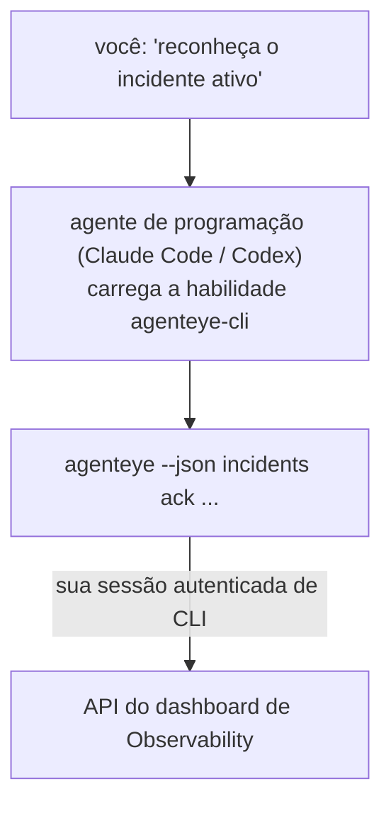

Pergunte ao seu agente de programação *"algo está quebrado hoje?"* e deixe-o responder com seus dados ao vivo do Failproof AI Observability, sem precisar memorizar comandos. A **habilidade de CLI do Failproof AI Observability** (`agenteye-cli`) é uma *Agent Skill*: uma pequena pasta de instruções que um agente de programação como Claude Code ou Codex carrega sob demanda. Ela ensina o agente a operar seu deployment de Observability por meio da [`agenteye` CLI](/pt-br/agenteye/cli) a partir de solicitações em linguagem natural como *"dê ao CI uma chave que só possa enviar eventos"* ou *"reconheça o incidente ativo e atribua-o a mim."*

Ela **não** é um serviço nem um binário separado; não há nada a fazer deploy. Funciona em cima da CLI que você já instalou: o agente executa `agenteye --json …`, interpreta o JSON limpo e responde em texto. Tudo o que ele consegue fazer, você poderia fazer digitando os mesmos comandos.

---

## Como ela se relaciona com as outras interfaces do Failproof AI Observability

O Failproof AI Observability oferece quatro formas de acessar os mesmos dados e controles. Elas se complementam:

| Interface | O que é | Onde roda | Use quando |
|---|---|---|---|
| **[CLI](/pt-br/agenteye/cli)** | A referência de comandos e flags do `agenteye` | Seu terminal | Você quer executar ou automatizar um comando específico |
| **[Receitas de CLI](/pt-br/agenteye/cli-recipes)** | Padrões `jq`/pipeline prontos para usar | Seu terminal / scripts | Você está integrando a CLI em automações |
| **Habilidade de CLI** (este doc) | Uma interface em linguagem natural sobre a CLI | Seu agente de programação, na sua estação de trabalho | Você quer *simplesmente perguntar* e deixar o agente escolher o comando |
| **[Habilidade de Evaluator](/pt-br/agenteye/evaluator-skill)** | Uma habilidade irmã que projeta e constrói seu serviço de pontuação | Seu agente de programação, na sua estação de trabalho | Você quer *produzir* pontuações de avaliação, não lê-las |
| **[Habilidade do Python SDK](/pt-br/agenteye/python-sdk-skill)** | Uma habilidade irmã que instrumenta seu agente para emitir telemetria | Seu agente de programação, na sua estação de trabalho | Você quer que seu agente *produza* os eventos que esta habilidade lê |
| **[Assistente de IA no dashboard](/pt-br/agenteye/assistant)** | Um chat incorporado no dashboard | Lado do servidor (no dashboard) | Você quer perguntas e respostas sobre seus dados dentro do dashboard |

A habilidade em si não tem privilégios próprios; ela apenas transforma suas palavras em chamadas de CLI que rodam como você:



### vs. o assistente de IA no dashboard: uma distinção importante

Estas são duas ferramentas diferentes com alcances de impacto muito distintos:

- O **assistente de IA no dashboard** ([assistente de IA](/pt-br/agenteye/assistant)) é um chat incorporado no dashboard, apoiado pelo serviço de agente. Ele é **somente leitura com criação sujeita a aprovação**: pode rascunhar queries salvas e dashboards, mas toda escrita é pausada para sua aprovação explícita com um clique, e ele nunca deleta. Requer a permissão `agent:use` e só acessa dados da org que você está visualizando.
- A **habilidade de CLI** roda na *sua* estação de trabalho, dentro do *seu* agente de programação, e opera a `agenteye` CLI **como você**. Ela pode executar a **superfície completa da CLI, incluindo mutações** (criar/rotacionar/desativar chaves de API, alterar configurações da org, resolver incidentes, deletar queries salvas), limitada apenas pelas permissões do seu login de CLI. Trate-a com exatamente o mesmo cuidado que teria ao digitar esses comandos manualmente.

---

## Pré-requisitos

1. A **`agenteye` CLI instalada** e no `PATH` (veja a referência da [CLI](/pt-br/agenteye/cli): `pipx install agenteye`).
2. Sua **URL do dashboard** configurada (`AGENTEYE_DASHBOARD_URL`, ou o agente passa `--base-url`).
3. Uma **sessão autenticada**: execute `agenteye login` você mesmo primeiro. A habilidade **não consegue** concluir o login com código enviado por e-mail por você; ela vai pedir que você execute `agenteye login` se a sessão estiver ausente ou expirada (código de saída `4` da CLI).

---

## Onde obtê-la

A habilidade está publicada na coleção pública de habilidades do Failproof AI:

**[github.com/FailproofAI/skills](https://github.com/FailproofAI/skills)** → [`skills/agenteye-cli/`](https://github.com/FailproofAI/skills/tree/main/skills/agenteye-cli)

Nada nela é restrito — o repositório é público e a habilidade não precisa de nenhuma credencial própria, pois ela apenas opera a `agenteye` CLI **pública** contra o *seu* dashboard, usando a sessão com a qual *você* fez login. Você não precisa pedir acesso a ninguém.

Note que ela é distribuída como sua própria pasta e **não** está dentro do pacote `pipx install agenteye`, então não a procure lá.

## Instalando a habilidade

O caminho mais rápido é a CLI [`skills`](https://skills.sh), que baixa a pasta e a coloca onde seu agente procura:

```bash
# Claude Code, somente este projeto
npx skills add FailproofAI/skills --skill agenteye-cli -a claude-code

# todos os projetos (instala em ~/.claude/skills/)
npx skills add FailproofAI/skills --skill agenteye-cli -a claude-code -g --copy

# Codex, em vez disso
npx skills add FailproofAI/skills --skill agenteye-cli -a codex
```

Em seguida, gerencie como qualquer outra habilidade:

```bash
npx skills list -a claude-code      # o que está instalado
npx skills update agenteye-cli      # baixar a versão mais recente
npx skills remove agenteye-cli      # remover
```

Prefere instalar manualmente? Uma Agent Skill é apenas uma pasta contendo um `SKILL.md` (mais referências opcionais), então copiar funciona também:

- **Claude Code**: coloque a pasta `agenteye-cli/` em `~/.claude/skills/` (todos os projetos) ou `<seu-repo>/.claude/skills/` (somente aquele repositório). Claude Code a descobre automaticamente — verifique com a lista `/skills`, ou simplesmente faça uma pergunta que corresponda à sua descrição.
- **Codex (OpenAI)**: o Codex lê o mesmo `SKILL.md`. O `agents/openai.yaml` incluso define `allow_implicit_invocation: true`, então o Codex seleciona a habilidade automaticamente quando uma tarefa corresponde; caso contrário, invoque-a explicitamente como `$agenteye-cli`.

---

## Segurança: mutações NÃO solicitam confirmação quando um agente executa a CLI

> **Atenção:** Leia isto antes de deixar um agente fazer alterações.

A `agenteye` CLI normalmente pergunta *"tem certeza?"* antes de uma ação destrutiva. Ela **pula automaticamente essa confirmação sempre que não está conectada a um terminal (que é exatamente como um agente de programação a executa), e `--json` também a pula.** Portanto, o prompt de segurança **não** será acionado para o agente.

A habilidade foi escrita para compensar isso: ela é instruída a declarar o comando exato que irá executar e obter seu **OK explícito antes de qualquer alteração de estado**. Mantenha essa disciplina. Quando você opera o Failproof AI Observability por meio de um agente, *você* é a etapa de confirmação. Os comandos que alteram estado para observar:

- `keys create` / `update` / `disable` / `regenerate`
- `users create` / `update` / `disable` / `enable`
- `settings set`
- `alerts create` / `update` / `delete` / `test`
- os subcomandos de escrita de `incidents`: `ack` / `assign` / `resolve` / `open` / `comment-add` / `comment-delete` / `subscribe` / `unsubscribe`
- `query create` / `update` / `delete`
- `agent rename` / `delete`
- `orgs switch`

Tudo em **Observe** (`events`, `sessions`, `evals`, `errors`, `list`, `whoami`, `orgs list/current/perms`) é somente leitura e não altera nada.

Como o agente age **como você**, ele só pode fazer o que seu login tem permissão para fazer; as permissões são resolvidas **por org** (consulte [chaves de API](/pt-br/agenteye/api-keys)). Um comando para o qual você não tem permissão retorna o código de saída `5` com o nome exato da permissão, para que o agente possa dizer exatamente o que pedir a um administrador, em vez de falhar de forma opaca.

---

## O que você pode perguntar

Veja como uma interação real funciona — uma leitura, depois uma alteração que aguarda seu OK:

```text
você   ▸ Algo está quebrado no último dia?

agente ▸ Executando: agenteye --json errors --since 24h --aggregate
         3 tipos de erro nas últimas 24h. O maior é TimeoutError
         (18 ocorrências, todas no checkout-agent), depois RateLimited (5).
         Quer ver as sessões com falha para TimeoutError?

você   ▸ Dê ao CI uma chave que só possa enviar eventos.

agente ▸ Isso cria uma chave de API. Vou executar:
           agenteye keys create ci --add events:add
         Pode prosseguir?

você   ▸ sim

agente ▸ Pronto. Chave "ci" criada com events:add apenas.
         O segredo é exibido só uma vez, então guarde agora. Não consigo reexibi-lo.
```

A habilidade mapeia cada intenção em linguagem natural para o comando `agenteye` correto, descobrindo valores válidos primeiro (`list <kind>`, `whoami`) para não adivinhar, e declarando o comando exato antes de qualquer alteração. Mais exemplos:

- *"Algo está quebrado / falhando nas últimas 24 horas?"* → `errors --since 24h --aggregate`, depois um detalhamento.
- *"Por que a sessão `run-001` falhou?"* → `events --session-id run-001 --all` + `evals --session-id run-001`.
- *"Como está a tendência de qualidade esta semana?"* → `evals --aggregate --since 7d`, depois aprofunde nas execuções com pontuação baixa.
- *"Dê ao CI uma chave que só possa enviar eventos."* → `keys create ci --add events:add` (declara o comando, depois cria e captura o segredo exibido uma única vez).
- *"Quem tem acesso? Torne a Dana somente leitura."* → `users list` → `users update dana@… --permission-set read-only` (após confirmar com você).
- *"Reconheça o incidente ativo e atribua-o a mim."* → `incidents list --state firing` → `incidents ack <id>` / `incidents assign <id> voce@…`.

Para os comandos exatos, flags e formatos JSON por trás desses exemplos, consulte a referência da [CLI](/pt-br/agenteye/cli) e as [receitas de CLI para agentes](/pt-br/agenteye/cli-recipes).

---

## Próximos passos

- **[CLI](/pt-br/agenteye/cli)**: referência completa de comandos e flags do `agenteye`.
- **[Receitas de CLI para agentes](/pt-br/agenteye/cli-recipes)**: padrões `jq` prontos para usar e tratamento de códigos de saída.
- **[Habilidade de agente Evaluator](/pt-br/agenteye/evaluator-skill)**: a habilidade irmã, para construir o evaluator cujas pontuações `agenteye evals` lê.
- **[Habilidade de agente do Python SDK](/pt-br/agenteye/python-sdk-skill)**: a habilidade irmã, para instrumentar um agente de forma que ele emita a telemetria que `agenteye` lê.
- **[Assistente de IA](/pt-br/agenteye/assistant)**: o assistente no dashboard (não confundir com esta habilidade de terminal).
- **[Chaves de API](/pt-br/agenteye/api-keys)**: o modelo de permissões por org que delimita o que a habilidade pode fazer.