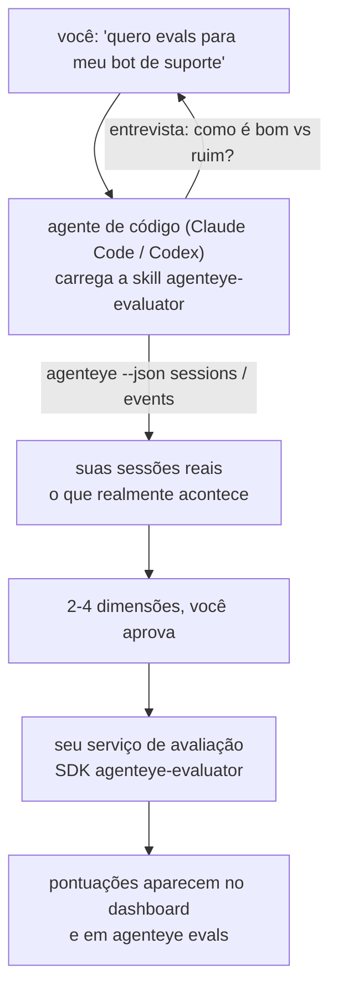

Vá de *"acho que nosso agente às vezes erra"* a um serviço de pontuação em produção, com seu agente de código tanto decidindo o que avaliar quanto construindo o serviço. A **skill de avaliador de Observabilidade do Failproof AI** (`agenteye-evaluator`) é uma *Agent Skill*: uma pequena pasta de instruções que um agente de código como Claude Code ou Codex carrega sob demanda. Ela ensina o agente a determinar quais dimensões de qualidade valem a pena monitorar para o *seu* agente, e depois escrever, testar e implantar o [serviço de avaliação](/pt-br/agenteye/evaluation-suite) que as pontua.

Ela **não** é um pontuador hospedado, um registro para o qual você faz upload, nem um sistema de plugins. Seu avaliador continua sendo seu próprio serviço HTTP na sua própria infraestrutura, exatamente conforme descrito no guia de [Suíte de avaliação](/pt-br/agenteye/evaluation-suite). A skill apenas ensina seu agente a construí-lo bem — tudo o que ela faz, você mesmo poderia fazer escrevendo o mesmo código.

---

## A parte difícil é decidir o que pontuar

A superfície do SDK é pequena — um decorator e dois models — e um agente consegue escrever isso a partir do [contrato](/pt-br/agenteye/evaluation-suite#http-contract) sozinho. Esse não é o ponto onde os avaliadores falham. Eles falham porque pontuam a coisa errada, e um avaliador que pontua a coisa errada é pior do que nenhum: ele produz um dashboard que todos aprendem a ignorar.

Por isso, a maior parte da skill é a etapa anterior a qualquer código. Ela faz o agente te entrevistar (*"descreva uma execução que correu bem; agora uma que correu mal"*), depois puxa suas sessões reais pela [CLI `agenteye`](/pt-br/agenteye/cli) e as lê do início ao fim. As duas metades costumam discordar, e essa lacuna é o ponto central: o que você pretende medir versus o que suas transcrições conseguem de fato suportar. Uma dimensão só sobrevive se for **computável** a partir dos eventos e **discriminante** — se ela pontua 0,9 tanto na sua execução boa quanto na ruim, não ensina nada e é descartada.

O resultado é uma proposta de 2 a 4 dimensões com o raciocínio anexado, para você aprovar antes de qualquer linha ser escrita.



---

## Como se relaciona com as outras peças de avaliação

Quatro documentos cobrem pontuação, e eles se passam a tocha em ordem:

| Página | O que é | Use quando |
|---|---|---|
| **[Avaliações](/pt-br/agenteye/evaluations)** | O recurso: pontuações na grade de sessões, dashboards, re-avaliação | Você quer saber o que a pontuação automática oferece |
| **[Suíte de avaliação](/pt-br/agenteye/evaluation-suite)** | O contrato HTTP, o SDK, as variáveis de ambiente do servidor | Você está implementando ou depurando o avaliador por conta própria |
| **Skill de avaliador** (este doc) | Uma porta de entrada em linguagem natural para projetar *e* construir o pontuador | Você quer ir de "quero evals" a um serviço em execução |
| **[CLI skill](/pt-br/agenteye/cli-skill)** | Uma porta de entrada em linguagem natural para a CLI `agenteye` | Você quer *ler* as pontuações que já possui |
| **[Python SDK skill](/pt-br/agenteye/python-sdk-skill)** | Uma porta de entrada em linguagem natural para instrumentar seu agente | Seu agente ainda não emite sessões — não há nada para pontuar |

### vs. a CLI skill: construir versus ler

As duas skills são deliberadamente não-sobrepostas, e instalar ambas é a configuração normal — o agente escolhe entre elas com base no que você pede:

- **`agenteye-evaluator`** (este doc) constrói o que *produz* pontuações. Seu trabalho termina quando as pontuações chegam pela primeira vez.
- **[`agenteye-cli`](/pt-br/agenteye/cli-skill)** lê pontuações que já existem (`agenteye evals`). *"A qualidade caiu esta semana?"* é a pergunta dela, não desta skill.

---

## Pré-requisitos

1. A **CLI `agenteye` instalada e autenticada** (`pipx install agenteye`, depois `agenteye login`). A skill a utiliza duas vezes: para puxar as sessões reais contra as quais projeta, e para confirmar que suas pontuações chegaram no final. Seu login precisa de `events:read`, mais `evaluations:read` para essa verificação final. Assim como com a CLI skill, ela **não consegue** completar o login com código de uso único enviado por e-mail por você.
2. **Um lugar para o avaliador residir.** Ele é construído em uma imagem e executado como um serviço de longa duração, então precisa de um repositório real, não de um arquivo temporário. Avaliadores frequentemente residem em seu próprio repositório, separado do agente sendo pontuado — a skill procura um existente e pergunta antes de criar um novo.
3. **O wheel do SDK `agenteye-evaluator`** — leia a próxima seção antes de deixar seu agente começar a digitar comandos `pip`.

---

## Onde obtê-la

A skill está publicada na coleção pública de skills do Failproof AI:

**[github.com/FailproofAI/skills](https://github.com/FailproofAI/skills)** → [`skills/agenteye-evaluator/`](https://github.com/FailproofAI/skills/tree/main/skills/agenteye-evaluator)

O repositório é público e a skill não precisa de credenciais próprias — ela apenas aciona a CLI `agenteye` com a sessão em que *você* se autenticou, e escreve código no *seu* repositório. Note que ela é publicada como sua própria pasta e **não** está dentro do pacote `pipx install agenteye`, então não a procure lá.

## Instalando a skill

O caminho mais rápido é a CLI [`skills`](https://skills.sh), que busca a pasta e a coloca onde seu agente procura:

```bash
# Claude Code, somente este projeto
npx skills add FailproofAI/skills --skill agenteye-evaluator -a claude-code

# todos os projetos (instala em ~/.claude/skills/)
npx skills add FailproofAI/skills --skill agenteye-evaluator -a claude-code -g --copy

# Codex em vez disso
npx skills add FailproofAI/skills --skill agenteye-evaluator -a codex
```

Depois gerencie-a como qualquer outra skill:

```bash
npx skills list -a claude-code           # o que está instalado
npx skills update agenteye-evaluator     # obter a versão mais recente
npx skills remove agenteye-evaluator     # remover
```

Prefere instalar manualmente? Uma Agent Skill é apenas uma pasta contendo um `SKILL.md` (mais referências opcionais), então copiá-la também funciona:

- **Claude Code**: coloque a pasta `agenteye-evaluator/` em `~/.claude/skills/` (todos os projetos) ou `<seu-repo>/.claude/skills/` (somente aquele repositório). Claude Code a descobre automaticamente — verifique com a lista `/skills`, ou simplesmente peça por evals.
- **Codex (OpenAI)**: o Codex lê o mesmo `SKILL.md`. O arquivo `agents/openai.yaml` incluído define `allow_implicit_invocation: true`, então o Codex seleciona automaticamente a skill quando uma tarefa se encaixa; caso contrário, invoque-a explicitamente como `$agenteye-evaluator`.

---

## O SDK não está no PyPI público

> **Aviso:** Leia isso antes de deixar um agente instalar o SDK.

A skill é pública; o SDK que ela aciona não é. `agenteye-evaluator` é publicado apenas como um artefato de release privado, e diferente do `agenteye`, o nome está **sem dono no PyPI público** — então um simples `pip install agenteye-evaluator` poderia puxar o pacote de um desconhecido para o serviço que lê suas transcrições de produção. Isso é um problema de cadeia de suprimentos, não um erro de digitação.

A skill sabe disso e percorre uma escada de instalação, parando no primeiro degrau que se aplica: o código-fonte do monorepo se você estiver dentro do repositório AgentEye, caso contrário o wheel de release privado do GitHub Releases (requer acesso), e se nenhum dos dois estiver acessível ela **para e te diz para pedir o wheel ao seu contato do Failproof AI** em vez de improvisar.

Portanto, se seu agente propõe um `pip install agenteye-evaluator` direto do PyPI público, isso é sinal de que a skill nunca foi carregada. Pare ali e verifique se ela está instalada.

---

## O que você pode pedir

Uma rodada real começa com um pedido vago e termina com um design aprovado, não com código:

```text
você  ▸ Quero evals para nosso bot de suporte. Acho que ele às vezes erra.

agente▸ Antes de escrever qualquer coisa: descreva uma execução que correu
        bem, e uma que correu mal.

você  ▸ Bem: ele responde com base na documentação. Mal: ele inventa coisas,
        ou desiste e diz "entre em contato com o suporte".

agente▸ Executando: agenteye --json sessions --status error --since 7d
        Lendo 5 sessões, incluindo duas que você chamaria de ruins.

        Suas palavras dizem factualidade e esquiva. As transcrições
        concordam com esquiva (2 de 5 terminam com transferência para
        suporte, e está claro em model_response.content), mas factualidade
        precisa de um ground truth que seus eventos não contêm.

        Então eu pontuaria três coisas:
          - deflection      regras, barato, separa suas duas execuções
          - tool_efficiency regras, detecta o loop de retry na run-004
          - groundedness    juiz LLM: cada afirmação está nos docs recuperados?

        "factuality" precisaria de ground truth que não temos; groundedness
        é o mais próximo que suas transcrições conseguem suportar de fato.
        OK com esses três nomes? Renomear depois divide o histórico.

você  ▸ sim

agente▸ Nenhum avaliador neste repositório. Devo criar a estrutura aqui, ou
        você tem um em outro lugar?
```

A partir daí, ele escreve primeiro as dimensões baseadas em regras (gratuitas, instantâneas, determinísticas), testa-as contra uma sessão real capturada — incluindo as vazias e as que nunca terminaram, que travam avaliadores ingênuos — e só recorre a um juiz LLM para a dimensão subjetiva. Ele conhece os [limites do dispatcher](/pt-br/agenteye/evaluation-suite#configuring-the-server) — um timeout de requisição de 30s e 8 chamadas concorrentes em todo o deployment — então se o juiz não couber de forma confiável, ele vai assíncrono com `JobPending` em vez de deixar seu juiz ser cancelado e reexecutado cinco vezes com cinco vezes o custo.

Depois ele implanta, define as duas variáveis de ambiente do servidor, e confirma com `agenteye --json evals --session-id <id>` que as pontuações realmente chegaram. As pontuações chegando é a única prova.

---

## O que observar

- **Nomes de dimensão são quase permanentes.** Chaves de pontuação são strings arbitrárias e a plataforma rastreia tendências de tudo o que você envia, o que significa que nada downstream corrige uma escolha ruim. Renomeie depois e o histórico se divide: sessões antigas mantêm a chave antiga e a tendência se rompe. É por isso que a skill exige aprovação explícita antes de escrever código — leve esse prompt a sério.
- **Fixtures são transcrições reais de produção.** Projetar contra sessões reais significa puxá-las para o disco, e elas podem conter dados de clientes. A skill pergunta antes de fazer commit delas no git; em caso de dúvida, mantenha `fixtures/` fora do repositório e faça com que cada desenvolvedor puxe as suas próprias.
- **O agente escreve e implanta um serviço que lê cada transcrição.** Ele age como você, limitado pelas permissões do seu login na CLI, mas revise o avaliador como qualquer outro código que toca dados de produção.

---

## Próximos passos

- **[Suíte de avaliação](/pt-br/agenteye/evaluation-suite)**: o contrato HTTP, o SDK e as variáveis de ambiente do servidor que a skill configura.
- **[Avaliações](/pt-br/agenteye/evaluations)**: onde as pontuações aparecem depois de chegarem.
- **[CLI skill](/pt-br/agenteye/cli-skill)**: a skill irmã, para ler resultados em vez de construir o pontuador.
- **[CLI](/pt-br/agenteye/cli)**: a referência de comandos por trás dos dados de sessão contra os quais a skill projeta.