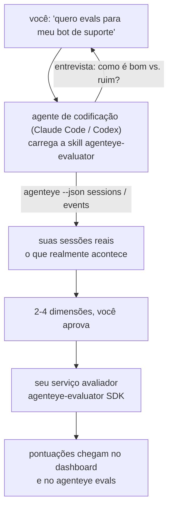

Passe de *"acho que nosso agente às vezes falha"* a um serviço de pontuação em produção, com seu agente de codificação cuidando tanto das decisões quanto da construção. A **skill de avaliador de Observabilidade Failproof AI** (`agenteye-evaluator`) é uma *Agent Skill*: uma pequena pasta de instruções que um agente de codificação como Claude Code ou Codex carrega sob demanda. Ela ensina o agente a identificar quais dimensões de qualidade valem a pena monitorar no *seu* agente, e então escrever, testar e implantar o [serviço avaliador](/pt-br/agenteye/evaluation-suite) que as pontua.

**Não** se trata de um pontuador hospedado, um registro para upload, nem um sistema de plugins. Seu avaliador continua sendo seu próprio serviço HTTP na sua própria infraestrutura, exatamente como descrito no guia do [Evaluation suite](/pt-br/agenteye/evaluation-suite). A skill apenas ensina seu agente a construí-lo bem — tudo que ela faz, você poderia fazer escrevendo o mesmo código.

---

## A parte difícil é decidir o que pontuar

A superfície do SDK é pequena — um decorator e dois modelos — e um agente consegue escrevê-la a partir do [contrato](/pt-br/agenteye/evaluation-suite#http-contract) sozinho. O problema não está aí. Os avaliadores falham porque pontuam a coisa errada, e um avaliador que pontua a coisa errada é pior do que nenhum: ele gera um dashboard que todos aprendem a ignorar.

Por isso, a maior parte da skill é dedicada à etapa anterior a qualquer código. Ela faz o agente entrevistar você (*"descreva uma execução que correu bem; agora uma que correu mal"*), depois puxa suas sessões reais pelo [`agenteye` CLI](/pt-br/agenteye/cli) e as lê de ponta a ponta. Essas duas metades geralmente divergem, e a lacuna é exatamente o ponto: o que você pretende medir versus o que suas transcrições conseguem de fato suportar. Uma dimensão só sobrevive se for **computável** a partir dos eventos e **discriminatória** — se pontua 0,9 tanto na sua execução boa quanto na ruim, não ensina nada e é descartada.

O resultado é uma proposta de 2 a 4 dimensões com o raciocínio anexado, para você aprovar antes que uma linha seja escrita.



---

## Como se relaciona com as outras peças de avaliação

Quatro documentos cobrem pontuação, e eles se encadeiam nesta ordem:

| Página | O que é | Acesse quando |
|---|---|---|
| **[Evaluations](/pt-br/agenteye/evaluations)** | O recurso: pontuações na grade de sessões, dashboards, reavaliação | Você quer saber o que a pontuação automática oferece |
| **[Evaluation suite](/pt-br/agenteye/evaluation-suite)** | O contrato HTTP, o SDK, as variáveis de ambiente do servidor | Você está implementando ou depurando o avaliador por conta própria |
| **Evaluator skill** (este doc) | Uma porta de entrada em linguagem natural para projetar *e* construir o pontuador | Você quer ir de "quero evals" a um serviço em execução |
| **[CLI skill](/pt-br/agenteye/cli-skill)** | Uma porta de entrada em linguagem natural para o `agenteye` CLI | Você quer *ler* as pontuações que já possui |
| **[Python SDK skill](/pt-br/agenteye/python-sdk-skill)** | Uma porta de entrada em linguagem natural para instrumentar seu agente | Seu agente ainda não emite sessões — não há nada para pontuar |

### vs. a CLI skill: construir versus ler

As duas skills são deliberadamente complementares, e instalar ambas é o setup padrão — o agente escolhe entre elas com base no que você pede:

- **`agenteye-evaluator`** (este doc) constrói o que *produz* pontuações. Seu trabalho termina quando as pontuações chegam pela primeira vez.
- **[`agenteye-cli`](/pt-br/agenteye/cli-skill)** lê pontuações que já existem (`agenteye evals`). *"A qualidade caiu esta semana?"* é a pergunta dela, não desta skill.

---

## Pré-requisitos

1. **`agenteye` CLI instalado e autenticado** (`pipx install agenteye`, depois `agenteye login`). A skill o utiliza em dois momentos: para buscar as sessões reais contra as quais projeta, e para confirmar que suas pontuações chegaram ao final. Seu login precisa de `events:read`, mais `evaluations:read` para essa verificação final. Assim como a CLI skill, ela **não consegue** concluir o login por código único enviado por e-mail no seu lugar.
2. **Um lugar para o avaliador residir.** Ele é empacotado em uma imagem e executado como um serviço de longa duração, então precisa de um repositório real, não de um arquivo temporário. Avaliadores frequentemente ficam em seu próprio repositório, separado do agente sendo pontuado — a skill procura um existente e pergunta antes de criar um novo.
3. **O wheel do SDK `agenteye-evaluator`** — leia a próxima seção antes de deixar o agente começar a digitar comandos `pip`.

---

## Como obtê-lo

A skill está publicada na coleção pública de skills da Failproof AI:

**[github.com/FailproofAI/skills](https://github.com/FailproofAI/skills)** → [`skills/agenteye-evaluator/`](https://github.com/FailproofAI/skills/tree/main/skills/agenteye-evaluator)

O repositório é público e a skill não precisa de credencial própria — ela apenas aciona o `agenteye` CLI com a sessão em que *você* está autenticado, e escreve código no *seu* repositório. Observe que ela vem como sua própria pasta e **não** está incluída no pacote `pipx install agenteye`, portanto não a procure lá.

## Instalando a skill

O caminho mais rápido é o CLI [`skills`](https://skills.sh), que busca a pasta e a coloca onde seu agente procura:

```bash
# Claude Code, somente este projeto
npx skills add FailproofAI/skills --skill agenteye-evaluator -a claude-code

# todo projeto (instala em ~/.claude/skills/)
npx skills add FailproofAI/skills --skill agenteye-evaluator -a claude-code -g --copy

# Codex em vez disso
npx skills add FailproofAI/skills --skill agenteye-evaluator -a codex
```

Em seguida, gerencie como qualquer outra skill:

```bash
npx skills list -a claude-code           # o que está instalado
npx skills update agenteye-evaluator     # baixar a versão mais recente
npx skills remove agenteye-evaluator     # remover
```

Prefere instalar manualmente? Uma Agent Skill é apenas uma pasta contendo um `SKILL.md` (mais referências opcionais), então copiá-la também funciona:

- **Claude Code**: coloque a pasta `agenteye-evaluator/` em `~/.claude/skills/` (todo projeto) ou `<seu-repo>/.claude/skills/` (apenas aquele repositório). Claude Code a descobre automaticamente — verifique com a lista `/skills`, ou simplesmente peça por evals.
- **Codex (OpenAI)**: o Codex lê o mesmo `SKILL.md`. O `agents/openai.yaml` incluído define `allow_implicit_invocation: true`, então o Codex seleciona a skill automaticamente quando uma tarefa corresponde; caso contrário, invoque explicitamente como `$agenteye-evaluator`.

---

## O SDK não está no PyPI público

> **Atenção:** Leia isto antes de deixar um agente instalar o SDK.

A skill é pública; o SDK que ela aciona não é. O `agenteye-evaluator` é distribuído apenas como artefato de release privado e, diferentemente do `agenteye`, o nome está **sem registro no PyPI público** — então um simples `pip install agenteye-evaluator` poderia puxar o pacote de um desconhecido para o serviço que lê suas transcrições de produção. Isso é um problema de segurança de cadeia de suprimentos, não um erro de digitação.

A skill sabe disso e percorre uma sequência de instalação em vez disso, parando no primeiro passo que se aplica: o código-fonte do monorepo se você estiver dentro do repositório AgentEye, caso contrário o wheel de release privado do GitHub Releases (requer acesso) e, se nenhum estiver acessível, ela **para e instrui você a pedir o wheel ao seu contato na Failproof AI** em vez de improvisar.

Portanto, se seu agente propuser um simples `pip install agenteye-evaluator` do PyPI público, isso é sinal de que a skill nunca foi carregada. Pare ali e verifique se ela está instalada.

---

## O que você pode pedir

Uma rodada completa começa com uma solicitação vaga e termina com um design aprovado, não com código:

```text
você  ▸ Quero evals para nosso bot de suporte. Acho que ele às vezes falha.

agente▸ Antes de escrever qualquer coisa: descreva uma execução que correu bem,
        e uma que correu mal.

você  ▸ Boa: ele responde com base nos documentos. Ruim: ele inventa coisas,
        ou desiste e diz "entre em contato com o suporte".

agente▸ Executando: agenteye --json sessions --status error --since 7d
        Lendo 5 sessões, incluindo duas que você chamaria de ruins.

        Suas palavras dizem factualidade e desvio. As transcrições
        concordam com desvio (2 de 5 terminam com transferência para suporte,
        e isso é evidente em model_response.content), mas factualidade
        exige uma verdade fundamental que seus eventos não carregam.

        Então eu pontuaria três coisas:
          - deflection      regras, barato, separa suas duas execuções
          - tool_efficiency regras, captura o loop de retry em run-004
          - groundedness    juiz LLM: cada afirmação está nos documentos recuperados?

        "factuality" precisaria de verdade fundamental que não temos; groundedness
        é o mais próximo que suas transcrições conseguem suportar de fato.
        Tudo bem com esses três nomes? Renomear depois divide o histórico.

você  ▸ sim

agente▸ Nenhum avaliador neste repositório. Devo criar um aqui, ou você
        tem um em outro lugar?
```

A partir daí, ele escreve as dimensões baseadas em regras primeiro (gratuitas, instantâneas, determinísticas), as testa contra uma sessão real capturada — incluindo as vazias e as que nunca terminaram, que travam avaliadores ingênuos — e só recorre a um juiz LLM na dimensão subjetiva. Ele conhece os [limites do dispatcher](/pt-br/agenteye/evaluation-suite#configuring-the-server) — timeout de requisição de 30s e 8 chamadas concorrentes em toda a implantação — então, se o juiz não couber de forma confiável, vai assíncrono com `JobPending` em vez de deixar seu juiz ser cancelado e repetido cinco vezes com cinco vezes o custo.

Em seguida, implanta, define as duas variáveis de ambiente do servidor, e confirma com `agenteye --json evals --session-id <id>` que as pontuações realmente chegaram. Pontuações chegando é a única prova.

---

## O que observar

- **Nomes de dimensão são quase permanentes.** As chaves de pontuação são strings arbitrárias e a plataforma rastreia tendências de tudo que você envia, o que significa que nada downstream corrige uma escolha ruim. Renomeie depois e o histórico se divide: sessões antigas mantêm a chave antiga e a tendência quebra. É por isso que a skill obtém aprovação explícita antes de escrever código — leve esse prompt a sério.
- **Os fixtures são transcrições reais de produção.** Projetar contra sessões reais significa baixá-las para o disco, e elas podem conter dados de clientes. A skill pergunta antes de commitá-las no git; na dúvida, mantenha `fixtures/` fora do repositório e peça para cada desenvolvedor baixar as suas próprias.
- **O agente escreve e implanta um serviço que lê cada transcrição.** Ele age como você, delimitado pelas permissões do seu login de CLI, mas revise o avaliador como qualquer outro código que acessa dados de produção.

---

## Próximos passos

- **[Evaluation suite](/pt-br/agenteye/evaluation-suite)**: o contrato HTTP, o SDK e as variáveis de ambiente do servidor que a skill configura.
- **[Evaluations](/pt-br/agenteye/evaluations)**: onde as pontuações aparecem assim que chegam.
- **[CLI skill](/pt-br/agenteye/cli-skill)**: a skill irmã, para ler resultados em vez de construir o pontuador.
- **[CLI](/pt-br/agenteye/cli)**: a referência de comandos por trás dos dados de sessão contra os quais a skill projeta.