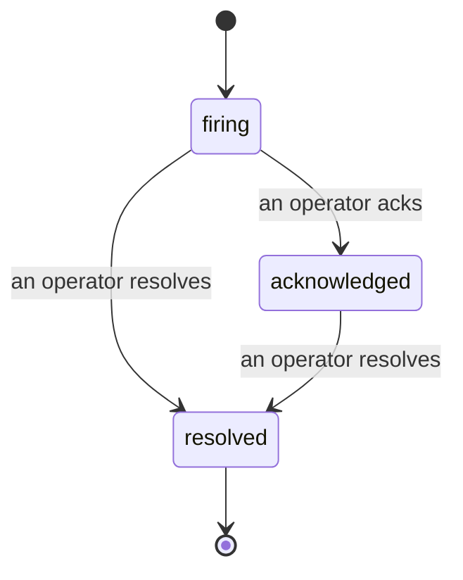

Quando um alerta dispara, a primeira pergunta é sempre "quem está cuidando disso?" Os Incidentes respondem isso: no momento em que algo ultrapassa um limite, todos podem ver que o incidente está aberto, quem é o responsável e exatamente o que aconteceu até agora, com um registro limpo e atribuído que você pode levar direto para o post-mortem.

*A caixa de entrada agrupa os incidentes abertos por estado e filtra por severidade e responsável, para que você veja o que precisa de atenção humana agora.*

## Saiba quem está cuidando, de imediato

Chega de "alguém está olhando pra isso?" em uma thread de chat. Uma violação abre um incidente automaticamente e o coloca em uma caixa de entrada compartilhada, agrupada por estado. Reconheça-o e seu nome fica visível, para que o restante da equipe saiba que está sendo tratado. O reconhecimento é compartilhado: vários operadores podem reconhecer o mesmo incidente e cada um é registrado individualmente, então um war room completo aparece por nome em vez de se sobrepor. Atribua um responsável para o triagem e filtre a caixa de entrada por severidade ou responsável para ver somente o que é seu.

## A história completa, em uma única linha do tempo

Quando o incidente termina, você já tem o resumo do ocorrido. Abra qualquer incidente e você terá a evidência da violação, seus responsáveis e assinantes, uma thread de comentários para coordenação no local e uma linha do tempo de atividades somente de acréscimo.

*Tudo o que aconteceu, em ordem, cada linha assinada por quem a executou.*

Cada ação (aberto, reconhecido, resolvido, entre outras) é registrada nessa linha do tempo e nunca é editada. Cada entrada é atribuída: ao operador que a executou, por e-mail, ou como **automated** para qualquer coisa que o Failproof AI Observability fez por conta própria, como abrir o incidente na violação. Nada é anônimo e nada se perde, então o post-mortem praticamente se escreve sozinho.

## Como um incidente evolui

- **Aberto (firing):** a violação abre o incidente e notifica seus canais uma vez. Violações repetidas são incorporadas ao mesmo incidente e atualizam suas evidências em vez de notificá-lo repetidamente.
- **Reconhecido:** um operador assume o caso. Ele permanece aberto e violações posteriores atualizam as evidências silenciosamente.
- **Resolvido:** um operador o encerra. A resolução automática quando a condição é normalizada está planejada, mas ainda não está ativada, portanto um incidente permanece aberto até que um humano o resolva — o que mantém todos honestos sobre o que de fato foi normalizado. Um novo incidente pode ser aberto no mesmo alerta posteriormente.

Um alerta comporta no máximo um incidente aberto por vez, então uma regra instável não pode te enterrar em duplicatas. Você também pode abrir um incidente manualmente: um independente para algo que nenhum alerta capturou, ou um vinculado a um alerta existente, caso você tenha `incidents:write`.

## Onde encontrar

Os incidentes ficam em `/<org-slug>/incidents`. A visualização requer **`incidents:read`**; abrir um incidente manual requer **`incidents:write`**; reconhecer, atribuir, comentar e resolver requerem **`incidents:ack`**. Chaves mais antigas que concediam a permissão descontinuada `alerts:ack` continuam funcionando, pois ela é reconhecida como `incidents:ack`, então seu esquema de plantão não precisa ser reemitido.

## Relacionados

- [Alertas](/pt-br/agenteye/alerts): as regras que abrem estes incidentes quando um limite é ultrapassado.
- [Rastreamento de erros](/pt-br/agenteye/error-tracking): veja todas as falhas em um só lugar e promova uma delas a um alerta.
- [Auditorias](/pt-br/agenteye/audits): o analista agendado que encontra as falhas que nenhuma regra estava monitorando.