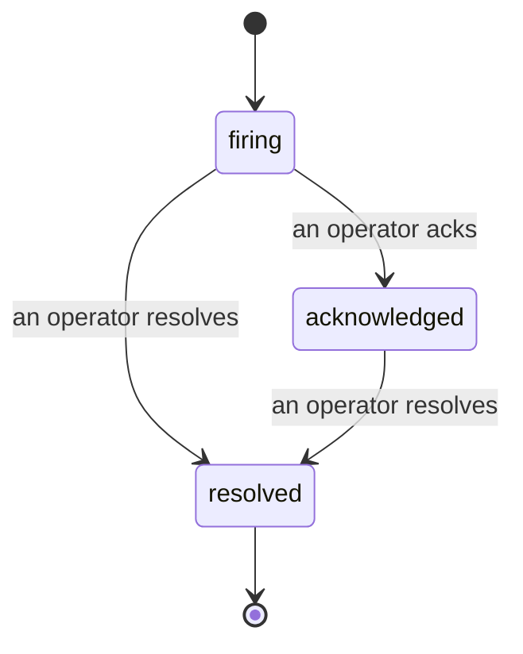

Quando um alerta é disparado, a primeira pergunta é sempre "quem está cuidando disso?" Os incidentes respondem a isso: no momento em que algo ultrapassa o limite, todos podem ver que o incidente está aberto, quem é o responsável e exatamente o que aconteceu até agora, com um registro limpo e atribuído que você pode passar diretamente para uma análise pós-incidente.

*A caixa de entrada agrupa incidentes abertos por estado e filtra por severidade e responsável, para que você veja o que precisa de atenção humana agora.*

## Saiba quem está cuidando, de um só olhar

Chega de "alguém está olhando para isso?" em uma thread de chat. Uma violação abre um incidente automaticamente e o coloca em uma caixa de entrada compartilhada, agrupada por estado. Reconheça o incidente e seu nome fica vinculado a ele, para que o restante da equipe saiba que está sendo tratado. O reconhecimento é compartilhado: vários operadores podem reconhecer o mesmo incidente e cada um é registrado individualmente, então uma sala de guerra inteira aparece por nome em vez de pisar uns nos outros. Atribua um responsável para triagem e filtre a caixa de entrada por severidade ou responsável para ver apenas o que é seu.

## A história completa, em uma única linha do tempo

Quando o incidente terminar, você já tem o relatório. Abra qualquer incidente e você terá as evidências da violação, seus responsáveis e assinantes, um thread de comentários para coordenação no lugar e uma linha do tempo de atividades somente para adição.

*Tudo o que aconteceu, em ordem, cada linha assinada por quem a executou.*

Toda ação (aberto, reconhecido, resolvido e assim por diante) é gravada nessa linha do tempo e nunca é editada. Cada entrada é atribuída: ao operador que a realizou, por e-mail, ou como **automated** para qualquer coisa que o Failproof AI Observability fez por conta própria, como abrir o incidente na violação. Nada é anônimo e nada se perde, então a análise pós-incidente praticamente se escreve sozinha.

## Como um incidente evolui

- **Aberto (firing):** a violação abre o incidente e notifica seus canais uma vez. Violações repetidas são agrupadas no mesmo incidente e atualizam suas evidências em vez de notificá-lo repetidamente.
- **Reconhecido (acknowledged):** um operador assume o controle. Permanece aberto e violações posteriores atualizam as evidências silenciosamente.
- **Resolvido (resolved):** um operador fecha o incidente. A resolução automática quando a condição é normalizada está planejada, mas ainda não habilitada, então um incidente permanece aberto até que um humano o resolva — o que mantém todos honestos sobre o que realmente foi resolvido. Um novo incidente pode ser aberto no mesmo alerta posteriormente.

Um alerta mantém no máximo um incidente aberto por vez, então uma regra instável não pode te enterrar em duplicatas. Você também pode abrir um incidente manualmente: um independente para algo que nenhum alerta capturou, ou um vinculado a um alerta existente, se você tiver `incidents:write`.

## Onde encontrar

Incidentes ficam em `/<org-slug>/incidents`. A visualização requer **`incidents:read`**; abrir um incidente manual requer **`incidents:write`**; reconhecer, atribuir, comentar e resolver requerem **`incidents:ack`**. Chaves antigas que concediam o `alerts:ack` descontinuado continuam funcionando, pois ele é reconhecido como `incidents:ack`, então sua rotação de plantão não precisa ser reemitida.

## Relacionados

- [Alertas](/pt-br/agenteye/alerts): as regras que abrem esses incidentes quando um limite é ultrapassado.
- [Rastreamento de erros](/pt-br/agenteye/error-tracking): veja todas as falhas em um único lugar e promova uma para um alerta.
- [Auditorias](/pt-br/agenteye/audits): o analista agendado que encontra as falhas que nenhuma regra estava monitorando.