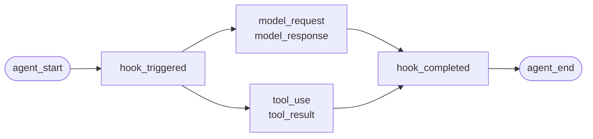
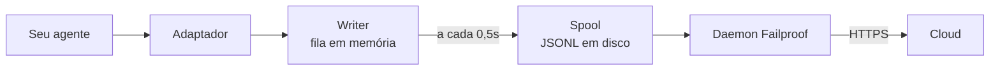

Para um agente que você escreveu, ou um framework sem adaptador no Failproof AI. Não há nada a instrumentar: você emite os eventos.

Esta é a mesma API que os quatro adaptadores de framework utilizam por baixo dos panos. Eles são tabelas de tradução sobre ela.

## Instalação

```bash
pip install failproofai-sdk
```

Sem extras e sem dependências.

## Instrumentação

```python
import failproofai_sdk

failproofai_sdk.configure(environment="production")

with failproofai_sdk.session():                 # uma execução
    with failproofai_sdk.agent("planner"):      # uma unidade de trabalho
        with failproofai_sdk.tool_call("search", input={"q": q}) as t:
            t.output = search(q)                # uma chamada de ferramenta
```

Leia de cima para baixo e o código diz exatamente o que significa:

| Envolva em | Para dizer |
| --- | --- |
| `session()` | Esses eventos pertencem à mesma execução |
| `agent()` | Algo está realizando trabalho — dê um nome que você reconheceria em uma lista |
| `tool_call()` | Esta é uma ferramenta, e aqui está o que ela retornou |

E o que cada um realmente emite:

| Escopo | Emite | Propósito |
| --- | --- | --- |
| `session()` | Nada | Vincula um id de sessão, agrupando uma execução |
| `agent()` | `agent_start`, `agent_end` | Delimita uma unidade de trabalho |
| `tool_call()` | `tool_use`, `tool_result` | Delimita uma ferramenta e a mede |

Tudo dentro pode omitir `session_id` e `agent_id`. Os escopos vinculam identidade em variáveis de contexto e toda chamada de evento lê de volta, então você nunca precisa passar ids pelas suas funções.

Os três funcionam com `async with` assim como com `with`.

Aninhar agentes constrói a árvore. `parent_id` e profundidade são calculados a partir da pilha:

```python
with failproofai_sdk.session():
    with failproofai_sdk.agent("supervisor"):
        with failproofai_sdk.agent("researcher"):    # parent_id = "supervisor"
            ...
```

## Como um escopo é fechado

`agent()` trata exceções por você:

| O que aconteceu | Eventos | Resultado |
| --- | --- | --- |
| Nada foi lançado | `agent_end` | `success` |
| `Exception` | `error`, depois `agent_end` | `failed` |
| `KeyboardInterrupt`, `SystemExit` | `error`, depois `agent_end` | `failed` |
| `CancelledError`, `GeneratorExit` | apenas `agent_end` | `cancelled` |

O erro é emitido antes de `agent_end`, porque o dashboard fecha o span em `agent_end` e qualquer coisa depois disso não é atribuída a nada. Um cancelamento não é uma falha, portanto execuções canceladas não poluem a superfície de erros. A exceção sempre é relançada: um escopo nunca a engole.

## Os métodos de evento

Quinze métodos em seis famílias. A maioria vem em pares — você emite o abridor, depois o fechador, e o SDK mede o intervalo entre eles.

| Família | Abre | Fecha | Independente |
| --- | --- | --- | --- |
| **Agentes** | `agent_start` | `agent_end` | — |
| | `agent_pause` | `agent_resume` | — |
| **Modelos** | `model_request` | `model_response` | — |
| **Ferramentas** | `tool_use` | `tool_result` | — |
| **Hooks** | `hook_triggered` | `hook_completed` | — |
| **Humanos** | `human_wait` | `human_input` | `human_pause`, `human_interrupt` |
| **Falhas** | — | — | `error` |

<Tip>
  Prefira os escopos — `agent()` e `tool_call()` — sempre que possível. Eles garantem o evento de fechamento mesmo quando o corpo lança uma exceção. Use esses métodos diretamente quando o seu fluxo de controle não aninha, como uma chamada de modelo dentro de uma função auxiliar.
</Tip>

<CodeGroup>
```python Agents
failproofai_sdk.event.agent_start(agent_id="planner", goal="find the cheapest flight")
failproofai_sdk.event.agent_end(agent_id="planner", outcome="success", summary="...")
failproofai_sdk.event.agent_pause(pause_id="p1", reason="awaiting approval")
failproofai_sdk.event.agent_resume(pause_id="p1")
```

```python Models
failproofai_sdk.event.model_request(
    model="gpt-4o-mini",
    messages=[{"role": "user", "content": "..."}],
    request_id="req-1",
)
failproofai_sdk.event.model_response(
    model="gpt-4o-mini",
    content="...",
    input_tokens=139,
    output_tokens=21,
    request_id="req-1",
    duration_ms=5202,
)
```

```python Tools
failproofai_sdk.event.tool_use(tool_name="search", tool_call_id="c1", input={"q": "..."})
failproofai_sdk.event.tool_result(tool_name="search", tool_call_id="c1", output="...")
```

```python Hooks
failproofai_sdk.event.hook_triggered(hook_name="retrieve", hook_id="h1", trigger_event="node")
failproofai_sdk.event.hook_completed(hook_name="retrieve", hook_id="h1", outcome="success")
```

```python Humans
failproofai_sdk.event.human_wait(input_id="i1", prompt="Approve?", options=["yes", "no"])
failproofai_sdk.event.human_input(input_id="i1", response="yes")
failproofai_sdk.event.human_pause(reason="operator paused the run", user_id="dana")
failproofai_sdk.event.human_interrupt(reason="operator stopped the run", at_step="step_3")
```

```python Failures
failproofai_sdk.event.error(
    error_type="TimeoutError",
    message="provider timed out after 30s",
    traceback="...",
)
```
</CodeGroup>

<Note>
  **As duas famílias de humanos apontam em direções opostas.**

  | Métodos | Significado |
  | --- | --- |
  | `human_wait` / `human_input` | O **agente perguntou a uma pessoa** — uma aprovação, uma pergunta de esclarecimento |
  | `human_pause` / `human_interrupt` | Uma **pessoa agiu sobre o agente** — um botão de parada, uma pausa do operador |

  Nenhum framework sinaliza o segundo par, portanto cabe sempre a você emiti-lo.
</Note>

<Warning>
  **Passe `request_id` quando chamadas de modelo ocorrem concorrentemente.** Sem ele, requisições e respostas são pareadas por ordem de chegada por agente — e chamadas concorrentes são emparelhadas incorretamente, associando cada resposta à requisição errada.
</Warning>

## Exemplo

Um loop de chamadas de ferramenta contra a API da OpenAI, sem nenhum framework de agente:

```python
import json

import failproofai_sdk
from openai import OpenAI

failproofai_sdk.configure(environment="production")
client = OpenAI()
MODEL = "gpt-4o-mini"


def turn(messages: list):
    """Uma chamada de modelo, delimitada pelo par."""
    failproofai_sdk.event.model_request(model=MODEL, messages=messages)
    reply = client.chat.completions.create(model=MODEL, messages=messages, tools=TOOLS)
    usage = reply.usage
    failproofai_sdk.event.model_response(
        model=MODEL,
        content=reply.choices[0].message.content or "",
        input_tokens=usage.prompt_tokens,
        output_tokens=usage.completion_tokens,
    )
    return reply.choices[0].message


with failproofai_sdk.session():
    with failproofai_sdk.agent("inventory", goal="price report"):
        for _ in range(4):          # limitado; um loop de agente sem limite é um bug por si só
            message = turn(messages)
            if not message.tool_calls:
                break
            messages.append(message.model_dump(exclude_none=True))
            for call in message.tool_calls:
                args = json.loads(call.function.arguments or "{}")
                with failproofai_sdk.tool_call(
                    call.function.name, tool_call_id=call.id, input=args
                ) as handle:
                    handle.output = run_tool(call.function.name, args)
                messages.append({
                    "role": "tool",
                    "tool_call_id": call.id,
                    "content": str(handle.output),
                })
```

Isso produz os mesmos seis tipos de evento que um adaptador geraria. A versão
completa e executável, com as definições de ferramentas, está no repositório do SDK em
`docs/manual/examples/`.

## Threads e async

Variáveis de contexto propagam automaticamente para tasks do asyncio. Elas não propagam para novas threads, porque uma thread começa com um contexto vazio.

```python
# asyncio: nada a fazer
async with failproofai_sdk.session():
    await asyncio.gather(worker(1), worker(2))

# threads: envolva o callable
pool.submit(failproofai_sdk.propagate(work), x)
threading.Thread(target=failproofai_sdk.propagate(work)).start()
loop.run_in_executor(None, failproofai_sdk.propagate(work), x)
```

Sem `propagate()`, os eventos do worker lançam um `TypeError` informando a correção em vez de aterrissar em nenhuma sessão. Isso é intencional: um evento sem sessão é ignorado pelo ingest e respondido com `200`, que é a falha silenciosa que a camada de identidade existe para prevenir.

## Instrumentar um framework sem adaptador

Todo framework de agente oferece as mesmas três costuras. Mapeie-as e você terá um trace completo — os quatro adaptadores incluídos não fazem nada além disso.

| A costura | O que você escreve | O que é registrado |
| --- | --- | --- |
| A execução | `session()` + `agent()` | `agent_start`, `agent_end` |
| Cada ferramenta | `tool_call()` | `tool_use`, `tool_result` |
| Cada chamada de modelo | O par `model_*` | `model_request`, `model_response` |

<Steps>
  <Step title="Delimite a execução">
    ```python
    with failproofai_sdk.session():
        with failproofai_sdk.agent(agent_name, goal=task):
            result = framework.run(task)
    ```
  </Step>
  <Step title="Delimite cada ferramenta">
    No que quer que o framework chame de wrapper ou middleware de ferramenta.

    ```python
    with failproofai_sdk.tool_call(name, input=args) as call:
        call.output = original(**args)
    ```
  </Step>
  <Step title="Pareie cada chamada de modelo">
    ```python
    failproofai_sdk.event.model_request(model=model, messages=messages)
    reply = provider.complete(...)
    failproofai_sdk.event.model_response(
        model=model,
        content=text,
        input_tokens=usage.prompt_tokens,
        output_tokens=usage.completion_tokens,
    )
    ```
  </Step>
</Steps>

<Tip>
  **Tem um boundary de nó, etapa ou middleware que vale ver?** Envolva-o em um par de hooks — `hook_triggered` / `hook_completed` — em vez de um `agent()` aninhado. `agent_id` é uma faceta de baixa cardinalidade, e uma entrada por nó o sobrecarrega. Spans de hook são renderizados da mesma forma e fornecem latência por nó.
</Tip>

<Note>
  **Manual e automático se compõem.** Um adaptador executando dentro de um escopo escrito à mão se junta a essa sessão e se torna filho daquele agente, então você obtém uma árvore em vez de duas — útil quando você instrumenta um framework você mesmo ao lado de um suportado.
</Note>

<Accordion title="Por que não há adaptador para AutoGen">
  Dois motivos, e as três costuras acima são a resposta para ambos:

  - `autogen-core` está sem manutenção desde setembro de 2025.
  - AG2 não expõe um ponto de registro global equivalente aos hooks dos outros frameworks, então instrumentá-lo significa envolver cada agente em cada ponto de construção.

  Mapear as costuras manualmente registra os mesmos eventos, com a mesma fidelidade, que um adaptador incluído faria.
</Accordion>

## Indo mais fundo

Como a gravação realmente funciona. Nada disso é necessário para começar.

<AccordionGroup>

<Accordion title="Como uma gravação se parece, por framework" icon="eye">

Toda gravação tem a mesma forma: um span abre, o trabalho é aninhado dentro dele, e cada evento de abertura recebe um de fechamento.



O **par** é a unidade. Cada evento de fechamento carrega uma duração que o SDK mede a partir do evento de abertura correspondente.

Abaixo está uma execução real por framework — capturada dos exemplos que acompanham o SDK, com o nome do modelo normalizado. Observe quanto retorna de uma única chamada.

<Tabs>
  <Tab title="LangGraph">
    ```text 14 events
     1  +0.000s  agent_start       LangGraph
     2  +0.001s    hook_triggered  agent
     3  +0.002s      model_request   gpt-4o-mini
     4  +3.023s      model_response  gpt-4o-mini · 21 out-tok
     5  +3.024s    hook_completed  agent
     6  +3.024s    hook_triggered  tools
     7  +3.025s      tool_use      word_count
     8  +3.025s      tool_result   word_count · ok
     9  +3.025s    hook_completed  tools
    10  +3.026s    hook_triggered  agent
    11  +3.027s      model_request   gpt-4o-mini
    12  +5.717s      model_response  gpt-4o-mini · 5 out-tok
    13  +5.720s    hook_completed  agent
    14  +5.721s  agent_end         LangGraph · success
    ```

    Nós se tornam pares de hooks, então você obtém latência por nó sem sobrecarregar a lista de agentes.
  </Tab>

  <Tab title="CrewAI">
    ```text 10 events
     1  +0.000s  agent_start       crew
     2  +0.050s    agent_start     analyst · under crew
     3  +0.057s      model_request   gpt-4o-mini
     4  +3.475s      model_response  gpt-4o-mini · 19 out-tok
     5  +3.478s      tool_use      lookup_metric
     6  +3.478s      tool_result   lookup_metric · ok
     7  +3.486s      model_request   gpt-4o-mini
     8  +5.694s      model_response  gpt-4o-mini · 9 out-tok
     9  +5.727s    agent_end       analyst · success
    10  +5.739s  agent_end         crew · success
    ```

    O `role` de cada agente se torna o nome do seu span, então latência e gasto de tokens se decompõem por papel.
  </Tab>

  <Tab title="LlamaIndex">
    ```text 26 events
     1  +0.000s  agent_start       Agent
     2  +0.001s    hook_triggered  init_run
     4  +0.501s    hook_triggered  setup_agent
     6  +0.503s    hook_triggered  run_agent_step
     7  +0.505s      model_request   gpt-4o-mini
     8  +3.083s      model_response  gpt-4o-mini · 18 out-tok
    10  +3.197s    hook_triggered  parse_agent_output
    12  +3.355s    hook_triggered  call_tool
    13  +3.355s      tool_use      city_population
    14  +3.355s      tool_result   city_population · ok
    16  +3.356s    hook_triggered  aggregate_tool_results
       ...                        segunda iteração
    26  +7.038s  agent_end         Agent · success
    ```

    O próprio loop do agente está visível, não apenas suas chamadas de modelo.
  </Tab>

  <Tab title="Pydantic AI">
    ```text 8 events
    1  +0.000s  agent_start       agent
    2  +0.001s    model_request   gpt-4o-mini
    3  +4.413s    model_response  gpt-4o-mini · 17 out-tok
    4  +4.415s    tool_use        population
    5  +4.415s    tool_result     population · ok
    6  +4.416s    model_request   gpt-4o-mini
    7  +8.118s    model_response  gpt-4o-mini · 6 out-tok
    8  +8.119s  agent_end         agent · success
    ```

    Sem pares de hooks: Pydantic AI não tem nó ou boundary de etapa para delimitar.
  </Tab>

  <Tab title="Custom agents">
    ```text 6 events
    1  +0.000s  agent_start       main
    2  +0.000s    tool_use        population
    3  +0.000s    tool_result     population · ok
    4  +0.000s    model_request   gpt-4o-mini
    5  +0.000s    model_response  gpt-4o-mini · 3 out-tok
    6  +0.000s  agent_end         main · success
    ```

    Você emite esses eventos você mesmo. Mesmos tipos de evento, mesma fidelidade — custa os pontos de chamada.
  </Tab>
</Tabs>

</Accordion>

<Accordion title="Como uma sessão começa e termina" icon="circle-play">

**Não há evento de encerramento de sessão.** Uma sessão não é algo que você fecha — é um grupo de eventos compartilhando um `session_id`.

O status é derivado da forma do trace:

| Status | Quando |
| --- | --- |
| `ongoing` | Pelo menos um span ainda está aberto |
| `paused` | Um `agent_pause` não tem `agent_resume` correspondente |
| `error` | Nada está aberto e pelo menos um evento falhou |
| `done` | Nada está aberto e nada falhou |

Portanto, uma sessão termina quando todos os pares estão fechados. Os adaptadores emitem `agent_end` por você, e durante o encerramento fecham tudo que ainda está aberto e marcam como incompleto — uma execução com falha se estabiliza como `done` com uma lacuna visível em vez de ficar presa.

<Note>
  É por isso que uma sessão pode abranger duas chamadas. Um `interrupt()` do LangGraph pausa a execução, o span raiz permanece deliberadamente aberto, e a chamada de retomada o fecha. Ambas as chamadas são uma única sessão.
</Note>

</Accordion>

<Accordion title="Identidade: session_id, agent_id e quem os cria" icon="fingerprint">

`session_id` e `agent_id` são opcionais em todo método de evento. Quando omitidos, são resolvidos a partir do escopo envolvente:

```python
with failproofai_sdk.session():
    with failproofai_sdk.agent("planner"):
        failproofai_sdk.event.tool_use(tool_name="search", tool_call_id="c1")
```

Passá-los explicitamente ainda funciona e tem precedência. Com nada vinculado e nada passado, a chamada lança um `TypeError` informando a correção em vez de emitir um evento sem sessão, que o ingest ignoraria respondendo com `200`.

Escopos vinculam identidade em variáveis de contexto. Essas propagam para tasks do asyncio automaticamente, mas não para novas threads — envolva um worker em `failproofai_sdk.propagate()`.

#### Quem cria qual id

| Id | Criado por | Notas |
| --- | --- | --- |
| `session_id` | Você, ou o SDK | `session("chat-42")` é usado literalmente; quando omitido, o SDK gera um `uuid4().hex` |
| `agent_id` | Você, ou o framework | De `agent("analyst")`, um `role` do CrewAI, um `FunctionAgent.name`. Um valor com aparência de UUID é recusado e substituído |
| `tool_call_id`, `hook_id`, `request_id` | Você, ou o framework | Adaptadores reutilizam os próprios ids de execução do framework, por isso pares sobrevivem a saltos de thread |
| **Id do evento** | **Cloud, no ingest** | O SDK não emite nenhum |
| **`dedup_key`** | **Cloud, no ingest** | Um hash de org, sessão, timestamp, tipo e payload. Esta é a identidade real — faz um batch reprocessado colapsar em vez de duplicar |

#### Como os adaptadores resolvem `session_id`

O primeiro match vence:

1. Uma opção explícita `session_id`
2. Metadados por chamada
3. O escopo `session()` envolvente
4. Metadados do framework
5. O próprio id de execução do framework

Nunca é inventado enquanto um desses existe — um id sintetizado dividiria uma execução em várias sessões.

#### Mantenha `agent_id` com baixa cardinalidade

É a faceta primária em toda superfície do dashboard, e uma coluna `LowCardinality(String)`. Um valor por execução degrada a coluna e preenche o dropdown de filtro com uma entrada por execução.

Os adaptadores defendem essa coluna por você:

| O framework entrega | Registrado como | Por quê |
| --- | --- | --- |
| `3f9a1c2b-…` (um UUID) | `main` | Nada legível para manter |
| Uma longa string hex pura | `main` | Mesmo motivo |
| `agent-3f9a1c2b-…` | `agent` | Id por execução removido, parte legível mantida |
| `agent-v2` | `agent-v2` | Segmentos curtos são mantidos |
| `step-3` | `step-3` | Mesmo motivo |

O id real é mantido em `fw_agent_id` / `fw_run_id`, onde permanece consultável sem ser uma faceta.

<Warning>
  **Essa proteção só toca rótulos que o *framework* escolheu.** Um `agent_id` que você passa você mesmo — para `event.*` ou para `failproofai_sdk.agent(...)` — é registrado exatamente como fornecido. Reescrever silenciosamente um argumento explícito seria pior do que a cardinalidade que previne, então nomeie seus próprios spans adequadamente.
</Warning>

</Accordion>

<Accordion title="Tipos de evento, agrupados — e o que cada framework registra" icon="table">

| Grupo | Eventos |
| --- | --- |
| Agentes | `agent_start`, `agent_end`, `agent_pause`, `agent_resume` |
| Modelos | `model_request`, `model_response` |
| Ferramentas | `tool_use`, `tool_result` |
| Hooks | `hook_triggered`, `hook_completed` |
| Humanos | `human_wait`, `human_input`, `human_pause`, `human_interrupt` |
| Falhas | `error` |

O que cada framework registra, medido a partir das execuções acima:

| Evento | LangGraph | CrewAI | LlamaIndex | Pydantic AI | Custom |
| --- | :--: | :--: | :--: | :--: | :--: |
| Início e fim de agente | Sim | Sim | Sim | Sim | Você |
| Requisição e resposta de modelo | Sim | Sim | Sim | Sim | Você |
| Uso e resultado de ferramenta | Sim | Sim | Sim | Sim | Você |
| Hook disparado e concluído | Nó | Task | Etapa | — | Você |
| Erro | Sim | Sim | Sim | Sim | Automático |
| Espera e entrada humana | Sim | Sim | Sim | — | Você |
| Pausa e retomada de agente | Sim | Sim | Sim | — | Você |

Um traço significa que o framework não tem esse conceito. `human_pause` e `human_interrupt` descrevem uma *pessoa* agindo sobre o agente, o que nenhum framework sinaliza — emita esses você mesmo.

</Accordion>

<Accordion title="Pares, correlação e duração" icon="link">

Um evento nunca chega sozinho. Um abre um span, outro o fecha, e o evento de fechamento carrega uma duração que o SDK mede a partir do evento de abertura.

| Abre | Fecha | O evento de fechamento carrega |
| --- | --- | --- |
| `agent_start` | `agent_end` | `outcome`, `summary` |
| `model_request` | `model_response` | tokens, `stop_reason`, latência |
| `tool_use` | `tool_result` | `output` ou `error`, duração |
| `hook_triggered` | `hook_completed` | `outcome`, duração |
| `agent_pause` | `agent_resume` | quanto tempo durou a pausa |
| `human_wait` | `human_input` | a resposta e quanto tempo a pessoa levou |

<Warning>
  Um evento de abertura sem evento de fechamento correspondente é um span que nunca termina. A sessão é renderizada como ainda em execução, para sempre, e sua duração ativa continua crescendo. Este é o modo de falha a observar quando você instrumenta manualmente.
</Warning>

#### Regras de correlação

- Reutilize o mesmo `tool_call_id`, `hook_id`, `pause_id` ou `input_id` para o evento de conclusão correspondente.
- O SDK calcula `duration_ms` para `tool_result`, `hook_completed`, `agent_resume` e `human_input`. Passá-lo nesses métodos lança `ValueError`.
- `duration_ms` **é** aceito em `model_response`, porque somente o chamador conhece a latência real do provedor. Deve ser um inteiro — um float lança `ValueError` no ponto de chamada, porque o servidor lê a coluna como um inteiro de 32 bits sem sinal e armazenaria NULL para qualquer outra coisa.
- Chaves de correlação têm escopo por tipo e sessão, então uma chamada de ferramenta e um hook podem compartilhar um id com segurança, e duas sessões concorrentes podem reutilizar os mesmos ids sem colisão. Elas não têm escopo por agente: um par aberto sob um agente e fechado sob outro ainda correlaciona, que é o caso comum em frameworks multi-agente.
- `request_id` pareia `model_request` com `model_response`. Sem ele, eventos de modelo são pareados em ordem por agente, então chamadas concorrentes são emparelhadas incorretamente.
- Um par dividido entre processos ainda correlaciona no downstream, mas o SDK não consegue calcular sua duração em processo.
- O mapa pendente comporta no máximo 10.000 inícios e descarta a entrada mais antiga quando cheio.

</Accordion>

<Accordion title="O que está no pacote e como instrument() encontra seu framework" icon="box">

Instalar `failproofai-sdk` instala tudo, incluindo os quatro adaptadores. Os extras instalam o **framework**, não o adaptador.

```python
import failproofai_sdk        # não carrega nada fora da biblioteca padrão
failproofai_sdk.instrument()  # importa apenas os adaptadores que você realmente precisa
```

`import failproofai_sdk` é contratualmente zero-dependência, aplicado por um teste que instala o wheel construído com `--no-deps` e outro que prova que nenhum framework chega a `sys.modules`.

<Warning>
  Não existe atributo `failproofai_sdk.crewai`. Adaptadores são deliberadamente não expostos no pacote de nível superior: tocar em um importaria o framework como efeito colateral de um acesso de atributo, quebrando a promessa de zero-dependência. Use `instrument()`.
</Warning>

```python
failproofai_sdk.instrument()              # todo framework já importado
failproofai_sdk.instrument("crewai")      # exatamente um, pelo nome
failproofai_sdk.uninstrument("crewai")    # desfazer
```

| Nome | Também aceita |
| --- | --- |
| `langchain` | `langgraph`, `langchain_core` |
| `crewai` | — |
| `llama_index` | `llamaindex`, `llama-index` |
| `pydantic_ai` | `pydantic-ai`, `pydanticai` |

A detecção automática lê `sys.modules`, não a lista de pacotes instalados, então um framework que você instalou mas nunca importou não é instrumentado e nunca é importado por você. Para ver o que está conectado:

```python
from failproofai_sdk.integrations import active, available

available()   # ('crewai', 'langchain', 'llama_index', 'pydantic_ai')
active()      # ('langchain',)
```

<Note>
  **`instrument("crewai")` em uma máquina sem CrewAI não lança exceção.** Registra um aviso e retorna `()`, então um framework ausente nunca derruba um processo que também instrumenta outros.

  O aviso carrega o `ImportError` subjacente, e essa mensagem indica o comando de instalação exato — então a correção está nos seus logs, não escondida.

  ```text
  ImportError: failproofai_sdk: cannot instrument 'crewai' because 'crewai.events'
  is not importable. Install it with:  pip install 'failproofai_sdk[crewai]'
  ```

  Defina `FAILPROOFAI_SDK_STRICT=1` para que ele lance em vez disso. Esse flag é lido **uma vez e armazenado em cache**, então exporte-o antes de seu processo iniciar em vez de defini-lo durante a execução.
</Note>

<Warning>
  **`instrument()` deve vir *depois* do import do seu framework.** A detecção automática lê `sys.modules`, então uma chamada simples antes do import não encontra nada, não instala nada e retorna `()`.
</Warning>

<CodeGroup>
```python Wrong
import failproofai_sdk
failproofai_sdk.instrument()   # sys.modules ainda não tem langchain -> ()

import langchain               # tarde demais, nada está conectado
```

```python Right
import langchain               # importe o framework primeiro
import failproofai_sdk

failproofai_sdk.instrument()   # encontra ele -> ('langchain',)
```

```python Right, order-proof
import failproofai_sdk

# Nomear o framework importa o adaptador sob demanda, então funciona de qualquer lugar.
failproofai_sdk.instrument("langchain")
```
</CodeGroup>

Erre isso e o processo roda com o SDK importado, o adaptador aparentemente instalado, e **nenhum evento emitido**. Ele registra um aviso dizendo exatamente isso — então verifique seus logs primeiro quando uma execução não registra nada.

</Accordion>

<Accordion title="Como os eventos chegam ao Cloud" icon="cloud-upload">



| Estágio | Função | Executa em |
| --- | --- | --- |
| Adaptador | Traduz um callback do framework em um dos 15 tipos de evento | Seu processo |
| Writer | Enfileira, agrupa, escreve JSONL atomicamente | Seu processo, thread em background |
| Spool | Handoff durável, sobrevive ao encerramento do seu processo | Disco local |
| Daemon | Monitora o spool, envia batches, exclui o que enviou | Sua máquina |
| Ingest | Atribui um id de linha e chave de dedup, promove colunas consultáveis | Cloud |

O spool é o que torna isso seguro: seu agente nunca bloqueia na rede, e uma interrupção do Cloud significa um diretório crescendo em vez de eventos perdidos.

Cada flush escreve um arquivo de batch, `.tmp` primeiro, depois `fsync`, depois um rename atômico:

```text
~/.failproofai/custom-agents/events/
  event-2026-08-20T10-15-00-123Z-48213-0.jsonl
```

O daemon só coleta `.jsonl`, então nunca pode ler um arquivo escrito parcialmente. O nome do arquivo carrega timestamp, id de processo e número de sequência, então dois processos fazendo flush no mesmo milissegundo não colidem. A fila está limitada a 10.000 eventos; além disso, descarta os mais antigos e registra um log.

<Warning>
  **`collector.redact` tem padrão `minimal` para eventos do SDK também.** O SDK
  limpa antes de escrever um batch em disco, e o daemon repete a mesma
  passagem determinística antes do upload para que batches de SDKs mais antigos sejam protegidos.
</Warning>

O daemon lê cada batch e aplica redação em memória antes do upload. Ele
não reescreve o arquivo de spool que leu.

| Eventos | Escritos por | Onde a redação minimal é executada |
| --- | --- | --- |
| Transcrições de sessão CLI | O daemon | Antes do daemon escrever o batch |
| Atividade de hook | O daemon | Antes do daemon escrever o batch |
| **Tudo que o SDK emite** | **Seu processo** | **Antes do SDK escrever o batch e novamente antes do upload do daemon** |

Defina `collector.redact` como `off` apenas quando payloads literais forem um requisito explícito;
o SDK e o daemon honram essa configuração. A redação minimal detecta chaves de API comuns, bearer tokens, JWTs e atribuições de segredos. Ela não consegue identificar prosa sensível arbitrária.

<Tip>
  **Você controla payloads na fonte, em dois lugares:**

  - Desative a captura de conteúdo no adaptador. **O nome da opção é diferente, e um adaptador não tem nenhuma** — este não é um switch universal único:
    - LangChain / LangGraph, Pydantic AI — `capture_content=False`
    - LlamaIndex — `capture_messages=False`
    - CrewAI — **nenhum switch de conteúdo**; `session_id` é a única opção que ele lê, então prompts e completions são sempre gravados.

    `instrument()` descarta opções que um adaptador não lê, então passar o nome errado não lança nada e não muda nada.
  - Não passe o segredo para `input=` em primeiro lugar.

  `collector.redact` é defesa em profundidade, não substituto para nenhum dos dois.
</Tip>

<Warning>
  **Um diretório de spool vazio é o estado saudável.** Não o use para verificar a entrega.
</Warning>

O daemon exclui cada batch em milissegundos após enviá-lo, então um `ls` compete com o coletor e mostra uma fração do que você emitiu — indistinguível de um SDK que não registrou nada.

Para confirmar que os eventos realmente chegaram, verifique o dashboard. Para observar o spool se enchendo, pare o daemon primeiro.

</Accordion>

<Accordion title="Quando a instrumentação falha" icon="triangle-alert">

Todo callback executa dentro de um wrapper cujo único trabalho é relançar, então sua chamada fica em exatamente um `try` e tudo que o SDK faz acontece fora dele.

| O que acontece | Resultado |
| --- | --- |
| Um hook lança | Registrado uma vez com seu traceback. Sua chamada não é afetada |
| O mesmo hook lança três vezes | Esse hook é desabilitado pelo restante do processo, com uma linha de erro |
| `FAILPROOFAI_SDK_STRICT=1` está definido | A exceção é relançada em vez disso |
| Uma versão do framework está fora do intervalo testado | Avisa uma vez, instrumenta mesmo assim |
| Uma única capacidade está ausente | Apenas esse hook é desabilitado, nunca o adaptador inteiro |

O padrão é correto em produção e errado durante a depuração, porque só pode provar que não travou. Defina `FAILPROOFAI_SDK_STRICT=1` para tornar uma falha engolida barulhenta.

</Accordion>

</AccordionGroup>

## Problemas comuns

<AccordionGroup>
  <Accordion title="Um span nunca termina">
    Um evento de abertura não tem evento de fechamento correspondente: um `model_request` sem `model_response`, ou um `tool_use` sem `tool_result`. Use os escopos, que garantem o par mesmo quando o corpo lança uma exceção. Se você chamar os métodos de evento diretamente, use `try` e `finally`.
  </Accordion>

  <Accordion title="Passar duration_ms lança um ValueError">
    Ele é medido a partir do evento de abertura correspondente, então é rejeitado em `tool_result`, `hook_completed`, `agent_resume` e `human_input`. É aceito em `model_response`, porque somente você conhece a latência real do provedor, e deve ser um inteiro.
  </Accordion>

  <Accordion title="Eventos de uma thread de worker lançam TypeError">
    A thread nunca herdou o contexto. Envolva o callable em `failproofai_sdk.propagate()`. Consulte [Threads e async](#threads-and-async).
  </Accordion>

  <Accordion title="Um campo extra desapareceu ou sobrescreveu algo">
    Campos extras são mesclados por último, então um nomeado como um campo real, como `model` ou `outcome`, o sobrescreveria e alteraria uma coluna armazenada. Use um namespace para os seus; os adaptadores usam o prefixo `fw_`.
  </Accordion>

  <Accordion title="O filtro de agentes tem milhares de entradas">
    `agent_id` é uma faceta de baixa cardinalidade e você colocou um id de execução nele. Use um nome de papel ou nó e coloque o id real em um campo de payload.
  </Accordion>
</AccordionGroup>

## Próximos passos

<Columns cols={3}>
  <Card title="Como funciona" icon="workflow" href="/pt-br/reference/custom-agents">
    Pares, ids, ciclo de vida de sessão e entrega.
  </Card>
  <Card title="Leia um trace" icon="route" href="/pt-br/sessions/read-a-trace">
    Siga a causalidade pela sessão que você acabou de capturar.
  </Card>
  <Card title="Adaptadores de framework" icon="plug" href="/pt-br/start/integrations">
    LangGraph, CrewAI, LlamaIndex e Pydantic AI.
  </Card>
</Columns>