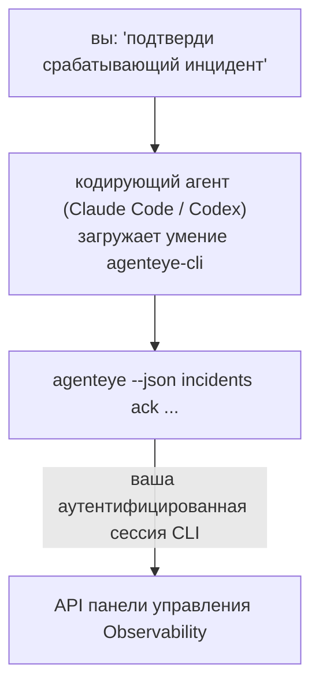

Спросите у вашего кодирующего агента *«что-нибудь сломано сегодня?»* и позвольте ему ответить на основе ваших актуальных данных Failproof AI Observability, без необходимости запоминать команды. **Умение Failproof AI Observability CLI** (`agenteye-cli`) — это *Agent Skill*: небольшая папка с инструкциями, которые кодирующий агент, например Claude Code или Codex, загружает по требованию. Оно обучает агента управлять вашим развёртыванием Observability через [`agenteye` CLI](/ru/agenteye/cli) на основе запросов на простом английском языке, таких как *«дай CI ключ, который может только отправлять события»* или *«подтверди срабатывающий инцидент и назначь его мне»*.

Это **не** сервис и не отдельный бинарный файл; развёртывать нечего. Он работает поверх CLI, который у вас уже установлен: агент вызывает `agenteye --json …`, парсит чистый JSON и отвечает вам прозой. Всё, что он может делать, вы могли бы сделать сами, вводя те же команды.

---

## Как это связано с другими интерфейсами Failproof AI Observability

Failproof AI Observability предоставляет четыре способа доступа к одним и тем же данным и элементам управления. Они дополняют друг друга:

| Интерфейс | Что это | Где работает | Используйте, когда |
|---|---|---|---|
| **[CLI](/ru/agenteye/cli)** | Справочник команд и флагов для `agenteye` | Ваш терминал | Вы хотите запустить или задать скрипт для конкретной команды |
| **[CLI рецепты](/ru/agenteye/cli-recipes)** | Копируемые паттерны `jq`/конвейера | Ваш терминал / скрипты | Вы интегрируете CLI в автоматизацию |
| **Умение CLI** (этот документ) | Естественный языковой интерфейс к CLI | Ваш кодирующий агент, на вашей рабочей станции | Вы хотите просто спросить и позволить агенту выбрать команду |
| **[Умение Evaluator](/ru/agenteye/evaluator-skill)** | Связанное умение, которое разрабатывает и создаёт вашу сервис оценки | Ваш кодирующий агент, на вашей рабочей станции | Вы хотите создавать оценки, а не читать их |
| **[Умение Python SDK](/ru/agenteye/python-sdk-skill)** | Связанное умение, которое инструментирует ваш агент для выпуска телеметрии | Ваш кодирующий агент, на вашей рабочей станции | Вы хотите, чтобы ваш агент создавал события, которые читает это умение |
| **[Встроенный в панель управления ассистент AI](/ru/agenteye/assistant)** | Чат, встроенный в панель управления | На стороне сервера (в панели управления) | Вы хотите Q&A по вашим данным прямо в панели управления |

Само умение не имеет собственных привилегий; оно просто превращает ваши слова в вызовы CLI, которые выполняются от вас:



### в сравнении с ассистентом AI в панели управления: важное уточнение

Это два разных инструмента с очень разными радиусами действия:

- **Ассистент AI в панели управления** ([AI assistant](/ru/agenteye/assistant)) — это чат, встроенный в панель управления, поддерживаемый сервисом агента. Он **только для чтения плюс авторизация для создания**: он может черновики сохранённых запросов и панели управления, но каждая запись приостанавливается для вашего явного нажатия на одобрение, и никогда не удаляет. Он защищен разрешением `agent:use` и видит только данные для организации, которую вы просматриваете.
- **Умение CLI** работает на *вашей* рабочей станции внутри *вашего* кодирующего агента и управляет `agenteye` CLI как **вы**. Оно может выполнять **полную поверхность CLI, включая мутации** (создание/ротация/отключение ключей API, изменение параметров организации, разрешение инцидентов, удаление сохранённых запросов), ограниченные только разрешениями вашего входа в CLI. Относитесь к нему точно так же осторожно, как к запуску этих команд вручную.

---

## Предварительные требования

1. **`agenteye` CLI установлен** и в `PATH` (см. справочник [CLI](/ru/agenteye/cli): `pipx install agenteye`).
2. Ваш **URL панели управления** установлен (`AGENTEYE_DASHBOARD_URL`, или агент передаёт `--base-url`).
3. **Аутентифицированная сессия**: сначала запустите `agenteye login` самостоятельно. Умение **не может** завершить вход с одноразовым кодом, отправленным по электронной почте; оно скажет вам запустить `agenteye login`, если сессия отсутствует или истекла (код выхода CLI `4`).

---

## Где его получить

Умение опубликовано в публичной коллекции умений Failproof AI:

**[github.com/FailproofAI/skills](https://github.com/FailproofAI/skills)** → [`skills/agenteye-cli/`](https://github.com/FailproofAI/skills/tree/main/skills/agenteye-cli)

Ничего в нём не защищено — репозиторий открыт, и умению не нужно собственное учётное данное, потому что оно только управляет **публичным** `agenteye` CLI для *вашей* панели управления, используя сессию, в которую *вы* вошли. Вам не нужно просить это у кого-либо.

Обратите внимание, что оно поставляется в собственной папке и **не** находится внутри пакета `pipx install agenteye`, поэтому не ищите его там.

## Установка умения

Самый быстрый путь — CLI [`skills`](https://skills.sh), который загружает папку и размещает её там, где ваш агент её ищет:

```bash
# Claude Code, только для этого проекта
npx skills add FailproofAI/skills --skill agenteye-cli -a claude-code

# для каждого проекта (устанавливает в ~/.claude/skills/)
npx skills add FailproofAI/skills --skill agenteye-cli -a claude-code -g --copy

# вместо этого Codex
npx skills add FailproofAI/skills --skill agenteye-cli -a codex
```

Затем управляйте им как любым другим умением:

```bash
npx skills list -a claude-code      # что установлено
npx skills update agenteye-cli      # получить последнюю версию
npx skills remove agenteye-cli      # удалить его
```

Предпочитаете устанавливать вручную? Agent Skill — это просто папка, содержащая `SKILL.md` (плюс опциональные справочники), поэтому копирование тоже работает:

- **Claude Code**: поместите папку `agenteye-cli/` в `~/.claude/skills/` (для каждого проекта) или `<ваш-репо>/.claude/skills/` (только для того репо). Claude Code автоматически её обнаруживает — проверьте со списком `/skills`, или просто задайте вопрос, который соответствует её описанию.
- **Codex (OpenAI)**: Codex читает тот же `SKILL.md`. Поставляемый `agents/openai.yaml` устанавливает `allow_implicit_invocation: true`, так что Codex автоматически выбирает умение, когда задача совпадает; иначе вызывайте его явно как `$agenteye-cli`.

---

## Безопасность: мутации НЕ запрашивают подтверждение, когда агент запускает CLI

> **Предупреждение:** Прочитайте это перед тем, как позволить агенту вносить изменения.

`agenteye` CLI обычно спрашивает *«вы уверены?»* перед деструктивным действием. Он **автоматически пропускает это подтверждение, когда не присоединён к терминалу (что как раз то, как запускается кодирующий агент), и `--json` тоже его пропускает.** Поэтому запрос безопасности **не** срабатывает для агента.

Умение написано для компенсации: ему указано озвучить точную команду, которую оно запустит, и получить ваше явное **OK перед любым изменением состояния**. Сохраняйте эту дисциплину. Когда вы управляете Failproof AI Observability через агента, *вы* — шаг подтверждения. Команды, изменяющие состояние, на которые нужно обратить внимание:

- `keys create` / `update` / `disable` / `regenerate`
- `users create` / `update` / `disable` / `enable`
- `settings set`
- `alerts create` / `update` / `delete` / `test`
- подкоманды записи `incidents`: `ack` / `assign` / `resolve` / `open` / `comment-add` / `comment-delete` / `subscribe` / `unsubscribe`
- `query create` / `update` / `delete`
- `agent rename` / `delete`
- `orgs switch`

Всё под **Observe** (`events`, `sessions`, `evals`, `errors`, `list`, `whoami`, `orgs list/current/perms`) только для чтения и ничего не меняет.

Потому что агент действует как **вы**, он может делать только то, на что у вас есть разрешение; разрешения разрешаются **по организации** (см. [API keys](/ru/agenteye/api-keys)). Команда, для которой у вас нет разрешения, возвращает код выхода `5` с точным названием разрешения, поэтому агент может сказать вам ровно то, что просить у администратора, вместо неудачи неясным образом.

---

## Что вы можете спросить

Вот как выглядит реальный полный цикл, сначала чтение, затем изменение, которое ждёт вашего OK:

```text
вы    ▸ Что-нибудь сломано за последний день?

агент ▸ Запуск: agenteye --json errors --since 24h --aggregate
        3 типа ошибок за последние 24ч. Самая крупная — TimeoutError
        (18 попаданий, всё на checkout-agent), затем RateLimited (5).
        Хотите видеть падающие сессии для TimeoutError?

вы    ▸ Дай CI ключ, который может только отправлять события.

агент ▸ Это создаёт ключ API. Я запущу:
          agenteye keys create ci --add events:add
        OK продолжить?

вы    ▸ да

агент ▸ Готово. Ключ "ci" создан только с events:add.
        Секрет показывается только один раз, поэтому сохраните его сейчас. Я не могу переиздать его.
```

Умение отображает каждое намерение на простом английском языке на правильную `agenteye` команду, сначала обнаруживая допустимые значения (`list <kind>`, `whoami`), чтобы не угадывать, и озвучивая точную команду перед любым изменением. Ещё примеры:

- *«Что-нибудь сломано / падает за последние 24 часа?»* → `errors --since 24h --aggregate`, затем разбор.
- *«Почему сессия `run-001` не удалась?»* → `events --session-id run-001 --all` + `evals --session-id run-001`.
- *«Как качество движется на этой неделе?»* → `evals --aggregate --since 7d`, затем углубление в низкооценённые прогоны.
- *«Дай CI ключ, который может только отправлять события.»* → `keys create ci --add events:add` (оно озвучивает команду, затем создаёт её и захватывает одноразовый секрет).
- *«Кто имеет доступ? Сделай Dana только для чтения.»* → `users list` → `users update dana@… --permission-set read-only` (после подтверждения с вами).
- *«Подтверди срабатывающий инцидент и назначь его мне.»* → `incidents list --state firing` → `incidents ack <id>` / `incidents assign <id> you@…`.

Для точных команд, флагов и JSON-форм за ними см. справочник [CLI](/ru/agenteye/cli) и [CLI рецепты для агентов](/ru/agenteye/cli-recipes).

---

## Следующие шаги

- **[CLI](/ru/agenteye/cli)**: полный справочник команд и флагов для `agenteye`.
- **[CLI рецепты для агентов](/ru/agenteye/cli-recipes)**: копируемые паттерны `jq` и обработка кодов выхода.
- **[Умение агента Evaluator](/ru/agenteye/evaluator-skill)**: связанное умение для создания оценивателя, чьи оценки читает `agenteye evals`.
- **[Умение агента Python SDK](/ru/agenteye/python-sdk-skill)**: связанное умение для инструментирования агента, чтобы он выпускал телеметрию, которую читает `agenteye`.
- **[AI assistant](/ru/agenteye/assistant)**: встроенный в панель управления ассистент (не путать с этим терминальным умением).
- **[API keys](/ru/agenteye/api-keys)**: модель разрешений по организации, которая ограничивает то, что может делать умение.