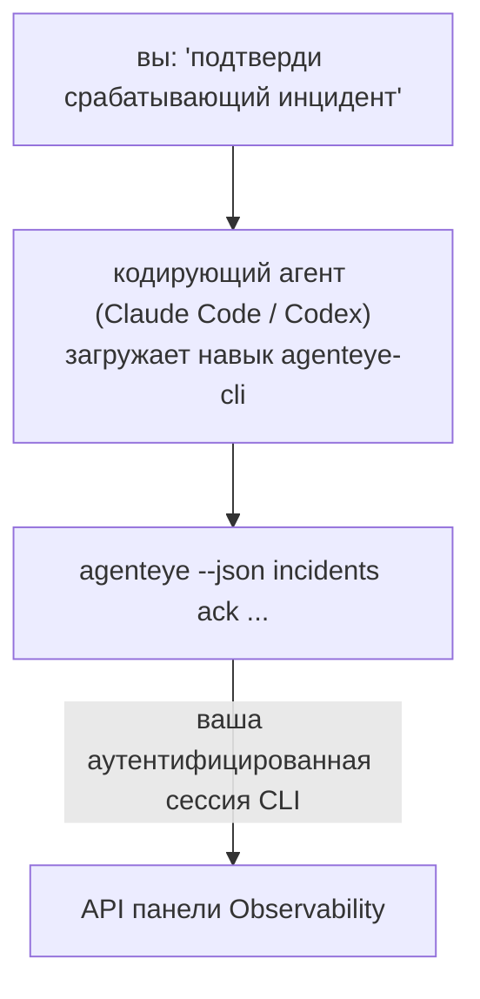

---
---
title: "Навык CLI агента Failproof AI Observability"
description: "Спросите свой кодирующий агент «что-нибудь сломано сегодня?» и получите ответ из живых данных Failproof AI Observability без необходимости запоминать команды."
---


Спросите свой кодирующий агент *«что-нибудь сломано сегодня?»* и получите ответ из живых данных Failproof AI Observability без необходимости запоминать команды. **Навык CLI Failproof AI Observability** (`agenteye-cli`) — это *Agent Skill*: небольшая папка с инструкциями, которую кодирующий агент, такой как Claude Code или Codex, загружает по требованию. Она учит агента управлять вашим развёртыванием Observability через [`agenteye` CLI](/ru/agenteye/cli) на основе запросов на простом английском, такие как *«дай CI ключ, который может только отправлять события»* или *«подтверди срабатывающий инцидент и назначь его мне»*.

Это **не** сервис и не отдельный бинарный файл; развёртывать нечего. Он работает поверх уже установленного CLI: агент запускает `agenteye --json …`, парсит чистый JSON и отвечает вам прозой. Всё, что он может сделать, вы можете сделать сами, введя те же команды.

---

## Как это соотносится с другими интерфейсами Failproof AI Observability

Failproof AI Observability предоставляет четыре способа доступа к одним и тем же данным и управлению. Они дополняют друг друга:

| Интерфейс | Что это | Где работает | Используйте, когда |
|---|---|---|---|
| **[CLI](/ru/agenteye/cli)** | Справочник команд и флагов для `agenteye` | Ваш терминал | Вы хотите запустить или написать скрипт для конкретной команды |
| **[CLI рецепты](/ru/agenteye/cli-recipes)** | Готовые к использованию паттерны `jq`/pipeline | Ваш терминал / скрипты | Вы интегрируете CLI в автоматизацию |
| **Навык CLI** (этот документ) | Вход на естественном языке в CLI | Ваш кодирующий агент, на вашей рабочей станции | Вы хотите просто *спросить* и позволить агенту выбрать команду |
| **[Навык Evaluator](/ru/agenteye/evaluator-skill)** | Сопутствующий навык, который проектирует и создаёт вашу сервис оценки | Ваш кодирующий агент, на вашей рабочей станции | Вы хотите *производить* оценки, а не читать их |
| **[Навык Python SDK](/ru/agenteye/python-sdk-skill)** | Сопутствующий навык, который инструментирует ваш агент для испускания телеметрии | Ваш кодирующий агент, на вашей рабочной станции | Вы хотите, чтобы ваш агент *производил* события, которые этот навык читает |
| **[Встроенный в панель AI ассистент](/ru/agenteye/assistant)** | Чат, встроенный в панель управления | На сервере (в панели управления) | Вы хотите вопросы и ответы в панели над вашими данными |

Сам навык не имеет своих привилегий; он просто преобразует ваши слова в вызовы CLI, которые выполняются от вас:



### vs. встроенный в панель AI ассистент: важное различие

Это два разных инструмента с очень разными радиусами действия:

- **Встроенный в панель AI ассистент** ([AI ассистент](/ru/agenteye/assistant)) — это чат, встроенный в панель, поддерживаемый сервисом агента. Он **только для чтения плюс одобрение для авторства**: может составить сохранённые запросы и панели, но каждая запись требует вашего явного клика подтверждения и никогда не удаляет. Контролируется через разрешение `agent:use` и видит только данные организации, которую вы просматриваете.
- **Навык CLI** работает на *вашей* рабочной станции внутри *вашего* кодирующего агента и управляет `agenteye` CLI как **вы**. Он может выполнять **полную поверхность CLI, включая мутации** (создание/ротация/отключение ключей API, изменение параметров организации, разрешение инцидентов, удаление сохранённых запросов), ограниченные только разрешениями вашего входа CLI. Относитесь к этому ровно так же осторожно, как вы обращались бы с выполнением этих команд вручную.

---

## Предварительные требования

1. **`agenteye` CLI установлен** и в `PATH` (см. справочник [CLI](/ru/agenteye/cli): `pipx install agenteye`).
2. Ваш **URL панели установлен** (`AGENTEYE_DASHBOARD_URL`, или агент передаёт `--base-url`).
3. **Вошедшая сессия**: сначала запустите `agenteye login` самостоятельно. Навык **не может** завершить одноразовый вход по коду, отправленному по почте; он скажет вам запустить `agenteye login`, если сессия отсутствует или истекла (код выхода CLI `4`).

---

## Где его взять

Навык опубликован в публичной коллекции навыков Failproof AI:

**[github.com/FailproofAI/skills](https://github.com/FailproofAI/skills)** → [`skills/agenteye-cli/`](https://github.com/FailproofAI/skills/tree/main/skills/agenteye-cli)

Ничего в нём не закрыто — репозиторий является публичным и навык не требует собственных учётных данных, потому что только управляет **публичным** `agenteye` CLI против *вашей* панели, используя сессию, *в которую вы вошли*. Вам не нужно просить разрешение у кого-либо.

Учтите, что он поставляется как отдельная папка и **не** входит в пакет `pipx install agenteye`, поэтому не ищите его там.

## Установка навыка

Самый быстрый путь — это [`skills`](https://skills.sh) CLI, который получает папку и размещает её там, где ваш агент ищет:

```bash
# Claude Code, только этот проект
npx skills add FailproofAI/skills --skill agenteye-cli -a claude-code

# каждый проект (установка в ~/.claude/skills/)
npx skills add FailproofAI/skills --skill agenteye-cli -a claude-code -g --copy

# вместо этого Codex
npx skills add FailproofAI/skills --skill agenteye-cli -a codex
```

Затем управляйте им как любым другим навыком:

```bash
npx skills list -a claude-code      # что установлено
npx skills update agenteye-cli      # получить последнюю версию
npx skills remove agenteye-cli      # удалить его
```

Предпочитаете установку вручную? Agent Skill — это просто папка, содержащая `SKILL.md` (плюс дополнительные ссылки), поэтому копирование тоже работает:

- **Claude Code**: поместите папку `agenteye-cli/` в `~/.claude/skills/` (каждый проект) или `<your-repo>/.claude/skills/` (только этот репозиторий). Claude Code автоматически её обнаружит — проверьте с помощью списка `/skills` или просто задайте вопрос, который соответствует её описанию.
- **Codex (OpenAI)**: Codex читает тот же `SKILL.md`. Входящий в комплект `agents/openai.yaml` устанавливает `allow_implicit_invocation: true`, поэтому Codex автоматически выбирает навык, когда задача соответствует; иначе вызовите его явно как `$agenteye-cli`.

---

## Безопасность: мутации НЕ требуют подтверждения при запуске CLI агентом

> **Предупреждение:** прочитайте это перед тем, как позволить агенту вносить изменения.

`agenteye` CLI обычно спрашивает *«вы уверены?»* перед разрушительным действием. Оно **автоматически пропускает это подтверждение, когда оно не присоединено к терминалу (это именно то, как кодирующий агент его запускает), а `--json` тоже его пропускает.** Поэтому запрос безопасности **не сработает** для агента.

Навык написан, чтобы это компенсировать: ему инструктируется указать точную команду, которую он запустит, и получить ваше явное **ОК перед любым изменением состояния**. Сохраняйте эту дисциплину. Когда вы управляете Failproof AI Observability через агента, *вы* являетесь шагом подтверждения. Команды, изменяющие состояние, на которые нужно обратить внимание:

- `keys create` / `update` / `disable` / `regenerate`
- `users create` / `update` / `disable` / `enable`
- `settings set`
- `alerts create` / `update` / `delete` / `test`
- команды записи `incidents`: `ack` / `assign` / `resolve` / `open` / `comment-add` / `comment-delete` / `subscribe` / `unsubscribe`
- `query create` / `update` / `delete`
- `agent rename` / `delete`
- `orgs switch`

Всё под **Observe** (`events`, `sessions`, `evals`, `errors`, `list`, `whoami`, `orgs list/current/perms`) доступно только для чтения и ничего не изменяет.

Поскольку агент действует как **вы**, он может делать только то, что ваш вход позволяет; разрешения разрешаются **по организации** (см. [ключи API](/ru/agenteye/api-keys)). Команда, для которой у вас нет разрешения, возвращает код выхода `5` с точно названным разрешением, поэтому агент может рассказать вам точно, что попросить администратора, вместо того, чтобы потерпеть неудачу неясно.

---

## Что вы можете спросить

Вот как выглядит реальный цикл туда-обратно, чтение, а затем изменение, которое ждёт вашего ОК:

```text
вы    ▸ Что-нибудь сломано за последний день?

агент ▸ Запуск: agenteye --json errors --since 24h --aggregate
        3 типа ошибок за последние 24 часа. Самая большая — TimeoutError
        (18 попаданий, все на checkout-agent), затем RateLimited (5).
        Хотите видеть сбойные сессии для TimeoutError?

вы    ▸ Дай CI ключ, который может только отправлять события.

агент ▸ Это создаёт ключ API. Я запущу:
          agenteye keys create ci --add events:add
        ОК продолжать?

вы    ▸ да

агент ▸ Готово. Ключ "ci" создан только с events:add.
        Секрет показывается только один раз, поэтому сохраните его сейчас. Я не могу его переоткрыть.
```

Навык отображает каждое намерение на простом английском на правильную `agenteye` команду, сначала обнаруживая правильные значения (`list <kind>`, `whoami`), чтобы не угадывать, и указывая точную команду перед любым изменением. Ещё примеры:

- *«Что-нибудь сломано / не работает за последние 24 часа?»* → `errors --since 24h --aggregate`, затем разбивка.
- *«Почему сессия `run-001` не сработала?»* → `events --session-id run-001 --all` + `evals --session-id run-001`.
- *«Как качество развивается за эту неделю?»* → `evals --aggregate --since 7d`, затем детализация низко оценённых запусков.
- *«Дай CI ключ, который может только отправлять события»* → `keys create ci --add events:add` (указывает команду, затем создаёт её и захватывает одноразовый секрет).
- *«Кто имеет доступ? Сделай Dana только для чтения»* → `users list` → `users update dana@… --permission-set read-only` (после подтверждения с вами).
- *«Подтверди срабатывающий инцидент и назначь его мне»* → `incidents list --state firing` → `incidents ack <id>` / `incidents assign <id> you@…`.

Для точных команд, флагов и форм JSON, стоящих за этими, см. справочник [CLI](/ru/agenteye/cli) и [CLI рецепты для агентов](/ru/agenteye/cli-recipes).

---

## Следующие шаги

- **[CLI](/ru/agenteye/cli)**: полный справочник команд и флагов для `agenteye`.
- **[CLI рецепты для агентов](/ru/agenteye/cli-recipes)**: готовые к использованию паттерны `jq` и обработка кодов выхода.
- **[Навык агента Evaluator](/ru/agenteye/evaluator-skill)**: сопутствующий навык для построения оценщика, чьи оценки читает `agenteye evals`.
- **[Навык агента Python SDK](/ru/agenteye/python-sdk-skill)**: сопутствующий навык для инструментирования агента, чтобы он испускал телеметрию, которую читает `agenteye`.
- **[AI ассистент](/ru/agenteye/assistant)**: встроенный в панель ассистент (не путайте с этим навыком терминала).
- **[Ключи API](/ru/agenteye/api-keys)**: модель разрешений по организациям, которая ограничивает то, что может делать навык.