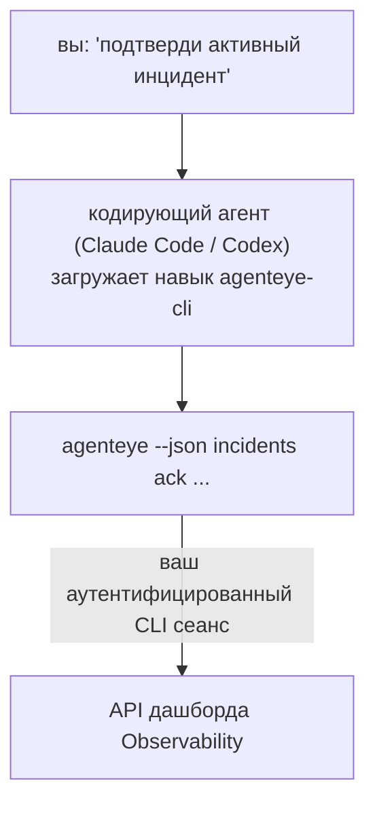

Спросите у своего кодирующего агента *«что-то сломалось сегодня?»* и позвольте ему ответить на основе ваших живых данных Failproof AI Observability без необходимости запоминать команды. **Навык Failproof AI Observability CLI** (`agenteye-cli`) — это *Agent Skill*: небольшая папка с инструкциями, которую кодирующий агент, такой как Claude Code или Codex, загружает по требованию. Она учит агента управлять вашим развёртыванием Observability через [`agenteye` CLI](/ru/agenteye/cli) на основе обычных англоязычных запросов вроде *«выдай CI ключ, который может только отправлять события»* или *«подтверди активный инцидент и назначь его на меня»*.

Это **не** сервис и не отдельный бинарный файл; нет ничего для развёртывания. Она работает поверх уже установленного вами CLI: агент вызывает `agenteye --json …`, парсит чистый JSON и отвечает вам прозой. Всё, что она может делать, вы можете делать сами, вводя те же команды.

---

## Как это связано с другими интерфейсами Failproof AI Observability

Failproof AI Observability предоставляет четыре способа доступа к одним и тем же данным и управлению ими. Они дополняют друг друга:

| Интерфейс | Что это | Где работает | Используйте, когда |
|---|---|---|---|
| **[CLI](/ru/agenteye/cli)** | Справочник команд и флагов для `agenteye` | Ваш терминал | Вы хотите запустить или написать скрипт для конкретной команды |
| **[CLI рецепты](/ru/agenteye/cli-recipes)** | Готовые к вставке паттерны `jq` / конвейеры | Ваш терминал / скрипты | Вы интегрируете CLI в автоматизацию |
| **CLI навык** (этот документ) | Естественно-языковой фасад к CLI | Ваш кодирующий агент на вашей рабочей станции | Вы хотите просто спросить и позволить агенту выбрать команду |
| **[Evaluator навык](/ru/agenteye/evaluator-skill)** | Родственный навык, который проектирует и создаёт ваш сервис скоринга | Ваш кодирующий агент на вашей рабочей станции | Вы хотите создавать оценки оценивания вместо их чтения |
| **[Python SDK навык](/ru/agenteye/python-sdk-skill)** | Родственный навык, который инструментирует ваш агент для излучения телеметрии | Ваш кодирующий агент на вашей рабочей станции | Вы хотите, чтобы ваш агент создавал события, которые этот навык читает |
| **[Встроенный в дашборд AI ассистент](/ru/agenteye/assistant)** | Чат, встроенный в дашборд | На сервере (в дашборде) | Вы хотите получить ответы на вопросы в дашборде по своим данным |

Сам навык не имеет собственных привилегий; он просто преобразует ваши слова в вызовы CLI, которые выполняются от вашего имени:



### против встроенного AI ассистента: важное различие

Это два совершенно разных инструмента с очень разными радиусами действия:

- **Встроенный в дашборд AI ассистент** ([AI ассистент](/ru/agenteye/assistant)) — это чат в дашборде, поддерживаемый агентом-сервисом. Это **только для чтения плюс одобрение для авторства**: он может создавать проекты сохранённых запросов и дашбордов, но каждая запись ждёт вашего явного клика-подтверждения, и он никогда не удаляет. Он контролируется разрешением `agent:use` и всегда видит только данные для организации, которую вы просматриваете.
- **CLI навык** работает на *вашей* рабочей станции внутри *вашего* кодирующего агента и управляет CLI `agenteye` как **вы**. Он может выполнять **весь спектр CLI, включая мутации** (создание/ротация/отключение API ключей, изменение параметров организации, разрешение инцидентов, удаление сохранённых запросов), ограниченный только разрешениями вашего CLI входа. Относитесь к нему ровно так же осторожно, как если бы вы вводили эти команды вручную.

---

## Предварительные требования

1. **`agenteye` CLI установлен** и в `PATH` (см. справочник [CLI](/ru/agenteye/cli): `pipx install agenteye`).
2. Ваш **URL дашборда установлен** (`AGENTEYE_DASHBOARD_URL`, или агент передаёт `--base-url`).
3. **Авторизованный сеанс**: сначала запустите `agenteye login` сами. Навык **не может** завершить отправленный по почте одноразовый код входа за вас; он скажет вам запустить `agenteye login`, если сеанс отсутствует или истёк (код выхода CLI `4`).

---

## Где это получить

Навык опубликован в публичной коллекции навыков Failproof AI:

**[github.com/FailproofAI/skills](https://github.com/FailproofAI/skills)** → [`skills/agenteye-cli/`](https://github.com/FailproofAI/skills/tree/main/skills/agenteye-cli)

Ничего в нём не контролируется — репозиторий публичный и навык не требует собственных учётных данных, так как он только управляет **публичным** CLI `agenteye` для *вашего* дашборда, используя сеанс *вашего* входа. Вам не нужно просить его у кого-либо.

Учтите, что он поставляется как отдельная папка и **не входит** в пакет `pipx install agenteye`, поэтому не ищите его там.

## Установка навыка

Самый быстрый способ — это CLI [`skills`](https://skills.sh), который загружает папку и кладёт её туда, где ваш агент её ищет:

```bash
# Claude Code, только этот проект
npx skills add FailproofAI/skills --skill agenteye-cli -a claude-code

# каждый проект (устанавливает в ~/.claude/skills/)
npx skills add FailproofAI/skills --skill agenteye-cli -a claude-code -g --copy

# Codex вместо этого
npx skills add FailproofAI/skills --skill agenteye-cli -a codex
```

Затем управляйте им как любым другим навыком:

```bash
npx skills list -a claude-code      # что установлено
npx skills update agenteye-cli      # получить последнюю версию
npx skills remove agenteye-cli      # удалить его
```

Предпочитаете устанавливать вручную? Agent Skill — это просто папка, содержащая `SKILL.md` (плюс опциональные справочники), поэтому копирование тоже работает:

- **Claude Code**: поместите папку `agenteye-cli/` в `~/.claude/skills/` (каждый проект) или `<ваш-репо>/.claude/skills/` (только этот репо). Claude Code автоматически обнаруживает её — проверьте через список `/skills` или просто задайте вопрос, соответствующий её описанию.
- **Codex (OpenAI)**: Codex читает тот же `SKILL.md`. Входящий в комплект `agents/openai.yaml` устанавливает `allow_implicit_invocation: true`, поэтому Codex автоматически выбирает навык, когда задача совпадает; в противном случае вызовите его явно как `$agenteye-cli`.

---

## Безопасность: мутации НЕ запрашивают подтверждение, когда агент запускает CLI

> **Внимание:** Прочитайте это перед тем, как позволить агенту вносить изменения.

CLI `agenteye` обычно спрашивает *«вы уверены?»* перед деструктивным действием. Он **автоматически пропускает это подтверждение, когда он не подключён к терминалу (что ровно то, как кодирующий агент его запускает), и `--json` тоже его пропускает.** Поэтому подсказка безопасности **не срабатывает** для агента.

Навык написан для компенсации: ему инструктируется указать точную команду, которую он будет запускать, и получить ваше явное **ОК перед любым изменением состояния**. Сохраняйте эту дисциплину. Когда вы управляете Failproof AI Observability через агента, *вы* являетесь шагом подтверждения. Команды, изменяющие состояние, на которые нужно обратить внимание:

- `keys create` / `update` / `disable` / `regenerate`
- `users create` / `update` / `disable` / `enable`
- `settings set`
- `alerts create` / `update` / `delete` / `test`
- подкоманды записи `incidents`: `ack` / `assign` / `resolve` / `open` / `comment-add` / `comment-delete` / `subscribe` / `unsubscribe`
- `query create` / `update` / `delete`
- `agent rename` / `delete`
- `orgs switch`

Всё под **Observe** (`events`, `sessions`, `evals`, `errors`, `list`, `whoami`, `orgs list/current/perms`) только для чтения и ничего не изменяет.

Поскольку агент действует как **вы**, он может делать только то, что вашему входу разрешено делать; разрешения разрешаются **по организации** (см. [API ключи](/ru/agenteye/api-keys)). Команда, на которую у вас нет разрешения, возвращает код выхода `5` с точно названным разрешением, поэтому агент может точно сказать вам, что просить у администратора, вместо того чтобы неудачно молчать.

---

## Что вы можете у него спросить

Вот как выглядит реальный обмен туда-обратно, чтение, а затем изменение, которое ждёт вашего ОК:

```text
вы   ▸ Что-то сломалось в последний день?

агент ▸ Выполняю: agenteye --json errors --since 24h --aggregate
        3 типа ошибок за последние 24ч. Самая большая — TimeoutError
        (18 попаданий, все на checkout-agent), затем RateLimited (5).
        Хотите видеть падающие сеансы для TimeoutError?

вы   ▸ Выдай CI ключ, который может только отправлять события.

агент ▸ Это создаст API ключ. Я выполню:
          agenteye keys create ci --add events:add
        ОК продолжить?

вы   ▸ да

агент ▸ Готово. Ключ "ci" создан только с events:add.
        Секрет показывается только один раз, поэтому сохраните его сейчас. Я не могу его перепечатать.
```

Навык отображает каждое намерение на естественном языке на правильную команду `agenteye`, сначала обнаруживая действительные значения (`list <kind>`, `whoami`), чтобы он не угадывал, и указывая точную команду перед любым изменением. Ещё примеры:

- *«Что-то сломалось / отказывает в последние 24 часа?»* → `errors --since 24h --aggregate`, затем описание.
- *«Почему сеанс `run-001` отказал?»* → `events --session-id run-001 --all` + `evals --session-id run-001`.
- *«Как качество меняется на неделю?»* → `evals --aggregate --since 7d`, затем углубление в низкооценённые прогоны.
- *«Выдай CI ключ, который может только отправлять события.»* → `keys create ci --add events:add` (она указывает команду, затем создаёт её и захватывает одноразовый секрет).
- *«Кто имеет доступ? Сделай Dana только для чтения.»* → `users list` → `users update dana@… --permission-set read-only` (после подтверждения с вами).
- *«Подтверди активный инцидент и назначь его на меня.»* → `incidents list --state firing` → `incidents ack <id>` / `incidents assign <id> you@…`.

Для точных команд, флагов и JSON форм за ними, см. справочник [CLI](/ru/agenteye/cli) и [CLI рецепты для агентов](/ru/agenteye/cli-recipes).

---

## Дальнейшие шаги

- **[CLI](/ru/agenteye/cli)**: полный справочник команд и флагов для `agenteye`.
- **[CLI рецепты для агентов](/ru/agenteye/cli-recipes)**: готовые к вставке паттерны `jq` и обработка кодов выхода.
- **[Evaluator агент навык](/ru/agenteye/evaluator-skill)**: родственный навык для построения оценивателя, чьи оценки читает `agenteye evals`.
- **[Python SDK агент навык](/ru/agenteye/python-sdk-skill)**: родственный навык для инструментирования агента, чтобы он излучал телеметрию, которую читает `agenteye`.
- **[AI ассистент](/ru/agenteye/assistant)**: встроенный в дашборд ассистент (не путайте с этим терминальным навыком).
- **[API ключи](/ru/agenteye/api-keys)**: модель разрешений по организации, которая ограничивает то, что может делать навык.