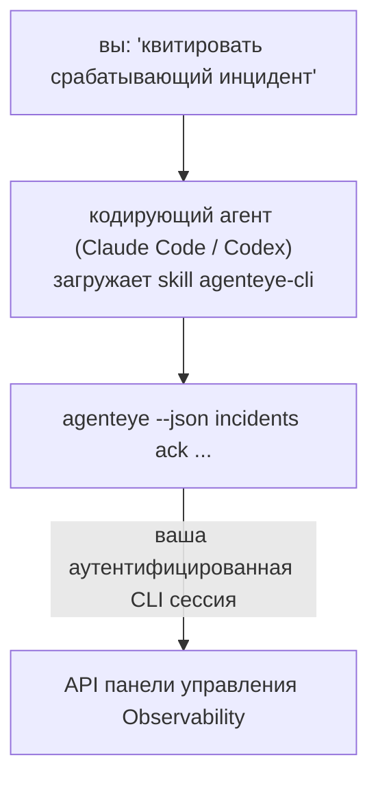

Спросите у вашего кодирующего агента *«что-то сломалось сегодня?»* и позвольте ему ответить на основе ваших живых данных Failproof AI Observability, без необходимости запоминать команды. **Failproof AI Observability CLI skill** (`agenteye-cli`) — это *Agent Skill*: небольшая папка с инструкциями, которую кодирующий агент, такой как Claude Code или Codex, загружает по запросу. Она обучает агента управлять вашим развёртыванием Observability через [`agenteye` CLI](/ru/agenteye/cli) на основе простых английских запросов, например *«выдать CI ключ, который может только отправлять события»* или *«квитировать срабатывающий инцидент и назначить его на меня»*.

Это **не** сервис и **не** отдельный бинарный файл; нечего развёртывать. Она работает поверх уже установленного вами CLI: агент вызывает `agenteye --json …`, разбирает чистый JSON и отвечает вам прозой. Всё, что она может делать, вы можете делать сами, вводя те же команды.

---

## Как это соотносится с другими интерфейсами Failproof AI Observability

Failproof AI Observability предоставляет вам четыре способа достучаться до одних и тех же данных и элементов управления. Они дополняют друг друга:

| Интерфейс | Что это | Где запускается | Используйте, когда |
|---|---|---|---|
| **[CLI](/ru/agenteye/cli)** | Справочник команд/флагов для `agenteye` | Ваш терминал | Вы хотите запустить или написать скрипт для конкретной команды |
| **[CLI рецепты](/ru/agenteye/cli-recipes)** | Готовые к копированию паттерны `jq`/pipeline | Ваш терминал / скрипты | Вы встраиваете CLI в автоматизацию |
| **CLI skill** (этот документ) | Фронт-энд на естественном языке для CLI | Ваш кодирующий агент на вашей рабочей станции | Вы хотите просто спросить и позволить агенту выбрать команду |
| **[Evaluator skill](/ru/agenteye/evaluator-skill)** | Соседний skill, который проектирует и создаёт вашу сервис оценки | Ваш кодирующий агент на вашей рабочей станции | Вы хотите производить оценки eval, а не читать их |
| **[Python SDK skill](/ru/agenteye/python-sdk-skill)** | Соседний skill, который инструментирует ваш агент для испускания телеметрии | Ваш кодирующий агент на вашей рабочной станции | Вы хотите, чтобы ваш агент производил события, которые этот skill читает |
| **[In-dashboard AI assistant](/ru/agenteye/assistant)** | Чат, встроенный в панель управления | На стороне сервера (в панели управления) | Вы хотите вопросы и ответы в панели управления над вашими данными |

Сам skill не имеет никаких привилегий; он просто превращает ваши слова в CLI вызовы, запускаемые от вас:



### против in-dashboard AI assistant: важное различие

Это два разных инструмента с очень разными областями влияния:

- **In-dashboard AI assistant** ([AI assistant](/ru/agenteye/assistant)) — это чат, встроенный в панель управления, поддерживаемый сервисом агента. Он **только для чтения плюс одобрение при авторском редактировании**: он может черновик сохранённых запросов и панелей, но каждая запись требует вашего явного нажатия для одобрения, и никогда не удаляет. Он ограничен разрешением `agent:use` и видит только данные организации, которую вы просматриваете.
- **CLI skill** запускается на *вашей* рабочей станции внутри *вашего* кодирующего агента и управляет `agenteye` CLI как **вы**. Он может выполнять **полную поверхность CLI, включая изменения** (создание/ротация/отключение API ключей, изменение параметров организации, разрешение инцидентов, удаление сохранённых запросов), ограниченные только разрешениями вашего CLI входа. Относитесь к нему ровно так же осторожно, как к запуску этих команд вручную.

---

## Предварительные требования

1. **`agenteye` CLI установлен** и в `PATH` (см. справочник [CLI](/ru/agenteye/cli): `pipx install agenteye`).
2. Ваш **URL панели управления установлен** (`AGENTEYE_DASHBOARD_URL`, или агент передаёт `--base-url`).
3. **Аутентифицированная сессия**: сначала запустите `agenteye login` самостоятельно. Skill **не может** завершить для вас вход с одноразовым кодом по электронной почте; он скажет вам запустить `agenteye login`, если сессия отсутствует или истекла (код выхода CLI `4`).

---

## Где это получить

Skill опубликован в публичной коллекции skills Failproof AI:

**[github.com/FailproofAI/skills](https://github.com/FailproofAI/skills)** → [`skills/agenteye-cli/`](https://github.com/FailproofAI/skills/tree/main/skills/agenteye-cli)

Ничего в нём не ограничено — репозиторий публичный и skill не требует никакого собственного учётного данного, потому что он только управляет **публичным** `agenteye` CLI против *вашей* панели управления, используя сессию *вашего* входа. Вам не нужно просить это у кого-либо.

Обратите внимание, что он поставляется как собственная папка и **не** находится внутри пакета `pipx install agenteye`, поэтому не ищите это там.

## Установка skill

Самый быстрый путь — это [`skills`](https://skills.sh) CLI, который извлекает папку и помещает её туда, где ваш агент ищет:

```bash
# Claude Code, этот проект только
npx skills add FailproofAI/skills --skill agenteye-cli -a claude-code

# каждый проект (устанавливает в ~/.claude/skills/)
npx skills add FailproofAI/skills --skill agenteye-cli -a claude-code -g --copy

# Codex вместо этого
npx skills add FailproofAI/skills --skill agenteye-cli -a codex
```

Затем управляйте им как любым другим skill:

```bash
npx skills list -a claude-code      # что установлено
npx skills update agenteye-cli      # получить последнюю версию
npx skills remove agenteye-cli      # удалить его
```

Предпочитаете устанавливать вручную? Agent Skill — это просто папка, содержащая `SKILL.md` (плюс опциональные справочники), поэтому копирование тоже работает:

- **Claude Code**: поместите папку `agenteye-cli/` в `~/.claude/skills/` (каждый проект) или `<your-repo>/.claude/skills/` (только этот репозиторий). Claude Code автоматически её обнаруживает — проверьте с помощью списка `/skills` или просто задайте вопрос, соответствующий её описанию.
- **Codex (OpenAI)**: Codex читает тот же `SKILL.md`. Включённый `agents/openai.yaml` устанавливает `allow_implicit_invocation: true`, поэтому Codex автоматически выбирает skill при совпадении задачи; иначе вызовите его явно как `$agenteye-cli`.

---

## Безопасность: изменения НЕ запрашивают подтверждение, когда агент запускает CLI

> **Warning:** Прочитайте это перед тем, как позволить агенту вносить изменения.

`agenteye` CLI обычно спрашивает *«вы уверены?»* перед деструктивным действием. Он **автоматически пропускает это подтверждение всякий раз, когда он не подключен к терминалу (что является ровно тем, как кодирующий агент его запускает), и `--json` тоже его пропускает.** Таким образом, подсказка безопасности **не** сработает для агента.

Skill написан для компенсации этого: ему инструктировано указывать точную команду, которую он запустит, и получать ваше явное **OK перед любым изменением состояния**. Сохраняйте эту дисциплину. Когда вы управляете Failproof AI Observability через агента, *вы* — это шаг подтверждения. Команды изменения состояния, на которые следует обратить внимание:

- `keys create` / `update` / `disable` / `regenerate`
- `users create` / `update` / `disable` / `enable`
- `settings set`
- `alerts create` / `update` / `delete` / `test`
- пишущие подкоманды `incidents`: `ack` / `assign` / `resolve` / `open` / `comment-add` / `comment-delete` / `subscribe` / `unsubscribe`
- `query create` / `update` / `delete`
- `agent rename` / `delete`
- `orgs switch`

Всё под **Observe** (`events`, `sessions`, `evals`, `errors`, `list`, `whoami`, `orgs list/current/perms`) только для чтения и ничего не меняет.

Поскольку агент действует как **вы**, он может делать только то, что разрешено вашему входу; разрешения разрешаются **за организацию** (см. [API keys](/ru/agenteye/api-keys)). Команда, для которой вам не хватает разрешения, возвращает код выхода `5` с точно названным разрешением, поэтому агент может точно сказать вам, что попросить у администратора, вместо того чтобы неудачно потерпеть неудачу.

---

## Что вы можете спросить

Вот как выглядит реальный обмен, чтение, а затем изменение, которое ждёт вашего OK:

```text
вы   ▸ Что-то сломалось в последний день?

агент ▸ Запуск: agenteye --json errors --since 24h --aggregate
        3 типа ошибок за последние 24 часа. Самая большая — TimeoutError
        (18 попаданий, все на checkout-agent), затем RateLimited (5).
        Хотите сессии, в которых произошла ошибка TimeoutError?

вы   ▸ Выдай CI ключ, который может только отправлять события.

агент ▸ Это создаёт API ключ. Я запущу:
          agenteye keys create ci --add events:add
        OK для продолжения?

вы   ▸ да

агент ▸ Готово. Ключ "ci" создан с events:add только.
        Секрет показывается только один раз, поэтому сохраните его сейчас. Я не могу его перепечатать.
```

Skill отображает каждое намерение на естественном языке на нужную команду `agenteye`, сначала обнаруживая допустимые значения (`list <kind>`, `whoami`), поэтому он не угадывает, и указывает точную команду перед любым изменением. Больше примеров:

- *«Что-то сломалось / не работает в последние 24 часа?»* → `errors --since 24h --aggregate`, затем детализация.
- *«Почему сессия `run-001` не удалась?»* → `events --session-id run-001 --all` + `evals --session-id run-001`.
- *«Как качество тренируется на этой неделе?»* → `evals --aggregate --since 7d`, затем спуститесь в низкие оценки.
- *«Выдать CI ключ, который может только отправлять события.»* → `keys create ci --add events:add` (он указывает команду, затем создаёт её и захватывает одноразовый секрет).
- *«Кто имеет доступ? Сделай Dana только для чтения.»* → `users list` → `users update dana@… --permission-set read-only` (после подтверждения с вами).
- *«Квитировать срабатывающий инцидент и назначить его на меня.»* → `incidents list --state firing` → `incidents ack <id>` / `incidents assign <id> you@…`.

Для точных команд, флагов и JSON форм за этими, см. справочник [CLI](/ru/agenteye/cli) и [CLI рецепты для агентов](/ru/agenteye/cli-recipes).

---

## Следующие шаги

- **[CLI](/ru/agenteye/cli)**: полный справочник команд и флагов для `agenteye`.
- **[CLI рецепты для агентов](/ru/agenteye/cli-recipes)**: готовые паттерны `jq` и обработка кодов выхода.
- **[Evaluator agent skill](/ru/agenteye/evaluator-skill)**: соседний skill для создания оценщика, чьи оценки читает `agenteye evals`.
- **[Python SDK agent skill](/ru/agenteye/python-sdk-skill)**: соседний skill для инструментирования агента, чтобы он испускал телеметрию, которую читает `agenteye`.
- **[AI assistant](/ru/agenteye/assistant)**: встроенный ассистент панели управления (не путайте с этим терминальным skill).
- **[API keys](/ru/agenteye/api-keys)**: модель разрешений за организацию, которая ограничивает то, что может делать skill.