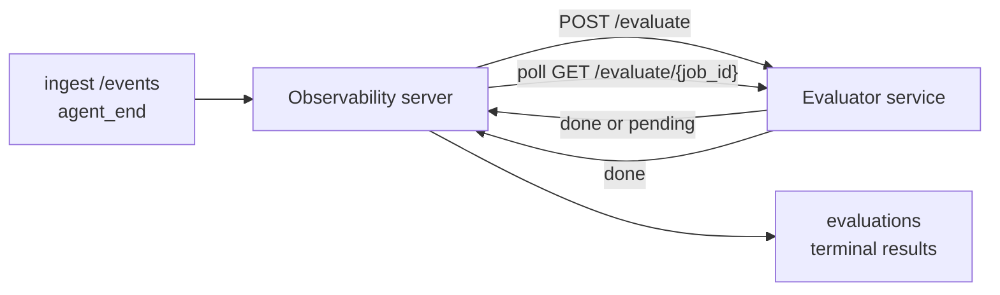

Failproof AI Observability может автоматически оценивать качество каждого завершённого запуска агента: вы предоставляете небольшой сервис оценки, а Observability берёт на себя остальное. Используйте его для отслеживания важных для вас параметров (полезность, эффективность инструментов, фактичность, безопасность — выбор за вами), раннего выявления регрессий и сравнения агентов или окружений с одного взгляда. Оценивание является необязательным: конвейер ничего не делает, пока вы не установите `EVALUATOR_ENDPOINT` на сервере.

> **Примечание:** Вы определяете измерения оценок. Ваш оценивающий сервис может возвращать любые числовые ключи; Observability сохраняет, отслеживает и отображает всё, что вы отправляете.

## Обзор

1. **Напишите оценивающий сервис.** Создайте небольшой HTTP-сервис, который читает транскрипт сеанса и возвращает оценки. Observability поставляется с работающим справочником, который вы можете скопировать. См. [Написание оценивающего сервиса с SDK](#writing-an-evaluator-with-the-sdk).
2. **Укажите Observability адрес сервиса.** Установите `EVALUATOR_ENDPOINT` (и общий `EVALUATOR_TOKEN`) на процесс сервера.
3. **Смотрите, как приходят оценки.** Каждый завершённый сеанс оценивается автоматически; результаты появляются на странице деталей сеанса, в таблице сеансов и в сохранённых дашбордах.


*После настройки оценивающего сервиса каждый завершённый запуск оценивается и результаты появляются на правой панели сеанса: итоговая оценка вверху, затем столбцы оценок по каждому измерению с рассуждениями.*

---

## Как это работает



Когда Failproof AI Observability SDK испускает событие `agent_end` для сеанса, сервер планирует оценку. Затем он отправляет полный транскрипт событий вашему сервису оценки, который может либо:

- **Вернуть результат синхронно** с помощью `{"status":"done", "scores":{...}, "reasoning":{...}, "summary":"..."}`. Результат добавляется в график оценок сеанса. Поля `reasoning` и `summary` являются необязательными.
- **Отложить результат** с помощью `{"status":"pending", "job_id":"abc-123"}`. Observability затем вызывает `GET {EVALUATOR_ENDPOINT}/evaluate/abc-123` до тех пор, пока ваш оценивающий сервис не вернёт `{"status":"done", ...}` или `{"status":"error", "error":"..."}`.

  Периодичность опроса зависит от задачи: ответ `pending` может включать `next_poll_secs` для переопределения; в противном случае Observability использует значение `default_poll_interval_secs` из `GET /config`; в противном случае сервер возвращается к `EVALUATOR_POLLING_INTERVAL_SECS` (по умолчанию 10 сек). Все значения ограничены диапазоном [1 сек, 1 час].

Сеансы, которые никогда не испускают `agent_end` (например, упавший процесс агента), также можно обработать: конфиг оценивающего сервиса из `GET /config` может вернуть `{"inactivity_timeout_secs": 1800}`, и Observability будет оценивать любой сеанс, который бездействует дольше этого времени. Установите это поле в `null` или опустите его, чтобы отключить этот резервный вариант.

Конвейер полностью неактивен, когда `EVALUATOR_ENDPOINT` не установлен.

Сеанс может накапливать **несколько финальных оценок со временем**: каждое событие `agent_end` (и каждая ручная переоценка с дашборда) добавляет новую строку оценки. Это поддерживаемый способ оценивания возобновленной беседы: пользователь завершает агента, возвращается позже, отправляет ещё события, снова завершает агента, и выполняется вторая оценка против полного обновленного транскрипта. Дашборд отображает самую последнюю оценку как основной результат, а предыдущие оценки как закрываемую временную шкалу. Пока одна оценка выполняется для сеанса, дополнительные события `agent_end` для этого сеанса игнорируются; следующее событие после завершения текущей оценки обычным образом ставит в очередь свежую оценку.

Резервный вариант неактивности повторно активируется и для возобновленных сеансов: если новые события поступают после предыдущей финальной оценки и сеанс затем переходит в неактивное состояние дольше `inactivity_timeout_secs`, ставится в очередь свежая оценка.

Временные сбои (5xx, 429, тайм-ауты, ошибки сети) повторяются с экспоненциальной задержкой до `EVALUATOR_MAX_ATTEMPTS`; ответы 4xx являются финальными. Failproof AI Observability безопасен для работы с несколькими горизонтально масштабируемыми экземплярами сервера; работа разделяется так, что один сеанс никогда не отправляется дважды одновременно.

---

## HTTP-контракт

Каждый аутентифицированный маршрут использует **аутентификацию токена-носителя**. Одно и то же значение должно быть настроено с обеих сторон:

- Сервер Observability: переменная окружения `EVALUATOR_TOKEN`
- Сервис оценки: настроен одинаково (SDK `agenteye-evaluator` по соглашению читает `EVALUATOR_TOKEN`)

Если `EVALUATOR_TOKEN` не установлен, сервер не отправляет заголовок `Authorization`; оценивающий сервис может затем принимать анонимные запросы, что приемлемо для внутренней сети, но не рекомендуется в открытом интернете.

### Маршруты, которые должен предоставлять оценивающий сервис

| Маршрут | Тело / параметры | Ответ |
|---|---|---|
| `GET /health` | нет | `{"status":"ok"}` (открыто, без аутентификации) |
| `GET /config` | нет | `{"inactivity_timeout_secs": <int> \| null, "default_poll_interval_secs": <int> \| опущено}` |
| `POST /evaluate` | JSON `EvalRequest` | `{"status":"done", ...}` или `{"status":"pending", "job_id":"..."}` |
| `GET /evaluate/{id}` | нет | та же форма ответа, что и `/evaluate` |

### Тело `EvalRequest`, отправляемое сервером

```json
{
  "schema_version": "1",
  "session_id":     "session-abc123",
  "agent_id":       "planner",
  "environment":    "production",
  "started_at":     "2026-05-10T12:00:00Z",
  "ended_at":       "2026-05-10T12:05:00Z",
  "events": [
    { "id": 1234, "ts": "...", "event_type": "agent_start", "payload": { ... } },
    ...
  ]
}
```

### Формы ответов

**Синхронно (готово):**

```json
{
  "status": "done",
  "scores": { "helpfulness": 0.85, "tool_efficiency": 0.6 },
  "reasoning": {
    "helpfulness": "ответил на вопрос прямо со ссылками",
    "tool_efficiency": "вызвал list_files три раза, когда бы хватило одного"
  },
  "summary": "высокое качество ответа, слабый выбор инструментов"
}
```

`reasoning` (карта обоснований для каждой оценки) и `summary` (общее однопарафграфное описание) оба необязательны. Ключи в `reasoning` должны соответствовать ключам в `scores`; дашборд отображает каждую запись под её столбцом оценки. Старые оценивающие сервисы, которые возвращают только `scores`, продолжают работать без изменений; `reasoning` и `summary` просто читаются как null и соответствующие элементы интерфейса опускаются.

**Асинхронно (отложено):**

```json
{ "status": "pending", "job_id": "abc-123", "next_poll_secs": 30 }
```

`next_poll_secs` является необязательным; если опущено, сервер возвращается к `default_poll_interval_secs` оценивающего сервиса из `/config`, затем к своей собственной переменной окружения `EVALUATOR_POLLING_INTERVAL_SECS`.

**Финальная ошибка со стороны оценивающего сервиса:**

```json
{ "status": "error", "error": "сервис моделей недоступен" }
```

Сервер рассматривает любое другое тело 2xx как ошибку протокола и записывает финальную `error` для сеанса.

---

## Написание оценивающего сервиса с SDK

Вам не нужно реализовывать HTTP-контракт вручную. Пакет Python `agenteye-evaluator` предоставляет типизированную обёртку FastAPI, которая обрабатывает аутентификацию, маршрутизацию и формы запросов/ответов за вас.

Failproof AI Observability также поставляется с **рабочим справочным оценивающим сервисом**, который оценивает `helpfulness`, `tool_efficiency` и `factuality` на основе структуры транскрипта. Скопируйте его как отправную точку и замените свою логику: судью LLM, механизм правил, всё, что соответствует вашему стандарту качества.

Минимальный жизнеспособный оценивающий сервис:

```python
import os
from agenteye_evaluator import Evaluator, EvalRequest, EvalResponse

app = Evaluator(token=os.environ["EVALUATOR_TOKEN"])

@app.evaluator
def run(req: EvalRequest) -> EvalResponse:
    # Инспектируйте req.events (полный транскрипт сеанса) и верните оценки.
    tool_calls = sum(1 for e in req.events if e.event_type == "tool_use")
    return EvalResponse(
        scores={"tool_calls": float(tool_calls)},
        reasoning={"tool_calls": f"{tool_calls} вызовов инструментов в транскрипте"},
        summary="плотный цикл инструментов" if tool_calls < 5 else "агент циклился на инструментах",
    )
```

Экземпляр `app` запускается под любым ASGI-сервером, поэтому `uvicorn module:app` его запускает.

Для оценивающих сервисов, которым нужно отложить дорогостоящую работу, верните `JobPending` вместо этого и зарегистрируйте обработчик `@app.job_lookup`; сервер Observability опрашивает `GET /evaluate/{job_id}` до тех пор, пока вы не вернёте финальный статус или не истечёт кап `EVALUATOR_MAX_POLL_DURATION_SECS` (по умолчанию 1 час).

Полный справочник API, асинхронный паттерн и схема событий документированы в README SDK `agenteye-evaluator`.

---

## Запуск оценивающего сервиса

Оценивающий сервис — это **ваш сервис** — Failproof AI Observability не поставляет оценивающий сервис по умолчанию, поэтому вы его создаёте и запускаете там, где вы запускаете свои собственные сервисы. Он запускается под любым ASGI-сервером (например `uvicorn my_evaluator:app`); предоставляйте маршруты `/health`, `/config` и `/evaluate` из [HTTP-контракта](#http-contract), затем укажите на него сервер (см. [Настройка сервера](#configuring-the-server)).

После того как оценивающий сервис доступен, `GET /health` возвращает `{"status":"ok"}`. После полного запуска агента `GET /evaluations` на сервере возвращает строку со статусом `status: "done"` и оценками, которые произвёл ваш оценивающий сервис.

---

## Настройка сервера

Установите на процесс сервера:

| Переменная окружения | Смысл |
|---|---|
| `EVALUATOR_ENDPOINT` | Базовый URL вашего оценивающего сервиса (`http://evaluator:9000`). Не установлена = конвейер отключен. |
| `EVALUATOR_TOKEN` | Токен-носитель. Должен совпадать со значением, которым настроен сервис оценки. |
| `EVALUATOR_WORKERS` | Рабочие задачи на экземпляр сервера (по умолчанию 2). |
| `EVALUATOR_CLAIM_BATCH` | Строки, заявленные за тик рабочего (по умолчанию 4). Пакеты обрабатываются **одновременно**; эффективная одновременность на вашей конечной точке оценивающего сервиса — это `EVALUATOR_WORKERS × EVALUATOR_CLAIM_BATCH`. |
| `EVALUATOR_POLL_IDLE_SECS` | Как долго рабочий спит между попытками отправки, когда нет оценок для выполнения (по умолчанию 2 сек). |
| `EVALUATOR_POLLING_INTERVAL_SECS` | Финальный резервный вариант для периодичности `GET /evaluate/{id}`, когда ни `next_poll_secs` в ответе, ни `default_poll_interval_secs` оценивающего сервиса не установлены (по умолчанию 10 сек). |
| `EVALUATOR_REQUEST_TIMEOUT_MS` | Тайм-аут для каждого запроса (по умолчанию 30000). |
| `EVALUATOR_MAX_ATTEMPTS` | После этого многих временных сбоев результат записывается как финальная `error` (по умолчанию 5). |
| `EVALUATOR_CONFIG_REFRESH_SECS` | Периодичность `GET /config` (по умолчанию 300). |
| `EVALUATOR_MAX_POLL_DURATION_SECS` | Максимальное реальное время, в течение которого сеанс может оставаться в очереди опроса перед его завершением как `timeout` (по умолчанию 3600 сек). Защищает от оценивающего сервиса, который вечно возвращает `pending`. |

Чтобы включить автоматическое оценивание, установите как `EVALUATOR_ENDPOINT`, так и `EVALUATOR_TOKEN` на сервере, затем перезапустите его, чтобы принять изменение. Когда `EVALUATOR_ENDPOINT` не установлен, конвейер остаётся неактивным.

Регулировочные параметры выше являются необязательными; установите соответствующие переменные окружения на сервере только если вам нужно переопределить значения по умолчанию.

---

## Справочник API

| Метод | Путь | Требуемое разрешение | Назначение |
|---|---|---|---|
| `GET` | `/evaluations` | `evaluations:read` | Запросить финальные результаты. Поддерживает `session_id`, `agent_id`, `environment`, `status` (`done`/`error`/`timeout`), `ts_from`, `ts_to`, `cursor`, `limit`, `score_filters`, `latest_per_session`. `limit` по умолчанию 50 и ограничен 200 (обратите внимание, что это отличается от `/events`, который ограничен 1000). `environment` принимает разделённый запятыми список (например `environment=prod,staging`); одиночные значения также работают. С `latest_per_session=true` ответ содержит максимум одну строку на `session_id` (самую недавнюю по `completed_at`), используемую страницей списка сеансов для сворачивания временной шкалы оценок сеанса до его текущего основного результата. По умолчанию false (возвращает полную историю). |
| `GET` | `/evaluations/aggregate` | `evaluations:read` | Свёрнутое здоровье оценок для отфильтрованного среза: общее количество, разбор done/error/timeout, статистика по ключам оценок (count/avg/min/max/p50 по произвольным ключам `scores`) и разбитая на периоды времени временная шкала. Принимает **те же параметры фильтра, что и `/evaluations`** плюс `featured_keys` (CSV ключей оценок для тренда) и `latest_per_session`. Питает функцию Dashboards; метрики точны над всем совпадающим набором, не выбраны по выборке. |
| `GET` | `/evaluations/environments` | `evaluations:read` | Отличные значения environment из таблицы `evaluations`. Используется для заполнения фильтровальных выпадающих списков, ограниченных доступными для чтения оценок данными. |
| `GET` | `/evaluation-jobs` | `evaluations:read` | Видимость во время выполнения оценок. Фильтруйте по `status` (`pending`/`polling`). |
| `GET` | `/events` | `events:read` | Поток необработанных событий сеанса. Поддерживает `session_id`, `agent_id`, `event_type` (CSV), `environment` (CSV), `ts_from`, `ts_to`, `cursor`, `limit` и `order`. `order` — это `desc` (новейшие первыми, по умолчанию) или `asc` (самые старые первыми); неопознанное значение возвращается к `desc`. Пагинируйте курсором через `next_cursor` ответа (id события): передайте его обратно как `cursor`, чтобы получить следующую страницу; с `asc` следующая страница — это события после этого id, с `desc` — события перед ним. `limit` по умолчанию 50 и ограничен 1000. |
| `GET` | `/sessions/:session_id/export` | `events:read` | Возвращает точное JSON тело, которое оценивающий сервис получил бы для этого сеанса, предоставленное как загружаемое вложение с именем `session-<id>.json`. Полезно для воспроизведения производственных сеансов через `agenteye-evaluator` для автономного тестирования. Байты идентичны тому, что отправляет конвейер оценок. |
| `POST` | `/sessions/:session_id/re-evaluate` | `evaluations:trigger` | Поставить в очередь свежую оценку для сеанса; выполнится независимо от того, существует ли предыдущая оценка. Новый результат **добавляется** в временную шкалу оценок сеанса вместо перезаписи предыдущей, поэтому предыдущие оценки остаются видимы как история. Возвращает `202` при постановке в очередь, `404` для неизвестного сеанса, `409` если оценка уже выполняется. Используйте это после развёртывания нового оценивающего сервиса или для сеансов, которые никогда не испускали `agent_end`. |

### Фильтрация по диапазону оценок: `score_filters`

`GET /evaluations` принимает необязательный параметр `score_filters`, который сужает результаты по числовым значениям внутри объекта `scores`. Параметр — это разделённый запятыми список записей `key:min..max`; любая граница может быть опущена. Несколько записей объединяются с логическим И. Строки, где названный ключ отсутствует или не является числовым, исключаются. Запрос может содержать максимум 20 записей фильтра; превышение этого возвращает HTTP 400.

Примеры:
```text
# helpfulness в [0.5, 0.8]
GET /evaluations?score_filters=helpfulness:0.5..0.8

# tool_efficiency максимум 0.3 (без нижней границы)
GET /evaluations?score_filters=tool_efficiency:..0.3

# helpfulness >= 0.5 И factuality >= 0.9
GET /evaluations?score_filters=helpfulness:0.5..,factuality:0.9..
```

Каждый объект ответа `/evaluations` имеет эти поля:

| Поле | Тип | Примечания |
|---|---|---|
| `evaluation_id` | строка (UUID) | Канонический идентификатор для этой финальной оценки. Каждая финальная оценка получает новый UUID; один сеанс может содержать несколько. |
| `id` | строка (UUID) | Обратносовместимый псевдоним, несущий то же значение, что и `evaluation_id`. |
| `session_id` | строка | Сеанс, для которого выполнялась оценка. Сеанс может иметь несколько оценок во временной шкале. |
| `agent_id` | строка | Идентифицирует агента, который произвёл сеанс. |
| `environment` | строка | Метка окружения, скопированная из сеанса. |
| `status` | enum | Одно из `"done"`, `"error"`, `"timeout"`. |
| `scores` | объект \| null | Оценки, возвращённые вашим оценивающим сервисом. |
| `reasoning` | объект \| null | Необязательная карта обоснований для каждой оценки, возвращённая вашим оценивающим сервисом. Ключи обычно отражают те, что в `scores`. Дашборд отображает каждую запись под её столбцом оценки. |
| `summary` | строка \| null | Необязательное однопарафграфное общее описание, возвращённое вашим оценивающим сервисом. Дашборд отображает это выше разбора по оценкам как заголовок оценки. |
| `error` | строка \| null | Заполняется только на `"error"` / `"timeout"`. |
| `attempt_count` | целое число | Количество попыток отправки (≥ 1). |
| `duration_ms` | целое число \| null | Длительность финальной попытки. |
| `completed_at` | строка (ISO 8601 UTC) | Когда был записан финальный результат. Результаты упорядочены по `completed_at` (новейшие первыми). |
| `created_at` | строка (ISO 8601 UTC) | Несёт ту же временную метку, что и `completed_at` (семантика однократной записи). |

---

## Разрешения

| Разрешение | Предоставляет |
|---|---|
| `evaluations:read` | Список результатов оценок, просмотр оценок в дашборде и загрузка метрик здоровья дашборда. |
| `evaluations:trigger` | Вручную поставить в очередь оценку для сеанса через `POST /sessions/:session_id/re-evaluate` или кнопку переоценки дашборда. |
| `dashboards:read` | Просмотр сохранённых дашбордов (также требуется `evaluations:read` для загрузки их метрик). |
| `dashboards:write` | Создание и редактирование дашбордов. |
| `dashboards:delete` | Удаление дашбордов. |

Администратор начальной загрузки (`ADMIN_KEY`, `ADMIN_EMAIL`) автоматически получает эти разрешения.

---

## Просмотр результатов

- **`/sessions/<id>`**: временная шкала событий + правая панель, показывающая оценки сеанса и любые ошибки от попытки отправки. Если ваш ключ имеет `evaluations:trigger`, кнопка **переоценки** появляется рядом с кнопкой экспорта, полезно для сеансов, которые никогда не испускали `agent_end` или для обновления оценок после развёртывания нового оценивающего сервиса. Дашборд опрашивает новый результат и обновляет правую панель при его прибытии.
- **`/sessions`**: фильтруемая таблица сеансов; столбец оценок показывает статус оценки и оценки каждого сеанса с одного взгляда.
- **`/dashboards`**: сохранённые представления здоровья оценок (см. [Dashboards](#dashboards) ниже).


*Таблица сеансов показывает статус оценки и оценки каждого запуска с одного взгляда; красные/оранжевые/зелёные значки делают низкие оценки заметными.*

---

## Dashboards

Страница **Dashboards** (`/dashboards`) позволяет вам сохранить комбинацию фильтров оценок как названное, многоразовое представление и смотреть, как этот срез оценок работает с одного взгляда. Дашборды **общие для всей вашей организации**; все с `dashboards:read` видят один и тот же набор.

Каждый дашборд прикрепляет:

- **Фильтры**: те же элементы управления, что и на странице сеансов: окружение, статус, агент, прокручивающееся временное окно и фильтры диапазона оценок (`key:min..max`).
- **Конфигурацию отображения**: какие ключи оценок показывать, пороги здоровья зелёный/оранжевый/красный, какие панели показывать и следует ли сворачивать до последней оценки на сеанс.

Каждая карточка показывает количество совпадающих сеансов, разбор done/error/timeout, среднее значение каждой показываемой оценки и маленькую спарклайн тренда. Открытие дашборда показывает полноразмерные панели; **open in sessions** переносит вас на страницу сеансов с предварительной фильтрацией по точно этому срезу. Метрики вычисляются серверной стороной над всем совпадающим набором (через `GET /evaluations/aggregate`), поэтому числа точны, а не выбраны по выборке.


**Разрешения:** просмотр требует как `dashboards:read`, так и `evaluations:read`; создание и редактирование требуют `dashboards:write`; удаление требует `dashboards:delete`. Администратор начальной загрузки получает все эти разрешения автоматически.

---

## Устранение неполадок

**Сеансы существуют, но оценки не создаются.** Подтвердите, что `EVALUATOR_ENDPOINT` установлен на процессе сервера, что сервер и оценивающий сервис используют одно и то же значение `EVALUATOR_TOKEN` и что конечная точка `/health` оценивающего сервиса достижима с сервера. Когда `EVALUATOR_ENDPOINT` не установлен, конвейер неактивен.

**Оценки в полёте накапливаются.** Запросите `GET /evaluation-jobs`, чтобы увидеть очередь в полёте. Инспектируйте `attempt_count`, `next_attempt_at` и `last_error` в каждой строке. Распространённые причины: сервис оценки недостижим или возвращает 5xx (повторяется с задержкой), неправильный `EVALUATOR_TOKEN` (401 является финальным) или асинхронный оценивающий сервис, который возвращает `pending` бесконечно (см. ниже).

**Сеансы завершены, но нет финальной оценки.** Запросите `GET /evaluation-jobs?status=polling`; результат может всё ещё быть в полёте. Если задача застряла в `pending`, сервер испытывает трудности с достижением оценивающего сервиса; проверьте, что оценивающий сервис работает и что `EVALUATOR_TOKEN` совпадает.

**`HTTP 401 from evaluator: invalid bearer token`.** `EVALUATOR_TOKEN` на сервере не совпадает со значением, которым настроен сервис оценки. Они должны быть идентичны.

**Асинхронный оценивающий сервис возвращает `pending` вечно.** Сервер опрашивает `GET /evaluate/{job_id}` до тех пор, пока оценивающий сервис не вернёт `done` или `error`, или пока не истечёт `EVALUATOR_MAX_POLL_DURATION_SECS` (по умолчанию 1 час). После кап оценка записывается как `timeout` и удаляется из очереди в полёте. Увеличьте `EVALUATOR_MAX_POLL_DURATION_SECS`, если ваш оценивающий сервис законно нуждается в большем времени, чем по умолчанию.

---

## Следующие шаги

- [Evaluator agent skill](/ru/agenteye/evaluator-skill): пусть кодирующий агент разработает ваши измерения против реальных сеансов и создаст этот сервис для вас.
- [Python SDK](/ru/agenteye/python-sdk): испускайте события `agent_end`, которые запускают оценивание.
- [API keys](/ru/agenteye/api-keys): разрешения `evaluations:read` и `evaluations:trigger`.
- [Audits](/ru/agenteye/audits): другая автоматизированная функция качества Observability, для проверки на основе политик.