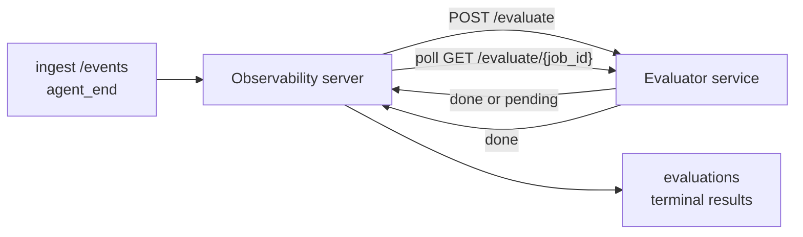

Failproof AI Observability может автоматически оценивать качество каждого завершённого запуска агента: вы предоставляете небольшой сервис оценки, а Observability берёт всё остальное на себя. Используйте это для отслеживания интересующих вас параметров (полезность, эффективность инструментов, фактичность, безопасность — вы выбираете), раннего обнаружения регрессий и сравнения агентов или окружений с первого взгляда. Оценка является опциональной: конвейер не работает до тех пор, пока вы не установите `EVALUATOR_ENDPOINT` на сервере.

> **Примечание:** вы определяете размеры оценок. Ваш оценщик может возвращать любые числовые ключи; Observability сохраняет, отслеживает и отображает всё, что вы отправляете.

## Краткий обзор

1. **Напишите оценщик.** Разверните небольшой HTTP-сервис, который читает расшифровку сеанса и возвращает оценки. Observability поставляется с рабочей справкой, которую вы можете скопировать. См. [Написание оценщика с помощью SDK](#написание-оценщика-с-помощью-sdk).
2. **Укажите Observability на него.** Установите `EVALUATOR_ENDPOINT` (и общий `EVALUATOR_TOKEN`) в процессе сервера.
3. **Следите за оценками.** Каждый завершённый сеанс оценивается автоматически; результаты появляются на странице деталей сеанса, в сетке сеансов и в сохранённых панелях.


*После настройки оценщика каждый завершённый запуск оценивается, и результаты появляются в правой панели сеанса: сводка сверху, затем столбцы оценок по каждому измерению с рассуждениями.*

---

## Как это работает



Когда Observability SDK отправляет событие `agent_end` для сеанса, сервер планирует оценку. Затем он отправляет полную расшифровку события на ваш сервис оценщика, который может:

- **Вернуть результат немедленно** с помощью `{"status":"done", "scores":{...}, "reasoning":{...}, "summary":"..."}`. Результат добавляется в шкалу времени оценки сеанса. `reasoning` и `summary` опциональны.
- **Отложить** с помощью `{"status":"pending", "job_id":"abc-123"}`. Затем Observability вызывает `GET {EVALUATOR_ENDPOINT}/evaluate/abc-123` до тех пор, пока ваш оценщик не вернёт `{"status":"done", ...}` или `{"status":"error", "error":"..."}`.

  Частота опроса зависит от задачи: ответ `pending` может включать `next_poll_secs` для переопределения; в противном случае Observability использует значение `default_poll_interval_secs` из `GET /config`; в противном случае сервер переходит к `EVALUATOR_POLLING_INTERVAL_SECS` (по умолчанию 10s). Все значения зажимаются до [1s, 1h].

Сеансы, которые никогда не отправляют `agent_end` (например, упавший процесс агента), также могут быть обработаны: `GET /config` оценщика может вернуть `{"inactivity_timeout_secs": 1800}`, и Observability будет оценивать любой сеанс, который был неактивен в течение этого времени. Установите это поле на `null` или опустите его для отключения этого резервного варианта.

Конвейер полностью неактивен, когда `EVALUATOR_ENDPOINT` не установлен.

Сеанс может накапливать **несколько окончательных оценок с течением времени**: каждое событие `agent_end` (и каждая ручная переоценка с панели) добавляет новую строку оценки. Это поддерживаемый способ оценки возобновлённого разговора: пользователь заканчивает агента, возвращается позже, отправляет дополнительные события, заканчивает агента снова, и вторая оценка запускается на полной обновлённой расшифровке. Панель отображает самую свежую оценку в качестве заголовка и предыдущие оценки как свёртываемую шкалу времени. Пока для сеанса выполняется одна оценка, дополнительные события `agent_end` для этого сеанса игнорируются; следующее после завершения выполняющейся оценки поставит в очередь новую оценку как обычно.

Резервный вариант неактивности снова активируется для возобновлённых сеансов: если новые события поступают после предыдущей окончательной оценки и сеанс затем переходит в режим ожидания за пределы `inactivity_timeout_secs`, новая оценка ставится в очередь.

Временные ошибки (5xx, 429, тайм-ауты, ошибки сети) повторяются с экспоненциальной задержкой до `EVALUATOR_MAX_ATTEMPTS`; ответы 4xx являются окончательными. Observability безопасно работает с несколькими горизонтально масштабируемыми экземплярами сервера; работа разбита так, чтобы один сеанс никогда не отправлялся дважды одновременно.

---

## HTTP контракт

Каждый маршрут с аутентификацией использует **аутентификацию по токену носителя**. Одно и то же значение должно быть настроено с обеих сторон:

- Сервер Observability: переменная окружения `EVALUATOR_TOKEN`
- Сервис оценщика: настроен тем же образом (SDK `agenteye-evaluator` читает `EVALUATOR_TOKEN` по соглашению)

Если `EVALUATOR_TOKEN` не установлен, сервер не отправляет заголовок `Authorization`; оценщик может затем принимать анонимные запросы, что приемлемо для сети только для внутреннего использования, но не рекомендуется в общедоступном интернете.

### Маршруты, которые должен обслуживать оценщик

| Маршрут | Тело / параметры | Ответ |
|---|---|---|
| `GET /health` | нет | `{"status":"ok"}` (открыт, без аутентификации) |
| `GET /config` | нет | `{"inactivity_timeout_secs": <int> \| null, "default_poll_interval_secs": <int> \| опустить}` |
| `POST /evaluate` | JSON `EvalRequest` | `{"status":"done", ...}` или `{"status":"pending", "job_id":"..."}` |
| `GET /evaluate/{id}` | нет | та же форма ответа, что и `/evaluate` |

### Тело `EvalRequest`, отправленное сервером

```json
{
  "schema_version": "1",
  "session_id":     "session-abc123",
  "agent_id":       "planner",
  "environment":    "production",
  "started_at":     "2026-05-10T12:00:00Z",
  "ended_at":       "2026-05-10T12:05:00Z",
  "events": [
    { "id": 1234, "ts": "...", "event_type": "agent_start", "payload": { ... } },
    ...
  ]
}
```

### Формы ответов

**Синхронно (готово):**

```json
{
  "status": "done",
  "scores": { "helpfulness": 0.85, "tool_efficiency": 0.6 },
  "reasoning": {
    "helpfulness": "answered the question directly with citations",
    "tool_efficiency": "called list_files three times when one would have done"
  },
  "summary": "strong answer quality, weak tool selection"
}
```

`reasoning` (карта обоснования для каждой оценки) и `summary` (общее однопараграфное повествование) являются опциональными. Ключи в `reasoning` должны совпадать с ключами в `scores`; панель отображает каждую запись встроенной под её столбцом оценки. Более старые оценщики, которые возвращают только `scores`, продолжают работать без изменений; `reasoning` и `summary` просто читаются как null и соответствующие элементы интерфейса опускаются.

**Асинхронно (отложено):**

```json
{ "status": "pending", "job_id": "abc-123", "next_poll_secs": 30 }
```

`next_poll_secs` опционален; если опущен, сервер переходит к `default_poll_interval_secs` оценщика из `/config`, затем к его собственной переменной окружения `EVALUATOR_POLLING_INTERVAL_SECS`.

**Окончательная ошибка со стороны оценщика:**

```json
{ "status": "error", "error": "model service unavailable" }
```

Сервер рассматривает любое другое тело 2xx как ошибку протокола и записывает окончательное `error` для сеанса.

---

## Написание оценщика с помощью SDK

Вам не нужно реализовывать HTTP контракт вручную. Пакет Python `agenteye-evaluator` предоставляет типизированную оболочку FastAPI, которая обрабатывает аутентификацию, маршрутизацию и формы запросов/ответов за вас.

Failproof AI Observability также поставляется с **рабочим справочным оценщиком**, который оценивает `helpfulness`, `tool_efficiency` и `factuality` на основе формы расшифровки. Скопируйте его как отправную точку и замените свою логику: судья LLM, механизм правил, всё, что соответствует вашему стандарту качества.

Минимально жизнеспособный оценщик:

```python
import os
from agenteye_evaluator import Evaluator, EvalRequest, EvalResponse

app = Evaluator(token=os.environ["EVALUATOR_TOKEN"])

@app.evaluator
def run(req: EvalRequest) -> EvalResponse:
    # Inspect req.events (the full session transcript) and return scores.
    tool_calls = sum(1 for e in req.events if e.event_type == "tool_use")
    return EvalResponse(
        scores={"tool_calls": float(tool_calls)},
        reasoning={"tool_calls": f"{tool_calls} tool invocations in the transcript"},
        summary="tight tool loop" if tool_calls < 5 else "agent looped on tools",
    )
```

Экземпляр `app` работает под любым ASGI-сервером, поэтому `uvicorn module:app` его запускает.

Для оценщиков, которым нужно отложить дорогостоящую работу, верните `JobPending` и зарегистрируйте обработчик `@app.job_lookup`; сервер Observability опрашивает `GET /evaluate/{job_id}` до тех пор, пока вы не вернёте окончательный статус или не истечёт крышка `EVALUATOR_MAX_POLL_DURATION_SECS` (по умолчанию 1 ч).

Полная справка API, асинхронный шаблон и схема события документированы в README SDK `agenteye-evaluator`.

---

## Запуск вашего оценщика

Оценщик — **ваш сервис** — Failproof AI Observability не поставляется с оценщиком по умолчанию, поэтому вы строите и запускаете его там, где вы запускаете свои собственные сервисы. Он работает под любым ASGI-сервером (например `uvicorn my_evaluator:app`); обслуживайте маршруты `/health`, `/config` и `/evaluate` из [HTTP контракта](#http-контракт), затем укажите сервер на него (см. [Настройка сервера](#настройка-сервера)).

Как только оценщик достижим, `GET /health` возвращает `{"status":"ok"}`. После завершения запуска агента `GET /evaluations` на сервере возвращает строку со статусом `status: "done"` и оценками, которые создал ваш оценщик.

---

## Настройка сервера

Установите в процессе сервера:

| Переменная окружения | Значение |
|---|---|
| `EVALUATOR_ENDPOINT` | Базовый URL вашего оценщика (`http://evaluator:9000`). Не установлено = конвейер отключен. |
| `EVALUATOR_TOKEN` | Токен носителя. Должно совпадать со значением, которым настроен сервис оценщика. |
| `EVALUATOR_WORKERS` | Рабочие задачи на экземпляр сервера (по умолчанию 2). |
| `EVALUATOR_CLAIM_BATCH` | Строки, заявленные за тик работника (по умолчанию 4). Пакеты обрабатываются **одновременно**; эффективная одновременность на вашей конечной точке оценщика — `EVALUATOR_WORKERS × EVALUATOR_CLAIM_BATCH`. |
| `EVALUATOR_POLL_IDLE_SECS` | Как долго рабочий спит между попытками отправки, когда оценка не требуется (по умолчанию 2s). |
| `EVALUATOR_POLLING_INTERVAL_SECS` | Окончательный резервный вариант для частоты `GET /evaluate/{id}`, когда ни `next_poll_secs` на каждый ответ, ни `default_poll_interval_secs` оценщика не установлены (по умолчанию 10s). |
| `EVALUATOR_REQUEST_TIMEOUT_MS` | Тайм-аут для каждого запроса (по умолчанию 30000). |
| `EVALUATOR_MAX_ATTEMPTS` | После такого количества временных ошибок результат записывается как окончательное `error` (по умолчанию 5). |
| `EVALUATOR_CONFIG_REFRESH_SECS` | Частота `GET /config` (по умолчанию 300). |
| `EVALUATOR_MAX_POLL_DURATION_SECS` | Максимальное время в реальном времени, в течение которого сеанс может оставаться в очереди опроса, прежде чем он будет завершён как `timeout` (по умолчанию 3600s). Защита от оценщика, который продолжает возвращать `pending` вечно. |

Чтобы включить автоматическую оценку, установите оба `EVALUATOR_ENDPOINT` и `EVALUATOR_TOKEN` на сервере, затем перезагрузите его, чтобы применить изменения. С неустановленным `EVALUATOR_ENDPOINT` конвейер остаётся неактивным.

Приведённые выше регулировочные ручки являются опциональными; установите соответствующие переменные окружения на сервере только если вам нужно переопределить значения по умолчанию.

---

## Справка API

| Метод | Путь | Требуемое разрешение | Назначение |
|---|---|---|---|
| `GET` | `/evaluations` | `evaluations:read` | Запрос окончательных результатов. Поддерживает `session_id`, `agent_id`, `environment`, `status` (`done`/`error`/`timeout`), `ts_from`, `ts_to`, `cursor`, `limit`, `score_filters`, `latest_per_session`. `limit` по умолчанию 50 и ограничен 200 (учтите, что это отличается от `/events`, который ограничен 1000). `environment` принимает разделённый запятыми список (например `environment=prod,staging`); отдельные значения также работают. С `latest_per_session=true` ответ содержит максимум одну строку на `session_id` (самую свежую по `completed_at`), используемую страницей списка сеансов для свёртывания шкалы времени оценки сеанса до текущего заголовка. По умолчанию false (возвращает полную историю). |
| `GET` | `/evaluations/aggregate` | `evaluations:read` | Свёрнутое здоровье оценки для отфильтрованного среза: общее количество, разбор done/error/timeout, статистика по ключам каждой оценки (count/avg/min/max/p50 по произвольным ключам `scores`) и шкала времени с временными рамками. Принимает **те же параметры фильтра, что и `/evaluations`** плюс `featured_keys` (CSV ключей оценок для отслеживания) и `latest_per_session`. Работает функция Dashboards; метрики точны по всему соответствующему набору, а не выборочны. |
| `GET` | `/evaluations/environments` | `evaluations:read` | Различные значения окружения из таблицы `evaluations`. Используется для заполнения раскрывающихся списков фильтров в масштабе данных, для которых можно читать оценки. |
| `GET` | `/evaluation-jobs` | `evaluations:read` | Видимость в полёте оценок. Фильтр по `status` (`pending`/`polling`). |
| `GET` | `/events` | `events:read` | Потоковая передача необработанных событий сеанса. Поддерживает `session_id`, `agent_id`, `event_type` (CSV), `environment` (CSV), `ts_from`, `ts_to`, `cursor`, `limit` и `order`. `order` — это `desc` (новые-первые, по умолчанию) или `asc` (старые-первые); неузнанное значение возвращается к `desc`. Курсорная пагинация через `next_cursor` ответа (ID события): передайте его как `cursor` для получения следующей страницы; с `asc` следующая страница — события после этого ID, с `desc` — события перед ним. `limit` по умолчанию 50 и ограничен 1000. |
| `GET` | `/sessions/:session_id/export` | `events:read` | Возвращает точное тело JSON, которое получит оценщик для этого сеанса, обслуживаемое как загружаемое вложение с именем `session-<id>.json`. Полезно для воспроизведения рабочих сеансов через `agenteye-evaluator` для автономного тестирования. Байты идентичны тем, которые отправляет конвейер оценщика. |
| `POST` | `/sessions/:session_id/re-evaluate` | `evaluations:trigger` | Поставить в очередь новую оценку для сеанса; запускается независимо от того, существует ли предыдущая оценка. Новый результат **добавляется** в шкалу времени оценки сеанса вместо перезаписи предыдущего, поэтому предыдущие оценки остаются видимыми как история. Возвращает `202` при постановке в очередь, `404` для неизвестного сеанса, `409` если оценка уже выполняется. Используйте это после развёртывания нового оценщика или для сеансов, которые никогда не отправляли `agent_end`. |

### Фильтрация по диапазону оценок: `score_filters`

`GET /evaluations` принимает опциональный параметр `score_filters`, который сужает результаты по числовым значениям внутри объекта `scores`. Параметр — это разделённый запятыми список записей `key:min..max`; любая граница может быть опущена. Несколько записей объединяются с логическим AND. Строки, в которых указанный ключ отсутствует или не является числовым, исключаются. Запрос может содержать максимум 20 записей фильтра; превышение этого возвращает HTTP 400.

Примеры:
```text
# helpfulness in [0.5, 0.8]
GET /evaluations?score_filters=helpfulness:0.5..0.8

# tool_efficiency at most 0.3 (no lower bound)
GET /evaluations?score_filters=tool_efficiency:..0.3

# helpfulness >= 0.5 AND factuality >= 0.9
GET /evaluations?score_filters=helpfulness:0.5..,factuality:0.9..
```

Каждый объект ответа `/evaluations` имеет эти поля:

| Поле | Тип | Примечания |
|---|---|---|
| `evaluation_id` | строка (UUID) | Каноническое имя этой окончательной оценки. Каждая окончательная оценка получает новый UUID; один сеанс может содержать несколько. |
| `id` | строка (UUID) | Псевдоним обратной совместимости с тем же значением, что и `evaluation_id`. |
| `session_id` | строка | Сеанс, на котором была запущена эта оценка. Сеанс может иметь несколько оценок в шкале времени. |
| `agent_id` | строка | Идентифицирует агента, который создал сеанс. |
| `environment` | строка | Этикетка окружения, скопированная из сеанса. |
| `status` | enum | Одно из `"done"`, `"error"`, `"timeout"`. |
| `scores` | объект \| null | Оценки, возвращённые вашим оценщиком. |
| `reasoning` | объект \| null | Опциональная карта обоснования для каждой оценки, возвращённая вашим оценщиком. Ключи обычно совпадают с ключами в `scores`. Панель отображает каждую запись под своей полосой оценки. |
| `summary` | строка \| null | Опциональное однопараграфное общее повествование, возвращённое вашим оценщиком. Панель отображает это над разбором по оценкам как заголовок оценки. |
| `error` | строка \| null | Заполнено только для `"error"` / `"timeout"`. |
| `attempt_count` | целое число | Количество попыток отправки (≥ 1). |
| `duration_ms` | целое число \| null | Длительность последней попытки. |
| `completed_at` | строка (ISO 8601 UTC) | Когда был записан окончательный результат. Результаты упорядочены по `completed_at` (новые первыми). |
| `created_at` | строка (ISO 8601 UTC) | Переносит то же самое время, что и `completed_at` (семантика записи один раз). |

---

## Разрешения

| Разрешение | Предоставляет |
|---|---|
| `evaluations:read` | Список результатов оценки, просмотр оценок на панели и загрузка метрик здоровья панели. |
| `evaluations:trigger` | Вручную поставить в очередь оценку для сеанса через `POST /sessions/:session_id/re-evaluate` или кнопку переоценки на панели. |
| `dashboards:read` | Просмотр сохранённых панелей (также нужно `evaluations:read` для загрузки их метрик). |
| `dashboards:write` | Создание и редактирование панелей. |
| `dashboards:delete` | Удаление панелей. |

Администратор-инициалиризатор (`ADMIN_KEY`, `ADMIN_EMAIL`) автоматически получает эти разрешения.

---

## Просмотр результатов

- **`/sessions/<id>`**: шкала времени событий + правая панель, показывающая оценки сеанса и любую ошибку из попытки отправки. Если ваш ключ имеет `evaluations:trigger`, рядом с кнопкой экспорта появляется кнопка **переоценки**, полезная для сеансов, которые никогда не отправляли `agent_end`, или для обновления оценок после развёртывания нового оценщика. Панель опрашивает новый результат и обновляет правую панель когда он приходит.
- **`/sessions`**: фильтруемая сетка сеансов; столбец оценок показывает статус оценки каждого сеанса и оценки с первого взгляда.
- **`/dashboards`**: сохранённые представления здоровья оценки (см. [Панели](#панели) ниже).


*Сетка сеансов показывает статус оценки каждого запуска и оценки с первого взгляда; красные/жёлтые/зелёные значки заставляют низкие оценки выделяться.*

---

## Панели

Страница **Dashboards** (`/dashboards`) позволяет вам сохранить комбинацию фильтров оценки как именованное, повторно используемое представление и смотреть, как этот срез оценок делает с первого взгляда. Панели **общие для всей вашей организации**; все с `dashboards:read` видят один и тот же набор.

Каждая панель закрепляет:

- **Фильтры**: те же элементы управления, что на странице сеансов: окружение, статус, агент, скользящее временное окно и фильтры диапазона оценок (`key:min..max`).
- **Конфигурация отображения**: какие ключи оценок выделить, зелёные/жёлтые/красные пороги здоровья, какие панели показать и следует ли свёртывать до самой свежей оценки для каждого сеанса.

Каждая карточка показывает количество соответствующих сеансов, разбор done/error/timeout, среднее значение каждой выделенной оценки и небольшую линию тренда. Открытие панели показывает полнораз панели; **"открыть в сеансах"** переносит вас на страницу сеансов предварительно отфильтрованную ровно на этот срез. Метрики вычисляются на сервере по всему соответствующему набору (через `GET /evaluations/aggregate`), так что числа точны, а не выборочны.


**Разрешения:** просмотр требует оба `dashboards:read` и `evaluations:read`; создание и редактирование требует `dashboards:write`; удаление требует `dashboards:delete`. Администратор-инициалиризатор получает все эти разрешения автоматически.

---

## Устранение неполадок

**Сеансы существуют, но не создаются оценки.** Подтвердите, что `EVALUATOR_ENDPOINT` установлен в процессе сервера, что сервер и оценщик совместно используют то же значение `EVALUATOR_TOKEN`, и что конечная точка `/health` оценщика достижима с сервера. С неустановленным `EVALUATOR_ENDPOINT` конвейер не работает.

**Оценки в полёте накапливаются.** Запросите `GET /evaluation-jobs` для просмотра очереди в полёте. Проверьте `attempt_count`, `next_attempt_at` и `last_error` в каждой строке. Частые причины: сервис оценщика недостижим или возвращает 5xx (повторяется с задержкой), неправильный `EVALUATOR_TOKEN` (401 окончательный), или асинхронный оценщик, который возвращает `pending` неопределённо долго (см. ниже).

**Сеансы завершены, но нет окончательной оценки.** Запросите `GET /evaluation-jobs?status=polling`; результат может всё ещё быть в полёте. Если задача застрянула в `pending`, серверу не удаётся достичь оценщика; проверьте, что оценщик работает и что `EVALUATOR_TOKEN` совпадает.

**`HTTP 401 from evaluator: invalid bearer token`.** `EVALUATOR_TOKEN` на сервере не совпадает со значением, которым настроен сервис оценщика. Они должны быть идентичны.

**Асинхронный оценщик возвращает `pending` вечно.** Сервер опрашивает `GET /evaluate/{job_id}` до тех пор, пока оценщик не вернёт `done` или `error`, или до истечения `EVALUATOR_MAX_POLL_DURATION_SECS` (по умолчанию 1 ч). После превышения крышки оценка записывается как `timeout` и удаляется из очереди в полёте. Поднимите `EVALUATOR_MAX_POLL_DURATION_SECS`, если вашему оценщику законно требуется больше времени, чем по умолчанию.

---

## Дальнейшие шаги

- [Навык агента оценщика](/ru/agenteye/evaluator-skill): попросите кодирующего агента спроектировать ваши размеры против реальных сеансов и построить этот сервис для вас.
- [Python SDK](/ru/agenteye/python-sdk): отправьте события `agent_end`, которые запускают оценку.
- [Ключи API](/ru/agenteye/api-keys): разрешения `evaluations:read` и `evaluations:trigger`.
- [Аудиты](/ru/agenteye/audits): другая автоматизированная функция качества Observability, для рецензирования на основе политики.