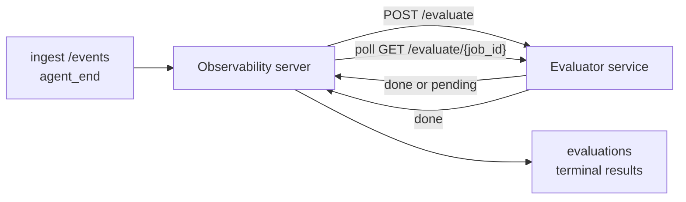

Failproof AI Observability может автоматически оценивать качество каждого завершённого запуска агента: вы предоставляете небольшой сервис подсчёта оценок, а Observability берёт на себя остальное. Используйте его для отслеживания интересующих вас параметров (полезность, эффективность инструментов, точность фактов, безопасность — выбирайте сами), раннего выявления регрессий и сравнения агентов или окружений с первого взгляда. Оценивание опционально: конвейер ничего не делает до тех пор, пока вы не установите `EVALUATOR_ENDPOINT` на сервере.

> **Примечание:** вы определяете размерности оценок. Ваш оценивающий сервис может возвращать любые числовые ключи; Observability сохраняет, отслеживает и отображает всё, что вы отправляете.

## Обзор

1. **Напишите оценивающий модуль.** Создайте небольшой HTTP-сервис, который читает стенограмму сеанса и возвращает оценки. Observability поставляется с рабочей эталонной реализацией, которую можно использовать как шаблон. Смотрите раздел [Написание оценивающего сервиса с использованием SDK](#написание-оценивающего-сервиса-с-использованием-sdk).
2. **Укажите Observability на этот сервис.** Установите `EVALUATOR_ENDPOINT` (и общий `EVALUATOR_TOKEN`) на процесс сервера.
3. **Смотрите, как появляются оценки.** Каждый завершённый сеанс автоматически оценивается; результаты появляются на странице деталей сеанса, в сетке сеансов и на сохранённых панелях мониторинга.


*После настройки оценивающего сервиса каждый завершённый запуск получает оценку, и результаты отображаются на правой панели сеанса: итоговая оценка вверху, затем столбцы оценок по размерностям с обоснованием.*

---

## Как это работает



Когда SDK Failproof AI Observability испускает событие `agent_end` для сеанса, сервер планирует оценивание. Затем он отправляет полную стенограмму событий в ваш оценивающий сервис, который может либо:

- **Вернуть результат встроенным образом** с помощью `{"status":"done", "scores":{...}, "reasoning":{...}, "summary":"..."}`. Результат добавляется в шкалу времени оценивания сеанса. `reasoning` и `summary` необязательны.
- **Отложить** с помощью `{"status":"pending", "job_id":"abc-123"}`. Observability затем вызывает `GET {EVALUATOR_ENDPOINT}/evaluate/abc-123` до тех пор, пока ваш оценивающий сервис не вернёт `{"status":"done", ...}` или `{"status":"error", "error":"..."}`.

  Частота опроса индивидуальна для каждого задания: ответ `pending` может включать `next_poll_secs` для переопределения; в противном случае Observability использует значение `default_poll_interval_secs` из `GET /config`; иначе сервер переходит на `EVALUATOR_POLLING_INTERVAL_SECS` (по умолчанию 10с). Все значения ограничены диапазоном [1s, 1h].

Сеансы, которые никогда не испускали `agent_end` (например, если процесс агента упал), также можно обработать: `GET /config` оценивающего сервиса может вернуть `{"inactivity_timeout_secs": 1800}`, и Observability будет оценивать любой сеанс, находящийся без активности в течение этого времени. Установите это поле в `null` или опустите его, чтобы отключить этот резервный вариант.

Конвейер полностью не работает, когда `EVALUATOR_ENDPOINT` не установлен.

Сеанс может накапливать **несколько терминальных оценок с течением времени**: каждое событие `agent_end` (и каждое ручное переоценивание с панели мониторинга) добавляет новую строку оценки. Это поддерживаемый способ оценивания продолжения беседы: пользователь завершает агента, возвращается позже, отправляет больше событий, снова завершает агента, и выполняется второе оценивание для полной обновленной стенограммы. Панель мониторинга отображает самую последнюю оценку как заголовок и предыдущие оценки как свёртываемую шкалу времени. Пока одна оценка выполняется для сеанса, дополнительные события `agent_end` для этого сеанса игнорируются; следующее после завершения текущей оценки обычно ставит в очередь свежую оценку.

Резервный вариант неактивности также действует для возобновлённых сеансов: если после предыдущей терминальной оценки поступают новые события и сеанс затем переходит в неактивность на время `inactivity_timeout_secs`, новая оценка ставится в очередь.

Временные сбои (5xx, 429, таймауты, ошибки сети) повторяются с экспоненциальной задержкой до `EVALUATOR_MAX_ATTEMPTS`; ответы 4xx являются терминальными. Observability безопасна для запуска с несколькими горизонтально масштабируемыми экземплярами сервера; работа распределяется так, чтобы один сеанс никогда не отправлялся дважды одновременно.

---

## HTTP контракт

Каждый аутентифицированный маршрут использует **аутентификацию по токену-носителю**. Одно и то же значение должно быть настроено с обеих сторон:

- Сервер Observability: переменная окружения `EVALUATOR_TOKEN`
- Оценивающий сервис: настроен так же (SDK `agenteye-evaluator` по соглашению читает `EVALUATOR_TOKEN`)

Если `EVALUATOR_TOKEN` не установлен, сервер не отправляет заголовок `Authorization`; оценивающий сервис может затем принимать анонимные запросы, что нормально для внутренней сети, но не рекомендуется в общедоступном интернете.

### Маршруты, которые должен предоставлять оценивающий сервис

| Маршрут | Тело / параметры | Ответ |
|---|---|---|
| `GET /health` | нет | `{"status":"ok"}` (открытый, без аутентификации) |
| `GET /config` | нет | `{"inactivity_timeout_secs": <int> \| null, "default_poll_interval_secs": <int> \| omitted}` |
| `POST /evaluate` | JSON `EvalRequest` | `{"status":"done", ...}` или `{"status":"pending", "job_id":"..."}` |
| `GET /evaluate/{id}` | нет | та же форма ответа, что и `/evaluate` |

### Тело `EvalRequest`, отправленное сервером

```json
{
  "schema_version": "1",
  "session_id":     "session-abc123",
  "agent_id":       "planner",
  "environment":    "production",
  "started_at":     "2026-05-10T12:00:00Z",
  "ended_at":       "2026-05-10T12:05:00Z",
  "events": [
    { "id": 1234, "ts": "...", "event_type": "agent_start", "payload": { ... } },
    ...
  ]
}
```

### Формы ответов

**Синхронный (завершено):**

```json
{
  "status": "done",
  "scores": { "helpfulness": 0.85, "tool_efficiency": 0.6 },
  "reasoning": {
    "helpfulness": "answered the question directly with citations",
    "tool_efficiency": "called list_files three times when one would have done"
  },
  "summary": "strong answer quality, weak tool selection"
}
```

`reasoning` (карта обоснований для каждой оценки) и `summary` (общее однопараграфное описание) оба опциональны. Ключи в `reasoning` должны соответствовать ключам в `scores`; панель мониторинга отображает каждую запись встроенной строкой под её столбцом оценки. Более старые оценивающие сервисы, возвращающие только `scores`, продолжают работать без изменений; `reasoning` и `summary` просто читаются как null, и соответствующие элементы UI опускаются.

**Асинхронный (отложенный):**

```json
{ "status": "pending", "job_id": "abc-123", "next_poll_secs": 30 }
```

`next_poll_secs` опционален; если опущен, сервер переходит к `default_poll_interval_secs` оценивающего сервиса из `/config`, затем к собственной переменной окружения `EVALUATOR_POLLING_INTERVAL_SECS`.

**Терминальная ошибка на стороне оценивающего сервиса:**

```json
{ "status": "error", "error": "model service unavailable" }
```

Сервер рассматривает любое другое тело 2xx как ошибку протокола и записывает терминальную `error` для сеанса.

---

## Написание оценивающего сервиса с использованием SDK

Вам не нужно вручную реализовывать HTTP контракт. Пакет Python `agenteye-evaluator` предоставляет типизированный обёртку FastAPI, которая обрабатывает аутентификацию, маршрутизацию и формы запроса/ответа за вас.

Failproof AI Observability также поставляется с **рабочей эталонной реализацией**, которая оценивает `helpfulness`, `tool_efficiency` и `factuality` на основе формы стенограммы. Используйте её как отправную точку и замените логику своей: судья на основе LLM, правило-движок, что-нибудь, соответствующее вашим стандартам качества.

Минимально жизнеспособный оценивающий сервис:

```python
import os
from agenteye_evaluator import Evaluator, EvalRequest, EvalResponse

app = Evaluator(token=os.environ["EVALUATOR_TOKEN"])

@app.evaluator
def run(req: EvalRequest) -> EvalResponse:
    # Inspect req.events (the full session transcript) and return scores.
    tool_calls = sum(1 for e in req.events if e.event_type == "tool_use")
    return EvalResponse(
        scores={"tool_calls": float(tool_calls)},
        reasoning={"tool_calls": f"{tool_calls} tool invocations in the transcript"},
        summary="tight tool loop" if tool_calls < 5 else "agent looped on tools",
    )
```

Экземпляр `app` работает под любым ASGI-сервером, поэтому `uvicorn module:app` его запускает.

Для оценивающих сервисов, которым нужно отложить дорогостоящую работу, вместо этого верните `JobPending` и зарегистрируйте обработчик `@app.job_lookup`; сервер Observability опрашивает `GET /evaluate/{job_id}` до тех пор, пока вы не вернёте терминальный статус или не истечёт срок `EVALUATOR_MAX_POLL_DURATION_SECS` (по умолчанию 1 ч).

Полный справочник API, асинхронный паттерн и схема событий задокументированы в README SDK `agenteye-evaluator`.

---

## Запуск оценивающего сервиса

Оценивающий сервис — **ваш сервис** — Failproof AI Observability не поставляет оценивающий сервис по умолчанию, поэтому вы его создаёте и запускаете там же, где запускаете свои сервисы. Он работает под любым ASGI-сервером (например `uvicorn my_evaluator:app`); предоставьте маршруты `/health`, `/config` и `/evaluate` из [HTTP контракта](#http-контракт), затем укажите на него сервер (см. [Настройка сервера](#настройка-сервера)).

Когда оценивающий сервис доступен, `GET /health` возвращает `{"status":"ok"}`. После того как агент полностью завершит работу, `GET /evaluations` на сервере возвращает строку с `status: "done"` и оценками, которые произвёл ваш оценивающий сервис.

---

## Настройка сервера

Установите на процесс сервера:

| Переменная окружения | Значение |
|---|---|
| `EVALUATOR_ENDPOINT` | Базовый URL вашего оценивающего сервиса (`http://evaluator:9000`). Не установлен = конвейер отключен. |
| `EVALUATOR_TOKEN` | Токен-носитель. Должен соответствовать значению, с которым настроен оценивающий сервис. |
| `EVALUATOR_WORKERS` | Рабочие задачи на экземпляр сервера (по умолчанию 2). |
| `EVALUATOR_CLAIM_BATCH` | Строки, запрашиваемые за один такт рабочего процесса (по умолчанию 4). Пакеты обрабатываются **параллельно**; эффективная параллелизм на вашем оценивающем эндпоинте составляет `EVALUATOR_WORKERS × EVALUATOR_CLAIM_BATCH`. |
| `EVALUATOR_POLL_IDLE_SECS` | Как долго рабочий процесс спит между попытками отправки, когда оценивание не требуется (по умолчанию 2 с). |
| `EVALUATOR_POLLING_INTERVAL_SECS` | Окончательный резервный вариант для частоты `GET /evaluate/{id}`, когда ни `next_poll_secs` в ответе, ни `default_poll_interval_secs` оценивающего сервиса не установлены (по умолчанию 10 с). |
| `EVALUATOR_REQUEST_TIMEOUT_MS` | Таймаут для каждого запроса (по умолчанию 30000). |
| `EVALUATOR_MAX_ATTEMPTS` | После стольких временных сбоев результат записывается как терминальная `error` (по умолчанию 5). |
| `EVALUATOR_CONFIG_REFRESH_SECS` | Частота `GET /config` (по умолчанию 300). |
| `EVALUATOR_MAX_POLL_DURATION_SECS` | Максимальное реальное время, в течение которого сеанс может оставаться в очереди опроса перед его прерыванием как `timeout` (по умолчанию 3600 с). Защищает от оценивающего сервиса, который постоянно возвращает `pending`. |

Чтобы включить автоматическое оценивание, установите и `EVALUATOR_ENDPOINT`, и `EVALUATOR_TOKEN` на сервере, затем перезапустите его, чтобы изменения вступили в силу. Когда `EVALUATOR_ENDPOINT` не установлен, конвейер остаётся неработающим.

Вышеупомянутые регулировочные параметры опциональны; устанавливайте соответствующие переменные окружения на сервере только если вам нужно переопределить значения по умолчанию.

---

## Справочник API

| Метод | Путь | Требуемое разрешение | Назначение |
|---|---|---|---|
| `GET` | `/evaluations` | `evaluations:read` | Запрос терминальных результатов. Поддерживает `session_id`, `agent_id`, `environment`, `status` (`done`/`error`/`timeout`), `ts_from`, `ts_to`, `cursor`, `limit`, `score_filters`, `latest_per_session`. `limit` по умолчанию 50 и ограничен 200 (обратите внимание, это отличается от `/events`, которая ограничена 1000). `environment` принимает список, разделённый запятыми (например `environment=prod,staging`); одиночные значения тоже работают. С `latest_per_session=true` ответ содержит не более одной строки для каждого `session_id` (самая последняя по `completed_at`), используется страницей списка сеансов для свёртывания шкалы времени оценивания сеанса к его текущему заголовку. По умолчанию false (возвращает полную историю). |
| `GET` | `/evaluations/aggregate` | `evaluations:read` | Свёрнутое состояние здоровья оценивания для отфильтрованного среза: общее количество, разбор done/error/timeout, статистика для каждого ключа оценки (count/avg/min/max/p50 над произвольными ключами `scores`), и шкала времени с временными интервалами. Принимает **те же параметры фильтра, что и `/evaluations`** плюс `featured_keys` (CSV ключей оценок для отслеживания) и `latest_per_session`. Обеспечивает функцию Dashboards; метрики точны по всему совпадающему набору, не выборочны. |
| `GET` | `/evaluations/environments` | `evaluations:read` | Различные значения environment из таблицы `evaluations`. Используется для заполнения фильтров-выпадающих списков, ограниченных данными, доступными для чтения оценок. |
| `GET` | `/evaluation-jobs` | `evaluations:read` | Видимость в полёте выполняемых оценок. Фильтрование по `status` (`pending`/`polling`). |
| `GET` | `/events` | `events:read` | Потоковая передача необработанных событий сеанса. Поддерживает `session_id`, `agent_id`, `event_type` (CSV), `environment` (CSV), `ts_from`, `ts_to`, `cursor`, `limit` и `order`. `order` — `desc` (новейшие первыми, по умолчанию) или `asc` (старейшие первыми); неопознанное значение переходит на `desc`. Подвижная пагинация через `next_cursor` ответа (идентификатор события): передайте его обратно как `cursor`, чтобы получить следующую страницу; с `asc` следующая страница содержит события после этого id, с `desc` — события перед ним. `limit` по умолчанию 50 и ограничен 1000. |
| `GET` | `/sessions/:session_id/export` | `events:read` | Возвращает точное тело JSON, которое оценивающий сервис получит для этого сеанса, обслуживаемое как загружаемое вложение с названием `session-<id>.json`. Полезно для воспроизведения сеансов из производства через `agenteye-evaluator` для оффлайн-тестирования. Байты идентичны тем, что отправляет конвейер оценивания. |
| `POST` | `/sessions/:session_id/re-evaluate` | `evaluations:trigger` | Поставить в очередь свежую оценку для сеанса; работает независимо от того, существует ли предыдущая оценка. Новый результат **добавляется** к шкале времени оценивания сеанса вместо перезаписи предыдущего, поэтому предыдущие оценки остаются видимой историей. Возвращает `202` при постановке в очередь, `404` для неизвестного сеанса, `409` если оценка уже выполняется. Используйте это после развёртывания нового оценивающего сервиса или для сеансов, которые никогда не испускали `agent_end`. |

### Фильтрация по диапазону оценок: `score_filters`

`GET /evaluations` принимает опциональный параметр `score_filters`, который сужает результаты по числовым значениям внутри объекта `scores`. Параметр представляет собой список записей `key:min..max`, разделённых запятыми; любая граница может быть опущена. Несколько записей объединяются логическим AND. Строки, в которых именованный ключ отсутствует или не числовой, исключаются. Запрос может содержать не более 20 записей фильтра; превышение возвращает HTTP 400.

Примеры:
```text
# helpfulness в [0.5, 0.8]
GET /evaluations?score_filters=helpfulness:0.5..0.8

# tool_efficiency не более 0.3 (без нижней границы)
GET /evaluations?score_filters=tool_efficiency:..0.3

# helpfulness >= 0.5 И factuality >= 0.9
GET /evaluations?score_filters=helpfulness:0.5..,factuality:0.9..
```

Каждый объект ответа `/evaluations` имеет эти поля:

| Поле | Тип | Примечания |
|---|---|---|
| `evaluation_id` | string (UUID) | Канонический идентификатор этой терминальной оценки. Каждая терминальная оценка получает новый UUID; один сеанс может содержать несколько. |
| `id` | string (UUID) | Псевдоним обратной совместимости, содержащий то же значение, что и `evaluation_id`. |
| `session_id` | string | Сеанс, по которому выполнялась оценка. Сеанс может иметь несколько оценок на шкале времени. |
| `agent_id` | string | Идентифицирует агента, создавшего сеанс. |
| `environment` | string | Метка окружения, скопированная из сеанса. |
| `status` | enum | Один из `"done"`, `"error"`, `"timeout"`. |
| `scores` | object \| null | Оценки, возвращённые вашим оценивающим сервисом. |
| `reasoning` | object \| null | Опциональная карта обоснований для каждой оценки, возвращённая вашим оценивающим сервисом. Ключи обычно соответствуют ключам в `scores`. Панель мониторинга отображает каждую запись под её столбцом оценки. |
| `summary` | string \| null | Опциональное однопараграфное общее описание, возвращённое вашим оценивающим сервисом. Панель мониторинга отображает это выше разбора по размерностям как заголовок оценки. |
| `error` | string \| null | Заполняется только при `"error"` / `"timeout"`. |
| `attempt_count` | integer | Количество попыток отправки (≥ 1). |
| `duration_ms` | integer \| null | Продолжительность последней попытки. |
| `completed_at` | string (ISO 8601 UTC) | Когда был записан терминальный результат. Результаты упорядочены по `completed_at` (новейшие первыми). |
| `created_at` | string (ISO 8601 UTC) | Содержит то же время, что и `completed_at` (семантика записи один раз). |

---

## Разрешения

| Разрешение | Предоставляет |
|---|---|
| `evaluations:read` | Перечисление результатов оценивания, просмотр оценок на панели мониторинга и загрузка метрик здоровья панели мониторинга. |
| `evaluations:trigger` | Ручная постановка в очередь оценки для сеанса через `POST /sessions/:session_id/re-evaluate` или кнопку переоценивания панели мониторинга. |
| `dashboards:read` | Просмотр сохранённых панелей мониторинга (также требуется `evaluations:read` для загрузки их метрик). |
| `dashboards:write` | Создание и редактирование панелей мониторинга. |
| `dashboards:delete` | Удаление панелей мониторинга. |

Начальный администратор (`ADMIN_KEY`, `ADMIN_EMAIL`) автоматически получает эти разрешения.

---

## Просмотр результатов

- **`/sessions/<id>`**: шкала времени событий + правая панель, показывающая оценки сеанса и любую ошибку из попытки отправки. Если ваш ключ имеет `evaluations:trigger`, рядом с кнопкой экспорта появляется кнопка **переоценивания**, полезная для сеансов, которые никогда не испускали `agent_end`, или для обновления оценок после развёртывания нового оценивающего сервиса. Панель мониторинга опрашивает новый результат и обновляет правую панель при его поступлении.
- **`/sessions`**: фильтруемая сетка сеансов; столбец оценок показывает статус оценивания каждого сеанса и оценки с первого взгляда.
- **`/dashboards`**: сохранённые представления здоровья оценивания (см. раздел [Панели мониторинга](#панели-мониторинга) ниже).


*Сетка сеансов показывает статус оценивания каждого запуска и оценки с первого взгляда; красные/оранжевые/зелёные бейджи делают низкие оценки заметными.*

---

## Панели мониторинга

Страница **Dashboards** (`/dashboards`) позволяет сохранить комбинацию фильтров оценивания как именованное, переиспользуемое представление и наблюдать, как этот срез оценок работает с первого взгляда. Панели мониторинга **общие для всей вашей организации**; все, у кого есть `dashboards:read`, видят одно и то же.

Каждая панель мониторинга закрепляет:

- **Фильтры**: те же элементы управления, что и на странице сеансов: окружение, статус, агент, скользящее временное окно и фильтры диапазона оценок (`key:min..max`).
- **Конфигурацию отображения**: какие ключи оценок выделить, зелёные/оранжевые/красные пороги здоровья, какие панели показать и свёртывать ли до последней оценки на сеанс.

Каждая карточка показывает количество совпадающих сеансов, разбор done/error/timeout, среднее значение каждой выделенной оценки и небольшую трендовую спарклайн. Открытие панели мониторинга показывает полноразмерные панели; **"открыть в сеансах"** переводит вас на страницу сеансов с предварительным фильтром на этот точный срез. Метрики вычисляются на сервере по всему совпадающему набору (через `GET /evaluations/aggregate`), поэтому числа точны, а не выборочны.


**Разрешения:** просмотр требует и `dashboards:read`, и `evaluations:read`; создание и редактирование требуют `dashboards:write`; удаление требует `dashboards:delete`. Начальный администратор получает все эти автоматически.

---

## Устранение неполадок

**Сеансы существуют, но оценки не создаются.** Подтвердите, что `EVALUATOR_ENDPOINT` установлен на процесс сервера, что сервер и оценивающий сервис используют одно и то же значение `EVALUATOR_TOKEN`, и что эндпоинт `/health` оценивающего сервиса доступен с сервера. Когда `EVALUATOR_ENDPOINT` не установлен, конвейер — это no-op.

**Выполняемые оценки накапливаются.** Запросите `GET /evaluation-jobs` для просмотра очереди выполнения. Проверьте `attempt_count`, `next_attempt_at` и `last_error` для каждой строки. Частые причины: оценивающий сервис недоступен или возвращает 5xx (повторяется с задержкой), неправильный `EVALUATOR_TOKEN` (401 — терминальный), или асинхронный оценивающий сервис, постоянно возвращающий `pending` (см. ниже).

**Сеансы завершены, но нет терминальной оценки.** Запросите `GET /evaluation-jobs?status=polling`; результат всё ещё может выполняться. Если задание застряло в `pending`, сервер имеет проблемы с доступом к оценивающему сервису; проверьте, что оценивающий сервис запущен и что `EVALUATOR_TOKEN` совпадает.

**`HTTP 401 from evaluator: invalid bearer token`.** `EVALUATOR_TOKEN` на сервере не соответствует значению, с которым настроен оценивающий сервис. Они должны быть идентичны.

**Асинхронный оценивающий сервис постоянно возвращает `pending`.** Сервер опрашивает `GET /evaluate/{job_id}` до тех пор, пока оценивающий сервис не вернёт `done` или `error`, или пока не истечёт `EVALUATOR_MAX_POLL_DURATION_SECS` (по умолчанию 1 ч). После превышения лимита оценка записывается как `timeout` и удаляется из очереди выполнения. Увеличьте `EVALUATOR_MAX_POLL_DURATION_SECS`, если ваш оценивающий сервис действительно требует больше времени, чем по умолчанию.

---

## Следующие шаги

- [Evaluator agent skill](/ru/agenteye/evaluator-skill): вспомогательный агент кодирования может спроектировать ваши размерности против реальных сеансов и создать этот сервис для вас.
- [Python SDK](/ru/agenteye/python-sdk): испускание событий `agent_end`, которые запускают оценивание.
- [API keys](/ru/agenteye/api-keys): разрешения `evaluations:read` и `evaluations:trigger`.
- [Audits](/ru/agenteye/audits): другая функция автоматического контроля качества Observability, для проверки на основе политик.