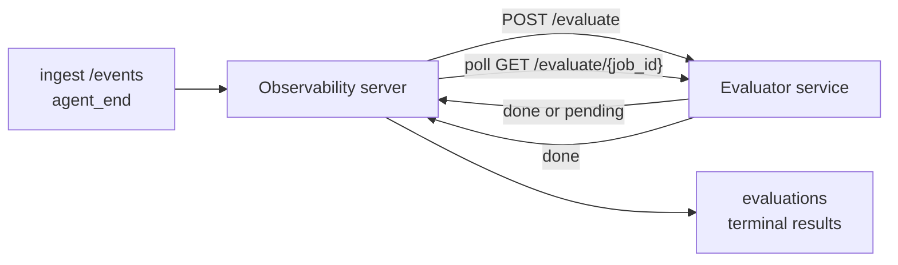

Failproof AI Observability может автоматически оценивать каждый завершённый запуск агента по качеству: вы предоставляете небольшой сервис оценки, а Observability берёт на себя остальное. Используйте его для отслеживания важных для вас показателей (полезность, эффективность инструментов, фактичность, безопасность — вы выбираете), раннего обнаружения регрессий и быстрого сравнения агентов или окружений. Оценка опциональна: конвейер ничего не делает, пока вы не установите `EVALUATOR_ENDPOINT` на сервере.

> **Примечание:** вы определяете размеры оценки. Ваш оценщик может возвращать любые числовые ключи; Observability сохраняет, отслеживает и отображает всё, что вы отправляете.

## Краткий обзор

1. **Напишите оценщик.** Создайте небольшой HTTP-сервис, который читает стенограмму сеанса и возвращает оценки. Observability поставляется с работающей ссылкой, которую вы можете скопировать. См. [Написание оценщика с помощью SDK](#writing-an-evaluator-with-the-sdk).
2. **Укажите Observability на него.** Установите `EVALUATOR_ENDPOINT` (и общий `EVALUATOR_TOKEN`) на процессе сервера.
3. **Смотрите, как приходят оценки.** Каждый завершённый сеанс оценивается автоматически; результаты появляются на странице деталей сеанса, в таблице сеансов и в сохранённых панелях управления.


*После настройки оценщика каждый завершённый запуск оценивается и результаты появляются в правой панели сеанса: итог вверху, затем полоски оценок для каждого измерения с обоснованием.*

---

## Как это работает



Когда SDK Observability отправляет событие `agent_end` для сеанса, сервер планирует оценку. Затем он отправляет полную стенограмму событий на ваш сервис оценки, который может либо:

- **Вернуть результат встроенно** с `{"status":"done", "scores":{...}, "reasoning":{...}, "summary":"..."}`. Результат добавляется в хронику оценок сеанса. `reasoning` и `summary` опциональны.
- **Отложить** с `{"status":"pending", "job_id":"abc-123"}`. Observability затем вызывает `GET {EVALUATOR_ENDPOINT}/evaluate/abc-123` до тех пор, пока ваш оценщик не вернёт `{"status":"done", ...}` или `{"status":"error", "error":"..."}`.

  Периодичность опроса зависит от задания: ответ `pending` может включать `next_poll_secs` для переопределения; в противном случае Observability использует значение `default_poll_interval_secs` из `GET /config`; в противном случае сервер возвращается к `EVALUATOR_POLLING_INTERVAL_SECS` (по умолчанию 10 с). Все значения ограничены [1 с, 1 ч].

Сеансы, которые никогда не отправляют `agent_end` (например, аварийно завершённый процесс агента), также могут быть подхвачены: `GET /config` оценщика может возвращать `{"inactivity_timeout_secs": 1800}`, и Observability будет оценивать любой сеанс, который был неактивен в течение этого времени. Установите значение `null` или пропустите его, чтобы отключить этот запасной вариант.

Конвейер полностью неработающий, когда `EVALUATOR_ENDPOINT` не установлен.

Сеанс может накапливать **несколько терминальных оценок со временем**: каждое событие `agent_end` (и каждая ручная переоценка с панели) добавляет новую строку оценки. Это поддерживаемый способ оценки возобновлённого разговора: пользователь завершает агента, возвращается позже, отправляет новые события, снова завершает агента, и запускается вторая оценка по полной обновлённой стенограмме. Панель отображает самую последнюю оценку как основной заголовок и предыдущие оценки как свёртываемую хронику. Пока одна оценка выполняется для сеанса, дополнительные события `agent_end` для этого сеанса игнорируются; следующее после завершения текущей оценки добавит новую оценку как обычно.

Запасной вариант неактивности повторно активируется и на возобновлённых сеансах: если новые события поступают после предыдущей терминальной оценки и сеанс затем переходит в режим неактивности свыше `inactivity_timeout_secs`, новая оценка добавляется в очередь.

Временные ошибки (5xx, 429, таймауты, ошибки сети) повторяются с экспоненциальной задержкой до `EVALUATOR_MAX_ATTEMPTS`; ответы 4xx являются терминальными. Observability безопасен для запуска с несколькими горизонтально масштабируемыми экземплярами сервера; работа разбита так, чтобы один и тот же сеанс никогда не отправлялся дважды одновременно.

---

## HTTP контракт

Каждый защищённый маршрут использует **аутентификацию по токену bearer**. Одно и то же значение должно быть настроено с обеих сторон:

- Сервер Observability: переменная окружения `EVALUATOR_TOKEN`
- Сервис оценки: настроен так же (SDK `agenteye-evaluator` по соглашению читает `EVALUATOR_TOKEN`)

Если `EVALUATOR_TOKEN` не установлен, сервер не отправляет заголовок `Authorization`; оценщик может затем принимать анонимные запросы, что нормально для внутренней сети, но не рекомендуется для публичного интернета.

### Маршруты, которые должен предоставлять оценщик

| Маршрут | Тело / параметры | Ответ |
|---|---|---|
| `GET /health` | нет | `{"status":"ok"}` (открытый, без аутентификации) |
| `GET /config` | нет | `{"inactivity_timeout_secs": <int> \| null, "default_poll_interval_secs": <int> \| опущен}` |
| `POST /evaluate` | JSON `EvalRequest` | `{"status":"done", ...}` или `{"status":"pending", "job_id":"..."}` |
| `GET /evaluate/{id}` | нет | такая же форма ответа как `/evaluate` |

### Тело запроса `EvalRequest`, отправляемое сервером

```json
{
  "schema_version": "1",
  "session_id":     "session-abc123",
  "agent_id":       "planner",
  "environment":    "production",
  "started_at":     "2026-05-10T12:00:00Z",
  "ended_at":       "2026-05-10T12:05:00Z",
  "events": [
    { "id": 1234, "ts": "...", "event_type": "agent_start", "payload": { ... } },
    ...
  ]
}
```

### Формы ответов

**Синхронно (завершено):**

```json
{
  "status": "done",
  "scores": { "helpfulness": 0.85, "tool_efficiency": 0.6 },
  "reasoning": {
    "helpfulness": "ответил на вопрос напрямую со ссылками",
    "tool_efficiency": "вызвал list_files три раза, когда один вызов был бы достаточно"
  },
  "summary": "хорошее качество ответа, слабый выбор инструментов"
}
```

`reasoning` (карта обоснования для каждой оценки) и `summary` (общее однопараграфное описание) оба опциональны. Ключи в `reasoning` должны соответствовать ключам в `scores`; панель отображает каждую запись встроенно под полосой её оценки. Старые оценщики, которые возвращают только `scores`, продолжают работать без изменений; `reasoning` и `summary` просто читаются как null и соответствующие элементы UI опускаются.

**Асинхронно (отложено):**

```json
{ "status": "pending", "job_id": "abc-123", "next_poll_secs": 30 }
```

`next_poll_secs` опционален; если опущен, сервер возвращается к `default_poll_interval_secs` оценщика из `/config`, затем к собственной переменной окружения `EVALUATOR_POLLING_INTERVAL_SECS`.

**Терминальная ошибка со стороны оценщика:**

```json
{ "status": "error", "error": "сервис модели недоступен" }
```

Сервер обрабатывает любое другое тело 2xx как ошибку протокола и записывает терминальную `error` для сеанса.

---

## Написание оценщика с помощью SDK

Вам не нужно реализовывать HTTP контракт вручную. Пакет Python `agenteye-evaluator` предоставляет типизированную обёртку FastAPI, которая обрабатывает аутентификацию, маршрутизацию и формы запросов/ответов за вас.

Failproof AI Observability также поставляется с **работающим эталонным оценщиком**, который оценивает `helpfulness`, `tool_efficiency` и `factuality` на основе формы стенограммы. Скопируйте его в качестве начальной точки и замените собственной логикой: судья LLM, механизм правил, что угодно, соответствующее вашему уровню качества.

Минимальный жизнеспособный оценщик:

```python
import os
from agenteye_evaluator import Evaluator, EvalRequest, EvalResponse

app = Evaluator(token=os.environ["EVALUATOR_TOKEN"])

@app.evaluator
def run(req: EvalRequest) -> EvalResponse:
    # Проверьте req.events (полную стенограмму сеанса) и верните оценки.
    tool_calls = sum(1 for e in req.events if e.event_type == "tool_use")
    return EvalResponse(
        scores={"tool_calls": float(tool_calls)},
        reasoning={"tool_calls": f"{tool_calls} вызовов инструментов в стенограмме"},
        summary="плотной цикл инструментов" if tool_calls < 5 else "агент зациклился на инструментах",
    )
```

Экземпляр `app` работает под любым ASGI-сервером, поэтому `uvicorn module:app` его запускает.

Для оценщиков, которым нужно отложить дорогостоящую работу, верните `JobPending` и зарегистрируйте обработчик `@app.job_lookup`; сервер Observability опрашивает `GET /evaluate/{job_id}` до тех пор, пока вы не вернёте терминальный статус или не истечёт предел `EVALUATOR_MAX_POLL_DURATION_SECS` (по умолчанию 1 ч).

Полная справка API, асинхронный паттерн и схема событий задокументированы в README SDK `agenteye-evaluator`.

---

## Запуск вашего оценщика

Оценщик — это **ваш сервис** — Failproof AI Observability не поставляется с оценщиком по умолчанию, поэтому вы строите и запускаете его там же, где запускаете свои сервисы. Он работает под любым ASGI-сервером (например `uvicorn my_evaluator:app`); обслуживайте маршруты `/health`, `/config` и `/evaluate` из [HTTP контракта](#http-contract), затем укажите на него сервер (см. [Настройка сервера](#configuring-the-server)).

Как только оценщик доступен, `GET /health` возвращает `{"status":"ok"}`. После того как агент запустится полностью, `GET /evaluations` на сервере возвращает строку со статусом `status: "done"` и оценками, которые вернул ваш оценщик.

---

## Настройка сервера

Установите на процесс сервера:

| Переменная окружения | Значение |
|---|---|
| `EVALUATOR_ENDPOINT` | Базовый URL вашего оценщика (`http://evaluator:9000`). Не установлено = конвейер отключён. |
| `EVALUATOR_TOKEN` | Токен bearer. Должен совпадать со значением, с которым настроен сервис оценки. |
| `EVALUATOR_WORKERS` | Рабочие задачи на экземпляр сервера (по умолчанию 2). |
| `EVALUATOR_CLAIM_BATCH` | Строк, полученных на тик воркера (по умолчанию 4). Пакеты обрабатываются **одновременно**; эффективная параллельность на вашей конечной точке оценщика составляет `EVALUATOR_WORKERS × EVALUATOR_CLAIM_BATCH`. |
| `EVALUATOR_POLL_IDLE_SECS` | Как долго воркер спит между попытками отправки, когда оценка не требуется (по умолчанию 2 с). |
| `EVALUATOR_POLLING_INTERVAL_SECS` | Финальный запасной вариант для периодичности `GET /evaluate/{id}`, когда ни `next_poll_secs` для каждого ответа, ни `default_poll_interval_secs` оценщика не установлены (по умолчанию 10 с). |
| `EVALUATOR_REQUEST_TIMEOUT_MS` | Таймаут для каждого запроса (по умолчанию 30000). |
| `EVALUATOR_MAX_ATTEMPTS` | После этого количества временных ошибок результат записывается как терминальная `error` (по умолчанию 5). |
| `EVALUATOR_CONFIG_REFRESH_SECS` | Периодичность `GET /config` (по умолчанию 300). |
| `EVALUATOR_MAX_POLL_DURATION_SECS` | Максимальное астрономическое время, в течение которого сеанс может оставаться в очереди опроса перед терминацией как `timeout` (по умолчанию 3600 с). Защита от оценщика, который всегда возвращает `pending`. |

Чтобы включить автоматическую оценку, установите как `EVALUATOR_ENDPOINT`, так и `EVALUATOR_TOKEN` на сервере, затем перезапустите его, чтобы подобрать изменение. С неустановленным `EVALUATOR_ENDPOINT` конвейер остаётся неработающим.

Указанные выше параметры настройки опциональны; установите соответствующие переменные окружения на сервере только если нужно переопределить значения по умолчанию.

---

## Справка API

| Метод | Путь | Требуемое разрешение | Назначение |
|---|---|---|---|
| `GET` | `/evaluations` | `evaluations:read` | Запрос терминальных результатов. Поддерживает `session_id`, `agent_id`, `environment`, `status` (`done`/`error`/`timeout`), `ts_from`, `ts_to`, `cursor`, `limit`, `score_filters`, `latest_per_session`. `limit` по умолчанию 50 и ограничен 200 (обратите внимание, это отличается от `/events`, который ограничен 1000). `environment` принимает список через запятую (например `environment=prod,staging`); по-прежнему работают отдельные значения. С `latest_per_session=true` ответ содержит не более одной строки на `session_id` (самую свежую по `completed_at`), используемую страницей списка сеансов для сворачивания хроники оценок сеанса до его текущего заголовка. По умолчанию false (возвращает всю историю). |
| `GET` | `/evaluations/aggregate` | `evaluations:read` | Свёрнутое здоровье оценок для отфильтрованного среза: общее количество, разбор done/error/timeout, статистика по ключу оценки (count/avg/min/max/p50 по произвольным ключам `scores`) и временная линейка с разбиением по временным интервалам. Принимает **те же параметры фильтра как `/evaluations`** плюс `featured_keys` (CSV ключей оценки для отслеживания тренда) и `latest_per_session`. Поддерживает функцию Dashboards; метрики точны по всему соответствующему набору, не выборочны. |
| `GET` | `/evaluations/environments` | `evaluations:read` | Различные значения environment из таблицы `evaluations`. Используется для заполнения фильтров раскрывающихся списков в рамках данных, доступных для чтения оценок. |
| `GET` | `/evaluation-jobs` | `evaluations:read` | Видимость в полёте выполняющихся оценок. Фильтр по `status` (`pending`/`polling`). |
| `GET` | `/events` | `events:read` | Потоковые необработанные события сеанса. Поддерживает `session_id`, `agent_id`, `event_type` (CSV), `environment` (CSV), `ts_from`, `ts_to`, `cursor`, `limit` и `order`. `order` — это `desc` (новейшее первым, по умолчанию) или `asc` (старейшее первым); неизвестное значение возвращается к `desc`. Пагинация курсора через `next_cursor` ответа (ID события): передайте его обратно как `cursor` для получения следующей страницы; с `asc` следующая страница — события после этого ID, с `desc` — события до него. `limit` по умолчанию 50 и ограничен 1000. |
| `GET` | `/sessions/:session_id/export` | `events:read` | Возвращает точное JSON тело, которое оценщик получит для этого сеанса, обслуживаемое как загруженное вложение с именем `session-<id>.json`. Полезно для воспроизведения сеансов из production через `agenteye-evaluator` для автономного тестирования. Байты идентичны тому, что отправляет конвейер оценки. |
| `POST` | `/sessions/:session_id/re-evaluate` | `evaluations:trigger` | Добавьте новую оценку для сеанса в очередь; работает независимо от того, существует ли предыдущая оценка. Новый результат **добавляется** к хронике оценок сеанса вместо перезаписи предыдущего, поэтому предыдущие оценки остаются видны как история. Возвращает `202` при добавлении в очередь, `404` для неизвестного сеанса, `409` если оценка уже в полёте. Используйте это после развёртывания нового оценщика или для сеансов, которые никогда не отправляли `agent_end`. |

### Фильтрация по диапазону оценок: `score_filters`

`GET /evaluations` принимает опциональный параметр `score_filters`, который сужает результаты по числовым значениям внутри объекта `scores`. Параметр — список через запятую записей `key:min..max`; либо граница может быть пропущена. Несколько записей объединяются логическим И. Строки, где названный ключ отсутствует или не является числом, исключаются. Запрос может содержать не более 20 записей фильтра; превышение этого возвращает HTTP 400.

Примеры:
```text
# helpfulness в [0.5, 0.8]
GET /evaluations?score_filters=helpfulness:0.5..0.8

# tool_efficiency не более 0.3 (без нижней границы)
GET /evaluations?score_filters=tool_efficiency:..0.3

# helpfulness >= 0.5 И factuality >= 0.9
GET /evaluations?score_filters=helpfulness:0.5..,factuality:0.9..
```

Каждый объект ответа `/evaluations` имеет эти поля:

| Поле | Тип | Примечания |
|---|---|---|
| `evaluation_id` | string (UUID) | Канонический идентификатор этой терминальной оценки. Каждая терминальная оценка получает новый UUID; один сеанс может содержать несколько. |
| `id` | string (UUID) | Псевдоним для обратной совместимости, несущий то же значение, что `evaluation_id`. |
| `session_id` | string | Сеанс, для которого запускалась оценка. Сеанс может иметь несколько оценок в хронике. |
| `agent_id` | string | Определяет агента, который создал сеанс. |
| `environment` | string | Метка окружения, скопированная из сеанса. |
| `status` | enum | Одно из `"done"`, `"error"`, `"timeout"`. |
| `scores` | object \| null | Оценки, возвращённые вашим оценщиком. |
| `reasoning` | object \| null | Опциональная карта обоснования на оценку, возвращённая вашим оценщиком. Ключи обычно соответствуют ключам в `scores`. Панель отображает каждую запись под полосой её оценки. |
| `summary` | string \| null | Опциональное однопараграфное общее описание, возвращённое вашим оценщиком. Панель отображает это над разбором по отдельным оценкам как заголовок оценки. |
| `error` | string \| null | Заполнено только на `"error"` / `"timeout"`. |
| `attempt_count` | integer | Количество попыток отправки (≥ 1). |
| `duration_ms` | integer \| null | Длительность финальной попытки. |
| `completed_at` | string (ISO 8601 UTC) | Когда терминальный результат был записан. Результаты упорядочены по `completed_at` (новейшие первым). |
| `created_at` | string (ISO 8601 UTC) | Несёт то же временное значение, что `completed_at` (семантика записи один раз). |

---

## Разрешения

| Разрешение | Предоставляет |
|---|---|
| `evaluations:read` | Список результатов оценок, просмотр оценок на панели управления и загрузка метрик здоровья панели. |
| `evaluations:trigger` | Вручную добавьте оценку для сеанса в очередь через `POST /sessions/:session_id/re-evaluate` или кнопку переоценки панели. |
| `dashboards:read` | Просмотр сохранённых панелей управления (также требует `evaluations:read` для загрузки их метрик). |
| `dashboards:write` | Создание и редактирование панелей управления. |
| `dashboards:delete` | Удаление панелей управления. |

Администратор начальной загрузки (`ADMIN_KEY`, `ADMIN_EMAIL`) автоматически получает эти.

---

## Просмотр результатов

- **`/sessions/<id>`**: хроника событий + правая панель, показывающая оценки сеанса и любую ошибку от попытки отправки. Если ваш ключ имеет `evaluations:trigger`, рядом с кнопкой экспорта появляется кнопка **переоценки**, полезная для сеансов, которые никогда не отправляли `agent_end`, или для обновления оценок после развёртывания нового оценщика. Панель опрашивает новый результат и обновляет правую панель когда он приходит.
- **`/sessions`**: фильтруемая таблица сеансов; столбец оценок показывает статус оценки каждого сеанса и оценки с первого взгляда.
- **`/dashboards`**: сохранённые представления здоровья оценок (см. [Dashboards](#dashboards) ниже).


*Сетка сеансов показывает статус оценки каждого запуска и оценки с первого взгляда; значки red/amber/green делают низкие оценки заметными.*

---

## Dashboards

Страница **Dashboards** (`/dashboards`) позволяет вам сохранить комбинацию фильтров оценок как именованное, переиспользуемое представление и смотреть, как этот срез оценок работает с первого взгляда. Dashboards **共享 по всей вашей организации**; все с `dashboards:read` видят один и тот же набор.

Каждая панель управления закрепляет:

- **Фильтры**: те же элементы управления, что и на странице сеансов: окружение, статус, агент, скользящее временное окно и фильтры по диапазону оценок (`key:min..max`).
- **Конфигурацию отображения**: какие ключи оценки выделить, пороги здоровья green/amber/red, какие панели показать и следует ли свёртывать до последней оценки на сеанс.

Каждая карточка показывает количество соответствующих сеансов, разбор done/error/timeout, среднее значение каждой выделенной оценки и небольшую линейку тренда. Открытие панели управления показывает полноразмерные панели; **"открыть в sessions"** перемещает вас на страницу сеансов с предварительной фильтрацией до этого среза. Метрики вычисляются на сервере по всему соответствующему набору (через `GET /evaluations/aggregate`), поэтому числа точны, а не выборочны.


**Разрешения:** просмотр требует как `dashboards:read`, так и `evaluations:read`; создание и редактирование требует `dashboards:write`; удаление требует `dashboards:delete`. Администратор начальной загрузки получает все это автоматически.

---

## Устранение неполадок

**Сеансы существуют, но оценки не создаются.** Подтвердите, что `EVALUATOR_ENDPOINT` установлен на процессе сервера, что сервер и оценщик используют одно и то же значение `EVALUATOR_TOKEN`, и что конечная точка `/health` оценщика доступна с сервера. С неустановленным `EVALUATOR_ENDPOINT` конвейер — это no-op.

**Оценки в полёте накапливаются.** Запросите `GET /evaluation-jobs` для просмотра очереди в полёте. Проверьте `attempt_count`, `next_attempt_at` и `last_error` для каждой строки. Частые причины: сервис оценки недоступен или возвращает 5xx (повторяется с задержкой), неправильный `EVALUATOR_TOKEN` (401 является терминальным) или асинхронный оценщик, который возвращает `pending` бесконечно (см. ниже).

**Сеансы завершены, но нет терминальной оценки.** Запросите `GET /evaluation-jobs?status=polling`; результат может быть ещё в полёте. Если задание застряло в `pending`, сервер испытывает проблемы с доступом к оценщику; проверьте, что оценщик работает и что `EVALUATOR_TOKEN` совпадает.

**`HTTP 401 от оценщика: invalid bearer token`.** `EVALUATOR_TOKEN` на сервере не совпадает со значением, с которым настроен сервис оценки. Они должны быть идентичными.

**Асинхронный оценщик возвращает `pending` вечно.** Сервер опрашивает `GET /evaluate/{job_id}` до тех пор, пока оценщик не вернёт `done` или `error`, или пока не истечёт `EVALUATOR_MAX_POLL_DURATION_SECS` (по умолчанию 1 ч). После предела оценка записывается как `timeout` и удаляется из очереди в полёте. Увеличьте `EVALUATOR_MAX_POLL_DURATION_SECS`, если ваш оценщик законно нуждается в большем времени, чем по умолчанию.

---

## Следующие шаги

- [Evaluator agent skill](/ru/agenteye/evaluator-skill): имейте кодирующего агента, разработайте ваши измерения против реальных сеансов и создайте этот сервис для вас.
- [Python SDK](/ru/agenteye/python-sdk): отправляйте события `agent_end`, которые запускают оценку.
- [API keys](/ru/agenteye/api-keys): разрешения `evaluations:read` и `evaluations:trigger`.
- [Audits](/ru/agenteye/audits): другая функция автоматического качества Observability для проверки на основе политики.