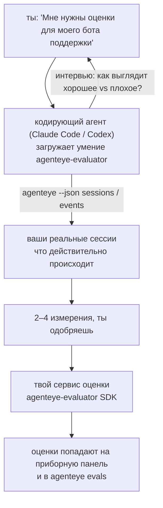

От *«я думаю, что наш агент иногда работает плохо»* к развёрнутому сервису оценки, где кодирующий агент одновременно принимает решение и строит систему. **Умение Failproof AI для оценки наблюдаемости** (`agenteye-evaluator`) — это *Agent Skill*: небольшая папка с инструкциями, которые кодирующий агент, такой как Claude Code или Codex, загружает по требованию. Оно обучает агента определять, какие показатели качества стоит отслеживать для *вашего* агента, а затем написать, протестировать и развернуть [сервис оценки](/ru/agenteye/evaluation-suite), который их оценивает.

Это **не** размещённый оценщик, реестр, в который вы загружаете данные, и не система плагинов. Ваш оценщик остаётся собственным HTTP-сервисом на вашей инфраструктуре, именно как описано в руководстве [Evaluation suite](/ru/agenteye/evaluation-suite). Умение только обучает вашего агента хорошо его строить, поэтому всё, что оно делает, вы можете сделать сами, написав тот же код.

---

## Самая сложная часть — решить, что оценивать

Поверхность SDK небольшая — декоратор и две модели — и агент может написать это прямо из [контракта](/ru/agenteye/evaluation-suite#http-contract). Это не место, где падают оценщики. Они падают, потому что оценивают неправильное, а оценщик, который оценивает неправильное, хуже, чем никакой: он создаёт приборную панель, которую все учатся игнорировать.

Поэтому большая часть умения — это часть до того, как существует какой-либо код. Оно заставляет агента взять вас интервью (*«опишите хорошо прошедший запуск; теперь плохо прошедший»*), затем вытащить ваши реальные сессии через [`agenteye` CLI](/ru/agenteye/cli) и прочитать их от начала до конца. Эти две половины обычно не совпадают, и этот разрыв — суть дела: что вы намереваетесь измерять в сравнении с тем, что ваши транскрипты на самом деле могут поддержать. Измерение сохраняется только если оно **вычислимо** из событий и **различающее** — если оно показывает 0.9 и на вашем хорошем, и на вашем плохом запуске, оно ничему не учит и удаляется.

Результат — предложение 2–4 измерений с приложенными рассуждениями, чтобы вы одобрили до того, как написана строка кода.



---

## Как оно связано с другими компонентами оценки

Четыре документа охватывают оценку и передают друг другу в порядке:

| Страница | Что это | Используйте, когда |
|---|---|---|
| **[Evaluations](/ru/agenteye/evaluations)** | Функция: оценки на сетке сессий, приборные панели, переоценка | Вы хотите узнать, что даёт вам автоматическая оценка |
| **[Evaluation suite](/ru/agenteye/evaluation-suite)** | HTTP-контракт, SDK, серверные переменные окружения | Вы реализуете или отлаживаете оценщик сами |
| **Evaluator skill** (этот документ) | Естественно-языковый вход для проектирования *и* построения оценщика | Вы хотите перейти от «мне нужны оценки» к работающему сервису |
| **[CLI skill](/ru/agenteye/cli-skill)** | Естественно-языковый вход в CLI `agenteye` | Вы хотите *читать* оценки, которые у вас уже есть |
| **[Python SDK skill](/ru/agenteye/python-sdk-skill)** | Естественно-языковый вход в инструментирование вашего агента | Ваш агент ещё не издаёт сессии — нечего оценивать |

### vs. CLI skill: построение vs чтение

Два умения намеренно не пересекаются, и установка обоих — обычная настройка — агент выбирает между ними на основе того, что вы просите:

- **`agenteye-evaluator`** (этот документ) строит то, что *производит* оценки. Его задача заканчивается, когда оценки впервые попадают.
- **[`agenteye-cli`](/ru/agenteye/cli-skill)** читает оценки, которые уже существуют (`agenteye evals`). «Качество упало на этой неделе?» — его вопрос, не вопрос этого умения.

---

## Предварительные требования

1. **`agenteye` CLI установлен и авторизован** (`pipx install agenteye`, затем `agenteye login`). Умение использует его дважды: чтобы вытащить реальные сессии, для которых оно проектирует, и чтобы подтвердить, что ваши оценки попали в конце. Ваш логин должен иметь `events:read`, плюс `evaluations:read` для этой финальной проверки. Как и с CLI skill, оно **не может** завершить для вас отправленный по электронной почте одноразовый код входа.
2. **Место для жизни оценщика.** Он строится в образ и работает как долгоживущий сервис, поэтому ему нужен реальный репо, а не временный файл. Оценщики часто живут в своём репо, отдельно от оценяемого агента — умение ищет существующий и просит перед созданием нового.
3. **Wheel `agenteye-evaluator` SDK** — прочитайте следующий раздел перед тем, как ваш агент начнёт вводить команды `pip`.

---

## Где его получить

Умение опубликовано в публичной коллекции умений Failproof AI:

**[github.com/FailproofAI/skills](https://github.com/FailproofAI/skills)** → [`skills/agenteye-evaluator/`](https://github.com/FailproofAI/skills/tree/main/skills/agenteye-evaluator)

Репозиторий публичный и умение не требует собственных учётных данных — оно только управляет CLI `agenteye` с сессией, в которую вы вошли, и пишет код в *ваш* репо. Обратите внимание, что оно поставляется как отдельная папка и **не находится** внутри пакета `pipx install agenteye`, поэтому не ищите его там.

## Установка умения

Самый быстрый путь — CLI [`skills`](https://skills.sh), который загружает папку и помещает её туда, где ваш агент ищет:

```bash
# Claude Code, только этот проект
npx skills add FailproofAI/skills --skill agenteye-evaluator -a claude-code

# каждый проект (устанавливает в ~/.claude/skills/)
npx skills add FailproofAI/skills --skill agenteye-evaluator -a claude-code -g --copy

# вместо этого Codex
npx skills add FailproofAI/skills --skill agenteye-evaluator -a codex
```

Затем управляйте им как любым другим умением:

```bash
npx skills list -a claude-code           # что установлено
npx skills update agenteye-evaluator     # получить последнюю версию
npx skills remove agenteye-evaluator     # удалить его
```

Предпочитаете ручную установку? Agent Skill — это просто папка, содержащая `SKILL.md` (плюс дополнительные ссылки), поэтому копирование тоже работает:

- **Claude Code**: поместите папку `agenteye-evaluator/` в `~/.claude/skills/` (каждый проект) или `<ваш-репо>/.claude/skills/` (только этот репо). Claude Code автоматически её обнаруживает — проверьте с помощью списка `/skills` или просто попросите оценки.
- **Codex (OpenAI)**: Codex читает тот же `SKILL.md`. Встроенный `agents/openai.yaml` устанавливает `allow_implicit_invocation: true`, поэтому Codex автоматически выбирает умение при совпадении задачи; иначе вызовите его явно как `$agenteye-evaluator`.

---

## SDK не находится на публичном PyPI

> **Предупреждение:** Прочитайте это перед тем, как позволить агенту установить SDK.

Умение публичное; SDK, который оно использует, — нет. `agenteye-evaluator` поставляется только как артефакт приватного релиза, и в отличие от `agenteye`, имя **не заявлено на публичном PyPI** — поэтому простая `pip install agenteye-evaluator` может вытащить пакет незнакомца в сервис, который читает ваши рабочие транскрипты. Это проблема цепочки поставок, а не опечатка.

Умение это знает и вместо этого спускается по лестнице установки, останавливаясь на первой применимой ступени: исходный код монорепо, если вы находитесь в репо AgentEye, иначе приватный wheel релиза из GitHub Releases (требует доступ), и если ничего этого не достижимо, оно **останавливается и говорит вам попросить wheel у вашего контакта Failproof AI** вместо импровизации.

Поэтому если ваш агент предлагает простую `pip install agenteye-evaluator` из публичного PyPI, это признак того, что умение никогда не загружалось. Остановитесь там и проверьте, что оно установлено.

---

## О чём вы можете его спросить

Реальный цикл начинается с неопределённого запроса и заканчивается подписанным дизайном, а не кодом:

```text
ты   ▸ Мне нужны оценки для нашего бота поддержки. Я думаю, 
        он иногда работает плохо.

агент ▸ Перед тем, как я напишу что-либо: опиши запуск, 
        который прошёл хорошо, и один, который прошёл плохо.

ты   ▸ Хорошо: отвечает из документации. Плохо: придумывает,
        или отказывается и говорит «свяжитесь с поддержкой».

агент ▸ Запуск: agenteye --json sessions --status error --since 7d
        Читаю 5 сессий, включая две, которые ты назвал бы плохими.

        Ваши слова говорят о точности и отказе от ответа. 
        Транскрипты согласны на отказ (2 из 5 заканчиваются 
        передачей в поддержку, и это видно в model_response.content),
        но точность нужна наземная истина, которую ваши события 
        не несут.

        Поэтому я бы оценил три вещи:
          - deflection      правила, дешево, разделяет ваши два запуска
          - tool_efficiency правила, ловит цикл повторов в запуске-004
          - groundedness    LLM судья: каждое утверждение в 
                            полученной документации?

        «factuality» нужна наземная истина, которой нет; groundedness —
        ближайшее, что ваши транскрипты действительно могут поддержать.
        Хорошо с этими тремя названиями? Переименование позже расщепит 
        историю.

ты   ▸ да

агент ▸ Нет оценщика в этом репо. Создать его здесь или у тебя 
        есть он где-то в другом месте?
```

Отсюда оно сначала пишет измерения на основе правил (бесплатно, мгновенно, детерминированно), тестирует их против реальной захватанной сессии, включая пустые и никогда не завершённые, которые ломают наивные оценщики, и только тогда обращается к LLM судье для субъективного измерения. Оно знает [пределы диспетчера](/ru/agenteye/evaluation-suite#configuring-the-server) — тайм-аут запроса 30с и 8 одновременных вызовов развёртывания в целом — поэтому если судья не будет надёжно подходить, оно переходит на асинхронный режим с `JobPending` вместо того, чтобы позволить вашему судье быть отменённым и повторно попробованным пять раз в пять раз дороже.

Затем оно развёртывает, устанавливает две серверные переменные окружения и подтверждает с помощью `agenteye --json evals --session-id <id>`, что оценки действительно попали. Приземление оценок — единственное доказательство.

---

## На что обратить внимание

- **Названия измерений близки к постоянным.** Ключи оценок — это произвольные строки, и платформа тренирует всё, что вы отправляете, что означает, что ничего ниже не исправляет плохой выбор. Переименование позже расщепляет историю: старые сессии сохраняют старый ключ и тренд ломается. Вот почему умение получает явное одобрение перед написанием кода — отнеситесь к этому запросу серьёзно.
- **Фиксtures — это реальные рабочие транскрипты.** Проектирование против реальных сессий означает вытащить их на диск, и они могут содержать данные клиентов. Умение просит перед коммитом их в git; если сомневаетесь, держите `fixtures/` вне репо и пусть каждый разработчик вытащит свои.
- **Агент пишет и развёртывает сервис, который читает каждый транскрипт.** Он действует от вашего имени, ограниченный разрешениями логина CLI, но просмотрите оценщик как любой другой код, который касается рабочих данных.

---

## Следующие шаги

- **[Evaluation suite](/ru/agenteye/evaluation-suite)**: HTTP-контракт, SDK и серверные переменные окружения, которые умение конфигурирует.
- **[Evaluations](/ru/agenteye/evaluations)**: где показываются оценки после приземления.
- **[CLI skill](/ru/agenteye/cli-skill)**: родственное умение для чтения результатов вместо построения оценщика.
- **[CLI](/ru/agenteye/cli)**: справочник команд за данными сессии, для которых умение проектирует.