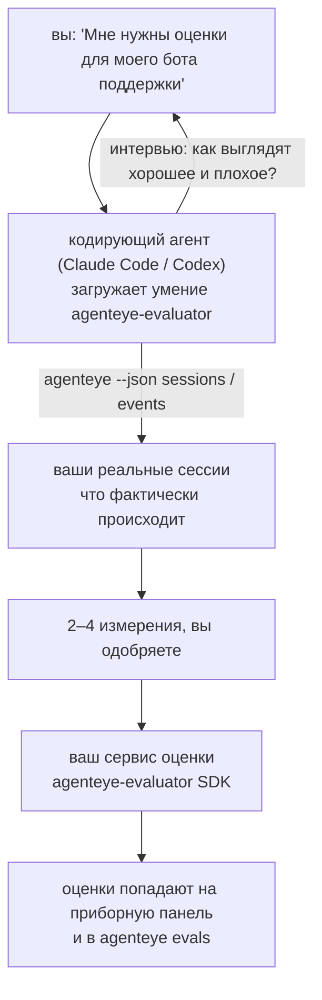

---
---
title: "Умение агента оценки наблюдаемости Failproof AI"
description: "От «мне кажется, наш агент иногда работает плохо» к развёрнутому сервису оценки, где ваш кодирующий агент и решает, и строит."
---


От *«мне кажется, наш агент иногда работает плохо»* к развёрнутому сервису оценки, где ваш кодирующий агент и решает, и строит. **Умение оценки наблюдаемости Failproof AI** (`agenteye-evaluator`) — это *Agent Skill*: небольшая папка с инструкциями, которую по требованию загружает кодирующий агент, такой как Claude Code или Codex. Она учит агента определять, какие аспекты качества стоит отслеживать для *вашего* агента, а затем писать, тестировать и развёртывать [сервис оценки](/ru/agenteye/evaluation-suite), который их оценивает.

Это **не** размещённый на сервере скорер, реестр, в который вы загружаете данные, и не система плагинов. Ваш оценщик остаётся вашим собственным HTTP-сервисом на вашей собственной инфраструктуре, точно так, как описано в руководстве [Набор инструментов оценки](/ru/agenteye/evaluation-suite). Умение только учит вашего агента строить его хорошо, поэтому всё, что он делает, вы могли бы сделать сами, написав тот же код.

---

## Самое сложное — решить, что оценивать

Поверхность SDK мала — декоратор и две модели — и агент может написать это только из [контракта](/ru/agenteye/evaluation-suite#http-contract). Вот где не происходит сбой оценщиков. Они сбиваются, потому что оценивают не то, и оценщик, оценивающий не то, хуже, чем никакой: он создаёт приборную панель, которую все учатся игнорировать.

Поэтому большая часть умения — это часть до того, как существует какой-либо код. Оно заставляет агента взять у вас интервью (*«опишите хороший запуск; теперь плохой»*), затем вытащить ваши реальные сессии через [`agenteye` CLI](/ru/agenteye/cli) и прочитать их от начала до конца. Эти две половины обычно не совпадают, и разрыв в том и есть суть: что вы намереваетесь измерить, против того, что ваши расшифровки могут фактически поддержать. Измерение выживает только если оно **вычислимо** на основе событий и **различительно** — если оно оценивает 0,9 и на вашем хорошем запуске, и на плохом, это ничему не учит и отсеивается.

Что возвращается — это предложение 2–4 измерений с приложенным обоснованием, чтобы вы одобрили его до того, как будет написана строка кода.



---

## Как это связано с другими частями оценки

Четыре документа охватывают оценку и передают друг другу по порядку:

| Страница | Что это | Используйте, когда |
|---|---|---|
| **[Оценки](/ru/agenteye/evaluations)** | Функция: оценки на сетке сессий, приборные панели, переоценка | Вы хотите узнать, что даёт вам автоматическая оценка |
| **[Набор инструментов оценки](/ru/agenteye/evaluation-suite)** | HTTP-контракт, SDK, переменные окружения сервера | Вы реализуете или отлаживаете оценщик самостоятельно |
| **Умение оценщика** (этот документ) | Естественно-языковой фасад для проектирования *и* построения скорера | Вы хотите перейти от «мне нужны оценки» к работающему сервису |
| **[Умение CLI](/ru/agenteye/cli-skill)** | Естественно-языковой фасад для `agenteye` CLI | Вы хотите *читать* оценки, которые у вас уже есть |
| **[Умение Python SDK](/ru/agenteye/python-sdk-skill)** | Естественно-языковой фасад для инструментирования вашего агента | Ваш агент ещё не выводит сессии — нечего оценивать |

### в сравнении с умением CLI: построение против чтения

Два умения намеренно не перекрываются, и установка обоих — обычная установка — агент выбирает между ними на основе того, что вы просите:

- **`agenteye-evaluator`** (этот документ) строит то, что *производит* оценки. Его работа заканчивается, когда оценки впервые поступают.
- **[`agenteye-cli`](/ru/agenteye/cli-skill)** читает оценки, которые уже существуют (`agenteye evals`). *«Упало ли качество на этой неделе?»* — его вопрос, не этого умения.

---

## Требования

1. **`agenteye` CLI установлен и вы вошли в систему** (`pipx install agenteye`, затем `agenteye login`). Умение опирается на него дважды: для получения реальных сессий, против которых оно проектирует, и для подтверждения того, что ваши оценки поступили в конце. Ваша учетная запись должна иметь `events:read`, плюс `evaluations:read` для этой финальной проверки. Как и с умением CLI, оно **не может** завершить для вас вход по отправленному по электронной почте одноразовому коду.
2. **Место для хранения оценщика.** Он собирается в образ и работает как долгоживущий сервис, поэтому ему нужна реальная репозитория, а не временный файл. Оценщики часто живут в отдельной репозитории, отдельно от оцениваемого агента — умение ищет существующую и спрашивает перед созданием новой.
3. **Колесо SDK `agenteye-evaluator`** — прочитайте следующий раздел перед тем, как ваш агент начнёт печатать команды `pip`.

---

## Где его получить

Умение опубликовано в общественной коллекции умений Failproof AI:

**[github.com/FailproofAI/skills](https://github.com/FailproofAI/skills)** → [`skills/agenteye-evaluator/`](https://github.com/FailproofAI/skills/tree/main/skills/agenteye-evaluator)

Репозитория общедоступна и умению не требуется собственный пропуск — оно только управляет `agenteye` CLI с сессией, в которую вы вошли, и пишет код в *вашей* репозитории. Учтите, что оно поставляется как отдельная папка и **не** входит в пакет `pipx install agenteye`, поэтому не ищите его там.

## Установка умения

Самый быстрый путь — это CLI [`skills`](https://skills.sh), который получает папку и кладёт её туда, где ваш агент ищет:

```bash
# Claude Code, только этот проект
npx skills add FailproofAI/skills --skill agenteye-evaluator -a claude-code

# каждый проект (устанавливает в ~/.claude/skills/)
npx skills add FailproofAI/skills --skill agenteye-evaluator -a claude-code -g --copy

# Codex вместо этого
npx skills add FailproofAI/skills --skill agenteye-evaluator -a codex
```

Затем управляйте им, как любым другим умением:

```bash
npx skills list -a claude-code           # что установлено
npx skills update agenteye-evaluator     # получить последнюю версию
npx skills remove agenteye-evaluator     # удалить
```

Предпочитаете устанавливать вручную? Agent Skill — это просто папка, содержащая `SKILL.md` (плюс опциональные ссылки), поэтому копирование работает:

- **Claude Code**: положите папку `agenteye-evaluator/` в `~/.claude/skills/` (каждый проект) или `<your-repo>/.claude/skills/` (только этот репозиторий). Claude Code автоматически его обнаруживает — проверьте с помощью списка `/skills` или просто попросите оценки.
- **Codex (OpenAI)**: Codex читает тот же `SKILL.md`. Включённый `agents/openai.yaml` устанавливает `allow_implicit_invocation: true`, поэтому Codex автоматически выбирает умение, когда задача совпадает; иначе вызывайте его явно как `$agenteye-evaluator`.

---

## SDK не в публичном PyPI

> **Предупреждение:** прочитайте это перед тем, как позволить агенту установить SDK.

Умение общедоступно; SDK, который оно использует, нет. `agenteye-evaluator` поставляется только как приватный артефакт выпуска, и в отличие от `agenteye`, имя **не зарезервировано в общедоступном PyPI** — поэтому голая команда `pip install agenteye-evaluator` могла бы вытащить пакет незнакомца в сервис, который читает ваши производственные расшифровки. Это проблема цепочки поставок, а не опечатка.

Умение это знает и работает вниз по лестнице установки, останавливаясь на первой применимой ступени: исходный код монорепо, если вы внутри репозитория AgentEye, иначе приватное колесо выпуска из GitHub Releases (требует доступ), и если ни то, ни другое недоступно, оно **останавливается и просит вас попросить колесо у вашего контакта в Failproof AI** вместо импровизации.

Поэтому если ваш агент предлагает голую `pip install agenteye-evaluator` из общедоступного PyPI, это признак того, что умение никогда не загружалось. Остановитесь там и проверьте, установлено ли оно.

---

## Что вы можете у него спросить

Реальное полное путешествие начинается с неопределённого запроса и заканчивается одобренным дизайном, а не кодом:

```text
вы   ▸ Мне нужны оценки для нашего бота поддержки. Мне кажется, 
      он иногда работает плохо.

агент ▸ Перед тем как я что-то писал: опишите запуск, который
        прошёл хорошо, и один, который прошёл плохо.

вы   ▸ Хорошо: отвечает из документов. Плохо: выдумывает,
      или сдаётся и говорит «обратитесь в поддержку».

агент ▸ Запуск: agenteye --json sessions --status error --since 7d
        Чтение 5 сессий, включая две, которые вы бы назвали плохими.

        Ваши слова говорят о фактичности и отклонениях. Расшифровки
        согласны об отклонениях (2 из 5 заканчиваются передачей
        поддержке, и это видно в model_response.content), но 
        фактичность нуждается в основании истины, которое ваши
        события не содержат.

        Поэтому я оценил бы три вещи:
          - deflection      правила, дешёво, разделяет ваши два запуска
          - tool_efficiency правила, ловит цикл повторов в run-004
          - groundedness    судья LLM: каждое утверждение в полученных документах?

        «factuality» потребует основание истины, которого нет;
        groundedness — это ближайшее, что ваши расшифровки 
        фактически поддерживают. Согласны ли вы с этими тремя?
        Переименование позже разбивает историю.

вы   ▸ да

агент ▸ Нет оценщика в этом репозитории. Я должен создать его
        здесь, или у вас он есть в другом месте?
```

Оттуда он пишет первыми правила-основанные измерения (бесплатно, мгновенно, детерминированно), тестирует их против реальной сохранённой сессии, включая пустые и никогда не завершённые, которые разбивают наивные оценщики, и только затем обращается к судье LLM для субъективного измерения. Он знает [пределы диспетчера](/ru/agenteye/evaluation-suite#configuring-the-server) — 30-секундный таймаут запроса и 8 одновременных вызовов развёртывания в целом — поэтому если судья не будет надёжно умещаться, он идёт асинхронно с `JobPending` вместо того, чтобы дать вашему судье быть отменённым и перепробованным пять раз в пять раз дороже.

Затем он развёртывает, устанавливает две переменные окружения сервера и подтверждает с `agenteye --json evals --session-id <id>`, что оценки фактически поступили. Поступление оценок — единственное доказательство.

---

## На что обратить внимание

- **Названия измерений близки к постоянным.** Ключи оценок — произвольные строки, и платформа тренирует всё, что вы отправляете, что означает, что ничто ниже не исправляет плохой выбор. Переименуйте позже и история разделится: старые сессии сохранят старый ключ и тренд сломается. Вот почему умение получает явное одобрение перед написанием кода — отнеситесь к этому приглашению серьёзно.
- **Фиксированные данные — реальные производственные расшифровки.** Проектирование против реальных сессий означает их вытягивание на диск, и они могут содержать данные клиентов. Умение спрашивает перед коммитом в git; если сомневаетесь, держите `fixtures/` вне репозитория и попросите каждого разработчика получить своего.
- **Агент пишет и развёртывает сервис, который читает каждую расшифровку.** Он действует от вашего имени, ограниченный разрешениями вашей учетной записи CLI, но проверьте оценщик, как и любой другой код, который касается производственных данных.

---

## Следующие шаги

- **[Набор инструментов оценки](/ru/agenteye/evaluation-suite)**: HTTP-контракт, SDK и переменные окружения сервера, которые настраивает умение.
- **[Оценки](/ru/agenteye/evaluations)**: где появляются оценки, когда они поступают.
- **[Умение CLI](/ru/agenteye/cli-skill)**: родственное умение для чтения результатов вместо построения скорера.
- **[CLI](/ru/agenteye/cli)**: справочник команд за данными сессии, против которых проектирует умение.