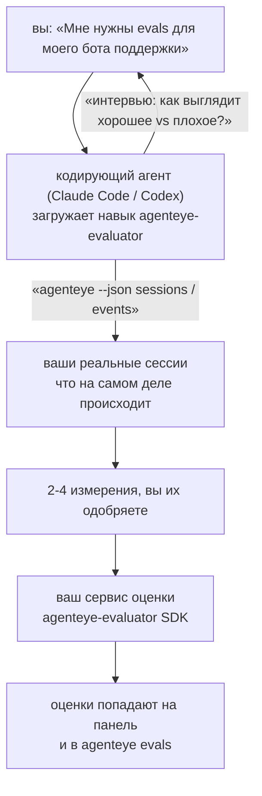

От *«мне кажется, наш агент иногда работает плохо»* к развёрнутому сервису оценки, где кодирующий агент сам принимает решения и строит систему. **Навык оценки наблюдаемости Failproof AI** (`agenteye-evaluator`) — это *Agent Skill*: небольшая папка инструкций, которую кодирующий агент, такой как Claude Code или Codex, загружает по запросу. Он учит агента определить, какие аспекты качества стоит отслеживать для *вашего* агента, а затем написать, протестировать и развернуть [сервис оценки](/ru/agenteye/evaluation-suite), который их оценивает.

Это **не** хостируемый скорер, регистр, в который вы загружаете данные, и не система плагинов. Ваша система оценки остаётся вашим собственным HTTP-сервисом в вашей собственной инфраструктуре, именно как описано в руководстве [Evaluation suite](/ru/agenteye/evaluation-suite). Навык только учит вашего агента строить её хорошо, поэтому всё, что он делает, вы могли бы сделать сами, написав тот же код.

---

## Самое сложное — решить, что оценивать

Поверхность SDK небольшая — декоратор и две модели — и агент может написать это просто на основе [контракта](/ru/agenteye/evaluation-suite#http-contract). Это не то место, где evaluators терпят неудачу. Они терпят неудачу, потому что оценивают не то, и evaluator, оценивающий не то, хуже, чем его отсутствие: он создаёт панель управления, которую все учатся игнорировать.

Поэтому большая часть навыка — это этап до написания кода. Агент берёт у вас интервью (*«опишите прогон, который прошёл хорошо; теперь один, который прошёл плохо»*), затем получает ваши реальные сессии через [`agenteye` CLI](/ru/agenteye/cli) и читает их от начала до конца. Эти два подхода обычно расходятся, и этот разрыв — ключевой момент: то, что вы намерены измерить, против того, что ваши транскрипты на самом деле могут поддержать. Измерение сохраняется только если оно **вычислимо** из событий и **различающее** — если оно выдаёт 0.9 и на хорошем прогоне, и на плохом, то оно ничему не учит и удаляется.

На выходе вы получите предложение из 2-4 измерений с прилагаемым обоснованием, которое вы должны одобрить, прежде чем будет написана ни одна строка кода.



---

## Как это связано с другими компонентами оценки

Четыре документа посвящены оцениванию и ссылаются друг на друга по порядку:

| Страница | Что это | Используйте когда |
|---|---|---|
| **[Evaluations](/ru/agenteye/evaluations)** | Функция: оценки на сетке сессий, панели управления, переоценка | Вы хотите знать, что вам даёт автоматическое оценивание |
| **[Evaluation suite](/ru/agenteye/evaluation-suite)** | HTTP контракт, SDK, переменные окружения сервера | Вы сами реализуете или отлаживаете evaluator |
| **Навык Evaluator** (этот документ) | Естественно-языковой интерфейс для проектирования *и* построения скорера | Вы хотите перейти от «мне нужны evals» к запущенному сервису |
| **[CLI skill](/ru/agenteye/cli-skill)** | Естественно-языковой интерфейс для `agenteye` CLI | Вы хотите *прочитать* уже имеющиеся оценки |
| **[Python SDK skill](/ru/agenteye/python-sdk-skill)** | Естественно-языковой интерфейс для инструментирования вашего агента | Ваш агент ещё не генерирует сессии — нечего оценивать |

### vs. CLI skill: строить против чтения

Два навыка специально не пересекаются, и установка обоих — нормальная конфигурация — агент выбирает между ними на основе того, что вы просите:

- **`agenteye-evaluator`** (этот документ) строит то, что *производит* оценки. Его работа заканчивается, когда оценки впервые попадают на вывод.
- **[`agenteye-cli`](/ru/agenteye/cli-skill)** читает оценки, которые уже существуют (`agenteye evals`). Вопрос *«качество упало на этой неделе?»* — его, а не этого навыка.

---

## Предварительные требования

1. **`agenteye` CLI установлен и вы вошли в систему** (`pipx install agenteye`, затем `agenteye login`). Навык использует его дважды: чтобы получить реальные сессии для проектирования, и чтобы подтвердить, что ваши оценки попали на вывод в конце. Ваша учётная запись должна иметь `events:read`, плюс `evaluations:read` для финальной проверки. Как и с CLI skill, он **не может** завершить отправленный по электронной почте вход с одноразовым кодом за вас.
2. **Место для сервиса оценки.** Он собирается в образ и запускается как долгоживущий сервис, поэтому ему нужен реальный репозиторий, не временный файл. Evaluators часто живут в собственном репозитории, отдельно от оцениваемого агента — навык ищет существующий и спрашивает перед созданием нового.
3. **Wheel SDK `agenteye-evaluator`** — прочитайте следующий раздел перед тем, как ваш агент начнёт вводить команды `pip`.

---

## Где это получить

Навык опубликован в открытой коллекции навыков Failproof AI:

**[github.com/FailproofAI/skills](https://github.com/FailproofAI/skills)** → [`skills/agenteye-evaluator/`](https://github.com/FailproofAI/skills/tree/main/skills/agenteye-evaluator)

Репозиторий открыт и навык не требует своих учётных данных — он только управляет `agenteye` CLI с использованием сессии *вас*, вошедшего в систему, и пишет код в *ваш* репозиторий. Обратите внимание, что он поставляется как отдельная папка и **не** находится внутри пакета `pipx install agenteye`, поэтому не ищите его там.

## Установка навыка

Самый быстрый путь — это CLI [`skills`](https://skills.sh), который получает папку и помещает её туда, где ваш агент её ищет:

```bash
# Claude Code, только этот проект
npx skills add FailproofAI/skills --skill agenteye-evaluator -a claude-code

# каждый проект (устанавливает в ~/.claude/skills/)
npx skills add FailproofAI/skills --skill agenteye-evaluator -a claude-code -g --copy

# Codex вместо этого
npx skills add FailproofAI/skills --skill agenteye-evaluator -a codex
```

Затем управляйте им как любым другим навыком:

```bash
npx skills list -a claude-code           # что установлено
npx skills update agenteye-evaluator     # получить последнюю версию
npx skills remove agenteye-evaluator     # удалить его
```

Предпочитаете установить вручную? Agent Skill — это просто папка, содержащая `SKILL.md` (плюс опциональные ссылки), поэтому копирование тоже работает:

- **Claude Code**: поместите папку `agenteye-evaluator/` в `~/.claude/skills/` (каждый проект) или `<ваш-репо>/.claude/skills/` (только этот репо). Claude Code автоматически её обнаружит — проверьте с помощью списка `/skills` или просто попросите evals.
- **Codex (OpenAI)**: Codex читает тот же `SKILL.md`. Включённый `agents/openai.yaml` устанавливает `allow_implicit_invocation: true`, поэтому Codex автоматически выбирает навык при совпадении задачи; в противном случае вызовите его явно как `$agenteye-evaluator`.

---

## SDK нет в открытом PyPI

> **Внимание:** Прочитайте это перед тем, как позволить агенту установить SDK.

Навык открыт; SDK, который он управляет, нет. `agenteye-evaluator` поставляется только как артефакт приватного релиза, и в отличие от `agenteye`, название **не зарезервировано в открытом PyPI** — поэтому простой `pip install agenteye-evaluator` может загрузить пакет от незнакомца в сервис, который читает ваши производственные транскрипты. Это проблема цепочки поставок, не опечатка.

Навык это знает и работает вниз по лестнице установки, останавливаясь на первой применимой ступени: исходный код монорепо, если вы внутри репо AgentEye, в противном случае приватный wheel релиза из GitHub Releases (нужен доступ), и если ничего не доступно, он **останавливается и просит вас обратиться к вашему контакту Failproof AI за wheel** вместо импровизации.

Поэтому если ваш агент предлагает простой `pip install agenteye-evaluator` из открытого PyPI, это признак того, что навык никогда не загружался. Остановитесь там и проверьте, что он установлен.

---

## Что вы можете у него попросить

Реальный полный цикл начинается с расплывчатого запроса и заканчивается одобренным проектом, а не кодом:

```text
вы   ▸ Мне нужны evals для нашего бота поддержки. Мне кажется, 
       он иногда работает плохо.

агент ▸ Перед тем как я что-нибудь напишу: опишите прогон,
        который прошёл хорошо, и один, который прошёл плохо.

вы   ▸ Хорошо: отвечает из документации. Плохо: выдумывает,
       или сдаётся и говорит «обратитесь в поддержку».

агент ▸ Запуск: agenteye --json sessions --status error --since 7d
        Чтение 5 сессий, включая две, которые вы назвали плохими.

        Ваши слова говорят о фактичности и отказе. Транскрипты
        согласны с отказом (2 из 5 заканчиваются передачей в
        поддержку, и это ясно видно в model_response.content), 
        но фактичность требует ground truth, которые ваши события 
        не содержат.

        Поэтому я буду оценивать три вещи:
          - deflection      правила, дёшево, отличает ваши два прогона
          - tool_efficiency правила, ловит loop повторов в run-004
          - groundedness    LLM судья: каждое ли утверждение в
                            найденных документах?

        «factuality» потребовала бы ground truth, которую мы не
        имеем; groundedness — ближайший аналог, который ваши
        транскрипты на самом деле могут поддержать. Вы согласны
        с этими тремя названиями? Переименование позже разбивает историю.

вы   ▸ да

агент ▸ Нет evaluator в этом репо. Мне его здесь создать, или он
        у вас есть где-то в другом месте?
```

Оттуда он сначала пишет правила-основанные измерения (свободно, мгновенно, детерминировано), тестирует их против реально захваченной сессии, включая пустые и незавершённые, которые ломают наивные evaluators, и только затем использует LLM судью для субъективного измерения. Он знает [пределы диспетчера](/ru/agenteye/evaluation-suite#configuring-the-server) — 30-секундный timeout запроса и 8 одновременных вызовов по развёртыванию — поэтому если судья не уместится надёжно, он переходит на асинхронную работу с `JobPending` вместо того, чтобы позволить вашему судье быть отменённым и переповторен пять раз при пятикратной стоимости.

Затем он развёртывает, устанавливает две переменные окружения сервера и подтверждает с помощью `agenteye --json evals --session-id <id>`, что оценки действительно попали на вывод. Попадание оценок — единственное доказательство.

---

## На что обратить внимание

- **Названия измерений почти постоянны.** Ключи оценок — это произвольные строки и платформа анализирует тренды того, что вы отправляете, что означает, что ничто ниже не исправляет плохой выбор. Переименование позже разбивает историю: старые сессии сохраняют старый ключ и тренд разломается. Вот почему навык получает явное одобрение перед написанием кода — отнеситесь к этому запросу серьёзно.
- **Fixtures — это реальные производственные транскрипты.** Проектирование на основе реальных сессий означает их получение на диск, и они могут содержать данные клиентов. Навык спрашивает перед коммитом их в git; если сомневаетесь, держите `fixtures/` вне репо и попросите каждого разработчика получить свои.
- **Агент пишет и развёртывает сервис, который читает каждый транскрипт.** Он действует от вашего имени, ограниченный разрешениями вашего CLI входа, но проверьте evaluator как любой другой код, который касается производственных данных.

---

## Следующие шаги

- **[Evaluation suite](/ru/agenteye/evaluation-suite)**: HTTP контракт, SDK и переменные окружения сервера, которые настраивает навык.
- **[Evaluations](/ru/agenteye/evaluations)**: где появляются оценки, когда они попадают на вывод.
- **[CLI skill](/ru/agenteye/cli-skill)**: сопутствующий навык для чтения результатов вместо построения скорера.
- **[CLI](/ru/agenteye/cli)**: справочник команд за данными сессий, на основе которых проектирует навык.