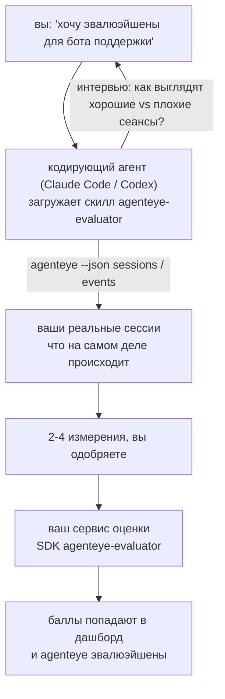

От *«мне кажется, наш агент иногда работает плохо»* к развёрнутому сервису оценки, где ваш кодирующий агент принимает решения и строит всё сам. **Failproof AI Observability evaluator skill** (`agenteye-evaluator`) — это *Agent Skill*: небольшая папка с инструкциями, которую кодирующий агент (например Claude Code или Codex) загружает по требованию. Она учит агента определять, какие показатели качества стоит отслеживать для *вашего* агента, а затем писать, тестировать и развёртывать [сервис оценки](/ru/agenteye/evaluation-suite), который их скорирует.

Это **не** размещённый скорер, реестр для загрузки или система плагинов. Ваш оценщик остаётся собственным HTTP-сервисом на вашей инфраструктуре, точно как описано в руководстве [Evaluation suite](/ru/agenteye/evaluation-suite). Скилл только помогает вашему агенту построить его правильно, поэтому всё, что он делает, вы могли бы сделать сами, написав тот же код.

---

## Самое сложное — решить, что скорить

API SDK небольшой — декоратор и две модели — и агент может написать это, опираясь только на [контракт](/ru/agenteye/evaluation-suite#http-contract). В этом не проблема. Проблема в том, что оценщики часто скорят не то, и оценщик, скорящий не то, хуже, чем его отсутствие: он создаёт дашборд, который все учатся игнорировать.

Поэтому большая часть скилла — это работа до написания кода. Агент берёт у вас интервью (*«опишите удачный сеанс; теперь неудачный»*), затем вытягивает ваши реальные сессии через [`agenteye` CLI](/ru/agenteye/cli) и читает их целиком. Эти две половины обычно расходятся, и зазор между ними — суть: что вы намереваетесь измерять против того, что ваши логи могут действительно поддержать. Измерение выживает только если оно **вычислимо** из событий и **различительно** — если оно показывает 0.9 и на хорошем, и на плохом запуске, оно ничего не учит и удаляется.

Результат — предложение 2-4 измерений с рассуждениями, которые вы одобрите до написания кода.



---

## Как это связано с другими компонентами оценки

Четыре документа охватывают скоринг и передают друг другу информацию по порядку:

| Страница | Что это | Используйте, когда |
|---|---|---|
| **[Evaluations](/ru/agenteye/evaluations)** | Функция: баллы на сетке сессий, дашборды, пересчёт | Вы хотите узнать, что даёт автоматический скоринг |
| **[Evaluation suite](/ru/agenteye/evaluation-suite)** | HTTP-контракт, SDK, переменные окружения сервера | Вы сами реализуете или отлаживаете оценщик |
| **Evaluator skill** (этот документ) | Естественно-языковой интерфейс для проектирования *и* построения оценщика | Вы хотите от «хочу эвалюэйшены» к работающему сервису |
| **[CLI skill](/ru/agenteye/cli-skill)** | Естественно-языковой интерфейс для `agenteye` CLI | Вы хотите *читать* уже имеющиеся баллы |
| **[Python SDK skill](/ru/agenteye/python-sdk-skill)** | Естественно-языковой интерфейс для инструментирования вашего агента | Ваш агент ещё не отправляет сессии — нечего скорить |

### vs. CLI skill: строить против чтения

Два скилла сознательно не пересекаются, и установка обоих — нормальная конфигурация — агент выбирает между ними в зависимости от вашего запроса:

- **`agenteye-evaluator`** (этот документ) строит то, что *производит* баллы. Его работа заканчивается, когда баллы впервые попадают в систему.
- **[`agenteye-cli`](/ru/agenteye/cli-skill)** читает уже существующие баллы (`agenteye evals`). Вопрос *«упало ли качество на этой неделе?»* — его вопрос, а не вопрос этого скилла.

---

## Предварительные требования

1. **`agenteye` CLI установлен и вы вошли в систему** (`pipx install agenteye`, затем `agenteye login`). Скилл опирается на него дважды: для вытягивания реальных сессий, которые он проектирует, и для подтверждения того, что баллы попали в конце. Ваш вход должен иметь права `events:read`, плюс `evaluations:read` для финальной проверки. Как и с CLI скиллом, он **не может** завершить для вас вход через одноразовый код по почте.
2. **Место для жизни оценщика.** Он собирается в образ и запускается как долгоживущий сервис, поэтому ему нужна реальная репозитория, не файл для черновиков. Оценщики часто живут в своей собственной репозитории, отдельно от оцениваемого агента — скилл ищет существующую и спрашивает перед созданием новой.
3. **Колесо `agenteye-evaluator` SDK** — прочитайте следующий раздел перед тем, как ваш агент начнёт вводить команды `pip`.

---

## Где его получить

Скилл опубликован в публичной коллекции скиллов Failproof AI:

**[github.com/FailproofAI/skills](https://github.com/FailproofAI/skills)** → [`skills/agenteye-evaluator/`](https://github.com/FailproofAI/skills/tree/main/skills/agenteye-evaluator)

Репозиторий публичный, и скилл не требует собственных учётных данных — он только управляет `agenteye` CLI с сессией, в которую *вы* вошли, и пишет код в *вашей* репозитории. Учтите, что он поставляется как отдельная папка и **не** входит в пакет `pipx install agenteye`, так что не ищите его там.

## Установка скилла

Быстрый путь — [`skills`](https://skills.sh) CLI, который извлекает папку и кладёт её там, где ваш агент её ищет:

```bash
# Claude Code, только этот проект
npx skills add FailproofAI/skills --skill agenteye-evaluator -a claude-code

# каждый проект (установка в ~/.claude/skills/)
npx skills add FailproofAI/skills --skill agenteye-evaluator -a claude-code -g --copy

# вместо этого Codex
npx skills add FailproofAI/skills --skill agenteye-evaluator -a codex
```

Затем управляйте им как любым другим скиллом:

```bash
npx skills list -a claude-code           # что установлено
npx skills update agenteye-evaluator     # загрузить последнюю версию
npx skills remove agenteye-evaluator     # удалить
```

Предпочитаете устанавливать вручную? Agent Skill — это просто папка с `SKILL.md` (плюс опциональные справочники), так что копирование работает:

- **Claude Code**: положите папку `agenteye-evaluator/` в `~/.claude/skills/` (каждый проект) или `<your-repo>/.claude/skills/` (только эта репозитория). Claude Code auto-обнаруживает её — проверьте через `/skills` список или просто попросите эвалюэйшены.
- **Codex (OpenAI)**: Codex читает то же `SKILL.md`. Упакованный `agents/openai.yaml` устанавливает `allow_implicit_invocation: true`, поэтому Codex auto-выбирает скилл, когда задача совпадает; иначе вызовите явно как `$agenteye-evaluator`.

---

## SDK не на публичном PyPI

> **Warning:** Прочитайте это перед тем, как позволить агенту установить SDK.

Скилл публичный; SDK, который он управляет — нет. `agenteye-evaluator` поставляется только как артефакт приватного релиза, и в отличие от `agenteye`, имя **не занято на публичном PyPI** — поэтому голый `pip install agenteye-evaluator` мог бы вытянуть пакет незнакомца в сервис, читающий ваши производственные логи. Это проблема цепочки поставок, а не опечатка.

Скилл это знает и использует лестницу установки вместо этого, останавливаясь на первом применимом уровне: исходные файлы монорепозитория, если вы внутри репозитория AgentEye, иначе приватное колесо релиза с GitHub Releases (требует доступа), и если ничего недоступно, он **останавливается и говорит вам попросить колесо у своего контакта Failproof AI** вместо импровизации.

Поэтому, если ваш агент предлагает голый `pip install agenteye-evaluator` с публичного PyPI, это знак того, что скилл никогда не загружался. Остановитесь там и проверьте, что он установлен.

---

## Что вы можете попросить

Реальный полный цикл начинается с расплывчатого запроса и заканчивается одобренным дизайном, не кодом:

```text
вы    ▸ Хочу эвалюэйшены для нашего бота поддержки. Мне кажется,
         он иногда работает плохо.

агент ▸ Перед тем как писать код: опишите сеанс, который прошёл хорошо,
        и один, который прошёл плохо.

вы    ▸ Хорошо: ответ из документации. Плохо: придумывает, или сдаётся
         и говорит "свяжитесь с поддержкой".

агент ▸ Запуск: agenteye --json sessions --status error --since 7d
        Читаю 5 сессий, включая две, которые вы бы назвали плохими.

        Ваши слова говорят о фактичности и уходе от ответа.
        Логи согласны на уход от ответа (2 из 5 заканчиваются передачей
        в поддержку, и это ясно в model_response.content), но фактичность
        требует ground truth, которого нет в ваших событиях.

        Поэтому я буду скорить три вещи:
          - deflection      правила, дёшево, разделяет ваши два запуска
          - tool_efficiency правила, ловит retry loop в запуске-004
          - groundedness    судья-LLM: каждое утверждение в полученных документах?

        «factuality» потребовала бы ground truth, которого нет;
        groundedness — ближайшее, что ваши логи действительно поддерживают.
        Согласны с этими тремя названиями? Переименование позже разломает историю.

вы    ▸ согласен

агент ▸ Нет оценщика в этой репозитории. Мне его здесь создать, или
        у вас он есть где-то ещё?
```

Отсюда он сначала пишет правила-базированные измерения (бесплатно, мгновенно, детерминированно), тестирует их на реальном захваченном сеансе, включая пустые и никогда не завершённые, которые ломают наивные оценщики, и только переходит на судью-LLM для субъективного измерения. Он знает [лимиты диспетчера](/ru/agenteye/evaluation-suite#configuring-the-server) — таймаут запроса 30s и 8 одновременных вызовов развёртывания в целом — поэтому если судья не будет надёжно подходить, он идёт асинхронно с `JobPending` вместо того, чтобы дать судье отменяться и пересчитываться пять раз с пятикратной стоимостью.

Затем развёртывает, устанавливает две переменные окружения сервера и подтверждает через `agenteye --json evals --session-id <id>`, что баллы действительно попали. Баллы, попадающие в систему — единственное доказательство.

---

## На что обращать внимание

- **Имена измерений почти постоянны.** Ключи скоринга — произвольные строки, и платформа трендирует то, что вы отправляете, поэтому ничто ниже не исправит плохой выбор. Переименование позже разломает историю: старые сессии сохранят старый ключ, и тренд разломается. Вот почему скилл просит явное одобрение перед написанием кода — отнеситесь к этому подсказке серьёзно.
- **Фиксчеры — реальные производственные логи.** Проектирование на реальных сеансах означает вытягивание их на диск, и они могут содержать данные клиентов. Скилл спрашивает перед фиксацией их в git; если сомневаетесь, держите `fixtures/` вне репозитория и имейте каждого разработчика вытягивать свои.
- **Агент пишет и развёртывает сервис, читающий каждый логи.** Он действует как вы, ограниченный правами вашего CLI входа, но проверьте оценщик как любой другой код, трогающий производственные данные.

---

## Следующие шаги

- **[Evaluation suite](/ru/agenteye/evaluation-suite)**: HTTP-контракт, SDK и переменные окружения сервера, которые скилл конфигурирует.
- **[Evaluations](/ru/agenteye/evaluations)**: где баллы показываются после попадания.
- **[CLI skill](/ru/agenteye/cli-skill)**: родственный скилл для чтения результатов вместо построения оценщика.
- **[CLI](/ru/agenteye/cli)**: справочник команд за данными сессии, которые скилл проектирует.