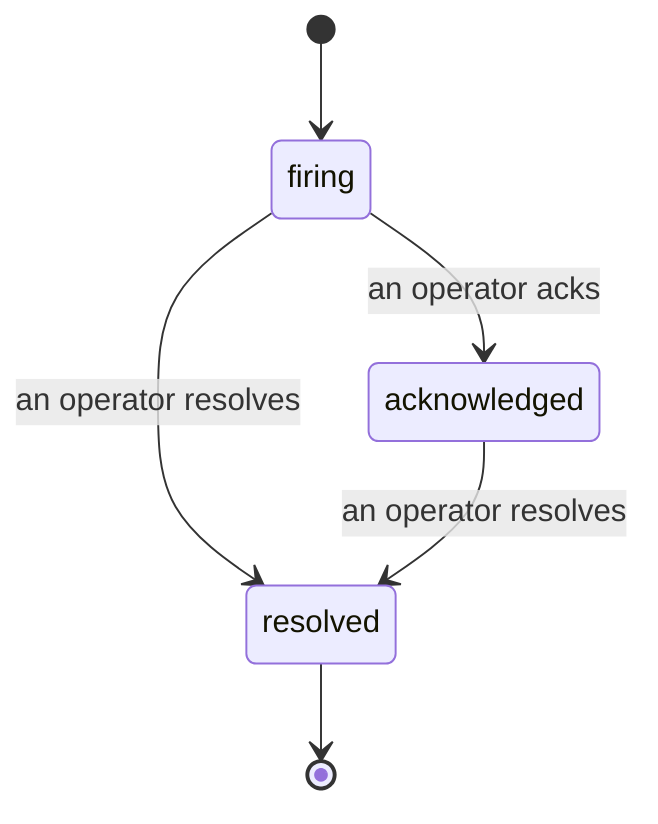

Когда срабатывает оповещение, первый вопрос всегда один: «кто за это отвечает?» Инциденты дают ответ: в момент нарушения все видят открытый инцидент, его владельца и точную историю событий, с чистой, атрибутированной записью, которую можно сразу передать на анализ происшествия.

*Папка входящих группирует открытые инциденты по статусу и фильтрует по серьёзности и назначенному владельцу, так что видны только нужные для действия.*

## Сразу видно, кто за это отвечает

Больше никаких «кто-нибудь это смотрит?» в переписке. При нарушении инцидент открывается автоматически и попадает в общую папку входящих, сгруппированной по статусам. Когда вы его подтвердите, на нём появляется ваше имя — и команда знает, что это в работе. Подтверждение публично: несколько операторов могут подтвердить один инцидент, и каждый учитывается отдельно, так что вся боевая комната видна по именам. Назначьте одного ответственного на роль триажа и фильтруйте папку входящих по серьёзности или назначенному владельцу, чтобы видеть только ваше.

## Вся история на одной временной шкале

Когда инцидент закрыт, отчёт уже готов. Откройте любой инцидент — и вы получите доказательства нарушения, его ответственных и подписчиков, ветку комментариев для координации и временную шкалу действий, дополняемую только в конец.

*Всё, что произошло, в порядке очерёдности, каждая строка подписана автором.*

Каждое действие (открыт, подтверждён, разрешён и так далее) записывается на эту временную шкалу и никогда не удаляется. Каждая запись атрибутирована: оператору, который её выполнил, по электронной почте, или **automated** для всего, что Failproof AI Observability сделал сам, например для открытия инцидента при нарушении. Ничего анонимного и ничего не теряется, так что анализ происшествия более или менее пишет себя сам.

## Как инцидент переходит между статусами

- **Открыт (firing):** нарушение открывает инцидент и пингует ваши каналы один раз. Повторные нарушения складываются в один инцидент и обновляют его доказательства вместо повторного пинга.
- **Подтверждён (acknowledged):** оператор берётся за дело. Инцидент остаётся открытым, и последующие нарушения тихо обновляют доказательства.
- **Разрешён (resolved):** оператор закрывает его. Автоматическое разрешение при исчезновении условия запланировано, но пока не включено, поэтому инцидент остаётся открытым до ручного разрешения оператором, что держит всех в ответственности за действительное исчезновение проблемы. Новый инцидент может открыться позже по тому же оповещению.

Одно оповещение содержит максимум один открытый инцидент одновременно, так что дребезжащее правило не заваливает вас дубликатами. Вы также можете открыть инцидент вручную: самостоятельный для чего-то, что не поймало ни одно оповещение, или присоединённый к существующему оповещению, если у вас есть `incidents:write`.

## Где его найти

Инциденты находятся в `/<org-slug>/incidents`. Просмотр требует **`incidents:read`**; открытие ручного инцидента требует **`incidents:write`**; подтверждение, назначение, комментирование и разрешение требуют **`incidents:ack`**. Старые ключи с прекращённым `alerts:ack` продолжают работать, так как он признаётся как `incidents:ack`, поэтому вашему графику дежурств не нужна переиздача.

## Связанные материалы

- [Оповещения](/ru/agenteye/alerts): правила, которые открывают эти инциденты при нарушении порога.
- [Отслеживание ошибок](/ru/agenteye/error-tracking): все ошибки в одном месте и продвижение одной в оповещение.
- [Аудиты](/ru/agenteye/audits): плановый аналитик, который находит ошибки, за которыми не наблюдало ни одно правило.