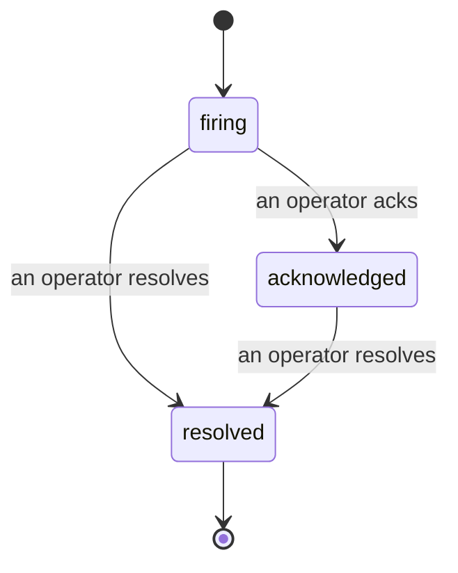

Когда срабатывает алерт, первый вопрос всегда один: "кто за это отвечает?" Инциденты дают ответ: в момент нарушения все видят, что инцидент открыт, кто его берёт на себя и ровно что произошло, с чистой, атрибутированной записью, которую можно сразу отправить на post-mortem.

*Входящие группируют открытые инциденты по статусу и фильтруют по серьёзности и назначенному оператору, так что вы видите, что требует внимания прямо сейчас.*

## Сразу видите, кто за это отвечает

Больше не нужно спрашивать "кто-нибудь смотрит на это?" в чате. Нарушение автоматически открывает инцидент и кладёт его в общую входящую, отсортированную по статусу. Подтвердите его — и ваше имя на нём, так что остальная команда видит, что это под контролем. Подтверждение общее: несколько операторов могут подтвердить один инцидент, и каждое подтверждение записывается отдельно, так что весь боевой коллектив виден по именам вместо того, чтобы друг другу мешать. Назначьте одного владельца для сортировки, и фильтруйте входящие по серьёзности или назначенному оператору, чтобы оставить только нужное.

## Вся история на одной шкале времени

Когда инцидент закрыт, протокол уже готов. Откройте любой инцидент — получите доказательства нарушения, назначенных операторов и подписчиков, ветку комментариев для координации на месте и добавляемую-только-в-конец шкалу времени активности.

*Всё, что произошло, по порядку, каждая строка подписана тем, кто это сделал.*

Каждое действие (открыто, подтверждено, разрешено и так далее) записывается на эту шкалу и никогда не редактируется. Каждая запись атрибутирована: оператору, который это сделал, по email, или **automated** для всего, что Failproof AI Observability сделал само, например открыло инцидент на нарушении. Ничего анонимного и ничего потеряного, так что post-mortem более или менее пишет сам себя.

## Как инцидент переходит между статусами

- **Open (firing):** нарушение открывает инцидент и пейджирует ваши каналы один раз. Повторные нарушения складываются в один инцидент и обновляют его доказательства вместо того, чтобы пейджировать вас снова и снова.
- **Acknowledged:** оператор его берёт. Он остаётся открыт, и позже нарушения тихо обновляют доказательства.
- **Resolved:** оператор его закрывает. Автоматическое разрешение, когда условие исчезает, планируется, но пока не включено, так что инцидент остаётся открыт до тех пор, пока человек его не разрешит, что держит всех честными относительно того, что действительно разрешилось. Новый инцидент может открыться по тому же алерту позже.

Один алерт держит максимум один открытый инцидент в единый момент времени, так что мерцающее правило не может вас похоронить в дубликатах. Вы также можете открыть инцидент вручную: автономный для чего-то, что не поймал ни один алерт, или связанный с существующим алертом, если у вас есть `incidents:write`.

## Где это найти

Инциденты находятся по адресу `/<org-slug>/incidents`. Просмотр требует **`incidents:read`**; открытие ручного инцидента требует **`incidents:write`**; подтверждение, назначение, комментирование и разрешение требуют **`incidents:ack`**. Старые ключи, получившие снятый с производства `alerts:ack`, продолжают работать, так как он почитается как `incidents:ack`, так что вашу дежурную смену не нужно переиздавать.

## Связанное

- [Alerts](/ru/agenteye/alerts): правила, которые открывают эти инциденты, когда порог нарушается.
- [Error tracking](/ru/agenteye/error-tracking): смотрите каждый отказ в одном месте и повысьте один до алерта.
- [Audits](/ru/agenteye/audits): запланированный аналитик, который находит отказы, за которыми ни одно правило не смотрело.