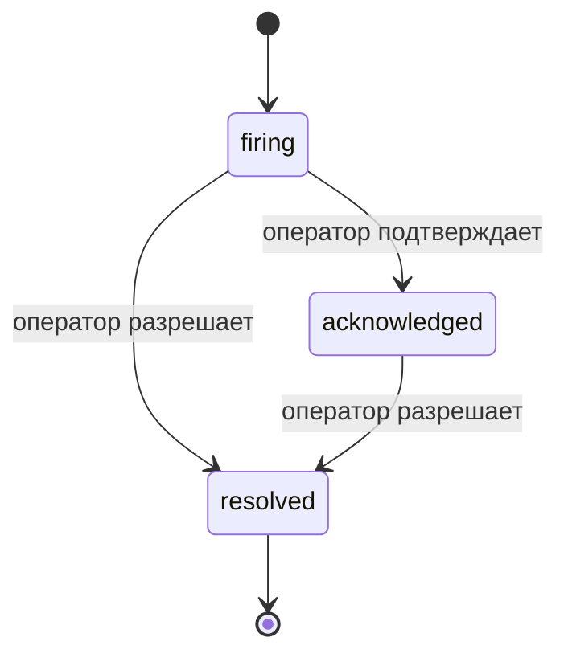

Когда срабатывает алерт, первый вопрос всегда: "кто этим занимается?" Инциденты отвечают на него: в момент нарушения все видят, что инцидент открыт, кто его ведёт и ровно то, что произошло, с чистым, атрибутированным записью, которую можно прямо передать на постмортем-анализ.

*Inbox группирует открытые инциденты по состоянию и фильтрует по серьёзности и ответственному, так что вы видите, что требует внимания прямо сейчас.*

## Сразу видно, у кого это на руках

Больше никаких "кто-нибудь это смотрит?" в цепочке чата. Нарушение автоматически открывает инцидент и помещает его в общий inbox, сгруппированный по состоянию. Подтвердите его — и ваше имя на нём, так что остальная команда знает, что это взято в работу. Подтверждение общее: несколько операторов могут подтвердить один и тот же инцидент, и каждое подтверждение записывается отдельно, поэтому полный war room показывается по именам вместо перекрытия друг друга. Назначьте одного ответственного для тriage-а и фильтруйте inbox по серьёзности или ответственному, чтобы оставить только то, что вас касается.

## Вся история на одной временной шкале

Когда инцидент завершён, отчёт уже готов. Откройте любой инцидент и получите доказательства нарушения, его ответственных и подписчиков, цепочку комментариев для координации на месте и неизменяемую временную шкалу действий.

*Всё, что произошло, по порядку, каждая строка подписана тем, кто это сделал.*

Каждое действие (открыто, подтверждено, разрешено и так далее) записывается на эту временную шкалу и никогда не редактируется. Каждая запись атрибутирована: оператору, который её совершил, по электронной почте, или **автоматизированному** для всего, что Failproof AI Observability сделал самостоятельно, например открытие инцидента по нарушению. Ничего не анонимно и ничего не теряется, так что постмортем более или менее пишет себя сам.

## Как инцидент перемещается

- **Открыт (firing):** нарушение открывает инцидент и один раз уведомляет ваши каналы. Повторные нарушения объединяются с тем же инцидентом и обновляют его доказательства вместо повторного уведомления.
- **Подтверждено:** оператор его берёт. Инцидент остаётся открытым, и позже нарушения обновляют доказательства тихо.
- **Разрешено:** оператор его закрывает. Автоматическое разрешение при исчезновении условия планируется, но пока не включено, так что инцидент остаётся открытым, пока человек его не разрешит, что держит всех в курсе того, что действительно исчезло. Свежий инцидент может открыться по тому же алерту позже.

Один алерт содержит максимум один открытый инцидент одновременно, так что трепещущее правило не может вас завалить дубликатами. Вы можете открыть инцидент и вручную: самостоятельный для чего-то, что ни один алерт не поймал, или подключённый к существующему алерту, если у вас есть `incidents:write`.

## Где это найти

Инциденты находятся в `/<org-slug>/incidents`. Просмотр требует **`incidents:read`**; открытие ручного инцидента требует **`incidents:write`**; подтверждение, назначение, комментирование и разрешение требуют **`incidents:ack`**. Старые ключи с отсутствующим `alerts:ack` продолжают работать, так как он признаётся как `incidents:ack`, поэтому вашу on-call ротацию не нужно переиздавать.

## Связанное

- [Алерты](/ru/agenteye/alerts): правила, которые открывают эти инциденты при нарушении порога.
- [Отслеживание ошибок](/ru/agenteye/error-tracking): видите все ошибки в одном месте и повышайте одну до алерта.
- [Аудиты](/ru/agenteye/audits): запланированный аналитик, который находит ошибки, которые ни одно правило не отслеживало.