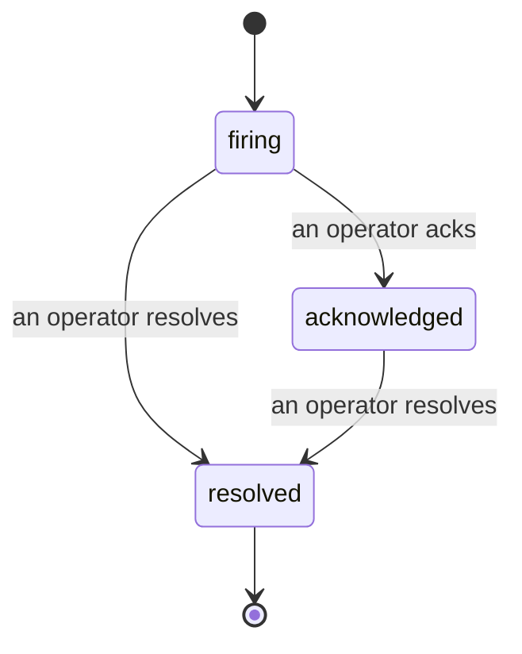

Когда срабатывает алерт, первый вопрос всегда: «кто это взял?» Инциденты отвечают на него: как только что-то нарушает пороговое значение, все видят, что инцидент открыт, кто за него отвечает и что произошло, с чистым атрибутированным логом, который можно прямо передать на постмортем.

*Входящие группируют открытые инциденты по статусу и фильтруют по серьезности и ответственному, чтобы вы видели, что требует внимания сейчас.*

## Видите сразу, кто за это взялся

Больше нет вопроса «кто-нибудь это смотрит?» в чате. Нарушение автоматически открывает инцидент и помещает его в общий входящий, сгруппированный по статусу. Подтвердите его — и ваше имя на нем, так что остальная команда знает, что это в работе. Подтверждение — общее: несколько операторов могут подтвердить один инцидент, каждый записывается отдельно, поэтому весь боевой центр видно по именам без пересечений. Назначьте одного ответственного для обработки и фильтруйте входящие по серьезности или ответственному, чтобы видеть только то, что вам надо.

## Вся история в одной временной шкале

Когда инцидент закончен, отчет у вас уже готов. Откройте любой инцидент — видите доказательство нарушения, резюме, назначенных и подписчиков, поток комментариев для координации и неизменяемую временную шкалу активности.

*Всё, что произошло, по порядку, каждая строка подписана тем, кто это сделал.*

Каждое действие (открыто, подтверждено, решено и т. д.) записывается на временной шкале и никогда не удаляется. Каждая запись атрибутирована: оператору, который её совершил, по email, или **automated** для всего, что сделала сама Failproof AI Observability, например открытие инцидента при нарушении. Ничего анонимного и ничего не теряется, поэтому постмортем практически пишет себя сам.

## Как инцидент меняет статус

- **Открыт (firing):** нарушение открывает инцидент и один раз вызывает оповещение ваших каналов. Повторные нарушения складываются в один инцидент и обновляют его доказательства вместо повторных оповещений.
- **Подтвержден (acknowledged):** оператор это взял. Инцидент остается открытым, позже нарушения обновляют доказательства тихо.
- **Решен (resolved):** оператор его закрыл. Автоматическое разрешение при очистке условия планируется, но еще не включено, поэтому инцидент остается открытым, пока человек его не решит — так все остаются честны насчет того, что реально очищено. Новый инцидент может открыться на том же алерте позже.

Один алерт может иметь максимум один открытый инцидент в один момент времени, так что колеблющееся правило не закопает вас в дубликатах. Вы также можете открыть инцидент вручную: отдельный для чего-то, что не поймал ни один алерт, или присоединенный к существующему алерту, если у вас есть `incidents:write`.

## Где это найти

Инциденты находятся в `/<org-slug>/incidents`. Просмотр требует **`incidents:read`**; открытие инцидента вручную требует **`incidents:write`**; подтверждение, назначение, комментирование и разрешение требуют **`incidents:ack`**. Старые ключи с удаленным `alerts:ack` продолжают работать, так как это признается как `incidents:ack`, поэтому вашему графику дежурства не нужно переиздание.

## Связанное

- [Алерты](/ru/agenteye/alerts): правила, которые открывают эти инциденты при нарушении порога.
- [Отслеживание ошибок](/ru/agenteye/error-tracking): видите каждый отказ в одном месте и превратите его в алерт.
- [Аудиты](/ru/agenteye/audits): запланированный аналитик, который находит отказы, за которыми не наблюдало ни одно правило.