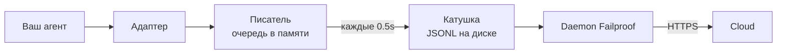

Для агента, написанного вами самим, или фреймворка, для которого у Failproof AI нет адаптера. Здесь нечего инструментировать: вы сами испускаете события.

Это тот же API, который используют четыре встроенных адаптера фреймворков. Они — таблицы трансляции над ним.

## Установка

```bash
pip install failproofai-sdk
```

Без дополнительных зависимостей.

## Инструментация

```python
import failproofai_sdk

failproofai_sdk.configure(environment="production")

with failproofai_sdk.session():                 # один запуск
    with failproofai_sdk.agent("planner"):      # одна единица работы
        with failproofai_sdk.tool_call("search", input={"q": q}) as t:
            t.output = search(q)                # один вызов инструмента
```

Читайте сверху вниз — это говорит, что имеется в виду:

| Оберните в | Чтобы сказать |
| --- | --- |
| `session()` | Эти события относятся к одному запуску |
| `agent()` | Что-то работает — дайте ему имя, которое вы узнаете в списке |
| `tool_call()` | Это один инструмент и вот что он вернул |

И что каждый из них на самом деле испускает:

| Область | Испускает | Назначение |
| --- | --- | --- |
| `session()` | Ничего | Привязывает идентификатор сессии, группирует один запуск |
| `agent()` | `agent_start`, `agent_end` | Обрамляет единицу работы |
| `tool_call()` | `tool_use`, `tool_result` | Обрамляет один инструмент и измеряет его |

Всё внутри может опустить `session_id` и `agent_id`. Области привязывают идентичность к переменным контекста, и каждый вызов события считывает её обратно, поэтому вы никогда не передаёте идентификаторы через функции.

Все три работают как с `async with`, так и с `with`.

Вложение агентов строит дерево. `parent_id` и глубина вычисляются из стека:

```python
with failproofai_sdk.session():
    with failproofai_sdk.agent("supervisor"):
        with failproofai_sdk.agent("researcher"):    # parent_id = "supervisor"
            ...
```

## Как область закрывается

`agent()` обрабатывает исключения за вас:

| Что произошло | События | Результат |
| --- | --- | --- |
| Ничего не возникло | `agent_end` | `success` |
| `Exception` | `error`, затем `agent_end` | `failed` |
| `KeyboardInterrupt`, `SystemExit` | `error`, затем `agent_end` | `failed` |
| `CancelledError`, `GeneratorExit` | только `agent_end` | `cancelled` |

Ошибка испускается до `agent_end`, потому что панель закрывает span на `agent_end`, и всё после этого атрибутируется ничему. Отмена — не неудача, поэтому отменённые запуски не загрязняют поверхность ошибок. Исключение всегда переиспускается: область никогда не глушит.

## Методы событий

Пятнадцать методов в шести семействах. Большинство идут парами — вы испускаете открытие, затем закрытие, и SDK измеряет промежуток между ними.

| Семейство | Открывает | Закрывает | Самостоятельно |
| --- | --- | --- | --- |
| **Агенты** | `agent_start` | `agent_end` | — |
| | `agent_pause` | `agent_resume` | — |
| **Модели** | `model_request` | `model_response` | — |
| **Инструменты** | `tool_use` | `tool_result` | — |
| **Hooks** | `hook_triggered` | `hook_completed` | — |
| **Люди** | `human_wait` | `human_input` | `human_pause`, `human_interrupt` |
| **Ошибки** | — | — | `error` |

<Tip>
  Предпочитайте области — `agent()` и `tool_call()` — где они подходят. Они гарантируют событие закрытия даже если тело возбуждает исключение. Обращайтесь к этим методам напрямую, когда ваш поток управления не вложен, например вызов модели внутри вспомогательной функции.
</Tip>

<CodeGroup>
```python Агенты
failproofai_sdk.event.agent_start(agent_id="planner", goal="find the cheapest flight")
failproofai_sdk.event.agent_end(agent_id="planner", outcome="success", summary="...")
failproofai_sdk.event.agent_pause(pause_id="p1", reason="awaiting approval")
failproofai_sdk.event.agent_resume(pause_id="p1")
```

```python Модели
failproofai_sdk.event.model_request(
    model="gpt-4o-mini",
    messages=[{"role": "user", "content": "..."}],
    request_id="req-1",
)
failproofai_sdk.event.model_response(
    model="gpt-4o-mini",
    content="...",
    input_tokens=139,
    output_tokens=21,
    request_id="req-1",
    duration_ms=5202,
)
```

```python Инструменты
failproofai_sdk.event.tool_use(tool_name="search", tool_call_id="c1", input={"q": "..."})
failproofai_sdk.event.tool_result(tool_name="search", tool_call_id="c1", output="...")
```

```python Hooks
failproofai_sdk.event.hook_triggered(hook_name="retrieve", hook_id="h1", trigger_event="node")
failproofai_sdk.event.hook_completed(hook_name="retrieve", hook_id="h1", outcome="success")
```

```python Люди
failproofai_sdk.event.human_wait(input_id="i1", prompt="Approve?", options=["yes", "no"])
failproofai_sdk.event.human_input(input_id="i1", response="yes")
failproofai_sdk.event.human_pause(reason="operator paused the run", user_id="dana")
failproofai_sdk.event.human_interrupt(reason="operator stopped the run", at_step="step_3")
```

```python Ошибки
failproofai_sdk.event.error(
    error_type="TimeoutError",
    message="provider timed out after 30s",
    traceback="...",
)
```
</CodeGroup>

<Note>
  **Два семейства «люди» указывают в противоположные стороны.**

  | Методы | Значение |
  | --- | --- |
  | `human_wait` / `human_input` | **Агент попросил человека** — врата одобрения, уточняющий вопрос |
  | `human_pause` / `human_interrupt` | **Человек действовал на агента** — кнопка стоп, пауза оператора |

  Ни один фреймворк не сигнализирует вторую пару, поэтому вы всегда испускаете её.
</Note>

<Warning>
  **Передавайте `request_id` когда вызовы модели выполняются одновременно.** Без него запросы и ответы согласуются в порядке прихода на агента — и одновременные вызовы не согласуются, каждый ответ прикрепляется к неправильному запросу.
</Warning>

## Пример

Цикл вызовов инструментов с API OpenAI без фреймворка агента:

```python
import json

import failproofai_sdk
from openai import OpenAI

failproofai_sdk.configure(environment="production")
client = OpenAI()
MODEL = "gpt-4o-mini"


def turn(messages: list):
    """Один вызов модели, обрамлённый парой."""
    failproofai_sdk.event.model_request(model=MODEL, messages=messages)
    reply = client.chat.completions.create(model=MODEL, messages=messages, tools=TOOLS)
    usage = reply.usage
    failproofai_sdk.event.model_response(
        model=MODEL,
        content=reply.choices[0].message.content or "",
        input_tokens=usage.prompt_tokens,
        output_tokens=usage.completion_tokens,
    )
    return reply.choices[0].message


with failproofai_sdk.session():
    with failproofai_sdk.agent("inventory", goal="price report"):
        for _ in range(4):          # ограничено; неограниченный цикл агента — его собственная ошибка
            message = turn(messages)
            if not message.tool_calls:
                break
            messages.append(message.model_dump(exclude_none=True))
            for call in message.tool_calls:
                args = json.loads(call.function.arguments or "{}")
                with failproofai_sdk.tool_call(
                    call.function.name, tool_call_id=call.id, input=args
                ) as handle:
                    handle.output = run_tool(call.function.name, args)
                messages.append({
                    "role": "tool",
                    "tool_call_id": call.id,
                    "content": str(handle.output),
                })
```

Это производит те же шесть типов событий, которые дал бы адаптер. Полная исполняемая версия с определениями инструментов поставляется в репозитории SDK в `docs/manual/examples/`.

## Потоки и async

Переменные контекста распространяются в задачи asyncio автоматически. Они не распространяются в новые потоки, потому что поток начинается с пустым контекстом.

```python
# asyncio: ничего не нужно делать
async with failproofai_sdk.session():
    await asyncio.gather(worker(1), worker(2))

# потоки: оберните вызываемое
pool.submit(failproofai_sdk.propagate(work), x)
threading.Thread(target=failproofai_sdk.propagate(work)).start()
loop.run_in_executor(None, failproofai_sdk.propagate(work), x)
```

Без `propagate()` события рабочего возбуждают `TypeError`, называя исправление, а не приземляются без сессии. Это намеренно: событие без сессии пропускается при приёме и отвечается `200`, что является молчаливой неудачей, которую предотвращает слой идентичности.

## Инструментируйте фреймворк без адаптера

Каждый фреймворк агентов даёт вам одни и те же три точки соединения. Отобразите их — и у вас есть полная трассировка — четыре встроенных адаптера ничего больше не делают.

| Точка соединения | Что вы пишете | Что приземляется |
| --- | --- | --- |
| Запуск | `session()` + `agent()` | `agent_start`, `agent_end` |
| Каждый инструмент | `tool_call()` | `tool_use`, `tool_result` |
| Каждый вызов модели | Пара `model_*` | `model_request`, `model_response` |

<Steps>
  <Step title="Обрамите запуск">
    ```python
    with failproofai_sdk.session():
        with failproofai_sdk.agent(agent_name, goal=task):
            result = framework.run(task)
    ```
  </Step>
  <Step title="Обрамите каждый инструмент">
    В чём бы фреймворк ни называл обёртку инструмента или middleware.

    ```python
    with failproofai_sdk.tool_call(name, input=args) as call:
        call.output = original(**args)
    ```
  </Step>
  <Step title="Согласуйте каждый вызов модели">
    ```python
    failproofai_sdk.event.model_request(model=model, messages=messages)
    reply = provider.complete(...)
    failproofai_sdk.event.model_response(
        model=model,
        content=text,
        input_tokens=usage.prompt_tokens,
        output_tokens=usage.completion_tokens,
    )
    ```
  </Step>
</Steps>

<Tip>
  **Есть граница узла, шага или middleware, достойная внимания?** Оберните её в пару hook — `hook_triggered` / `hook_completed` — а не вложенный `agent()`. `agent_id` — низкокардинальный аспект, и одна запись на узел его топит. Spans hook отображаются одинаково и дают вам задержку на узел.
</Tip>

<Note>
  **Ручная и автоматическая комбинируются.** Адаптер, работающий внутри написанной вручную области, присоединяется к этой сессии и становится родителем этому агенту, так что вы получаете одно дерево вместо двух — полезно когда вы инструментируете один фреймворк сами рядом с поддерживаемым.
</Note>

<Accordion title="Почему нет адаптера AutoGen">
  Две причины, и три точки соединения выше — ответ на обе:

  - `autogen-core` не обслуживается с сентября 2025.
  - AG2 не предоставляет глобальную точку регистрации, эквивалентную hooks других фреймворков, поэтому инструментация означает обёртывание каждого агента в каждом месте конструкции.

  Отображение точек соединения вручную записывает те же события с той же полнотой, что делал бы встроенный адаптер.
</Accordion>

## Глубже

Как запись на самом деле работает. Ничего из этого не требуется для начала.

<AccordionGroup>

<Accordion title="Как выглядит запись для каждого фреймворка" icon="eye">

Каждая запись имеет одну форму: span открывается, работа вложена в него, и каждое открывающее событие получает закрывающее.


**Пара** — это единица. Каждое закрывающее событие несёт продолжительность, которую SDK измеряет от открывающего события.

Ниже — один реальный запуск на фреймворк — захвачен из примеров, поставляемых с SDK, имя модели нормализовано. Обратите внимание, сколько возвращается из одного вызова.

<Tabs>
  <Tab title="LangGraph">
    ```text 14 событий
     1  +0.000s  agent_start       LangGraph
     2  +0.001s    hook_triggered  agent
     3  +0.002s      model_request   gpt-4o-mini
     4  +3.023s      model_response  gpt-4o-mini · 21 out-tok
     5  +3.024s    hook_completed  agent
     6  +3.024s    hook_triggered  tools
     7  +3.025s      tool_use      word_count
     8  +3.025s      tool_result   word_count · ok
     9  +3.025s    hook_completed  tools
    10  +3.026s    hook_triggered  agent
    11  +3.027s      model_request   gpt-4o-mini
    12  +5.717s      model_response  gpt-4o-mini · 5 out-tok
    13  +5.720s    hook_completed  agent
    14  +5.721s  agent_end         LangGraph · success
    ```

    Узлы становятся парами hook, так что вы получаете задержку на узел без их переполнения списка агентов.
  </Tab>

  <Tab title="CrewAI">
    ```text 10 событий
     1  +0.000s  agent_start       crew
     2  +0.050s    agent_start     analyst · under crew
     3  +0.057s      model_request   gpt-4o-mini
     4  +3.475s      model_response  gpt-4o-mini · 19 out-tok
     5  +3.478s      tool_use      lookup_metric
     6  +3.478s      tool_result   lookup_metric · ok
     7  +3.486s      model_request   gpt-4o-mini
     8  +5.694s      model_response  gpt-4o-mini · 9 out-tok
     9  +5.727s    agent_end       analyst · success
    10  +5.739s  agent_end         crew · success
    ```

    `role` каждого агента становится именем его span, так что задержка и трата токенов разбиваются на роль.
  </Tab>

  <Tab title="LlamaIndex">
    ```text 26 событий
     1  +0.000s  agent_start       Agent
     2  +0.001s    hook_triggered  init_run
     4  +0.501s    hook_triggered  setup_agent
     6  +0.503s    hook_triggered  run_agent_step
     7  +0.505s      model_request   gpt-4o-mini
     8  +3.083s      model_response  gpt-4o-mini · 18 out-tok
    10  +3.197s    hook_triggered  parse_agent_output
    12  +3.355s    hook_triggered  call_tool
    13  +3.355s      tool_use      city_population
    14  +3.355s      tool_result   city_population · ok
    16  +3.356s    hook_triggered  aggregate_tool_results
       ...                        вторая итерация
    26  +7.038s  agent_end         Agent · success
    ```

    Цикл агента видим сам, не только его вызовы модели.
  </Tab>

  <Tab title="Pydantic AI">
    ```text 8 событий
    1  +0.000s  agent_start       agent
    2  +0.001s    model_request   gpt-4o-mini
    3  +4.413s    model_response  gpt-4o-mini · 17 out-tok
    4  +4.415s    tool_use        population
    5  +4.415s    tool_result     population · ok
    6  +4.416s    model_request   gpt-4o-mini
    7  +8.118s    model_response  gpt-4o-mini · 6 out-tok
    8  +8.119s  agent_end         agent · success
    ```

    Нет пар hook: Pydantic AI не имеет границы узла или шага для обрамления.
  </Tab>

  <Tab title="Пользовательские агенты">
    ```text 6 событий
    1  +0.000s  agent_start       main
    2  +0.000s    tool_use        population
    3  +0.000s    tool_result     population · ok
    4  +0.000s    model_request   gpt-4o-mini
    5  +0.000s    model_response  gpt-4o-mini · 3 out-tok
    6  +0.000s  agent_end         main · success
    ```

    Вы испускаете их сами. Те же типы событий, та же полнота — это стоит вам вызовов.
  </Tab>
</Tabs>

</Accordion>

<Accordion title="Как сессия начинается и заканчивается" icon="circle-play">

**Нет события конца сессии.** Сессия — это не то, что вы закрываете — это группа событий, делящих `session_id`.

Статус выводится из формы трассировки:

| Статус | Когда |
| --- | --- |
| `ongoing` | По крайней мере один span ещё открыт |
| `paused` | `agent_pause` не имеет согласованного `agent_resume` |
| `error` | Ничего не открыто, и по крайней мере одно событие не удалось |
| `done` | Ничего не открыто, и ничего не не удалось |

Поэтому сессия заканчивается, когда каждая пара закрыта. Адаптеры испускают `agent_end` за вас, и при разборке они закрывают всё ещё открытое и отмечают его неполным — сбойный запуск устанавливается как `done` с видимым промежутком вместо вечного зависания.

<Note>
  Вот почему сессия может охватывать два вызова. LangGraph `interrupt()` приостанавливает запуск, корневой span намеренно остаётся открыт, и возобновляющий вызов закрывает его. Оба вызова — одна сессия.
</Note>

</Accordion>

<Accordion title="Идентичность: session_id, agent_id и кто их создаёт" icon="fingerprint">

`session_id` и `agent_id` необязательны на каждом методе события. Опущены, они разрешаются из области охватывающей:

```python
with failproofai_sdk.session():
    with failproofai_sdk.agent("planner"):
        failproofai_sdk.event.tool_use(tool_name="search", tool_call_id="c1")
```

Передача их явно всё ещё работает и имеет приоритет. Ничто не привязано и ничто не передано — вызов возбуждает `TypeError`, называя исправление, а не испускает событие без сессии, которое инgest пропустит отвечая `200`.

Области привязывают идентичность к переменным контекста. Те распространяются в задачи asyncio автоматически но не в новые потоки — оберните рабочего в `failproofai_sdk.propagate()`.

#### Кто создаёт какой id

| Id | Создано | Примечания |
| --- | --- | --- |
| `session_id` | Вы или SDK | `session("chat-42")` используется дословно; опущено, SDK генерирует `uuid4().hex` |
| `agent_id` | Вы или фреймворк | Из `agent("analyst")`, `role` CrewAI, `FunctionAgent.name`. Значение похожее на UUID отклоняется и заменяется |
| `tool_call_id`, `hook_id`, `request_id` | Вы или фреймворк | Адаптеры переиспользуют собственные run ids фреймворка, вот почему пары выживают прыжки потоков |
| **Event id** | **Cloud при приёме** | SDK не испускает ни один |
| **`dedup_key`** | **Cloud при приёме** | Хеш org, сессии, временной метки, типа и полезной нагрузки. Это реальная идентичность — она заставляет переданный batch схлопнуться вместо дублирования |

#### Как адаптеры разрешают `session_id`

Первое совпадение выигрывает:

1. Явное значение `session_id`
2. Метаданные по вызову
3. Область охватывающая `session()`
4. Метаданные фреймворка
5. Собственный run id фреймворка

Это никогда не выдумывается пока существует одно из них — синтезированный id разделил бы один запуск на несколько сессий.

#### Держите `agent_id` низкокардинальным

Это первичный аспект на каждой поверхности панели, и колонка `LowCardinality(String)`. Значение на запуск деградирует колонку и заполняет раскрывающееся меню фильтра одной записью на запуск.

Адаптеры защищают эту колонку за вас:

| Фреймворк передаёт | Записывается как | Почему |
| --- | --- | --- |
| `3f9a1c2b-…` (UUID) | `main` | Нечего читаемое держать |
| Длинная голая hex-строка | `main` | То же |
| `agent-3f9a1c2b-…` | `agent` | Id на запуск убран, читаемая часть сохранена |
| `agent-v2` | `agent-v2` | Короткие сегменты оставлены в покое |
| `step-3` | `step-3` | То же |

Реальный id сохранён на `fw_agent_id` / `fw_run_id`, где он остаётся запрашиваемым без того, чтобы быть аспектом.

<Warning>
  **Эта защита трогает только ярлыки, выбранные *фреймворком*.** `agent_id`, который вы передали сами — в `event.*` или в `failproofai_sdk.agent(...)` — записывается ровно как дано. Молчаливая переделка явного аргумента хуже кардинальности, которую она предотвращает, поэтому назовите свои spans соответственно.
</Warning>

</Accordion>

<Accordion title="Типы событий, сгруппированные — и какой фреймворк что записывает" icon="table">

| Группа | События |
| --- | --- |
| Агенты | `agent_start`, `agent_end`, `agent_pause`, `agent_resume` |
| Модели | `model_request`, `model_response` |
| Инструменты | `tool_use`, `tool_result` |
| Hooks | `hook_triggered`, `hook_completed` |
| Люди | `human_wait`, `human_input`, `human_pause`, `human_interrupt` |
| Ошибки | `error` |

Какой фреймворк что записывает, измеренное из запусков выше:

| Событие | LangGraph | CrewAI | LlamaIndex | Pydantic AI | Custom |
| --- | :--: | :--: | :--: | :--: | :--: |
| Начало и конец агента | Да | Да | Да | Да | Вы |
| Запрос и ответ модели | Да | Да | Да | Да | Вы |
| Использование и результат инструмента | Да | Да | Да | Да | Вы |
| Hook триггер и завершение | Узел | Задача | Шаг | — | Вы |
| Ошибка | Да | Да | Да | Да | Автоматически |
| Ожидание и ввод человека | Да | Да | Да | — | Вы |
| Пауза и возобновление агента | Да | Да | Да | — | Вы |

Прочерк означает, что фреймворк не имеет такой концепции. `human_pause` и `human_interrupt` описывают *человека*, действующего на агента, что ни один фреймворк не сигнализирует — испускайте их сами.

</Accordion>

<Accordion title="Пары, корреляция и продолжительность" icon="link">

Событие никогда не прибывает одно. Одно открывает span, одно закрывает его, и закрывающее событие несёт продолжительность, которую SDK измеряет от открывающего.

| Открывает | Закрывает | Закрывающее событие несёт |
| --- | --- | --- |
| `agent_start` | `agent_end` | `outcome`, `summary` |
| `model_request` | `model_response` | токены, `stop_reason`, задержку |
| `tool_use` | `tool_result` | `output` или `error`, продолжительность |
| `hook_triggered` | `hook_completed` | `outcome`, продолжительность |
| `agent_pause` | `agent_resume` | как долго длилась пауза |
| `human_wait` | `human_input` | ответ и как долго человек ждал |

<Warning>
  Открывающее событие без закрывающего — это span, который никогда не заканчивается. Сессия отображается всё ещё работающей вечно, и её активная продолжительность растёт. Это режим неудачи, который нужно наблюдать при инструментации вручную.
</Warning>

#### Правила корреляции

- Переиспользуйте то же `tool_call_id`, `hook_id`, `pause_id` или `input_id` для согласованного события завершения.
- SDK вычисляет `duration_ms` для `tool_result`, `hook_completed`, `agent_resume` и `human_input`. Передача его этим методам возбуждает `ValueError`.
- `duration_ms` **принимается** на `model_response`, потому что только вызывающий знает реальную задержку провайдера. Это должно быть целое число — float возбуждает `ValueError` на месте вызова, потому что сервер читает колонку как беззнаковое 32-битное целое и хранил бы NULL для чего-либо ещё.
- Ключи корреляции ограничены типом и сессией, поэтому вызов инструмента и hook могут безопасно делить id, и две одновременные сессии могут переиспользовать одни и те же ids без коллизий. Они не ограничены агентом: пара открытая под одним агентом и закрытая под другим всё ещё коррелирует, что обычно в мультиагентных фреймворках.
- `request_id` согласует `model_request` с `model_response`. Без него события модели согласуются по порядку на агента, поэтому одновременные вызовы не согласуются.
- Пара, разделённая процессами, всё ещё коррелирует ниже по течению, но SDK не может вычислить её в процессе продолжительность.
- Карта ожидания содержит максимум 10 000 начал и вытесняет самую старую запись когда полна.

</Accordion>

<Accordion title="Что в пакете и как instrument() находит ваш фреймворк" icon="box">

Установка `failproofai-sdk` устанавливает всё, все четыре адаптера включены. Extras тянут **фреймворк**, не адаптер.

```python
import failproofai_sdk        # ничего за пределами стандартной библиотеки
failproofai_sdk.instrument()  # импортирует только адаптеры, которые вы фактически используете
```

`import failproofai_sdk` контрактно беззависимость, обеспечено тестом, который устанавливает встроенное колесо с `--no-deps` и другим, который доказывает что ни один фреймворк не достигает `sys.modules`.

<Warning>
  Нет атрибута `failproofai_sdk.crewai`. Адаптеры намеренно не выставлены на пакет верхнего уровня: трогание одного импортировало бы фреймворк как побочный эффект доступа атрибута, нарушая обещание беззависимости. Используйте `instrument()`.
</Warning>

```python
failproofai_sdk.instrument()              # каждый фреймворк уже импортирован
failproofai_sdk.instrument("crewai")      # ровно один по имени
failproofai_sdk.uninstrument("crewai")    # верните его обратно
```

| Имя | Также принимает |
| --- | --- |
| `langchain` | `langgraph`, `langchain_core` |
| `crewai` | — |
| `llama_index` | `llamaindex`, `llama-index` |
| `pydantic_ai` | `pydantic-ai`, `pydanticai` |

Автообнаружение читает `sys.modules`, не список установленных пакетов, поэтому фреймворк, который вы установили но никогда не импортировали, не инструментируется и никогда не импортируется вашим именем. Чтобы видеть, что подключено:

```python
from failproofai_sdk.integrations import active, available

available()   # ('crewai', 'langchain', 'llama_index', 'pydantic_ai')
active()      # ('langchain',)
```

<Note>
  **`instrument("crewai")` на машине без CrewAI не возбуждает.** Оно логирует предупреждение и возвращает `()`, поэтому один отсутствующий фреймворк никогда не снимает процесс, который также инструментирует других.

  Предупреждение несёт основной `ImportError`, и то сообщение называет точную команду установки — так что исправление в ваших логах, не спрятано.

  ```text
  ImportError: failproofai_sdk: cannot instrument 'crewai' because 'crewai.events'
  is not importable. Install it with:  pip install 'failproofai_sdk[crewai]'
  ```

  Установите `FAILPROOFAI_SDK_STRICT=1` чтобы заставить её возбуждать вместо этого. Этот флаг читается **один раз и кешируется**, поэтому экспортируйте его перед началом вашего процесса вместо установки посредине запуска.
</Note>

<Warning>
  **`instrument()` должен идти *после* импорта вашего фреймворка*.** Автообнаружение читает `sys.modules`, поэтому голый вызов выше импорта находит ничего, устанавливает ничего и возвращает `()`.
</Warning>

<CodeGroup>
```python Неправильно
import failproofai_sdk
failproofai_sdk.instrument()   # sys.modules ещё не имеет langchain -> ()

import langchain               # слишком поздно, ничего не подключено
```

```python Правильно
import langchain               # импортируйте фреймворк первым
import failproofai_sdk

failproofai_sdk.instrument()   # находит его -> ('langchain',)
```

```python Правильно, порядок-доказательство
import failproofai_sdk

# Называние его импортирует адаптер по запросу, поэтому это работает откуда угодно.
failproofai_sdk.instrument("langchain")
```
</CodeGroup>

Ошибитесь в этом и процесс работает с импортированным SDK, адаптер видимо установлен, и **ни одно событие не испущено**. Оно логирует предупреждение говоря ровно это — так что сначала проверьте ваши логи когда запуск ничего не записывает.

</Accordion>

<Accordion title="Как события достигают Cloud" icon="cloud-upload">



| Этап | Задача | Работает в |
| --- | --- | --- |
| Адаптер | Переводит callback фреймворка в один из 15 типов событий | Ваш процесс |
| Писатель | Ставит в очередь, батчит, пишет JSONL атомарно | Ваш процесс, фоновый поток |
| Катушка | Прочная передача, выживает выход вашего процесса | Локальный диск |
| Daemon | Смотрит на катушку, отправляет батчи, удаляет отправленное | Ваша машина |
| Приём | Назначает id строки и ключ dedup, повышает запрашиваемые колонки | Cloud |

Катушка — это то, что делает это безопасным: ваш агент никогда не блокирует на сети, и Cloud outage означает растущий директорий вместо потерянных событий.

Каждый flush пишет один batch файл, `.tmp` первым, затем `fsync`, затем атомарное переименование:

```text
~/.failproofai/custom-agents/events/
  event-2026-08-20T10-15-00-123Z-48213-0.jsonl
```

Daemon берёт только `.jsonl`, поэтому он никогда не может читать полупиписанный файл. Основание несёт временную метку, id процесса и номер последовательности, поэтому два процесса, flushing в одной миллисекунде, не могут коллизировать. Очередь ограничена 10 000 событиями; свыше того она выбрасывает самое старое и логирует.

<Warning>
  **`collector.redact` по умолчанию `minimal` для событий SDK тоже.** SDK скребёт перед написанием batch на диск, и daemon повторяет тот же детерминистский проход перед загрузкой так что batch от старших SDKs защищены.
</Warning>

Daemon читает каждый batch и применяет редакцию в памяти перед загрузкой. Он не переписывает файл катушки, который прочитал.

| События | Написаны | Где minimal редакция работает |
| --- | --- | --- |
| CLI стенограммы сессии | Daemon | Перед тем как daemon пишет batch |
| Активность Hook | Daemon | Перед тем как daemon пишет batch |
| **Всё что SDK испускает** | **Ваш процесс** | **Перед тем как SDK пишет batch и снова перед daemon загрузкой** |

Установите `collector.redact` на `off` только когда дословные полезные нагрузки — явное требование; SDK и daemon оба уважают эту установку. Minimal редакция ловит обычные API ключи, bearer токены, JWTs и секретные назначения. Она не может определить произвольную чувствительную прозу.

<Tip>
  **Вы управляете полезными нагрузками у источника в двух местах:**

  - Выключите захват содержимого на адаптере. **Имя опции различается, и один адаптер не имеет ни одного** — это не один универсальный переключатель:
    - LangChain / LangGraph, Pydantic AI — `capture_content=False`
    - LlamaIndex — `capture_messages=False`
    - CrewAI — **нет переключателя содержимого**; `session_id` — единственная опция, которую он читает, так что prompts и completions всегда записываются.

    `instrument()` выбрасывает опции адаптер не читает, поэтому передача неправильного имени ничего не возбуждает и ничего не меняет.
  - Не передавайте секрет в `input=` первом месте.

  `collector.redact` — защита в глубину, не замена для любого.
</Tip>

<Warning>
  **Пустой директорий катушки — здоровое состояние.** Не используйте его для проверки доставки.
</Warning>

Daemon удаляет каждый batch в миллисеконде доставки, поэтому `ls` гонится с collector и показывает дробь того, что вы испустили — неразличимо от SDK, который ничего не записал.

Чтобы подтвердить события действительно приземлились, проверьте панель. Чтобы смотреть катушку наполняться, сначала остановите daemon.

</Accordion>

<Accordion title="Когда инструментация не удаётся" icon="triangle-alert">

Каждый callback работает внутри обёртки, единственная задача которой переиспускать, поэтому ваш вызов сидит в ровно одном `try` и всё что SDK делает происходит вне него.

| Что происходит | Результат |
| --- | --- |
| Hook возбуждает | Логируется один раз с traceback. Ваш вызов не затронут |
| Один и то же hook возбуждает три раза | Этот один hook отключён для остатка процесса с одной error линией |
| `FAILPROOFAI_SDK_STRICT=1` установлен | Исключение переиспущено вместо этого |
| Версия фреймворка вне протестированного диапазона | Предупреждает один раз, инструментирует всё равно |
| Одна возможность отсутствует | Этот один hook отключён, никогда не весь адаптер |

По умолчанию правильно в production и неправильно при отладке, потому что оно может только когда-нибудь доказать — не сломалось. Установите `FAILPROOFAI_SDK_STRICT=1` чтобы заставить проглоченную неудачу быть громкой.

</Accordion>

</AccordionGroup>

## Общие проблемы

<AccordionGroup>
  <Accordion title="Span никогда не заканчивается">
    Открывающее событие не имеет закрывающего: `model_request` без `model_response` или `tool_use` без `tool_result`. Используйте области, которые гарантируют пару даже когда тело возбуждает. Если вы вызываете методы события напрямую используйте `try` и `finally`.
  </Accordion>

  <Accordion title="Передача duration_ms возбуждает ValueError">
    Она измеряется от согласованного открывающего события, поэтому она отклоняется на `tool_result`, `hook_completed`, `agent_resume` и `human_input`. Она принимается на `model_response`, потому что только вы знаете реальную задержку провайдера, и она должна быть целое число.
  </Accordion>

  <Accordion title="События из потока рабочего возбуждают TypeError">
    Поток никогда не наследовал контекст. Оберните вызываемое в `failproofai_sdk.propagate()`. См. [Потоки и async](#потоки-и-async).
  </Accordion>

  <Accordion title="Дополнительное поле исчезло или перезаписало что-то">
    Дополнительные поля объединяются последними, поэтому одно с именем как реальное поле такое как `model` или `outcome` перезаписало бы его и изменило бы сохранённую колонку. Пространство имён своих; адаптеры используют префикс `fw_`.
  </Accordion>

  <Accordion title="Фильтр агента имеет тысячи записей">
    `agent_id` — низкокардинальный аспект и вы поставили id запуска в него. Используйте роль или имя узла и поставьте реальный id в поле полезной нагрузки.
  </Accordion>
</AccordionGroup>

## Далее

<Columns cols={3}>
  <Card title="Как это работает" icon="workflow" href="/ru/reference/custom-agents">
    Пары, ids, жизненный цикл сессии и доставка.
  </Card>
  <Card title="Прочитайте трассировку" icon="route" href="/ru/sessions/read-a-trace">
    Следите причинности через сессию, которую вы только что захватили.
  </Card>
  <Card title="Адаптеры фреймворков" icon="plug" href="/ru/start/integrations">
    LangGraph, CrewAI, LlamaIndex и Pydantic AI.
  </Card>
</Columns>