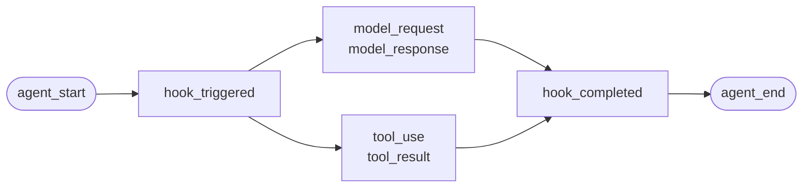
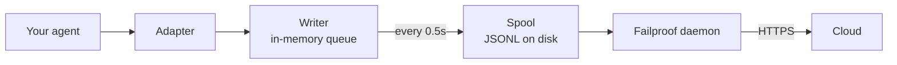

Для агента, который вы написали сами, или фреймворка, для которого у Failproof AI нет адаптера. Инструментировать нечего — вы сами генерируете события.

Это тот же API, который используют четыре адаптера фреймворков. Они — таблицы трансляции над ним.

## Установка

```bash
pip install failproofai-sdk
```

Никаких дополнений и зависимостей.

## Инструментирование

```python
import failproofai_sdk

failproofai_sdk.configure(environment="production")

with failproofai_sdk.session():                 # один запуск
    with failproofai_sdk.agent("planner"):      # одна единица работы
        with failproofai_sdk.tool_call("search", input={"q": q}) as t:
            t.output = search(q)                # один вызов инструмента
```

Читайте сверху вниз — и станет ясно, что это означает:

| Оберните в | Чтобы сказать |
| --- | --- |
| `session()` | Эти события принадлежат одному запуску |
| `agent()` | Что-то выполняет работу — дайте ему имя, которое вы узнаете в списке |
| `tool_call()` | Это один инструмент и вот что он вернул |

И что каждый из них фактически генерирует:

| Область | Генерирует | Назначение |
| --- | --- | --- |
| `session()` | Ничего | Привязывает session id, группируя один запуск |
| `agent()` | `agent_start`, `agent_end` | Ограничивает единицу работы |
| `tool_call()` | `tool_use`, `tool_result` | Ограничивает один инструмент и его результат |

Всё внутри может опустить `session_id` и `agent_id`. Области привязывают идентификацию на переменные контекста и каждый вызов события читает её обратно, поэтому вам никогда не нужно передавать id через функции.

Все три работают с `async with` наравне с `with`.

Вложенные агенты строят дерево. `parent_id` и глубина вычисляются из стека:

```python
with failproofai_sdk.session():
    with failproofai_sdk.agent("supervisor"):
        with failproofai_sdk.agent("researcher"):    # parent_id = "supervisor"
            ...
```

## Как закрывается область

`agent()` обрабатывает исключения за вас:

| Что произошло | События | Результат |
| --- | --- | --- |
| Ничего не возникло | `agent_end` | `success` |
| `Exception` | `error`, затем `agent_end` | `failed` |
| `KeyboardInterrupt`, `SystemExit` | `error`, затем `agent_end` | `failed` |
| `CancelledError`, `GeneratorExit` | только `agent_end` | `cancelled` |

Ошибка генерируется перед `agent_end`, потому что панель управления закрывает span при `agent_end` и всё после этого не атрибутируется ничему. Отмена — не ошибка, поэтому отменённые запуски не загромождают поверхность ошибок. Исключение всегда переиспускается: область никогда его не подавляет.

## Методы события

Пятнадцать методов в шести семействах. Большинство идут парами — вы генерируете открывающее событие, затем закрывающее, и SDK измеряет промежуток между ними.

| Семейство | Открывает | Закрывает | Самостоятельное |
| --- | --- | --- | --- |
| **Agents** | `agent_start` | `agent_end` | — |
| | `agent_pause` | `agent_resume` | — |
| **Models** | `model_request` | `model_response` | — |
| **Tools** | `tool_use` | `tool_result` | — |
| **Hooks** | `hook_triggered` | `hook_completed` | — |
| **Humans** | `human_wait` | `human_input` | `human_pause`, `human_interrupt` |
| **Failures** | — | — | `error` |

<Tip>
  Предпочитайте области — `agent()` и `tool_call()` — везде, где они подходят. Они гарантируют закрывающее событие даже когда тело выбрасывает исключение. Обращайтесь к этим методам напрямую, когда ваш управляющий поток не вложен, например вызов модели внутри вспомогательной функции.
</Tip>

<CodeGroup>
```python Agents
failproofai_sdk.event.agent_start(agent_id="planner", goal="find the cheapest flight")
failproofai_sdk.event.agent_end(agent_id="planner", outcome="success", summary="...")
failproofai_sdk.event.agent_pause(pause_id="p1", reason="awaiting approval")
failproofai_sdk.event.agent_resume(pause_id="p1")
```

```python Models
failproofai_sdk.event.model_request(
    model="gpt-4o-mini",
    messages=[{"role": "user", "content": "..."}],
    request_id="req-1",
)
failproofai_sdk.event.model_response(
    model="gpt-4o-mini",
    content="...",
    input_tokens=139,
    output_tokens=21,
    request_id="req-1",
    duration_ms=5202,
)
```

```python Tools
failproofai_sdk.event.tool_use(tool_name="search", tool_call_id="c1", input={"q": "..."})
failproofai_sdk.event.tool_result(tool_name="search", tool_call_id="c1", output="...")
```

```python Hooks
failproofai_sdk.event.hook_triggered(hook_name="retrieve", hook_id="h1", trigger_event="node")
failproofai_sdk.event.hook_completed(hook_name="retrieve", hook_id="h1", outcome="success")
```

```python Humans
failproofai_sdk.event.human_wait(input_id="i1", prompt="Approve?", options=["yes", "no"])
failproofai_sdk.event.human_input(input_id="i1", response="yes")
failproofai_sdk.event.human_pause(reason="operator paused the run", user_id="dana")
failproofai_sdk.event.human_interrupt(reason="operator stopped the run", at_step="step_3")
```

```python Failures
failproofai_sdk.event.error(
    error_type="TimeoutError",
    message="provider timed out after 30s",
    traceback="...",
)
```
</CodeGroup>

<Note>
  **Два семейства human указывают в противоположных направлениях.**

  | Методы | Значение |
  | --- | --- |
  | `human_wait` / `human_input` | **Агент попросил человека** — ворота одобрения, уточняющий вопрос |
  | `human_pause` / `human_interrupt` | **Человек действовал на агента** — кнопка остановки, пауза оператора |

  Ни один фреймворк не сигнализирует вторую пару, поэтому её всегда нужно генерировать вам.
</Note>

<Warning>
  **Передавайте `request_id` когда вызовы модели выполняются одновременно.** Без него запросы и ответы сопряжаются в порядке поступления за агента — и одновременные вызовы неправильно сопрягаются, присоединяя каждый ответ к неправильному запросу.
</Warning>

## Пример

Цикл вызовов инструментов против OpenAI API без фреймворка агента:

```python
import json

import failproofai_sdk
from openai import OpenAI

failproofai_sdk.configure(environment="production")
client = OpenAI()
MODEL = "gpt-4o-mini"


def turn(messages: list):
    """Один вызов модели, ограниченный парой событий."""
    failproofai_sdk.event.model_request(model=MODEL, messages=messages)
    reply = client.chat.completions.create(model=MODEL, messages=messages, tools=TOOLS)
    usage = reply.usage
    failproofai_sdk.event.model_response(
        model=MODEL,
        content=reply.choices[0].message.content or "",
        input_tokens=usage.prompt_tokens,
        output_tokens=usage.completion_tokens,
    )
    return reply.choices[0].message


with failproofai_sdk.session():
    with failproofai_sdk.agent("inventory", goal="price report"):
        for _ in range(4):          # ограниченное количество; бесконечный цикл агента — его собственная ошибка
            message = turn(messages)
            if not message.tool_calls:
                break
            messages.append(message.model_dump(exclude_none=True))
            for call in message.tool_calls:
                args = json.loads(call.function.arguments or "{}")
                with failproofai_sdk.tool_call(
                    call.function.name, tool_call_id=call.id, input=args
                ) as handle:
                    handle.output = run_tool(call.function.name, args)
                messages.append({
                    "role": "tool",
                    "tool_call_id": call.id,
                    "content": str(handle.output),
                })
```

Это генерирует те же шесть типов событий, которые даст адаптер. Полная рабочая версия с определениями инструментов поставляется в репозитории SDK в `docs/manual/examples/`.

## Потоки и async

Переменные контекста автоматически распространяются в asyncio задачи. Они не распространяются в новые потоки, потому что поток начинается с пустым контекстом.

```python
# asyncio: ничего не нужно делать
async with failproofai_sdk.session():
    await asyncio.gather(worker(1), worker(2))

# threads: оберните callable
pool.submit(failproofai_sdk.propagate(work), x)
threading.Thread(target=failproofai_sdk.propagate(work)).start()
loop.run_in_executor(None, failproofai_sdk.propagate(work), x)
```

Без `propagate()` события рабочего выбросят `TypeError` с названием исправления вместо приземления без session. Это намеренно: событие без session пропускается при обработке и ему ответили `200`, что — это скрытый отказ, который существует уровень идентификации чтобы предотвратить.

## Инструментирование фреймворка без адаптера

Каждый фреймворк агента даёт вам те же три точки. Отобразите их — и у вас есть полная трассировка. Четыре поставляемых адаптера делают ровно это.

| Точка | Что вы пишете | Что попадает |
| --- | --- | --- |
| Запуск | `session()` + `agent()` | `agent_start`, `agent_end` |
| Каждый инструмент | `tool_call()` | `tool_use`, `tool_result` |
| Каждый вызов модели | Пара `model_*` | `model_request`, `model_response` |

<Steps>
  <Step title="Ограничьте запуск">
    ```python
    with failproofai_sdk.session():
        with failproofai_sdk.agent(agent_name, goal=task):
            result = framework.run(task)
    ```
  </Step>
  <Step title="Ограничьте каждый инструмент">
    В чём бы фреймворк ни называл обёртку инструмента или middleware.

    ```python
    with failproofai_sdk.tool_call(name, input=args) as call:
        call.output = original(**args)
    ```
  </Step>
  <Step title="Сопряжьте каждый вызов модели">
    ```python
    failproofai_sdk.event.model_request(model=model, messages=messages)
    reply = provider.complete(...)
    failproofai_sdk.event.model_response(
        model=model,
        content=text,
        input_tokens=usage.prompt_tokens,
        output_tokens=usage.completion_tokens,
    )
    ```
  </Step>
</Steps>

<Tip>
  **Есть граница узла, шага или middleware, достойная внимания?** Оберните её в пару hook — `hook_triggered` / `hook_completed` — а не вложенный `agent()`. `agent_id` — низко-кардинальный фасет, и одна запись на узел его захламляет. Span-ы hook отображаются так же и дают вам задержку за узел.
</Tip>

<Note>
  **Ручное и автоматическое взаимодействуют.** Адаптер, работающий внутри ручной области, присоединяется к этой session и становится родителем этого агента, поэтому вы получаете одно дерево вместо двух — это полезно когда вы инструментируете один фреймворк сами наряду с поддерживаемым.
</Note>

<Accordion title="Почему нет адаптера AutoGen">
  Две причины, и три точки выше — ответ на обе:

  - `autogen-core` не обслуживается с сентября 2025.
  - AG2 не раскрывает точку регистрации масштаба процесса, эквивалентную хукам других фреймворков, поэтому инструментирование означает обёртывание каждого агента на каждом месте конструирования.

  Ручное отображение точек записывает те же события с той же точностью, что и поставляемый адаптер.
</Accordion>

## Глубже

Как запись фактически работает. Ничего из этого не требуется для начала.

<AccordionGroup>

<Accordion title="Как выглядит запись по фреймворку" icon="eye">

Каждая запись имеет одну форму: span открывается, работа вложена внутри, и каждому открывающему событию соответствует закрывающее.



**Пара** — это единица. Каждое закрывающее событие несёт длительность, которую SDK измеряет от открывающего.

Ниже один реальный запуск на фреймворк — захвачен из примеров, которые поставляются с SDK, имя модели нормализовано. Обратите внимание, сколько возвращается из одного вызова.

<Tabs>
  <Tab title="LangGraph">
    ```text 14 events
     1  +0.000s  agent_start       LangGraph
     2  +0.001s    hook_triggered  agent
     3  +0.002s      model_request   gpt-4o-mini
     4  +3.023s      model_response  gpt-4o-mini · 21 out-tok
     5  +3.024s    hook_completed  agent
     6  +3.024s    hook_triggered  tools
     7  +3.025s      tool_use      word_count
     8  +3.025s      tool_result   word_count · ok
     9  +3.025s    hook_completed  tools
    10  +3.026s    hook_triggered  agent
    11  +3.027s      model_request   gpt-4o-mini
    12  +5.717s      model_response  gpt-4o-mini · 5 out-tok
    13  +5.720s    hook_completed  agent
    14  +5.721s  agent_end         LangGraph · success
    ```

    Узлы становятся парами hook, поэтому вы получаете задержку за узел без того, чтобы они загромождали список агентов.
  </Tab>

  <Tab title="CrewAI">
    ```text 10 events
     1  +0.000s  agent_start       crew
     2  +0.050s    agent_start     analyst · under crew
     3  +0.057s      model_request   gpt-4o-mini
     4  +3.475s      model_response  gpt-4o-mini · 19 out-tok
     5  +3.478s      tool_use      lookup_metric
     6  +3.478s      tool_result   lookup_metric · ok
     7  +3.486s      model_request   gpt-4o-mini
     8  +5.694s      model_response  gpt-4o-mini · 9 out-tok
     9  +5.727s    agent_end       analyst · success
    10  +5.739s  agent_end         crew · success
    ```

    Каждый `role` агента становится имя span-а, поэтому задержка и трата токенов разбиваются по role.
  </Tab>

  <Tab title="LlamaIndex">
    ```text 26 events
     1  +0.000s  agent_start       Agent
     2  +0.001s    hook_triggered  init_run
     4  +0.501s    hook_triggered  setup_agent
     6  +0.503s    hook_triggered  run_agent_step
     7  +0.505s      model_request   gpt-4o-mini
     8  +3.083s      model_response  gpt-4o-mini · 18 out-tok
    10  +3.197s    hook_triggered  parse_agent_output
    12  +3.355s    hook_triggered  call_tool
    13  +3.355s      tool_use      city_population
    14  +3.355s      tool_result   city_population · ok
    16  +3.356s    hook_triggered  aggregate_tool_results
       ...                        second iteration
    26  +7.038s  agent_end         Agent · success
    ```

    Цикл агента сам видим, не только его вызовы модели.
  </Tab>

  <Tab title="Pydantic AI">
    ```text 8 events
    1  +0.000s  agent_start       agent
    2  +0.001s    model_request   gpt-4o-mini
    3  +4.413s    model_response  gpt-4o-mini · 17 out-tok
    4  +4.415s    tool_use        population
    5  +4.415s    tool_result     population · ok
    6  +4.416s    model_request   gpt-4o-mini
    7  +8.118s    model_response  gpt-4o-mini · 6 out-tok
    8  +8.119s  agent_end         agent · success
    ```

    Нет пар hook: Pydantic AI не имеет границы узла или шага для ограничения.
  </Tab>

  <Tab title="Custom agents">
    ```text 6 events
    1  +0.000s  agent_start       main
    2  +0.000s    tool_use        population
    3  +0.000s    tool_result     population · ok
    4  +0.000s    model_request   gpt-4o-mini
    5  +0.000s    model_response  gpt-4o-mini · 3 out-tok
    6  +0.000s  agent_end         main · success
    ```

    Вы генерируете их сами. Те же типы событий, та же точность — это стоит вам мест вызовов.
  </Tab>
</Tabs>

</Accordion>

<Accordion title="Как session начинается и заканчивается" icon="circle-play">

**Нет события завершения session.** Session — это не то, что вы закрываете — это группа событий, разделяющих `session_id`.

Статус выводится из формы трассировки:

| Статус | Когда |
| --- | --- |
| `ongoing` | По крайней мере один span всё ещё открыт |
| `paused` | `agent_pause` не имеет соответствующей `agent_resume` |
| `error` | Ничего не открыто и по крайней мере одно событие не прошло |
| `done` | Ничего не открыто и ничего не провалилось |

Поэтому session заканчивается когда каждая пара закрыта. Адаптеры генерируют `agent_end` для вас, и при завершении они закрывают всё ещё открытое и отмечают его неполным — упавший запуск урегулируется как `done` с видимым пробелом вместо вечного зависания.

<Note>
  Вот почему session может охватывать два вызова. `interrupt()` LangGraph пауза запуска, root span намеренно остаётся открыт, и возобновляющий вызов его закрывает. Оба вызова — одна session.
</Note>

</Accordion>

<Accordion title="Identity: session_id, agent_id, и кто их создаёт" icon="fingerprint">

`session_id` и `agent_id` опциональны для каждого метода события. Опущены — они разрешаются из вмещающей области:

```python
with failproofai_sdk.session():
    with failproofai_sdk.agent("planner"):
        failproofai_sdk.event.tool_use(tool_name="search", tool_call_id="c1")
```

Их явная передача всё ещё работает и имеет приоритет. Без привязанного и без переданного вызов выбросит `TypeError` с названием исправления вместо того чтобы генерировать событие без session, которое ingest пропустит при ответе `200`.

Области привязывают идентификацию на переменные контекста. Они распространяются в asyncio задачи автоматически но не в новые потоки — оберните рабочего в `failproofai_sdk.propagate()`.

#### Кто создаёт какой id

| Id | Создан | Заметки |
| --- | --- | --- |
| `session_id` | Вы или SDK | `session("chat-42")` используется как есть; опущен, SDK генерирует `uuid4().hex` |
| `agent_id` | Вы или фреймворк | От `agent("analyst")`, CrewAI `role`, имя `FunctionAgent.name`. UUID-подобное значение отклоняется и заменяется |
| `tool_call_id`, `hook_id`, `request_id` | Вы или фреймворк | Адаптеры переиспользуют собственные id запуска фреймворка, вот почему пары выживают переходы через потоки |
| **Event id** | **Cloud at ingest** | SDK не генерирует |
| **`dedup_key`** | **Cloud at ingest** | Хеш org, session, timestamp, type и payload. Это реальная идентификация — делает повторённую партию коллапсом вместо дублирования |

#### Как адаптеры разрешают `session_id`

Первое совпадение выигрывает:

1. Явная опция `session_id`
2. Per-call метаданные
3. Вмещающая область `session()`
4. Метаданные фреймворка
5. Собственный run id фреймворка

Она никогда не синтезируется пока одна из них существует — синтезированный id расколол бы один запуск на несколько session.

#### Держите `agent_id` низко-кардинальным

Это первичный фасет на каждой поверхности панели управления и `LowCardinality(String)` колонка. Per-run значение деградирует колонку и заполняет выпадающий фильтр одной записью за запуск.

Адаптеры защищают эту колонку для вас:

| Фреймворк передаёт | Записано как | Почему |
| --- | --- | --- |
| `3f9a1c2b-…` (UUID) | `main` | Нечего читаемого хранить |
| Долгая чистая hex строка | `main` | То же самое |
| `agent-3f9a1c2b-…` | `agent` | Per-run id удалён, читаемая часть сохранена |
| `agent-v2` | `agent-v2` | Короткие сегменты оставлены одни |
| `step-3` | `step-3` | То же самое |

Реальный id хранится на `fw_agent_id` / `fw_run_id`, где остаётся queryable без того чтобы быть фасетом.

<Warning>
  **Эта защита только трогает ярлыки, которые **фреймворк** выбрал.** `agent_id`, который вы сами передали — в `event.*` или в `failproofai_sdk.agent(...)` — записывается ровно как дано. Молчаливое переписывание явного аргумента было бы хуже чем кардинальность, которую оно предотвращает, поэтому называйте ваши span-ы сами соответственно.
</Warning>

</Accordion>

<Accordion title="Типы событий, сгруппированные — и какой фреймворк что записывает" icon="table">

| Группа | События |
| --- | --- |
| Agents | `agent_start`, `agent_end`, `agent_pause`, `agent_resume` |
| Models | `model_request`, `model_response` |
| Tools | `tool_use`, `tool_result` |
| Hooks | `hook_triggered`, `hook_completed` |
| Humans | `human_wait`, `human_input`, `human_pause`, `human_interrupt` |
| Failures | `error` |

Какой фреймворк что записывает, измеренный от запусков выше:

| События | LangGraph | CrewAI | LlamaIndex | Pydantic AI | Custom |
| --- | :--: | :--: | :--: | :--: | :--: |
| Старт и конец агента | Yes | Yes | Yes | Yes | You |
| Запрос и ответ модели | Yes | Yes | Yes | Yes | You |
| Использование и результат инструмента | Yes | Yes | Yes | Yes | You |
| Hook triggered и completed | Node | Task | Step | — | You |
| Error | Yes | Yes | Yes | Yes | Automatic |
| Human wait и input | Yes | Yes | Yes | — | You |
| Agent pause и resume | Yes | Yes | Yes | — | You |

Тире означает фреймворк не имеет такой концепции. `human_pause` и `human_interrupt` описывают **человека**, действующего на агента, что ни один фреймворк не сигнализирует — генерируйте их сами.

</Accordion>

<Accordion title="Пары, корреляция и длительность" icon="link">

Событие никогда не приходит одно. Одно открывает span, одно закрывает его, и закрывающее событие несёт длительность, которую SDK измеряет от открывающего.

| Открывает | Закрывает | Закрывающее событие несёт |
| --- | --- | --- |
| `agent_start` | `agent_end` | `outcome`, `summary` |
| `model_request` | `model_response` | токены, `stop_reason`, задержка |
| `tool_use` | `tool_result` | `output` или `error`, длительность |
| `hook_triggered` | `hook_completed` | `outcome`, длительность |
| `agent_pause` | `agent_resume` | как долго пауза длилась |
| `human_wait` | `human_input` | ответ и как долго человек занимал |

<Warning>
  Открывающее событие без закрывающего — это span, который никогда не завершается. Session отображается как всё ещё работающий, навсегда, и его активная длительность продолжает расти. Это режим отказа, за которым нужно следить когда вы инструментируете вручную.
</Warning>

#### Правила корреляции

- Переиспользуйте тот же `tool_call_id`, `hook_id`, `pause_id` или `input_id` для соответствующего события завершения.
- SDK вычисляет `duration_ms` для `tool_result`, `hook_completed`, `agent_resume` и `human_input`. Передача его этим методам выбросит `ValueError`.
- `duration_ms` **принят** на `model_response`, потому что только вызывающий знает реальную задержку провайдера. Это должно быть целое число — float выбросит `ValueError` на месте вызова, потому что сервер читает колонку как 32-битное целое число без знака и сохранит NULL для чего-либо ещё.
- Ключи корреляции ограничены видом и session, поэтому вызов инструмента и hook могут безопасно разделить id, и две одновременные session могут переиспользовать те же id без столкновения. Они не ограничены агентом: пара открытая под одним агентом и закрытая под другим всё ещё коррелирует, это обычный случай в multi-agent фреймворках.
- `request_id` сопрягает `model_request` с `model_response`. Без него события модели сопрягаются в порядке за агента, поэтому одновременные вызовы неправильно сопрягаются.
- Пара разделённая через процессы всё ещё коррелирует downstream, но SDK не может вычислить её in-process длительность.
- Ожидающая карта держит максимум 10,000 стартов и вытеснит самую старую запись когда полна.

</Accordion>

<Accordion title="Что в пакете и как instrument() находит ваш фреймворк" icon="box">

Установка `failproofai-sdk` устанавливает всё, все четыре адаптера включены. Extras вытягивают **фреймворк**, а не адаптер.

```python
import failproofai_sdk        # загружает ничего вне стандартной библиотеки
failproofai_sdk.instrument()  # импортирует только адаптеры, которые вам фактически нужны
```

`import failproofai_sdk` контрактно ноль-зависимости, принудительно тестом который устанавливает построенное колесо с `--no-deps` и другое которое доказывает что ни один фреймворк не достигает `sys.modules`.

<Warning>
  Нет атрибута `failproofai_sdk.crewai`. Адаптеры намеренно не раскрыты на пакете верхнего уровня: трогание одного импортировало бы фреймворк как побочный эффект доступа атрибута, ломая ноль-зависимость обещание. Используйте `instrument()`.
</Warning>

```python
failproofai_sdk.instrument()              # каждый фреймворк уже импортирован
failproofai_sdk.instrument("crewai")      # ровно один, по имени
failproofai_sdk.uninstrument("crewai")    # вернуть его
```

| Имя | Также принимает |
| --- | --- |
| `langchain` | `langgraph`, `langchain_core` |
| `crewai` | — |
| `llama_index` | `llamaindex`, `llama-index` |
| `pydantic_ai` | `pydantic-ai`, `pydanticai` |

Auto-detection читает `sys.modules`, не список установленных пакетов, поэтому фреймворк, который вы установили но никогда не импортировали, не инструментируется и никогда не импортируется от вашего имени. Чтобы увидеть что подключено:

```python
from failproofai_sdk.integrations import active, available

available()   # ('crewai', 'langchain', 'llama_index', 'pydantic_ai')
active()      # ('langchain',)
```

<Note>
  **`instrument("crewai")` на машине без CrewAI не выбросит.** Это логирует предупреждение и возвращает `()`, поэтому один отсутствующий фреймворк никогда не возьмёт процесс который также инструментирует других.

  Предупреждение несёт базовую `ImportError`, и это сообщение называет точную команду установки — поэтому исправление в ваших логах, не спрятано.

  ```text
  ImportError: failproofai_sdk: cannot instrument 'crewai' because 'crewai.events'
  is not importable. Install it with:  pip install 'failproofai_sdk[crewai]'
  ```

  Установите `FAILPROOFAI_SDK_STRICT=1` чтобы это выбросило вместо этого. Этот флаг читается **один раз и кэшируется**, поэтому экспортируйте его перед тем как ваш процесс начнётся вместо того чтобы устанавливать mid-run.
</Note>

<Warning>
  **`instrument()` должен прийти *после* вашего импорта фреймворка.** Auto-detection читает `sys.modules`, поэтому чистый вызов выше импорта находит ничего, устанавливает ничего, и возвращает `()`.
</Warning>

<CodeGroup>
```python Wrong
import failproofai_sdk
failproofai_sdk.instrument()   # sys.modules ещё не имеет langchain -> ()

import langchain               # слишком поздно, ничего не подключено
```

```python Right
import langchain               # импортируйте фреймворк первым
import failproofai_sdk

failproofai_sdk.instrument()   # находит его -> ('langchain',)
```

```python Right, order-proof
import failproofai_sdk

# Называние этого импортирует адаптер по запросу, поэтому это работает отовсюду.
failproofai_sdk.instrument("langchain")
```
</CodeGroup>

Получите это неправильно и процесс работает с импортированным SDK, видимо установленным адаптером, и **не одно событие не генерируется**. Это логирует предупреждение говоря ровно это — поэтому проверьте ваши логи первым когда запуск ничего не записывает.

</Accordion>

<Accordion title="Как события достигают Cloud" icon="cloud-upload">



| Этап | Работа | Работает в |
| --- | --- | --- |
| Adapter | Переводит обратный вызов фреймворка в один из 15 типов событий | Ваш процесс |
| Writer | Очереди, батчи, писать JSONL атомарно | Ваш процесс, фоновый поток |
| Spool | Прочная передача, выживает выход вашего процесса | Локальный диск |
| Daemon | Следит за spool, доставляет батчи, удаляет то что он доставил | Ваша машина |
| Ingest | Присваивает row id и dedup key, рекламирует queryable колонки | Cloud |

Spool — это то что делает это безопасным: ваш агент никогда не блокируется на сети, и Cloud outage означает растущую директорию вместо потерянных событий.

Каждый flush пишет один batch файл, `.tmp` сначала, затем `fsync`, затем атомарное переименование:

```text
~/.failproofai/custom-agents/events/
  event-2026-08-20T10-15-00-123Z-48213-0.jsonl
```

Daemon только подбирает `.jsonl`, поэтому никогда не может прочитать наполовину написанный файл. Stem несёт timestamp, process id и sequence number, поэтому два процесса flushing в той же миллисекунде не могут столкнуться. Очередь ограничена 10,000 событиями; сверх этого она отбрасывает самое старое и логирует.

<Warning>
  **`collector.redact` не применяется к вашим SDK событиям.** Он их никогда не видит.
</Warning>

Daemon **доставляет** ваши батчи. Он их не открывает и не переписывает.

| События | Написано | Отредактировано `collector.redact`? |
| --- | --- | --- |
| CLI session транскрипты | Daemon | Yes |
| Hook activity | Daemon | Yes |
| **Всё что SDK генерирует** | **Ваш процесс** | **No** |

Редакция работает где daemon **пишет** его собственные события — не где батчи **доставляются**. Поэтому prompt или инструмент argument держащий API key всё ещё держит его по прибытии.

Это намеренно. Это ваши собственные вызовы инструментирования, и переписывание их в пути бы означало события которые вы получаете не события которые вы генерировали.

<Tip>
  **Вы контролируете payloads на источнике в двух местах:**

  - Выключите захват контента на адаптере. **Имя опции отличается и один адаптер не имеет** — это не один универсальный переключатель:
    - LangChain / LangGraph, Pydantic AI — `capture_content=False`
    - LlamaIndex — `capture_messages=False`
    - CrewAI — **no content switch at all**; `session_id` единственная опция, которую он читает, поэтому prompts и completions всегда записываются.

    `instrument()` отбрасывает опции адаптер не читает, поэтому передача неправильного имени выбросит ничего и изменит ничего.
  - Не передавайте secret в `input=` в первую очередь.

  `collector.redact` не является заменой для обоих.
</Tip>

<Warning>
  **Пустая spool директория — здоровое состояние.** Не используйте её для проверки доставки.
</Warning>

Daemon удаляет каждый батч в миллисекундах доставки, поэтому `ls` гонится по collector и показывает fraction того что вы генерировали — неразличимый от SDK который ничего не записал.

Чтобы подтвердить события действительно приземлились, проверьте панель управления. Чтобы看着 spool заполняться, сначала остановите daemon.

</Accordion>

<Accordion title="Когда инструментирование не работает" icon="triangle-alert">

Каждый обратный вызов работает внутри обёртки чья единственная работа переиспустить, поэтому ваш вызов сидит в ровно одном `try` и всё что SDK делает происходит вне его.

| Что происходит | Результат |
| --- | --- |
| Hook выбросит | Логировано один раз с его traceback. Ваш вызов не затронут |
| Тот же hook выбросит трижды | Тот хук отключен для остатка процесса, с одной линией ошибки |
| `FAILPROOFAI_SDK_STRICT=1` установлен | Исключение переиспущено вместо этого |
| Версия фреймворка вне протестированного диапазона | Предупреждает один раз, инструментирует всё равно |
| Один capability отсутствует | Тот хук отключен, никогда весь адаптер |

Default правильный в production и неправильный при debugging, потому что может только когда-либо доказать that it did not crash. Установите `FAILPROOFAI_SDK_STRICT=1` чтобы сделать проглоченную ошибку громкой.

</Accordion>

</AccordionGroup>

## Частые проблемы

<AccordionGroup>
  <Accordion title="Span никогда не завершается">
    Открывающее событие не имеет закрывающего: `model_request` без `model_response` или `tool_use` без `tool_result`. Используйте области, которые гарантируют пару даже когда тело выбросит. Если вы вызываете методы события напрямую, используйте `try` и `finally`.
  </Accordion>

  <Accordion title="Передача duration_ms выбросит ValueError">
    Это измеряется от соответствующего открывающего события, поэтому отклоняется на `tool_result`, `hook_completed`, `agent_resume` и `human_input`. Принято на `model_response`, потому что только вы знаете реальную задержку провайдера, и это должно быть целое число.
  </Accordion>

  <Accordion title="События от рабочего потока выбросят TypeError">
    Поток никогда не наследовал контекст. Оберните callable в `failproofai_sdk.propagate()`. См. [Потоки и async](#threads-and-async).
  </Accordion>

  <Accordion title="Дополнительное поле исчезло или переписало что-то">
    Дополнительные поля слияны последние, поэтому одно названное как реальное поле такое как `model` или `outcome` переписало бы его и изменило сохранённую колонку. Пространство имён ваши; адаптеры используют префикс `fw_`.
  </Accordion>

  <Accordion title="Фильтр агента имеет тысячи записей">
    `agent_id` — низко-кардинальный фасет и вы положили в него run id. Используйте role или имя узла и положите реальный id в поле payload.
  </Accordion>
</AccordionGroup>

## Дальше

<Columns cols={3}>
  <Card title="Как это работает" icon="workflow" href="/ru/reference/custom-agents">
    Пары, id, жизненный цикл session и доставка.
  </Card>
  <Card title="Читай трассировку" icon="route" href="/ru/sessions/read-a-trace">
    Следите за причинностью через session которую вы только что захватили.
  </Card>
  <Card title="Адаптеры фреймворков" icon="plug" href="/ru/start/integrations">
    LangGraph, CrewAI, LlamaIndex и Pydantic AI.
  </Card>
</Columns>