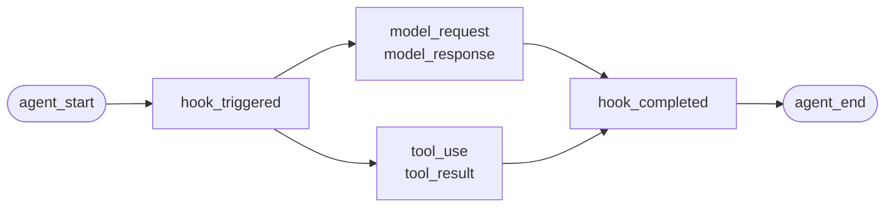

Your agent already produces everything worth recording — model calls, tool calls, node boundaries, human waits, failures. The framework throws it away. The SDK keeps it.

<Columns cols={3}>
  <Card title="LangChain and LangGraph" icon="share-2" href="/start/integrations/langchain">
    Graphs, nodes, tools, retrievers, models, `interrupt()` pauses.
  </Card>
  <Card title="CrewAI" icon="users" href="/start/integrations/crewai">
    Crews, flows, agents by role, tools, memory, human feedback.
  </Card>
  <Card title="LlamaIndex" icon="database" href="/start/integrations/llamaindex">
    Workflows, steps, function agents, retrievers.
  </Card>
  <Card title="Pydantic AI" icon="badge-check" href="/start/integrations/pydantic-ai">
    Typed agents, capabilities, tools, retries.
  </Card>
  <Card title="Custom agents" icon="wrench" href="/start/integrations/custom-agents">
    No framework, or one not listed here.
  </Card>
  <Card title="How it works" icon="workflow" href="/start/integrations/how-it-works">
    The data model, the ids, and how events reach Cloud.
  </Card>
</Columns>

## Three lines, whichever framework

<CodeGroup>
```bash LangGraph
pip install 'failproofai-sdk[langgraph]'
```

```bash CrewAI
pip install 'failproofai-sdk[crewai]'
```

```bash LlamaIndex
pip install 'failproofai-sdk[llamaindex]'
```

```bash Pydantic AI
pip install 'failproofai-sdk[pydantic-ai]'
```

```bash No framework
pip install failproofai-sdk
```
</CodeGroup>

```python
import failproofai_sdk

failproofai_sdk.configure(environment="production")
failproofai_sdk.instrument()          # detects the frameworks you imported

with failproofai_sdk.session():
    ...                               # your existing agent call, unchanged
```

No decorators on your functions, no callback passed to your calls, no ids threaded through your code. Only the call inside the session differs:

<Tabs>
  <Tab title="LangGraph">
    ```python
    graph.invoke({"messages": [HumanMessage("...")]})
    ```
  </Tab>
  <Tab title="CrewAI">
    ```python
    Crew(agents=[analyst, writer], tasks=[gather, summarise]).kickoff()
    ```
  </Tab>
  <Tab title="LlamaIndex">
    ```python
    await agent.run("...")        # under `async with failproofai_sdk.session():`
    ```
  </Tab>
  <Tab title="Pydantic AI">
    ```python
    agent.run_sync("...")
    ```
  </Tab>
  <Tab title="No framework">
    ```python
    with failproofai_sdk.agent("planner"):
        with failproofai_sdk.tool_call("search", input={"q": q}) as t:
            t.output = search(q)
    ```
  </Tab>
</Tabs>

The extra installs the **framework**. Every adapter ships in the base wheel, so a project that already has its framework needs no extra at all.

## What you get back

Every recording has the same shape: a span opens, work nests inside it, and each opening event gets a closing one.



The **pair** is the unit. Each closing event carries a duration the SDK measures from its opening one.

Below is one real run per framework — captured from the examples that ship with the SDK, model name normalised. Note how much comes back from a single call.

<Tabs>
  <Tab title="LangGraph">
    ```text 14 events
     1  +0.000s  agent_start       LangGraph
     2  +0.001s    hook_triggered  agent
     3  +0.002s      model_request   gpt-4o-mini
     4  +3.023s      model_response  gpt-4o-mini · 21 out-tok
     5  +3.024s    hook_completed  agent
     6  +3.024s    hook_triggered  tools
     7  +3.025s      tool_use      word_count
     8  +3.025s      tool_result   word_count · ok
     9  +3.025s    hook_completed  tools
    10  +3.026s    hook_triggered  agent
    11  +3.027s      model_request   gpt-4o-mini
    12  +5.717s      model_response  gpt-4o-mini · 5 out-tok
    13  +5.720s    hook_completed  agent
    14  +5.721s  agent_end         LangGraph · success
    ```

    Nodes become hook pairs, so you get per-node latency without them crowding the agent list.
  </Tab>

  <Tab title="CrewAI">
    ```text 10 events
     1  +0.000s  agent_start       crew
     2  +0.050s    agent_start     analyst · under crew
     3  +0.057s      model_request   gpt-4o-mini
     4  +3.475s      model_response  gpt-4o-mini · 19 out-tok
     5  +3.478s      tool_use      lookup_metric
     6  +3.478s      tool_result   lookup_metric · ok
     7  +3.486s      model_request   gpt-4o-mini
     8  +5.694s      model_response  gpt-4o-mini · 9 out-tok
     9  +5.727s    agent_end       analyst · success
    10  +5.739s  agent_end         crew · success
    ```

    Each agent's `role` becomes its span name, so latency and token spend break down per role.
  </Tab>

  <Tab title="LlamaIndex">
    ```text 26 events
     1  +0.000s  agent_start       Agent
     2  +0.001s    hook_triggered  init_run
     4  +0.501s    hook_triggered  setup_agent
     6  +0.503s    hook_triggered  run_agent_step
     7  +0.505s      model_request   gpt-4o-mini
     8  +3.083s      model_response  gpt-4o-mini · 18 out-tok
    10  +3.197s    hook_triggered  parse_agent_output
    12  +3.355s    hook_triggered  call_tool
    13  +3.355s      tool_use      city_population
    14  +3.355s      tool_result   city_population · ok
    16  +3.356s    hook_triggered  aggregate_tool_results
       ...                        second iteration
    26  +7.038s  agent_end         Agent · success
    ```

    The agent loop itself is visible, not only its model calls.
  </Tab>

  <Tab title="Pydantic AI">
    ```text 8 events
    1  +0.000s  agent_start       agent
    2  +0.001s    model_request   gpt-4o-mini
    3  +4.413s    model_response  gpt-4o-mini · 17 out-tok
    4  +4.415s    tool_use        population
    5  +4.415s    tool_result     population · ok
    6  +4.416s    model_request   gpt-4o-mini
    7  +8.118s    model_response  gpt-4o-mini · 6 out-tok
    8  +8.119s  agent_end         agent · success
    ```

    No hook pairs: Pydantic AI has no node or step boundary to bracket.
  </Tab>

  <Tab title="No framework">
    ```text 6 events
    1  +0.000s  agent_start       main
    2  +0.000s    tool_use        population
    3  +0.000s    tool_result     population · ok
    4  +0.000s    model_request   gpt-4o-mini
    5  +0.000s    model_response  gpt-4o-mini · 3 out-tok
    6  +0.000s  agent_end         main · success
    ```

    You emit these yourself. Same event types, same fidelity — it costs you the call sites.
  </Tab>
</Tabs>

## The event types

| Group | Events |
| --- | --- |
| Agents | `agent_start`, `agent_end`, `agent_pause`, `agent_resume` |
| Models | `model_request`, `model_response` |
| Tools | `tool_use`, `tool_result` |
| Hooks | `hook_triggered`, `hook_completed` |
| Humans | `human_wait`, `human_input`, `human_pause`, `human_interrupt` |
| Failures | `error` |

Which framework records what, measured from the runs above:

| Event | LangGraph | CrewAI | LlamaIndex | Pydantic AI | Custom |
| --- | :--: | :--: | :--: | :--: | :--: |
| Agent start and end | Yes | Yes | Yes | Yes | You |
| Model request and response | Yes | Yes | Yes | Yes | You |
| Tool use and result | Yes | Yes | Yes | Yes | You |
| Hook triggered and completed | Node | Task | Step | — | You |
| Error | Yes | Yes | Yes | Yes | Automatic |
| Human wait and input | Yes | Yes | Yes | — | You |
| Agent pause and resume | Yes | Yes | Yes | — | You |

A dash means the framework has no such concept. `human_pause` and `human_interrupt` describe a *person* acting on the agent, which no framework signals — emit those yourself.

## Check it arrived

Run one instrumented session, then open **Observe → Sessions** and select your environment. The run appears as a reconstructed trace.

If nothing arrives, confirm the machine is connected with `failproofai config --status`. See [Set up capture](/start/setup).

<Warning>
  Do not check the spool directory to confirm delivery. The Failproof daemon collects and deletes each batch within milliseconds, so reading it races the collector and shows far fewer events than were emitted.
</Warning>

## Next

<Columns cols={3}>
  <Card title="How it works" icon="workflow" href="/start/integrations/how-it-works">
    Pairs, ids, session lifecycle, and delivery.
  </Card>
  <Card title="Read a trace" icon="route" href="/sessions/read-a-trace">
    Follow causality through a session instead of disconnected logs.
  </Card>
  <Card title="Find your first failure" icon="scan-search" href="/start/first-audit">
    Audit the sessions you just captured.
  </Card>
</Columns>
