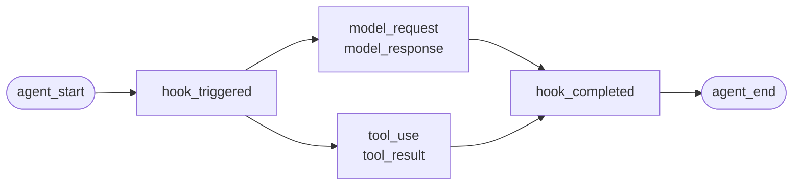
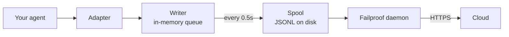

For an agent you wrote yourself, or a framework Failproof AI has no adapter for. There is nothing to instrument: you emit the events.

This is the same API the four framework adapters call underneath. They are translation tables over it.

## Install

```bash
pip install failproofai-sdk
```

No extras, and no dependencies.

## Instrument

```python
import failproofai_sdk

failproofai_sdk.configure(environment="production")

with failproofai_sdk.session():                 # one run
    with failproofai_sdk.agent("planner"):      # one unit of work
        with failproofai_sdk.tool_call("search", input={"q": q}) as t:
            t.output = search(q)                # one tool call
```

Read it top to bottom and it says what it means:

| Wrap it in | To say |
| --- | --- |
| `session()` | These events belong to the same run |
| `agent()` | Something is doing work — give it a name you would recognise in a list |
| `tool_call()` | This is one tool, and here is what it returned |

And what each one actually emits:

| Scope | Emits | Purpose |
| --- | --- | --- |
| `session()` | Nothing | Binds a session id, grouping one run |
| `agent()` | `agent_start`, `agent_end` | Brackets a unit of work |
| `tool_call()` | `tool_use`, `tool_result` | Brackets one tool and measures it |

Everything inside can omit `session_id` and `agent_id`. The scopes bind identity on context variables and every event call reads it back, so you never thread ids through your functions.

All three work under `async with` as well as `with`.

Nesting agents builds the tree. `parent_id` and depth are computed from the stack:

```python
with failproofai_sdk.session():
    with failproofai_sdk.agent("supervisor"):
        with failproofai_sdk.agent("researcher"):    # parent_id = "supervisor"
            ...
```

## How a scope closes

`agent()` handles exceptions for you:

| What happened | Events | Outcome |
| --- | --- | --- |
| Nothing raised | `agent_end` | `success` |
| `Exception` | `error`, then `agent_end` | `failed` |
| `KeyboardInterrupt`, `SystemExit` | `error`, then `agent_end` | `failed` |
| `CancelledError`, `GeneratorExit` | `agent_end` only | `cancelled` |

The error is emitted before `agent_end`, because the dashboard closes the span at `agent_end` and anything after it is attributed to nothing. A cancellation is not a failure, so cancelled runs do not pollute the errors surface. The exception is always re-raised: a scope never swallows.

## The event methods

Fifteen methods in six families. Most come in pairs — you emit the opener, then the closer, and the SDK measures the span between them.

| Family | Opens | Closes | Standalone |
| --- | --- | --- | --- |
| **Agents** | `agent_start` | `agent_end` | — |
| | `agent_pause` | `agent_resume` | — |
| **Models** | `model_request` | `model_response` | — |
| **Tools** | `tool_use` | `tool_result` | — |
| **Hooks** | `hook_triggered` | `hook_completed` | — |
| **Humans** | `human_wait` | `human_input` | `human_pause`, `human_interrupt` |
| **Failures** | — | — | `error` |

<Tip>
  Prefer the scopes — `agent()` and `tool_call()` — wherever they fit. They guarantee the closing event even when the body raises. Reach for these methods directly when your control flow doesn't nest, such as a model call inside a helper.
</Tip>

<CodeGroup>
```python Agents
failproofai_sdk.event.agent_start(agent_id="planner", goal="find the cheapest flight")
failproofai_sdk.event.agent_end(agent_id="planner", outcome="success", summary="...")
failproofai_sdk.event.agent_pause(pause_id="p1", reason="awaiting approval")
failproofai_sdk.event.agent_resume(pause_id="p1")
```

```python Models
failproofai_sdk.event.model_request(
    model="gpt-4o-mini",
    messages=[{"role": "user", "content": "..."}],
    request_id="req-1",
)
failproofai_sdk.event.model_response(
    model="gpt-4o-mini",
    content="...",
    input_tokens=139,
    output_tokens=21,
    request_id="req-1",
    duration_ms=5202,
)
```

```python Tools
failproofai_sdk.event.tool_use(tool_name="search", tool_call_id="c1", input={"q": "..."})
failproofai_sdk.event.tool_result(tool_name="search", tool_call_id="c1", output="...")
```

```python Hooks
failproofai_sdk.event.hook_triggered(hook_name="retrieve", hook_id="h1", trigger_event="node")
failproofai_sdk.event.hook_completed(hook_name="retrieve", hook_id="h1", outcome="success")
```

```python Humans
failproofai_sdk.event.human_wait(input_id="i1", prompt="Approve?", options=["yes", "no"])
failproofai_sdk.event.human_input(input_id="i1", response="yes")
failproofai_sdk.event.human_pause(reason="operator paused the run", user_id="dana")
failproofai_sdk.event.human_interrupt(reason="operator stopped the run", at_step="step_3")
```

```python Failures
failproofai_sdk.event.error(
    error_type="TimeoutError",
    message="provider timed out after 30s",
    traceback="...",
)
```
</CodeGroup>

<Note>
  **The two human families point in opposite directions.**

  | Methods | Meaning |
  | --- | --- |
  | `human_wait` / `human_input` | The **agent asked a person** — an approval gate, a clarifying question |
  | `human_pause` / `human_interrupt` | A **person acted on the agent** — a stop button, an operator pause |

  No framework signals the second pair, so it is always yours to emit.
</Note>

<Warning>
  **Pass `request_id` when model calls run concurrently.** Without it, requests and responses pair in arrival order per agent — and concurrent calls mispair, attaching each response to the wrong request.
</Warning>

## Example

A tool-calling loop against the OpenAI API, with no agent framework:

```python
import json

import failproofai_sdk
from openai import OpenAI

failproofai_sdk.configure(environment="production")
client = OpenAI()
MODEL = "gpt-4o-mini"


def turn(messages: list):
    """One model call, bracketed by the pair."""
    failproofai_sdk.event.model_request(model=MODEL, messages=messages)
    reply = client.chat.completions.create(model=MODEL, messages=messages, tools=TOOLS)
    usage = reply.usage
    failproofai_sdk.event.model_response(
        model=MODEL,
        content=reply.choices[0].message.content or "",
        input_tokens=usage.prompt_tokens,
        output_tokens=usage.completion_tokens,
    )
    return reply.choices[0].message


with failproofai_sdk.session():
    with failproofai_sdk.agent("inventory", goal="price report"):
        for _ in range(4):          # bounded; an unbounded agent loop is its own bug
            message = turn(messages)
            if not message.tool_calls:
                break
            messages.append(message.model_dump(exclude_none=True))
            for call in message.tool_calls:
                args = json.loads(call.function.arguments or "{}")
                with failproofai_sdk.tool_call(
                    call.function.name, tool_call_id=call.id, input=args
                ) as handle:
                    handle.output = run_tool(call.function.name, args)
                messages.append({
                    "role": "tool",
                    "tool_call_id": call.id,
                    "content": str(handle.output),
                })
```

That produces the same six event types an adapter would give you. The complete
runnable version, with the tool definitions, ships in the SDK repository under
`docs/manual/examples/`.

## Threads and async

Context variables propagate into asyncio tasks automatically. They do not propagate into new threads, because a thread starts with an empty context.

```python
# asyncio: nothing to do
async with failproofai_sdk.session():
    await asyncio.gather(worker(1), worker(2))

# threads: wrap the callable
pool.submit(failproofai_sdk.propagate(work), x)
threading.Thread(target=failproofai_sdk.propagate(work)).start()
loop.run_in_executor(None, failproofai_sdk.propagate(work), x)
```

Without `propagate()`, the worker's events raise a `TypeError` naming the fix rather than landing on no session. That is deliberate: an event with no session is skipped by ingest and answered `200`, which is the silent failure the identity layer exists to prevent.

## Instrument a framework without an adapter

Every agent framework gives you the same three seams. Map them and you have a complete trace — the four shipped adapters do nothing more than this.

| The seam | What you write | What lands |
| --- | --- | --- |
| The run | `session()` + `agent()` | `agent_start`, `agent_end` |
| Each tool | `tool_call()` | `tool_use`, `tool_result` |
| Each model call | The `model_*` pair | `model_request`, `model_response` |

<Steps>
  <Step title="Bracket the run">
    ```python
    with failproofai_sdk.session():
        with failproofai_sdk.agent(agent_name, goal=task):
            result = framework.run(task)
    ```
  </Step>
  <Step title="Bracket each tool">
    In whatever the framework calls a tool wrapper or middleware.

    ```python
    with failproofai_sdk.tool_call(name, input=args) as call:
        call.output = original(**args)
    ```
  </Step>
  <Step title="Pair each model call">
    ```python
    failproofai_sdk.event.model_request(model=model, messages=messages)
    reply = provider.complete(...)
    failproofai_sdk.event.model_response(
        model=model,
        content=text,
        input_tokens=usage.prompt_tokens,
        output_tokens=usage.completion_tokens,
    )
    ```
  </Step>
</Steps>

<Tip>
  **Got a node, step or middleware boundary worth seeing?** Wrap it in a hook pair — `hook_triggered` / `hook_completed` — not a nested `agent()`. `agent_id` is a low-cardinality facet, and one entry per node drowns it. Hook spans render the same way and give you per-node latency.
</Tip>

<Note>
  **Manual and automatic compose.** An adapter running inside a hand-written scope joins that session and parents to that agent, so you get one tree rather than two — useful when you instrument one framework yourself alongside a supported one.
</Note>

<Accordion title="Why there is no AutoGen adapter">
  Two reasons, and the three seams above are the answer to both:

  - `autogen-core` has been unmaintained since September 2025.
  - AG2 exposes no process-wide registration point equivalent to the other frameworks' hooks, so instrumenting it means wrapping every agent at every construction site.

  Mapping the seams by hand records the same events, at the same fidelity, as a shipped adapter would.
</Accordion>

## Going deeper

How the recording actually works. None of it is needed to get started.

<AccordionGroup>

<Accordion title="What a recording looks like, per framework" icon="eye">

Every recording has the same shape: a span opens, work nests inside it, and each opening event gets a closing one.



The **pair** is the unit. Each closing event carries a duration the SDK measures from its opening one.

Below is one real run per framework — captured from the examples that ship with the SDK, model name normalised. Note how much comes back from a single call.

<Tabs>
  <Tab title="LangGraph">
    ```text 14 events
     1  +0.000s  agent_start       LangGraph
     2  +0.001s    hook_triggered  agent
     3  +0.002s      model_request   gpt-4o-mini
     4  +3.023s      model_response  gpt-4o-mini · 21 out-tok
     5  +3.024s    hook_completed  agent
     6  +3.024s    hook_triggered  tools
     7  +3.025s      tool_use      word_count
     8  +3.025s      tool_result   word_count · ok
     9  +3.025s    hook_completed  tools
    10  +3.026s    hook_triggered  agent
    11  +3.027s      model_request   gpt-4o-mini
    12  +5.717s      model_response  gpt-4o-mini · 5 out-tok
    13  +5.720s    hook_completed  agent
    14  +5.721s  agent_end         LangGraph · success
    ```

    Nodes become hook pairs, so you get per-node latency without them crowding the agent list.
  </Tab>

  <Tab title="CrewAI">
    ```text 10 events
     1  +0.000s  agent_start       crew
     2  +0.050s    agent_start     analyst · under crew
     3  +0.057s      model_request   gpt-4o-mini
     4  +3.475s      model_response  gpt-4o-mini · 19 out-tok
     5  +3.478s      tool_use      lookup_metric
     6  +3.478s      tool_result   lookup_metric · ok
     7  +3.486s      model_request   gpt-4o-mini
     8  +5.694s      model_response  gpt-4o-mini · 9 out-tok
     9  +5.727s    agent_end       analyst · success
    10  +5.739s  agent_end         crew · success
    ```

    Each agent's `role` becomes its span name, so latency and token spend break down per role.
  </Tab>

  <Tab title="LlamaIndex">
    ```text 26 events
     1  +0.000s  agent_start       Agent
     2  +0.001s    hook_triggered  init_run
     4  +0.501s    hook_triggered  setup_agent
     6  +0.503s    hook_triggered  run_agent_step
     7  +0.505s      model_request   gpt-4o-mini
     8  +3.083s      model_response  gpt-4o-mini · 18 out-tok
    10  +3.197s    hook_triggered  parse_agent_output
    12  +3.355s    hook_triggered  call_tool
    13  +3.355s      tool_use      city_population
    14  +3.355s      tool_result   city_population · ok
    16  +3.356s    hook_triggered  aggregate_tool_results
       ...                        second iteration
    26  +7.038s  agent_end         Agent · success
    ```

    The agent loop itself is visible, not only its model calls.
  </Tab>

  <Tab title="Pydantic AI">
    ```text 8 events
    1  +0.000s  agent_start       agent
    2  +0.001s    model_request   gpt-4o-mini
    3  +4.413s    model_response  gpt-4o-mini · 17 out-tok
    4  +4.415s    tool_use        population
    5  +4.415s    tool_result     population · ok
    6  +4.416s    model_request   gpt-4o-mini
    7  +8.118s    model_response  gpt-4o-mini · 6 out-tok
    8  +8.119s  agent_end         agent · success
    ```

    No hook pairs: Pydantic AI has no node or step boundary to bracket.
  </Tab>

  <Tab title="Custom agents">
    ```text 6 events
    1  +0.000s  agent_start       main
    2  +0.000s    tool_use        population
    3  +0.000s    tool_result     population · ok
    4  +0.000s    model_request   gpt-4o-mini
    5  +0.000s    model_response  gpt-4o-mini · 3 out-tok
    6  +0.000s  agent_end         main · success
    ```

    You emit these yourself. Same event types, same fidelity — it costs you the call sites.
  </Tab>
</Tabs>

</Accordion>

<Accordion title="How a session starts and ends" icon="circle-play">

**There is no session-end event.** A session is not something you close — it is a group of events sharing a `session_id`.

Status is derived from the shape of the trace:

| Status | When |
| --- | --- |
| `ongoing` | At least one span is still open |
| `paused` | An `agent_pause` has no matching `agent_resume` |
| `error` | Nothing is open, and at least one event failed |
| `done` | Nothing is open, and nothing failed |

So a session ends when every pair is closed. The adapters emit `agent_end` for you, and on teardown they close anything still open and mark it incomplete — a crashed run settles as `done` with a visible gap rather than hanging.

<Note>
  This is why a session can span two calls. A LangGraph `interrupt()` pauses the run, the root span deliberately stays open, and the resuming call closes it. Both calls are one session.
</Note>

</Accordion>

<Accordion title="Identity: session_id, agent_id, and who mints them" icon="fingerprint">

`session_id` and `agent_id` are optional on every event method. Omitted, they resolve from the enclosing scope:

```python
with failproofai_sdk.session():
    with failproofai_sdk.agent("planner"):
        failproofai_sdk.event.tool_use(tool_name="search", tool_call_id="c1")
```

Passing them explicitly still works and takes precedence. With nothing bound and nothing passed, the call raises a `TypeError` naming the fix rather than emitting an event with no session, which ingest would skip while answering `200`.

Scopes bind identity on context variables. Those propagate into asyncio tasks automatically but not into new threads — wrap a worker in `failproofai_sdk.propagate()`.

#### Who mints which id

| Id | Minted by | Notes |
| --- | --- | --- |
| `session_id` | You, or the SDK | `session("chat-42")` is used verbatim; omitted, the SDK generates a `uuid4().hex` |
| `agent_id` | You, or the framework | From `agent("analyst")`, a CrewAI `role`, a `FunctionAgent.name`. A UUID-looking value is refused and replaced |
| `tool_call_id`, `hook_id`, `request_id` | You, or the framework | Adapters reuse the framework's own run ids, which is why pairs survive thread hops |
| **Event id** | **Cloud, at ingest** | The SDK emits none |
| **`dedup_key`** | **Cloud, at ingest** | A hash of org, session, timestamp, type and payload. This is the real identity — it makes a retried batch collapse instead of duplicating |

#### How adapters resolve `session_id`

First match wins:

1. An explicit `session_id` option
2. Per-call metadata
3. The enclosing `session()` scope
4. Framework metadata
5. The framework's own run id

It is never invented while one of those exists — a synthesized id would split one run across several sessions.

#### Keep `agent_id` low cardinality

It is the primary facet on every dashboard surface, and a `LowCardinality(String)` column. A per-run value degrades the column and fills the filter dropdown with one entry per run.

Adapters defend that column for you:

| The framework hands over | Recorded as | Why |
| --- | --- | --- |
| `3f9a1c2b-…` (a UUID) | `main` | Nothing readable to keep |
| A long bare hex string | `main` | Same |
| `agent-3f9a1c2b-…` | `agent` | Per-run id stripped, readable part kept |
| `agent-v2` | `agent-v2` | Short segments are left alone |
| `step-3` | `step-3` | Same |

The real id is kept on `fw_agent_id` / `fw_run_id`, where it stays queryable without being a facet.

<Warning>
  **This guard only touches labels the *framework* chose.** An `agent_id` you pass yourself — to `event.*`, or to `failproofai_sdk.agent(...)` — is recorded exactly as given. Silently rewriting an explicit argument would be worse than the cardinality it prevents, so name your own spans accordingly.
</Warning>

</Accordion>

<Accordion title="Event types, grouped — and which framework records what" icon="table">

| Group | Events |
| --- | --- |
| Agents | `agent_start`, `agent_end`, `agent_pause`, `agent_resume` |
| Models | `model_request`, `model_response` |
| Tools | `tool_use`, `tool_result` |
| Hooks | `hook_triggered`, `hook_completed` |
| Humans | `human_wait`, `human_input`, `human_pause`, `human_interrupt` |
| Failures | `error` |

Which framework records what, measured from the runs above:

| Event | LangGraph | CrewAI | LlamaIndex | Pydantic AI | Custom |
| --- | :--: | :--: | :--: | :--: | :--: |
| Agent start and end | Yes | Yes | Yes | Yes | You |
| Model request and response | Yes | Yes | Yes | Yes | You |
| Tool use and result | Yes | Yes | Yes | Yes | You |
| Hook triggered and completed | Node | Task | Step | — | You |
| Error | Yes | Yes | Yes | Yes | Automatic |
| Human wait and input | Yes | Yes | Yes | — | You |
| Agent pause and resume | Yes | Yes | Yes | — | You |

A dash means the framework has no such concept. `human_pause` and `human_interrupt` describe a *person* acting on the agent, which no framework signals — emit those yourself.

</Accordion>

<Accordion title="Pairs, correlation and duration" icon="link">

An event never arrives alone. One opens a span, one closes it, and the closing event carries a duration the SDK measures from the opening one.

| Opens | Closes | The closing event carries |
| --- | --- | --- |
| `agent_start` | `agent_end` | `outcome`, `summary` |
| `model_request` | `model_response` | tokens, `stop_reason`, latency |
| `tool_use` | `tool_result` | `output` or `error`, duration |
| `hook_triggered` | `hook_completed` | `outcome`, duration |
| `agent_pause` | `agent_resume` | how long the pause lasted |
| `human_wait` | `human_input` | the answer, and how long the person took |

<Warning>
  An opening event with no closing one is a span that never finishes. The session renders as still running, forever, and its active duration keeps growing. This is the failure mode to watch for when you instrument by hand.
</Warning>

#### Correlation rules

- Reuse the same `tool_call_id`, `hook_id`, `pause_id`, or `input_id` for the matching completion event.
- The SDK computes `duration_ms` for `tool_result`, `hook_completed`, `agent_resume`, and `human_input`. Passing it to those methods raises `ValueError`.
- `duration_ms` **is** accepted on `model_response`, because only the caller knows the real provider latency. It must be an integer — a float raises `ValueError` at the call site, because the server reads the column as an unsigned 32-bit integer and would store NULL for anything else.
- Correlation keys are scoped by kind and session, so a tool call and a hook may safely share an id, and two concurrent sessions may reuse the same ids without colliding. They are not scoped by agent: a pair opened under one agent and closed under another still correlates, which is the ordinary case in multi-agent frameworks.
- `request_id` pairs `model_request` with `model_response`. Without it, model events pair in order per agent, so concurrent calls mispair.
- A pair split across processes still correlates downstream, but the SDK cannot compute its in-process duration.
- The pending map holds at most 10,000 starts and evicts the oldest entry when full.

</Accordion>

<Accordion title="What is in the package, and how instrument() finds your framework" icon="box">

Installing `failproofai-sdk` installs everything, all four adapters included. The extras pull in the **framework**, not the adapter.

```python
import failproofai_sdk        # loads nothing outside the standard library
failproofai_sdk.instrument()  # imports only the adapters you actually need
```

`import failproofai_sdk` is contractually zero-dependency, enforced by a test that installs the built wheel with `--no-deps` and another that proves no framework reaches `sys.modules`.

<Warning>
  There is no `failproofai_sdk.crewai` attribute. Adapters are deliberately not exposed on the top-level package: touching one would import the framework as a side effect of an attribute access, breaking the zero-dependency promise. Use `instrument()`.
</Warning>

```python
failproofai_sdk.instrument()              # every framework already imported
failproofai_sdk.instrument("crewai")      # exactly one, by name
failproofai_sdk.uninstrument("crewai")    # put it back
```

| Name | Also accepts |
| --- | --- |
| `langchain` | `langgraph`, `langchain_core` |
| `crewai` | — |
| `llama_index` | `llamaindex`, `llama-index` |
| `pydantic_ai` | `pydantic-ai`, `pydanticai` |

Auto-detection reads `sys.modules`, not the installed package list, so a framework you have installed but never imported is not instrumented and is never imported on your behalf. To see what is wired up:

```python
from failproofai_sdk.integrations import active, available

available()   # ('crewai', 'langchain', 'llama_index', 'pydantic_ai')
active()      # ('langchain',)
```

<Note>
  **`instrument("crewai")` on a machine without CrewAI does not raise.** It logs a warning and returns `()`, so one missing framework never takes down a process that also instruments others.

  The warning carries the underlying `ImportError`, and that message names the exact install command — so the fix is in your logs, not hidden.

  ```text
  ImportError: failproofai_sdk: cannot instrument 'crewai' because 'crewai.events'
  is not importable. Install it with:  pip install 'failproofai_sdk[crewai]'
  ```

  Set `FAILPROOFAI_SDK_STRICT=1` to have it raise instead. That flag is read **once and cached**, so export it before your process starts rather than setting it mid-run.
</Note>

<Warning>
  **`instrument()` must come *after* your framework import.** Auto-detection reads `sys.modules`, so a bare call above the import finds nothing, installs nothing, and returns `()`.
</Warning>

<CodeGroup>
```python Wrong
import failproofai_sdk
failproofai_sdk.instrument()   # sys.modules has no langchain yet -> ()

import langchain               # too late, nothing is wired
```

```python Right
import langchain               # import the framework first
import failproofai_sdk

failproofai_sdk.instrument()   # finds it -> ('langchain',)
```

```python Right, order-proof
import failproofai_sdk

# Naming it imports the adapter on request, so this works from anywhere.
failproofai_sdk.instrument("langchain")
```
</CodeGroup>

Get this wrong and the process runs with the SDK imported, the adapter apparently installed, and **not one event emitted**. It logs a warning saying exactly that — so check your logs first when a run records nothing.

</Accordion>

<Accordion title="How events reach Cloud" icon="cloud-upload">



| Stage | Job | Runs in |
| --- | --- | --- |
| Adapter | Translates a framework callback into one of 15 event types | Your process |
| Writer | Queues, batches, writes JSONL atomically | Your process, background thread |
| Spool | Durable handoff, survives your process exiting | Local disk |
| Daemon | Watches the spool, ships batches, deletes what it shipped | Your machine |
| Ingest | Assigns a row id and dedup key, promotes queryable columns | Cloud |

The spool is what makes this safe: your agent never blocks on the network, and a Cloud outage means a growing directory rather than lost events.

Each flush writes one batch file, `.tmp` first, then `fsync`, then an atomic rename:

```text
~/.failproofai/custom-agents/events/
  event-2026-08-20T10-15-00-123Z-48213-0.jsonl
```

The daemon only picks up `.jsonl`, so it can never read a half-written file. The stem carries a timestamp, process id and sequence number, so two processes flushing in the same millisecond cannot collide. The queue is capped at 10,000 events; past that it drops the oldest and logs.

<Warning>
  **`collector.redact` does not apply to your SDK events.** It never sees them.
</Warning>

The daemon **ships** your batches. It does not open or rewrite them.

| Events | Written by | Redacted by `collector.redact`? |
| --- | --- | --- |
| CLI session transcripts | The daemon | Yes |
| Hook activity | The daemon | Yes |
| **Everything the SDK emits** | **Your process** | **No** |

Redaction runs where the daemon *writes* its own events — not where batches are *shipped*. So a prompt or a tool argument holding an API key still holds it on arrival.

That is deliberate. These are your own instrumentation calls, and rewriting them in transit would mean the events you receive are not the events you emitted.

<Tip>
  **You control payloads at the source, in two places:**

  - Turn off content capture on the adapter. **The option name differs, and one adapter has none** — this is not a single universal switch:
    - LangChain / LangGraph, Pydantic AI — `capture_content=False`
    - LlamaIndex — `capture_messages=False`
    - CrewAI — **no content switch at all**; `session_id` is the only option it reads, so prompts and completions are always recorded.

    `instrument()` drops options an adapter does not read, so passing the wrong name raises nothing and changes nothing.
  - Don't hand the secret to `input=` in the first place.

  `collector.redact` is not a substitute for either.
</Tip>

<Warning>
  **An empty spool directory is the healthy state.** Don't use it to check delivery.
</Warning>

The daemon deletes each batch within milliseconds of shipping it, so an `ls` races the collector and shows a fraction of what you emitted — indistinguishable from an SDK that recorded nothing.

To confirm events actually landed, check the dashboard. To watch the spool fill up, stop the daemon first.

</Accordion>

<Accordion title="When instrumentation fails" icon="triangle-alert">

Every callback runs inside a wrapper whose only job is to re-raise, so your call sits in exactly one `try` and everything the SDK does happens outside it.

| What happens | Result |
| --- | --- |
| A hook raises | Logged once with its traceback. Your call is unaffected |
| The same hook raises three times | That one hook is disabled for the rest of the process, with one error line |
| `FAILPROOFAI_SDK_STRICT=1` is set | The exception is re-raised instead |
| A framework version is outside the tested range | Warns once, instruments anyway |
| A single capability is missing | That one hook is disabled, never the whole adapter |

The default is right in production and wrong while debugging, because it can only ever prove "it did not crash". Set `FAILPROOFAI_SDK_STRICT=1` to make a swallowed failure loud.

</Accordion>

</AccordionGroup>

## Common problems

<AccordionGroup>
  <Accordion title="A span never finishes">
    An opening event has no closing one: a `model_request` with no `model_response`, or a `tool_use` with no `tool_result`. Use the scopes, which guarantee the pair even when the body raises. If you call the event methods directly, use `try` and `finally`.
  </Accordion>

  <Accordion title="Passing duration_ms raises a ValueError">
    It is measured from the matching opening event, so it is rejected on `tool_result`, `hook_completed`, `agent_resume`, and `human_input`. It is accepted on `model_response`, because only you know the real provider latency, and it must be an integer.
  </Accordion>

  <Accordion title="Events from a worker thread raise a TypeError">
    The thread never inherited the context. Wrap the callable in `failproofai_sdk.propagate()`. See [Threads and async](#threads-and-async).
  </Accordion>

  <Accordion title="An extra field disappeared or overwrote something">
    Extra fields merge last, so one named like a real field such as `model` or `outcome` would overwrite it and change a stored column. Namespace yours; the adapters use an `fw_` prefix.
  </Accordion>

  <Accordion title="The agent filter has thousands of entries">
    `agent_id` is a low-cardinality facet and you put a run id in it. Use a role or node name and put the real id in a payload field.
  </Accordion>
</AccordionGroup>

## Next

<Columns cols={3}>
  <Card title="How it works" icon="workflow" href="/reference/python-sdk">
    Pairs, ids, session lifecycle, and delivery.
  </Card>
  <Card title="Read a trace" icon="route" href="/sessions/read-a-trace">
    Follow causality through the session you just captured.
  </Card>
  <Card title="Framework adapters" icon="plug" href="/start/integrations">
    LangGraph, CrewAI, LlamaIndex, and Pydantic AI.
  </Card>
</Columns>
