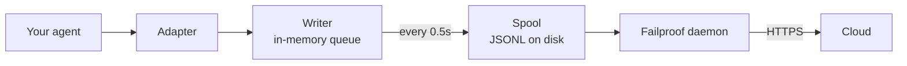

Read this once and the framework pages become obvious.

## Everything is pairs

An event never arrives alone. One opens a span, one closes it, and the closing event carries a duration the SDK measures from the opening one.

| Opens | Closes | The closing event carries |
| --- | --- | --- |
| `agent_start` | `agent_end` | `outcome`, `summary` |
| `model_request` | `model_response` | tokens, `stop_reason`, latency |
| `tool_use` | `tool_result` | `output` or `error`, duration |
| `hook_triggered` | `hook_completed` | `outcome`, duration |
| `agent_pause` | `agent_resume` | how long the pause lasted |
| `human_wait` | `human_input` | the answer, and how long the person took |

Because the SDK measures those durations itself, passing `duration_ms` to a closing event raises a `ValueError`. The exception is `model_response`, where only you know the real provider latency.

<Warning>
  An opening event with no closing one is a span that never finishes. The session renders as still running, forever, and its active duration keeps growing. This is the failure mode to watch for when you instrument by hand.
</Warning>

## How a session ends

**There is no session-end event.** A session is not something you close — it is a group of events sharing a `session_id`.

Status is derived from the shape of the trace:

| Status | When |
| --- | --- |
| `ongoing` | At least one span is still open |
| `paused` | An `agent_pause` has no matching `agent_resume` |
| `error` | Nothing is open, and at least one event failed |
| `done` | Nothing is open, and nothing failed |

So a session ends when every pair is closed. The adapters emit `agent_end` for you, and on teardown they close anything still open and mark it incomplete — a crashed run settles as `done` with a visible gap rather than hanging.

<Note>
  This is why a session can span two calls. A LangGraph `interrupt()` pauses the run, the root span deliberately stays open, and the resuming call closes it. Both calls are one session.
</Note>

## Who mints which id

| Id | Minted by | Notes |
| --- | --- | --- |
| `session_id` | You, or the SDK | `session("chat-42")` is used verbatim; omitted, the SDK generates a `uuid4().hex` |
| `agent_id` | You, or the framework | From `agent("analyst")`, a CrewAI `role`, a `FunctionAgent.name`. A UUID-looking value is refused and replaced |
| `tool_call_id`, `hook_id`, `request_id` | You, or the framework | Adapters reuse the framework's own run ids, which is why pairs survive thread hops |
| **Event id** | **Cloud, at ingest** | The SDK emits none |
| **`dedup_key`** | **Cloud, at ingest** | A hash of org, session, timestamp, type and payload. This is the real identity — it makes a retried batch collapse instead of duplicating |

Adapters resolve `session_id` in a defined order — an explicit option, then per-call metadata, then the enclosing scope, then framework metadata, then the framework's own run id. It is never invented when one of those exists, because a synthesized id splits one run across several sessions.

Keep `agent_id` low cardinality. It is the primary facet on every dashboard surface.

## How events reach Cloud



| Stage | Job | Runs in |
| --- | --- | --- |
| Adapter | Translates a framework callback into one of 15 event types | Your process |
| Writer | Queues, batches, writes JSONL atomically | Your process, background thread |
| Spool | Durable handoff, survives your process exiting | Local disk |
| Daemon | Watches the spool, ships batches, deletes what it shipped | Your machine |
| Ingest | Assigns a row id and dedup key, promotes queryable columns | Cloud |

The spool is what makes this safe: your agent never blocks on the network, and a Cloud outage means a growing directory rather than lost events.

Each flush writes one batch file, `.tmp` first, then `fsync`, then an atomic rename:

```text
~/.failproofai/custom-agents/events/
  event-2026-08-20T10-15-00-123Z-48213-0.jsonl
```

The daemon only picks up `.jsonl`, so it can never read a half-written file. The stem carries a timestamp, process id and sequence number, so two processes flushing in the same millisecond cannot collide. The queue is capped at 10,000 events; past that it drops the oldest and logs.

<Warning>
  Do not inspect the spool to confirm delivery while the daemon is running. It deletes each batch within milliseconds, so a listing races the collector and shows far fewer events than were emitted — which looks exactly like an SDK that recorded nothing.
</Warning>

## What is in the package

Installing `failproofai-sdk` installs everything, all four adapters included. The extras pull in the **framework**, not the adapter.

```python
import failproofai_sdk        # loads nothing outside the standard library
failproofai_sdk.instrument()  # imports only the adapters you actually need
```

`import failproofai_sdk` is contractually zero-dependency, enforced by a test that installs the built wheel with `--no-deps` and another that proves no framework reaches `sys.modules`.

<Warning>
  There is no `failproofai_sdk.crewai` attribute. Adapters are deliberately not exposed on the top-level package: touching one would import the framework as a side effect of an attribute access, breaking the zero-dependency promise. Use `instrument()`.
</Warning>

```python
failproofai_sdk.instrument()              # every framework already imported
failproofai_sdk.instrument("crewai")      # exactly one, by name
failproofai_sdk.uninstrument("crewai")    # put it back
```

| Name | Also accepts |
| --- | --- |
| `langchain` | `langgraph`, `langchain_core` |
| `crewai` | — |
| `llama_index` | `llamaindex`, `llama-index` |
| `pydantic_ai` | `pydantic-ai`, `pydanticai` |

Auto-detection reads `sys.modules`, not the installed package list, so a framework you have installed but never imported is not instrumented and is never imported on your behalf. To see what is wired up:

```python
from failproofai_sdk.integrations import active, available

available()   # ('crewai', 'langchain', 'llama_index', 'pydantic_ai')
active()      # ('langchain',)
```

<Note>
  `instrument("crewai")` on a machine without CrewAI raises an `ImportError` whose message contains the exact install command. Instrumenting is an explicit request, so silently doing nothing would be the wrong answer.
</Note>

## When instrumentation fails

Every callback runs inside a wrapper whose only job is to re-raise, so your call sits in exactly one `try` and everything the SDK does happens outside it.

| What happens | Result |
| --- | --- |
| A hook raises | Logged once with its traceback. Your call is unaffected |
| The same hook raises three times | That one hook is disabled for the rest of the process, with one error line |
| `FAILPROOFAI_SDK_STRICT=1` is set | The exception is re-raised instead |
| A framework version is outside the tested range | Warns once, instruments anyway |
| A single capability is missing | That one hook is disabled, never the whole adapter |

The default is right in production and wrong while debugging, because it can only ever prove "it did not crash". Set `FAILPROOFAI_SDK_STRICT=1` to make a swallowed failure loud.

## Next

<Columns cols={2}>
  <Card title="Pick your framework" icon="plug" href="/start/integrations">
    LangGraph, CrewAI, LlamaIndex, Pydantic AI, and custom agents.
  </Card>
  <Card title="SDK reference" icon="python" href="/reference/python-sdk">
    Configuration, the event catalog, and correlation rules.
  </Card>
</Columns>
