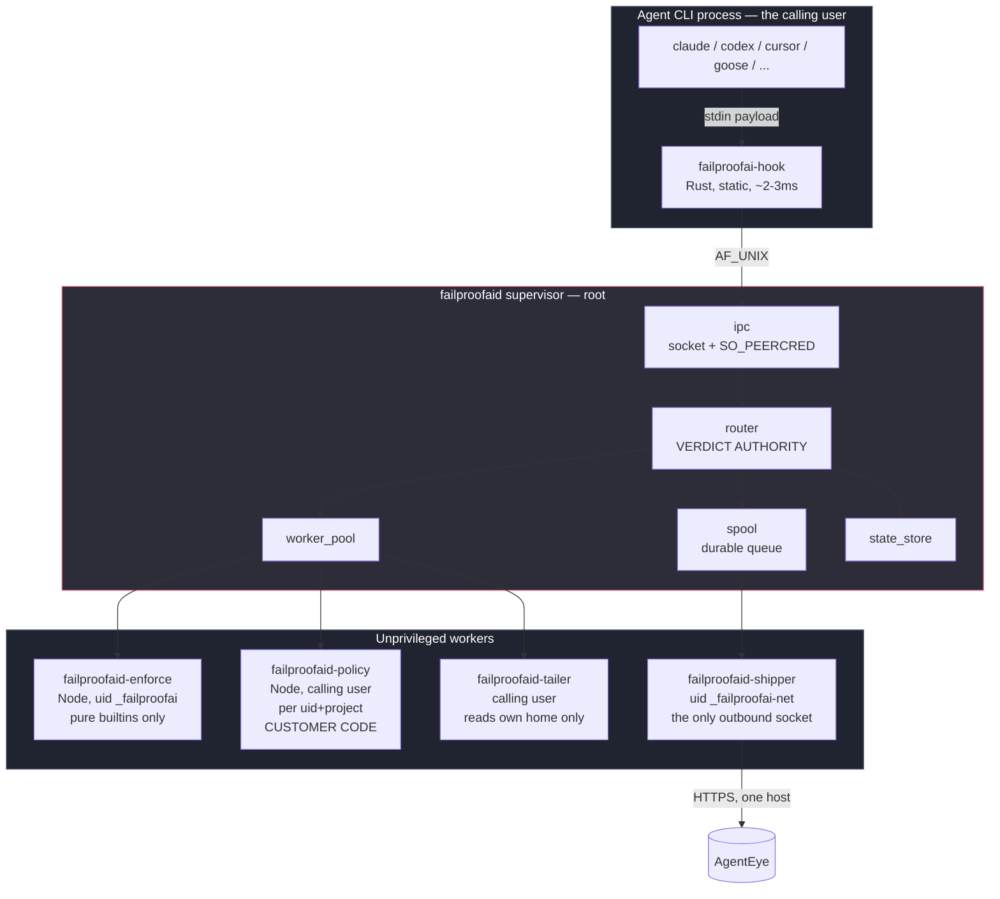
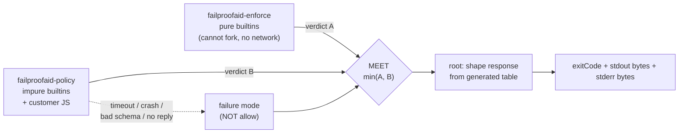
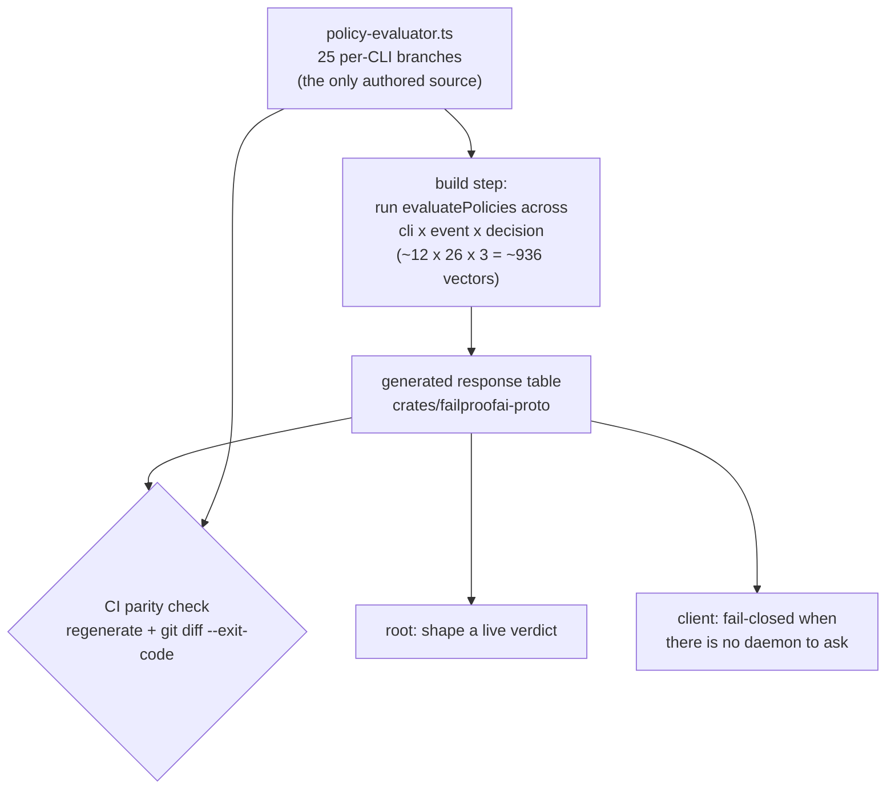
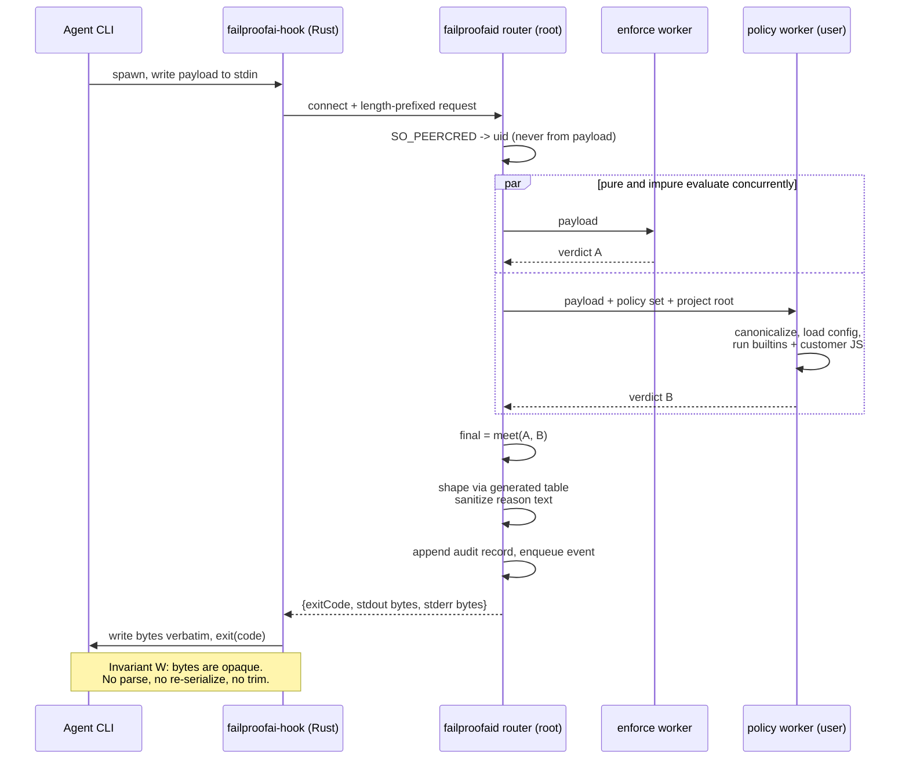
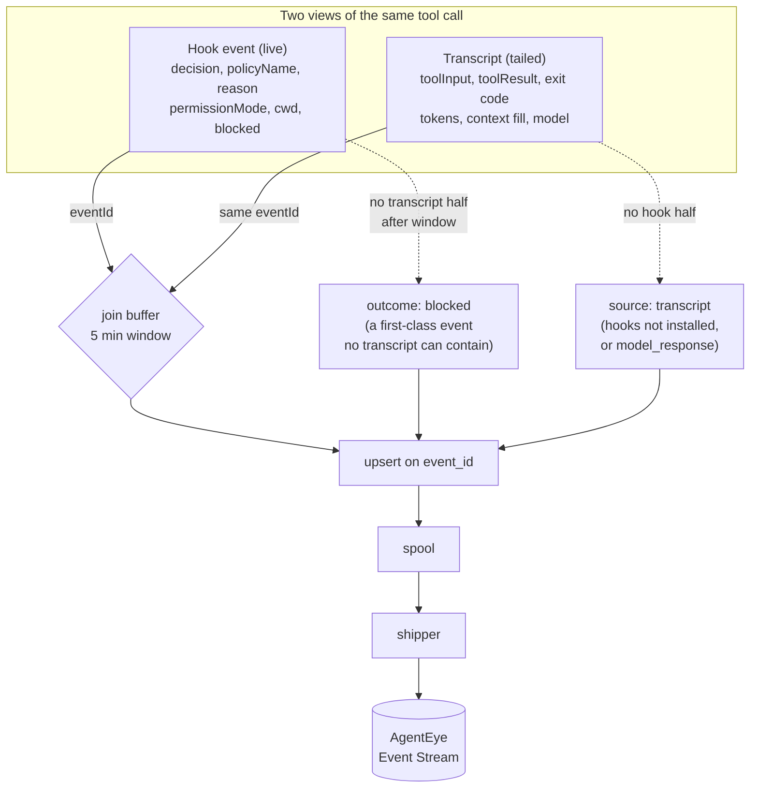
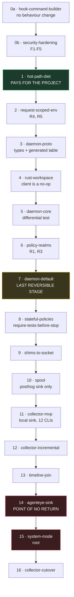

# failproofaid — a Rust daemon, a thin client, and one collector for every agent

**Date:** 2026-07-27
**Branch:** `1.0.0`
**Status:** design — awaiting review
**Ships as:** v1.0.0 (major)

## Goal

Turn failproofai from a stateless, cold-start-per-event hook into a long-lived daemon that
also absorbs `agenteye-collector`, so that one process per machine both **enforces** policy
and **collects** agent sessions for every supported CLI.

Three things this unlocks that are impossible today:

1. **Policies that remember.** Cross-event session state makes a whole class of policy
   writable for the first time — starting with `require-tests-before-stop`.
2. **One collector instead of two daemons.** failproofai already parses **12** agent CLIs;
   `agenteye-collector` ships **3**. Merging gives capture for all twelve using code that is
   already written and already live-verified.
3. **A joined timeline.** Hook events carry the *policy verdict*; transcripts carry the
   *model output and tool results*. Neither product can compute the join alone.

This document is for review and iteration. **No implementation is proposed for this PR.**

## Scope

### In scope

- The daemon/client split, its process topology, and the privilege boundary.
- The Rust ↔ TypeScript division of labour, and why the policy engine stays TypeScript.
- The wire contract, and how the exit-code and byte-exact-stdout guarantees survive it.
- Absorbing the collector: transcript tailing, cursors, the durable spool, cloud shipping.
- Correlating live hook events with tailed transcript events into one session timeline.
- npm distribution of per-platform Rust binaries, and the CI/publish changes it needs.
- A staged delivery sequence, with the point of no return named.
- Security findings in the *current* codebase that this architecture would amplify.

### Out of scope

- Windows. Linux and macOS first; Windows is sketched only where it changes a decision
  (named-pipe ACLs, the Copilot dual-shell command strings).
- The dashboard's own re-architecture. It becomes separately installable; its internals do
  not change here.
- The AgentEye server, its API surface, and its data model. One dependency on it is called
  out as an open question.
- Evaluations, audits, alerts, incidents — the analysis half of Observability.
- Any change to what the twelve vendor CLIs themselves do.

---

## Why now: what the current design costs

Every hook event — one per agent tool call, across 12 CLIs — spawns a fresh process that
redoes all of its setup and exits. Measured from the code:

- 1–3 process spawns (`npx -y failproofai` resolution on the default project-scope install)
- a full TypeScript/ESM module-graph parse, roughly 10k lines, including ~75 KB of session
  libraries that `cli=claude` never touches
- construction of all 39 builtin policies and their regexes at module scope
- two `.failproofai` tree-walks, three config reads, four `readdir`s
- **six file writes and six unlinks**, purely so that `import ... from 'failproofai'` resolves
  inside a user's policy file
- one to three **awaited** PostHog POSTs that block process exit

The genuinely per-event work is: read stdin, `JSON.parse`, a few table lookups, about twenty
regex tests, one JSONL append.

Latency is the least of it. The stateless design **structurally blocks** the product:

**Policies cannot remember anything.** The five stop-gates fake state by re-deriving it from
external oracles on every fire. `require-ci-green-before-stop` spawns roughly four
subprocesses including a **15-second `gh` network call on every Stop**.
`warn-repeated-tool-calls` maintains a 64 KB-capped sidecar JSON file per transcript and
silently no-ops when `transcriptPath` is absent. `gitBranchCache` is a module-scope `Map` in a
process that exits immediately, so its production hit rate is approximately zero.
`pendingStopBlockBySession` had to be hand-rolled inside the Pi shim because the engine had
nowhere to put it. There is no `require-tests-before-stop` because *"did tests run earlier in
this session?"* has no answer.

**There is no persistent process to build on.** Confirmed absent across `src/`, `lib/`,
`bin/`, and `scripts/`: `createServer`, `.listen(`, `net.createServer`, named pipes, IPC,
`fs.watch`, chokidar. The only long-lived process is the Next.js standalone server, and its
sole cross-request state is an in-memory singleton that dies on restart.

**Meanwhile a second daemon already exists for the same machines.** `agenteye-collector` is
installed per agent machine, registers as a systemd or launchd service, tails local session
transcripts, and ships them to AgentEye. Running two long-lived failproofai-family daemons on
every developer box is not a design anyone would choose deliberately.

### The asset that makes the merge cheap

failproofai's audit pillar is **already a collector that ships nowhere**. The root-level
`lib/<cli>-projects.ts` and `lib/<cli>-sessions.ts` modules parse claude, codex, copilot,
cursor, opencode, pi, hermes, openclaw, factory, devin, antigravity, and goose into a
canonical `LogEntry`, and the twelve adapters under `src/audit/cli-adapters/` normalize that
into `NormalizedToolEvent`. The web dashboard and the audit pipeline already share this one
parsing layer.

`agenteye-collector` covers three of those twelve. The merge is mostly a matter of pointing
existing parsers at an incremental reader and a shipper.

---

## Architecture

`failproofaid` is a Rust binary that owns the socket, the verdict, the durable spool, the
cloud shipper, and the transcript tailers. It does **not** own policy evaluation or transcript
parsing — those are roughly 18,000 lines of live-verified TypeScript. It spawns unprivileged
JavaScript workers and speaks a length-prefixed JSON protocol to them over pipes.

That is not a compromise. It is exactly the privilege-separation model we want, in which the
unprivileged worker happens to be a JavaScript runtime.

### Process topology and trust boundary



| Process | Language | Runs as | Network | Loads customer code | Reads user paths |
|---|---|---|---|---|---|
| `failproofaid` supervisor | Rust | root | **never** | no | **never** |
| `failproofaid-enforce` | Node | `_failproofai` (nologin, no home) | no | **no** | no |
| `failproofaid-policy` | Node | calling user, per `(uid, project)` | yes | **yes** | yes |
| `failproofaid-tailer` | Rust | calling user, per collected uid | no | no | own home only |
| `failproofaid-shipper` | Rust | `_failproofai-net` | one host | no | spool only |
| `failproofaid-updater` | Rust | root, short-lived | one host | no | staging only |

Two design laws follow from that table:

- **The root supervisor opens no network socket and parses no user-controlled file content.**
  Network lives in the shipper and updater; user paths live in dropped workers. What remains
  in root is orchestration, identity, the verdict meet, audit writes, and response shaping.
- **The verdict path and the collector path never share a process, a credential, or a failure
  mode.** A hung shipper must never stall a tool call.

### The three rules that keep this safe

**Rule 1 — There is exactly one policy engine, and it is TypeScript.**

Worth writing down now, while it is cheap. The dominant failure mode of "Rust daemon plus TS
engine" is someone later porting *just the hot builtins* to Rust for speed. That is how you
end up with the Rust one saying allow and the JavaScript one saying deny. If evaluation is
ever too slow, the answer is worker pooling and caching — never a second implementation.

**Rule 2 — The worker computes; root decides.**

The worker returns a **verdict** (`{decision, reason, policyNames}`). It never returns bytes
and never returns an exit code — handing it those would be handing it the verdict.
Composition is a **lattice meet** over `allow` &lt; `instruct` &lt; `deny`, never a join.



No message a worker can send turns a root DENY into an ALLOW. Worker death, timeout, or a
schema violation applies the configured failure mode — **absence is never allow**.

**Rule 3 — Root never opens a file under any user's home.**

Parser and tailer workers run as the owning uid. Root reading `/home/alice/.codex/sessions`
and shipping the bytes would be a one-line exfiltration primitive: any local user could
replace a transcript with a symlink to `/etc/shadow` or another user's private key. Enforce
this mechanically — a Rust architecture test asserting `router` and `ipc` have no path to
opening user paths, and an eslint `no-restricted-imports` fence around
`src/daemon/worker/**`.

### Where response shaping happens

Rule 2 says root emits the bytes, but the 25 per-CLI response branches in
`policy-evaluator.ts` are the crown jewels and must not be reimplemented in Rust. Both hold,
because **shaping is a pure total function of `(cli, event, decision)`** with `reason` and
`policyName` interpolated in.



The table is **generated, never authored**, so it cannot drift. This is the defense against
the repo's characteristic bug class — the same duplication that once let
`block-read-outside-cwd` silently no-op on every opencode read — applied mechanically rather
than by review.

The same table serves the daemon-down path, where there is no worker to ask. One mechanism,
two uses.

### Why the pure builtins get a process instead of a Rust port

Root *should* evaluate the payload-pure builtins itself. But they are TypeScript, and several
use lookahead — `VERSION_FILE_MUNGE_RE`, `HOME_PREFIX_RE` — that Rust's linear-time `regex`
crate cannot express. You would need the backtracking `fancy-regex`, which means a hostile
pattern in user-supplied `policyParams` could **hang root**. That is a worse outcome than the
drift a port would avoid.

Instead, `failproofaid-enforce` runs the existing pure set under a dedicated system uid with
`pids.max=1` and `RLIMIT_NPROC=1` — it physically cannot fork — Landlock read-only on the
packaged code, and no network. A *separate* uid rather than the calling user, because a
same-uid worker is `ptrace`-able and `LD_PRELOAD`-able **by the agent itself**.

Of the 39 builtins, roughly 32 are pure functions of the payload: every `sanitize-*`,
`block-sudo`, `block-rm-rf`, `block-curl-pipe-sh`, `block-secrets-write`, `block-env-files`,
`protect-env-vars`, `block-read-outside-cwd` (path math only), `block-force-push`,
`block-push-master`, the cloud-CLI blocks, and the regex `warn-*` set. The roughly seven
impure ones — `block-work-on-main`, `warn-all-files-staged`, `warn-repeated-tool-calls`, and
the five stop-gates — are workflow nags, not containment controls. **The security backbone can
run privileged with zero IO; the nags run unprivileged.**

### One request, end to end



The client is deliberately trivial: connect, pipe, write two buffers, exit with a number.
That gets spawn-to-exit to roughly 2–3 ms against Node's ~40 ms floor, on top of eliminating
all the per-event setup listed earlier.

It also makes the stdout invariant **structural** rather than conventional. `dev-hook.mjs`
currently has to *document* "never write to stdout" as a rule a human must uphold. A Rust
client whose only stdout write is the response buffer cannot violate it.

---

## Absorbing the collector

`agenteye-collector` today: a Rust binary installed per machine, registered as a systemd or
launchd service, capturing Codex, OpenClaw, and Hermes by tailing local session transcripts.
It backfills once on first run then streams within seconds, delivers exactly once across
restarts, only ever reads the agent's files, keeps and retries a failed batch rather than
discarding it, and reports `health` as unhealthy while anything is outstanding — *"healthy
means your data arrived, not merely that the process is alive."* Capture is off until
enabled, per agent, because transcripts ship as-is and can contain secrets.

Every one of those semantics is worth preserving verbatim. They are more mature than anything
on the enforcement side.

### Two sources, one pipeline



The correlation key:

```
eventId       = blake3(sessionKey || correlationId || eventType)
sessionKey    = blake3(machineId || uid || cli || sessionId)
correlationId = tool_use_id ?? "fp:" + fingerprint + ":" + nth
fingerprint   = blake3(cli || sessionId || canonicalToolName
                       || stableStringify(canonicalToolInput))
```

This works by construction, not by luck: **both sides already run the same
canonicalization.** `src/audit/cli-adapters/shared.ts` and `src/hooks/handler.ts` both call
`canonicalizeToolName` and `canonicalizeToolInput` from `src/hooks/tool-name-canonicalize.ts`.
One implementation, so the fingerprints agree and keep agreeing.

Because the id is deterministic and content-derived:

- **Exactly-once becomes an idempotency key** — at-least-once delivery plus an upsert.
- **Cursors become a performance optimization, not a correctness requirement.** Lose one,
  re-read the file, the server dedupes.
- **The naive collector is safe.** Re-reading whole files each tick produces the same ids,
  which is what lets all twelve CLIs ship on day one with zero adapter edits.
- **Double-shipping during cutover is safe**, so the old and new collectors can overlap for
  a release.
- The hook / tool_use / tool_result three-way join is three order-independent upserts.

### Field ownership

The rule: **the hook owns what we decided and what the environment was; the transcript owns
what the model said and what came back.**

| Field | Winner | Why |
|---|---|---|
| `decision`, `policyName`, `reason` | hook | only source — no transcript holds a verdict |
| `permissionMode` | hook | per-CLI resolution logic |
| `cwd` | hook | `resolve-cwd.ts` handles per-CLI quirks |
| `blocked` | hook | a deny means the tool never ran |
| `toolInput` | **transcript** | hook stdin is capped at 1 MB and discarded past it |
| `toolResultText`, exit code, duration | transcript | hook `PostToolUse` as fallback |
| tokens, context fill, reasoning, model | transcript | only source |
| `uid`, `machineId` | daemon | neither source has it |

### Tailing

**Watchers are a wakeup hint; the poll loop is the contract.** Never trust `fs.watch` or
inotify for correctness — they fail on NFS, overlayfs, containers, watch-limit exhaustion,
macOS FSEvents coalescing, and editor rename-over patterns. A watch event just makes the next
tick fire immediately.

- **JSONL family** (claude, codex, copilot, cursor, pi, factory, openclaw, antigravity):
  byte-offset tail, holding the partial trailing line in the cursor.
- **SQLite family** (hermes, goose, devin, plus antigravity's index): Rust `rusqlite`
  read-only with real WAL visibility, cursor on `rowid`. **This is a genuine upgrade.** The
  current `sql.js` fallback reads the *entire* database file into memory and sees only up to
  the last WAL checkpoint — for a tailer that is fatal, since it would re-read a large
  database every tick and still miss the newest rows.
- Truncation and rotation detected by size, inode, device, and a tail hash. Deterministic
  event ids make re-backfill free.
- **Backfill defaults to none.** A machine with years of history is many gigabytes; shipping
  all of it on install is both a cost event and a privacy event.

### Reusing the twelve parsers

Add one optional method to the adapter interface:

```ts
interface CliAdapter {
  cli: IntegrationType;
  listTranscripts(opts?): Promise<TranscriptMetadata[]>;   // unchanged
  streamEvents(meta): Promise<NormalizedToolEvent[]>;       // unchanged
  parseDelta?(input, cursor): Promise<ParseResult>;         // NEW, optional
}
```

Adapters without `parseDelta` get a generic shim that calls `streamEvents` and drops
everything at or below the high-water mark using the event id. Correct but O(file) per tick.
**That is how all twelve CLIs work on day one with zero adapter edits**, and how the hot three
get optimized later with no behaviour change. This is the single most important de-risking
decision in the plan.

One high-leverage enrichment: `src/audit/cli-adapters/shared.ts` is 85 lines and currently
skips past everything that is not a `tool_use` block. Teaching it to also emit
`model_response` from assistant entries unlocks token counts and context-fill **for all twelve
CLIs at once**.

### Durability

Adopt the collector's proven semantics wholesale: segment files, `fsync` on close, a size and
age cap, drop-oldest on overflow **recorded as a first-class error event**, exponential
backoff with jitter, and quarantine to a dead-letter directory for permanently-rejected
batches so one bad payload cannot wedge the queue.

**The spool may lose data; the verdict path may not.** Enforcement must never block, slow, or
fail because the network is down or the disk is full.

PostHog telemetry folds into the same spool with a different sink. Today
`flushHookTelemetry()` blocks process exit on one to three POSTs; afterwards the hook path
makes **zero network calls**. That also gives a deliberate sequencing benefit: the durability
machinery gets proven against a low-stakes sink before any customer transcript touches it.

---

## What cross-event state makes possible

State lives in the daemon, keyed `session:`, `project:`, or `machine:`, with declared
durability per key. `PolicyContext` gains a `state` API — `get`, `set`, `incr` with a sliding
window, `at(scope)`, `timeline()`, and a bounded `settle()` that waits for an in-flight
transcript half.

The policy that has been unwritable until now:

```ts
match: { events: ["Stop"] },
async fn(ctx) {
  await ctx.state.settle({ timeoutMs: 300 });
  const t = ctx.state.timeline();

  const edited = t.some(e => e.type === "tool_use"
    && ["Edit", "Write", "MultiEdit"].includes(e.toolName)
    && isSourceFile(String(e.toolInput.file_path ?? "")));
  if (!edited) return allow("no source edits this session");

  const testPassed = t.some(e => e.type === "tool_use"
    && e.toolName === "Bash"
    && TEST_CMD_RE.test(String(e.toolInput.command ?? ""))
    && e.exitCode === 0);            // exit code comes from the TRANSCRIPT half
  if (testPassed) return allow();

  return instruct("You edited source but no test command succeeded this session.");
}
```

The two things that made this impossible are exactly the two things the daemon adds: a
**session timeline**, and the **transcript's tool result and exit code**. This policy is the
proof the architecture pays for itself.

The five existing stop-gates also get materially cheaper. `require-ci-green-before-stop`
currently runs `gh --version`, a branch lookup, a HEAD lookup, `gh run list` with a 15-second
timeout, third-party check runs, and commit statuses — **on every Stop**. Moving the result to
`project:` scope keyed by HEAD sha, with a single-flight guard, means three concurrent agents
in one repo share one call. And `gitBranchCache`, today a `Map` with a near-zero hit rate,
becomes `project:`-scoped with `.git/HEAD` mtime invalidation and approaches 100%.

---

## Findings in the current codebase

These are present-tense issues that the daemon amplifies. They are worth fixing whether or not
the daemon ships, and several must be fixed *before* it does.

| # | Finding |
|---|---|
| **F1** | **Running the builtins as root would be root RCE on demand.** `builtin-policies.ts` imports `execSync` and `execFileSync` and has roughly twenty call sites running `git` and `gh` with a `cwd` that `resolve-cwd.ts` takes **verbatim from the client-supplied payload**. A `.git/config` carrying `core.pager`, `core.fsmonitor`, an alias, or `include.path`, plus a chosen `cwd`, executes as root. This is why the pure/impure split is a prerequisite, not a nicety. |
| **F2** | **The activity store is world-readable.** `hook-activity-store.ts` calls `writeFileSync` and `appendFileSync` with no `mode`, yielding 0644 — while `lib/atomic-write.ts` defaults to 0600 and `src/audit/cache.ts` passes `mode: 0o600` explicitly. On a shared box every user can read every other user's project paths and session ids today. `hook-logger.ts` has the same problem. |
| **F3** | **RCE on `git clone`.** A cloned repo containing `.failproofai/policies/*policies.mjs` has that file imported with full privileges on the first hook event — no prompt, no diff, no marker. `isAgentSettingsFile` protects fourteen agent config paths but **not `.failproofai/` itself**, so a prompt-injected agent can also write its own policy file and persist across events. |
| **F4** | **The dashboard is a LAN-reachable, unauthenticated enforcement-disable endpoint.** `scripts/launch.ts` binds `0.0.0.0`, and `app/actions/update-hooks-config.ts` is an unauthenticated Server Action that flips `enabledPolicies`. |
| **F5** | **The config merge has downgrade channels.** `policyParams` resolves project-first-wins, and a project file can set `customPoliciesEnabled: false`. Both are reachable by `git clone`. Under the daemon the rule should invert: org beats user beats project for anything that *loosens*; project may only tighten. |
| **F6** | **The collector's documented install is `curl ... \| sh`, which failproofai's own `block-curl-pipe-sh` builtin denies.** Shipping a root daemon whose install method your own default policy set blocks will not survive a security review. Replace with signed packages and a tarball with a detached signature. |
| **F7** | **The API key is passed on the command line**, which puts it in shell history and `ps` output. Read it from a file or stdin, at mode 0600. |
| **F8** | **The self-hosting claim conflicts with a default vendor endpoint.** `docs/agenteye/security.mdx` states that nothing is sent to a third-party SaaS and data stays in your own cloud account. If the daemon defaults to a hosted endpoint, that is false for every customer who does not self-host — a controller/processor question, not a hygiene one. **Resolve before shipping.** |

---

## Risks that would silently stop enforcement

This project's characteristic bug is the one where everything looks green and nothing is being
enforced. Each risk below therefore gets a named mechanical guard rather than a review note.

### Introduced by making the process long-lived

| # | Risk |
|---|---|
| **R1** | **Custom policies vanish after event #1.** `custom-hooks-loader.ts` imports a *stable* temp path, so the second `import()` is a module-cache hit and the body — which is where `customPolicies.add()` lives — never re-runs. `clearCustomHooks()` has already emptied the registry. Every event still exits 0. **No existing test catches this, because no test fires two events in one process.** Fix: fingerprint-keyed import URLs plus a load cache. |
| **R2** | **Concurrent evaluations unlink each other's temp files.** The loader writes `<policy>.__failproofai_tmp__.mjs` next to the user's source and unlinks it. One evaluation unlinks while another imports, the import fails, the error is caught, and the policy **fails open**. Fix: content-addressed temp files outside the user's tree. |
| **R3** | **The policy registry is a `globalThis` singleton cleared per event.** Two concurrent projects with different `enabledPolicies` corrupt each other. Fix: serialize evaluation inside each worker and parallelize by sharding workers per project realm. |
| **R4** | **HOME and env are captured at module load.** This breaks e2e fixture isolation *and* the integration-suite oracle, which exports `FAILPROOFAI_HOOK_LOG_FILE` into the vendor CLI's environment and greps the result. A daemon never sees that export; the file stays empty and every probe flips to failure — or worse, a stale log yields a false pass. |
| **R5** | **Runtime `homedir()` inside policies** backs `block-read-outside-cwd` and `block-rm-rf`. Under a daemon these resolve the *daemon's* home. Identical on a dev box, which is exactly why it would survive review. |
| **R6** | **The `--cli` default is a silent-allow generator.** An unrecognized `--cli` is coerced to `claude`, so a newer client sending `goose` to an older daemon gets a Claude-shaped deny that goose ignores — exit 0, allow. Version skew must fail closed, never fall back. |
| **R7** | **Fail-closed cannot mean exit 2 everywhere.** Exit 2 on stop-class events means "don't finish, retry" and loops forever. Daemon-down must be per-CLI and per-event shaped: **block tool execution, never block turn completion.** |

### Introduced by the Rust move

| # | Risk | Guard |
|---|---|---|
| **R8** | **An unresolvable `optionalDependency` is a *successful* npm install.** Green install, working CLI, no hook client, hooks exit 127, silent allow. Highest-probability new failure in the plan. | Four independent closures: expose the client from the platform package's own `bin`; the installer execs the binary before writing any hook; production commands carry a guard with the stop-class exit split; `failproofai doctor`. |
| **R9** | **glibc versus musl, or an arch mismatch** — binary present, fails to exec, exit 126/127. Neither 2 nor 0, so the session runs unenforced and nobody is told. | Build static musl. Verify each artifact by exec'ing it on a matching runner **before** publish. |
| **R10** | **Using Rust `String` instead of `Vec<u8>` on the relay.** `String` is UTF-8-validated, so a policy reason containing a lone surrogate gets lossily replaced, corrupting the deny JSON — which is then parsed as garbage and **treated as allow** on five CLIs. | **Invariant W:** stdout and stderr are opaque bytes between worker and client. Typed as bytes end to end, linted, and fuzzed over invalid UTF-8, NUL, CRLF, 1 MB, and empty. |
| **R11** | **A stray `println!`, or a tracing subscriber defaulting to stdout** — one byte, same five CLIs. | `#![deny(clippy::print_stdout, clippy::print_stderr)]` crate-wide, with a single sanctioned output module. |
| **R12** | **Partial publish.** If three of five platform packages publish and the wrapper publishes anyway, two platforms get a green install with no hook client — silent allow, at scale, on the release everyone upgrades to. | A `verify-platform` hard gate between publishing the platform packages and publishing the wrapper. |
| **R13** | **The existing CI version check silently passes when `packages/wrapper/package.json` is absent**, because of a `2>/dev/null \|\| true`. It also never reads the *root* package's `optionalDependencies` and never checks the dependency *name set*, so dropping a triple from the build matrix would ship undetected. | Amend the check to read root's `optionalDependencies` and assert the expected triple names; add a single version-setting script used by both publish steps. |
| **R14** | **Deleting `ensureBundle` along with the rest of `dev-hook.mjs`.** `dist/index.js` is still required for user policies to resolve `import ... from 'failproofai'`. Deleting it fails open all three committed policies in this repo, with a log line nobody reads. | **Move** it into daemon startup and the release health check. Do not delete it. |
| **R15** | **Copilot's `bash` and `powershell` fields receive the same string today**, which works only because the current command has no shell-specific syntax. Adding a POSIX guard to both makes the guard itself the failure on Windows. | The command builder takes a shell parameter. The dogfood test already asserts the correct divergence; the production test must too. |

### Assets to protect

- **`EvaluationResult` is already the wire contract.** `policy-evaluator.ts` already returns
  `{exitCode, stdout, stderr, decision, reason, policyName}`. **Design gate: if the design
  forces edits to `__tests__/hooks/policy-evaluator.test.ts`, the design is wrong.**
- **The ~20 per-CLI assertion helpers in `__tests__/e2e/helpers/hook-runner.ts`** encode
  live-verified vendor contracts. **They must change zero lines**; only `runHook()` moves.
  Worth a CI gate that fails if they change without a re-verification trailer.
- **`__tests__/hooks/dogfood-configs.test.ts`** — five of its seven invariants survive nearly
  verbatim, and two new ones get added.
- **CI is already wired for per-platform binaries.** The version-consistency check already
  iterates `packages/*/package.json` and validates `packages/wrapper`'s
  `optionalDependencies`. `packages/` does not exist yet — this is a pre-cut hole.

---

## Recommended deviations from the stated decisions

Three independent design passes converged on the same three points. Each changes a decision
already made, so they are raised explicitly rather than folded in silently. **These are open
for the review, not settled.**

**D1 — Fail-closed should mean "could not reach the daemon *and* could not evaluate locally",
not "the socket was missing."**
As stated, the first stale socket after a reboot stops every agent on every machine. Keeping
the client thin is still possible: on the failure path it execs today's in-process JavaScript
path, so you pay current latency exactly when things are already broken. Without something
like this, users will set the mode to allow, which is strictly worse than a graceful degrade.

**D2 — Ship `--user` as the default and the only npm-installable mode; make `--system`
installable only from a signed release artifact.**
`npx -y failproofai` runs as you today. Making a root daemon npm-installable means a
compromised npm release runs as **root on every developer machine in the org** — a far larger
prize, on a security product. This does not weaken the org-enforcement story; it changes the
install channel.

**D3 — Do not give up `npx -y failproofai`. Under per-platform `optionalDependencies` you do
not have to.**
It is both the distribution mechanism and the zero-friction first run. Require the daemon for
*daemon features* — state, collection, sub-5 ms — never for *enforcement to work at all*.
This also keeps the early stages fully reversible.

Two smaller notes in the same spirit. **One binary does not mean one address space**: a parser
OOM on untrusted JSON must never deny every tool call, so the parser stays a separate
memory-capped process and collector death maps to `degraded`. And the first-run banner must
not claim that nothing leaves the machine — PostHog fires by default today, so either state
it precisely or turn telemetry off by default.

---

## Staged delivery

Ordered so that value lands before the Rust risk. Each stage is one PR into `1.0.0`, keeping
all CI jobs green, with a CHANGELOG entry.



| # | Branch | Ships | Why here |
|---|---|---|---|
| **0a** | `hook-command-builder` | Extract the command-string ternary — copy-pasted at nine sites in `integrations.ts`, plus a tenth hidden inside the OpenCode shim template — into one builder. Interpolate the tool maps from `types.ts` into the generated shims, killing three duplicate copies of one map and two of another. | Byte-identical output; the 24 existing literal assertions staying green *is* the proof. Turns a nine-site edit into a one-site edit and permanently closes the duplication class that caused the silent opencode no-op. |
| **0b** | `security-hardening` | F1–F5. Pure/impure builtin split with a mechanical guard — a test asserting the pure module graph never imports `node:child_process`, `node:fs`, `node:net`, or `fetch`. Activity store and hook log to 0600. Dashboard to loopback. `.failproofai/**` into `isAgentSettingsFile`. Project-policy trust-on-first-use. Invert the config merge. | Every one is a present-tense vulnerability that the daemon amplifies. |
| **1** | `hot-path-diet` | Content-addressed module temp files, killing six writes and six unlinks per event. Lazy-import the session libraries so `cli=claude` skips 75 KB. Detach the telemetry flush. **No Rust, no daemon.** | **The stage that pays for the project if everything after slips.** Every existing user gets a faster hook immediately, and it validates the module-identity fix in the short-lived process first. |
| **2** | `request-scoped-env` | Replace module-load `homedir()` and the env latch; make `handleHookEvent` return bytes rather than write them. | R4 and R5. **Prove it with the existing e2e suite while there is still no daemon** — otherwise it silently breaks fixture isolation and the integration-suite oracle three PRs later. |
| **3** | `daemon-proto` | Wire types, the `CollectedEvent` union, `eventId` derivation, schema parity between Rust and TS, and the generated response table. | Locks the contract. Pure types and pure functions; zero runtime change. |
| **4** | `rust-workspace` | Cargo workspace, path-filtered Rust CI job, `packages/` scaffolding, release matrix, launcher with fallback to the JS path. **The Rust client does nothing but exec the JS path.** | Proves cross-compilation, npm `optionalDependencies`, provenance, and launcher fallback while the binary is behaviourally a no-op. If distribution is going to hurt, find out here. |
| **5** | `daemon-core` | Supervisor, IPC, worker pool, and the policy worker wrapping the existing engine. User mode only, behind a flag, default off. | **The differential test lands here and is the most important test in the project.** |
| **6** | `policy-realms` | Fingerprint-keyed module cache, realm-scoped registry, hot reload, one worker per project realm. | R1 and R3. Required before the default flips. Worker-per-realm also fixes the module leak and the hung-policy problem — a Rust `SIGKILL` preempts a busy loop that an in-process `Promise.race` cannot. |
| **7** | `daemon-default` | Client tries the daemon, falls back in-process, and the configured mode governs only if both fail. Single-writer activity store. `health` v1. | **Last fully reversible stage.** |
| **8** | `stateful-policies` | The state API, the rewritten stop-gates, `require-tests-before-stop`, a velocity limit. | First capability only the daemon can deliver. It stops being an optimization and becomes a feature. |
| **9** | `shims-to-socket` | Pi, OpenClaw, and OpenCode move to a zero-dependency client module. | Removes a process spawn per event in three already-long-lived hosts. |
| **10** | `spool` | Durable queue and shipper, **telemetry sink only**. The hook path makes zero network calls. | **Proves the durability machinery against a low-stakes sink before any customer transcript touches it.** |
| **11** | `collector-mvp` | Tailer, parser worker, discovery, cursors, backfill-once, generic parsing with id-based dedupe. **Local sink only** — no network, no key. | All twelve CLIs collected with zero adapter edits and zero privacy exposure. Everything after is a sink change. |
| **12** | `collector-incremental` | Byte-offset JSONL tailing, real WAL SQLite reads, `parseDelta` for the hot three. | Seconds rather than minutes, and CPU from O(all transcripts) to O(delta). |
| **13** | `timeline-join` | Correlation buffer, blocked-outcome inference, `model_response` enrichment. | The unified timeline — the thing neither product could build alone. |
| **14** | `agenteye-sink` | Cloud sink, key handling, consent, redaction. Default off. | **POINT OF NO RETURN** |
| **15** | `system-mode` | Root supervisor, privilege drop with post-drop assertions, service units, org-locked policies, the architecture tests. | Highest blast radius; a bug here is a privilege-escalation bug. **Most of the value lands without it.** |
| **16** | `collector-cutover` | Deprecate the standalone collector for its three CLIs. Both run for one release; id dedupe absorbs the overlap. | |

### The point of no return is stage 14

That is the first release in which a failproofai install can transmit session content. Before
it, local-first is a **property of the artifact**; after it, it is a **configuration**, plus a
wire-compatibility obligation to a server governed outside this repo, and every collector bug
becomes a data-leak bug rather than a crash.

Two secondary irreversibility points: **stage 4**, where the npm `bin` change routes every
install through the new launcher, and **stage 15**, where mistakes become privilege-escalation
mistakes rather than availability ones.

---

## Branch strategy, and a blocker

This ships as v1.0.0 on a long-lived integration branch. `1.0.0` is cut from `origin/main`;
every stage above lands as its own PR **targeting `1.0.0`**, and `1.0.0` merges to `main` once
at release. The branch must be kept current with `main` continuously — over sixteen stages it
will otherwise rot, and a stale base makes every subsequent diff noisy.

> **Blocker — must land before the first stage PR.** `.github/workflows/ci.yml` triggers only
> on `main`, for both `push` and `pull_request`. As written, **every PR into `1.0.0` would run
> zero CI** — no lint, no type check, no tests, no build, no e2e — and would appear green.
> Adding `1.0.0` to both trigger lists is a two-line change, but it must exist before any
> stage PR does, or the whole sequence runs unverified. `integration-suite.yml` and
> `osv-scanner.yml` need the same review.
>
> This design PR deliberately changes **no** workflow file — it is documentation only — so
> the fix belongs to the first implementation PR.

---

## Testing

The verification strategy is more important than usual here, because the failure mode being
guarded against is silence.

**Split e2e by transport.** Run the *same* 19 e2e files twice: once embedded (pure bun, no
Rust, the default PR gate) and once through the Rust client and daemon. **The diff between
those two jobs is the contract test**, and it is worth more than any bespoke integration test.

**Contributors must not need Rust.** The unit suite and the embedded e2e suite both run
Rust-free and together cover every vendor contract; the daemon suite is opt-in. A change under
`src/hooks/` never requires Rust, and a change under `crates/` never requires touching the
unit tests. This matters concretely: vendor-drift fixes are on a daily cron, so anything that
slows them down is a real cost.

The tests that actually de-risk this, in priority order:

1. **Differential** — every `(cli, event, verdict)` byte-identical between daemon and
   in-process, including trailing bytes. Note the existing runner *trims* stdout, so this
   needs a non-trimming variant.
2. **Custom-policy reload across events in one daemon** (R1) — fire the same event twice and
   assert both denies; edit the file between events and assert the new rule applies.
3. **Version skew** (R6) — mismatched protocol, and an unknown CLI id. Assert fail-closed with
   a named reason, and specifically that the daemon does *not* emit a Claude-shaped verdict
   for an unknown CLI.
4. **Daemon-down fail-closed** across all twelve CLIs for both a tool event and a stop event,
   asserting exact bytes and that stop-class never denies (R7).
5. **Concurrent multi-project** — two fixtures with disjoint enabled policies, interleaved
   (R2, R3).
6. **Per-request env honoring** — two consecutive requests with different log-file settings
   write to different files. **This is the test that keeps the integration-suite oracle
   alive** (R4).
7. **Relay fuzz** over invalid UTF-8 and friends (R10), and **client stdout purity** under
   verbose logging, backtraces, and panics (R11).
8. Worker crash mid-request, stale socket, timeout budget under every vendor timeout.

**E2E isolation** uses a per-worker daemon with the endpoint derived from the fixture HOME.
That deliberately exercises the top compatibility trap — a daemon serving a project whose HOME
is not the daemon's own — rather than hiding it. Use hash-derived socket names from day one,
since unix socket paths cap at about 104 bytes on macOS and a silent bind failure looks like a
mass regression.

**Add a daemon-down probe to the integration suite.** Stop the daemon, run one tool call,
assert the CLI reports a block. That converts fail-closed from a claim into a daily live check
across all twelve vendors. Also add an "oracle log exists and is non-empty" precondition:
today a broken oracle and broken enforcement are indistinguishable, since both produce "no
deny found" — the former must be an error, never a failure.

---

## Open questions

1. **Does the AgentEye ingest endpoint upsert on `event_id`?** A large part of this design's
   simplicity — exactly-once, the three-way join, safe double-shipping during cutover, cursors
   as an optimization — rests on it. If it is append-only, local dedupe needs an **exact
   bounded set, never a bloom filter**: a false positive silently drops a real event, which is
   the one failure that cannot be debugged.
2. **F8: the self-hosting claim versus a default vendor endpoint.** Needs a decision from
   outside engineering.
3. **`node:sqlite` versus the declared Node floor.** WAL-aware reads need Node 22.5+, and the
   current code silently degrades to a whole-file `sql.js` read otherwise. Rust fixes this for
   the *collector*, but the dashboard and audit paths still use the TypeScript reader. Either
   raise the floor or knowingly accept that four CLIs read stale data in the dashboard while
   the collector reads them correctly.
4. **The dashboard leaving the main tarball** breaks the launcher's path resolution. Bare
   `failproofai` must either spawn the dashboard package or print an install hint.
5. **Deleting Pi's inline tool maps needs its own test first** — verify the shared
   canonicalization covers Pi's path key, or `block-env-files` and `block-secrets-write`
   silently no-op on Pi.
6. **OpenClaw's fail-open behaviour is correct for its product** — a multi-channel gateway
   that hard-blocks on infrastructure failure is a worse product. Keep it, make it
   configurable, and **document the divergence prominently**: a global fail-closed claim that
   OpenClaw silently does not honor would itself be a silent-enforcement surprise.
7. **Consent model for multi-user collection.** Can an org enable shipping a user's
   transcripts without that user's acknowledgement? The proposed answer is that an org may
   mandate capture but may not mandate that the person being captured is unaware — a notice
   is unsuppressible, and `failproofai capture --explain` always shows what is read and where
   it goes. Worth an explicit decision.
8. **Should a root daemon self-update from the network at all?** The proposed default is no —
   defer to the OS package manager, with `update` as check-only unless an org opts in. A
   network-triggered root-code-replacement channel on every customer box is strictly more
   powerful than remote policy push.
