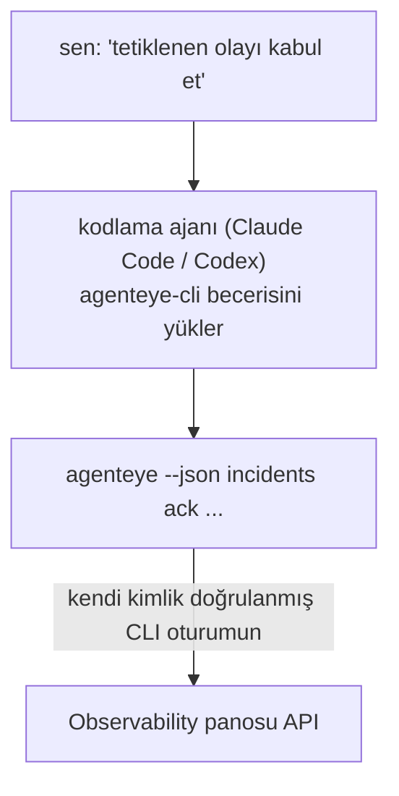

Kodlama ajanınıza *"bugün bir şey bozuk mu?"* sorusunu yöneltin ve Failproof AI Observability canlı verilerinizden yanıt alın, komut ezberlemesine gerek kalmadan. **Failproof AI Observability CLI becerisi** (`agenteye-cli`), bir *Agent Skill*'dir: Claude Code veya Codex gibi kodlama ajanları tarafından gerektiğinde yüklenen küçük bir klasör. Ajanın, [`agenteye` CLI](/tr/agenteye/cli) aracılığıyla Observability dağıtımınızı, *"CI'a sadece etkinlik gönderebilen bir anahtar ver"* veya *"Tetiklenen olayı kabul et ve bana ata"* gibi sade İngilizce isteklerle işletmesini öğretir.

Bu, bir hizmet veya ayrı bir ikili dosya **değildir**; dağıtılacak hiçbir şey yoktur. Zaten yüklemiş olduğunuz CLI'nın üzerine bağlıdır: ajan `agenteye --json …` komutunu çalıştırır, temiz JSON'ı ayrıştırır ve yanıt size düz metin olarak verir. Yapabildiği her şeyi, aynı komutları yazarak kendiniz de yapabilirsiniz.

---

## Diğer Failproof AI Observability arayüzleriyle ilişkisi

Failproof AI Observability, aynı verilere ve kontrollere ulaşmak için dört yol sunar. Birbirini tamamlarlar:

| Arayüz | Ne olduğu | Nerede çalışır | Şu durumlarda kullanın |
|---|---|---|---|
| **[CLI](/tr/agenteye/cli)** | `agenteye` için komut/bayrak referansı | Terminal'inizde | Belirli bir komutu çalıştırmak veya betik yazmak istiyorsunuz |
| **[CLI tarifleri](/tr/agenteye/cli-recipes)** | Kopyala-yapıştır `jq`/boru hat desenleri | Terminal'inizde / betikler | CLI'yı otomasyona entegre ediyorsunuz |
| **CLI becerisi** (bu belge) | CLI'ya doğal dil ön kapısı | Kodlama ajanınız, iş istasyonunuzda | Sadece sormak ve ajanın komutu seçmesini istiyorsunuz |
| **[Evaluator becerisi](/tr/agenteye/evaluator-skill)** | Puanlama hizmetinizi tasarlayan ve oluşturan kardeş beceri | Kodlama ajanınız, iş istasyonunuzda | Puanları okumak yerine *üretmek* istiyorsunuz |
| **[Python SDK becerisi](/tr/agenteye/python-sdk-skill)** | Ajanınızı enstrüman yapan kardeş beceri | Kodlama ajanınız, iş istasyonunuzda | Ajanınızın her noktada telemetri *yaymasını* istiyorsunuz |
| **[Panoda yerleşik AI asistanı](/tr/agenteye/assistant)** | Panoda gömülü bir sohbet | Sunucu tarafı (panoda) | Verileriniz üzerinde panoda Q&A istiyorsunuz |

Beceride kendine ait hiçbir ayrıcalık yoktur; sadece sözlerinizi sizin olarak çalışan CLI çağrılarına dönüştürür:



### Panoda yerleşik AI asistanı ile karşılaştırma: önemli bir fark

Bunlar çok farklı çalışma alanlarına sahip iki farklı araçtır:

- **Panoda yerleşik AI asistanı** ([AI asistanı](/tr/agenteye/assistant)), pano tarafından desteklenen panoya gömülü bir sohbettir. **Yalnızca okuma artı onay geçidi yazma**: kaydedilmiş sorgular ve panoları taslak olarak oluşturabilir, ancak her yazma işlemi açık tıklamanızı bekler ve asla silmez. `agent:use` izni ile gated ve yalnızca görüntüledikleri kuruluşun verilerini görür.
- **CLI becerisi** *sizin* iş istasyonunuzda *sizin* kodlama ajanınızın içinde çalışır ve `agenteye` CLI'yı **sizin olarak** çalıştırır. CLI'nın **tüm yüzeyini, mutasyonları da dahil** (API anahtarları oluştur/döndür/devre dışı bırak, kuruluş ayarlarını değiştir, olayları çözümle, kaydedilmiş sorguları sil) gerçekleştirebilir, yalnızca CLI oturumunuzun izinleri tarafından sınırlandırılır. Bunu, bu komutları elle çalıştırmak için yapacağınız kadar dikkatli şekilde kullanın.

---

## Ön koşullar

1. **`agenteye` CLI yüklü** ve `PATH` üzerinde (bkz. [CLI](/tr/agenteye/cli) referansı: `pipx install agenteye`).
2. **Pano URL'iniz ayarlanmış** (`AGENTEYE_DASHBOARD_URL`, veya ajan `--base-url` iletir).
3. **Oturum açılmış**: önce `agenteye login` komutunu çalıştırın. Beceri, e-postayla gelen tek seferlik kod oturumunu sizin için **tamamlayamaz**; oturum eksikse veya süresi dolmuşsa size `agenteye login` komutunu çalıştırmanız gerektiğini söyler (CLI çıkış kodu `4`).

---

## Nereden alacaksınız

Beceri, Failproof AI'nın genel beceri koleksiyonunda yayınlanmıştır:

**[github.com/FailproofAI/skills](https://github.com/FailproofAI/skills)** → [`skills/agenteye-cli/`](https://github.com/FailproofAI/skills/tree/main/skills/agenteye-cli)

Hiçbir kısmı gated değildir — depo geneldir ve becerinin kendi kimlik bilgisine ihtiyacı yoktur, çünkü sadece *sizin* panonuza karşı **genel** `agenteye` CLI'yı çalıştırır ve sizin oturum açtığınız oturumu kullanır. Bunu birinden istemeniz gerekmez.

Kendi klasörü olarak gönderildiğini ve `pipx install agenteye` paketi içinde **olmadığını** unutmayın; onu orada aramayın.

## Beceriyi yükleme

En hızlı yol, klasörü getiren ve ajanınızın baktığı yere yerleştiren [`skills`](https://skills.sh) CLI'sidir:

```bash
# Claude Code, sadece bu proje
npx skills add FailproofAI/skills --skill agenteye-cli -a claude-code

# her proje (~/.claude/skills/ dizinine yükler)
npx skills add FailproofAI/skills --skill agenteye-cli -a claude-code -g --copy

# Bunun yerine Codex
npx skills add FailproofAI/skills --skill agenteye-cli -a codex
```

Ardından diğer beceriler gibi yönetin:

```bash
npx skills list -a claude-code      # ne yüklü
npx skills update agenteye-cli      # en son sürümü çek
npx skills remove agenteye-cli      # kaldır
```

Elle yüklemeyi tercih ediyor musunuz? Bir Agent Skill sadece bir `SKILL.md` içeren bir klasördür (artı isteğe bağlı referanslar), bu nedenle kopyalama da işe yarar:

- **Claude Code**: `agenteye-cli/` klasörünü `~/.claude/skills/` (her proje) veya `<your-repo>/.claude/skills/` (sadece bu depo) dizinine yerleştirin. Claude Code otomatik olarak keşfeder — `/skills` listesi ile doğrulayın veya açıklaması eşleşen bir soru sorun.
- **Codex (OpenAI)**: Codex aynı `SKILL.md`'yi okur. Bundled `agents/openai.yaml`, `allow_implicit_invocation: true` ayarlar, bu nedenle Codex görev eşleştiğinde beceriyi otomatik seçer; aksi takdirde `$agenteye-cli` olarak açıkça çağırın.

---

## Güvenlik: Bir ajan CLI çalıştırdığında mutasyonlar uyarı yapmaz

> **Uyarı:** Bir ajanın değişiklik yapmasını vermeden önce bunu okuyun.

`agenteye` CLI normalde yıkıcı bir işlem yapmadan önce *"emin misiniz?"* sorar. **Terminale bağlı olmadığında (bu tam olarak bir kodlama ajanının çalıştırma şeklidir) ve `--json` de skips when not attached to a terminal (which is exactly how a coding agent runs it), and `--json` skips it too.** Bu nedenle güvenlik istemi ajan için **tetiklenmez**.

Beceri bunu telafi etmek için yazılmıştır: tam olarak çalıştıracağı komutu belirtmesi ve herhangi bir durum değişikliğinden önce açık **TAMAM** alması talimatlandırılır. Bu disipilini koruyun. Failproof AI Observability'yi bir ajan aracılığıyla çalıştırdığınızda, *siz* onay adımısınız. İzlenecek durum değiştiren komutlar:

- `keys create` / `update` / `disable` / `regenerate`
- `users create` / `update` / `disable` / `enable`
- `settings set`
- `alerts create` / `update` / `delete` / `test`
- yazma `incidents` alt komutları: `ack` / `assign` / `resolve` / `open` / `comment-add` / `comment-delete` / `subscribe` / `unsubscribe`
- `query create` / `update` / `delete`
- `agent rename` / `delete`
- `orgs switch`

**Gözlem** altındaki her şey (`events`, `sessions`, `evals`, `errors`, `list`, `whoami`, `orgs list/current/perms`) salt okunurdur ve hiçbir şeyi değiştirmez.

Ajan **sizin olarak** hareket ettiğinden, oturumunuzun yapmasına izin verdiği şeyi yapabilir; izinler **kuruluş başına** çözümlenir (bkz. [API anahtarları](/tr/agenteye/api-keys)). İzniniz olmayan bir komut, çıkış kodu `5` ile tam izin adı ile döner, bu nedenle ajan aydınlatsız başarısız olmak yerine tam olarak ne istemeniz gerektiğini söyleyebilir.

---

## Soran şeyler

İşte gerçek bir gidiş-dönüş, okuma ve değişiklik için bekleme:

```text
sen   ▸ Son günde bir şey bozuk mu?

ajan  ▸ Çalışıyor: agenteye --json errors --since 24h --aggregate
        Son 24 saatte 3 hata türü. En büyüğü TimeoutError
        (18 isabet, tümü checkout-agent'te), ardından RateLimited (5).
        TimeoutError için başarısız oturumları istiyorum musunuz?

sen   ▸ CI'a sadece etkinlik gönderebilen bir anahtar ver.

ajan  ▸ Bu bir API anahtarı oluşturur. Çalıştıracağım:
          agenteye keys create ci --add events:add
        Devam etmek istiyorum musunuz?

sen   ▸ evet

ajan  ▸ Tamam. "ci" anahtarı sadece events:add ile oluşturuldu.
        Sırrı sadece bir kez gösterilir, bu nedenle şimdi saklayın. Bunu yeniden yazdıramam.
```

Beceri, her sade İngilizce niyeti doğru `agenteye` komutuna eşler, tahmin etmesin diye önce geçerli değerleri keşfeder (`list <kind>`, `whoami`) ve herhangi bir değişiklikten önce tam komutu belirtir. Daha fazla örnek:

- *"Son 24 saatte bir şey bozuk / başarısız mı?"* → `errors --since 24h --aggregate`, sonra bir dökümü.
- *"Oturum `run-001` neden başarısız oldu?"* → `events --session-id run-001 --all` + `evals --session-id run-001`.
- *"Bu hafta kalite nasıl trend gösteriyor?"* → `evals --aggregate --since 7d`, sonra düşük puanlı çalışmalara dalın.
- *"CI'a sadece etkinlik gönderebilen bir anahtar ver."* → `keys create ci --add events:add` (komutu belirtir, ardından oluşturur ve tek seferlik sırrı yakalar).
- *"Kimde erişim var? Dana'yı salt okunur yap."* → `users list` → `users update dana@… --permission-set read-only` (sizin onayınızdan sonra).
- *"Tetiklenen olayı kabul et ve bana ata."* → `incidents list --state firing` → `incidents ack <id>` / `incidents assign <id> you@…`.

Bu komutlar, bayraklar ve JSON şekilleri için, [CLI](/tr/agenteye/cli) referansı ve [ajanlar için CLI tarifleri](/tr/agenteye/cli-recipes) bölümüne bakın.

---

## Sonraki adımlar

- **[CLI](/tr/agenteye/cli)**: `agenteye` için tam komut ve bayrak referansı.
- **[Ajanlar için CLI tarifleri](/tr/agenteye/cli-recipes)**: kopyala-yapıştır `jq` desenleri ve çıkış kodu işleme.
- **[Evaluator ajan becerisi](/tr/agenteye/evaluator-skill)**: kardeş beceri, `agenteye evals` tarafından okunan puanları oluşturan değerlendiriciyi inşa etmek için.
- **[Python SDK ajan becerisi](/tr/agenteye/python-sdk-skill)**: kardeş beceri, `agenteye` tarafından okunan telemetriyi yayması için bir ajanı enstrüman yapmak için.
- **[AI asistanı](/tr/agenteye/assistant)**: panoda yerleşik asistan (bu terminal becerisiyle karıştırılmaması gereken).
- **[API anahtarları](/tr/agenteye/api-keys)**: beceride yapabilecekleri sınırlandıran kuruluş başına izin modeli.