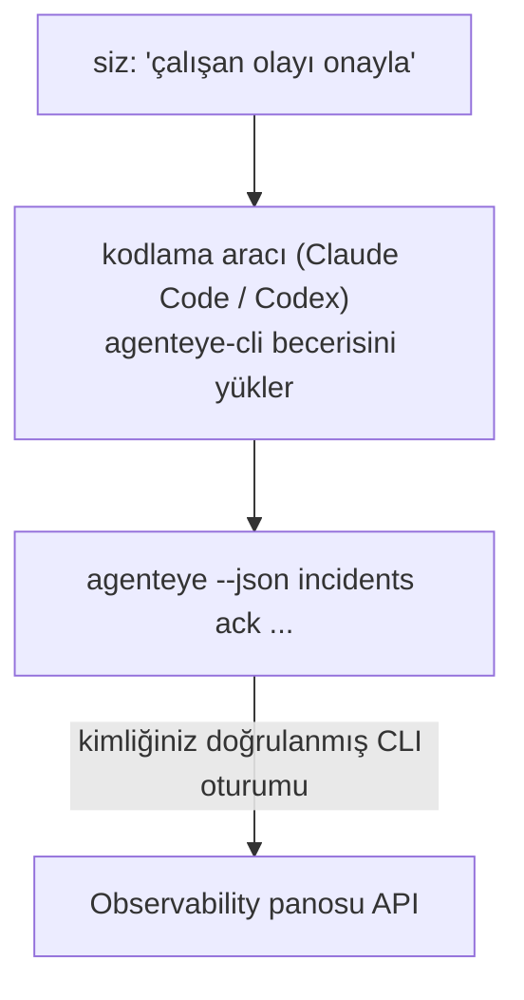

Kodlama aracınıza *"bugün bir şey bozuk mu?"* diye sorun ve canlı Failproof AI Observability verilerinizden yanıt almasını sağlayın; hiçbir komut ezberleyecek bir şey yok. **Failproof AI Observability CLI becerisi** (`agenteye-cli`), bir *Agent Becerisidir*: Claude Code veya Codex gibi bir kodlama aracının talep üzerine yüklediği, bir dizi talimatı içeren küçük bir klasör. Bu beceri, aracıya Observability dağıtımınızı [`agenteye` CLI](/tr/agenteye/cli) aracılığıyla çalıştırmayı öğretir; *"CI'ye sadece etkinlik gönderebilen bir anahtar ver"* veya *"çalışan olayı onayla ve bana ata"* gibi düz İngilizce isteklerden yapılabilir.

Bu **bir** hizmet veya ayrı bir ikili değildir; dağıtılacak hiçbir şey yoktur. Zaten kurmuş olduğunuz CLI'nin üstünde çalışır: ajan `agenteye --json …` komutunu çalıştırır, temiz JSON'u ayrıştırır ve size düz metin olarak yanıt verir. Yapabileceği her şey, siz aynı komutları yazarak kendiniz yapabilirsiniz.

---

## Diğer Failproof AI Observability arayüzleriyle ilişkisi

Failproof AI Observability size aynı verilere ve kontrollere ulaşmanın dört yolunu sunar. Birbirlerini tamamlarlar:

| Arayüz | Nedir | Nerede çalışır | Ne zaman kullanılır |
|---|---|---|---|
| **[CLI](/tr/agenteye/cli)** | `agenteye` için komut/bayrak başvurusu | Terminaliniz | Belirli bir komutu çalıştırmak veya script yazmak istediğinizde |
| **[CLI reçetleri](/tr/agenteye/cli-recipes)** | Kopyala-yapıştır `jq`/boru desenleri | Terminaliniz / scriptler | CLI'yi otomasyona entegre ettiğinizde |
| **CLI becerisi** (bu belge) | CLI'ye doğal dil girişi kapısı | Kodlama aracınız, iş istasyonunuzda | Sadece sormak ve aracın komutu seçmesine izin vermek istediğinizde |
| **[Evaluator becerisi](/tr/agenteye/evaluator-skill)** | Puanlama hizmetinizi tasarlayan ve oluşturan kardeş beceri | Kodlama aracınız, iş istasyonunuzda | Puan almak yerine puan *üretmek* istediğinizde |
| **[Python SDK becerisi](/tr/agenteye/python-sdk-skill)** | Aracınızı enstrümente eden kardeş beceri (telemetri yayması için) | Kodlama aracınız, iş istasyonunuzda | Aracınızın bu becerinin okuduğu etkinlikleri *üretmesini* istediğinizde |
| **[Paneldeki AI asistanı](/tr/agenteye/assistant)** | Panele gömülü bir sohbet | Sunucu tarafı (panelde) | Verileriniz hakkında panelde Q&A yapmak istediğinizde |

Beceri kendi başına hiçbir ayrıcalığa sahip değildir; sadece sözlerinizi sizin olarak çalışan CLI çağrılarına dönüştürür:



### Paneldeki AI asistanı ile karşılaştırma: önemli bir fark

Bunlar çok farklı etki yarıçaplarına sahip iki farklı araçtır:

- **Paneldeki AI asistanı** ([AI asistanı](/tr/agenteye/assistant)), pano içine gömülü bir sohbettir ve ajan hizmeti tarafından desteklenir. **Sadece okumalı ve onay geçitli yazma**: kaydedilmiş sorgular ve panoları taslak hâline getirebilir, ancak her yazma işlemi açık tıklamanız için duraklatılır ve asla silmez. `agent:use` izni tarafından sınırlandırılır ve yalnızca görüntülediğiniz kuruluşun verilerini görür.
- **CLI becerisi**, *sizin* iş istasyonunuzda *sizin* kodlama aracınızın içinde çalışır ve `agenteye` CLI'sini **siz olarak** çalıştırır. CLI'nin **tam yüzeyini (mutasyonlar dahil)** gerçekleştirebilir (API anahtarları oluşturma/döndürme/devre dışı bırakma, kuruluş ayarlarını değiştirme, olayları çözme, kaydedilmiş sorguları silme); yalnızca CLI giriş izinleriniz tarafından sınırlandırılır. Bunu, bu komutları elle çalıştırmakla aynı dikkatle ele alın.

---

## Ön koşullar

1. **`agenteye` CLI kurulu** ve `PATH`'de (bkz. [CLI](/tr/agenteye/cli) başvurusu: `pipx install agenteye`).
2. **Pano URL'niz ayarlanmış** (`AGENTEYE_DASHBOARD_URL` veya ajan `--base-url` iletir).
3. **Oturum açmış bir oturum**: önce kendiniz `agenteye login` çalıştırın. Beceri, e-postaya gönderilen tek seferlik kod girişini sizin için **tamamlayamaz**; oturum eksik veya süresi dolmuşsa size `agenteye login` çalıştırmasını söyler (CLI çıkış kodu `4`).

---

## Nereden alabileceğiniz

Beceri, Failproof AI'nin genel beceri koleksiyonunda yayımlanmıştır:

**[github.com/FailproofAI/skills](https://github.com/FailproofAI/skills)** → [`skills/agenteye-cli/`](https://github.com/FailproofAI/skills/tree/main/skills/agenteye-cli)

Onun hakkında hiçbir şey engellenmez — depo halkaçıktır ve beceri kendi başına hiçbir kimlik bilgisine ihtiyaç duymaz, çünkü yalnızca **genel** `agenteye` CLI'sini *sizin* panonuza karşı, *sizin* giriş yaptığınız oturumla çalıştırır. Bunu almak için kimseye sormak zorunda değilsiniz.

Bu paketin `pipx install agenteye` ile birlikte gelmediğini, ayrı bir klasör olarak gönderildiğini ve `pipx install agenteye` paketinin içinde **olmadığını** unutmayın; orada arama yapmayın.

## Beceriyi yükleme

En hızlı yol, klasörü getiren ve aracınızın baktığı yere bırakan [`skills`](https://skills.sh) CLI'sidir:

```bash
# Claude Code, sadece bu proje
npx skills add FailproofAI/skills --skill agenteye-cli -a claude-code

# her proje (~/.claude/skills/ konumuna yükler)
npx skills add FailproofAI/skills --skill agenteye-cli -a claude-code -g --copy

# Bunun yerine Codex
npx skills add FailproofAI/skills --skill agenteye-cli -a codex
```

Ardından diğer beceriler gibi yönetin:

```bash
npx skills list -a claude-code      # nelerin kurulu olduğu
npx skills update agenteye-cli      # en son sürümü çek
npx skills remove agenteye-cli      # kaldır
```

Elle yüklemeyi tercih mi ediyorsunuz? Bir Agent Becerisi, `SKILL.md` içeren (artı isteğe bağlı referanslar) bir klasördür; kopyalama da işe yarar:

- **Claude Code**: `agenteye-cli/` klasörünü `~/.claude/skills/` (her proje) veya `<sizin-repo>/.claude/skills/` (sadece o repo) konumuna yerleştirin. Claude Code otomatik olarak keşfeder — `/skills` listesiyle doğrulayın veya açıklamasıyla eşleşen bir soru sorun.
- **Codex (OpenAI)**: Codex aynı `SKILL.md`'yi okur. Bundled `agents/openai.yaml`, `allow_implicit_invocation: true` ayarlar; aksi takdirde beceriyi `$agenteye-cli` olarak açıkça çağırın.

---

## Güvenlik: mutasyonlar ajan CLI'yi çalıştırırken istemi **göstermez**

> **Uyarı:** Bir aracının değişiklik yapmasına izin vermeden önce bunu okuyun.

`agenteye` CLI normalde bir yıkıcı işlemden önce *"emin misiniz?"* sorar. **Bunu bir terminale bağlı olmadığında (tam olarak bir kodlama aracının çalıştırma biçimi), ve `--json` de kapatırken otomatik olarak atlar.** Yani güvenlik istemi, ajan için **ateşlenmeyecektir**.

Beceri bunu telafi etmek için yazılmıştır: çalıştıracağı tam komutu belirtmesi ve herhangi bir durum değişikliğinden önce açık **OK almanız için talimat** verilir. Bu disiplini koruyun. Failproof AI Observability'i ajan aracılığıyla çalıştırdığınızda, *siz* onay adımısınız. İzlenecek durum değiştiren komutlar:

- `keys create` / `update` / `disable` / `regenerate`
- `users create` / `update` / `disable` / `enable`
- `settings set`
- `alerts create` / `update` / `delete` / `test`
- yazma `incidents` alt komutları: `ack` / `assign` / `resolve` / `open` / `comment-add` / `comment-delete` / `subscribe` / `unsubscribe`
- `query create` / `update` / `delete`
- `agent rename` / `delete`
- `orgs switch`

**Gözlemle** altındaki her şey (`events`, `sessions`, `evals`, `errors`, `list`, `whoami`, `orgs list/current/perms`) salt okunur ve hiçbir şeyi değiştirmez.

Ajan **siz olarak** hareket ettiğinden, yalnızca giriş izninizin izin verdiği işlemleri yapabilir; izinler **her kuruluş başına** çözülür (bkz. [API anahtarları](/tr/agenteye/api-keys)). İzniniz olmayan bir komut, çıkış kodu `5` ile tam izin adıyla döner; böylece ajan, belirsiz başarısızlık yerine tam olarak yönetici ne isteyeceğini söyleyebilir.

---

## Ne sorabileceğiniz

İşte gerçek bir gidiş-dönüş, bir okuma, ardından sizin OK'nizi bekleyen bir değişiklik:

```text
siz   ▸ Son gün içinde bir şey bozuk mu?

ajan ▸ Çalıştırılıyor: agenteye --json errors --since 24h --aggregate
        Son 24 saatte 3 hata türü. En büyüğü TimeoutError
        (18 isabet, tamamı checkout-agent'de), sonra RateLimited (5).
        TimeoutError için başarısız oturumları istiyorsunuz?

siz   ▸ CI'ye sadece etkinlik gönderebilen bir anahtar ver.

ajan ▸ Bu bir API anahtarı oluşturur. Çalıştıracağım:
          agenteye keys create ci --add events:add
        Devam etmek istiyorsunuz?

siz   ▸ evet

ajan ▸ Tamamlandı. "ci" anahtarı sadece events:add ile oluşturuldu.
        Gizli dizi yalnızca bir kez gösterilir; şimdi saklayın.
        Bunu yeniden yazdıramam.
```

Beceri her düz İngilizce amacı doğru `agenteye` komutuna eşler; önce geçerli değerleri bulur (`list <kind>`, `whoami`), böylece tahmin yapmaz ve herhangi bir değişiklikten önce tam komutu belirtir. Daha fazla örnek:

- *"Bir şey bozuk / başarısız mı / son 24 saatte başarısız mı?"* → `errors --since 24h --aggregate`, sonra bölünme.
- *"Oturum `run-001` neden başarısız oldu?"* → `events --session-id run-001 --all` + `evals --session-id run-001`.
- *"Kalite bu hafta nasıl trendinde?"* → `evals --aggregate --since 7d`, sonra düşük puanlı çalışmaları ayrıntılı incele.
- *"CI'ye sadece etkinlik gönderebilen bir anahtar ver."* → `keys create ci --add events:add` (komutu belirtir, ardından oluşturur ve tek seferlik gizli diziyi yakalar).
- *"Kimlerin erişimi var? Dana'yı salt okunur yap."* → `users list` → `users update dana@… --permission-set read-only` (sizinle doğrulamadan sonra).
- *"Çalışan olayı onayla ve bana ata."* → `incidents list --state firing` → `incidents ack <id>` / `incidents assign <id> you@…`.

Bunların arkasındaki tam komutlar, bayraklar ve JSON şekilleri için bkz. [CLI](/tr/agenteye/cli) başvurusu ve [Ajanlar için CLI reçetleri](/tr/agenteye/cli-recipes).

---

## Sonraki adımlar

- **[CLI](/tr/agenteye/cli)**: `agenteye` için tam komut ve bayrak başvurusu.
- **[Ajanlar için CLI reçetleri](/tr/agenteye/cli-recipes)**: kopyala-yapıştır `jq` desenleri ve çıkış kodu işleme.
- **[Evaluator ajan becerisi](/tr/agenteye/evaluator-skill)**: kardeş beceri; `agenteye evals` tarafından okunan puanı hesaplayan evaluator'u oluşturmak için.
- **[Python SDK ajan becerisi](/tr/agenteye/python-sdk-skill)**: kardeş beceri; aracı enstrümente etmek için `agenteye` tarafından okunan telemetri yayması için.
- **[AI asistanı](/tr/agenteye/assistant)**: paneldeki asistan (bu terminal becerisiyle karıştırılmayacak).
- **[API anahtarları](/tr/agenteye/api-keys)**: becerinizin yapabileceklerini sınırlayan kuruluş başına izin modeli.