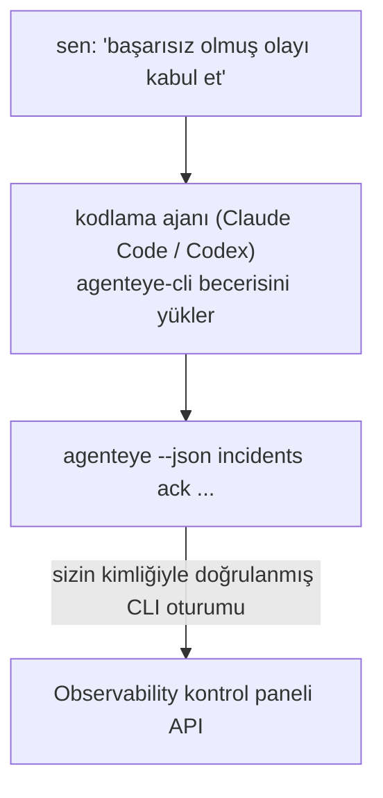

Kodlama ajanınıza *"bugün bir şey bozuk mu?"* sorusunu sorun ve Failproof AI Observability verilerinizden canlı yanıt alın, hiçbir komut ezberlemesine gerek kalmadan. **Failproof AI Observability CLI becerisi** (`agenteye-cli`), bir *Agent Skill* (ajan becerisi): Claude Code veya Codex gibi bir kodlama ajanının talep üzerine yüklediği küçük bir talimat klasörü. Ajanı Observability dağıtımınızı [`agenteye` CLI](/tr/agenteye/cli) aracılığıyla *"sadece etkinlik gönderebilen CI'ye bir anahtar ver"* veya *"başarısız olmuş olayı kabul et ve bana ata"* gibi düz İngilizceden gelen isteklerle çalıştırmayı öğretir.

Bu, bir hizmet veya ayrı bir ikili dosya **değildir**; dağıtacak hiçbir şey yoktur. Zaten kurmuş olduğunuz CLI'nin üzerinde çalışır: ajan `agenteye --json …` komutunu çalıştırır, temiz JSON'u ayrıştırır ve size düz yazı olarak yanıt verir. Yapabildiği her şey, aynı komutları yazarak kendiniz de yapabilirdiniz.

---

## Diğer Failproof AI Observability arayüzleriyle ilişkisi

Failproof AI Observability, aynı verilere ve kontrollere ulaşmanın dört yolunu sunar. Birbirini tamamlarlar:

| Arayüz | Ne olduğu | Nerede çalışır | Ne zaman kullanılır |
|---|---|---|---|
| **[CLI](/tr/agenteye/cli)** | `agenteye` komut/bayrak referansı | Terminal'inizde | Belirli bir komutu çalıştırmak veya yazı yazmak istediğinizde |
| **[CLI tarifleri](/tr/agenteye/cli-recipes)** | Kopyala-yapıştır `jq`/pipeline desenleri | Terminal / betikler | CLI'yi otomasyona entegre ettiğinizde |
| **CLI becerisi** (bu belge) | CLI üzerinde doğal dil ön kapısı | İş istasyonunuzdaki kodlama ajanı | Sadece sorıp ajanın komutu seçmesini istediğinizde |
| **[Evaluator becerisi](/tr/agenteye/evaluator-skill)** | Puanlama hizmetinizi tasarlayan ve oluşturan kardeş beceri | İş istasyonunuzdaki kodlama ajanı | Puanları okumak yerine *üretmek* istediğinizde |
| **[Python SDK becerisi](/tr/agenteye/python-sdk-skill)** | Ajanınızı tüm telemetri yayacak şekilde enstrümente eden kardeş beceri | İş istasyonunuzdaki kodlama ajanı | Ajanınızın bu becerinin okuduğu olayları *üretmesini* istediğinizde |
| **[Kontrol paneli içi AI asistanı](/tr/agenteye/assistant)** | Kontrol paneline gömülü bir sohbet | Sunucu tarafı (kontrol panelinde) | Verileriniz üzerinde kontrol paneli içi Q&A istediğinizde |

Becerinin kendisinin ayrı bir yetkisi yoktur; sadece sözlerinizi sizin olarak çalışacak CLI çağrılarına dönüştürür:



### Kontrol paneli içi AI asistanı ile karşılaştırıldığında: önemli bir ayrım

Bunlar çok farklı etki alanlarına sahip iki farklı araçtır:

- **Kontrol paneli içi AI asistanı** ([AI asistanı](/tr/agenteye/assistant)), kontrol paneline gömülü bir sohbettir ve ajan hizmeti tarafından desteklenir. **Salt okunur artı onay kapılı yazma**: kaydedilmiş sorguları ve kontrol panellerini taslaklandırabilir, ancak her yazma işlemi açık tıklamanız için duraklatılır ve asla silmez. `agent:use` izni tarafından kontrol edilir ve yalnızca görüntülediğiniz kuruluşun verilerini görür.
- **CLI becerisi**, *sizin* iş istasyonunuzda *sizin* kodlama ajanınız içinde çalışır ve `agenteye` CLI'yi **siz olarak** yönlendirir. CLI'nin **tam yüzeyini, mutasyonlar da dahil olmak üzere** (API anahtarları oluştur/döndür/devre dışı bırak, kuruluş ayarlarını değiştir, olayları çöz, kaydedilmiş sorguları sil) yapabilir, yalnızca CLI oturum açmanızın izinleriyle sınırlıdır. Bunu, bu komutları elle çalıştıracağınız kadar dikkatli değerlendirilmelidir.

---

## Ön koşullar

1. **`agenteye` CLI yüklü** ve `PATH`'te (bkz. [CLI](/tr/agenteye/cli) referansı: `pipx install agenteye`).
2. **Kontrol paneli URL'si ayarlanmış** (`AGENTEYE_DASHBOARD_URL` veya ajan `--base-url` geçer).
3. **Oturum açmış bir oturum**: önce kendiniz `agenteye login` komutunu çalıştırın. Beceri, e-posta gönderilen tek kullanımlık kod oturumu açma işlemini sizin için **tamamlayamaz**; oturum eksikse veya süresi dolmuşsa (CLI çıkış kodu `4`), `agenteye login` çalıştırmanızı söyleyecektir.

---

## Nereden bulabileceğiniz

Beceri, Failproof AI'nin genel beceri koleksiyonunda yayınlanmıştır:

**[github.com/FailproofAI/skills](https://github.com/FailproofAI/skills)** → [`skills/agenteye-cli/`](https://github.com/FailproofAI/skills/tree/main/skills/agenteye-cli)

Hiçbir şey kapılı değildir — depo halkadır ve becerinin kendi kimlik bilgisine ihtiyacı yoktur, çünkü yalnızca **kamuya açık** `agenteye` CLI'sini *sizin* kontrol panelinize karşı yönlendirir, *sizin* oturum açtığınız oturumu kullanarak. Bunu birinden istemeniz gerekmez.

`pipx install agenteye` paketi içinde **değil** kendi klasörü olarak geldiğini unutmayın, bu nedenle orada aramayın.

## Beceriyi yükleme

En hızlı yol [`skills`](https://skills.sh) CLI'sidir; klasörü getirir ve ajanınızın baktığı yere bırakır:

```bash
# Claude Code, sadece bu proje
npx skills add FailproofAI/skills --skill agenteye-cli -a claude-code

# her proje (~/.claude/skills/ içine yükler)
npx skills add FailproofAI/skills --skill agenteye-cli -a claude-code -g --copy

# Bunun yerine Codex
npx skills add FailproofAI/skills --skill agenteye-cli -a codex
```

Ardından diğer beceriler gibi yönetin:

```bash
npx skills list -a claude-code      # neler yüklü
npx skills update agenteye-cli      # en son sürümü çek
npx skills remove agenteye-cli      # kaldır
```

Elle yüklemeyi tercih ediyor musunuz? Bir Agent Skill sadece bir `SKILL.md` içeren klasördür (artı isteğe bağlı referanslar), bu nedenle kopyalama da işe yarar:

- **Claude Code**: `agenteye-cli/` klasörünü `~/.claude/skills/` (her proje) veya `<your-repo>/.claude/skills/` (sadece bu depo) içine koyun. Claude Code otomatik olarak keşfeder — `/skills` listesiyle doğrulayın veya açıklamasıyla eşleşen bir soruyu sorun.
- **Codex (OpenAI)**: Codex aynı `SKILL.md`'yi okur. Paketlenmiş `agents/openai.yaml`, `allow_implicit_invocation: true` ayarlar, bu nedenle Codex bir görev eşleştiğinde beceriyi otomatik seçer; aksi takdirde açıkça `$agenteye-cli` olarak çağırın.

---

## Güvenlik: mutasyonlar bir ajan CLI çalıştırdığında istemi **göstermez**

> **Uyarı:** Bir ajanın değişiklik yapmasına izin vermeden önce bunu okuyun.

`agenteye` CLI normalde yıkıcı bir eylemden önce *"emin misiniz?"* sorar. **Terminal'e bağlı olmadığında (tam olarak bir kodlama ajanının çalıştırılışı) bu onayı otomatik olarak atlar ve `--json` da atlar.** Bu nedenle güvenlik istemi ajan için **başlamayacaktır**.

Beceri bunu telafi etmek için yazılmıştır: tam olarak çalıştıracağı komutu belirtmesi ve herhangi bir durum değişikliğinden önce açık **TAMAM** almanız için talimatlandırılır. Bu disiplini koruyun. Failproof AI Observability'yi bir ajan aracılığıyla kullandığınızda, *siz* onay adımısınız. İzleyecek durum değiştiren komutlar:

- `keys create` / `update` / `disable` / `regenerate`
- `users create` / `update` / `disable` / `enable`
- `settings set`
- `alerts create` / `update` / `delete` / `test`
- yazma yapan `incidents` alt komutları: `ack` / `assign` / `resolve` / `open` / `comment-add` / `comment-delete` / `subscribe` / `unsubscribe`
- `query create` / `update` / `delete`
- `agent rename` / `delete`
- `orgs switch`

**Gözlem** altındaki her şey (`events`, `sessions`, `evals`, `errors`, `list`, `whoami`, `orgs list/current/perms`) salt okunurdur ve hiçbir şeyi değiştirmez.

Ajan **siz** olarak hareket ettiğinden, yalnızca oturum açmanızın yapmasına izin verdiği şeyleri yapabilir; izinler **kuruluş başına** çözülür (bkz. [API anahtarları](/tr/agenteye/api-keys)). İzniniz olmayan bir komut çıkış kodu `5` ile tam izin adını döndürür, bu nedenle ajan ajan tam olarak ne isteyeceğinizi söyleyebilir yerine muğlak bir başarısızlık.

---

## Sorabileceğiniz şeyler

Gerçek bir gidiş-dönüş örneği, bir okuma, ardından sizin TAMAM'ınızı bekleyen bir değişiklik:

```text
sen    ▸ Son günde bir şey bozuk mu?

ajan   ▸ Çalıştırılıyor: agenteye --json errors --since 24h --aggregate
        Son 24 saatte 3 hata türü. En büyüğü TimeoutError
        (18 adet, checkout-agent'de), sonra RateLimited (5).
        TimeoutError için başarısız oturumları ister misin?

sen    ▸ CI'ye sadece etkinlik gönderebilen bir anahtar ver.

ajan   ▸ Bu bir API anahtarı oluşturur. Çalıştıracağım:
          agenteye keys create ci --add events:add
        Devam etmemi uygun mu?

sen    ▸ evet

ajan   ▸ Bitti. "ci" anahtarı sadece events:add ile oluşturuldu.
        Gizli yalnızca bir kez gösterilir, bu nedenle şimdi kaydedin. Bunu yeniden yazdıramam.
```

Beceri, her düz İngilizce niyeti doğru `agenteye` komutuna eşler, önce geçerli değerleri keşfeder (`list <kind>`, `whoami`) böylece tahmin etmez ve herhangi bir değişiklikten önce tam komutu belirtir. Daha fazla örnek:

- *"Son 24 saat içinde bir şey bozuk / başarısız mı?"* → `errors --since 24h --aggregate`, ardından bir dökme.
- *"Oturum `run-001` neden başarısız oldu?"* → `events --session-id run-001 --all` + `evals --session-id run-001`.
- *"Kalite bu hafta nasıl değişiyor?"* → `evals --aggregate --since 7d`, sonra düşük puanlı çalıştırmalara dalın.
- *"CI'ye sadece etkinlik gönderebilen bir anahtar ver."* → `keys create ci --add events:add` (komutu belirtir, sonra oluşturur ve tek seferlik sırrı yakalar).
- *"Kimin erişimi var? Dana'yı salt okunur yap."* → `users list` → `users update dana@… --permission-set read-only` (sizinle onayladıktan sonra).
- *"Başarısız olmuş olayı kabul et ve bana ata."* → `incidents list --state firing` → `incidents ack <id>` / `incidents assign <id> you@…`.

Tam komutlar, bayraklar ve bu komutların arkasındaki JSON şekilleri için bkz. [CLI](/tr/agenteye/cli) referansı ve [ajanlar için CLI tarifleri](/tr/agenteye/cli-recipes).

---

## Sonraki adımlar

- **[CLI](/tr/agenteye/cli)**: `agenteye` için tam komut ve bayrak referansı.
- **[Ajanlar için CLI tarifleri](/tr/agenteye/cli-recipes)**: kopyala-yapıştır `jq` desenleri ve çıkış kodu yönetimi.
- **[Evaluator ajan becerisi](/tr/agenteye/evaluator-skill)**: kardeş beceri, `agenteye evals` okur puanlama inşa etmek için.
- **[Python SDK ajan becerisi](/tr/agenteye/python-sdk-skill)**: kardeş beceri, bir ajanı enstrümente etmek için `agenteye` okur telemetri yayacak şekilde.
- **[AI asistanı](/tr/agenteye/assistant)**: kontrol paneli içi asistan (bu terminal becerisiyle karıştırılmaması için).
- **[API anahtarları](/tr/agenteye/api-keys)**: becerinin ne yapabileceğini sınırlayan kuruluş başına izin modeli.