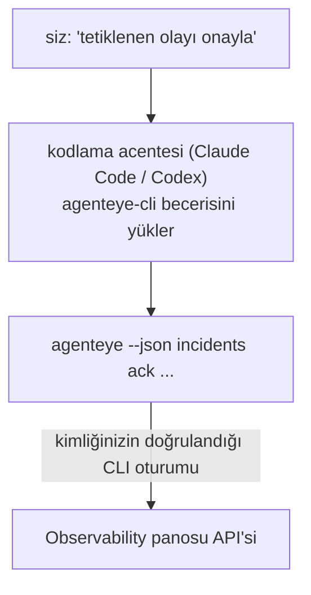

---
---
title: "Failproof AI Observability CLI Agent Skill"
description: "Kodlama acentenize \"bugün bir şey bozuk mu?\" sorusunu sorun ve canlı Failproof AI Observability verilerinizden yanıt alın, ezberlenecek komut yoktur."
---


Kodlama acentenize *"bugün bir şey bozuk mu?"* sorusunu sorun ve canlı Failproof AI Observability verilerinizden yanıt alın. **Failproof AI Observability CLI becerisi** (`agenteye-cli`), bir *Agent Becerisi*dir: bir kodlama acentesi (Claude Code veya Codex gibi) tarafından isteğe bağlı olarak yüklenen küçük bir yönerge klasörü. Acenteyi, [`agenteye` CLI](/tr/agenteye/cli) aracılığıyla Observability dağıtımınızı işletmeyi öğretir; *"CI'a yalnızca etkinlik gönderebilen bir anahtar ver"* veya *"tetiklenen olayı onayla ve bana ata"* gibi düz İngilizce isteklerle.

Bu, bir hizmet veya ayrı bir ikili **değildir**; dağıtılacak hiçbir şey yoktur. Zaten yüklenmiş olduğunuz CLI'nın üzerine oturur: aracı `agenteye --json …`'e çıkarır, temiz JSON'u ayrıştırır ve size düz yazıyla yanıt verir. Yapabileceği her şey, aynı komutları yazarak kendiniz de yapabilirsiniz.

---

## Diğer Failproof AI Observability arayüzleriyle ilişkisi

Failproof AI Observability size aynı verilere ve denetimlere ulaşmak için dört yol sunur. Birbirini tamamlarlar:

| Arayüz | Nedir | Nerede çalışır | Ne zaman kullanılır |
|---|---|---|---|
| **[CLI](/tr/agenteye/cli)** | `agenteye` için komut/bayrak başvurusu | Terminaliniz | Belirli bir komutu çalıştırmak veya betiklemek istediğinizde |
| **[CLI tarifleri](/tr/agenteye/cli-recipes)** | Kopyala-yapıştır `jq`/pipeline desenleri | Terminaliniz / betikler | CLI'yi otomasyona entegre ettiğinizde |
| **CLI becerisi** (bu doküman) | CLI'ye doğal dil ön kapısı | Kodlama acenteniz, iş istasyonunuzda | Sadece sormak ve acentenin komutu seçmesine izin vermek istediğinizde |
| **[Evaluator becerisi](/tr/agenteye/evaluator-skill)** | Puanlama hizmetinizi tasarlamak ve oluşturmak için kardeş beceri | Kodlama acenteniz, iş istasyonunuzda | Puanları okumak yerine *oluşturmak* istediğinizde |
| **[Python SDK becerisi](/tr/agenteye/python-sdk-skill)** | Acentenizi telemetri yayması için enstrüman etmek için kardeş beceri | Kodlama acenteniz, iş istasyonunuzda | Acentenizin bu becerinin okuduğu olayları *üretmesini* istediğinizde |
| **[Panoda yerleşik AI asistanı](/tr/agenteye/assistant)** | Panoda yerleştirilmiş sohbet | Sunucu tarafı (panoda) | Verileriniz üzerinde panoda soru-cevap istediğinizde |

Becerinin kendisinin kendi ayrıcalığı yoktur; yalnızca sözcüklerinizi siz olarak çalışan CLI çağrılarına dönüştürür:



### Panoda yerleşik AI asistanı ile karşılaştırma: önemli bir ayrım

Bunlar çok farklı etki alanlarına sahip iki farklı araçtır:

- **Panoda yerleşik AI asistanı** ([AI asistanı](/tr/agenteye/assistant)), pano tarafından desteklenen panoda yerleştirilmiş bir sohbettir. **Yalnızca okuma artı onay kapısı yazma**'dır: kaydedilmiş sorguları ve panoları taslağını çizebilir, ancak her yazma işlemi açık tıklamanız için duraklatılır ve asla silmez. `agent:use` izni tarafından kapılanır ve yalnızca izlemekte olduğunuz kuruluş için verileri görür.
- **CLI becerisi** *sizin* iş istasyonunuzda *sizin* kodlama acentenizin içinde çalışır ve `agenteye` CLI'nı **siz olarak** yürütür. CLI'nin **tam yüzeyini, değişimleri de içerecek şekilde** gerçekleştirebilir (API anahtarları oluşturma/döndürme/devre dışı bırakma, kuruluş ayarlarını değiştirme, olayları çözme, kaydedilmiş sorguları silme), yalnızca CLI oturum açma izinlerinizle sınırlanır. Bunu, bu komutları elle çalıştıracakmış gibi dikkatle değerlendirin.

---

## Ön koşullar

1. **`agenteye` CLI yüklü** ve `PATH`'te (bkz. [CLI](/tr/agenteye/cli) başvurusu: `pipx install agenteye`).
2. **Pano URL'iniz ayarlanmış** (`AGENTEYE_DASHBOARD_URL` veya aracı `--base-url` geçirir).
3. **Oturum açmış bir oturum**: önce kendiniz `agenteye login` çalıştırın. Beceri e-postayla gelen tek seferlik kodlu oturum açmayı **tamamlayamaz**; oturum eksikse veya süresi dolmuşsa (CLI çıkış kodu `4`) `agenteye login` çalıştırmanızı söyler.

---

## Nereden bulacağınız

Beceri Failproof AI'nın genel beceri koleksiyonunda yayınlanmıştır:

**[github.com/FailproofAI/skills](https://github.com/FailproofAI/skills)** → [`skills/agenteye-cli/`](https://github.com/FailproofAI/skills/tree/main/skills/agenteye-cli)

Hiçbir şey kapılanmamıştır — depo herkese açıktır ve becerinin kendi kimliği gerekmez, çünkü yalnızca **genel** `agenteye` CLI'sini *sizin* pano *kullanarak* siz oturum açtıysanız yürütür. Bunu talep etmek için kimseye sormanız gerekmez.

`pipx install agenteye` paketinin içinde olmadığı için kendi klasörü olarak gelir, bu nedenle orada aramayın.

## Beceriyi yükleme

En hızlı yol [`skills`](https://skills.sh) CLI'sidir; bu, klasörü getirir ve acentenizin aradığı yere bırakır:

```bash
# Claude Code, yalnızca bu proje
npx skills add FailproofAI/skills --skill agenteye-cli -a claude-code

# her proje (~/.claude/skills/ öğesine yükler)
npx skills add FailproofAI/skills --skill agenteye-cli -a claude-code -g --copy

# Bunun yerine Codex
npx skills add FailproofAI/skills --skill agenteye-cli -a codex
```

Ardından bunu başka herhangi bir beceri gibi yönetin:

```bash
npx skills list -a claude-code      # yüklü olanlar
npx skills update agenteye-cli      # en son sürümü çek
npx skills remove agenteye-cli      # kaldır
```

Elle yüklemeyi tercih eder misiniz? Bir Agent Becerisi yalnızca `SKILL.md` içeren (artı isteğe bağlı referanslar) bir klasördür, bu nedenle kopyalama da işe yarar:

- **Claude Code**: `agenteye-cli/` klasörünü `~/.claude/skills/` (her proje) veya `<your-repo>/.claude/skills/` (yalnızca o depo) içine koyun. Claude Code otomatik olarak keşfeder — `/skills` listesi ile doğrulayın veya açıklaması eşleşen bir soru sorun.
- **Codex (OpenAI)**: Codex aynı `SKILL.md` öğesini okur. Paketlenmiş `agents/openai.yaml`, `allow_implicit_invocation: true` öğesini ayarlar, bu nedenle Codex bir görev eşleştiğinde beceriyi otomatik olarak seçer; aksi takdirde `$agenteye-cli` olarak açıkça çağırın.

---

## Güvenlik: aracı CLI çalıştırdığında değişiklikler uyarı VERMEZ

> **Uyarı:** Bir acenteye değişiklik yapmasına izin vermeden önce bunu okuyun.

`agenteye` CLI normalde yıkıcı bir işlemden önce *"emin misiniz?"* sorar. **Her zaman bir terminale bağlı olmadığında (bu tam olarak bir kodlama acentesinin bunu çalıştırma şeklidir) bu onayı otomatik olarak atlar ve `--json` de atlar.** Bu nedenle güvenlik isteği aracı için **ateşlenmez**.

Beceri bunu telafi etmek için yazılmıştır: tam olarak çalıştıracağı komutu belirtmesi ve herhangi bir durum değişikliğinden önce açık **Tamam** almanız talimatı verilir. Bu disiplini koruyu. Failproof AI Observability'yi bir aracı aracılığıyla yürüttüğünüzde, *siz* onay adımısınız. İzlenecek durum değiştirici komutlar:

- `keys create` / `update` / `disable` / `regenerate`
- `users create` / `update` / `disable` / `enable`
- `settings set`
- `alerts create` / `update` / `delete` / `test`
- yazma `incidents` alt komutları: `ack` / `assign` / `resolve` / `open` / `comment-add` / `comment-delete` / `subscribe` / `unsubscribe`
- `query create` / `update` / `delete`
- `agent rename` / `delete`
- `orgs switch`

**Gözlemle** altındaki her şey (`events`, `sessions`, `evals`, `errors`, `list`, `whoami`, `orgs list/current/perms`) yalnızca okunur ve hiçbir şeyi değiştirmez.

Aracı **siz** olarak hareket ettiğinden, yalnızca oturum açma işleminizin yapmasına izin verdiği şeyleri yapabilir; izinler **kuruluş başına** çözülür (bkz. [API anahtarları](/tr/agenteye/api-keys)). İznin olmadığınız komut, tam izin adıyla çıkış kodu `5` döndürür, bu nedenle aracı hata almak yerine tam olarak ne talebinde bulunacağınızı söyleyebilir.

---

## Ne isteyebilirsiniz

İşte gerçek bir gidiş-dönüş, bir okuma, ardından onayınız için bekleyen bir değişiklik:

```text
siz    ▸ Son gün içinde bir şey bozuk mu?

aracı  ▸ Çalışıyor: agenteye --json errors --since 24h --aggregate
         Son 24 saatte 3 hata türü. En büyüğü TimeoutError
         (18 isabet, hepsi checkout-agent'te), sonra RateLimited (5).
         TimeoutError için başarısız oturumları istemiş misiniz?

siz    ▸ CI'a yalnızca etkinlik gönderebilen bir anahtar ver.

aracı  ▸ Bu bir API anahtarı oluşturur. Şunu çalıştıracağım:
          agenteye keys create ci --add events:add
         Devam etmek OK mi?

siz    ▸ evet

aracı  ▸ Bitti. "ci" anahtarı yalnızca events:add ile oluşturuldu.
         Gizli yalnızca bir kez gösterilir, bu nedenle şimdi saklayın. Yeniden yazdıramam.
```

Beceri, her düz dil niyetini doğru `agenteye` komutuna eşler; geçerli değerleri ilk olarak keşfeder (`list <kind>`, `whoami`), böylece tahmin etmez ve herhangi bir değişiklikten önce tam komutu belirtir. Daha fazla örnek:

- *"Son 24 saatte bir şey bozuk / başarısız mı?"* → `errors --since 24h --aggregate`, ardından bir döküm.
- *"Oturum `run-001` neden başarısız oldu?"* → `events --session-id run-001 --all` + `evals --session-id run-001`.
- *"Bu hafta kalite nasıl ilerliyor?"* → `evals --aggregate --since 7d`, ardından düşük puanlamış çalıştırmaları deton et.
- *"CI'a yalnızca etkinlik gönderebilen bir anahtar ver."* → `keys create ci --add events:add` (komutu belirtir, ardından oluşturur ve tek seferlik gizliyi yakalar).
- *"Kimlerin erişimi var? Dana'yı salt okunur yap."* → `users list` → `users update dana@… --permission-set read-only` (sizinle onayladıktan sonra).
- *"Tetiklenen olayı onayla ve bana ata."* → `incidents list --state firing` → `incidents ack <id>` / `incidents assign <id> you@…`.

Bunların arkasındaki kesin komutlar, bayraklar ve JSON şekilleri için bkz. [CLI](/tr/agenteye/cli) başvurusu ve [aracılar için CLI tarifleri](/tr/agenteye/cli-recipes).

---

## Sonraki adımlar

- **[CLI](/tr/agenteye/cli)**: `agenteye` için tam komut ve bayrak başvurusu.
- **[Aracılar için CLI tarifleri](/tr/agenteye/cli-recipes)**: kopyala-yapıştır `jq` desenleri ve çıkış kodu işleme.
- **[Evaluator aracı becerisi](/tr/agenteye/evaluator-skill)**: kardeş beceri, `agenteye evals` öğesinin okuduğu puanlayıcıyı oluşturmak için.
- **[Python SDK aracı becerisi](/tr/agenteye/python-sdk-skill)**: kardeş beceri, acenteyi `agenteye` öğesinin okuduğu telemetri yayması için enstrüman etmek için.
- **[AI asistanı](/tr/agenteye/assistant)**: panoda yerleşik asistan (bu terminal becerisinden karıştırılmaması için).
- **[API anahtarları](/tr/agenteye/api-keys)**: becerinin yapabileceğini sınırlandıran kuruluş başına izin modeli.