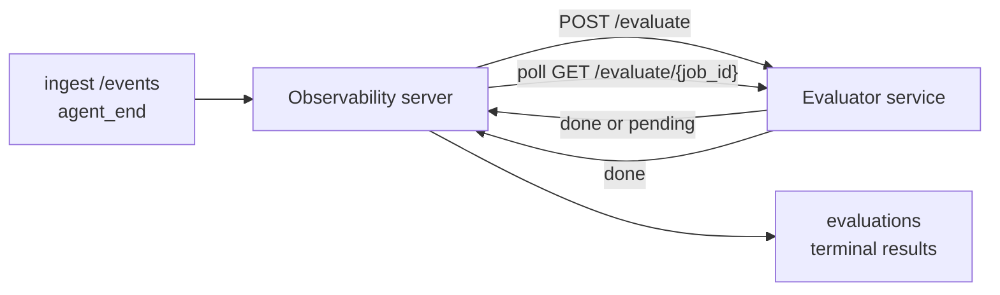

Failproof AI Observability, tamamlanan her agent çalıştırmasını otomatik olarak kalite açısından puanlandırabilir: siz küçük bir puanlama hizmeti sağlarsınız, Observability geriye kalan her şeyi yönetir. Önem verdiğiniz boyutları izlemek için (yararlılık, araç verimliliği, doğruluk, güvenlik; siz seçersiniz), gerilemeyi erkenden yakalamak ve agentları ya da ortamları bir bakışta karşılaştırmak için kullanın. Puanlama isteğe bağlıdır: sunucuda `EVALUATOR_ENDPOINT` ayarlanana kadar ardışık işlem hiçbir şey yapmaz.

> **Not:** Puan boyutlarını siz tanımlarsınız. Değerlendiriciler istediği herhangi bir sayısal anahtar döndürebilir; Observability geri gönderdiğiniz her şeyi saklar, trendi oluşturur ve gösterir.

## Bir bakışta

1. **Bir değerlendirici yazın.** Oturum transkriptini okuyan ve puanları döndüren küçük bir HTTP hizmeti kurun. Observability kopyalayabileceğiniz çalışan bir referans ile birlikte gelir. Bkz. [SDK ile evaluator yazma](#writing-an-evaluator-with-the-sdk).
2. **Observability'yi işaret edin.** Sunucu işleminde `EVALUATOR_ENDPOINT` (ve paylaşılan `EVALUATOR_TOKEN`) ayarlayın.
3. **Puanların gelmesini izleyin.** Tamamlanan her oturum otomatik olarak puanlandırılır; sonuçlar oturum detay sayfasında, oturumlar ızgarasında ve kaydedilmiş panolarda görünür.


*Bir evaluator yapılandırıldıktan sonra, her tamamlanan çalıştırma puanlandırılır ve sonuçlar oturumun sağ panelinde görünür: üstte özet, ardından gerekçeli boyut başına puan çubukları.*

---

## Nasıl çalışır?



Observability SDK bir oturum için `agent_end` olayı yayınladığında, sunucu bir değerlendirme zamanlar. Ardından tam olay transkriptini değerlendirici hizmetinize POST gönderir ve bu hizmet şunlardan birini yapabilir:

- **Sonucu satır içi döndürün** `{"status":"done", "scores":{...}, "reasoning":{...}, "summary":"..."}` ile. Sonuç oturumun değerlendirme zaman çizelgesine eklenir. `reasoning` ve `summary` isteğe bağlıdır.
- **Ertele** `{"status":"pending", "job_id":"abc-123"}` ile. Observability daha sonra `GET {EVALUATOR_ENDPOINT}/evaluate/abc-123` öğesini çağırır ve değerlendiricin `{"status":"done", ...}` ya da `{"status":"error", "error":"..."}` döndürene kadar devam eder.

  Yoklama hızı iş başına yapılır: `pending` yanıt isteğe bağlı olarak `next_poll_secs` içerebilir; aksi takdirde Observability `GET /config` öğesinden `default_poll_interval_secs` değerini kullanır; aksi takdirde sunucu `EVALUATOR_POLLING_INTERVAL_SECS` değerine geri döner (varsayılan 10s). Tüm değerler [1s, 1h] aralığına klampe edilir.

Hiçbir zaman `agent_end` yayınlamayan oturumlar (örneğin, çöken bir agent işlemi) da alınabilir: değerlendiricinin `GET /config` öğesi `{"inactivity_timeout_secs": 1800}` döndürebilir ve Observability bu kadar uzun süredir boşta kalmış herhangi bir oturumu değerlendirir. Bu geri dönüş yöntemi devre dışı bırakmak için alanı `null` veya atla ayarlayın.

`EVALUATOR_ENDPOINT` ayarlanmadığında ardışık işlem tamamen no-op'tur.

Bir oturum zaman içinde **birden çok terminal değerlendirme** biriktirebilir: her `agent_end` olayı (ve panodaki her manuel yeniden değerlendirme) yeni bir değerlendirme satırı ekler. Bu, devam eden bir konuşmayı değerlendirmenin desteklenen yoludur: bir kullanıcı ajanı sona erdirir, daha sonra geri gelir, daha fazla olay gönderir, ajanı tekrar sona erdirir ve ikinci bir değerlendirme tam güncellenmiş transkripte karşı çalışır. Pano en son değerlendirmeyi başlık olarak ve önceki değerlendirmeleri daraltılabilir bir zaman çizelge olarak oluşturur. Bir oturum için bir değerlendirme çalışırken, o oturum için ek `agent_end` olayları yoksayılır; çalışan değerlendirme tamamlandıktan sonraki olay, zamanki gibi yeni bir değerlendirmeyi sıraya alır.

Hareketsizlik geri dönüşü de devam eden oturumlarda yeniden harekete geçer: yeni olaylar önceki bir terminal değerlendirmeden sonra gelirse ve oturum daha sonra `inactivity_timeout_secs` boyunca boşta kalırsa, yeni bir değerlendirme sıraya alınır.

Geçici arızalar (5xx, 429, zaman aşımları, ağ hataları) `EVALUATOR_MAX_ATTEMPTS` kadar üstel geri tepme ile yeniden denenir; 4xx yanıtları terminaldir. Observability birden çok yatay olarak ölçeklendirilmiş sunucu örneğiyle çalıştırılmak güvenlidir; iş bölümlendirilir, böylece aynı oturum hiçbir zaman eşzamanlı olarak iki kez gönderilmez.

---

## HTTP sözleşmesi

Her kimliği doğrulanmış rota **taşıyıcı belirteci kimlik doğrulamasını** kullanır. Aynı değer her iki tarafta da yapılandırılmalıdır:

- Observability sunucusu: ortam değişkeni `EVALUATOR_TOKEN`
- Evaluator hizmeti: aynı şekilde yapılandırılmış (agenteye-evaluator SDK'sı kural olarak `EVALUATOR_TOKEN` öğesini okur)

`EVALUATOR_TOKEN` ayarlanmamışsa, sunucu `Authorization` başlığı göndermez; değerlendirici daha sonra anonim istekleri kabul edebilir, bu da yalnızca dahili bir ağ için uygun olsa da genel internet üzerinde önerilmez.

### Değerlendiricinin sunması gereken yollar

| Yol | Gövde / parametreler | Yanıt |
|---|---|---|
| `GET /health` | yok | `{"status":"ok"}` (açık, kimlik doğrulaması yok) |
| `GET /config` | yok | `{"inactivity_timeout_secs": <int> \| null, "default_poll_interval_secs": <int> \| atlandı}` |
| `POST /evaluate` | `EvalRequest` JSON | `{"status":"done", ...}` ya da `{"status":"pending", "job_id":"..."}` |
| `GET /evaluate/{id}` | yok | `/evaluate` ile aynı yanıt şekli |

### Sunucu tarafından gönderilen `EvalRequest` gövdesi

```json
{
  "schema_version": "1",
  "session_id":     "session-abc123",
  "agent_id":       "planner",
  "environment":    "production",
  "started_at":     "2026-05-10T12:00:00Z",
  "ended_at":       "2026-05-10T12:05:00Z",
  "events": [
    { "id": 1234, "ts": "...", "event_type": "agent_start", "payload": { ... } },
    ...
  ]
}
```

### Yanıt şekilleri

**Eşzamanlı (tamamlandı):**

```json
{
  "status": "done",
  "scores": { "helpfulness": 0.85, "tool_efficiency": 0.6 },
  "reasoning": {
    "helpfulness": "answered the question directly with citations",
    "tool_efficiency": "called list_files three times when one would have done"
  },
  "summary": "strong answer quality, weak tool selection"
}
```

`reasoning` (puan başına gerekçe haritası) ve `summary` (genel bir paragraf anlatı) her ikisi de isteğe bağlıdır. `reasoning` içindeki anahtarlar `scores` içindeki anahtarları yansıtmalıdır; pano her girişi puan çubuğunun altında satır içi olarak oluşturur. Yalnızca `scores` döndüren eski değerlendiriciler değişmeden çalışmaya devam eder; `reasoning` ve `summary` basitçe null olarak okunur ve ilgili UI olanakları atlanır.

**Eşzamansız (ertelendi):**

```json
{ "status": "pending", "job_id": "abc-123", "next_poll_secs": 30 }
```

`next_poll_secs` isteğe bağlıdır; atlanırsa sunucu değerlendiricinin `default_poll_interval_secs` öğesine `/config` adresinden geri döner, ardından kendi `EVALUATOR_POLLING_INTERVAL_SECS` ortam değişkenine döner.

**Terminal evaluator tarafı hatası:**

```json
{ "status": "error", "error": "model service unavailable" }
```

Sunucu diğer 2xx gövdelerine protokol hatası olarak davranır ve oturum için terminal `error` kaydeder.

---

## SDK ile evaluator yazma

HTTP sözleşmesini elle uygulamak zorunda değilsiniz. `agenteye-evaluator` Python paketi, kimlik doğrulama, yönlendirme ve istek/yanıt şekillerini sizin için işleyen yazılı bir FastAPI sarmalayıcısı sağlar.

Failproof AI Observability ayrıca transkriptin şeklinden `helpfulness` (yararlılık), `tool_efficiency` (araç verimliliği) ve `factuality` (doğruluk) puanlandıran **çalışan bir referans evaluator** ile birlikte gelir. Başlangıç noktası olarak kopyalayın ve kendi mantığınızı değiştirin: bir LLM yargıcı, bir kural motoru, kalite standardınıza uygun her şey.

En az uygulanabilir evaluator:

```python
import os
from agenteye_evaluator import Evaluator, EvalRequest, EvalResponse

app = Evaluator(token=os.environ["EVALUATOR_TOKEN"])

@app.evaluator
def run(req: EvalRequest) -> EvalResponse:
    # req.events (tam oturum transkripti) inceleyin ve puanları döndürün.
    tool_calls = sum(1 for e in req.events if e.event_type == "tool_use")
    return EvalResponse(
        scores={"tool_calls": float(tool_calls)},
        reasoning={"tool_calls": f"{tool_calls} tool invocations in the transcript"},
        summary="tight tool loop" if tool_calls < 5 else "agent looped on tools",
    )
```

`app` örneği herhangi bir ASGI sunucusu altında çalışır, bu nedenle `uvicorn module:app` başlatır.

Pahalı işi ertelemeye ihtiyaç duyan değerlendiriciler için, bunun yerine `JobPending` döndürün ve `@app.job_lookup` işleyicisi kaydedin; Observability sunucusu `GET /evaluate/{job_id}` öğesini `EVALUATOR_MAX_POLL_DURATION_SECS` başlığı (varsayılan 1 s) sona erinceye kadar terminal durumu döndürene kadar yoklar.

Tam API başvurusu, eşzamansız desen ve olay şeması `agenteye-evaluator` SDK'sının README'sinde belgelenmiştir.

---

## Evaluator'unuzu çalıştırma

Evaluator **sizin hizmetinizdir** — Failproof AI Observability varsayılan bir evaluator ile birlikte gelmez, bu nedenle kendi hizmetlerinizi çalıştırdığınız yerde kurar ve çalıştırırsınız. Herhangi bir ASGI sunucusu altında çalışır (örneğin `uvicorn my_evaluator:app`); [HTTP sözleşmesinden](#http-contract) `/health`, `/config` ve `/evaluate` yollarını sunun, ardından sunucuyu işaret edin (bkz. [Sunucuyu yapılandırma](#configuring-the-server)).

Evaluator ulaşılabilir olduğunda, `GET /health` `{"status":"ok"}` döndürür. Bir agent uçtan uca çalıştıktan sonra, sunucudaki `GET /evaluations` puanlarınızı değerlendiricinin ürettiği `status: "done"` ve puanlarla bir satır döndürür.

---

## Sunucuyu yapılandırma

Sunucu işleminde ayarlayın:

| Ortam değişkeni | Anlamı |
|---|---|
| `EVALUATOR_ENDPOINT` | Evaluator'unuzun temel URL'si (`http://evaluator:9000`). Ayarlanmadı = ardışık işlem devre dışı. |
| `EVALUATOR_TOKEN` | Taşıyıcı belirteci. Evaluator hizmetinin yapılandırıldığı değere eşit olmalıdır. |
| `EVALUATOR_WORKERS` | Sunucu örneği başına çalışan görevleri (varsayılan 2). |
| `EVALUATOR_CLAIM_BATCH` | Çalışan başına talep edilen satırlar (varsayılan 4). Toplar **eşzamanlı olarak** işlenir; evaluator uç noktanız üzerinde etkin eşzamanlılık `EVALUATOR_WORKERS × EVALUATOR_CLAIM_BATCH` şeklindedir. |
| `EVALUATOR_POLL_IDLE_SECS` | Hiçbir değerlendirme vadesi olmadığında çalışanın gönderim girişimleri arasında uyuduğu süre (varsayılan 2s). |
| `EVALUATOR_POLLING_INTERVAL_SECS` | `GET /evaluate/{id}` hızı için nihai geri dönüş, ne per-response `next_poll_secs` ne de evaluator'un `default_poll_interval_secs` ayarlandığında (varsayılan 10s). |
| `EVALUATOR_REQUEST_TIMEOUT_MS` | İstek başına zaman aşımı (varsayılan 30000). |
| `EVALUATOR_MAX_ATTEMPTS` | Bu kadar geçici arızadan sonra sonuç terminal `error` olarak kaydedilir (varsayılan 5). |
| `EVALUATOR_CONFIG_REFRESH_SECS` | `GET /config` hızı (varsayılan 300). |
| `EVALUATOR_MAX_POLL_DURATION_SECS` | Bir oturumun yoklama kuyruğunda kalabileceği maksimum duvar saati zamanı, `timeout` olarak sonlandırılmadan önce (varsayılan 3600s). Sonsuza kadar `pending` döndüren bir evaluator'a karşı koruma. |

Otomatik puanlamayı etkinleştirmek için, sunucuda hem `EVALUATOR_ENDPOINT` hem de `EVALUATOR_TOKEN` ayarlayın, ardından değişikliği almak için yeniden başlatın. `EVALUATOR_ENDPOINT` ayarlanmadığında ardışık işlem no-op kalır.

Yukarıdaki tuning düğmeleri isteğe bağlıdır; varsayılanları geçersiz kılmanız gerekirse, yalnızca karşılık gelen ortam değişkenlerini sunucuda ayarlayın.

---

## API başvurusu

| Yöntem | Yol | Gerekli izin | Amaç |
|---|---|---|---|
| `GET` | `/evaluations` | `evaluations:read` | Terminal sonuçlarını sorgula. `session_id`, `agent_id`, `environment`, `status` (`done`/`error`/`timeout`), `ts_from`, `ts_to`, `cursor`, `limit`, `score_filters`, `latest_per_session` öğesini destekler. `limit` varsayılan olarak 50 ve 200 ile sınırlandırılır (`/events` ile fark, 1000 ile sınırlandırılır). `environment` virgülle ayrılmış bir liste kabul eder (örn. `environment=prod,staging`); tek değerler yine de çalışır. `latest_per_session=true` ile yanıt en fazla `session_id` başına bir satır içerir (`completed_at` ile en son) oturumlar listesi sayfası tarafından kullanılan bir oturumun değerlendirme zaman çizelgesini geçerli başlığına daraltmak. Varsayılan olarak false (tam geçmiş döndürür). |
| `GET` | `/evaluations/aggregate` | `evaluations:read` | Filtrelenmiş bir dilim için yukarı doğru değerlendirme sağlığı: toplam sayı, done/error/timeout dökümü, puan başına anahtar istatistikleri (count/avg/min/max/p50 rasgele `scores` anahtarları üzerinde) ve zaman tabanlı bir zaman çizelge. `/evaluations` ile **aynı filtre parametrelerini** artı `featured_keys` (trend yapılacak puan anahtarlarının CSV'si) ve `latest_per_session` kabul eder. Panolar özelliğini güçlendirir; metrikler örneklenmemiş, tüm eşleşen küme üzerinden kesindir. |
| `GET` | `/evaluations/environments` | `evaluations:read` | `evaluations` tablosundan farklı ortam değerleri. Değerlendirme tarafından okunabilen verilere kapsamlı filtre açılır listelerini doldurmak için kullanılır. |
| `GET` | `/evaluation-jobs` | `evaluations:read` | Uçuş içi değerlendirmelere görünürlük. `status` (`pending`/`polling`) tarafından filtreleyin. |
| `GET` | `/events` | `events:read` | Bir oturumun ham olaylarını akışla aktarın. `session_id`, `agent_id`, `event_type` (CSV), `environment` (CSV), `ts_from`, `ts_to`, `cursor`, `limit` ve `order` öğesini destekler. `order` `desc` (en yeniden ilk, varsayılan) veya `asc` (en eskiden ilk); tanınmayan bir değer `desc` öğesine geri döner. Yanıtın `next_cursor` (bir olay id) aracılığıyla imleç-sayfalandır: sonraki sayfayı almak için `cursor` olarak geri geçirin; `asc` ile sonraki sayfa bu id'den sonraki olaylar, `desc` ile bu kimlikten önceki olaylardır. `limit` varsayılan olarak 50 ve 1000 ile sınırlandırılır. |
| `GET` | `/sessions/:session_id/export` | `events:read` | Evaluator'un bu oturum için alacağı tam JSON gövdesini döndürür ve `session-<id>.json` adlı indirilebilir bir ek olarak sunulur. Üretim oturumlarını çevrimdışı testler için `agenteye-evaluator` aracılığıyla yeniden oynatmak için kullanışlıdır. Baytlar evaluator ardışık işleminin gönderdiği şeylerle byte-özdeş olur. |
| `POST` | `/sessions/:session_id/re-evaluate` | `evaluations:trigger` | Bir oturum için yeni bir değerlendirme kuyruğa al; önceki bir değerlendirme olup olmadığına bakılmaksızın çalışır. Yeni sonuç önceki satırın üzerine yazılmak yerine oturumun değerlendirme zaman çizelgesine **eklenir**, bu nedenle önceki puanlar tarih olarak görünür kalır. Kuyruğa alınırsa `202` döndürür, bilinmeyen bir oturum için `404` döndürür, bir değerlendirme zaten uçuş halindeyse `409` döndürür. Bunu yeni bir evaluator'u dağıttıktan sonra veya hiçbir zaman `agent_end` yayınlamayan oturumlar için kullanın. |

### Puan aralığına göre filtreleme: `score_filters`

`GET /evaluations`, `scores` nesnesi içindeki sayısal değerlere göre sonuçları daraltacak isteğe bağlı bir `score_filters` parametresi kabul eder. Parametre, virgülle ayrılmış `key:min..max` girdilerinin bir listesidir; her iki sınır da atlanabilir. Birden çok giriş mantıksal AND ile birleşir. Adlandırılmış anahtarı olmayan veya sayısal olmayan satırlar hariç tutulur. İstek en fazla 20 filtre girişi taşıyabilir; aşılması HTTP 400 döndürür.

Örnekler:
```text
# helpfulness [0.5, 0.8] içinde
GET /evaluations?score_filters=helpfulness:0.5..0.8

# tool_efficiency en fazla 0.3 (alt sınır yok)
GET /evaluations?score_filters=tool_efficiency:..0.3

# helpfulness >= 0.5 AND factuality >= 0.9
GET /evaluations?score_filters=helpfulness:0.5..,factuality:0.9..
```

Her `/evaluations` yanıt nesnesinin bu alanları vardır:

| Alan | Tür | Notlar |
|---|---|---|
| `evaluation_id` | string (UUID) | Bu terminal değerlendirme için kanonik kimlik. Her terminal değerlendirme yeni bir UUID alır; tek bir oturum birden çok tutuculabilir. |
| `id` | string (UUID) | `evaluation_id` ile aynı değeri taşıyan geriye dönük uyumluluk takma adı. |
| `session_id` | string | Bu değerlendirmenin karşı koştuğu oturum. Bir oturum zaman çizelgede birden çok değerlendirme yapabilir. |
| `agent_id` | string | Oturumu üreten ajanı tanımlar. |
| `environment` | string | Oturumdan kopyalanan ortam etiketi. |
| `status` | enum | Biri `"done"`, `"error"`, `"timeout"`. |
| `scores` | object \| null | Değerlendiricinin döndürdüğü puanlar. |
| `reasoning` | object \| null | Değerlendiricinin döndürdüğü isteğe bağlı puan başına gerekçe haritası. Anahtarlar tipik olarak `scores` içindekileri yansıtır. Pano her girişi puan çubuğunun altında oluşturur. |
| `summary` | string \| null | Değerlendiricinin döndürdüğü isteğe bağlı bir paragraf genel anlatı. Pano bunu puan başına dökümün üzerinde değerlendirmenin başlığı olarak oluşturur. |
| `error` | string \| null | Yalnızca `"error"` / `"timeout"` üzerinde doldurulur. |
| `attempt_count` | integer | Gönderim denemelerinin sayısı (≥ 1). |
| `duration_ms` | integer \| null | Son denemesinin süresi. |
| `completed_at` | string (ISO 8601 UTC) | Terminal sonuç kaydedildiğinde. Sonuçlar `completed_at` (en yeniden ilk) ile sıralanır. |
| `created_at` | string (ISO 8601 UTC) | `completed_at` ile aynı zaman damgasını taşır (bir kez yazma semantiği). |

---

## İzinler

| İzin | Hibe |
|---|---|
| `evaluations:read` | Değerlendirme sonuçlarını listele, panoda puanları görüntüle ve pano sağlık metriklerini yükle. |
| `evaluations:trigger` | `POST /sessions/:session_id/re-evaluate` aracılığıyla veya panodaki yeniden değerlendirme düğmesinden bir oturum için değerlendirmeyi manuel olarak kuyruğa al. |
| `dashboards:read` | Kaydedilmiş panoları görüntüle (metriklerini yüklemek için `evaluations:read` da gerekli). |
| `dashboards:write` | Panoları oluştur ve düzenle. |
| `dashboards:delete` | Panoları sil. |

Önyükleme yöneticisi (`ADMIN_KEY`, `ADMIN_EMAIL`) otomatik olarak bunların hepsini alır.

---

## Sonuçları görüntüleme

- **`/sessions/<id>`**: olaylar zaman çizelgesi + oturumun puanlarını ve gönderim denemesinden herhangi bir hatayı gösteren sağ ray. Anahtarınız `evaluations:trigger` öğesine sahipse, bir **yeniden değerlendirme** düğmesi ihracat düğmesinin yanında görünür; bu hiçbir zaman `agent_end` yayınlamayan oturumlar veya yeni bir evaluator dağıttıktan sonra puanları yenileştirmek için kullanışlıdır. Pano yeni sonuç için yoklar ve sağ ray güncellenir.
- **`/sessions`**: filtrelenebilir oturum ızgarası; puan sütunu her oturumun değerlendirme durumunu ve puanlarını bir bakışta gösterir.
- **`/dashboards`**: kaydedilmiş eval-sağlık görünümleri (bkz. [Panolar](#dashboards) aşağıda).


*Oturumlar ızgarası her çalıştırmanın değerlendirme durumunu ve puanlarını bir bakışta gösterir; kırmızı/sarı/yeşil rozetler düşük puanları fark ettirir.*

---

## Panolar

**Panolar** sayfası (`/dashboards`), değerlendirme filtrelerinin bir kombinasyonunu adlandırılmış, yeniden kullanılabilir bir görünüm olarak kaydetmenizi ve o değerlendirme diliminin nasıl olduğunu bir bakışta izlemenizi sağlar. Panolar **tüm kuruluşunuz arasında paylaşılır**; `dashboards:read` öğesi olan herkes aynı seti görür.

Her pano şunları işaret eder:

- **Filtreler**: oturumlar sayfasıyla aynı kontroller: ortam, durum, ajan, dönen bir zaman penceresi ve puan aralığı filtreleri (`key:min..max`).
- **Bir görüntü yapılandırması**: hangi puan anahtarlarının öne çıkarılacağı, yeşil/sarı/kırmızı sağlık eşikleri, hangi panelların gösterildiği ve en son oturumun oturum başına daraltılıp daraltılmayacağı.

Her kart eşleşen oturum sayısını, done/error/timeout dökümünü, her özellikli puanın ortalamasını ve küçük bir trend mini grafiğini gösterir. Bir pano açılması tam boyutlu paneleri gösterir; **"oturumlarda aç"** sizi bu dilime tam olarak önceden filtrelenmiş oturumlar sayfasına bırakır. Metrikler sunucu tarafı üzerinden hesaplanır (via `GET /evaluations/aggregate`), bu nedenle sayılar örneklenmemiş yerine kesindir.


**İzinler:** görüntülenme hem `dashboards:read` hem de `evaluations:read` gerektirir; oluşturma ve düzenleme `dashboards:write` gerektirir; silme `dashboards:delete` gerektirir. Önyükleme yöneticisi bunların hepsini otomatik olarak alır.

---

## Sorun giderme

**Oturumlar var ama değerlendirme oluşturulmamış.** Sunucu işleminde `EVALUATOR_ENDPOINT` ayarlandığını, sunucunun ve evaluator'un aynı `EVALUATOR_TOKEN` değerini paylaştığını ve evaluator'un `/health` uç noktasının sunucudan ulaşılabilir olduğunu doğrulayın. `EVALUATOR_ENDPOINT` ayarlanmadığında ardışık işlem no-op'tur.

**Uçuş içi değerlendirmeler birikir.** Uçuş içi kuyruğu görmek için `GET /evaluation-jobs` sorgulayın. Her satırda `attempt_count`, `next_attempt_at` ve `last_error` inceleyin. Yaygın nedenler: evaluator hizmeti ulaşılamaz veya 5xx döndürüyor (geri tepme ile yeniden denenmiş), yanlış `EVALUATOR_TOKEN` (401 terminaldir) veya `pending` sonsuza kadar döndüren eşzamansız bir evaluator (bkz. aşağıda).

**Oturumlar tamamlandı ama terminal değerlendirme yok.** `GET /evaluation-jobs?status=polling` öğesini sorgulayın; sonuç hala uçuş halinde olabilir. Bir iş `pending` konumunda takılıysa, sunucu evaluator'a ulaşmakta sorun yaşıyor; evaluator'un açık olduğunu ve `EVALUATOR_TOKEN` eşleştiğini kontrol edin.

**Evaluator'dan `HTTP 401: geçersiz taşıyıcı belirteci`.** Sunucudaki `EVALUATOR_TOKEN` evaluator hizmetinin yapılandırıldığı değerle eşleşmiyor. Aynı olmalıdırlar.

**Eşzamansız evaluator sonsuza kadar `pending` döndürüyor.** Sunucu `GET /evaluate/{job_id}` yoklar, evaluator `done` veya `error` döndürene kadar veya `EVALUATOR_MAX_POLL_DURATION_SECS` (varsayılan 1 s) sona erinceye kadar. Başlığın ardından değerlendirme `timeout` olarak kaydedilir ve uçuş içi kuyruktan çıkarılır. Evaluator'unuz varsayılandan daha uzun süre gerçekten ihtiyaç duyuyorsa `EVALUATOR_MAX_POLL_DURATION_SECS` yükseltin.

---

## Sonraki adımlar

- [Evaluator agent becerisi](/tr/agenteye/evaluator-skill): boyutlarınızı gerçek oturumları tasarlamak ve bu hizmeti sizin için oluşturmak için bir kodlama ajanı var.
- [Python SDK](/tr/agenteye/python-sdk): puanlamayı tetikleyen `agent_end` olaylarını yayın.
- [API anahtarları](/tr/agenteye/api-keys): `evaluations:read` ve `evaluations:trigger` izinleri.
- [Denetimler](/tr/agenteye/audits): Observability'nin diğer otomatik kalite özelliği, politika tabanlı gözden geçirme için.