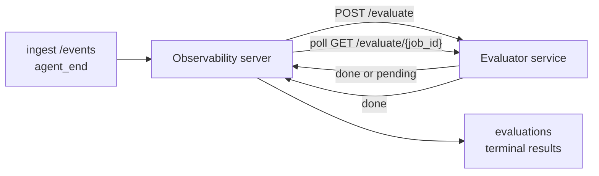

Failproof AI Observability, tamamlanan her agent çalıştırmasını kalite açısından otomatik olarak puanlandırabilir: küçük bir puanlama hizmeti sağlarsınız, Observability geri kalanını halleder. Önem verdiğiniz boyutları izlemek için kullanın (yararlılık, araç verimliliği, gerçeklik, güvenlik; siz seçin), gerillemeleri erken yakala ve ajanları veya ortamları bir bakışta karşılaştırın. Puanlama isteğe bağlıdır: ardışık düzen sunucuda `EVALUATOR_ENDPOINT` ayarlamadığınız sürece hiçbir işlem yapmaz.

> **Not:** Puan boyutlarını siz tanımlarsınız. Değerlendiricininiz istediği herhangi bir sayısal anahtarı döndürebilir; Observability, geri gönderdiğiniz her şeyi depolar, trendi izler ve görüntüler.

## Bir bakışta

1. **Bir puanlayıcı yazın.** Bir oturum transkriptini okuyan ve puanları döndüren küçük bir HTTP hizmeti kurun. Observability, kopyalayabileceğiniz çalışan bir referans görevli gelir. Bkz. [SDK ile Değerlendirici Yazma](#sdk-ile-bir-değerlendirici-yazma).
2. **Observability'yi işaret ettirin.** Sunucu işleminde `EVALUATOR_ENDPOINT` (ve paylaşılan `EVALUATOR_TOKEN`) ayarlayın.
3. **Puanları izleyin.** Tamamlanan her oturum otomatik olarak puanlanır; sonuçlar oturum ayrıntı sayfasında, oturumlar ızgarasında ve kaydedilmiş panolarda gösterilir.


*Bir değerlendirici yapılandırıldıktan sonra, tamamlanan her çalıştırma puanlanır ve sonuçlar oturumun sağ kısmında görünür: üstte özet, ardından boyut başına puan çubukları ve akıl yürütme.*

---

## Nasıl çalışır



Observability SDK bir oturum için `agent_end` olayı yayınladığında, sunucu bir değerlendirme zamanlar. Ardından tam olay transkriptini değerlendirici hizmetinize gönderir ve bu hizmet şunlardan biri yapabilir:

- **Sonucu satır içinde döndürün** `{"status":"done", "scores":{...}, "reasoning":{...}, "summary":"..."}` ile. Sonuç, oturumun değerlendirme zaman çizelgesine eklenir. `reasoning` ve `summary` isteğe bağlıdır.
- **Erteleyin** `{"status":"pending", "job_id":"abc-123"}` ile. Observability daha sonra değerlendiricininiz `{"status":"done", ...}` veya `{"status":"error", "error":"..."}` döndürünceye kadar `GET {EVALUATOR_ENDPOINT}/evaluate/abc-123` öğesini çağırır.

  Yoklama tempo'su iş başına: bir `pending` yanıt `next_poll_secs` içerebilir; aksi takdirde Observability `GET /config` öğesinden `default_poll_interval_secs` değerini kullanır; aksi takdirde sunucu `EVALUATOR_POLLING_INTERVAL_SECS` (varsayılan 10s) öğesine geri döner. Tüm değerler [1s, 1h] aralığına sabitlenir.

`agent_end` yayan hiç oturum (örneğin, kilitlenmek agent işlemi), değerlendirici'nin `GET /config` öğesi `{"inactivity_timeout_secs": 1800}` döndürebilir ve Observability, bu kadar uzun süredir boş kalan herhangi bir oturumu değerlendirir. Bu geri dönüşü devre dışı bırakmak için alanı `null` olarak ayarlayın veya atlayın.

Ardışık düzen, `EVALUATOR_ENDPOINT` ayarlanmadığında tam olarak no-op'dır.

Bir oturum zaman içinde **birden çok terminal değerlendirmesi biriktirebilir**: her `agent_end` olayı (ve panodan her manuel yeniden değerlendirme) yeni bir değerlendirme satırı ekler. Bu, devam eden bir konuşmayı değerlendirmenin desteklenen yoludur: bir kullanıcı agent'ı sonlandırır, daha sonra geri gelir, daha fazla olay gönderir, agent'ı tekrar sonlandırır ve tam güncellenmiş transkripte karşı ikinci bir değerlendirme çalışır. Pano en son değerlendirmeyi manşet olarak ve önceki değerlendirmeleri daraltılabilir bir zaman çizelgesi olarak gösterir. Bir oturum için bir değerlendirme çalışırken, o oturum için ek `agent_end` olayları göz ardı edilir; çalışan değerlendirme tamamlandıktan sonraki ilk olay, her zaman yaptığı gibi yeni bir değerlendirmeyi sıraya alır.

Hareketsizlik geri dönüşü devam eden oturumlarda da yeniden etkinleşir: önceki bir terminal değerlendirmeden sonra yeni olaylar gelir ve oturum daha sonra `inactivity_timeout_secs` olanı aşarsa, yeni bir değerlendirme sıraya alınır.

Geçici hatalar (5xx, 429, zaman aşımları, ağ hataları) `EVALUATOR_MAX_ATTEMPTS` kadar üstel geri kalkış ile yeniden denenirken, 4xx yanıtları terminaldir. Observability, birden çok yatay ölçekli sunucu örneği ile çalışmak güvenlidir; iş bölümlenir, böylece aynı oturum hiçbir zaman eşzamanlı olarak iki kez dağıtılmaz.

---

## HTTP sözleşmesi

Her kimliği doğrulanmış rota **taşıyıcı token kimlik doğrulaması** kullanır. Aynı değer her iki tarafta da yapılandırılmalıdır:

- Observability sunucusu: env var `EVALUATOR_TOKEN`
- Değerlendirici hizmeti: aynı şekilde yapılandırılmış (`agenteye-evaluator` SDK kural gereği `EVALUATOR_TOKEN` öğesini okur)

`EVALUATOR_TOKEN` ayarlanmadıysa, sunucu `Authorization` başlığı göndermez; değerlendirici daha sonra anonim istekleri kabul edebilir, bu da yalnızca dahili ağ için iyidir ancak kamu interneti üzerinde önerilmez.

### Değerlendiricinin sunması gereken rotalar

| Rota | Gövde / parametreler | Yanıt |
|---|---|---|
| `GET /health` | yok | `{"status":"ok"}` (açık, auth yok) |
| `GET /config` | yok | `{"inactivity_timeout_secs": <int> \| null, "default_poll_interval_secs": <int> \| omitted}` |
| `POST /evaluate` | `EvalRequest` JSON | `{"status":"done", ...}` veya `{"status":"pending", "job_id":"..."}` |
| `GET /evaluate/{id}` | yok | `/evaluate` ile aynı yanıt şekli |

### Sunucu tarafından gönderilen `EvalRequest` gövdesi

```json
{
  "schema_version": "1",
  "session_id":     "session-abc123",
  "agent_id":       "planner",
  "environment":    "production",
  "started_at":     "2026-05-10T12:00:00Z",
  "ended_at":       "2026-05-10T12:05:00Z",
  "events": [
    { "id": 1234, "ts": "...", "event_type": "agent_start", "payload": { ... } },
    ...
  ]
}
```

### Yanıt şekilleri

**Senkron (bitti):**

```json
{
  "status": "done",
  "scores": { "helpfulness": 0.85, "tool_efficiency": 0.6 },
  "reasoning": {
    "helpfulness": "answered the question directly with citations",
    "tool_efficiency": "called list_files three times when one would have done"
  },
  "summary": "strong answer quality, weak tool selection"
}
```

`reasoning` (bir puan başına gerekçelendirme haritası) ve `summary` (bir genel tek paragraf anlatısı) her ikisi de isteğe bağlıdır. `reasoning` öğesindeki anahtarlar `scores` öğesindeki anahtarları yansıtmalıdır; pano her girişi puan çubuğunun altında satır içinde gösterir. Yalnızca `scores` döndüren eski değerlendiriciler değişmeden çalışmaya devam eder; `reasoning` ve `summary` basitçe null olarak okunur ve ilgili UI olanakları atlanır.

**Eşzamansız (ertelendi):**

```json
{ "status": "pending", "job_id": "abc-123", "next_poll_secs": 30 }
```

`next_poll_secs` isteğe bağlıdır; atlanırsa sunucu `/config` öğesinden değerlendiricinin `default_poll_interval_secs` öğesine geri döner, ardından kendi `EVALUATOR_POLLING_INTERVAL_SECS` env var'ına.

**Terminal değerlendirici tarafı hatası:**

```json
{ "status": "error", "error": "model service unavailable" }
```

Sunucu diğer herhangi bir 2xx gövdeyi protokol hatası olarak ele alır ve oturum için terminal bir `error` kaydeder.

---

## SDK ile bir değerlendirici yazma

HTTP sözleşmesini elle uygulamanız gerekmez. `agenteye-evaluator` Python paketi, kimlik doğrulaması, yönlendirme ve istek/yanıt şekillerini sizin için işleyen yazılı bir FastAPI sarmalayıcısı sağlar.

Failproof AI Observability, transkriptin şeklinden `helpfulness`, `tool_efficiency` ve `factuality` öğesini puanlayan **çalışan bir referans değerlendirici** de görevli gelir. Başlangıç noktası olarak kopyalayın ve kendi mantığınıza değiştirin: LLM hakem, kural motoru, kalite çubuğunuza uyacak her şey.

Minimum viable değerlendirici:

```python
import os
from agenteye_evaluator import Evaluator, EvalRequest, EvalResponse

app = Evaluator(token=os.environ["EVALUATOR_TOKEN"])

@app.evaluator
def run(req: EvalRequest) -> EvalResponse:
    # Inspect req.events (the full session transcript) and return scores.
    tool_calls = sum(1 for e in req.events if e.event_type == "tool_use")
    return EvalResponse(
        scores={"tool_calls": float(tool_calls)},
        reasoning={"tool_calls": f"{tool_calls} tool invocations in the transcript"},
        summary="tight tool loop" if tool_calls < 5 else "agent looped on tools",
    )
```

`app` örneği herhangi bir ASGI sunucusu altında çalışır, bu nedenle `uvicorn module:app` bunu başlatır.

Pahalı işi ertelemeye ihtiyaç duyan değerlendiriciler için bunun yerine `JobPending` döndürün ve bir `@app.job_lookup` işleyicisi kaydedin; Observability sunucusu `GET /evaluate/{job_id}` öğesini terminal durumu döndürünceye veya `EVALUATOR_MAX_POLL_DURATION_SECS` kapağı (varsayılan 1 saat) geçene kadar yoklar.

Tam API başvurusu, eşzamansız desen ve olay şeması `agenteye-evaluator` SDK'nın OKUBENI'sinde belgelenmiştir.

---

## Değerlendiricininizi çalıştırma

Değerlendirici **sizin hizmetinizdir** — Failproof AI Observability varsayılan bir değerlendirici ile gelmez, bu nedenle bunu kendi hizmetlerinizi çalıştırdığınız yerde oluşturup çalıştırırsınız. Herhangi bir ASGI sunucusu altında çalışır (örneğin `uvicorn my_evaluator:app`); [HTTP sözleşmesi](#http-sözleşmesi) öğesinden `/health`, `/config` ve `/evaluate` rotalarını sunun, ardından sunucuyu işaret edin (bkz. [Sunucuyu Yapılandırma](#sunucuyu-yapılandırma)).

Değerlendirici ulaşılabilir olduğunda, `GET /health` `{"status":"ok"}` döndürür. Agent uçtan uca çalıştırıldıktan sonra, sunucuda `GET /evaluations` `status: "done"` ve değerlendiricinin ürettiği puanları içeren bir satır döndürür.

---

## Sunucuyu yapılandırma

Sunucu işleminde ayarlayın:

| Env var | Anlamı |
|---|---|
| `EVALUATOR_ENDPOINT` | Değerlendiricininizin temel URL'si (`http://evaluator:9000`). Ayarlanmamış = ardışık düzen devre dışı. |
| `EVALUATOR_TOKEN` | Taşıyıcı token. Değerlendirici hizmetinin yapılandırıldığı değere eşit olmalıdır. |
| `EVALUATOR_WORKERS` | Sunucu örneği başına çalışan görevleri (varsayılan 2). |
| `EVALUATOR_CLAIM_BATCH` | Çalışan işareti başına talep edilen satırlar (varsayılan 4). Toplu işler **eşzamanlı** olarak işlenir; değerlendirici uç noktasında etkili eşzamanlılık `EVALUATOR_WORKERS × EVALUATOR_CLAIM_BATCH` değeridir. |
| `EVALUATOR_POLL_IDLE_SECS` | Değerlendirme geçerli olmadığında bir çalışanın gönderme denemeleri arasında ne kadar uyuduğu (varsayılan 2s). |
| `EVALUATOR_POLLING_INTERVAL_SECS` | Ne yanıt başına `next_poll_secs` ne de değerlendiricinin `default_poll_interval_secs` ayarlandığında `GET /evaluate/{id}` tempo'su için son geri dönüş (varsayılan 10s). |
| `EVALUATOR_REQUEST_TIMEOUT_MS` | İstek başına zaman aşımı (varsayılan 30000). |
| `EVALUATOR_MAX_ATTEMPTS` | Bu kadar geçici hata sonrasında sonuç terminal `error` olarak kaydedilir (varsayılan 5). |
| `EVALUATOR_CONFIG_REFRESH_SECS` | `GET /config` tempo'su (varsayılan 300). |
| `EVALUATOR_MAX_POLL_DURATION_SECS` | Bir oturumun `timeout` olarak sonlandırılmadan önce yoklama kuyruğunda kalabileceği maksimum duvar saati süresi (varsayılan 3600s). Değerlendiricinin sonsuza kadar `pending` döndürmesine karşı koruma. |

Otomatik puanlamayı açmak için sunucuda hem `EVALUATOR_ENDPOINT` hem de `EVALUATOR_TOKEN` ayarlayın, ardından değişikliği almak için yeniden başlatın. `EVALUATOR_ENDPOINT` ayarlanmadığında ardışık düzen no-op olarak kalır.

Yukarıdaki ayar düğmeleri isteğe bağlıdır; varsayılanları geçersiz kılmanız gerekiyorsa sunucuda yalnızca ilgili ortam değişkenlerini ayarlayın.

---

## API başvurusu

| Yöntem | Yol | Gerekli izin | Amaç |
|---|---|---|---|
| `GET` | `/evaluations` | `evaluations:read` | Terminal sonuçlarını sorgula. `session_id`, `agent_id`, `environment`, `status` (`done`/`error`/`timeout`), `ts_from`, `ts_to`, `cursor`, `limit`, `score_filters`, `latest_per_session` öğesini destekler. `limit` varsayılan olarak 50'dir ve 200'e sabitlenir (bunun `/events` öğesinden farklı olduğunu unutmayın; bu 1000'e sabitlenerek). `environment` virgülle ayrılmış bir list kabul eder (örn. `environment=prod,staging`); tek değerler hala çalışır. `latest_per_session=true` ile yanıt en fazla `session_id` başına bir satır içerir (en son `completed_at` tarafından) oturum listesi sayfası tarafından bir oturumun değerlendirme zaman çizelgesini geçerli manşetine daraltmak için kullanılır. Varsayılan yanlıştır (tam geçmişi döndürür). |
| `GET` | `/evaluations/aggregate` | `evaluations:read` | Filtrelenmiş bir dilim için toplanmış eval sağlığı: toplam sayı, bitti/hata/zaman aşımı dökümü, puan başına anahtar istatistikleri (rastgele `scores` anahtarları üzerinde sayım/ort/min/maks/p50) ve zaman kovası zaman çizelgesi. `/evaluations` ile **aynı filtre parametreleriyle** artı `featured_keys` (trend için puan anahtarlarının CSV'si) ve `latest_per_session` kabul eder. Pano özelliğini destekler; metrikler tam uygun set üzerinde tam olarak, örneklenmez. |
| `GET` | `/evaluations/environments` | `evaluations:read` | `evaluations` tablosundan farklı ortam değerleri. Değerlendirme okumaya scoped filtre açılır listelerini doldurmak için kullanılır. |
| `GET` | `/evaluation-jobs` | `evaluations:read` | Uçuş değerlendirmelerine görünürlük. `status` (`pending`/`polling`) tarafından filtrele. |
| `GET` | `/events` | `events:read` | Bir oturumun ham olaylarını akış. `session_id`, `agent_id`, `event_type` (CSV), `environment` (CSV), `ts_from`, `ts_to`, `cursor`, `limit` ve `order` öğesini destekler. `order` `desc` (en yenisi ilk, varsayılan) veya `asc` (en eski ilk); tanınmayan bir değer `desc` öğesine geri döner. Yanıtın `next_cursor` (bir olay kimliği) aracılığıyla imleç-sayfa: bir sonraki sayfa almak için `cursor` olarak geri geçirin; `asc` ile sonraki sayfa bu kimliğin sonrası olaylar, `desc` ile bunun öncesi olaylar. `limit` varsayılan olarak 50'dir ve 1000'e sabitlenir. |
| `GET` | `/sessions/:session_id/export` | `events:read` | Değerlendiricinin bu oturum için alacağı tam JSON gövdesini döndürür; `session-<id>.json` adlı indirilebilir ek olarak sunulur. Çevrimdışı test için `agenteye-evaluator` aracılığıyla üretim oturumlarını yeniden oynatmak için kullanışlı. Baytlar, değerlendirici ardışık düzeninin gönderdiği şey ile bayt açısından özdeştir. |
| `POST` | `/sessions/:session_id/re-evaluate` | `evaluations:trigger` | Bir oturum için yeni bir değerlendirmeyi sıraya alın; önceki bir değerlendirme olsun olmasın çalıştırın. Yeni sonuç, önceki olanının üzerine yazılmak yerine oturumun değerlendirme zaman çizelgesine **eklenir**, böylece önceki puanlar geçmiş olarak görünür kalır. Sıraya koyda `202` döndürür, bilinmeyen oturum için `404`, zaten bir değerlendirme uçuşta ise `409`. Yeni bir değerlendirici dağıttıktan sonra veya hiçbir zaman `agent_end` yayan oturumlar için bunu kullanın. |

### Puan aralığına göre filtreleme: `score_filters`

`GET /evaluations` `scores` nesnesi içindeki sayısal değerlere göre sonuçları daraltan isteğe bağlı bir `score_filters` parametresi kabul eder. Parametre virgülle ayrılmış `key:min..max` girişleri listesidir; her iki sınır da atlanabilir. Birden fazla giriş mantıksal VE ile birleşir. Adlandırılmış anahtar olmayan veya sayısal olmayan satırlar hariç tutulur. Bir istek en fazla 20 filtre girişi taşıyabilir; bunu aşmak HTTP 400 döndürür.

Örnekler:
```text
# helpfulness in [0.5, 0.8]
GET /evaluations?score_filters=helpfulness:0.5..0.8

# tool_efficiency at most 0.3 (no lower bound)
GET /evaluations?score_filters=tool_efficiency:..0.3

# helpfulness >= 0.5 AND factuality >= 0.9
GET /evaluations?score_filters=helpfulness:0.5..,factuality:0.9..
```

Her `/evaluations` yanıt nesnesi bu alanlara sahip:

| Alan | Tür | Notlar |
|---|---|---|
| `evaluation_id` | string (UUID) | Bu terminal değerlendirmesi için kanonik tanımlayıcı. Her terminal değerlendirme yeni bir UUID alır; tek bir oturum birden çok tutabilir. |
| `id` | string (UUID) | `evaluation_id` ile aynı değer taşıyan geriye dönük uyumluluk takma adı. |
| `session_id` | string | Bu değerlendirmenin çalıştığı oturum. Bir oturum zaman çizelgede birden çok değerlendirmeye sahip olabilir. |
| `agent_id` | string | Oturumu üreten agent'ı tanıtır. |
| `environment` | string | Oturumdan kopyalanan ortam etiketi. |
| `status` | enum | `"done"`, `"error"`, `"timeout"` biri. |
| `scores` | object \| null | Değerlendiricininiz tarafından döndürülen puanlar. |
| `reasoning` | object \| null | Değerlendiricininiz tarafından döndürülen isteğe bağlı puan başına gerekçelendirme haritası. Anahtarlar tipik olarak `scores` öğesindeki olanları yansıtır. Pano her girişi puan çubuğunun altında gösterir. |
| `summary` | string \| null | Değerlendiricininiz tarafından döndürülen isteğe bağlı tek paragraf genel anlatı. Pano bunu puan başına dökümün üzerinde değerlendirmenin manşeti olarak gösterir. |
| `error` | string \| null | Yalnızca `"error"` / `"timeout"` üzerinde doldurulur. |
| `attempt_count` | integer | Gönderme denemeleri sayısı (≥ 1). |
| `duration_ms` | integer \| null | Son denemelerin süresi. |
| `completed_at` | string (ISO 8601 UTC) | Terminal sonucu kaydedildiğinde. Sonuçlar `completed_at` tarafından sıralanır (en yenisi ilk). |
| `created_at` | string (ISO 8601 UTC) | `completed_at` ile aynı zaman damgasını taşır (bir kez yazma semantiği). |

---

## İzinler

| İzin | Veriler |
|---|---|
| `evaluations:read` | Değerlendirme sonuçlarını listele, panoda puanları görüntüle ve pano sağlık metriklerini yükle. |
| `evaluations:trigger` | `POST /sessions/:session_id/re-evaluate` aracılığıyla veya panonun yeniden değerlendirme düğmesi aracılığıyla bir oturum için manuel olarak bir değerlendirmeyi sıraya alın. |
| `dashboards:read` | Kaydedilmiş panoları görüntüle (metriklerini yüklemek için `evaluations:read` da gerekir). |
| `dashboards:write` | Panolar oluştur ve düzenle. |
| `dashboards:delete` | Panoları sil. |

Bootstrap yöneticisi (`ADMIN_KEY`, `ADMIN_EMAIL`) otomatik olarak bunları alır.

---

## Sonuçları görüntüleme

- **`/sessions/<id>`**: olaylar zaman çizelgesi + oturumun puanlarını ve gönderme denemesinden herhangi bir hatayı gösteren sağ ray. Anahtarınız `evaluations:trigger` öğesine sahipse, **yeniden değerlendirme** düğmesi dışa aktarma düğmesinin yanında görünür; hiçbir zaman `agent_end` yayan oturumlar için faydalı veya yeni bir değerlendirici dağıttıktan sonra puanları yenilemek. Pano yeni sonuç için yoklar ve sağ ray güncellendiğinde günceller.
- **`/sessions`**: filtrelenebilir oturum ızgarası; puan sütunu her oturumun değerlendirme durumunu ve puanlarını bir bakışta gösterir.
- **`/dashboards`**: kaydedilmiş eval-sağlık görünümleri (bkz. [Panolar](#panolar) aşağıda).


*Oturumlar ızgarası her çalıştırmanın değerlendirme durumunu ve puanlarını bir bakışta gösterir; kırmızı/kehribar/yeşil rozetler düşük puanları öne çıkarır.*

---

## Panolar

**Panolar** sayfası (`/dashboards`) değerlendirme filtrelerinin bir birleşimini adlandırılmış, yeniden kullanılabilir bir görünüm olarak kaydetmenize ve değerlendirmelerin o dilimi bir bakışta nasıl yaptığını izlemenize olanak tanır. Panolar **kuruluşunuzun tamamında paylaşılır**; `dashboards:read` öğesine sahip herkes aynı seti görür.

Her pano:

- **Filtreler**: oturumlar sayfasıyla aynı denetimler: ortam, durum, agent, kayan bir zaman penceresi ve puan aralığı filtreleri (`key:min..max`).
- **Bir görüntü yapılandırması**: hangi puan anahtarlarının öne çıkarılacağı, yeşil/kehribar/kırmızı sağlık eşikleri, hangi panelların gösterileceği ve oturum başına en yeni değerlendirmeye daraltılıp daraltılmayacağı.

Her kart eşleşen oturum sayısını, bitti/hata/zaman aşımı dökümünü, her öne çıkarılan puanın ortalamasını ve küçük bir trend sparkline'ını gösterir. Bir panoyu açmak tam boyutlu panelleri gösterir; **"oturumlarda aç"** sizi tam olarak bu dilime önceden filtrelenmiş oturumlar sayfasına bırakır. Metrikler sunucu tarafında tam uygun set üzerinden hesaplanır (`GET /evaluations/aggregate` aracılığıyla), bu nedenle sayılar örneklenmek yerine tamdır.


**İzinler:** görüntüleme hem `dashboards:read` hem de `evaluations:read` öğesine ihtiyaç duyar; oluşturma ve düzenleme `dashboards:write` öğesine ihtiyaç duyar; silme `dashboards:delete` öğesine ihtiyaç duyar. Bootstrap yöneticisi bunların tümünü otomatik olarak alır.

---

## Sorun giderme

**Oturumlar var ama değerlendirmeler oluşturulmuyor.** Sunucu işleminde `EVALUATOR_ENDPOINT` ayarlanmış olduğunu, sunucu ve değerlendiricinin aynı `EVALUATOR_TOKEN` değerini paylaştığını ve değerlendiricinin `/health` uç noktasının sunucudan ulaşılabilir olduğunu doğrulayın. `EVALUATOR_ENDPOINT` ayarlanmadığında ardışık düzen no-op'dır.

**Uçuş değerlendirmeleri toplanır.** `GET /evaluation-jobs` öğesini sorgula uçuş kuyruğu görmek için. Her satırda `attempt_count`, `next_attempt_at` ve `last_error` öğesini incele. Yaygın nedenler: değerlendirici hizmeti ulaşılamıyor veya 5xx döndürüyor (geri kalkış ile yeniden denenmiş), yanlış `EVALUATOR_TOKEN` (401 terminaldir) veya `pending` sonsuza kadar döndüren eşzamansız bir değerlendirici (aşağıya bkz).

**Oturumlar tamamlanmış ama terminal değerlendirmesi yok.** `GET /evaluation-jobs?status=polling` öğesini sorgula; sonuç hala uçuş halinde olabilir. Bir iş `pending` öğesinde takılıysa, sunucu değerlendiriciyi ulaşmakta sorun yaşıyor; değerlendiricinin başında olduğunu ve `EVALUATOR_TOKEN` eşleştiğini kontrol et.

**Değerlendiriciden `HTTP 401: geçersiz taşıyıcı token`** Sunucuda `EVALUATOR_TOKEN` değerlendiricinin hizmetini yapılandırıldığı değerle eşleşmez. Özdeş olmalıdırlar.

**Eşzamansız değerlendirici sonsuza kadar `pending` döndürür.** Sunucu `GET /evaluate/{job_id}` öğesini değerlendirici `done` veya `error` döndürünceye veya `EVALUATOR_MAX_POLL_DURATION_SECS` (varsayılan 1 saat) geçene kadar yoklar. Kapağın sonrasında değerlendirme `timeout` olarak kaydedilir ve uçuş kuyruğundan kaldırılır. Değerlendiriciniz varsayılandan meşru olarak daha uzun süre gerekiyorsa `EVALUATOR_MAX_POLL_DURATION_SECS` yükseltin.

---

## Sonraki adımlar

- [Değerlendirici agent becerisi](/tr/agenteye/evaluator-skill): gerçek oturumlara karşı boyutlarınızı tasarlaması ve bu hizmeti sizin için oluşturması için bir kodlama agent'ı vardır.
- [Python SDK](/tr/agenteye/python-sdk): puanlamayı tetikleyen `agent_end` olaylarını yayın.
- [API anahtarları](/tr/agenteye/api-keys): `evaluations:read` ve `evaluations:trigger` izinleri.
- [Denetimler](/tr/agenteye/audits): Observability'nin diğer otomatik kalite özelliği, politika tabanlı inceleme için.