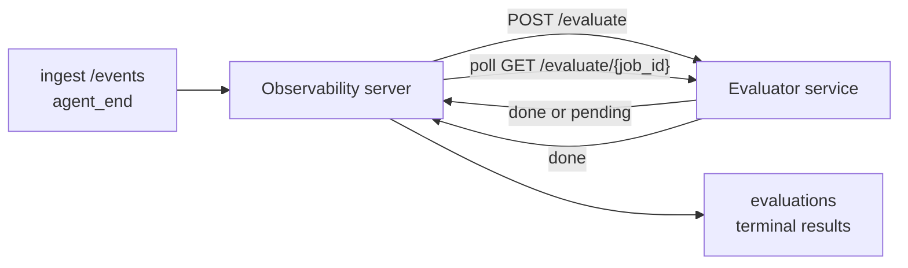

Failproof AI Observability, tamamlanan her ajan çalışmasını otomatik olarak kalite açısından puanlandırabilir: siz küçük bir puanlama hizmeti sağlarsınız, Observability geri kalanını halleder. Önemli bulduğunuz boyutları (yardımcılık, araç verimliliği, gerçekçilik, güvenlik; siz seçin) takip etmek, gerilemeyi erken yakalamak ve ajanları veya ortamları bir bakışta karşılaştırmak için kullanın. Puanlama isteğe bağlıdır: sunucuda `EVALUATOR_ENDPOINT` ayarlanana kadar işlem hattı hiçbir şey yapmaz.

> **Not:** Puan boyutlarını siz tanımlarsınız. Değerlendiricininiz istediği herhangi bir sayısal anahtarı döndürebilir; Observability, geri gönderdiğiniz her şeyi depolar, eğilim gösterir ve görüntüler.

## Bir bakışta

1. **Bir puanlayıcı yazın.** Bir oturum transkripsini okuyan ve puanları döndüren küçük bir HTTP hizmeti ayağa kaldırın. Observability, kopyalayabileceğiniz çalışan bir referans sevkiyat eder. Bkz. [SDK ile bir değerlendiricinin yazılması](#sdk-ile-bir-değerlendiricinin-yazılması).
2. **Observability'yi ona yönlendirin.** Sunucu işleminde `EVALUATOR_ENDPOINT` (ve paylaşılan `EVALUATOR_TOKEN`) ayarlayın.
3. **Puanları gözlemleyin.** Her tamamlanan oturum otomatik olarak puanlanır; sonuçlar oturum ayrıntı sayfasında, oturumlar ızgarasında ve kaydedilmiş panoları görünür.


*Bir değerlendiricinin yapılandırılması tamamlandıktan sonra her çalışma puanlanır ve sonuçlar oturumun sağ rayında görünür: üstte özet, ardından boyut başına puan çubukları ve gerekçe metni.*

---

## Nasıl çalışır



Observability SDK bir oturum için `agent_end` olayı yayınladığında, sunucu bir değerlendirme zamanlar. Ardından tam olay transkripsini değerlendiricinin hizmetine POST eder; bu hizmet şu iki şekilde davranabilir:

- **Sonucu satır içinde döndürün** `{"status":"done", "scores":{...}, "reasoning":{...}, "summary":"..."}` ile. Sonuç, oturumun değerlendirme zaman çizelgesine eklenir. `reasoning` ve `summary` isteğe bağlıdır.
- **Erteleyiniz** `{"status":"pending", "job_id":"abc-123"}` ile. Observability daha sonra değerlendiricinin `{"status":"done", ...}` veya `{"status":"error", "error":"..."}` döndürülene kadar `GET {EVALUATOR_ENDPOINT}/evaluate/abc-123` çağrısını yapar.

  Yoklama cadencesi iş başına yapılır: bir `pending` yanıtı `next_poll_secs` içerebilir; aksi takdirde Observability `GET /config` adresinden `default_poll_interval_secs` değerini kullanır; aksi takdirde sunucu `EVALUATOR_POLLING_INTERVAL_SECS` (varsayılan 10s) değerine geri döner. Tüm değerler [1s, 1h] aralığıyla sınırlandırılır.

Hiçbir zaman `agent_end` yayınlamayan oturumlar (örneğin, çökmüş bir ajan işlemi), özel durum olarak da alınabilir: değerlendiricinin `GET /config` öğesi `{"inactivity_timeout_secs": 1800}` döndürebilir ve Observability, bu kadar uzun süre boşta kalmış herhangi bir oturumu değerlendirecektir. Bu geri dönüş seçeneğini devre dışı bırakmak için alanı `null` veya atlayın.

`EVALUATOR_ENDPOINT` ayarlanmadığında işlem hattı tamamen işlemsizdir.

Bir oturum zaman içinde **birden fazla terminal değerlendirmesi** biriktirebilir: her `agent_end` olayı (ve panodan her manuel yeniden değerlendirme) yeni bir değerlendirme satırı ekler. Bu, devam eden bir konuşmayı değerlendirmenin desteklenen yoludur: bir kullanıcı ajan sonlandırır, daha sonra geri döner, daha fazla olay gönderir, ajan'ı yeniden sonlandırır ve ikinci bir değerlendirme, tam güncellenmiş transkript karşısında çalışır. Pano, en son değerlendirmeyi başlık olarak ve önceki değerlendirmeleri daraltılabilir zaman çizelgesi olarak işler. Bir oturum için bir değerlendirme çalışırken, o oturum için ek `agent_end` olayları yoksayılır; çalışan değerlendirme tamamlandıktan sonraki ilk olay, her zamanki gibi yeni bir değerlendirmeyi kuyruğa alacaktır.

Atıl kalma geri dönüşü, devam eden oturumlarda da yeniden etkinleştirilir: yeni olaylar önceki bir terminal değerlendirmesinin ardından geldiyse ve oturum daha sonra `inactivity_timeout_secs` sonrası boşta kalırsa, yeni bir değerlendirme sıraya alınır.

Geçici arızalar (5xx, 429, zaman aşımları, ağ hataları) `EVALUATOR_MAX_ATTEMPTS` öğesine kadar exponential backoff ile yeniden denenebilir; 4xx yanıtları sonlanır. Observability birden fazla yatay olarak ölçeklenen sunucu örneğiyle güvenli bir şekilde çalıştırılabilir; iş, aynı oturumun hiçbir zaman eşzamanlı olarak iki kez gönderilmeyecek şekilde bölümlendirilir.

---

## HTTP sözleşmesi

Her kimliği doğrulanmış rota **taşıyıcı token kimlik doğrulaması** kullanır. Aynı değer her iki tarafta da yapılandırılmalıdır:

- Observability sunucusu: ortam değişkeni `EVALUATOR_TOKEN`
- Değerlendiricinin hizmeti: aynı şekilde yapılandırılmış (SDK `agenteye-evaluator` sözleşme gereği `EVALUATOR_TOKEN` adresini okur)

`EVALUATOR_TOKEN` ayarlanmadığında, sunucu `Authorization` başlığı göndermez; değerlendiricinin daha sonra anonim istekleri kabul edebileceği söylentisi vardır; bu, yalnızca dahili ağ için iyidir, ancak genel internet üzerinde önerilmez.

### Değerlendiricinin sunması gereken rotalar

| Rota | Gövde / parametreler | Yanıt |
|---|---|---|
| `GET /health` | hiçbiri | `{"status":"ok"}` (açık, kimlik doğrulaması yok) |
| `GET /config` | hiçbiri | `{"inactivity_timeout_secs": <int> \| null, "default_poll_interval_secs": <int> \| omitted}` |
| `POST /evaluate` | `EvalRequest` JSON | `{"status":"done", ...}` veya `{"status":"pending", "job_id":"..."}` |
| `GET /evaluate/{id}` | hiçbiri | `/evaluate` ile aynı yanıt şekli |

### Sunucu tarafından gönderilen `EvalRequest` gövdesi

```json
{
  "schema_version": "1",
  "session_id":     "session-abc123",
  "agent_id":       "planner",
  "environment":    "production",
  "started_at":     "2026-05-10T12:00:00Z",
  "ended_at":       "2026-05-10T12:05:00Z",
  "events": [
    { "id": 1234, "ts": "...", "event_type": "agent_start", "payload": { ... } },
    ...
  ]
}
```

### Yanıt şekilleri

**Senkron (tamamlandı):**

```json
{
  "status": "done",
  "scores": { "helpfulness": 0.85, "tool_efficiency": 0.6 },
  "reasoning": {
    "helpfulness": "answered the question directly with citations",
    "tool_efficiency": "called list_files three times when one would have done"
  },
  "summary": "strong answer quality, weak tool selection"
}
```

`reasoning` (puan başına gerekçe haritası) ve `summary` (genel bir paragraf anlatı) her ikisi de isteğe bağlıdır. `reasoning` içindeki anahtarlar `scores` içindeki anahtarları yansıtmalıdır; pano, her girdisini puan çubuğunun altında satır içinde işler. Yalnızca `scores` döndüren eski değerlendiriciler değişmeden çalışmaya devam eder; `reasoning` ve `summary` basitçe null olarak okunur ve karşılık gelen kullanıcı arabirimi imkanları atlanır.

**Zaman uyumsuz (ertelenen):**

```json
{ "status": "pending", "job_id": "abc-123", "next_poll_secs": 30 }
```

`next_poll_secs` isteğe bağlıdır; atlanırsa sunucu `/config` adresinden değerlendiricinin `default_poll_interval_secs` öğesine, ardından kendi `EVALUATOR_POLLING_INTERVAL_SECS` ortam değişkenine geri döner.

**Terminal değerlendiricinin tarafı hatası:**

```json
{ "status": "error", "error": "model service unavailable" }
```

Sunucu, diğer 2xx gövdelerini protokol hatası olarak ele alır ve oturum için bir terminal `error` kaydeder.

---

## SDK ile bir değerlendiricinin yazılması

HTTP sözleşmesini el ile uygulamanız gerekmez. `agenteye-evaluator` Python paketi, kimlik doğrulama, yönlendirme ve istek/yanıt şekillerini sizin için işleyen yazılı bir FastAPI sarıcısı sağlar.

Failproof AI Observability ayrıca transkriptin şeklinden `helpfulness`, `tool_efficiency` ve `factuality` adresini puanlayan **çalışan bir referans değerlendiricinin** sevkiyatı yapar. Bunu başlangıç noktası olarak kopyalayın ve kendi mantığınızı takas edin: bir LLM yargıcı, bir kural motoru, kalite çubuğunuza uygun her şey.

Minimum uygun değerlendiricinin:

```python
import os
from agenteye_evaluator import Evaluator, EvalRequest, EvalResponse

app = Evaluator(token=os.environ["EVALUATOR_TOKEN"])

@app.evaluator
def run(req: EvalRequest) -> EvalResponse:
    # Inspect req.events (the full session transcript) and return scores.
    tool_calls = sum(1 for e in req.events if e.event_type == "tool_use")
    return EvalResponse(
        scores={"tool_calls": float(tool_calls)},
        reasoning={"tool_calls": f"{tool_calls} tool invocations in the transcript"},
        summary="tight tool loop" if tool_calls < 5 else "agent looped on tools",
    )
```

`app` örneği herhangi bir ASGI sunucusu altında çalışır, bu nedenle `uvicorn module:app` onu başlatır.

Pahalı işi ertelemesi gereken değerlendiriciler için, bunun yerine `JobPending` döndürün ve bir `@app.job_lookup` işleyicisi kaydedin; Observability sunucusu terminal durumu döndürülene veya `EVALUATOR_MAX_POLL_DURATION_SECS` başlığı (varsayılan 1 h) sona erene kadar `GET /evaluate/{job_id}` öğesini yoklar.

Tam API başvurusu, zaman uyumsuz düzen ve olay şeması `agenteye-evaluator` SDK'nin README'sinde belgelenmiştir.

---

## Değerlendiricinin çalıştırılması

Değerlendiricinin hizmeti **sizin hizmetinizdir** — Failproof AI Observability varsayılan bir değerlendiricinin sevkiyatı yapmaz, bu nedenle kendi hizmetlerinizi nerede çalıştırırsanız orada derleyin ve çalıştırın. Herhangi bir ASGI sunucusu altında çalışır (örneğin `uvicorn my_evaluator:app`); `/health`, `/config` ve `/evaluate` rotalarını [HTTP sözleşmesinden](#http-sözleşmesi) sunun, ardından sunucuyu ona yönlendirin (bkz. [Sunucunun yapılandırılması](#sunucunun-yapılandırılması)).

Değerlendiricinin ulaşılabilir olması halinde, `GET /health` `{"status":"ok"}` döndürür. Bir ajan baştan sona çalıştıktan sonra, sunucu üzerinde `GET /evaluations` değerlendiricinin ürettiği puanlarla `status: "done"` olan bir satır döndürür.

---

## Sunucunun yapılandırılması

Sunucu işleminde ayarlayın:

| Ortam değişkeni | Anlamı |
|---|---|
| `EVALUATOR_ENDPOINT` | Değerlendiricinin temel URL'si (`http://evaluator:9000`). Ayarlanmamış = işlem hattı devre dışı. |
| `EVALUATOR_TOKEN` | Taşıyıcı token. Değerlendiricinin hizmetinin yapılandırıldığı değerle eşleşmelidir. |
| `EVALUATOR_WORKERS` | Sunucu örneği başına çalışan görevleri (varsayılan 2). |
| `EVALUATOR_CLAIM_BATCH` | İşçi değişimi başına talep edilen satırlar (varsayılan 4). Toplu işlerin **eşzamanlı** olarak işlenmesi; değerlendiricinin uç noktasında etkili eşzamanlılık `EVALUATOR_WORKERS × EVALUATOR_CLAIM_BATCH` olur. |
| `EVALUATOR_POLL_IDLE_SECS` | Bir çalışanın hiçbir değerlendirme ödenmeyen anda gönderim denemelerine devam etmeden önce uyku çekme süresi (varsayılan 2s). |
| `EVALUATOR_POLLING_INTERVAL_SECS` | Ne per-response `next_poll_secs` ne de değerlendiricinin `default_poll_interval_secs` ayarlanmadığında `GET /evaluate/{id}` cadencesi için son geri dönüş (varsayılan 10s). |
| `EVALUATOR_REQUEST_TIMEOUT_MS` | İstek başına zaman aşımı (varsayılan 30000). |
| `EVALUATOR_MAX_ATTEMPTS` | Bu çok sayıda geçici arızadan sonra, sonuç terminal `error` olarak kaydedilir (varsayılan 5). |
| `EVALUATOR_CONFIG_REFRESH_SECS` | `GET /config` cadencesi (varsayılan 300). |
| `EVALUATOR_MAX_POLL_DURATION_SECS` | Bir oturumun yoklama kuyruğunda kalabileceği maksimum gerçek zaman ve `timeout` olarak sonlandırılır (varsayılan 3600s). Bir değerlendiriciye karşı gözlem yapar, bunun yerine `pending` döndürür. |

Otomatik puanlamayı açmak için, sunucuda hem `EVALUATOR_ENDPOINT` hem de `EVALUATOR_TOKEN` ayarlayın, ardından değişikliği almak için yeniden başlatın. `EVALUATOR_ENDPOINT` ayarlanmadığında işlem hattı bir no-op olarak kalır.

Yukarıdaki ayar düğmeleri isteğe bağlıdır; varsayılanları geçersiz kılmak için ihtiyaç duyuyorsanız, yalnızca sunucuda karşılık gelen ortam değişkenlerini ayarlayın.

---

## API başvurusu

| Yöntem | Yol | Gerekli izin | Amaç |
|---|---|---|---|
| `GET` | `/evaluations` | `evaluations:read` | Terminal sonuçlarını sorgulayın. `session_id`, `agent_id`, `environment`, `status` (`done`/`error`/`timeout`), `ts_from`, `ts_to`, `cursor`, `limit`, `score_filters`, `latest_per_session` öğesini destekler. `limit` varsayılan olarak 50 olur ve 200'de sınırlandırılır (bunu `/events` (1000'de sınırlandırılır) adresinden ayırt ettiğini unutmayın). `environment`, virgülle ayrılmış bir listeyi kabul eder (örn. `environment=prod,staging`); tek değerler hala çalışır. `latest_per_session=true` ile yanıt en fazla `session_id` başına bir satır içerir (`completed_at` adresine göre en son), oturumlar-liste sayfasında bir oturumun değerlendirme zaman çizelgesini geçerli başlığa daraltmak için kullanılır. Varsayılan olarak yanlış (tam geçmişi döndürür). |
| `GET` | `/evaluations/aggregate` | `evaluations:read` | Filtrelenen dilim için hadde halindeki eval sağlığı: toplam sayı, tamamlandı/hata/zaman aşımı dökümü, puan başına anahtar istatistikleri (keyfi `scores` anahtarları üzerindeki sayım/ort/min/maks/p50) ve zaman demetlemesi zaman çizelgesi. `/evaluations` ile **aynı filtre parametrelerini** ve `featured_keys` (eğilim göstermek için puanlama anahtarlarının CSV'si) ve `latest_per_session` adresini kabul eder. Panoları özelliği Powered; metrikler örneklenen değil, eşleşen tüm set üzerinde tam olarak hesaplanır. |
| `GET` | `/evaluations/environments` | `evaluations:read` | `evaluations` tablosundan farklı ortam değerleri. Değerlendirme okunabilir verilere kapsamlı filtre açılır listelerini doldurmak için kullanılır. |
| `GET` | `/evaluation-jobs` | `evaluations:read` | Operasyon değerlendirmelerine görünürlük. `status` (`pending`/`polling`) ile filtreleyin. |
| `GET` | `/events` | `events:read` | Oturumun ham olaylarını akış olarak kullanın. `session_id`, `agent_id`, `event_type` (CSV), `environment` (CSV), `ts_from`, `ts_to`, `cursor`, `limit` ve `order` öğesini destekler. `order` `desc` (en yeni-ilk, varsayılan) veya `asc` (en eski-ilk); tanınmayan bir değer `desc` adresine geri döner. Yanıtın `next_cursor` (bir olay kimliği) aracılığıyla imleç-paginate: sonraki sayfayı almak için `cursor` olarak geri aktarın; `asc` ile sonraki sayfa bu id'den sonraki olaylar, `desc` ile bunlardan öncekidir. `limit` varsayılan olarak 50 olur ve 1000'de sınırlandırılır. |
| `GET` | `/sessions/:session_id/export` | `events:read` | Değerlendiricinin bu oturum için alacağı tam JSON gövdesini döndürün, `session-<id>.json` adlı indirilebilir bir ek olarak sunulur. Üretim oturumlarını çevrimdışı test için `agenteye-evaluator` aracılığıyla yeniden oynatmak için kullanışlıdır. Bayt bayt-tanımlanmış değerlendiricinin işlem hattı gönderdiği şeye kıyasla.
| `POST` | `/sessions/:session_id/re-evaluate` | `evaluations:trigger` | Oturum için yeni bir değerlendirme sıraya alın; önceki bir değerlendirmenin olup olmadığını görmeyiz. Yeni sonuç, önceki puanları geçersiz kılmak yerine oturumun değerlendirme zaman çizelgesine **eklenir**, bu nedenle önceki puanlar geçmiş olarak görünür kalır. Sırayla `202` adresinde geri döner, bilinmeyen oturum için `404`, zaten uçuşta bir değerlendirme varsa `409`. Bunu yeni bir değerlendiricinin dağıtımının ardından veya hiçbir zaman `agent_end` yayınlamayan oturumlar için kullanın. |

### Puan aralığına göre filtreleme: `score_filters`

`GET /evaluations`, `scores` nesnesi içinde sayısal değerlere göre sonuçları daraltır ve isteğe bağlı bir `score_filters` parametresi adresini kabul eder. Parametre, virgülle ayrılmış `key:min..max` girişleri listesidir; her iki sınır da atlanabilir. Birden fazla giriş mantıksal VE ile birleşir. Adlı anahtarın olmadığı veya sayısal olmayan satırlar dışlanır. Bir istek en fazla 20 filtre girişi taşıyabilir; aşmak HTTP 400 döndürür.

Örnekler:
```text
# helpfulness in [0.5, 0.8]
GET /evaluations?score_filters=helpfulness:0.5..0.8

# tool_efficiency at most 0.3 (no lower bound)
GET /evaluations?score_filters=tool_efficiency:..0.3

# helpfulness >= 0.5 AND factuality >= 0.9
GET /evaluations?score_filters=helpfulness:0.5..,factuality:0.9..
```

Her `/evaluations` yanıt nesnesi şu alanları içerir:

| Alan | Tür | Notlar |
|---|---|---|
| `evaluation_id` | dize (UUID) | Bu terminal değerlendirmesi için kanonik tanımlayıcı. Her terminal değerlendirme yeni bir UUID alır; tek bir oturum birden fazla tutabilir. |
| `id` | dize (UUID) | `evaluation_id` ile aynı değeri taşıyan geri uyumluluk takma adı. |
| `session_id` | dize | Bu değerlendirmenin çalıştırıldığı oturum. Bir oturum zaman çizelgesinde birden fazla değerlendirmeye sahip olabilir. |
| `agent_id` | dize | Oturumu üreten ajan'ı tanımlar. |
| `environment` | dize | Oturumdan kopyalanan ortam etiketi. |
| `status` | enum | `"done"`, `"error"`, `"timeout"` adresinden biri. |
| `scores` | nesne \| null | Değerlendiricinin döndürdüğü puanlar. |
| `reasoning` | nesne \| null | Değerlendiricinin döndürdüğü isteğe bağlı puan başına gerekçe haritası. Anahtarlar tipik olarak `scores` adresindeki anahtarları yansıtır. Pano, her girişi puan çubuğunun altında işler. |
| `summary` | dize \| null | Değerlendiricinin döndürdüğü isteğe bağlı bir paragraf genel anlatı. Pano, bunu puan başına dökümün üzerinde değerlendirmenin başlığı olarak işler. |
| `error` | dize \| null | Yalnızca `"error"` / `"timeout"` adresinde doldurulur. |
| `attempt_count` | tamsayı | Gönderim denemelerinin sayısı (≥ 1). |
| `duration_ms` | tamsayı \| null | Son denemesinin süresi. |
| `completed_at` | dize (ISO 8601 UTC) | Terminal sonucunun kaydedilmesi zamanı. Sonuçlar `completed_at` (en yeni-ilk) adresine göre sıralanır. |
| `created_at` | dize (ISO 8601 UTC) | `completed_at` ile aynı zaman damgasını taşır (yazma bir kez semantik). |

---

## İzinler

| İzin | Hibe |
|---|---|
| `evaluations:read` | Değerlendirme sonuçlarını listeleyin, puanları pano'da görüntüleyin ve pano sağlığı metriklerini yükleyin. |
| `evaluations:trigger` | `POST /sessions/:session_id/re-evaluate` aracılığıyla veya panonun yeniden değerlendirme düğmesi aracılığıyla bir oturum için el ile bir değerlendirme sıraya alın. |
| `dashboards:read` | Kaydedilmiş panoları görüntüleyin (metriklerini yüklemek için `evaluations:read` de gerekir). |
| `dashboards:write` | Pano oluşturun ve düzenleyin. |
| `dashboards:delete` | Pano silin. |

Bootstrap yöneticisi (`ADMIN_KEY`, `ADMIN_EMAIL`) otomatik olarak bunları alır.

---

## Sonuçları görüntüleme

- **`/sessions/<id>`**: olaylar zaman çizelgesi + oturumun puanlarını ve gönderim denemesindeki hataları gösteren sağ raya. Anahtarınızda `evaluations:trigger` varsa, dışa aktarma düğmesinin yanında **yeniden değerlendirme** düğmesi görünür; bu, hiçbir zaman `agent_end` yayınlamayan oturumlar veya yeni bir değerlendiricinin dağıtımından sonra puanları yenileyen oturumlar için kullanışlıdır. Pano yeni sonuç için poll yapar ve sağ rai güncellendiğinde güncellenir.
- **`/sessions`**: filtrelenebilir oturumlar ızgarası; puan sütunu her oturumun değerlendirme durumunu ve puanlarını bir bakışta gösterir.
- **`/dashboards`**: kaydedilmiş eval-sağlık görünümleri (aşağıdaki [Panolar](#panolar) bölümüne bakın).


*Oturumlar ızgarası her çalıştırmanın değerlendirme durumunu ve puanlarını bir bakışta gösterir; kırmızı/kehribar/yeşil rozetler düşük puanları atlar.*

---

## Panolar

**Panolar** sayfası (`/dashboards`), değerlendirme filtrelerinin bir birleşimini adlandırılmış, yeniden kullanılabilir bir görünüm olarak kaydetmenize ve söz konusu değerlendirmelerin diliminin nasıl yapıldığını bir bakışta izlemenize olanak tanır. Panolar **tüm kuruluş genelinde paylaşılır**; `dashboards:read` olan herkes aynı seti görür.

Her pano:

- **Filtreler**: oturumlar sayfasındaki kontroller ile aynı: ortam, durum, ajan, kayan zaman penceresi ve puan aralığı filtreleri (`key:min..max`).
- **Bir görüntü yapılandırması**: hangi puan anahtarlarını özellikle almak istediğiniz, yeşil/kehribar/kırmızı sağlık eşikleri, hangi panellerini göstermek istediğiniz ve oturum başına en son değerlendirmeye daraltmak istediğiniz.

Her kart, eşleşen oturumların sayısını, bir tamamlandı/hata/zaman aşımı dökümünü, her özelliği alınan puanın ortalamasını ve küçük bir eğilim sparkline gösterir. Panoda açılması tam boyutlu panellerini gösterir; **"oturumlarda aç"** tam olarak bu dilime önceden filtrelenen oturumlar sayfasına sizi bırakır. Metrikler sunucu tarafı üzerinden hesaplanır (via `GET /evaluations/aggregate`), bu nedenece sayılar örneklenen yerine tam olarak hesaplanır.


**İzinler:** görüntüleme hem `dashboards:read` hem de `evaluations:read` gerektir; oluşturma ve düzenleme `dashboards:write` gerektir; silme `dashboards:delete` gerekir. Bootstrap yöneticisi bunları otomatik olarak alır.

---

## Sorun giderme

**Oturumlar var ancak hiçbir değerlendirme oluşturulmaz.** `EVALUATOR_ENDPOINT` öğesinin sunucu işleminde ayarlandığını, sunucu ve değerlendiricinin aynı `EVALUATOR_TOKEN` değerini paylaştığını ve değerlendiricinin `/health` uç noktasının sunucudan ulaşılabilir olduğunu doğrulayın. `EVALUATOR_ENDPOINT` ayarlanmadığında işlem hattı bir no-op şeklindedir.

**Operasyon değerlendirmeleri yığınlanır.** Operasyon sırasında kuyruğu görmek için `GET /evaluation-jobs` adresini sorgulayın. Her satırda `attempt_count`, `next_attempt_at` ve `last_error` öğesini inceleyin. Yaygın nedenler: değerlendiricinin hizmeti ulaşılamıyor veya 5xx döndürüyor (geri dönüş ile yeniden denenebilir), yanlış `EVALUATOR_TOKEN` (401 sonlanır) veya `pending` süresiz döndüren zaman uyumsuz bir değerlendiricinin (aşağıya bakın).

**Oturumlar tamamlandı ancak terminal değerlendirmesi yok.** `GET /evaluation-jobs?status=polling` adresini sorgulayın; sonuç hala operasyonda olabilir. Bir iş `pending` adresinde takılı kalırsa, sunucu değerlendiriciye ulaşmakta sorun yaşıyor; değerlendiricinin çalışmakta olduğunu ve `EVALUATOR_TOKEN` eşleştiğini kontrol edin.

**`HTTP 401 from evaluator: invalid bearer token`.** Sunucudaki `EVALUATOR_TOKEN` değerlendiricinin hizmetinin yapılandırıldığı değerle eşleşmez. Aynı olmaları gerekir.

**Zaman uyumsuz değerlendiricinin `pending` forever döndürür.** Sunucu `GET /evaluate/{job_id}` adresini terminal durumu döndürülene veya `EVALUATOR_MAX_POLL_DURATION_SECS` (varsayılan 1 h) sona erene kadar yoklar. Başlıktan sonra değerlendirme `timeout` olarak kaydedilir ve operasyon kuyruğundan kaldırılır. Değerlendiricinin varsayılandan daha uzun süre gerekli kılması halinde `EVALUATOR_MAX_POLL_DURATION_SECS` adresini yükseltin.

---

## Sonraki adımlar

- [Değerlendiricinin ajan becerisi](/tr/agenteye/evaluator-skill): bir kodlama ajanının gerçek oturumlara karşı boyutlarınızı tasarlaması ve bu hizmeti sizin için oluşturması.
- [Python SDK](/tr/agenteye/python-sdk): puanlamayı tetikleyen `agent_end` olaylarını yayın.
- [API anahtarları](/tr/agenteye/api-keys): `evaluations:read` ve `evaluations:trigger` izinleri.
- [Denetimler](/tr/agenteye/audits): Observability'nin diğer otomatikleştirilmiş kalite özelliği, politika tabanlı inceleme için.