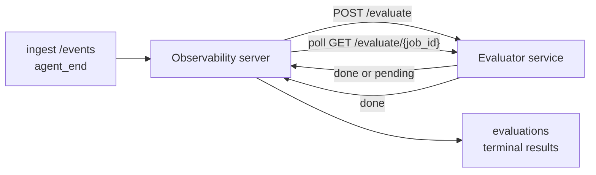

Failproof AI Observability, tamamlanan her agent çalıştırmasını kalite açısından otomatik olarak puanlayabilir: siz küçük bir puanlama hizmeti sağlarsınız, Observability geri kalanını halleder. Önem verdiğiniz boyutları izlemek (yardımcılık, araç verimliliği, gerçekçilik, güvenlik; siz seçersiniz), gerilemeyi erken yakalamak ve ajanları veya ortamları bir bakışta karşılaştırmak için kullanın. Puanlama gönüllü: sunucuda `EVALUATOR_ENDPOINT` ayarlayana kadar boru hattı hiçbir şey yapmaz.

> **Not:** Puan boyutlarını siz tanımlarsınız. Değerlendiricileriniz istediği herhangi bir sayısal anahtarı döndürebilir; Observability, geri gönderdiğiniz her şeyi depolayıp, eğilim gösterir ve görüntüler.

## Bakış açısı

1. **Bir puanlayıcı yazın.** Bir oturum transkriptini okuyan ve puanları döndüren küçük bir HTTP hizmeti ayağa kaldırın. Observability, kopyalayabileceğiniz çalışan bir referans ile birlikte gelir. Bkz. [SDK ile bir değerlendirici yazma](#writing-an-evaluator-with-the-sdk).
2. **Observability'i ona yönlendirin.** Sunucu işleminde `EVALUATOR_ENDPOINT` (ve paylaşılan bir `EVALUATOR_TOKEN`) ayarlayın.
3. **Puanların gelmesini izleyin.** Her tamamlanan oturum otomatik olarak puanlandırılır; sonuçlar oturum ayrıntı sayfasında, oturumlar ızgarasında ve kaydedilmiş panolarda görünür.


*Bir değerlendirici yapılandırıldıktan sonra, her tamamlanan çalıştırma puanlandırılır ve sonuçlar oturumun sağ rayında görünür: üstte özet, ardından akıl yürütme ile birlikte boyut başına puan çubukları.*

---

## Nasıl çalışır



Failproof AI Observability SDK bir oturum için `agent_end` olayını yayınladığında, sunucu bir değerlendirme planlayabilir. Daha sonra tam olay transkriptini değerlendirici hizmetinize POST eder; bu hizmet şunlardan birini yapabilir:

- **Sonucu satır içinde döndürün** `{"status":"done", "scores":{...}, "reasoning":{...}, "summary":"..."}` ile. Sonuç, oturumun değerlendirme zaman çizelgesine eklenir. `reasoning` ve `summary` isteğe bağlıdır.
- **Ertele** `{"status":"pending", "job_id":"abc-123"}` ile. Observability daha sonra değerlendiricileriniz `{"status":"done", ...}` veya `{"status":"error", "error":"..."}` döndürene kadar `GET {EVALUATOR_ENDPOINT}/evaluate/abc-123` çağrısını yapar.

  Yoklama temposu iş başına: bir `pending` yanıtı geçersiz kılmak için `next_poll_secs` içerebilir; aksi takdirde Observability, `/config` öğesinden `default_poll_interval_secs` değerini kullanır; aksi takdirde sunucu `EVALUATOR_POLLING_INTERVAL_SECS` öğesine geri döner (varsayılan 10s). Tüm değerler [1s, 1h] aralığına sabitlenir.

Hiç `agent_end` yayınlamayan oturumlar (örneğin, çöken bir agent işlemi) de alınabilir: değerlendiricinin `GET /config` öğesi `{"inactivity_timeout_secs": 1800}` döndürebilir ve Observability, o kadar uzun boşta kalan herhangi bir oturumu değerlendirecektir. Bu geri dönüşü devre dışı bırakmak için alanı `null` olarak ayarlayın veya atlayın.

`EVALUATOR_ENDPOINT` ayarlanmadığında boru hattı tamamen etkisizdir.

Bir oturum zaman içinde **birden fazla terminal değerlendirme biriktirebilir**: her `agent_end` olayı (ve panodan her manuel yeniden değerlendirme) yeni bir değerlendirme satırını ekler. Bu, devam eden bir konuşmayı değerlendirmenin desteklenen yoludur: bir kullanıcı bir ajanı sonlandırır, daha sonra geri gelir, daha fazla olay gönderir, ajanı yeniden sonlandırır ve ikinci bir değerlendirme tam güncellenmiş transkript karşısında çalışır. Pano en son değerlendirmeyi başlık olarak ve önceki değerlendirmeleri daraltılabilir zaman çizelgesi olarak görüntüler. Bir oturum için bir değerlendirme çalışırken, bu oturum için ek `agent_end` olayları göz ardı edilir; çalışan değerlendirme tamamlandıktan sonraki bir sonraki olay, her zamanki gibi yeni bir değerlendirmeyi sıraya alacaktır.

Eylemsizlik geri dönüşü devam eden oturumlarda da yeniden başlar: yeni olaylar önceki bir terminal değerlendirmeden sonra ulaşır ve oturum daha sonra `inactivity_timeout_secs` geçmiş boşta kalırsa, yeni bir değerlendirme sıraya alınır.

Geçici hatalar (5xx, 429, zaman aşımları, ağ hataları) `EVALUATOR_MAX_ATTEMPTS` öğesine kadar üstel geri çekilme ile yeniden denenirler; 4xx yanıtları terminaldir. Observability, birden fazla yatay olarak ölçeklendirilmiş sunucu örneğiyle çalışmak için güvenlidir; iş bölümlendirilir, bu nedenle aynı oturum asla eşzamanlı olarak iki kez gönderilmez.

---

## HTTP sözleşmesi

Her kimliği doğrulanmış rota **taşıyıcı token kimlik doğrulaması** kullanır. Aynı değer her iki tarafta da yapılandırılmalıdır:

- Observability sunucusu: env değişkeni `EVALUATOR_TOKEN`
- Değerlendirici hizmeti: aynı şekilde yapılandırılmış (agenteye-evaluator SDK'sı kurala göre `EVALUATOR_TOKEN` okur)

`EVALUATOR_TOKEN` ayarlanmadığında, sunucu `Authorization` üst bilgisi göndermez; değerlendirici daha sonra anonim istekleri kabul edebilir; bu, yalnızca dahili bir ağ için iyidir ancak genel İnternet üzerinde önerilmez.

### Değerlendiricinin sunması gereken rotalar

| Rota | Gövde / parametreler | Yanıt |
|---|---|---|
| `GET /health` | yok | `{"status":"ok"}` (açık, kimlik doğrulaması yok) |
| `GET /config` | yok | `{"inactivity_timeout_secs": <int> \| null, "default_poll_interval_secs": <int> \| omitted}` |
| `POST /evaluate` | `EvalRequest` JSON | `{"status":"done", ...}` veya `{"status":"pending", "job_id":"..."}` |
| `GET /evaluate/{id}` | yok | `/evaluate` ile aynı yanıt şekli |

### Sunucu tarafından gönderilen `EvalRequest` gövdesi

```json
{
  "schema_version": "1",
  "session_id":     "session-abc123",
  "agent_id":       "planner",
  "environment":    "production",
  "started_at":     "2026-05-10T12:00:00Z",
  "ended_at":       "2026-05-10T12:05:00Z",
  "events": [
    { "id": 1234, "ts": "...", "event_type": "agent_start", "payload": { ... } },
    ...
  ]
}
```

### Yanıt şekilleri

**Senkron (bitti):**

```json
{
  "status": "done",
  "scores": { "helpfulness": 0.85, "tool_efficiency": 0.6 },
  "reasoning": {
    "helpfulness": "answered the question directly with citations",
    "tool_efficiency": "called list_files three times when one would have done"
  },
  "summary": "strong answer quality, weak tool selection"
}
```

`reasoning` (puan başına gerekçelendirme haritası) ve `summary` (genel tek paragraf anlatısı) her ikisi de isteğe bağlıdır. `reasoning` içindeki anahtarlar `scores` içindeki anahtarları yansıtmalıdır; pano her girişi puan çubuğunun altında satır içinde görüntüler. Yalnızca `scores` döndüren daha eski değerlendiriciler değiştirilmeden çalışmaya devam eder; `reasoning` ve `summary` basitçe null olarak okunur ve ilgili UI olanakları atlanır.

**Zaman uyumsuz (ertelendi):**

```json
{ "status": "pending", "job_id": "abc-123", "next_poll_secs": 30 }
```

`next_poll_secs` isteğe bağlıdır; atlanırsa sunucu değerlendiricinin `/config` adresinden `default_poll_interval_secs` öğesine, ardından kendi `EVALUATOR_POLLING_INTERVAL_SECS` env değişkenine geri döner.

**Terminal değerlendirici tarafı hata:**

```json
{ "status": "error", "error": "model service unavailable" }
```

Sunucu diğer herhangi bir 2xx gövdesini bir protokol hatası olarak ele alır ve oturum için terminal bir `error` kaydeder.

---

## SDK ile bir değerlendirici yazma

HTTP sözleşmesini el ile uygulamanız gerekmiyor. `agenteye-evaluator` Python paketi size kimlik doğrulaması, yönlendirme ve istek/yanıt şekillerini sizin için işleyen yazılı bir FastAPI sarmalayıcı sunar.

Failproof AI Observability ayrıca transkriptin şeklinden `helpfulness`, `tool_efficiency` ve `factuality` için **çalışan bir referans değerlendirici** de sunar. Bunu bir başlangıç noktası olarak kopyalayın ve kendi mantığınızı değiştirin: bir LLM yargıcı, bir kural motoru, kalite çubuğunuza uygun ne olursa olsun.

Minimum uygulanabilir değerlendirici:

```python
import os
from agenteye_evaluator import Evaluator, EvalRequest, EvalResponse

app = Evaluator(token=os.environ["EVALUATOR_TOKEN"])

@app.evaluator
def run(req: EvalRequest) -> EvalResponse:
    # Inspect req.events (the full session transcript) and return scores.
    tool_calls = sum(1 for e in req.events if e.event_type == "tool_use")
    return EvalResponse(
        scores={"tool_calls": float(tool_calls)},
        reasoning={"tool_calls": f"{tool_calls} tool invocations in the transcript"},
        summary="tight tool loop" if tool_calls < 5 else "agent looped on tools",
    )
```

`app` örneği herhangi bir ASGI sunucusu altında çalışır, bu nedenle `uvicorn module:app` başlatır.

Pahalı işlemi ertelenmesi gereken değerlendiriciler için, bunun yerine `JobPending` döndürün ve bir `@app.job_lookup` işleyicisi kaydedin; Observability sunucusu, `GET /evaluate/{job_id}` öğesini siz terminal bir durum döndürene veya `EVALUATOR_MAX_POLL_DURATION_SECS` başlığına (varsayılan 1 saat) ulaşana kadar yoklar.

Tam API referansı, zaman uyumsuz deseni ve olay şeması, `agenteye-evaluator` SDK'nın README'sinde belgelenmiştir.

---

## Değerlendiricilerinizi çalıştırma

Değerlendirici **sizin hizmetinizdir** — Failproof AI Observability varsayılan bir değerlendirici ile birlikte gelmez, bu nedenle bunu kendi hizmetlerinizi çalıştırdığınız yerde inşa edersiniz ve çalıştırırsınız. Herhangi bir ASGI sunucusu altında çalışır (örneğin `uvicorn my_evaluator:app`); `/health`, `/config` ve `/evaluate` rotalarını [HTTP sözleşmesinden](#http-contract) sunun, ardından sunucuyu ona yönlendirin (bkz. [Sunucuyu yapılandırma](#configuring-the-server)).

Değerlendirici erişilebilir olduğunda, `GET /health` öğesi `{"status":"ok"}` döndürür. Bir agent uçtan uca çalıştırıldıktan sonra, sunucudaki `GET /evaluations` öğesi `status: "done"` ve değerlendiricilerinizin ürettiği puanlarla bir satır döndürür.

---

## Sunucuyu yapılandırma

Sunucu işleminde ayarlayın:

| Env değişkeni | Anlam |
|---|---|
| `EVALUATOR_ENDPOINT` | Değerlendiricilerinizin temel URL'si (`http://evaluator:9000`). Ayarlanmadı = boru hattı devre dışı. |
| `EVALUATOR_TOKEN` | Taşıyıcı token. Değerlendirici hizmetinin yapılandırıldığı değerle eşit olmalıdır. |
| `EVALUATOR_WORKERS` | Sunucu örneği başına çalışan görevler (varsayılan 2). |
| `EVALUATOR_CLAIM_BATCH` | Çalışan işareti başına talep edilen satırlar (varsayılan 4). Gruplar **eşzamanlı olarak** işlenir; değerlendirici uç noktanıza etkili eşzamanlılık `EVALUATOR_WORKERS × EVALUATOR_CLAIM_BATCH` olur. |
| `EVALUATOR_POLL_IDLE_SECS` | Hiçbir değerlendirme vadesi olmadığında bir çalışanın gönderim girişimleri arasında ne kadar süre uyuduğu (varsayılan 2s). |
| `EVALUATOR_POLLING_INTERVAL_SECS` | Ne yanıt başına `next_poll_secs` ne de değerlendiricinin `default_poll_interval_secs` ayarlandığında `GET /evaluate/{id}` temposu için son geri dönüş (varsayılan 10s). |
| `EVALUATOR_REQUEST_TIMEOUT_MS` | İstek başına zaman aşımı (varsayılan 30000). |
| `EVALUATOR_MAX_ATTEMPTS` | Bu kadar geçici hata sonrasında sonuç terminal `error` olarak kaydedilir (varsayılan 5). |
| `EVALUATOR_CONFIG_REFRESH_SECS` | `GET /config` temposu (varsayılan 300). |
| `EVALUATOR_MAX_POLL_DURATION_SECS` | Bir oturumun yoklama kuyruğunda kalabileceği maksimum duvar saati süresi, sonrasında `timeout` olarak sonlandırılır (varsayılan 3600s). Sonsuza kadar `pending` döndüren bir değerlendiriciyi korur. |

Otomatik pualamayı açmak için sunucuda hem `EVALUATOR_ENDPOINT` hem de `EVALUATOR_TOKEN` ayarlayın, ardından değişikliği seçmesi için yeniden başlatın. `EVALUATOR_ENDPOINT` ayarlanmadığında boru hattı bir no-op kalır.

Yukarıdaki ayar düğmeleri isteğe bağlıdır; varsayılanları geçersiz kılmanız gerekiyorsa yalnızca sunucuda karşılık gelen ortam değişkenlerini ayarlayın.

---

## API referansı

| Yöntem | Yol | Gerekli izin | Amaç |
|---|---|---|---|
| `GET` | `/evaluations` | `evaluations:read` | Terminal sonuçları sorgula. `session_id`, `agent_id`, `environment`, `status` (`done`/`error`/`timeout`), `ts_from`, `ts_to`, `cursor`, `limit`, `score_filters`, `latest_per_session` öğelerini destekler. `limit` varsayılan olarak 50'dir ve 200 ile sınırlıdır (bunu not edin, bu `/events` öğesinden farklıdır; 1000 ile sınırlıdır). `environment` virgülle ayrılmış bir liste kabul eder (örn. `environment=prod,staging`); tek değerler hala çalışır. `latest_per_session=true` ile yanıt en fazla `session_id` başına bir satır içerir (`completed_at` öğesine göre en son), oturumlar listesi sayfası tarafından kullanılan bir oturumun değerlendirme zaman çizelgesini mevcut başlığına daraltmak için. Varsayılan olarak yanlış (tam geçmişi döndürür). |
| `GET` | `/evaluations/aggregate` | `evaluations:read` | Filtrelenmiş bir dilim için yukarı doğru toplandı: toplam sayı, bitir/hata/zaman aşımı dökümü, puan başına anahtarı istatistikler (sayı/ortalama/min/max/p50 keyfi `scores` anahtarları üzerinde) ve zaman kovası zaman çizelgesi. `/evaluations` ile **aynı filtre parametrelerini** artı `featured_keys` (eğilim için puan anahtarlarının CSV'si) ve `latest_per_session` öğelerini kabul eder. Panoları Özellik'te güçlendirmeler; metrikler örneklenmiş değil, tam eşleşen küme üzerindedir. |
| `GET` | `/evaluations/environments` | `evaluations:read` | `evaluations` tablosundan farklı ortam değerleri. Değerlendirme okunabilir verilere kapsamlı filtre açılır listelerini doldurmak için kullanılır. |
| `GET` | `/evaluation-jobs` | `evaluations:read` | Uçuş içi değerlendirmeler hakkında görünürlük. `status` (`pending`/`polling`) öğesine göre filtreleyin. |
| `GET` | `/events` | `events:read` | Bir oturumun ham olaylarını akışla. `session_id`, `agent_id`, `event_type` (CSV), `environment` (CSV), `ts_from`, `ts_to`, `cursor`, `limit` ve `order` öğelerini destekler. `order` `desc` (en yeni-birinci, varsayılan) veya `asc` (en eski-birinci); tanınmayan bir değer `desc` öğesine geri döner. Yanıtın `next_cursor` öğesi (bir olay kimliği) aracılığıyla imleç sayfalayın: sonraki sayfayı almak için `cursor` olarak geri iletin; `asc` ile sonraki sayfa, bu kimlikten sonraki olaylar, `desc` ile öncesi olaylar. `limit` varsayılan olarak 50'dir ve 1000 ile sınırlıdır. |
| `GET` | `/sessions/:session_id/export` | `events:read` | Değerlendiricinin bu oturum için alacağı tam JSON gövdesini döndürür; indirilebilir bir ek olarak `session-<id>.json` adıyla sunulur. Üretim oturumlarını çevrimdışı test için `agenteye-evaluator` aracılığıyla yeniden oynatmak için kullanışlı. Baytlar, değerlendirici ardışık düzeninin gönderdiğine bayt olarak aynıdır. |
| `POST` | `/sessions/:session_id/re-evaluate` | `evaluations:trigger` | Bir oturum için yeni bir değerlendirme sıraya al; önceki bir değerlendirmenin var olup olmadığı fark etmez. Yeni sonuç önceki oturumu **ekler** zaman çizelgesine ekler; önceki puanlar tarih olarak görünür kalır. Sırada oluşturma başında `202`, bilinmeyen oturum için `404`, bir değerlendirme zaten havada ise `409` döndürür. Yeni bir değerlendirici dağıttıktan sonra veya hiç `agent_end` yayınlamayan oturumlar için bunu kullanın. |

### Puan aralığına göre filtreleme: `score_filters`

`GET /evaluations` öğesi, `scores` nesnesi içindeki sayısal değerlere göre sonuçları daraltmak için isteğe bağlı bir `score_filters` parametresini kabul eder. Parametre, `key:min..max` girdilerinin virgülle ayrılmış listesidir; her iki sınır da atlanabilir. Birden çok giriş mantıksal AND ile birleştirilir. Adlandırılmış anahtarın eksik olduğu veya sayısal olmayan satırlar hariç tutulur. Bir istek en fazla 20 filtre girişi taşıyabilir; aşılması HTTP 400 döndürür.

Örnekler:
```text
# helpfulness in [0.5, 0.8]
GET /evaluations?score_filters=helpfulness:0.5..0.8

# tool_efficiency at most 0.3 (no lower bound)
GET /evaluations?score_filters=tool_efficiency:..0.3

# helpfulness >= 0.5 AND factuality >= 0.9
GET /evaluations?score_filters=helpfulness:0.5..,factuality:0.9..
```

Her `/evaluations` yanıt nesnesi şu alanlara sahiptir:

| Alan | Tür | Notlar |
|---|---|---|
| `evaluation_id` | string (UUID) | Bu terminal değerlendirmenin kanonik tanımlayıcısı. Her terminal değerlendirme yeni bir UUID alır; tek bir oturum birden çok tutabilir. |
| `id` | string (UUID) | `evaluation_id` ile aynı değeri taşıyan geriye dönük uyumluluk takma adı. |
| `session_id` | string | Bu değerlendirmenin çalıştırıldığı oturum. Bir oturum zaman çizelgesinde birden çok değerlendirme yapabilir. |
| `agent_id` | string | Oturumu üreten ajanı tanımlar. |
| `environment` | string | Oturumdan kopyalanan ortam etiketi. |
| `status` | enum | `"done"`, `"error"`, `"timeout"` den biri. |
| `scores` | object \| null | Değerlendiricileriniz tarafından döndürülen puanlar. |
| `reasoning` | object \| null | Değerlendiricileriniz tarafından döndürülen isteğe bağlı puan başına gerekçelendirme haritası. Anahtarlar tipik olarak `scores` içindekilerini yansıtır. Pano her girişi puan çubuğunun altında görüntüler. |
| `summary` | string \| null | Değerlendiricileriniz tarafından döndürülen isteğe bağlı tek paragraf genel anlatı. Pano bunu puan başına dökümün üzerinde değerlendirmenin başlığı olarak görüntüler. |
| `error` | string \| null | Yalnızca `"error"` / `"timeout"` olduğunda doldurulur. |
| `attempt_count` | integer | Gönderim denemesi sayısı (≥ 1). |
| `duration_ms` | integer \| null | Son denemesinin süresi. |
| `completed_at` | string (ISO 8601 UTC) | Terminal sonuç kaydedildiğinde. Sonuçlar `completed_at` öğesine göre sıralanır (en yeni birinci). |
| `created_at` | string (ISO 8601 UTC) | `completed_at` ile aynı zaman damgasını taşır (yazma-bir kez semantiği). |

---

## İzinler

| İzin | Verir |
|---|---|
| `evaluations:read` | Değerlendirme sonuçlarını listeleyin, panoda puanları görüntüleyin ve pano sağlık metriklerini yükleyin. |
| `evaluations:trigger` | `POST /sessions/:session_id/re-evaluate` veya panonun yeniden değerlendirme düğmesi aracılığıyla bir oturum için değerlendirmeyi el ile sıraya alın. |
| `dashboards:read` | Kaydedilmiş panoları görüntüleyin (metriklerini yüklemek için `evaluations:read` da gereklidir). |
| `dashboards:write` | Panoları oluşturun ve düzenleyin. |
| `dashboards:delete` | Panoları silin. |

Önyükleme yöneticisi (`ADMIN_KEY`, `ADMIN_EMAIL`) otomatik olarak bunları alır.

---

## Sonuçları görüntüleme

- **`/sessions/<id>`**: olaylar zaman çizelgesi + oturumun puanlarını ve gönderim denemesinden herhangi bir hatayı gösteren sağ ray. Anahtarınızda `evaluations:trigger` varsa, dışa aktarma düğmesinin yanında bir **yeniden değerlendirme** düğmesi görünür, hiç `agent_end` yayınlamayan oturumlar için veya yeni bir değerlendirici dağıttıktan sonra puanları yenilemek için kullanışlı. Pano yeni sonuç için yoklayıp sağ ray güncellendiğinde güncellenmiş şekilde görünür.
- **`/sessions`**: filtrelenebilir oturum ızgarası; puan sütunu her oturumun değerlendirme durumunu ve puanlarını bir bakışta gösterir.
- **`/dashboards`**: kaydedilmiş eval-sağlık görünümleri (aşağıdaki [Panolar](#dashboards) bölümüne bakın).


*Oturumlar ızgarası her çalıştırmanın değerlendirme durumunu ve puanlarını bir bakışta gösterir; kırmızı/kehribar/yeşil rozetler düşük puanları sıçratır.*

---

## Panolar

**Panolar** sayfası (`/dashboards`), değerlendirme filtrelerinin bir birleşimini adlandırılmış, yeniden kullanılabilir bir görünüm olarak kaydedilmesine ve bu değerlendirme diliminin bir bakışta nasıl gittiğini izlemenize olanak tanır. Panolar **tüm kuruluşunuz arasında paylaşılır**; `dashboards:read` okuyanlara göre herkes aynı seti görür.

Her pano yaklaştırır:

- **Filtreler**: oturumlar sayfası ile aynı denetimler: ortam, durum, ajan, yuvarlanmış zaman penceresi ve puan aralığı filtreleri (`key:min..max`).
- **Bir görüntü yapılandırması**: hangi puan anahtarlarını özellikle almak, yeşil/kehribar/kırmızı sağlık eşikleri, hangi panelleri göstermek ve oturum başına en son değerlendirmeye daraltıp daraltmayacak.

Her kart eşleşen oturum sayısını, bitir/hata/zaman aşımı dökümünü, her özelleştirilmiş puanın ortalamasını ve küçük bir eğilim kıvılcımı gösterir. Bir panoyu açmak tam boyutlu panelleri gösterir; **oturumlarda aç** sizi bu dilime tam olarak önceden filtrelenmek üzere oturumlar sayfasına bırakır. Metrikler sunucu tarafından tam eşleşen küme üzerinde hesaplanır (aracılığıyla `GET /evaluations/aggregate`), bu nedenle sayılar örneklenmiş yerine tam sayıdır.


**İzinler:** görüntüleme hem `dashboards:read` hem `evaluations:read` gerektirir; oluşturma ve düzenleme `dashboards:write` gerektirir; silme `dashboards:delete` gerektirir. Önyükleme yöneticisi tüm bunları otomatik olarak alır.

---

## Sorun giderme

**Oturumlar var ama hiçbir değerlendirme oluşturulmaz.** Sunucu işleminde `EVALUATOR_ENDPOINT` ayarlandığını, sunucunun ve değerlendiricinin aynı `EVALUATOR_TOKEN` değerini paylaştığını ve değerlendiricinin `/health` uç noktasına sunucudan erişilebildiğini doğrulayın. `EVALUATOR_ENDPOINT` ayarlanmadığında boru hattı bir no-op'tir.

**Uçuş içi değerlendirmeler yığılır.** `GET /evaluation-jobs` öğesini sorgulayarak havada bulunan kuyruğu görün. Her satırda `attempt_count`, `next_attempt_at` ve `last_error` öğelerini inceleyin. Sık nedenler: değerlendirici hizmeti erişilemez veya 5xx döndürüyor (geri çekilme ile yeniden deneniyor), yanlış `EVALUATOR_TOKEN` (401 terminaldir) veya `pending` sonsuza kadar döndüren zaman uyumsuz bir değerlendirici (aşağıya bakın).

**Oturumlar tamamlandı ancak terminal değerlendirmesi yok.** `GET /evaluation-jobs?status=polling` sorgula; sonuç hala uçuş içinde olabilir. Bir iş `pending` sıkışırsa, sunucu değerlendiriciye ulaşmakta sorun yaşıyor; değerlendiricinin açık olduğunu ve `EVALUATOR_TOKEN` eşleştiğini kontrol edin.

**`HTTP 401 from evaluator: invalid bearer token`.** Sunucudaki `EVALUATOR_TOKEN` değerlendirici hizmetinin yapılandırıldığı değerle eşleşmiyor. Aynı olmalıdırlar.

**Zaman uyumsuz değerlendirici sonsuza kadar `pending` döndürür.** Sunucu, değerlendirici `done` veya `error` döndürene veya `EVALUATOR_MAX_POLL_DURATION_SECS` (varsayılan 1 saat) geçene kadar `GET /evaluate/{job_id}` yoklamasını yapar. Başlıktan sonra değerlendirme `timeout` olarak kaydedilir ve uçuş içi kuyruktan kaldırılır. Değerlendirici meşru olarak varsayılandan daha uzun süre gerekiyorsa `EVALUATOR_MAX_POLL_DURATION_SECS` öğesini yükseltin.

---

## Sonraki adımlar

- [Değerlendirici ajan becerisi](/tr/agenteye/evaluator-skill): gerçek oturumların karşısında boyutlar tasarlaması ve bunu sizin için inşa etmesi için bir kodlama ajanı bulundurun.
- [Python SDK](/tr/agenteye/python-sdk): pualamayı tetikleyen `agent_end` olaylarını yaymak.
- [API anahtarları](/tr/agenteye/api-keys): `evaluations:read` ve `evaluations:trigger` izinleri.
- [Denetimler](/tr/agenteye/audits): Observability'nin diğer otomatik kalite özelliği, politika tabanlı inceleme için.