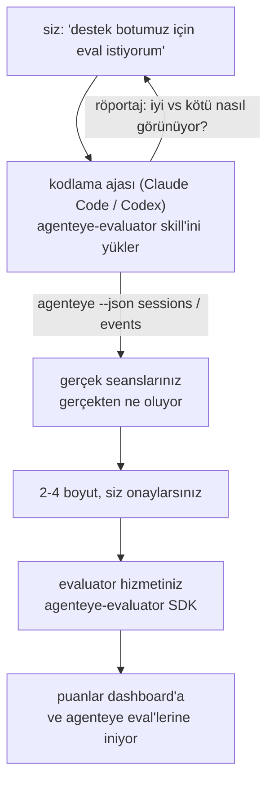

*"Ajanız bazen kötü"* düzeyinden dağıtılmış bir puanlama hizmetine kadar gidin; kodlama ajanız hem karar vermek hem de inşa etmek yapıyor. **Failproof AI Observability evaluator skill** (`agenteye-evaluator`), bir *Agent Skill*'dir: kodlama ajası olan Claude Code veya Codex gibi bir ajanın talep üzerine yüklediği küçük bir talimat klasörü. Ajanına *sizin* ajanız için hangi kalite boyutlarının izlenmeye değer olduğunu anlamayı, ardından [evaluator hizmetini](/tr/agenteye/evaluation-suite) yazmayı, test etmeyi ve dağıtmayı öğretir.

Bu, barındırılan bir puanlayıcı, yüklediğiniz bir kayıt defteri veya eklenti sistemi **değildir**. Evaluator'unuz kendi HTTP hizmetiniz olarak kendi altyapınızda kalır, tam olarak [Evaluation suite](/tr/agenteye/evaluation-suite) kılavuzunda açıklandığı gibi. Skill sadece ajanınıza bunu iyi yapmasını öğretir; dolayısıyla yaptığı her şey, aynı kodu yazarak kendiniz yapabileceğiniz şeylerdir.

---

## Zor kısım ne puanlanacağına karar vermektir

SDK yüzeyi küçüktür — bir dekoratör ve iki model — ve bir ajan bunu [kontratından](/tr/agenteye/evaluation-suite#http-contract) yazabilir. Bu, evaluator'ların başarısız olduğu yer değildir. Yanlış şeyi puanladıkları için başarısız olurlar ve yanlış şeyi puanlayan bir evaluator hiçbir şeyden daha kötüdür: herkesin yok saymayı öğrendiği bir dashboard üretir.

Bu nedenle skill'in çoğu, herhangi bir kod var olmadan önceki kısımdır. Ajan sizle röportaj yapar (*"iyi giden bir çalışmayı açıkla; şimdi kötü giden birini"*), sonra gerçek seanslarınızı [`agenteye` CLI](/tr/agenteye/cli) üzerinden çeker ve sondan sona okur. Bu iki yarı genellikle anlaşmaz ve boşluk noktadır: ölçmeyi hedeflediğiniz ile yazılı kayıtlarınızın gerçekten destekleyebileceği arasındaki fark. Bir boyut yalnızca olaylardan **hesaplanabilir** ve **ayırıcı** ise hayatta kalır — iyi çalışmanızda ve kötü çalışmanızda 0,9 puan alıyorsa, hiçbir şey öğretmez ve kesilir.

Geri gelenler, bir satır yazılmadan önce onaylamanız için akıl yürütme ile 2-4 boyutun bir önerisidir.



---

## Diğer değerlendirme parçaları ile ilişkisi

Dört belge puanlamayı kapsar ve sırayla birbirini ele verir:

| Sayfa | Ne olduğu | Ne zaman ulaşılır |
|---|---|---|
| **[Evaluations](/tr/agenteye/evaluations)** | Özellik: oturum ızgarası, pano, yeniden değerlendirme üzerinde puanlar | Otomatik puanlamanın ne getirdiğini bilmek istiyorsunuz |
| **[Evaluation suite](/tr/agenteye/evaluation-suite)** | HTTP kontratı, SDK, sunucu ortam değişkenleri | Evaluator'u kendiniz uyguluyorsunuz veya hata ayıklıyorsunuz |
| **Evaluator skill** (bu belge) | Puanlayıcı *tasarlama ve* inşa etme konusunda doğal dil ön kapısı | "Eval istiyorum"dan çalışan bir hizmete gitmek istiyorsunuz |
| **[CLI skill](/tr/agenteye/cli-skill)** | `agenteye` CLI'de doğal dil ön kapısı | Zaten sahip olduğunuz puanları *okumak* istiyorsunuz |
| **[Python SDK skill](/tr/agenteye/python-sdk-skill)** | Ajanınızı enstrüman etme konusunda doğal dil ön kapısı | Ajanız henüz oturum göstermiyorsunuz — puanlanacak hiçbir şey yok |

### CLI skill'e karşı: inşa etmek ve okumak

İki skill kasıtlı olarak çakışmaz ve her ikisini de yüklemek normal kurulumudur — ajan ne istediğinize göre ikisi arasında seçim yapar:

- **`agenteye-evaluator`** (bu belge) puanları *üretmeyi* sağlayan şeyi inşa eder. İş, puanlar ilk kez geldiğinde biter.
- **[`agenteye-cli`](/tr/agenteye/cli-skill)** zaten var olan puanları okur (`agenteye evals`). *"Bu hafta kalite düştü mü?"* onun sorusudur, bu skill'in değil.

---

## Ön Koşullar

1. **`agenteye` CLI yüklü ve oturum açılmış** (`pipx install agenteye`, sonra `agenteye login`). Skill bunu iki kez kullanır: tasarladığı gerçek seansları çekmek için ve puanlarınızın sonunda geldiğini doğrulamak için. Login'iniz `events:read` ve bu son kontrol için `evaluations:read` gerekir. CLI skill'te olduğu gibi, e-postayla gelen tek seferlik kod login'i sizin için **tamamlayamaz**.
2. **Evaluator'un yaşayacağı bir yer.** Bir görüntüye inşa edilir ve uzun çalışan bir hizmet olarak çalıştırılır; bu nedenle gerçek bir depo gerekir, çizim dosyası değil. Evaluator'ler sıklıkla kendi deposunda, puanlanan ajanından ayrı şekilde yaşarlar — skill varolan birini arar ve yeni bir tane başlatmadan önce sorar.
3. **`agenteye-evaluator` SDK wheel'ı** — ajanınız `pip` komutları yazmaya başlamadan önce sonraki bölümü okuyun.

---

## Nereden alacağınız

Skill, Failproof AI'ın genel skills koleksiyonunda yayınlanmıştır:

**[github.com/FailproofAI/skills](https://github.com/FailproofAI/skills)** → [`skills/agenteye-evaluator/`](https://github.com/FailproofAI/skills/tree/main/skills/agenteye-evaluator)

Depo genel ve skill'in kendi kimlik belgesi gerekli değildir — sadece oturum açtığınız `agenteye` CLI'yi kullanır ve *sizin* deponuzda kod yazar. Kendi klasörü olarak sevk edilir ve `pipx install agenteye` paketinin içinde **değildir**, bu nedenle orada aramayın.

## Skill'i Yükleme

En hızlı yol [`skills`](https://skills.sh) CLI'dir ve bu klasörü ajanınızın baktığı yere indirir:

```bash
# Claude Code, yalnızca bu proje
npx skills add FailproofAI/skills --skill agenteye-evaluator -a claude-code

# tüm projeler (~/.claude/skills/ dosyasına yükler)
npx skills add FailproofAI/skills --skill agenteye-evaluator -a claude-code -g --copy

# Bunun yerine Codex
npx skills add FailproofAI/skills --skill agenteye-evaluator -a codex
```

Sonra diğer skill'ler gibi yönetin:

```bash
npx skills list -a claude-code           # neyin yüklendiği
npx skills update agenteye-evaluator     # en son sürümü çek
npx skills remove agenteye-evaluator     # kaldır
```

Elle yüklemeyi tercih ediyor musunuz? Bir Agent Skill, `SKILL.md` içeren bir klasördür (artı isteğe bağlı referanslar), bu nedenle kopyalamak da işe yarar:

- **Claude Code**: `agenteye-evaluator/` klasörünü `~/.claude/skills/` (tüm projeler) veya `<your-repo>/.claude/skills/` (sadece bu depo) içine yerleştirin. Claude Code otomatik olarak keşfeder — `/skills` listesi ile doğrulayın veya sadece eval'ler için sorun.
- **Codex (OpenAI)**: Codex aynı `SKILL.md`'yi okur. Paketlenmiş `agents/openai.yaml`, `allow_implicit_invocation: true`'yu ayarlar; bu nedenle Codex bir görev eşleştiğinde skill'i otomatik seçer; aksi takdirde `$agenteye-evaluator` olarak açıkça çağırın.

---

## SDK Genel PyPI'de değildir

> **Uyarı:** Bir ajanın SDK'yı yüklemesine izin vermeden önce bunu okuyun.

Skill genel; onu kullandığı SDK değil. `agenteye-evaluator` sadece özel bir yayın artifakti olarak sevk edilir ve `agenteye`'den farklı olarak, ad genel PyPI'de **talep edilmemiştir** — bu nedenle açık bir `pip install agenteye-evaluator`, üretim yazılı kayıtlarınızı okuyan hizmete garip bir paketin çekilmesi anlamına gelebilir. Bu bir yazım hatası değil, bir tedarik zinciri problemidir.

Skill bunu bilir ve bunun yerine yüklemeler merdiveniyle inerek geçerli olan ilk basamakta durur: AgentEye deposunun içindeyseniz monorepo kaynağı, aksi takdirde GitHub Releases'ten özel yayın wheel'ı (erişim gerektirir) ve ne de geçerli değilse **durur ve Failproof AI ilgili kişiden wheel almayı söylemek yerine** durur.

Ajanınız genel PyPI'den açık bir `pip install agenteye-evaluator` öneriyorsa, bu skill'in hiçbir zaman yüklenmediğinin göstergesidir. Orada durun ve yüklü olup olmadığını kontrol edin.

---

## Ne isteyebilirsiniz

Gerçek bir gidiş-dönüş belirsiz bir istekle başlar ve kodla değil, imzalı bir tasarımla biter:

```text
siz   ▸ Destek botumuz için eval istiyorum. Bazen kötü olduğunu düşünüyorum.

ajan ▸ Herhangi bir şey yazmadan önce: iyi giden bir çalışmayı ve
        kötü giden birini açıkla.

siz   ▸ İyi: belgelerden cevap verir. Kötü: hayal uydurur veya
        "destek ile iletişim kurun" diyerek bırakır.

ajan ▸ Çalışıyor: agenteye --json sessions --status error --since 7d
        5 oturum okuyor, ikisi senin kötü olarak adlandırdığın oturum.

        Sözlerin doğruluk ve sapma. Yazılı kayıtlar sapma konusunda
        anlaşıyor (5 oturumun 2'si destek teslimi ile bitiriliyor,
        model_response.content'te açık), ama doğruluk olaylarınızın
        taşımadığı bir gerçeğe ihtiyaç duyuyor.

        Yani üç şeyi puanlayacağım:
          - deflection       kurallar, ucuz, çalışmalarınızı ayırıyor
          - tool_efficiency  kurallar, çalışma-004'teki tekrar döngüsünü yakalar
          - groundedness     LLM hakim: belgede aldığı her iddia var mı?

        "factuality" bizim olmayan gerçeğe ihtiyaç duyar; groundedness
        yazılı kayıtlarınızın gerçekten destekleyebileceği en yakın şeydir.
        Bu üç ad ile sorun var mı? Daha sonra yeniden adlandırmak geçmişi böler.

siz   ▸ yok

ajan ▸ Bu depoda evaluator yok. Bunu burada başlatsam mı, yoksa başka yerde bir tane mi var?
```

Oradan kurallar tabanlı boyutları önce yazar (ücretsiz, anında, deterministik), onları çöken boş ve hiçbir zaman bitmeyen gerçek bir yakalanan oturuma karşı test eder ve yalnızca öznel boyutta LLM hakim ulaşır. [Dispatcher'ın limitlerini](/tr/agenteye/evaluation-suite#configuring-the-server) biliyor — 30 saniyelik istek zaman aşımı ve 8 eşzamanlı çağrı dağıtım genelinde — yani hakim güvenilir bir şekilde uymazsa, judge'ın beş kez iptal edilmesi ve yeniden denenmesi yerine `JobPending` ile eşzamansız gider.

Sonra dağıtır, iki sunucu ortam değişkenini ayarlar ve `agenteye --json evals --session-id <id>` ile puanların gerçekten geldiğini doğrular. Puanlar gelmek tek kanıttır.

---

## Nelere dikkat edin

- **Boyut adları neredeyse kalıcıdır.** Puan anahtarları keyfi dizelerdir ve platform gönderdiğiniz herhangi bir şeyi eğilimlendirir; bu da aşağı akışta kötü bir seçim düzeltilmez. Daha sonra yeniden adlandırın ve geçmiş bölünür: eski oturumlar eski anahtarı tutar ve eğilim kırılır. Bu, skill'in kod yazmadan önce açık onay almış olmasının nedenidir — bu istemi ciddiye alın.
- **Fixtures gerçek üretim yazılı kayıtlarıdır.** Gerçek seanslar karşısında tasarlama, onları diske çekmeyi ve müşteri verilerini içerebilecekleri anlamına gelir. Skill git'e kaydetmeden önce sorar; şüpheye düşerseniz, `fixtures/` depodan çıkartın ve her geliştirici kendi dosyasını çeksin.
- **Ajan, her yazılı kaydı okuyan bir hizmet yazar ve dağıtır.** Sizin adınıza hareket eder, CLI login'iniz izinleriyle sınırlı, ama evaluator'u üretim verisine dokunuşu olan başka herhangi bir kod gibi gözden geçirin.

---

## Sonraki Adımlar

- **[Evaluation suite](/tr/agenteye/evaluation-suite)**: HTTP kontratı, SDK ve skill'in yapılandırdığı sunucu ortam değişkenleri.
- **[Evaluations](/tr/agenteye/evaluations)**: puanlar geldiğinde gösterilen yer.
- **[CLI skill](/tr/agenteye/cli-skill)**: puanlayıcı oluşturmak yerine sonuçları okumak için kardeş skill.
- **[CLI](/tr/agenteye/cli)**: skill'in tasarladığı oturum verisinin arkasındaki komut referansı.