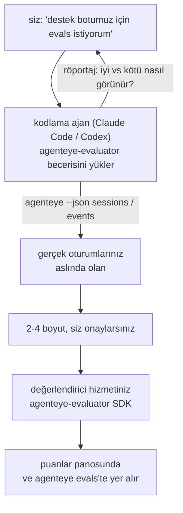

---
---
title: "Failproof AI Gözlenebilirlik Değerlendirici Ajan Becerisi"
description: "\"Sanırım ajanımız bazen kötü\" düzeyinden dağıtılmış bir puanlama hizmetine geçin; kodlama ajanınız hem karar verme hem de inşa etme işlemlerini yapacak."
---


*"Sanırım ajanımız bazen kötü"* düzeyinden dağıtılmış bir puanlama hizmetine geçin; kodlama ajanınız hem karar verme hem de inşa etme işlemlerini yapacak. **Failproof AI Gözlenebilirlik değerlendirici becerisi** (`agenteye-evaluator`), bir *Ajan Becerisidir*: bir kodlama ajan örneğin Claude Code veya Codex'in ihtiyaç duyduğunda yükleyebildiği, talimatlardan oluşan küçük bir klasör. Ajanı, *sizin* ajanınız için izlemeye değer kalite boyutlarını belirlemek üzere, ardından [değerlendirici hizmetini](/tr/agenteye/evaluation-suite) yazıp test edip dağıtmak için eğitir.

Bu, barındırılan bir puanlayıcı, yükleyeceğiniz bir kayıt defteri veya bir eklenti sistemi **değildir**. Değerlendiriciniz, [Değerlendirme paketi](/tr/agenteye/evaluation-suite) kılavuzunda tam olarak açıklandığı gibi, kendi altyapınızda kendi HTTP hizmetiniz olarak kalır. Beceri, ajanı bunu iyi yapacak şekilde eğitmekten ibaret olup, yaptığı her şey siz aynı kodu yazarak kendiniz yapabilirsiniz.

---

## Zor olan kısım neyi puanlanacağına karar vermek

SDK yüzeyi küçüktür — bir dekoratör ve iki model — ve bir ajan bunu [sözleşmeden](/tr/agenteye/evaluation-suite#http-contract) yalnız okuyarak yazabilir. Değerlendirmelerin başarısız olduğu yer burası değil. Yanlış şeyi puanlandıkları için başarısız olurlar ve yanlış şeyi puanlayan bir değerlendirici hiçbir değerlendirmeden daha kötüdür: herkesin görmezden gelmeyi öğrendiği bir pano üretir.

Bu yüzden becerisinin çoğu, hiç kod var olmadan önceki kısmıdır. Ajan sizi röportaj eder (*"iyi geçen bir çalıştırmayı tanımla; şimdi de kötü geçeni"*), sonra [`agenteye` CLI](/tr/agenteye/cli) aracılığıyla gerçek oturumlarınızı çeker ve onları baştan sona okur. Bu iki yarı genellikle anlaşmazlığa düşer ve boşluk önemlidir: ölçmeyi amaçladığınız şey ile transkriptlerinizin gerçekten destekleyebileceği şey arasındaki fark. Bir boyut ancak, etkinliklerden **hesaplanabilir** ve **ayırt edici** ise (hem iyi çalıştırmanızda hem de kötü çalıştırmanızda 0.9 puan alırsa hiçbir şey öğretmez ve silinirse) hayatta kalır.

Geri gelenler, 2-4 boyuttan oluşan, eklenmiş akıl yürütme ile bir tekliftir; herhangi bir satır yazılmadan siz tarafından onaylanması için.



---

## Diğer değerlendirme parçalarıyla ilişkisi

Dört belge puanlamayı kapsar ve sırasıyla birbirlerine başarır:

| Sayfa | Ne olduğu | Ne zaman ihtiyacınız olur |
|---|---|---|
| **[Evaluations](/tr/agenteye/evaluations)** | Özellik: oturum ızgarasında puanlar, panoslar, yeniden değerlendir | Otomatik puanlamanın size ne getireceğini bilmek istiyorsunuz |
| **[Evaluation suite](/tr/agenteye/evaluation-suite)** | HTTP sözleşmesi, SDK, sunucu ortam değişkenleri | Değerlendiriciyi kendiniz uygularken veya hata ayıklarken |
| **Evaluator becerisi** (bu belge) | Puanlayıcıyı tasarlama *ve* inşa etme konusunda doğal dil ön kapısı | "Evals istiyorum"dan çalışan bir hizmete gitmek istiyorsunuz |
| **[CLI becerisi](/tr/agenteye/cli-skill)** | `agenteye` CLI'ye doğal dil ön kapısı | Zaten sahip olduğunuz puanları *okumak* istiyorsunuz |
| **[Python SDK becerisi](/tr/agenteye/python-sdk-skill)** | Ajanınızı enstrüman etme konusunda doğal dil ön kapısı | Ajanınız henüz oturum yayınlamıyor — puanlanacak bir şey yok |

### CLI becerisi ile karşılaştırma: inşa etme vs okuma

İki beceri kasıtlı olarak örtüşmez ve her ikisini de yüklemek normal kurulumtur — ajan ne sorduğunuza bağlı olarak aralarında seçim yapar:

- **`agenteye-evaluator`** (bu belge) puanları *üreten* şeyi inşa eder. İşi, puanlar ilk kez iniş yaptığında sona erer.
- **[`agenteye-cli`](/tr/agenteye/cli-skill)** zaten var olan puanları okur (`agenteye evals`). *"Kalite bu hafta düştü mü?"* onun sorusudur, bu becerisinin değil.

---

## Ön koşullar

1. **`agenteye` CLI yüklenmiş ve giriş yapılmış** (`pipx install agenteye`, sonra `agenteye login`). Beceri bunu iki kez kullanır: tasarladığı gerçek oturumları çekmek ve puanlarınızın sonunda iniş yaptığını onaylamak. Girişinizin `events:read`'e ve bu son kontrolü için `evaluations:read`'e ihtiyacı var. CLI becerisi gibi, e-postayla gönderilen tek kullanımlık kod girişini sizin için **tamamlayamaz**.
2. **Değerlendiriciniz için yaşanacak bir yer.** Bir imaja inşa edilir ve uzun süreli bir hizmet olarak çalıştırılır, bu nedenle gerçek bir repo'ya ihtiyacı vardır, çizim dosyası değil. Değerlendiricieler genellikle puanlanmakta olan ajandan ayrı kendi repo'larında yaşarlar — beceri var olanı arar ve yeni birini isketelendirmeden önce sorar.
3. **`agenteye-evaluator` SDK tekerleği** — ajanınız `pip` komutlarını yazmaya başlamadan önce sonraki bölümü okuyun.

---

## Nereden alacağınız

Beceri, Failproof AI'nin genel kabiliyetler koleksiyonunda yayınlanır:

**[github.com/FailproofAI/skills](https://github.com/FailproofAI/skills)** → [`skills/agenteye-evaluator/`](https://github.com/FailproofAI/skills/tree/main/skills/agenteye-evaluator)

Depo halka açık ve becerinin kendi kimlik bilgisine ihtiyacı yoktur — yalnızca `agenteye` CLI'yi sizin giriş yaptığınız oturumla sürücüler ve *sizin* repo'nuzda kod yazar. Kendi klasörü olarak sunulduğunu ve `pipx install agenteye` paketi içinde **olmadığını** unutmayın, bu nedenle orada aramayın.

## Beceriyi yükleme

En hızlı yol, klasörü getiren ve ajanınızın baktığı yere koyan [`skills`](https://skills.sh) CLI'sidir:

```bash
# Claude Code, yalnızca bu proje
npx skills add FailproofAI/skills --skill agenteye-evaluator -a claude-code

# her proje (~/.claude/skills/'ye yükler)
npx skills add FailproofAI/skills --skill agenteye-evaluator -a claude-code -g --copy

# Bunun yerine Codex
npx skills add FailproofAI/skills --skill agenteye-evaluator -a codex
```

Sonra başka herhangi bir beceri gibi yönetin:

```bash
npx skills list -a claude-code           # neler yüklü
npx skills update agenteye-evaluator     # en son sürümü çek
npx skills remove agenteye-evaluator     # kaldır
```

Tercihen elle mi yüklemek istersiniz? Bir Ajan Becerisi, `SKILL.md` içeren (artı isteğe bağlı referanslar) bir klasördür, bu nedenle kopyalama da işe yarar:

- **Claude Code**: `agenteye-evaluator/` klasörünü `~/.claude/skills/` (her proje) veya `<your-repo>/.claude/skills/` (yalnızca o repo) içine koyun. Claude Code bunu otomatik keşfeder — `/skills` listesi ile doğrulayın veya sadece evals isteyin.
- **Codex (OpenAI)**: Codex aynı `SKILL.md` dosyasını okur. Paketle birlikte gelen `agents/openai.yaml`, `allow_implicit_invocation: true` ayarını yapar, bu nedenle Codex görev eşleştiğinde beceriyi otomatik seçer; aksi takdirde bunu açık olarak `$agenteye-evaluator` olarak çağırın.

---

## SDK genel PyPI'de değil

> **Uyarı:** Bir ajana SDK yükletmesine izin vermeden bunu okuyun.

Beceri halka açık; onu sürücü eden SDK değildir. `agenteye-evaluator`, yalnızca özel bir sürüm yapısı olarak gönderilir ve `agenteye`'nin aksine, ad, genel PyPI'de **talep edilmemiştir** — bu nedenle basit bir `pip install agenteye-evaluator`, üretim transkriptlerinizi okuyan hizmete bir yabancının paketini çekebilir. Bu yazım hatası değil, bir tedarik zinciri sorunudur.

Beceri bunu bilir ve bunun yerine bir yükleme merdiveni aşağı çalışır, ilk geçerli basamakta durur: AgentEye repo'sunun içindeyseniz monorepo kaynağı, aksi takdirde GitHub Sürümlerindeki özel sürüm tekerleği (erişime ihtiyacı) ve ikisi de ulaşılamıyorsa bunun yerine **durur ve sizi tekerleği için Failproof AI kontak kişinize danışmanız için söyler**.

Bu nedenle ajanınız genel PyPI'den basit bir `pip install agenteye-evaluator` önerirse, bu becerisinin asla yüklenmedikçe anlatılacak bir işarettir. Orada durun ve yüklü olduğunu kontrol edin.

---

## Ne sorabilirsiniz

Gerçek bir gidiş-dönüş, belirsiz bir talep ile başlayıp imzalı bir tasarım ile sona erer, kod ile değil:

```text
siz   ▸ Destek botumuz için evals istiyorum. Sanırım bazen kötü.

ajan ▸ Bir şey yazmadan önce: iyi geçen bir çalıştırmayı tanımla
        ve kötü geçeni de tanımla.

siz   ▸ İyi: belgelerden cevap verir. Kötü: hayal uydurur
        veya vazgeçip "desteğe başvur" der.

ajan ▸ Çalışıyor: agenteye --json sessions --status error --since 7d
        5 oturum okunuyor, ikisi de kötü olarak adlandırılanlar.

        Sizin sözcükleriniz doğruluk ve sapıtmayı söylüyor. Transkriptler
        sapıtmada anlaşıyor (5'in 2'si destek devriyle bitiyor
        ve model_response.content'te açık), ama doğruluk
        etkinliklerinizin taşımadığı bir temel gerçeğe ihtiyacı duyuyor.

        Bu yüzden üç şeyi puanlandırırım:
          - sapıtma      kurallar, ucuz, iki çalıştırmanızı ayırır
          - araç_verimlilik kurallar, çalıştır-004'teki yeniden deneme döngüsünü yakalar
          - köklenme    LLM hakim: transkriptlerde aldığı belgenin her iddiası var mı?

        "doğruluk" sahip olmadığımız temel gerçeğe ihtiyacı duyardu; köklenme
        transkriptlerinizin gerçekten destekleyebileceği en yakın şeydir.
        Bu üç ad ile tamam mısınız? Daha sonra yeniden adlandırma geçmişi böler.

siz   ▸ evet

ajan ▸ Bu repo'da değerlendirici yok. Burada birini isketelendirmeli miyim,
        yoksa başka bir yerinde bir tane mi var?
```

Oradan itibaren kural tabanlı boyutları ilk olarak yazar (ücretsiz, anında, belirleyici), bunları boş olanlar ve çoğu satın alma gözlemcilerin kaza yaptığı hiçbir zaman bitmeyen olanlar da dahil olmak üzere gerçek bir yakalanan oturuma karşı test eder ve öznel boyutta yalnızca bir LLM hakimine ulaşır. [Dağıtıcının sınırlarını](/tr/agenteye/evaluation-suite#configuring-the-server) bilir — 30 sn istek zaman aşımı ve 8 eşzamanlı çağrı dağıtım genelinde — bu nedenle hakim güvenilir bir şekilde sığmazsa, aracı değil `JobPending` ile asenkrona gider ve hakiniz beş kez iptal edilip beş kez maliyeti ile yeniden denenmeyecek.

Sonra dağıtır, iki sunucu ortam değişkenini ayarlar ve `agenteye --json evals --session-id <id>` ile puanların gerçekten iniş yaptığını onaylar. Puanlar inmek, tek kanıttır.

---

## Nelere dikkat etmeli

- **Boyut adları neredeyse kalıcıdır.** Puan anahtarları keyfi dizelerdir ve platform gönderdiğiniz her şeyi eğilimlendirir, bu da aşağı akış hiçbir kötü seçimi düzeltmez. Daha sonra yeniden adlandırın ve geçmiş bölünür: eski oturumlar eski anahtarı tutar ve eğilim kırılır. Bu neden becerisinin kod yazılmadan önce açık onay aldığının nedenidir — o istemi ciddiye alın.
- **Armatürler gerçek üretim transkriptleridir.** Gerçek oturumlar tasarlamak, bunları diske çekmeyi demek ve müşteri verisi içerebilirler. Beceri git'e yapıştırmadan önce sorar; şüphe varsa `fixtures/` repo'nun dışında tutun ve her geliştiricinin kendikini çekişi olsun.
- **Ajan yazıp her transkripti okuyan bir hizmet dağıtır.** Siz olarak hareket eder, CLI girişinizin izinleriyle sınırlanır, ama üretim verisine dokunan başka herhangi bir kod gibi değerlendiriciyi gözden geçirin.

---

## Sonraki adımlar

- **[Evaluation suite](/tr/agenteye/evaluation-suite)**: HTTP sözleşmesi, SDK ve becerisinin ayarladığı sunucu ortam değişkenleri.
- **[Evaluations](/tr/agenteye/evaluations)**: puanlar inmek ve onunla hesapta gösterildiğinde.
- **[CLI becerisi](/tr/agenteye/cli-skill)**: kardeş beceri, puanlayıcıyı inşa etmek yerine sonuçları okumak için.
- **[CLI](/tr/agenteye/cli)**: becerisinin tasarladığı oturum verilerinin arkasındaki komut referansı.