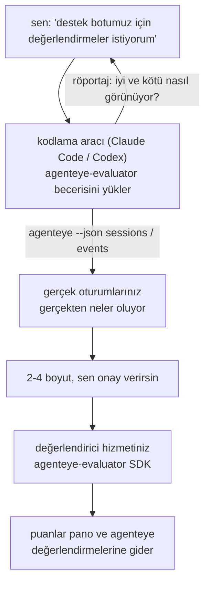

"*Aracımız bazen kötü performans gösteriyor sanırım*" düşüncesinden dağıtılan bir puanlama hizmetine geçin; kodlama aracınız hem karar vermeyi hem de oluşturmayı yapıyor. **Failproof AI Gözlemlenebilirlik değerlendirici becerisi** (`agenteye-evaluator`), bir *Araç Becerisidir*: Claude Code veya Codex gibi bir kodlama aracının ihtiyaç duyduğunda yüklediği, talimatlardan oluşan küçük bir klasör. Aracına *sizin* aracınız için izlenmeye değer kalite boyutlarını çözmesi, ardından bu boyutları puanlayan [değerlendirici hizmetini](/tr/agenteye/evaluation-suite) yazması, test etmesi ve dağıtması öğretir.

**Değildir** barındırılan bir puanlayıcı, yüklediğiniz bir kayıt defteri veya eklenti sistemi. Değerlendiriciniz kendi altyapınızda, [Değerlendirme paketi](/tr/agenteye/evaluation-suite) rehberinde açıklandığı gibi kendi HTTP hizmetiniz olarak kalır. Beceri, aracınızın bunu iyi bir şekilde oluşturmasını öğretir; bu nedenle yaptığı her şeyi, aynı kodu yazarak kendiniz yapabilirsiniz.

---

## Zor kısım neyin puanlanacağına karar vermek

SDK yüzeyi küçüktür — bir dekoratör ve iki model — ve bir aracı bunu yalnızca [sözleşmeden](/tr/agenteye/evaluation-suite#http-contract) yazabilir. Değerlendirmelerin başarısız olduğu yer burası değildir. Yanlış şeyi puanladığı için başarısız olurlar ve yanlış şeyi puanlayan bir değerlendirici hiç olmadığından daha kötüdür: herkesin öğrenip görmezden geldiği bir pano üretir.

Bu yüzden becerinin çoğu herhangi bir kod varoluşundan önceki kısımdır. Aracının sizi röportaj yapmasını sağlar (*"iyi giden bir çalıştırma açıkla; şimdi de kötü giden birini"*), ardından gerçek oturumlarınızı [`agenteye` CLI](/tr/agenteye/cli) aracılığıyla çeker ve bunları baştan sona okur. Bu iki yarı genellikle anlaşmazlığa düşer ve boşluk önemlidir: ölçmeyi niyetlendiğiniz şey ile kayıtlarınızın gerçekten destekleyebildiği şey arasındaki fark. Bir boyut ancak olaylardan **hesaplanabilir** ve **ayırt edicidir** — hem iyi çalıştırmada hem de kötü çalıştırmada 0.9 puan alıyorsa, hiçbir şey öğretmez ve kesilir.

Geri gelen şey, herhangi bir satır yazılmadan önce onayınız için gerekçesi eklenmiş 2-4 boyuttan oluşan bir tekliftir.



---

## Diğer değerlendirme parçalarıyla ilişkisi

Puanlama hakkında dört belge vardır ve sırayla birbirlerine el uzatırlar:

| Sayfa | Ne olduğu | Şu zaman kullan |
|---|---|---|
| **[Değerlendirmeler](/tr/agenteye/evaluations)** | Özellik: oturum ızgarasında puanlar, panolar, yeniden değerlendir | Otomatik puanlamanın ne elde ettiğini bilmek istiyorsun |
| **[Değerlendirme paketi](/tr/agenteye/evaluation-suite)** | HTTP sözleşmesi, SDK, sunucu ortam değişkenleri | Değerlendiriciyi kendin uyguluyor veya hata ayıklıyorsun |
| **Değerlendirici becerisi** (bu belge) | Puanlayıcıyı tasarlamak *ve* oluşturmak için doğal dil ön kapısı | "Değerlendirmeler istiyorum"dan çalışan hizmete geçmek istiyorsun |
| **[CLI becerisi](/tr/agenteye/cli-skill)** | `agenteye` CLI hakkında doğal dil ön kapısı | Zaten sahip olduğun puanları *okumak* istiyorsun |
| **[Python SDK becerisi](/tr/agenteye/python-sdk-skill)** | Aracını yapılandırmak hakkında doğal dil ön kapısı | Aracın henüz oturum yayınlamıyor — puanlanacak bir şey yok |

### CLI becerisiyle karşılaştırıldığında: oluştur ve oku

İki beceri kasıtlı olarak örtüşmez ve her ikisini de yüklemek normal kurulumdur — aracı, sorduğun şeye göre aralarında seçim yapar:

- **`agenteye-evaluator`** (bu belge) puanları *üreten* şeyi oluşturur. İşi puanlar ilk kez geldiğinde biter.
- **[`agenteye-cli`](/tr/agenteye/cli-skill)** zaten var olan puanları okur (`agenteye evals`). Sorusu bu becerinin değil, "*Bu hafta kalite düştü mü?*" değildir.

---

## Ön koşullar

1. **`agenteye` CLI yüklü ve oturum açmış** (`pipx install agenteye`, ardından `agenteye login`). Beceri bunu iki kez kullanır: tasarladığı gerçek oturumları çekmek ve puanlarınızın sonunda indiğini onaylamak için. Oturum açmanız `events:read` gerektirir, son kontrol için `evaluations:read`. CLI becerisiyle olduğu gibi, e-postayla gelen tek seferlik kod oturum açmasını *tamamlayamaz*.
2. **Değerlendirici için bir yer.** Bir görüntüye oluşturulur ve uzun süreli hizmet olarak çalıştırılır, bu nedenle çerme dosyası değil gerçek bir depoya ihtiyaç duyar. Değerlendirmenler genellikle puanlanan aracıdan ayrı kendi depolarında bulunur — beceri mevcut birini arar ve yeni birini kurmadan önce sorar.
3. **`agenteye-evaluator` SDK tekerleği** — aracınız `pip` komutu yazmaya başlamadan önce sonraki bölümü okuyun.

---

## Nereden alacaksınız

Beceri Failproof AI'nin halka açık beceri koleksiyonunda yayımlanır:

**[github.com/FailproofAI/skills](https://github.com/FailproofAI/skills)** → [`skills/agenteye-evaluator/`](https://github.com/FailproofAI/skills/tree/main/skills/agenteye-evaluator)

Depo herkese açıktır ve beceri kendi kimlik bilgisine ihtiyaç duymaz — yalnızca `agenteye` CLI'ı oturum açtığınız oturumla yönlendirir ve kodu *sizin* depoya yazar. Kendi klasörü olarak gönderildiğini ve `pipx install agenteye` paketinin *içinde olmadığını* unutmayın, bu nedenle orada arama yapmayın.

## Beceriyi yükleme

En hızlı yol [`skills`](https://skills.sh) CLI'ıdır; bu, klasörü getirir ve aracınızın aradığı yere koyar:

```bash
# Claude Code, yalnızca bu proje
npx skills add FailproofAI/skills --skill agenteye-evaluator -a claude-code

# her proje (~/.claude/skills/ konumuna yükler)
npx skills add FailproofAI/skills --skill agenteye-evaluator -a claude-code -g --copy

# Codex yerine
npx skills add FailproofAI/skills --skill agenteye-evaluator -a codex
```

Sonra diğer herhangi bir beceri gibi yönetin:

```bash
npx skills list -a claude-code           # yüklü olanlar
npx skills update agenteye-evaluator     # en son sürümü çek
npx skills remove agenteye-evaluator     # kaldır
```

El ile yüklemeyi tercih ediyor? Bir Araç Becerisi yalnızca bir `SKILL.md` içeren klasördür (artı isteğe bağlı kaynaklar), bu nedenle kopyalama da işe yarar:

- **Claude Code**: `agenteye-evaluator/` klasörünü `~/.claude/skills/` (her proje) veya `<depo-adınız>/.claude/skills/` (yalnızca o depo) konumuna koyun. Claude Code otomatik olarak bulur — `/skills` listesiyle doğrulayın veya değerlendirmeler hakkında sorun.
- **Codex (OpenAI)**: Codex aynı `SKILL.md` dosyasını okur. Pakete dahil `agents/openai.yaml`, `allow_implicit_invocation: true` ayarlar, bu nedenle Codex bir görev eşleştiğinde otomatik olarak beceriyi seçer; aksi takdirde `$agenteye-evaluator` olarak açıkça çağırın.

---

## SDK halka açık PyPI'de değil

> **Uyarı:** Bir aracının SDK'yı yüklemesine izin vermeden önce bunu okuyun.

Beceri herkese açıktır; onu yönlendiren SDK değildir. `agenteye-evaluator` yalnızca özel yayın yapısı olarak gönderilir ve `agenteye` aksine, ad **halka açık PyPI'de talep edilmemiştir** — bu nedenle basit bir `pip install agenteye-evaluator` komutu başka birinin paketini, üretim kayıtlarınızı okuyan hizmete çekebilir. Bu bir yazım hatası değil, tedarik zinciri sorunudur.

Beceri bunu bilir ve bu nedenle uygulanabilir ilk adımda duran bir yükleme merdivenini çalıştırır: AgentEye deposunun içindeyseniz monorepo kaynağı, aksi takdirde GitHub Sürümlerinden özel yayın tekerleği (erişim gerektirir) ve ikisi de ulaşılamıyorsa **durur ve Failproof AI iletişim kişinizden tekerleği istemenizi söyler** tasarlama yapmak yerine.

Aracınız halka açık PyPI'den basit `pip install agenteye-evaluator` önerirse, bu becerinin hiç yüklenmediğinin göstergesidir. Orada durun ve yüklü olup olmadığını kontrol edin.

---

## Ne isteyebilirsiniz

Gerçek bir gidiş-dönüş belirsiz bir istekle başlar ve kodla değil imzalı bir tasarımla biter:

```text
sen   ▸ Destek botumuz için değerlendirmeler istiyorum. Sanırım
        bazen kötü performans gösteriyor.

aracı ▸ Herhangi bir şey yazmadan önce: iyi giden bir çalıştırmayı
        açıkla ve kötü giden birini.

sen   ▸ İyi: dokümanlardan cevap veriyor. Kötü: uydurma yapıyor
        veya vazgeçip "destek alın" diyor.

aracı ▸ Çalışıyor: agenteye --json sessions --status error --since 7d
        5 oturumun okunuyor; ikisi kötü olarak nitelediğin.

        Söylediklerin doğruluk ve yönlendirme. Kayıtlar yönlendirmede
        hemfikir (5 oturumun 2'si destek tarafına teslim ve
        model_response.content'te açık) ama doğruluk olaylarınızın
        taşımadığı bir yer gerçeğine ihtiyaç duyuyor.

        Yani üç şeyi puanladım:
          - yönlendirme      kurallar, ucuz, iki çalıştırmayı ayırır
          - araç_verimliliği döngüyü yakalar (run-004)
          - temellilik       LLM hakim: kayıtlı her iddia kaynaklarda mı?

        "doğruluk" için elimizde olmayan bir yer gerçeği gerekir;
        temellilik kayıtlarınızın gerçekten destekleyebildiği en yakın.
        Bu üç ad iyi mi? Sonra yeniden adlandırma tarihçeyi böler.

sen   ▸ evet

aracı ▸ Bu depoda değerlendirici yok. Burada mı kurulum yapmalı,
        yoksa başka bir yerde var mı?
```

Oradan kural tabanlı boyutları ilk yazar (ücretsiz, anlık, belirleyici), gerçek yakalanan oturuma karşı test eder — boşta kalıp hiç bitmeyenler de dahil naif değerlendiricileri çökertir — ve öznel boyutta yalnızca LLM hakime ulaşır. [Gönderici sınırlarını](/tr/agenteye/evaluation-suite#configuring-the-server) bilir — 30 saniye istek zaman aşımı ve 8 eşzamanlı çağrı dağıtım genelinde — bu nedenle hakim güvenilir şekilde uymuyorsa, beş kez beş kez maliyetle iptal ve yeniden denenme yerine `JobPending` ile eşzamansız hale gelir.

Ardından dağıtır, iki sunucu ortam değişkenini ayarlar ve `agenteye --json evals --session-id <id>` ile puanların gerçekten indiğini onaylar. Puanların inmesi tek kanıttır.

---

## Neleri gözlemlemeliyiz

- **Boyut adları neredeyse kalıcıdır.** Puan anahtarları keyfi dizelerdir ve platform ne gönderirseniz onu eğilimlendirir, bu nedenle hiçbir şey akış aşağısında kötü bir seçimi düzeltmez. Sonra yeniden adlandırın ve tarihçe bölünür: eski oturumlar eski anahtarı tutar ve eğilim kırılır. Bu yüzden beceri kod yazmadan önce açık onay alır — bu istemi ciddiye alın.
- **Sabitler gerçek üretim kayıtlarıdır.** Gerçek oturumlara karşı tasarlamak disk'e çekmek anlamına gelir ve müşteri verisi içerebilirler. Beceri git'e teslim etmeden önce sorar; şüphedeysek, `fixtures/` depoda tutmayın ve her geliştirici kendi kişisini çeksin.
- **Aracı her kayıtı okuyan bir hizmet yazar ve dağıtır.** Sizin olarak davranır; CLI oturum açmanızın izinleriyle sınırlandırılır, ama değerlendiricyi üretim verisiyle temas eden başka herhangi bir kod gibi gözden geçirin.

---

## Sonraki adımlar

- **[Değerlendirme paketi](/tr/agenteye/evaluation-suite)**: HTTP sözleşmesi, SDK ve becerinin yapılandırdığı sunucu ortam değişkenleri.
- **[Değerlendirmeler](/tr/agenteye/evaluations)**: puanlar geldiğinde nerede göründüğü.
- **[CLI becerisi](/tr/agenteye/cli-skill)**: puanlayıcı oluşturmak yerine sonuçları okumak için kardeş beceri.
- **[CLI](/tr/agenteye/cli)**: becerinin tasarladığı oturum verisinin ardındaki komut referansı.