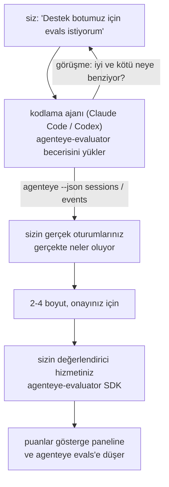

*"Sanırım ajanımız bazen kötü performans gösteriyor"* düzeyinden dağıtılmış bir puanlama hizmetine geçin; kodlama ajanınız hem karar verme hem de oluşturma işlemini yapıyor. **Failproof AI Gözlemlenebilirlik değerlendirici becerisi** (`agenteye-evaluator`), bir *Ajan Becerisi*'dir: bir kodlama ajanının (Claude Code veya Codex gibi) isteğe bağlı olarak yüklediği, küçük bir talimat klasörü. Ajanı, *sizin* ajanınız için izlenmeye değer kalite boyutlarını belirlemesi, ardından bu boyutları puanlayan [değerlendirici hizmetini](/tr/agenteye/evaluation-suite) yazmasını, test etmesini ve dağıtmasını öğretir.

Bu, barındırılan bir puanlayıcı, bir kayıt defteri ya da bir eklenti sistemi **değildir**. Değerlendiricileriniz, [Evaluation suite](/tr/agenteye/evaluation-suite) kılavuzunda açıklandığı gibi tamamen sizin altyapınızda kendi HTTP hizmetiniz olarak kalır. Beceri sadece ajanınızın bunu iyi bir şekilde oluşturmasını öğretir; yani yaptığı her şeyi siz de aynı kodu yazarak yapabilirsiniz.

---

## Zor kısım ne puanlanacağına karar vermektir

SDK yüzeyi küçüktür — bir dekoratör ve iki model — ve bir ajan bunu tek başına [sözleşmeden](/tr/agenteye/evaluation-suite#http-contract) yazabilir. Sorun burası değildir. Değerlendiriciler yanlış şeyi puanladıkları için başarısız olurlar ve yanlış şeyi puanlayan bir değerlendirici hiçbirinden daha kötüdür: herkesin görmezden gelmeyi öğrendiği bir gösterge paneli üretir.

Bu nedenle becerinin çoğu, herhangi bir kod yazılmadan önceki kısımdır. Ajan sizi sorgulamasını yapması (*"iyi giden bir çalıştırmayı açıklayın; şimdi kötü giden bir tane"*), ardından gerçek oturumlarınızı [`agenteye` CLI](/tr/agenteye/cli) aracılığıyla çekerek ve bunları baştan sona okuması. Bu iki yarı genellikle anlaşamaz ve bu boşluk amaçtadır: ölçmeyi niyetlediğiniz şey ile transkriptlerinizin gerçekte destekleyebileceği şey arasındaki fark. Bir boyut sadece etkinliklerden **hesaplanabilir** ve **ayırt edici** ise ayakta kalır — eğer iyi çalıştırmanızda ve kötü çalıştırmanızda 0,9 puan alırsa, hiçbir şey öğretmez ve silinir.

Geri dönen şey, herhangi bir satır yazılmadan önce onayınız için verilen, akıl yürütme ekli 2-4 boyutun bir önerisidir.



---

## Diğer değerlendirme parçalarıyla ilişkisi

Dört belge puanlamayı kapsar ve sırayla birbirlerine devredilir:

| Sayfa | Ne olduğu | Ne zaman kullanılır |
|---|---|---|
| **[Evaluations](/tr/agenteye/evaluations)** | Özellik: oturumlar ızgarasında puanlar, gösterge panelleri, yeniden değerlendir | Otomatik puanlamanın size ne getirdiğini bilmek istiyorsunuz |
| **[Evaluation suite](/tr/agenteye/evaluation-suite)** | HTTP sözleşmesi, SDK, sunucu ortam değişkenleri | Değerlendiriciyi kendiniz uyguluyorsunuz veya hata ayıklıyorsunuz |
| **Evaluator skill** (bu belge) | Puanlayıcı tasarımı *ve* oluşturma üzerine doğal dil ön kapısı | "Evals istiyorum" düzeyinden çalışan bir hizmete geçmek istiyorsunuz |
| **[CLI skill](/tr/agenteye/cli-skill)** | `agenteye` CLI üzerine doğal dil ön kapısı | Zaten sahip olduğunuz puanları *okumak* istiyorsunuz |
| **[Python SDK skill](/tr/agenteye/python-sdk-skill)** | Ajanınızı enstrüman etme üzerine doğal dil ön kapısı | Ajanınız henüz oturum göndermiyorsa — puanlanacak hiçbir şey yok |

### CLI becerisine karşı: oluşturma versus okuma

İki beceri bilinçli olarak çakışmayan, ve her ikisini de kurmak normal ayar — ajan, sorduğunuza göre ikisi arasında seçim yapar:

- **`agenteye-evaluator`** (bu belge) puanları *üreten* şeyi oluşturur. İşi puanlar ilk kez iniş yaptığında biter.
- **[`agenteye-cli`](/tr/agenteye/cli-skill)** zaten var olan puanları okur (`agenteye evals`). *"Kalite bu hafta düştü mü?"* onun sorusudur, bu becerinin değil.

---

## Ön Koşullar

1. **`agenteye` CLI yüklenmiş ve oturum açılmış** (`pipx install agenteye`, ardından `agenteye login`). Beceri bunu iki kez kullanır: tasarladığı gerçek oturumları çekmek için ve puanlarınızın sonunda indiğini onaylamak için. Oturumunuzun `events:read` ve son kontrol için `evaluations:read` izinleri gerekir. CLI becerisinde olduğu gibi, e-postayla gelen tek seferlik kod girişini sizin için **tamamlayamaz**.
2. **Değerlendiricinin yaşayacağı bir yer.** Bir görüntüye oluşturulur ve uzun süreli bir hizmet olarak çalıştırılır; bu nedenle gerçek bir depo gerekir, scratch dosyası değil. Değerlendiriciler genellikle puanlandığı ajandan ayrı, kendi deposunda yaşarlar — beceri mevcut olanı arar ve yeni bir tane oluşturmadan önce sorar.
3. **`agenteye-evaluator` SDK tekerleği** — ajanınız `pip` komutları yazmaya başlamadan önce sonraki bölümü okuyun.

---

## Nereden bulabilirsiniz

Beceri, Failproof AI'ın genel becerileri koleksiyonunda yayınlanmıştır:

**[github.com/FailproofAI/skills](https://github.com/FailproofAI/skills)** → [`skills/agenteye-evaluator/`](https://github.com/FailproofAI/skills/tree/main/skills/agenteye-evaluator)

Depo halkadır ve becerinin kendi kimlik bilgisine ihtiyacı yoktur — sadece `agenteye` CLI'yi oturum açtığınız seansla çalıştırır ve kodunuzu *sizin* depoda yazmanız. Kendi klasörü olarak gönderilir ve `pipx install agenteye` paketi içinde **değildir**, bu nedenle orada aramayın.

## Beceriyi Kurma

En hızlı yol [`skills`](https://skills.sh) CLI'sidir, klasörü getirin ve ajanınızın aradığı yere bırakır:

```bash
# Claude Code, sadece bu proje
npx skills add FailproofAI/skills --skill agenteye-evaluator -a claude-code

# her proje (~/.claude/skills/ kurulu)
npx skills add FailproofAI/skills --skill agenteye-evaluator -a claude-code -g --copy

# Codex yerine
npx skills add FailproofAI/skills --skill agenteye-evaluator -a codex
```

Diğer beceriler gibi yönetin:

```bash
npx skills list -a claude-code           # neler yüklenmiş
npx skills update agenteye-evaluator     # en son versiyonu çek
npx skills remove agenteye-evaluator     # kaldır
```

El ile kurmayı tercih ediyor? Ajan Becerisi sadece bir `SKILL.md` içeren bir klasördür (plus isteğe bağlı referanslar), böylece kopyalama da işe yarar:

- **Claude Code**: `agenteye-evaluator/` klasörünü `~/.claude/skills/` (her proje) veya `<your-repo>/.claude/skills/` (sadece o depo) içine koyun. Claude Code bunu otomatik keşfeder — `/skills` listesi ile doğrulayın veya sadece evals isteyin.
- **Codex (OpenAI)**: Codex aynı `SKILL.md`'yi okur. Bundled `agents/openai.yaml` `allow_implicit_invocation: true` ayarlanmıştır, bu nedenle bir görev eşleştiğinde Codex becerileri otomatik olarak seçer; aksi takdirde `$agenteye-evaluator` olarak açıkça çağırın.

---

## SDK genel PyPI'de değildir

> **Uyarı:** Ajanın SDK'yı kurmasına izin vermeden önce bunu okuyun.

Beceri halkadır; bunu çalıştırması gereken SDK değil. `agenteye-evaluator` sadece özel sürüm yapısı olarak gönderilir ve `agenteye` aksine, ad genel PyPI'de **talep edilmemiş** — bu nedenle `pip install agenteye-evaluator` üretim transkriptlerinizi okuyan hizmete başka birinin paketini çekebilir. Bu yazım hatası değil, bir tedarik zinciri sorunudur.

Beceri bunu bilir ve bunun yerine bir kurulum merdiveninden aşağıya doğru çalışır, uygulanacak ilk basamağında durur: AgentEye deposunun içindeyseniz monorepo kaynağı, aksi takdirde GitHub Releases'ten özel sürüm tekerleği (erişim gerekir) ve hiçbiri ulaşılamıyorsa **durur ve sizi Failproof AI temasa geçmesi için tekerleği istemeye söyler** improvize etmek yerine.

Yani ajanınız genel PyPI'den çıplak `pip install agenteye-evaluator` önerirse, bu becerinin asla yüklenmediğinin işaretidir. Orada durun ve kurulu olup olmadığını kontrol edin.

---

## Ne sorabileceğiniz

Gerçek bir gidiş-dönüş, muğlak bir istek ile başlar ve kod ile değil, imzalı bir tasarım ile biter:

```text
siz   ▸ Destek botumuz için evals istiyorum. Sanırım bazen kötü performans gösteriyor.

ajan ▸ Herhangi bir şey yazmadan önce: iyi giden bir çalıştırmayı ve 
        kötü giden bir çalıştırmayı açıklayın.

siz   ▸ İyi: belgelerden cevap veriyor. Kötü: uydurma yapıyor,
        ya da vazgeçip "destek ekibiyle iletişime geçin" diyor.

ajan ▸ Çalıştırıyor: agenteye --json sessions --status error --since 7d
        5 oturumu okuyuyor, kötü dediğiniz ikisini içeren.

        Sözcükleriniz doğruluk ve kaçınmadan bahsediyor. Transkriptler
        kaçınmada anlaşıyor (5'ten 2'si destek yönlendirmesi ile bitiyor,
        ve model_response.content'te açık), ama doğruluk için
        etkinliklerinizin taşımadığı bir yer gerçeği gerekiyor.

        Yani üç şey puanlardım:
          - kaçınma      kurallar, ucuz, çalıştırmalarınızı ayırıyor
          - tool_efficiency kurallar, run-004'teki retry döngüsünü yakalar
          - groundedness LLM hakim: alınan belgelerdeki her iddia geçerli mi?

        "doğruluk" bizim sahip olmadığımız yer gerçeği gerekir; 
        groundedness transkriptlerinizin gerçekte destekleyebileceği
        en yakın şeydir. Bu üç adla sorun var mı? Sonra yeniden adlandırma
        geçmişi böler.

siz   ▸ hayır

ajan ▸ Bu depoda değerlendirici yok. Burada bir tane oluşturasını mı istiyorsunuz,
        yoksa başka bir yerde var mı?
```

Oradan kural tabanlı boyutları ilk yazıyor (ücretsiz, anında, belirlenimci), bunları çıkan ve asla bitmeyen, naif değerlendiricileri çöken gerçek oturumlar dahil test ediyor, ve sadece öznel boyut üzerinde LLM hakimi yer alıyor. [Gönderen sınırlarını](/tr/agenteye/evaluation-suite#configuring-the-server) biliyor — 30s istek zaman aşımı ve dağıtım genelinde 8 eşzamanlı çağrı — böylece hakim güvenilir bir şekilde uymayacaksa, `JobPending` ile eşzamansız gidiyor, hakim iptal edilip beş kere yeniden denesin ve beş kat maliyet artsın diye.

Ardından dağıtıyor, iki sunucu ortam değişkenini ayarlıyor, ve `agenteye --json evals --session-id <id>` ile puanların gerçekten indiğini onaylıyor. Puanlar inmek tek ispattır.

---

## Dikkat Edilmesi Gerekenler

- **Boyut adları neredeyse kalıcıdır.** Puan anahtarları keyfi dizelerdir ve platform gönderdiğiniz her şeyi eğilimlendirir, bu da aşağıda hiçbir şey kötü seçimi düzeltmez. Sonra yeniden adlandırın ve geçmiş bölünür: eski oturumlar eski anahtarı tutarlar ve trend kırılır. Bu yüzden beceri kod yazmadan önce açık onay alır — o istemi ciddiye alın.
- **Fixtures gerçek üretim transkriptleridir.** Gerçek oturumlar karşısında tasarımı öğrenmek onları diske çekerek başka yoldan yapılır ve müşteri verisi içerebilirler. Beceri git'e taahhüt etmeden önce sorar; şüphede ise `fixtures/`'i depo dışında tutun ve her geliştirici kendi'ilerini çeksin.
- **Ajan, her transkripti okuyan bir hizmet yazar ve dağıtır.** Siz olarak davranır, CLI oturumunuzun izinleriyle sınırlandırılmış, ama değerlendiriciyi üretim verilerine dokunan diğer kodlar gibi gözden geçirin.

---

## Sonraki Adımlar

- **[Evaluation suite](/tr/agenteye/evaluation-suite)**: HTTP sözleşmesi, SDK ve becerinin yapılandırdığı sunucu ortam değişkenleri.
- **[Evaluations](/tr/agenteye/evaluations)**: puanlar iniş yaptığında gösterilmeleri.
- **[CLI skill](/tr/agenteye/cli-skill)**: puanlayıcı oluşturmak yerine sonuçları okumak için kardeş beceri.
- **[CLI](/tr/agenteye/cli)**: becerinin tasarladığı oturum verilerinin arkasındaki komut referansı.