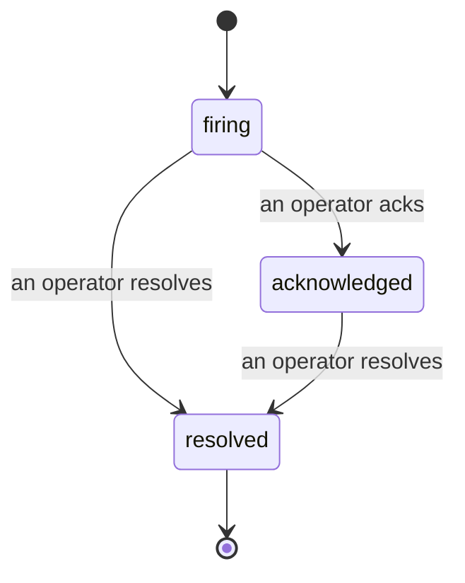

Bir uyarı tetiklendiğinde, ilk soru daima "kim bununla ilgileniyor?" Olaylar buna cevap verir: bir şey ihlal edilirse, herkes olayın açık olduğunu, kimin sahibi olduğunu ve tam olarak şimdiye kadar neler olduğunu görebilir; doğrudan bir post-mortem toplantısına sunabileceğiniz temiz, atfedilen bir kayıt ile.

*Gelen kutusu açık olayları duruma göre gruplandırır ve ciddiyet ile atanan kişiye göre filtreler, böylece şu an insani müdahale gerektiren şeyleri görürsünüz.*

## Kimin sahip olduğunu bir bakışta bilin

Artık bir sohbet iş parçacığında "biri bununla ilgileniyor mu?" sorusu yok. Bir ihlal otomatik olarak bir olay açar ve onu paylaşılan bir gelen kutusuna koyar, duruma göre gruplandırılmış. Bunu kabul edin ve adınız üzerinde olur, böylece takımın geri kalanı bunun işlendiğini bilir. Kabul etme paylaşılmıştır: birden fazla operatör aynı olayı kabul edebilir ve her biri ayrı ayrı kaydedilir, böylece tam bir savaş odası ad ile gösterilir ve birbirinin üzerine basılmaz. Triyaj için bir sahip atayın ve gelen kutuyu ciddiyet veya atanan kişiye göre filtreleyin; böylece sadece sizin olan şeyleri göreceksiniz.

## Bütün hikaye, tek bir zaman çizelgesinde

Olay bittiğinde, yazı işini zaten hazırlamışsınızdır. Herhangi bir olayı açın ve ihlal kanıtı, atanan kişiler ve abone olanlar, koordinasyon için bir yorum başlığı ve salt ekleme etkinlik zaman çizelgesi alırsınız.

*Her şey meydana geldiği sırada, her satır onu yapan kişi tarafından imzalanmış.*

Her işlem (açıldı, kabul edildi, çözüldü vb.) bu zaman çizelgesine yazılır ve hiçbir zaman silinmez. Her giriş atfedilir: bunu yapan operatöre, e-posta yoluyla, veya **automated** olarak Failproof AI Observability'nin kendi başına yaptığı işler için, örneğin olayı ihlalde açmak gibi. Hiçbir şey anonim değildir ve hiçbir şey kaybolmaz, bu nedenle post-mortem daha veya az yazı yazı yazıyor.

## Bir olay nasıl hareket eder

- **Açık (firing):** ihlal olayı açar ve kanallarınızı bir kez sayfalar. Tekrarlanan ihlallar aynı olaya katlanır ve sizi tekrar tekrar sayfalamak yerine kanıtlarını tazelenir.
- **Kabul edildi:** bir operatör bunu alır. Açık kalır ve daha sonraki ihlallar kanıtı sessizce güncelleştirir.
- **Çözüldü:** bir operatör bunu kapatır. Koşul temizlendiğinde otomatik çözme planlanmıştır ancak henüz etkin değildir, bu nedenle bir olay bir insan bunu çözene kadar açık kalır ve bu da herkesi aslında temizlenmiş olanlar hakkında dürüst tutar. Aynı uyarıda daha sonra yeni bir olay açılabilir.

Bir uyarı aynı anda en fazla bir açık olayı tutar, bu nedenle titrek bir kural sizi kopyalarla gömemez. Ayrıca elle bir olay açabilirsiniz: hiçbir uyarının yakalamadığı bir şey için bağımsız bir olay, veya mevcut bir uyarıya bağlı bir olay, `incidents:write` izniniz varsa.

## Nerede bulabilirim

Olaylar `/<org-slug>/incidents` adresinde bulunur. Görüntüleme **`incidents:read`** gerektirir; manuel bir olay açmak **`incidents:write`** gerektirir; kabul etme, atama, yorum yapma ve çözme **`incidents:ack`** gerektirir. Emekli `alerts:ack` iznini veren eski anahtarlar çalışmaya devam eder, çünkü `incidents:ack` olarak kabul edilir, bu nedenle nöbet görevli rotasyonunuz yeniden verilmesi gerekmez.

## İlgili

- [Uyarılar](/tr/agenteye/alerts): bir eşik ihlal edildiğinde bu olayları açan kurallar.
- [Hata takibi](/tr/agenteye/error-tracking): her hatayı tek bir yerde görün ve birini bir uyarıya yükseltin.
- [Denetimler](/tr/agenteye/audits): hiçbir kural izlenmeyecek olan başarısızlıkları bulan planlanan analist.