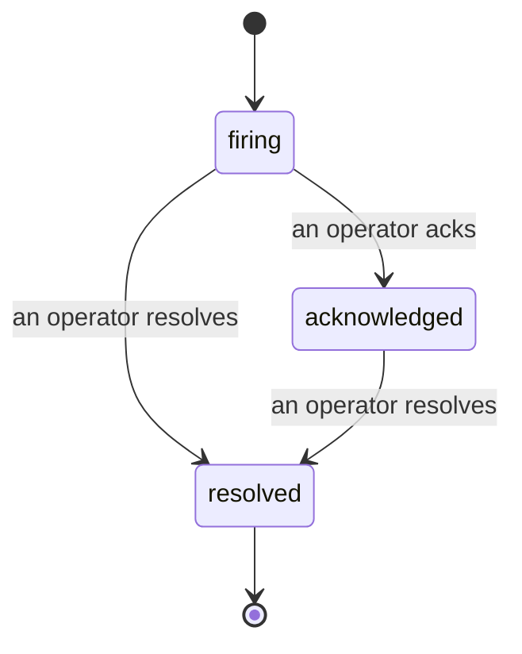

Bir uyarı tetiklendiğinde, ilk soru her zaman "kim bununla ilgileniyor?" Olaylar buna cevap verir: bir şey ihlal edildiğinde, herkes olayın açık olduğunu, kime ait olduğunu ve şimdiye kadar tam olarak neler olduğunu görebilir — temiz, atfedilmiş bir kayıt sayesinde bunu doğrudan bir olay sonrası incelemeye sunabilirsiniz.

*Gelen kutusu açık olayları duruma göre gruplandırır ve ciddiyete ve atanmış kişiye göre filtreler, böylece şu anda insan ilgisine ihtiyaç duyan şeyler görülür.*

## Kimin bununla ilgilendiğini bir bakışta bilin

Artık sohbet başlığında "birisi buna bakıyor mu?" diye sormanıza gerek yok. Bir ihlal otomatik olarak bir olay açar ve bunu paylaşılan bir gelen kutusuna düşürür, duruma göre gruplandırılır. Bunu kabul ettiğinizde adınız üzerine yazılır, böylece takımın geri kalanı bunun halledildiğini bilir. Onay paylaşılır: birden fazla operatör aynı olayı onaylayabilir ve her biri kendi başına kaydedilir, böylece tam bir savaş odası isimlerle gösterilir ve birbirinin üzerine gelir. Triyaj için tek bir sahibi atayın ve ciddiyete veya atanmış kişiye göre gelen kutusunu filtreleyin, böylece yalnızca sizinkini göresiniz.

## Tüm hikaye, tek bir zaman çizelgesinde

Olay bittiğinde, raporunuz zaten hazırdır. Herhangi bir olayı açın ve ihlal kanıtını, atanmış kişilerini ve abonelerini, koordinasyon için kullanılan bir yorum başlığını ve salt ekleme yapılabilen bir aktivite zaman çizelgesini görürsünüz.

*Neler olduğunu sırayla ve her satır bunu yapanın imzasıyla.*

Her işlem (açıldı, onaylandı, çözüldü vb.) bu zaman çizelgesine yazılır ve asla düzenlenmez. Her giriş atfedilir: bunu yapan operatöre, e-postaya göre veya Failproof AI Observability'nin kendi başına yaptığı (ihlal için olayı açmak gibi) şeyler için **otomasyona**. Hiçbir şey anonim değildir ve hiçbir şey kaybolmaz, böylece olay sonrası inceleme neredeyse kendini yazar.

## Bir olay nasıl hareket eder

- **Açık (tetikleniyor):** ihlal olayı açar ve kanallarınızı bir kez çağırır. Tekrarlanan ihlalleri aynı olayda bir araya getiri ve kanıtlarını yenile, sizi tekrar tekrar çağırmaz.
- **Onaylandı:** bir operatör bunu ele alır. Açık kalır ve sonraki ihlalleri kanıtları sessizce günceller.
- **Çözüldü:** bir operatör bunu kapatır. Koşul temizlendiğinde otomatik çözüm planlanmıştır ancak henüz etkin değildir, bu nedenle bir olay bir insan bunu çözene kadar açık kalır, bu da herkesin gerçekte neyin temizlendiği konusunda dürüst davranmasını sağlar. Aynı uyarıda daha sonra yeni bir olay açılabilir.

Bir uyarı bir seferde en fazla bir açık olayı tutar, bu nedenle titreşen bir kural sizi kopyalarla gömenemez. Ayrıca manuel olarak bir olay açabilirsiniz: hiçbir uyarının yakalamadığı bir şey için bağımsız bir olay veya `incidents:write` izniniz varsa mevcut bir uyarıya bağlı bir olay.

## Nerede bulacaksınız

Olaylar `/<org-slug>/incidents` adresinde bulunur. Görüntüleme **`incidents:read`** gerektirir; manuel olay açma **`incidents:write`** gerektirir; onaylama, atama, yorum yapma ve çözme **`incidents:ack`** gerektirir. Emekli `alerts:ack` verilen eski anahtarlar çalışmaya devam eder, çünkü `incidents:ack` olarak kabul edilir, bu nedenle nöbet rotasyonunuz yeniden verilmesi gerekmez.

## İlgili

- [Uyarılar](/tr/agenteye/alerts): bir eşik ihlal edildiğinde bu olayları açan kurallar.
- [Hata izleme](/tr/agenteye/error-tracking): bir yerde her hatayı görün ve birini bir uyarıya yükseltin.
- [Denetimler](/tr/agenteye/audits): hiçbir kuralın izlemediği hataları bulan planlı analist.