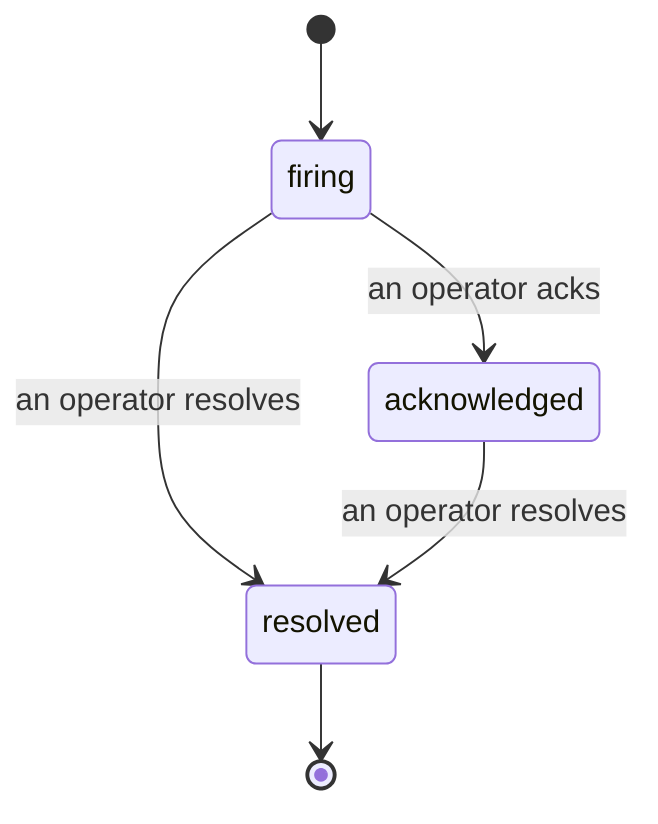

Bir uyarı tetiklendiğinde, ilk soru her zaman "kim bununla ilgileniyor?" olur. Olaylar buna cevap verir: bir ihlal meydana geldiğinde, herkes olayın açık olduğunu, kimin sahibi olduğunu ve tam olarak neler olduğunu görebilir; doğrudan bir olay sonrası toplantıya sunabileceğiniz temiz, atfedilmiş bir kayıt ile.

*Gelen kutusu açık olayları duruma göre gruplandırır ve ciddiyet ile atanmış kişiye göre filtreler, böylece şu anda insan ilgisine ihtiyacı olan şeyleri görürsünüz.*

## Kimin elinde olduğunu bir bakışta bilin

Artık bir sohbet dizisinde "bununla biri ilgileniyor mu?" diye sormanıza gerek yok. Bir ihlal otomatik olarak bir olay açar ve bunu paylaşılan bir gelen kutusuna düşürür, duruma göre gruplandırılır. Bunu kabul edin ve adınız buna yazılır, böylece ekibin geri kalanı bunun ele alındığını bilir. Kabul paylaşımlıdır: birden fazla operatör aynı olayı kabul edebilir ve her biri kendi başına kaydedilir, böylece tam bir savaş odası birbirinin üzerine basmak yerine adlarla gösterilir. Triyaj için bir sahibi atayın ve gelen kutuyu ciddiyet veya atanmış kişiye göre filtreleyin, böylece yalnızca sizinkileri görün.

## Tüm hikaye, tek bir zaman çizelgesinde

Olay bittiğinde, yazı yazısı zaten hazırdır. Herhangi bir olayı açın ve ihlal kanıtını, atanmış kişilerini ve abone olmuş kişilerini, koordinasyon için bir yorum dizisini ve yalnızca eklemelere izin veren bir faaliyet zaman çizelgesini alırsınız.

*Olan her şey, sırayla, her satır bunu yapan kişi tarafından imzalanmış.*

Her işlem (açıldı, kabul edildi, çözüldü vb.) o zaman çizelgesine yazılır ve asla silinmez. Her giriş atfedilir: bunu yapan operatöre, e-posta adresine veya **automated**'a Failproof AI Observability'nin kendi başına yaptığı her şey için, örneğin ihlalin üzerinde olayı açmak gibi. Hiçbir şey anonim değildir ve hiçbir şey kaybolmaz, bu nedenle olay sonrası toplantı yazısı aşağı yukarı kendini yazar.

## Bir olay nasıl ilerler

- **Açık (tetikleniyor):** ihlal olayı açar ve kanallarınızı bir kez çağırır. Tekrarlanan ihlaller aynı olaya katlanır ve kanıtını yeniler, sizi tekrar tekrar çağırmak yerine.
- **Kabul edildi:** bir operatör bunu alır. Açık kalır ve daha sonraki ihlaller kanıtı sessizce günceller.
- **Çözüldü:** bir operatör bunu kapatır. Koşul temizlendiğinde otomatik çözüm planlanmıştır ancak henüz etkinleştirilmemiştir, bu nedenle bir olay bir insan bunu çözünceye kadar açık kalır ve bu herkesin aslında neler temizlendiği konusunda dürüst kalmasını sağlar. Daha sonra aynı uyarıda yeni bir olay açılabilir.

Bir uyarı aynı anda en fazla bir açık olayı tutar, bu nedenle salınan bir kural sizi kopya olaylarla gömer. Ayrıca el ile bir olay açabilirsiniz: hiçbir uyarının yakalamadığı bir şey için bağımsız bir olay veya varsa mevcut bir uyarıya bağlı bir olay; `incidents:write`'a sahipsiniz.

## Nerede bulabilirim

Olaylar `/<org-slug>/incidents` adresinde bulunur. Görüntüleme **`incidents:read`** gerektirir; el ile bir olay açmak **`incidents:write`** gerektirir; kabul etmek, atamak, yorum yapmak ve çözmek **`incidents:ack`** gerektirir. Kullanımdan kaldırılan `alerts:ack` izni verilen eski anahtarlar çalışmaya devam eder, çünkü `incidents:ack` olarak onurlandırılır, bu nedenle nöbet rotasyonunuz yeniden verilmesi gerekmez.

## İlgili

- [Uyarılar](/tr/agenteye/alerts): bir eşik ihlal edildiğinde bu olayları açan kurallar.
- [Hata izleme](/tr/agenteye/error-tracking): bir yerde her başarısızlığı görün ve birini uyarıya yükseltin.
- [Denetimler](/tr/agenteye/audits): hiçbir kuralın izlemediği başarısızlıkları bulan planlı analist.