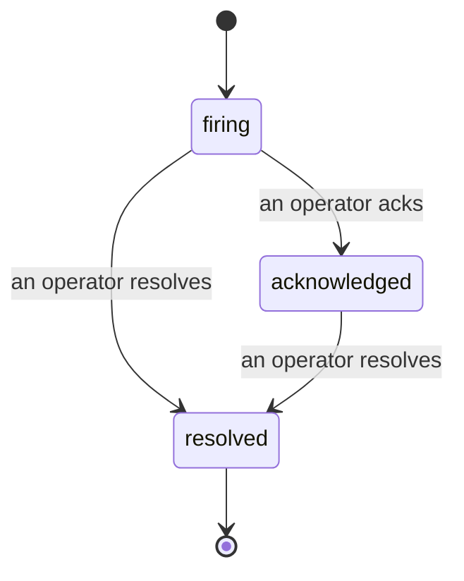

Bir uyarı tetiklendiğinde, ilk soru her zaman "kim bunun üstündedir?" sorusudur. Olaylar buna cevap verir: bir ihlal meydana geldiğinde, herkes olayın açık olduğunu, kimin sahip olduğunu ve şimdiye kadar tam olarak neler olduğunu görebilir; doğrudan post-mortem'e verebileceğiniz temiz, atfedilen bir kayıt sunar.

*Gelen kutusu açık olayları duruma göre gruplandırır ve ciddiyet ve sorumlu kişiye göre filtreler, böylece şu anda insani müdahale gerektiren durumları görürsünüz.*

## Kimin sahip olduğunu bir bakışta bilin

Artık bir sohbet dizisinde "biri buna bakıyor mu?" diye sormanız gerekmez. Bir ihlal otomatik olarak bir olay açar ve onu paylaşılan bir gelen kutusuna düşürür, duruma göre gruplandırılır. Bunu kabul ederseniz, adınız üzerine yazılır; böylece ekibin geri kalanı bunun işlendiğini bilir. Kabul paylaştırılabilir: birkaç operatör aynı olayı kabul edebilir ve her biri kendi adına kaydedilir, böylece tam bir savaş odası adlar yerine görünür. Triage için bir sahip atayın ve gelen kutuyu ciddiyet veya sorumlu kişiye göre filtreleyerek sadece sizin olan şeyleri göreceğiniz şekilde daraltın.

## Tüm hikaye, tek bir zaman çizelgesinde

Olay bittiğinde, yazı işleriniz zaten var. Herhangi bir olay açın ve ihlal kanıtını, atandı kişileri ve abone olanları, yerinde koordinasyon için bir yorum dizisini ve yalnızca ekleme yapılabilen bir etkinlik zaman çizelgesini göreceksiniz.

*Neler oldu, sırasıyla, her satır onu yapan kişi tarafından imzalanmış.*

Her işlem (açıldı, kabul edildi, çözüldü vb.) bu zaman çizelgesine yazılır ve asla düzeltilmez. Her giriş atfedilmiş: bunu yapan operatöre, e-posta adresine göre veya Failproof AI Observability'nin kendi başına yaptığı herhangi bir şey için **otomasyona** (örneğin olayı ihlalde açma gibi). Hiçbir şey anonim değildir ve hiçbir şey kaybolmaz, bu nedenle post-mortem kendini yazıp çıkarır.

## Bir olay nasıl ilerler

- **Açık (tetikleniyor):** ihlal olayı açar ve kanallarınızı bir kere sayfa gösterir. Tekrarlanan ihlaller aynı olaya katlanır ve kanıtını yeniler; sizi tekrar tekrar sayfa göstermez.
- **Kabul edildi:** bir operatör bunu alır. Açık kalır ve daha sonraki ihlaller kanıtı sessizce günceller.
- **Çözüldü:** bir operatör bunu kapatır. Koşul temizlendiğinde otomatik çözünürlük planlanmıştır ancak henüz etkinleştirilmemiş, bu nedenle bir olay bir insan onu çözmesine kadar açık kalır; bu da herkesin aslında nelerin temizlendiğini bilmesini sağlar. Aynı uyarıda daha sonra yeni bir olay açılabilir.

Bir uyarı aynı anda en fazla bir açık olayı tutar, bu nedenle titreyen bir kural sizi kopyalarla dolduramaz. Elinizde `incidents:write` varsa, elle de bir olay açabilirsiniz: hiçbir uyarının tutmadığı bir şey için bağımsız bir olay veya varolan bir uyarıya bağlı bir olay.

## Nerede bulunacağı

Olaylar `/<org-slug>/incidents` konumunda bulunur. Görüntüleme **`incidents:read`** gerektirir; manuel bir olay açma **`incidents:write`** gerektirir; kabul etme, atama, yorum yapma ve çözme **`incidents:ack`** gerektirir. Emekli `alerts:ack` izni verilen eski anahtarlar çalışmaya devam eder, çünkü `incidents:ack` olarak onurlandırılır; bu nedenle nöbet rotanızın yeniden verilmesi gerekmez.

## İlgili

- [Uyarılar](/tr/agenteye/alerts): bir eşik ihlal edildiğinde bu olayları açan kurallar.
- [Hata takibi](/tr/agenteye/error-tracking): bir yerde her hatayı görün ve birini uyarıya yükseltin.
- [Denetimler](/tr/agenteye/audits): hiçbir kuralın izlemediği hataları bulan zamanlanmış analist.