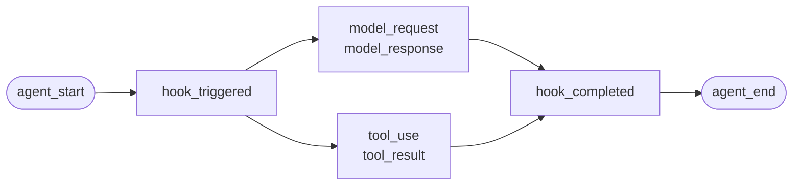
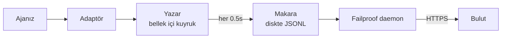

Kendiniz yazdığınız bir aracı veya Failproof AI'nin adaptörü olmayan bir çerçeve için. Enstrümante edilecek bir şey yoktur: olayları siz yayınlarsınız.

Bu, dört çerçeve adaptörünün altında çağırdığı API'dir. Bunlar onun üzerinde çeviri tablolarıdır.

## Yükleme

```bash
pip install failproofai-sdk
```

Ek paket yok, bağımlılık yok.

## Enstrümantasyon

```python
import failproofai_sdk

failproofai_sdk.configure(environment="production")

with failproofai_sdk.session():                 # bir çalışma
    with failproofai_sdk.agent("planner"):      # bir iş birimi
        with failproofai_sdk.tool_call("search", input={"q": q}) as t:
            t.output = search(q)                # bir araç çağrısı
```

Baştan sona okuyun, söylediği şey budur:

| Bunu sarın | Demek için |
| --- | --- |
| `session()` | Bu olaylar aynı çalışmaya ait |
| `agent()` | Birisi çalışıyor — listedeki tanıyacağınız bir ad verin |
| `tool_call()` | Bu bir araç ve işte ne döndürdüğü |

Ve her biri aslında neyi yayınlar:

| Kapsam | Yayınlar | Amaç |
| --- | --- | --- |
| `session()` | Hiçbir şey | Oturum kimliğini bağlar, bir çalışmayı gruplandırır |
| `agent()` | `agent_start`, `agent_end` | Bir iş birimini köşeli ayraç içine alır |
| `tool_call()` | `tool_use`, `tool_result` | Bir aracı köşeli ayraç içine alır ve ölçer |

İçindeki her şey `session_id` ve `agent_id` atlamabilir. Kapsamlar kimliği bağlam değişkenlerine bağlar ve her olay çağrısı onu geri okur, bu yüzden kimlikler hiçbir zaman işlevler aracılığıyla iletilmez.

Üçü de `async with` ve `with` altında çalışır.

Aracıları iç içe yerleştirmek ağacı oluşturur. `parent_id` ve derinlik yığından hesaplanır:

```python
with failproofai_sdk.session():
    with failproofai_sdk.agent("supervisor"):
        with failproofai_sdk.agent("researcher"):    # parent_id = "supervisor"
            ...
```

## Bir kapsam nasıl kapanır

`agent()` istisnaları sizin için işler:

| Ne oldu | Olaylar | Sonuç |
| --- | --- | --- |
| Hiçbir şey yükseltilmedi | `agent_end` | `success` |
| `Exception` | `error`, sonra `agent_end` | `failed` |
| `KeyboardInterrupt`, `SystemExit` | `error`, sonra `agent_end` | `failed` |
| `CancelledError`, `GeneratorExit` | yalnızca `agent_end` | `cancelled` |

Hata `agent_end` öncesinde yayınlanır, çünkü gösterge paneli yayını `agent_end` konumunda kapatır ve bundan sonra gelen her şey hiçbir şeye atfedilir. İptal bir hata değildir, bu nedenle iptal edilen çalışmalar hata yüzeyini kirletmez. İstisna her zaman yeniden yükseltilir: bir kapsam asla yutmaz.

## Olay yöntemleri

On beş yöntem altı ailededir. Çoğu çiftler halinde gelir — açan yayını yayınlarsınız, sonra kapatanı yayınlarsınız ve SDK aralarındaki yayını ölçer.

| Aile | Açar | Kapatır | Bağımsız |
| --- | --- | --- | --- |
| **Aracılar** | `agent_start` | `agent_end` | — |
| | `agent_pause` | `agent_resume` | — |
| **Modeller** | `model_request` | `model_response` | — |
| **Araçlar** | `tool_use` | `tool_result` | — |
| **Kancalar** | `hook_triggered` | `hook_completed` | — |
| **İnsanlar** | `human_wait` | `human_input` | `human_pause`, `human_interrupt` |
| **Hatalar** | — | — | `error` |

<Tip>
  Kapsamları tercih edin — `agent()` ve `tool_call()` — uygun oldukları yerlerde. Gövde yükseltirse bile kapanan olayı garantilerler. İçerik akışınız iç içe olmadığında doğrudan bu yöntemlere ulaşın; örneğin yardımcı içinde bir model çağrısı.
</Tip>

<CodeGroup>
```python Aracılar
failproofai_sdk.event.agent_start(agent_id="planner", goal="en ucuz uçuşu bul")
failproofai_sdk.event.agent_end(agent_id="planner", outcome="success", summary="...")
failproofai_sdk.event.agent_pause(pause_id="p1", reason="onay beklemede")
failproofai_sdk.event.agent_resume(pause_id="p1")
```

```python Modeller
failproofai_sdk.event.model_request(
    model="gpt-4o-mini",
    messages=[{"role": "user", "content": "..."}],
    request_id="req-1",
)
failproofai_sdk.event.model_response(
    model="gpt-4o-mini",
    content="...",
    input_tokens=139,
    output_tokens=21,
    request_id="req-1",
    duration_ms=5202,
)
```

```python Araçlar
failproofai_sdk.event.tool_use(tool_name="search", tool_call_id="c1", input={"q": "..."})
failproofai_sdk.event.tool_result(tool_name="search", tool_call_id="c1", output="...")
```

```python Kancalar
failproofai_sdk.event.hook_triggered(hook_name="retrieve", hook_id="h1", trigger_event="node")
failproofai_sdk.event.hook_completed(hook_name="retrieve", hook_id="h1", outcome="success")
```

```python İnsanlar
failproofai_sdk.event.human_wait(input_id="i1", prompt="Onayla?", options=["yes", "no"])
failproofai_sdk.event.human_input(input_id="i1", response="yes")
failproofai_sdk.event.human_pause(reason="operatör çalışmayı duraklatttı", user_id="dana")
failproofai_sdk.event.human_interrupt(reason="operatör çalışmayı durdurdu", at_step="step_3")
```

```python Hatalar
failproofai_sdk.event.error(
    error_type="TimeoutError",
    message="sağlayıcı 30 saniye sonra zaman aşımına uğradı",
    traceback="...",
)
```
</CodeGroup>

<Note>
  **İki insan ailesi zıt yönleri gösterir.**

  | Yöntemler | Anlamı |
  | --- | --- |
  | `human_wait` / `human_input` | **Aracı bir kişiye sordu** — onay kapısı, açıklayıcı soru |
  | `human_pause` / `human_interrupt` | **Bir kişi aracıya etkide bulundu** — durdur düğmesi, operatör duraklaması |

  Hiçbir çerçeve ikinci çifti sinyal vermez, bu yüzden her zaman siz yayınlarsınız.
</Note>

<Warning>
  **Model çağrıları eşzamanlı olarak çalıştığında `request_id` geçirin.** Olmadan, istekler ve yanıtlar ajan başına varış sırasına göre eşleşir — ve eşzamanlı çağrılar yanlış eşleşir, her yanıtı yanlış isteğe iliştirir.
</Warning>

## Örnek

OpenAI API'sine karşı araç çağırma döngüsü, ajan çerçevesi olmadan:

```python
import json

import failproofai_sdk
from openai import OpenAI

failproofai_sdk.configure(environment="production")
client = OpenAI()
MODEL = "gpt-4o-mini"


def turn(messages: list):
    """Bir model çağrısı, çift tarafından köşeli ayraç içine alınmış."""
    failproofai_sdk.event.model_request(model=MODEL, messages=messages)
    reply = client.chat.completions.create(model=MODEL, messages=messages, tools=TOOLS)
    usage = reply.usage
    failproofai_sdk.event.model_response(
        model=MODEL,
        content=reply.choices[0].message.content or "",
        input_tokens=usage.prompt_tokens,
        output_tokens=usage.completion_tokens,
    )
    return reply.choices[0].message


with failproofai_sdk.session():
    with failproofai_sdk.agent("inventory", goal="fiyat raporu"):
        for _ in range(4):          # sınırlandırılmış; sınırsız ajan döngüsü kendi hatası
            message = turn(messages)
            if not message.tool_calls:
                break
            messages.append(message.model_dump(exclude_none=True))
            for call in message.tool_calls:
                args = json.loads(call.function.arguments or "{}")
                with failproofai_sdk.tool_call(
                    call.function.name, tool_call_id=call.id, input=args
                ) as handle:
                    handle.output = run_tool(call.function.name, args)
                messages.append({
                    "role": "tool",
                    "tool_call_id": call.id,
                    "content": str(handle.output),
                })
```

Bu, bir adaptörün size vereceği altı olay türünü üretir. Tam çalıştırılabilir sürüm, araç tanımlarıyla birlikte, SDK deposunda `docs/manual/examples/` altında bulunur.

## İş parçacıkları ve async

Bağlam değişkenleri asyncio görevlerine otomatik olarak yayılır. Bir iş parçacığı boş bir bağlamla başladığı için yeni iş parçacıklarına yayılmaz.

```python
# asyncio: yapılacak bir şey yok
async with failproofai_sdk.session():
    await asyncio.gather(worker(1), worker(2))

# iş parçacıkları: çağrıyı sarın
pool.submit(failproofai_sdk.propagate(work), x)
threading.Thread(target=failproofai_sdk.propagate(work)).start()
loop.run_in_executor(None, failproofai_sdk.propagate(work), x)
```

`propagate()` olmadan, worker'ın olayları düzeltmeyi adlandıran bir `TypeError` yükseltir, bu da hiçbir oturuma gitmez. Bu kasıtlıdır: oturumu olmayan bir olay ingest tarafından atlanır ve `200` ile yanıtlanır, bu da kimlik katmanının önlemesi amaçladığı sessiz başarısızdır.

## Adaptörü olmayan bir çerçeveyi enstrümante edin

Her ajan çerçevesi aynı üç bağlantı noktası sağlar. Onları harita yapın ve tam bir izlemeniz vardır — sevk edilen dört adaptör bundan fazla bir şey yapmaz.

| Bağlantı noktası | Yazarınız | İnişi olan |
| --- | --- | --- |
| Çalışma | `session()` + `agent()` | `agent_start`, `agent_end` |
| Her araç | `tool_call()` | `tool_use`, `tool_result` |
| Her model çağrısı | `model_*` çifti | `model_request`, `model_response` |

<Steps>
  <Step title="Çalışmayı köşeli ayraç içine alın">
    ```python
    with failproofai_sdk.session():
        with failproofai_sdk.agent(agent_name, goal=task):
            result = framework.run(task)
    ```
  </Step>
  <Step title="Her aracı köşeli ayraç içine alın">
    Çerçevenin araç sarıcısı veya ara yazılım olarak adlandırdığı her şeyde.

    ```python
    with failproofai_sdk.tool_call(name, input=args) as call:
        call.output = original(**args)
    ```
  </Step>
  <Step title="Her model çağrısını eşleştirin">
    ```python
    failproofai_sdk.event.model_request(model=model, messages=messages)
    reply = provider.complete(...)
    failproofai_sdk.event.model_response(
        model=model,
        content=text,
        input_tokens=usage.prompt_tokens,
        output_tokens=usage.completion_tokens,
    )
    ```
  </Step>
</Steps>

<Tip>
  **Görmeye değer bir düğüm, adım veya ara yazılım sınırı var mı?** Bunu iç içe bir `agent()` değil, kancanın içine sarın — `hook_triggered` / `hook_completed`. `agent_id` düşük kardinalite yönüdür ve düğüm başına bir giriş onu boğar. Kancanın yayını aynı şekilde işlenir ve düğüm başına gecikme süresi sağlar.
</Tip>

<Note>
  **Manuel ve otomatik oluşturma.** El yazısı bir kapsam içinde çalışan bir adaptör bu oturuma katılır ve bu aracıya ebeveyn olur, bu nedenle iki tane yerine bir ağaç alırsınız — desteklenen bir tarafı kendiniz enstrümante ederken bir çerçeveyi yan yana kullanışlı olduğunda.
</Note>

<Accordion title="AutoGen adaptörü neden yok">
  İki neden vardır ve yukarıdaki üç bağlantı noktası her ikisine de cevaptır:

  - `autogen-core` Eylül 2025'ten beri bakımsız olmuştur.
  - AG2, diğer çerçevelerin kancanlarına eşdeğer hiçbir işlem açısından kayıt noktası açığa çıkarmaz, bu nedenle enstrümantasyonu her inşaat alanında her aracıyı sararak anlamına gelir.

  Bağlantı noktalarını elle harita yaparak, sevk edilen bir adaptörün yaptığı aynı fidelitede aynı olayları kaydeder.
</Accordion>

## Daha derine gitme

Kaydın aslında nasıl çalıştığı. Başlamak için buna ihtiyaç yoktur.

<AccordionGroup>

<Accordion title="Çerçeve başına bir kaydın neye benzediği" icon="eye">

Her kaydın aynı şekli vardır: bir yay açılır, iş içinde iç içe geçer ve her açma olayı kapatma olayı alır.



**Çift** birimdir. Her kapatma olayı SDK'nın açma olayından ölçtüğü bir süre taşır.

Aşağıda SDK ile sevk edilen örneklerden yakalanan çerçeve başına bir gerçek çalışma vardır — model adı normalleştirilmiştir. Tek bir çağrıdan ne kadar döndüğüne dikkat edin.

<Tabs>
  <Tab title="LangGraph">
    ```text 14 olay
     1  +0.000s  agent_start       LangGraph
     2  +0.001s    hook_triggered  agent
     3  +0.002s      model_request   gpt-4o-mini
     4  +3.023s      model_response  gpt-4o-mini · 21 çıkış-tok
     5  +3.024s    hook_completed  agent
     6  +3.024s    hook_triggered  tools
     7  +3.025s      tool_use      word_count
     8  +3.025s      tool_result   word_count · ok
     9  +3.025s    hook_completed  tools
    10  +3.026s    hook_triggered  agent
    11  +3.027s      model_request   gpt-4o-mini
    12  +5.717s      model_response  gpt-4o-mini · 5 çıkış-tok
    13  +5.720s    hook_completed  agent
    14  +5.721s  agent_end         LangGraph · success
    ```

    Düğümler kancanın çiftleri olur, bu nedenle onları kalabalık yapmadan düğüm başına gecikme süresi alırsınız.
  </Tab>

  <Tab title="CrewAI">
    ```text 10 olay
     1  +0.000s  agent_start       crew
     2  +0.050s    agent_start     analyst · under crew
     3  +0.057s      model_request   gpt-4o-mini
     4  +3.475s      model_response  gpt-4o-mini · 19 çıkış-tok
     5  +3.478s      tool_use      lookup_metric
     6  +3.478s      tool_result   lookup_metric · ok
     7  +3.486s      model_request   gpt-4o-mini
     8  +5.694s      model_response  gpt-4o-mini · 9 çıkış-tok
     9  +5.727s    agent_end       analyst · success
    10  +5.739s  agent_end         crew · success
    ```

    Her aracının `role` yay adı olur, bu nedenle gecikme süresi ve jeton harcaması rol başına bölünür.
  </Tab>

  <Tab title="LlamaIndex">
    ```text 26 olay
     1  +0.000s  agent_start       Agent
     2  +0.001s    hook_triggered  init_run
     4  +0.501s    hook_triggered  setup_agent
     6  +0.503s    hook_triggered  run_agent_step
     7  +0.505s      model_request   gpt-4o-mini
     8  +3.083s      model_response  gpt-4o-mini · 18 çıkış-tok
    10  +3.197s    hook_triggered  parse_agent_output
    12  +3.355s    hook_triggered  call_tool
    13  +3.355s      tool_use      city_population
    14  +3.355s      tool_result   city_population · ok
    16  +3.356s    hook_triggered  aggregate_tool_results
       ...                        ikinci iterasyon
    26  +7.038s  agent_end         Agent · success
    ```

    Ajan döngüsü kendisi görünür, yalnızca model çağrıları değil.
  </Tab>

  <Tab title="Pydantic AI">
    ```text 8 olay
    1  +0.000s  agent_start       agent
    2  +0.001s    model_request   gpt-4o-mini
    3  +4.413s    model_response  gpt-4o-mini · 17 çıkış-tok
    4  +4.415s    tool_use        population
    5  +4.415s    tool_result     population · ok
    6  +4.416s    model_request   gpt-4o-mini
    7  +8.118s    model_response  gpt-4o-mini · 6 çıkış-tok
    8  +8.119s  agent_end         agent · success
    ```

    Kancanın çifti yok: Pydantic AI'nin köşeli ayraç içine alacak düğüm veya adım sınırı yok.
  </Tab>

  <Tab title="Özel aracılar">
    ```text 6 olay
    1  +0.000s  agent_start       main
    2  +0.000s    tool_use        population
    3  +0.000s    tool_result     population · ok
    4  +0.000s    model_request   gpt-4o-mini
    5  +0.000s    model_response  gpt-4o-mini · 3 çıkış-tok
    6  +0.000s  agent_end         main · success
    ```

    Bunları kendiniz yayınlarsınız. Aynı olay türleri, aynı fidelite — çağrı alanlarına mal olur.
  </Tab>
</Tabs>

</Accordion>

<Accordion title="Oturum nasıl başlar ve biter" icon="circle-play">

**Oturum sonu olayı yoktur.** Oturum kapattığınız bir şey değil — `session_id` paylaşan bir olay grubudur.

Durum izlemenin şeklinden türetilir:

| Durum | Ne zaman |
| --- | --- |
| `ongoing` | En az bir yay hala açık |
| `paused` | Bir `agent_pause` eşleşen `agent_resume` yok |
| `error` | Hiçbir şey açık değil ve en az bir olay başarısız oldu |
| `done` | Hiçbir şey açık değil ve hiçbir şey başarısız olmadı |

Yani bir oturum her çift kapatıldığında biter. Adaptörler sizin için `agent_end` yayınlar ve kapalı kaldığında açık kalan her şeyi kapatırlar ve eksik olarak işaretlerler — çökmüş bir çalışma asılı kalmak yerine görünür bir boşlukla `done` olarak yerleşir.

<Note>
  Bu yüzden bir oturum iki çağrıya yayılabilir. Bir LangGraph `interrupt()` çalışmayı duraklatır, kök yayı kasıtlı olarak açık kalır ve devam eden çağrı onu kapatır. Her iki çağrı bir oturuma aittir.
</Note>

</Accordion>

<Accordion title="Kimlik: session_id, agent_id ve kim onları basım yapıyor" icon="fingerprint">

`session_id` ve `agent_id` her olay yönteminde isteğe bağlıdır. Atlanırsa, çevreleyen kapsamdan çözülürler:

```python
with failproofai_sdk.session():
    with failproofai_sdk.agent("planner"):
        failproofai_sdk.event.tool_use(tool_name="search", tool_call_id="c1")
```

Bunları açıkça iletmek yine de işe yarar ve önceliği alır. Hiçbir şey bağlı değil ve hiçbir şey iletilmezse, çağrı düzeltmeyi adlandıran bir `TypeError` yükseltir, ingest atlamış olacağı oturumu olmayan bir olayı yayınlamak yerine, `200` ile yanıtlar.

Kapsamlar kimliği bağlam değişkenlerine bağlar. Bunlar asyncio görevlerine otomatik olarak yayılır ancak yeni iş parçacıklarına yayılmaz — bir worker'ı `failproofai_sdk.propagate()` içine sarın.

#### Hangi kimlik kim tarafından basım yapılır

| Kimlik | Basım yapan | Notlar |
| --- | --- | --- |
| `session_id` | Siz veya SDK | `session("chat-42")` kelimesi kelimesine kullanılır; atlanırsa, SDK bir `uuid4().hex` oluşturur |
| `agent_id` | Siz veya çerçeve | `agent("analyst")`, CrewAI `role`, bir `FunctionAgent.name`'den. UUID görünüşlü bir değer reddedilir ve değiştirilir |
| `tool_call_id`, `hook_id`, `request_id` | Siz veya çerçeve | Adaptörler çerçevenin kendi çalışma kimliklerini yeniden kullanır, bu yüzden çiftler iş parçacığı atlamalarında hayatta kalır |
| **Olay kimliği** | **Bulut, ingest'te** | SDK hiçbirini yayınlamaz |
| **`dedup_key`** | **Bulut, ingest'te** | Kuruluş, oturum, zaman damgası, tür ve yüke karşı bir karma. Bu gerçek kimlik — yeniden denenen bir topluyu çoğaltmak yerine daraltır |

#### Adaptörler `session_id` nasıl çözer

İlk eşleşme kazanır:

1. Açık bir `session_id` seçeneği
2. Çağrı başına meta veri
3. Çevreleyen `session()` kapsamı
4. Çerçeve meta verileri
5. Çerçevenin kendi çalışma kimliği

Bunlardan biri vardığı sürece asla icat edilmez — sentezlenmiş bir kimlik bir çalışmayı birkaç oturuma böler.

#### `agent_id` düşük kardinaliteyi koruyun

Bu her gösterge paneli yüzeyinde birincil yönüdür ve `LowCardinality(String)` sütunu. Çalışma başına bir değer sütunu düşürür ve filtre açılır menüsünü çalışma başına bir giriş ile doldurur.

Adaptörler bu sütunu sizin için savunur:

| Çerçeve teslim eder | Kaydedilmiş olarak | Neden |
| --- | --- | --- |
| `3f9a1c2b-…` (bir UUID) | `main` | Tutmak için okunabilir bir şey yok |
| Uzun çıplak hex dizesi | `main` | Aynı |
| `agent-3f9a1c2b-…` | `agent` | Çalışma başına kimlik çıkarıldı, okunabilir bölüm tutuldu |
| `agent-v2` | `agent-v2` | Kısa segmentler yalnız bırakılır |
| `step-3` | `step-3` | Aynı |

Gerçek kimlik `fw_agent_id` / `fw_run_id` üzerinde tutulur, burada yönü olmuş bir yüzey olmadan sorgulanabilir kalır.

<Warning>
  **Bu koruma yalnızca **çerçevenin** seçtiği etiketlere dokunur.** Kendiniz ilettiğiniz bir `agent_id` — `event.*` veya `failproofai_sdk.agent(...)` için — tam olarak verilen şekilde kaydedilir. Açık bir bağımsız değişkeni sessizce yeniden yazmak, kardinalieti önledikten daha kötü olur, bu yüzden kendi yaylarınızı buna göre adlandırın.
</Warning>

</Accordion>

<Accordion title="Olay türleri, gruplandırılmış — ve hangi çerçeve neyi kaydeder" icon="table">

| Grup | Olaylar |
| --- | --- |
| Aracılar | `agent_start`, `agent_end`, `agent_pause`, `agent_resume` |
| Modeller | `model_request`, `model_response` |
| Araçlar | `tool_use`, `tool_result` |
| Kancalar | `hook_triggered`, `hook_completed` |
| İnsanlar | `human_wait`, `human_input`, `human_pause`, `human_interrupt` |
| Hatalar | `error` |

Hangi çerçeve neyi kaydeder, yukarıdaki çalışmalardan ölçülen:

| Olay | LangGraph | CrewAI | LlamaIndex | Pydantic AI | Özel |
| --- | :--: | :--: | :--: | :--: | :--: |
| Ajan başı ve sonu | Evet | Evet | Evet | Evet | Siz |
| Model isteği ve yanıtı | Evet | Evet | Evet | Evet | Siz |
| Araç kullanımı ve sonucu | Evet | Evet | Evet | Evet | Siz |
| Kancanın tetiklenmesi ve tamamlanması | Düğüm | Görev | Adım | — | Siz |
| Hata | Evet | Evet | Evet | Evet | Otomatik |
| İnsan bekleme ve girişi | Evet | Evet | Evet | — | Siz |
| Ajan duraklaması ve devam etmesi | Evet | Evet | Evet | — | Siz |

Tire, çerçevenin böyle bir kavramı olmadığı anlamına gelir. `human_pause` ve `human_interrupt`, aracıya etkide bulunan bir *kişiyi* tanımlar, hiçbir çerçeve sinyal vermez — bunları kendiniz yayınlayın.

</Accordion>

<Accordion title="Çiftler, korelasyon ve süre" icon="link">

Bir olay asla yalnız gelmez. Biri bir yayı açar, biri onu kapatır ve kapatma olayı SDK'nın açma olayından ölçtüğü bir süre taşır.

| Açar | Kapatır | Kapatma olayı taşır |
| --- | --- | --- |
| `agent_start` | `agent_end` | `outcome`, `summary` |
| `model_request` | `model_response` | jetonlar, `stop_reason`, gecikme |
| `tool_use` | `tool_result` | `output` veya `error`, süre |
| `hook_triggered` | `hook_completed` | `outcome`, süre |
| `agent_pause` | `agent_resume` | duraklamanın ne kadar sürdüğü |
| `human_wait` | `human_input` | cevap ve kişinin ne kadar sürdüğü |

<Warning>
  Kapatma olayı olmayan açma olayı hiçbir zaman bitmez bir yaydır. Oturum sonsuza dek çalışıyor olarak işlenir ve etkin süresi büyümeye devam eder. Bu, el ile enstrümante ederken izlenecek hata modudur.
</Warning>

#### Korelasyon kuralları

- Eşleşen tamamlama olayı için aynı `tool_call_id`, `hook_id`, `pause_id` veya `input_id` yeniden kullanın.
- SDK `tool_result`, `hook_completed`, `agent_resume` ve `human_input` için `duration_ms` hesaplar. Bunları iletmek `ValueError` yükseltir.
- `duration_ms` **kabul edilir** `model_response` üzerinde, çünkü yalnızca arayan gerçek sağlayıcı gecikmesini bilir. Bir tamsayı olmalı — bir kayan sayı çağrı sitesinde `ValueError` yükseltir, sunucu sütunu işaretsiz 32 bitlik bir tamsayı olarak okur ve başka bir şey için NULL depolar.
- Korelasyon anahtarları tür ve oturum kapsamındadır, böylece bir araç çağrısı ve kancanın kimliği güvenle paylaşabilir ve iki eşzamanlı oturum kimlikler yeniden kullanabilir çarpışma olmadan. Agent kapsamında değil: bir ajan altında açılan ve diğeri altında kapatılan bir çift yine de ilişkilendirilir, bu multi-ajan çerçevelerdeki sıradan durumdur.
- `request_id` `model_request` `model_response` ile eşleştirir. Olmadan, model olayları ajan başına sırada eşleşir, bu nedenle eşzamanlı çağrılar yanlış eşleşir.
- İşlemler arasında bölünmüş bir çift yine de aşağı doğru ilişkilendirilir, ancak SDK işlem içi süresini hesaplayamaz.
- Bekleyen harita en fazla 10.000 başlangıç tutar ve dolu olduğunda en eski giriş tahliye eder.

</Accordion>

<Accordion title="Pakette ne vardır ve instrument() çerçevenizi nasıl bulur" icon="box">

`failproofai-sdk` kurmak her şeyi, dört adaptör dahil olmak üzere yükler. Ekstralar adaptörü değil, **çerçeveyi** çeker.

```python
import failproofai_sdk        # standart kitaplığın dışında hiçbir şey yüklemez
failproofai_sdk.instrument()  # yalnızca gerçekten ihtiyaç duyduğunuz adaptörleri içe aktarır
```

`import failproofai_sdk` sözleşmeli olarak sıfır bağımlılıktır, yerleşik tekerleği `--no-deps` ile kuran ve hiçbir çerçevenin `sys.modules` erişmemesini kanıtlayan başka bir test tarafından uygulanır.

<Warning>
  `failproofai_sdk.crewai` niteliği yoktur. Adaptörler kasıtlı olarak en üst düzey pakette açığa çıkarılmaz: birini değmek, öznitelik erişiminin yan etkisi olarak çerçeveyi içe aktarır, sıfır bağımlılık vaadini kırarak. `instrument()` kullanın.
</Warning>

```python
failproofai_sdk.instrument()              # her çerçeve zaten içe aktarıldı
failproofai_sdk.instrument("crewai")      # tam olarak bir, adıyla
failproofai_sdk.uninstrument("crewai")    # geri koyun
```

| Ad | Ayrıca kabul eder |
| --- | --- |
| `langchain` | `langgraph`, `langchain_core` |
| `crewai` | — |
| `llama_index` | `llamaindex`, `llama-index` |
| `pydantic_ai` | `pydantic-ai`, `pydanticai` |

Otomatik algılama `sys.modules` okur, yüklü paket listesi değil, bu nedenle kurmuş ancak asla içe aktarmadığınız bir çerçeve enstrümente edilmez ve asla sizin adınıza içe aktarılmaz. Neyin bağlı olduğunu görmek için:

```python
from failproofai_sdk.integrations import active, available

available()   # ('crewai', 'langchain', 'llama_index', 'pydantic_ai')
active()      # ('langchain',)
```

<Note>
  **CrewAI olmayan bir makinede `instrument("crewai")` yükseltmez.** Bir uyarı kaydeder ve `()` döndürür, bu nedenle bir eksik çerçeve diğerlerini de enstrümante eden bir işlemi asla alır.

  Uyarı temel `ImportError` taşır ve bu ileti tam kurulum komutu adlandırır — düzeltme günlüklerde gizli değildir.

  ```text
  ImportError: failproofai_sdk: cannot instrument 'crewai' because 'crewai.events'
  is not importable. Install it with:  pip install 'failproofai_sdk[crewai]'
  ```

  Bunun yerine yükseltmesini sağlamak için `FAILPROOFAI_SDK_STRICT=1` ayarlayın. Bu bayrak **bir kez okunur ve önbelleğe alınır**, bu yüzden işleminiz başlamadan önce bunu dışa aktarın, çalışma sırasında ayarlamak yerine.
</Note>

<Warning>
  **`instrument()` çerçeve ithalinizin *sonra* gelmeli.** Otomatik algılama `sys.modules` okur, bu yüzden içeri aktarmanın üstünde açık bir çağrı hiçbir şey bulmaz, hiçbir şey yüklemez ve `()` döndürür.
</Warning>

<CodeGroup>
```python Yanlış
import failproofai_sdk
failproofai_sdk.instrument()   # sys.modules'da henüz langchain yok -> ()

import langchain               # çok geç, hiçbir şey bağlı değil
```

```python Doğru
import langchain               # çerçeveyi ilk olarak içe aktarın
import failproofai_sdk

failproofai_sdk.instrument()   # onu bulur -> ('langchain',)
```

```python Doğru, sıra-kanıtlı
import failproofai_sdk

# Adını verme, adaptörü talep üzerine yükler, bu yüzden buradan herhangi bir yerden işe yarar.
failproofai_sdk.instrument("langchain")
```
</CodeGroup>

Bunu yanlış yapın ve işlem SDK'yı içe aktarılmış, adaptör görünüşte yüklenmiş ve **tek bir olayı yayınla olmayan** ile çalışır. Bu tam olarak söyleyen bir uyarı kaydeder — çalışma hiçbir şey kaydedildiğinde loglarınızı ilk kontrol edin.

</Accordion>

<Accordion title="Olaylar Buluta nasıl ulaşır" icon="cloud-upload">



| Aşama | İş | Çalışır |
| --- | --- | --- |
| Adaptör | Çerçeve geri çağrısını 15 olay türünden birine çevirir | İşleminiz |
| Yazar | Kuyruklar, toplar, JSONL atomik olarak yazar | İşleminiz, arka plan iş parçacığı |
| Makara | Dayanıklı teslim, işleminiz çıktığında hayatta kalır | Yerel disk |
| Daemon | Makarayı izler, topluları gönderir, gönderdiklerini siler | Makineniz |
| Ingest | Satır kimliği ve dedup anahtarı atar, sorgulanabilir sütunları yükseltir | Bulut |

Makara bunu güvenli yapar: ajanız hiçbir zaman ağda bloke olmaz ve Bulut kesintisi, kayıp olaylar yerine büyüyen bir dizin anlamına gelir.

Her temizleme bir toplu dosya yazar, `.tmp` ilk, sonra `fsync`, sonra atomik yeniden adlandır:

```text
~/.failproofai/custom-agents/events/
  event-2026-08-20T10-15-00-123Z-48213-0.jsonl
```

Daemon yalnızca `.jsonl` alır, bu nedenle asla yarı yazılı dosya okuyamaz. Gövde zaman damgası, işlem kimliği ve sıra numarası taşır, bu nedenle iki işlem aynı milisaniyede temizlenirse çarpışamaz. Kuyruk 10.000 olayda sınırlıdır; bunun ötesinde en eskisini bırakır ve kaydeder.

<Warning>
  **`collector.redact` SDK olaylarınıza uygulanmaz.** Asla onları görmez.
</Warning>

Daemon **gönderir** topluları. Açmaz veya yeniden yazmaları yapmaz.

| Olaylar | Tarafından yazılan | `collector.redact` tarafından redakte mi? |
| --- | --- | --- |
| CLI oturum transkriptleri | Daemon | Evet |
| Kancanın aktivitesi | Daemon | Evet |
| **SDK'nin yayınladığı her şey** | **İşleminiz** | **Hayır** |

Redaksiyon daemon'un kendi olaylarını *yazdığı* yerde çalışır — topluların *sevk edildiği* yerde değil. Bu yüzden bir istemi veya bir API anahtarı tutan araç bağımsız değişkeni varışta tutmaya devam eder.

Bu kasıtlıdır. Bunlar kendi enstrümantasyon çağrılarınızdır ve bunları aktarım sırasında yeniden yazmak, aldığınız olayların yayınladığınız olaylar olmadığı anlamına gelir.

<Tip>
  **Yüklemeleri kaynakta kontrol edersiniz, iki yerde:**

  - Adaptörde içerik yakalamayı kapatın. **Seçenek adı farklıdır ve bir adaptörün hiçbiri yoktur** — bu tek evrensel anahtar değildir:
    - LangChain / LangGraph, Pydantic AI — `capture_content=False`
    - LlamaIndex — `capture_messages=False`
    - CrewAI — **içerik anahtarı hiç yoktur**; `session_id` okuduğu tek seçenektir, bu yüzden istekler ve tamamlamalar her zaman kaydedilir.

    `instrument()` bir adaptörün okumuyor olduğu seçenekleri bırakır, bu nedenle yanlış adı iletmek hiçbir şey yükseltmez ve hiçbir şey değiştirmez.
  - Sırrı ilk yerde `input=` tutmayın.

  `collector.redact` ikisi için bir yedek değil.
</Tip>

<Warning>
  **Boş bir makara dizini sağlıklı durumdur.** Teslimi kontrol etmek için kullanmayın.
</Warning>

Daemon her topluyu gönderdikten sonra milisaniyeler içinde siler, bu yüzden `ls` toplayıcıyı yarışır ve yayınladığınız kesirini gösterir — hiçbir şey kaydeden bir SDK'dan ayırt edilemez.

Olayların gerçekten iniş yaptığını doğrulamak için gösterge panelini kontrol edin. Makarayı dolmaya karşı izlemek için daemon'u ilk durdurun.

</Accordion>

<Accordion title="Enstrümantasyon başarısız olduğunda" icon="triangle-alert">

Her geri çağrı, tek işi yeniden yükseltmek olan bir sarıcı içinde çalışır, bu nedenle çağrınız tam olarak bir `try` içinde oturur ve SDK'nın yaptığı her şey bunun dışında olur.

| Ne oldu | Sonuç |
| --- | --- |
| Bir kancanın yükseltmesi | Traceback ile bir kez kaydedildi. Çağrınız etkilenmez |
| Aynı kancanın üç kez yükseltmesi | O bir kancanın geri kalanı için devre dışı, tek bir hata satırı |
| `FAILPROOFAI_SDK_STRICT=1` ayarlanmış | İstisna bunun yerine yeniden yükseltildi |
| Bir çerçeve sürümü test edilen aralığın dışında | Uyarılar bir kez, yine de enstrümente eder |
| Tek bir yetenek eksik | O bir kancanın devre dışı, asla tüm adaptör |

Varsayılan, üretimde doğru ve hata ayıklarken yanlıştır, çünkü yalnızca hiçbir zaman çökmediğini kanıtlayabilir. Yutkunmuş bir başarısızlığı yüksek sesle yapmak için `FAILPROOFAI_SDK_STRICT=1` ayarlayın.

</Accordion>

</AccordionGroup>

## Yaygın sorunlar

<AccordionGroup>
  <Accordion title="Bir yay hiçbir zaman bitmez">
    Açma olayı kapatma olayı olmaz: `model_response` olmayan `model_request` veya `tool_result` olmayan `tool_use`. Kapsamları kullanın, gövde yükseltirse bile çifti garanti ederler. Olay yöntemlerini doğrudan çağrırsanız, `try` ve `finally` kullanın.
  </Accordion>

  <Accordion title="duration_ms geçirmek ValueError yükseltir">
    Eşleşen açma olayından ölçüldüğü için `tool_result`, `hook_completed`, `agent_resume` ve `human_input` üzerinde reddedilir. `model_response` üzerinde kabul edilir, çünkü yalnızca siz gerçek sağlayıcı gecikmesini bilirsiniz ve bir tamsayı olmalı.
  </Accordion>

  <Accordion title="Bir worker iş parçacığından olaylar TypeError yükseltir">
    İş parçacığı asla bağlamı devralması olmadı. Çağrıyı `failproofai_sdk.propagate()` içine sarın. Bkz. [İş parçacıkları ve async](#threads-and-async).
  </Accordion>

  <Accordion title="Ekstra bir alan kayboldu veya bir şeyin üzerine yazıldı">
    Ekstra alanlar son olarak birleşir, bu nedenle `model` veya `outcome` gibi gerçek alana benzer bir ad, onu yeniden yazar ve depolanmış sütunu değiştirir. Sizinkini ad alanı yapın; adaptörler bir `fw_` ön eki kullanır.
  </Accordion>

  <Accordion title="Ajan filtresinin binlerce girişi var">
    `agent_id` düşük kardinalite yönüdür ve bir çalışma kimliğini içine koydunuz. Rol veya düğüm adı kullanın ve gerçek kimliği yayın alanına koyun.
  </Accordion>
</AccordionGroup>

## Sonraki

<Columns cols={3}>
  <Card title="Nasıl çalışır" icon="workflow" href="/tr/reference/custom-agents">
    Çiftler, kimlikler, oturum yaşam döngüsü ve teslim.
  </Card>
  <Card title="İzmeyi oku" icon="route" href="/tr/sessions/read-a-trace">
    Az önce yakaladığınız oturum aracılığıyla nedenselliği takip edin.
  </Card>
  <Card title="Çerçeve adaptörleri" icon="plug" href="/tr/start/integrations">
    LangGraph, CrewAI, LlamaIndex ve Pydantic AI.
  </Card>
</Columns>