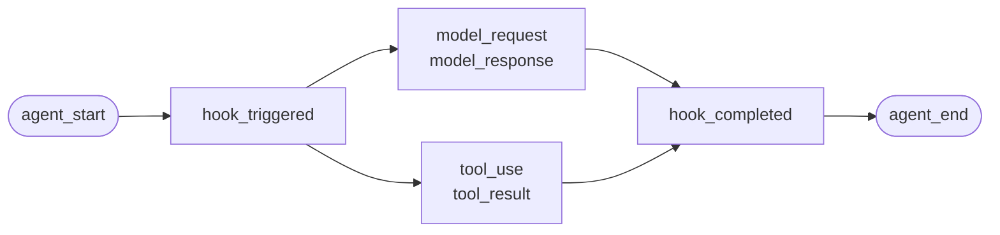
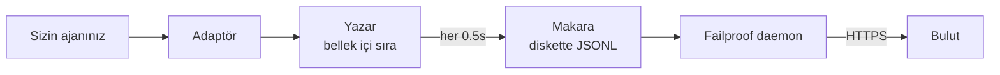

Kendi yazdığınız bir ajan için veya Failproof AI'ın uyarlaması olmayan bir çerçeve için. Yerleştirilecek hiçbir şey yoktur: siz olayları yayınlarsınız.

Bu, dört çerçeve adaptörünün altında çağırdığı API'dir. Bunlar bunun üzerindeki çeviri tablolarıdır.

## Kurulum

```bash
pip install failproofai-sdk
```

Ekstralar ve bağımlılıklar yok.

## Yerleştirme

```python
import failproofai_sdk

failproofai_sdk.configure(environment="production")

with failproofai_sdk.session():                 # bir çalışma
    with failproofai_sdk.agent("planner"):      # bir iş birimi
        with failproofai_sdk.tool_call("search", input={"q": q}) as t:
            t.output = search(q)                # bir araç çağrısı
```

Yukarıdan aşağıya okuyun ve ne demek istediğini söyler:

| İçinde sarmalayın | Söylemek için |
| --- | --- |
| `session()` | Bu olaylar aynı çalışmaya ait |
| `agent()` | Bir şey çalışma yapıyor — bir listede tanıyabileceğiniz bir ad verin |
| `tool_call()` | Bu bir araç ve işte ne döndürdüğü |

Ve her biri gerçekten ne yayınlar:

| Kapsam | Yayınlar | Amaç |
| --- | --- | --- |
| `session()` | Hiçbir şey | Bir oturumu bağlar, bir çalışmayı gruplandırır |
| `agent()` | `agent_start`, `agent_end` | Bir iş birimini parantez içine alır |
| `tool_call()` | `tool_use`, `tool_result` | Bir aracı parantez içine alır ve ölçer |

İçindeki her şey `session_id` ve `agent_id` öğesini atlayabilir. Kapsamlar kimliği bağlam değişkenlerine bağlar ve her olay çağrısı bunu geri okur, bu nedenle hiçbir zaman işlevleriniz arasında kimlikleri geçirmezsiniz.

Her üçü `async with` kadar `with` altında da çalışır.

Ajanlari yuvalamak ağacı oluşturur. `parent_id` ve derinlik yığından hesaplanır:

```python
with failproofai_sdk.session():
    with failproofai_sdk.agent("supervisor"):
        with failproofai_sdk.agent("researcher"):    # parent_id = "supervisor"
            ...
```

## Bir kapsam kapanırken

`agent()` istisnalar sizin için işler:

| Ne oldu | Olaylar | Sonuç |
| --- | --- | --- |
| Hiçbir şey yükseltilmedi | `agent_end` | `success` |
| `Exception` | `error`, sonra `agent_end` | `failed` |
| `KeyboardInterrupt`, `SystemExit` | `error`, sonra `agent_end` | `failed` |
| `CancelledError`, `GeneratorExit` | sadece `agent_end` | `cancelled` |

Hata `agent_end` öncesinde yayınlanır, çünkü pano aralığı `agent_end` adresinde kapatır ve bundan sonra her şey hiçbir şeye atfedilir. İptal bir başarısızlık değildir, bu nedenle iptal edilen çalışmalar hata yüzeyini kirletmez. İstisna her zaman yeniden yükseltilir: bir kapsam hiçbir zaman istisna kalmaz.

## Olay yöntemleri

On beş yöntem altı aileden. Çoğu çiftler halinde gelir — açıcıyı siz yayınlarsınız, sonra kapatıcıyı yayınlarsınız ve SDK arası aralığı ölçer.

| Aile | Açar | Kapatır | Bağımsız |
| --- | --- | --- | --- |
| **Ajanlar** | `agent_start` | `agent_end` | — |
| | `agent_pause` | `agent_resume` | — |
| **Modeller** | `model_request` | `model_response` | — |
| **Araçlar** | `tool_use` | `tool_result` | — |
| **Kancalar** | `hook_triggered` | `hook_completed` | — |
| **İnsanlar** | `human_wait` | `human_input` | `human_pause`, `human_interrupt` |
| **Başarısızlıklar** | — | — | `error` |

<Tip>
  Kapsamlar — `agent()` ve `tool_call()` — her yerde tercih edin. Gövde yükselttiğinde bile kapatma olayını garantilerler. İçinde iç içe geçmeyen kontrol akışına (örneğin bir yardımcı içinde bir model çağrısı) sahip olduğunuzda bu yöntemlere doğrudan ulaşın.
</Tip>

<CodeGroup>
```python Ajanlar
failproofai_sdk.event.agent_start(agent_id="planner", goal="find the cheapest flight")
failproofai_sdk.event.agent_end(agent_id="planner", outcome="success", summary="...")
failproofai_sdk.event.agent_pause(pause_id="p1", reason="awaiting approval")
failproofai_sdk.event.agent_resume(pause_id="p1")
```

```python Modeller
failproofai_sdk.event.model_request(
    model="gpt-4o-mini",
    messages=[{"role": "user", "content": "..."}],
    request_id="req-1",
)
failproofai_sdk.event.model_response(
    model="gpt-4o-mini",
    content="...",
    input_tokens=139,
    output_tokens=21,
    request_id="req-1",
    duration_ms=5202,
)
```

```python Araçlar
failproofai_sdk.event.tool_use(tool_name="search", tool_call_id="c1", input={"q": "..."})
failproofai_sdk.event.tool_result(tool_name="search", tool_call_id="c1", output="...")
```

```python Kancalar
failproofai_sdk.event.hook_triggered(hook_name="retrieve", hook_id="h1", trigger_event="node")
failproofai_sdk.event.hook_completed(hook_name="retrieve", hook_id="h1", outcome="success")
```

```python İnsanlar
failproofai_sdk.event.human_wait(input_id="i1", prompt="Approve?", options=["yes", "no"])
failproofai_sdk.event.human_input(input_id="i1", response="yes")
failproofai_sdk.event.human_pause(reason="operator paused the run", user_id="dana")
failproofai_sdk.event.human_interrupt(reason="operator stopped the run", at_step="step_3")
```

```python Başarısızlıklar
failproofai_sdk.event.error(
    error_type="TimeoutError",
    message="provider timed out after 30s",
    traceback="...",
)
```
</CodeGroup>

<Note>
  **İki insan ailesi zıt yönleri işaret eder.**

  | Yöntemler | Anlamı |
  | --- | --- |
  | `human_wait` / `human_input` | **Ajan bir kişiye sordu** — bir onay kapısı, açıklayıcı bir soru |
  | `human_pause` / `human_interrupt` | **Bir kişi ajana hareket etti** — durdur düğmesi, operatör duraklatması |

  Hiçbir çerçeve ikinci çifti sinyal vermez, bu nedenle her zaman sizin yayınlamanız gereken şeydir.
</Note>

<Warning>
  **Model çağrıları eşzamanlı olarak çalıştığında `request_id` geçirin.** Olmadan, istekler ve yanıtlar ajan başına varış sırasıyla eşleşir — ve eşzamanlı çağrılar yanlış eşleşir ve her yanıtı yanlış isteğe ekler.
</Warning>

## Örnek

OpenAI API'sine karşı bir araç çağırma döngüsü, ajan çerçevesi olmadan:

```python
import json

import failproofai_sdk
from openai import OpenAI

failproofai_sdk.configure(environment="production")
client = OpenAI()
MODEL = "gpt-4o-mini"


def turn(messages: list):
    """Bir model çağrısı, çift tarafından parantez içine alındı."""
    failproofai_sdk.event.model_request(model=MODEL, messages=messages)
    reply = client.chat.completions.create(model=MODEL, messages=messages, tools=TOOLS)
    usage = reply.usage
    failproofai_sdk.event.model_response(
        model=MODEL,
        content=reply.choices[0].message.content or "",
        input_tokens=usage.prompt_tokens,
        output_tokens=usage.completion_tokens,
    )
    return reply.choices[0].message


with failproofai_sdk.session():
    with failproofai_sdk.agent("inventory", goal="price report"):
        for _ in range(4):          # sınırlı; sınırsız bir ajan döngüsü kendi bir hatadır
            message = turn(messages)
            if not message.tool_calls:
                break
            messages.append(message.model_dump(exclude_none=True))
            for call in message.tool_calls:
                args = json.loads(call.function.arguments or "{}")
                with failproofai_sdk.tool_call(
                    call.function.name, tool_call_id=call.id, input=args
                ) as handle:
                    handle.output = run_tool(call.function.name, args)
                messages.append({
                    "role": "tool",
                    "tool_call_id": call.id,
                    "content": str(handle.output),
                })
```

Bu, bir adaptörün sağlayacağı aynı altı olay türünü üretir. Tam çalıştırılabilir sürüm, araç tanımlarıyla birlikte, SDK deposunda `docs/manual/examples/` altında gemi.

## İş parçacıkları ve async

Bağlam değişkenleri asyncio görevlerine otomatik olarak yayılır. Bir iş parçacığı boş bir bağlamla başladığı için yeni iş parçacıklarına yayılmazlar.

```python
# asyncio: yapılacak hiçbir şey yok
async with failproofai_sdk.session():
    await asyncio.gather(worker(1), worker(2))

# iş parçacıkları: çağrılanı sarmalayın
pool.submit(failproofai_sdk.propagate(work), x)
threading.Thread(target=failproofai_sdk.propagate(work)).start()
loop.run_in_executor(None, failproofai_sdk.propagate(work), x)
```

`propagate()` olmadan, çalışanın olayları düzeltmeyi adlandıran bir `TypeError` yükseltir, bunun yerine hiçbir oturuma iniş. Bu kasıtlıdır: hiçbir oturuma sahip olmayan bir olay alımında atlanır ve `200` ile yanıtlanır, bu da kimlik katmanının var olması için sessiz başarısızlıktır.

## Adaptörü olmayan bir çerçeveye alet takın

Her ajan çerçevesi aynı üç dikiş verir. Onları eşleştirin ve tam bir izin aldınız — dört gemi adaptörü bundan daha fazlasını yapmazlar.

| Dikiş | Yazarız | Arazileri |
| --- | --- | --- |
| Çalışma | `session()` + `agent()` | `agent_start`, `agent_end` |
| Her araç | `tool_call()` | `tool_use`, `tool_result` |
| Her model çağrısı | `model_*` çifti | `model_request`, `model_response` |

<Steps>
  <Step title="Çalışmayı parantez içine alın">
    ```python
    with failproofai_sdk.session():
        with failproofai_sdk.agent(agent_name, goal=task):
            result = framework.run(task)
    ```
  </Step>
  <Step title="Her aracı parantez içine alın">
    Çerçevenin bir araç sarmalayıcısı veya ara yazılım dediği ne olursa olsun.

    ```python
    with failproofai_sdk.tool_call(name, input=args) as call:
        call.output = original(**args)
    ```
  </Step>
  <Step title="Her model çağrısını eşleştirin">
    ```python
    failproofai_sdk.event.model_request(model=model, messages=messages)
    reply = provider.complete(...)
    failproofai_sdk.event.model_response(
        model=model,
        content=text,
        input_tokens=usage.prompt_tokens,
        output_tokens=usage.completion_tokens,
    )
    ```
  </Step>
</Steps>

<Tip>
  **Görmek değer bir düğüm, adım veya ara yazılım sınırı var mı?** Bir kanca çifti içinde sarmalayın — `hook_triggered` / `hook_completed` — iç içe geçmiş `agent()` değil. `agent_id`, düşük kardinalite bir nitelik ve düğüm başına bir giriş onu boğar. Kanca aralıkları aynı şekilde renderlenir ve size düğüm başına gecikme süresi verir.
</Tip>

<Note>
  **Manuel ve otomatik oluştur.** Bir uyarlanmış içinde çalışan bir çerçeve, bu oturuma katılır ve bu ajana üst olur, bu nedenle iki ağaç yerine bir ağaç alırsınız — bir desteklenen çerçeve ile birlikte kendi kendine bir çerçeve alet takmanız yararlı.
</Note>

<Accordion title="Neden AutoGen adaptörü yoktur">
  İki neden ve yukarıdaki üç dikiş her ikisinin cevabıdır:

  - `autogen-core` Eylül 2025'ten beri bakımsızdır.
  - AG2, diğer çerçevelerin kancaları eşdeğer işlem çapında bir kayıt noktası ortaya çıkarmaz, bu nedenle bunu araç takınmak her inşaat sitesinde her ajanı sarmalamak anlamına gelir.

  Dikiş eşleştirmesini el ile yapmak, bir gemi adaptörü olarak aynı olayları aynı doğrulukta kaydeder.
</Accordion>

## Daha derine inmek

Kayıt gerçekten nasıl çalışır. Başlamak için bunların hiçbiri gerekli değildir.

<AccordionGroup>

<Accordion title="Bir kayıt çerçeve başına neye benzer" icon="eye">

Her kaydın aynı şekli vardır: bir aralık açılır, çalışma içinde yuvalanır ve her açılış olayı kapatma olayı alır.



**Çift** birim. Her kapatma olayı, SDK'nın açılış olayından ölçtüğü bir süreyi taşır.

Aşağıda SDK ile birlikte gelen örneklerden yakalanan çerçeve başına bir gerçek çalışma — model adı normalleştirildi. Tek bir çağrıdan ne kadar geri döndüğüne dikkat edin.

<Tabs>
  <Tab title="LangGraph">
    ```text 14 olaylar
     1  +0.000s  agent_start       LangGraph
     2  +0.001s    hook_triggered  agent
     3  +0.002s      model_request   gpt-4o-mini
     4  +3.023s      model_response  gpt-4o-mini · 21 out-tok
     5  +3.024s    hook_completed  agent
     6  +3.024s    hook_triggered  tools
     7  +3.025s      tool_use      word_count
     8  +3.025s      tool_result   word_count · ok
     9  +3.025s    hook_completed  tools
    10  +3.026s    hook_triggered  agent
    11  +3.027s      model_request   gpt-4o-mini
    12  +5.717s      model_response  gpt-4o-mini · 5 out-tok
    13  +5.720s    hook_completed  agent
    14  +5.721s  agent_end         LangGraph · success
    ```

    Düğümler kanca çiftleri haline gelir, böylece ajan listesini doldurmadan düğüm başına gecikme süresi alırsınız.
  </Tab>

  <Tab title="CrewAI">
    ```text 10 olaylar
     1  +0.000s  agent_start       crew
     2  +0.050s    agent_start     analyst · under crew
     3  +0.057s      model_request   gpt-4o-mini
     4  +3.475s      model_response  gpt-4o-mini · 19 out-tok
     5  +3.478s      tool_use      lookup_metric
     6  +3.478s      tool_result   lookup_metric · ok
     7  +3.486s      model_request   gpt-4o-mini
     8  +5.694s      model_response  gpt-4o-mini · 9 out-tok
     9  +5.727s    agent_end       analyst · success
    10  +5.739s  agent_end         crew · success
    ```

    Her ajanın `role` aralık adı haline gelir, böylece gecikme ve jeton harcaması rol başına bölünür.
  </Tab>

  <Tab title="LlamaIndex">
    ```text 26 olaylar
     1  +0.000s  agent_start       Agent
     2  +0.001s    hook_triggered  init_run
     4  +0.501s    hook_triggered  setup_agent
     6  +0.503s    hook_triggered  run_agent_step
     7  +0.505s      model_request   gpt-4o-mini
     8  +3.083s      model_response  gpt-4o-mini · 18 out-tok
    10  +3.197s    hook_triggered  parse_agent_output
    12  +3.355s    hook_triggered  call_tool
    13  +3.355s      tool_use      city_population
    14  +3.355s      tool_result   city_population · ok
    16  +3.356s    hook_triggered  aggregate_tool_results
       ...                        ikinci yineleme
    26  +7.038s  agent_end         Agent · success
    ```

    Ajan döngüsünün kendisi görülebilir, sadece model çağrıları değil.
  </Tab>

  <Tab title="Pydantic AI">
    ```text 8 olaylar
    1  +0.000s  agent_start       agent
    2  +0.001s    model_request   gpt-4o-mini
    3  +4.413s    model_response  gpt-4o-mini · 17 out-tok
    4  +4.415s    tool_use        population
    5  +4.415s    tool_result     population · ok
    6  +4.416s    model_request   gpt-4o-mini
    7  +8.118s    model_response  gpt-4o-mini · 6 out-tok
    8  +8.119s  agent_end         agent · success
    ```

    Kanca çifti yok: Pydantic AI'nin parantez içine alacak bir düğüm veya adım sınırı yoktur.
  </Tab>

  <Tab title="Özel ajanlar">
    ```text 6 olaylar
    1  +0.000s  agent_start       main
    2  +0.000s    tool_use        population
    3  +0.000s    tool_result     population · ok
    4  +0.000s    model_request   gpt-4o-mini
    5  +0.000s    model_response  gpt-4o-mini · 3 out-tok
    6  +0.000s  agent_end         main · success
    ```

    Bunları kendiniz yayınlıyorsunuz. Aynı olay türleri, aynı doğruluk — çağrı sitelerine mal olur.
  </Tab>
</Tabs>

</Accordion>

<Accordion title="Bir oturum nasıl başlar ve biter" icon="circle-play">

**Oturum sonu olayı yoktur.** Bir oturum kapatıp kapatmadığınız bir şey değildir — aynı `session_id` paylaşan bir olay grubudur.

Durum izin şeklinden türetilir:

| Durum | Ne zaman |
| --- | --- |
| `ongoing` | En az bir aralık hala açık |
| `paused` | `agent_pause` eşleşen `agent_resume` yok |
| `error` | Hiçbir şey açık değil ve en az bir olay başarısız oldu |
| `done` | Hiçbir şey açık değil ve hiçbir şey başarısız olmadı |

Bu nedenle bir oturum her çift kapandığında biter. Adaptörler sizin için `agent_end` yayınlar ve bozulma sırasında hala açık olan her şeyi kapatır ve eksik olarak işaretler — kilitlenmiş bir çalışma, asılı kalmak yerine görünen boşluk olarak `done` çözümlenir.

<Note>
  Bu nedenle bir oturum iki çağrıya yayılabilir. Bir LangGraph `interrupt()` çalışmayı duraklatır, kök aralığı kasıtlı olarak açık kalır ve devam çağrısı bunu kapatır. Her iki çağrı da bir oturumdu.
</Note>

</Accordion>

<Accordion title="Kimlik: session_id, agent_id ve kim bunları başlatır" icon="fingerprint">

`session_id` ve `agent_id` her olay yönteminde isteğe bağlıdır. Atlanıldığında, çevreleyen kapsamdan çözülebilirler:

```python
with failproofai_sdk.session():
    with failproofai_sdk.agent("planner"):
        failproofai_sdk.event.tool_use(tool_name="search", tool_call_id="c1")
```

Bunları açıkça geçirmek yine de çalışır ve öncelik alır. Hiçbir şey bağlı olmayıp hiçbir şey geçmediyse, çağrı düzeltmeyi adlandıran bir `TypeError` yükseltir, yoksa alım tarafından atlanacak hiçbir oturuma sahip bir olay yayınlar ve `200` ile yanıtlar.

Kapsamlar kimliği bağlam değişkenlerine bağlar. Bunlar asyncio görevlerine otomatik olarak yayılır, ancak yeni iş parçacıklarına değil — bir işçiyi `failproofai_sdk.propagate()` içinde sarmalayın.

#### Hangi kimlik kim başlatır

| Kimlik | Tarafından başlatıldı | Notlar |
| --- | --- | --- |
| `session_id` | Siz veya SDK | `session("chat-42")` tam olarak kullanılır; atlanıldığında, SDK bir `uuid4().hex` üretir |
| `agent_id` | Siz veya çerçeve | `agent("analyst")` danışmanından, CrewAI `role`, bir `FunctionAgent.name`. UUID benzeri bir değer reddedilir ve değiştirilir |
| `tool_call_id`, `hook_id`, `request_id` | Siz veya çerçeve | Adaptörler çerçevenin kendi çalışma kimliklerini yeniden kullanır, bu da çiftlerin iş parçacığı atlaması nedeniyle hayatta kaldığı nedenidir |
| **Olay kimliği** | **Bulut, alımda** | SDK hiçbirini yayınlamaz |
| **`dedup_key`** | **Bulut, alımda** | Org, oturum, zaman damgası, tür ve yükün karması. Bu gerçek kimlik — bir yeniden denenen toplu işin kopyalanmak yerine çökmesini sağlar |

#### Adaptörler `session_id` nasıl çözerler

İlk eşleşme kazanır:

1. Açık `session_id` seçeneği
2. Çağrı başına meta veriler
3. `session()` kapsamını çevreleyen
4. Çerçeve meta verileri
5. Çerçevenin kendi çalışma kimliği

Bunlardan biri var iken asla icat edilmez — sentezlenmiş bir kimlik bir çalışmayı birkaç oturum arasında bölmek olur.

#### `agent_id` düşük kardinaliteyi tutun

Her pano yüzeyinde birincil yüz ve bir `LowCardinality(String)` sütunudur. Çalışma başına bir değer sütunu bozar ve filtre açılır penceresini çalışma başına bir giriş ile doldurur.

Adaptörler bu sütunu sizin için savunur:

| Çerçeve teslim eder | Olarak kaydedildi | Neden |
| --- | --- | --- |
| `3f9a1c2b-…` (UUID) | `main` | Tutacak hiçbir şey okunaklı |
| Uzun çıplak onaltılık dize | `main` | Aynı |
| `agent-3f9a1c2b-…` | `agent` | Çalışma başına kimlik çıkarıldı, okunaklı kısım tutuldu |
| `agent-v2` | `agent-v2` | Kısa segmentler yalnız bırakılır |
| `step-3` | `step-3` | Aynı |

Gerçek kimlik, nitelik olmadan sorgulanabilir kaldığı `fw_agent_id` / `fw_run_id` üzerinde tutulur.

<Warning>
  **Bu koruma yalnızca *çerçevenin* seçtiği etiketlere dokunur.** Kendi geçtiğiniz bir `agent_id` — `event.*` veya `failproofai_sdk.agent(...)` — tam olarak verilen gibi kaydedilir. Açık bir argümanı sessizce yeniden yazmak önlediği kardinaliteden daha kötü olur, bu nedenle kendi aralıklarınızı buna göre adlandırın.
</Warning>

</Accordion>

<Accordion title="Olay türleri, gruplandırılmış — ve hangi çerçeve ne kaydeder" icon="table">

| Grup | Olaylar |
| --- | --- |
| Ajanlar | `agent_start`, `agent_end`, `agent_pause`, `agent_resume` |
| Modeller | `model_request`, `model_response` |
| Araçlar | `tool_use`, `tool_result` |
| Kancalar | `hook_triggered`, `hook_completed` |
| İnsanlar | `human_wait`, `human_input`, `human_pause`, `human_interrupt` |
| Başarısızlıklar | `error` |

Hangi çerçeve ne kaydeder, yukarıdaki çalışmalardan ölçülmüştür:

| Olay | LangGraph | CrewAI | LlamaIndex | Pydantic AI | Özel |
| --- | :--: | :--: | :--: | :--: | :--: |
| Ajan başlangıcı ve sonu | Evet | Evet | Evet | Evet | Siz |
| Model isteği ve yanıtı | Evet | Evet | Evet | Evet | Siz |
| Araç kullanımı ve sonucu | Evet | Evet | Evet | Evet | Siz |
| Kanca tetiklendi ve tamamlandı | Düğüm | Görev | Adım | — | Siz |
| Hata | Evet | Evet | Evet | Evet | Otomatik |
| İnsan bekle ve giriş | Evet | Evet | Evet | — | Siz |
| Ajan duraklat ve devam et | Evet | Evet | Evet | — | Siz |

Bir tire çerçevenin böyle bir kavramı olmadığı anlamına gelir. `human_pause` ve `human_interrupt` ajana etki eden bir *kişi* anlatılar — hiçbir çerçeve sinyal vermez — bunları kendiniz yayınlayın.

</Accordion>

<Accordion title="Çiftler, korelasyon ve süre" icon="link">

Bir olay asla tek başına gelmez. Biri aralığı açar, biri kapatır ve kapatma olayı SDK'nın açılış olayından ölçtüğü bir süreyi taşır.

| Açar | Kapatır | Kapatma olayı taşır |
| --- | --- | --- |
| `agent_start` | `agent_end` | `outcome`, `summary` |
| `model_request` | `model_response` | jetonlar, `stop_reason`, gecikme |
| `tool_use` | `tool_result` | `output` veya `error`, süre |
| `hook_triggered` | `hook_completed` | `outcome`, süre |
| `agent_pause` | `agent_resume` | duraklatmanın ne kadar sürdüğü |
| `human_wait` | `human_input` | cevap ve kişi kaç süre aldı |

<Warning>
  Kapatma olayı olmayan bir açılış olayı hiçbir zaman bitmeyen bir araçlıktır. Oturum sonsuza dek hala çalışıyor olarak renderlenir ve etkin süresi artmaya devam eder. Bu, elinizle alet takınırken izlenecek başarısızlık modudur.
</Warning>

#### Korelasyon kuralları

- Eşleşen tamamlama olayı için aynı `tool_call_id`, `hook_id`, `pause_id` veya `input_id` yeniden kullanın.
- SDK, `tool_result`, `hook_completed`, `agent_resume` ve `human_input` için `duration_ms` hesaplar. Bunu bu yöntemlere geçirmek `ValueError` yükseltir.
- `duration_ms` **kabul edilir** `model_response` adresinde, çünkü yalnızca arayana gerçek sağlayıcı gecikmesi bilinir. Tamsayı olmalı — bir kayan nokta çağrı sitesinde `ValueError` yükseltir, çünkü sunucu sütunu imzasız 32 bitlik bir tamsayı olarak okur ve diğer her şey için NULL depolar.
- Korelasyon anahtarları tür ve oturum tarafından kapsamlandırılır, bu nedenle bir araç çağrısı ve kanca güvenli bir şekilde bir kimliği paylaşabilir ve iki eşzamanlı oturum aynı kimlikleri çarpışmadan yeniden kullanabilir. Ajan tarafından kapsamlandırılmaz: bir ajan altında açılıp başka bir ajan altında kapatılan bir çift hala korelat olur, bu da çok ajanı çerçevelerde sıradan bir durumdur.
- `request_id` `model_request` ile `model_response` eşleştiriler. Olmadan, model olayları ajan başına sipariş olarak eşleşir, bu nedenle eşzamanlı çağrılar yanlış eşleşir.
- İşlemler arasında bölünmüş bir çift hala aşağı akışta korelat, ancak SDK işlem içi süresini hesaplayamaz.
- Beklemede harita en fazla 10.000 başlama tutar ve dolu olduğunda en eski girişi tahliye eder.

</Accordion>

<Accordion title="Paket içinde ne var ve instrument() çerçevenizi nasıl bulur" icon="box">

`failproofai-sdk` kurulması her şeyi kurar, dört adaptör dahildir. Ekstralar **çerçeveyi** kurar, adaptörü değil.

```python
import failproofai_sdk        # standart kitaplığın dışında hiçbir şey yüklemez
failproofai_sdk.instrument()  # gerçekten ihtiyacınız olan adaptörleri yalnızca alır
```

`import failproofai_sdk` sözleşmeli olarak sıfır bağımlılık, inşa edilen tekerleği `--no-deps` ile kuran bir test ve hiçbir çerçevenin `sys.modules` ulaşmadığını kanıtlayan başka bir test tarafından zorunlu.

<Warning>
  `failproofai_sdk.crewai` özniteliği yoktur. Adaptörler kasıtlı olarak üst düzey pakette ortaya çıkmaz: bir adaptörü dokunmak çerçeveyi bir öznitelik erişiminin yan etkisi olarak içe aktarır, sıfır bağımlılık sözünü kırar. `instrument()` kullanın.
</Warning>

```python
failproofai_sdk.instrument()              # her çerçeve zaten alındı
failproofai_sdk.instrument("crewai")      # tam olarak biri, ada göre
failproofai_sdk.uninstrument("crewai")    # geri koy
```

| Ad | Ayrıca kabul eder |
| --- | --- |
| `langchain` | `langgraph`, `langchain_core` |
| `crewai` | — |
| `llama_index` | `llamaindex`, `llama-index` |
| `pydantic_ai` | `pydantic-ai`, `pydanticai` |

Otomatik algılama `sys.modules` okur, yüklü paket listesi değil, bu nedenle yüklediğiniz ancak asla içe aktarmadığınız bir çerçeve alet takılmaz ve hiçbir zaman sizin adınıza alınmaz. Neler bağlıdır görmek için:

```python
from failproofai_sdk.integrations import active, available

available()   # ('crewai', 'langchain', 'llama_index', 'pydantic_ai')
active()      # ('langchain',)
```

<Note>
  **CrewAI olmayan bir makinede `instrument("crewai")` yükseltmez.** Bir uyarı günlüğe kaydeder ve `()` döndürür, bu nedenle eksik bir çerçeve diğerlerini de alet takmayan bir işlemi asla çökertmez.

  Uyarı temel `ImportError` taşır ve bu ileti kesin kurulum komutunu adlandırır — bu nedenle onarım günlüklerinizde, gizli değildir.

  ```text
  ImportError: failproofai_sdk: cannot instrument 'crewai' because 'crewai.events'
  is not importable. Install it with:  pip install 'failproofai_sdk[crewai]'
  ```

  Bunun yerine yükseltmesini sağlamak için `FAILPROOFAI_SDK_STRICT=1` ayarlayın. Bu bayrak **bir kez okunur ve önbelleğe alınır**, bu nedenle mid-run ayarlamak yerine işleminiz başlamadan önce ihraç edin.
</Note>

<Warning>
  **`instrument()` çerçeve alımınızdan *sonra* gelmelidir.** Otomatik algılama `sys.modules` okur, bu nedenle alımın üstünde bir çıplak çağrı hiçbir şey bulamaz, hiçbir şey kurmaz ve `()` döndürür.
</Warning>

<CodeGroup>
```python Yanlış
import failproofai_sdk
failproofai_sdk.instrument()   # sys.modules'te henüz langchain yok -> ()

import langchain               # çok geç, hiçbir şey bağlı değil
```

```python Doğru
import langchain               # ilk çerçeveyi içe aktarın
import failproofai_sdk

failproofai_sdk.instrument()   # onu bulur -> ('langchain',)
```

```python Doğru, düzen kanıtı
import failproofai_sdk

# Bunu adlandırmak adaptörü isteğe bağlı olarak alır, bu nedenle buradan her yerde çalışır.
failproofai_sdk.instrument("langchain")
```
</CodeGroup>

Bunu yanlış aldıktan sonra işlem SDK alındı, adaptör görünen kurulu ve **hiçbir olay yayınlanmamış** dengan çalışır. Bu yayınlanan bir uyarı tam olarak söyler — bu nedenle bir çalışma hiçbir şey kaydettiğinde günlüklerinizi ilk kontrol edin.

</Accordion>

<Accordion title="Olaylar Bulut'a nasıl ulaşır" icon="cloud-upload">



| Aşama | İş | Çalışması |
| --- | --- | --- |
| Adaptör | Çerçeve geri aramasını 15 olay türünden birine çevirir | Sizin işleminiz |
| Yazar | Kuyruklar, toplu işler, JSONL atomik olarak yazar | Sizin işleminiz, arka plan iş parçacığı |
| Makara | Dayanıklı teslim, işleminizin çıkışını devam ettirir | Yerel disk |
| Daemon | Makarayı izler, toplu işler gemi, ne gemi yaptığını siler | Sizin makineniz |
| Alım | Satır kimliği ve dedup anahtarı atar, sorgulanabilir sütunları yükseltir | Bulut |

Makara ne yapar güvenli bu: ajanınız hiçbir zaman ağda engellenmez ve Bulut kesintisi kayıp olaylar yerine büyüyen bir dizin anlamına gelir.

Her temizleme bir toplu işlem dosyası yazar, ilk `.tmp`, sonra `fsync`, sonra atomik adı değiştir:

```text
~/.failproofai/custom-agents/events/
  event-2026-08-20T10-15-00-123Z-48213-0.jsonl
```

Daemon yalnızca `.jsonl` alır, bu nedenle hiçbir zaman yarı yazılı bir dosya okunamaz. Gövde bir zaman damgası, işlem kimliği ve sıra numarası taşır, bu nedenle iki işlem aynı milisaniye içinde temizleme yapabilen çarpışamaz. Sıra 10.000 olaya sınırlı; geçtikten sonra en eski bırakır ve günlüğe kaydeder.

<Warning>
  **`collector.redact` SDK olayları için de `minimal` varsayılan olarak belirtilir.** SDK diske bir toplu işlem yazmadan önce kaşıntı çıkarır ve daemon yeniden deneme sırasında aynı belirleneci geçişi yapar, böylece eski SDK'lardan toplu işlemler korunur.
</Warning>

Daemon her toplu işlem okur ve bellekte yükleme öncesi redaction uygular. Okuduğu makara dosyasını yeniden yazmaz.

| Olaylar | Tarafından yazıldı | Minimal redaction nerede çalışır |
| --- | --- | --- |
| CLI oturum transkriptleri | Daemon | Daemon toplu işlem yazmadan önce |
| Kanca etkinliği | Daemon | Daemon toplu işlem yazmadan önce |
| **SDK yayınlayan her şey** | **Sizin işleminiz** | **SDK toplu işlem yazmadan önce ve daemon yükleme öncesi** |

`collector.redact` yalnızca verbatim yükleri açık bir gereklilik olduğunda `off` ayarlayın; SDK ve daemon her ikisi de bu ayarı onurlandırır. Minimal redaction yaygın API anahtarlarını, taşıyıcı jetonlarını, JWT'leri ve gizli atamalarını yakalar. Keyfi hassas nesri tanımlayamaz.

<Tip>
  **Kaynakta, iki yerde yükleri kontrol edersiniz:**

  - Adaptör üzerinde içerik yakalamayı kapatın. **Seçenek adı farklıdır ve bir adaptör hiç yoktur** — bu tek bir evrensel anahtar değildir:
    - LangChain / LangGraph, Pydantic AI — `capture_content=False`
    - LlamaIndex — `capture_messages=False`
    - CrewAI — **hiç içerik anahtarı yok**; `session_id` okuduğu tek seçenektir, bu nedenle istemler ve tamamlamalar her zaman kaydedilir.

    `instrument()` bir adaptörün okumadığı seçenekleri düşürür, bu nedenle yanlış adı geçirmek hiçbir şeyi yükseltmez ve değiştiremez.
  - Gizli anahtarı ilk yerde `input=` adresine geçirmeyin.

  `collector.redact` derinlemesine savunma, ikisinin yerine değildir.
</Tip>

<Warning>
  **Boş bir makara dizini sağlıklı durumdur.** Teslimatı kontrol etmek için kullanmayın.
</Warning>

Daemon her toplu işlem yükleme sayılı milisaniye içinde siler, bu nedenle bir `ls` dedektif ve yayınladığınız kesrini gösterir — hiç bir SDK kayıtlı olmamış bir dedektiften ayırt edilemez.

Olayların gerçekten indiğini doğrulamak için panoyu kontrol edin. Makara doldurmak için izlemek için ilk daemon'u durdurun.

</Accordion>

<Accordion title="Araç takılması başarısız olduğunda" icon="triangle-alert">

Her geri arama, tek işi yeniden yükseltmek olan bir sarmalayıcı içinde çalışır, bu nedenle çağrınız tam olarak bir `try` ve SDK'nın yaptığı her şey dışında oturur.

| Ne oldu | Sonuç |
| --- | --- |
| Bir kanca yükseltilir | Traceback ile bir kez günlüğe kaydedildi. Çağrınız etkilenmez |
| Aynı kanca üç kez yükseltilir | O kanca, işlem geri kalanı için devre dışı bırakılır, bir hata satırı ile |
| `FAILPROOFAI_SDK_STRICT=1` ayarlandı | İstisna bunun yerine yeniden yükseltilir |
| Bir çerçeve sürümü sınanan aralığın dışında | Bir kez uyarır, yine de araç takın |
| Tek bir yetenek eksiktir | O kanca devre dışı bırakılır, asla adaptörün tamamı değil |

Varsayılan üretimde doğrudur ve hata ayıklama sırasında yanlış, çünkü sadece "çökertmedi" kanıtlayabilir. Yutulmuş bir başarısızlığı yüksek yapmak için `FAILPROOFAI_SDK_STRICT=1` ayarlayın.

</Accordion>

</AccordionGroup>

## Yaygın sorunlar

<AccordionGroup>
  <Accordion title="Bir aralık asla bitmez">
    Bir açılış olayının hiçbir kapatma olayı yoktur: `model_response` olmayan `model_request` veya `tool_result` olmayan `tool_use`. Gövde yükselttiğinde bile çifti garantileyen kapsamları kullanın. Olay yöntemlerini doğrudan çağırırsanız, `try` ve `finally` kullanın.
  </Accordion>

  <Accordion title="duration_ms geçirmek bir ValueError yükseltir">
    Eşleşen açılış olayından ölçülür, bu nedenle `tool_result`, `hook_completed`, `agent_resume` ve `human_input` üzerinde reddedilir. `model_response` adresinde kabul edilir, çünkü gerçek sağlayıcı gecikmesi yalnızca sizin biliyor ve tamsayı olması gerekir.
  </Accordion>

  <Accordion title="Bir işçi iş parçacığından olaylar bir TypeError yükseltir">
    İş parçacığı hiçbir zaman bağlamı devralması. Çağrılanı `failproofai_sdk.propagate()` içinde sarmalayın. [İş parçacıkları ve async](#threads-and-async) adresine bakın.
  </Accordion>

  <Accordion title="Ekstra bir alan kayboldu veya bir şeyin üzerine yazıldı">
    Ekstra alanlar en son birleşir, bu nedenle `model` veya `outcome` gibi gerçek bir alanın adıyla biri bunu üzerine yazardı ve depolanmış bir sütunu değiştirir. Sizinkini ad alanı; adaptörler bir `fw_` öneki kullanır.
  </Accordion>

  <Accordion title="Ajan filtresi binlerce girişe sahiptir">
    `agent_id` düşük kardinalite nitelik ve siz buna bir çalışma kimliği koydunuz. Bir rol veya düğüm adı kullanın ve gerçek kimliği bir yük alanına koyun.
  </Accordion>
</AccordionGroup>

## Sonraki

<Columns cols={3}>
  <Card title="Nasıl çalışır" icon="workflow" href="/tr/reference/custom-agents">
    Çiftler, kimlikler, oturum yaşam döngüsü ve teslim.
  </Card>
  <Card title="İzin oku" icon="route" href="/tr/sessions/read-a-trace">
    Yeni yakaladığınız oturum aracılığıyla nedenselliği izleyin.
  </Card>
  <Card title="Çerçeve adaptörleri" icon="plug" href="/tr/start/integrations">
    LangGraph, CrewAI, LlamaIndex ve Pydantic AI.
  </Card>
</Columns>