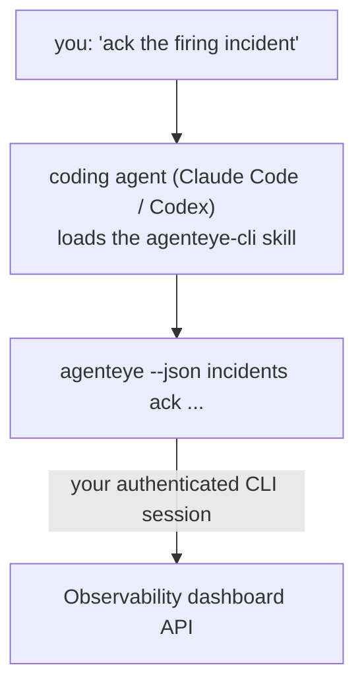

Hỏi agent coding của bạn *"có gì bị hỏng hôm nay không?"* và để nó trả lời từ dữ liệu Failproof AI Observability trực tiếp, không cần nhớ bất kỳ lệnh nào. **Failproof AI Observability CLI skill** (`agenteye-cli`) là một *Agent Skill*: một thư mục nhỏ chứa các hướng dẫn mà một agent coding như Claude Code hoặc Codex có thể tải theo yêu cầu. Nó dạy agent cách điều khiển deployment Observability của bạn thông qua [`agenteye` CLI](/vi/agenteye/cli) từ các yêu cầu bằng tiếng Anh đơn giản như *"cấp cho CI một khóa chỉ có thể push events"* hoặc *"xác nhận incident đang kích hoạt và gán cho tôi".*

Nó **không phải** là một dịch vụ hoặc một binary riêng biệt; không có gì để triển khai. Nó chạy trên nền của CLI bạn đã cài đặt: agent gọi `agenteye --json …`, phân tích JSON sạch, và trả lời bạn bằng các câu. Mọi thứ nó có thể làm, bạn cũng có thể tự làm bằng cách gõ các lệnh tương tự.

---

## Mối quan hệ của nó với các interface Failproof AI Observability khác

Failproof AI Observability cung cấp cho bạn bốn cách để tiếp cận cùng một dữ liệu và điều khiển. Chúng bổ sung cho nhau:

| Interface | Nó là gì | Chạy ở đâu | Dùng nó khi |
|---|---|---|---|
| **[CLI](/vi/agenteye/cli)** | Tham chiếu command/flag cho `agenteye` | Terminal của bạn | Bạn muốn chạy hoặc kịch bản một lệnh cụ thể |
| **[CLI recipes](/vi/agenteye/cli-recipes)** | Các mẫu `jq`/pipeline sao chép dán | Terminal / script của bạn | Bạn đang kết nối CLI vào tự động hóa |
| **CLI skill** (doc này) | Một cửa ra ngôn ngữ tự nhiên trên CLI | Agent coding của bạn, trên workstation | Bạn muốn *chỉ cần hỏi* và để agent chọn lệnh |
| **[Evaluator skill](/vi/agenteye/evaluator-skill)** | Một skill chị em thiết kế và xây dựng dịch vụ scoring của bạn | Agent coding của bạn, trên workstation | Bạn muốn *tạo* điểm eval thay vì chỉ đọc chúng |
| **[Python SDK skill](/vi/agenteye/python-sdk-skill)** | Một skill chị em giúp instrument agent để nó phát ra telemetry | Agent coding của bạn, trên workstation | Bạn muốn agent của bạn *tạo* các events mà skill này đọc |
| **[In-dashboard AI assistant](/vi/agenteye/assistant)** | Một chat nhúng trong bảng điều khiển | Phía máy chủ (trong bảng điều khiển) | Bạn muốn Q&A trong bảng điều khiển trên dữ liệu của bạn |

Skill này không có quyền riêng; nó chỉ biến các từ của bạn thành CLI calls chạy với tư cách là bạn:



### vs. in-dashboard AI assistant: một điểm khác biệt quan trọng

Đây là hai công cụ khác nhau với phạm vi tác động rất khác nhau:

- **In-dashboard AI assistant** ([AI assistant](/vi/agenteye/assistant)) là một chat nhúng trong bảng điều khiển, được hỗ trợ bởi dịch vụ agent. Nó là **chỉ đọc cộng với ghi được phê duyệt**: nó có thể soạn thảo các truy vấn và bảng điều khiển được lưu, nhưng mọi ghi đều tạm dừng để bạn phê duyệt rõ ràng, và nó không bao giờ xóa. Nó được bảo vệ bằng quyền `agent:use` và chỉ khi nào cũng chỉ nhìn thấy dữ liệu cho org bạn đang xem.
- **CLI skill** chạy trên *workstation* của bạn bên trong *agent coding* của bạn và điều khiển `agenteye` CLI với tư cách là **bạn**. Nó có thể thực hiện **toàn bộ bề mặt CLI, bao gồm mutations** (tạo/xoay vòng/vô hiệu hóa API keys, thay đổi cài đặt org, giải quyết incidents, xóa truy vấn được lưu), chỉ bị giới hạn bởi quyền của đăng nhập CLI của bạn. Hãy xử lý nó một cách cẩn thận như bạn sẽ xử lý khi chạy các lệnh đó bằng tay.

---

## Yêu cầu trước

1. **`agenteye` CLI được cài đặt** và trên `PATH` (xem tham chiếu [CLI](/vi/agenteye/cli): `pipx install agenteye`).
2. **URL bảng điều khiển** của bạn được đặt (`AGENTEYE_DASHBOARD_URL`, hoặc agent truyền `--base-url`).
3. **Một phiên đăng nhập**: trước tiên hãy chạy `agenteye login` bạn thân. Skill **không thể** hoàn thành đăng nhập mã thời gian xác định được gửi qua email cho bạn; nó sẽ yêu cầu bạn chạy `agenteye login` nếu phiên bị thiếu hoặc hết hạn (mã thoát CLI `4`).

---

## Lấy nó từ đâu

Skill được công bố trong bộ sưu tập skills công khai của Failproof AI:

**[github.com/FailproofAI/skills](https://github.com/FailproofAI/skills)** → [`skills/agenteye-cli/`](https://github.com/FailproofAI/skills/tree/main/skills/agenteye-cli)

Không có gì về nó bị hạn chế — kho lưu trữ là công khai và skill không cần bất kỳ thông tin xác thực nào của riêng nó, vì nó chỉ điều khiển `agenteye` CLI **công khai** trên bảng điều khiển của *bạn*, sử dụng phiên *bạn* đã đăng nhập. Bạn không cần phải hỏi ai cả.

Lưu ý rằng nó được cung cấp dưới dạng một thư mục riêng của nó và **không** nằm bên trong gói `pipx install agenteye`, vì vậy đừng tìm nó ở đó.

## Cài đặt skill

Con đường nhanh nhất là CLI [`skills`](https://skills.sh), nó lấy thư mục và đặt nó nơi agent của bạn tìm:

```bash
# Claude Code, chỉ dự án này
npx skills add FailproofAI/skills --skill agenteye-cli -a claude-code

# mỗi dự án (cài đặt vào ~/.claude/skills/)
npx skills add FailproofAI/skills --skill agenteye-cli -a claude-code -g --copy

# Codex thay vào đó
npx skills add FailproofAI/skills --skill agenteye-cli -a codex
```

Sau đó quản lý nó như bất kỳ skill nào khác:

```bash
npx skills list -a claude-code      # cái gì được cài đặt
npx skills update agenteye-cli      # kéo phiên bản mới nhất
npx skills remove agenteye-cli      # xóa nó
```

Thích cài đặt bằng tay? Một Agent Skill chỉ là một thư mục chứa một `SKILL.md` (cộng với tham chiếu tùy chọn), vì vậy sao chép nó cũng hoạt động:

- **Claude Code**: đặt thư mục `agenteye-cli/` vào `~/.claude/skills/` (mỗi dự án) hoặc `<your-repo>/.claude/skills/` (chỉ repo đó). Claude Code tự động khám phá nó — xác minh bằng danh sách `/skills`, hoặc chỉ cần hỏi một câu hỏi phù hợp với mô tả của nó.
- **Codex (OpenAI)**: Codex đọc cùng `SKILL.md`. `agents/openai.yaml` đi kèm đặt `allow_implicit_invocation: true`, vì vậy Codex tự động chọn skill khi một tác vụ phù hợp; nếu không thì gọi nó rõ ràng là `$agenteye-cli`.

---

## An toàn: mutations KHÔNG nhắc khi agent chạy CLI

> **Cảnh báo:** Đọc điều này trước khi để agent thực hiện các thay đổi.

`agenteye` CLI thường hỏi *"bạn có chắc không?"* trước một hành động phá hủy. Nó **tự động bỏ qua xác nhận đó bất cứ khi nào nó không được gắn vào một terminal (chính xác là cách một agent coding chạy nó), và `--json` cũng bỏ qua nó.** Vì vậy lời nhắc an toàn sẽ **không** kích hoạt cho agent.

Skill được viết để bù đắp: nó được hướng dẫn để nêu ra lệnh chính xác nó sẽ chạy và nhận **OK rõ ràng** từ bạn trước bất kỳ thay đổi trạng thái nào. Giữ kỷ luật đó. Khi bạn điều khiển Failproof AI Observability thông qua một agent, *bạn* là bước xác nhận. Các lệnh thay đổi trạng thái cần chú ý:

- `keys create` / `update` / `disable` / `regenerate`
- `users create` / `update` / `disable` / `enable`
- `settings set`
- `alerts create` / `update` / `delete` / `test`
- các lệnh ghi `incidents` subcommands: `ack` / `assign` / `resolve` / `open` / `comment-add` / `comment-delete` / `subscribe` / `unsubscribe`
- `query create` / `update` / `delete`
- `agent rename` / `delete`
- `orgs switch`

Mọi thứ dưới **Observe** (`events`, `sessions`, `evals`, `errors`, `list`, `whoami`, `orgs list/current/perms`) là chỉ đọc và không thay đổi gì cả.

Vì agent hành động với tư cách là **bạn**, nó chỉ có thể làm những gì đăng nhập của bạn được phép làm; quyền được phân quyết **per org** (xem [API keys](/vi/agenteye/api-keys)). Một lệnh bạn thiếu quyền trả về mã thoát `5` với quyền chính xác được đặt tên, vì vậy agent có thể cho bạn biết chính xác cần hỏi admin điều gì thay vì thất bại một cách không rõ ràng.

---

## Bạn có thể hỏi nó cái gì

Đây là một round-trip thực tế trông như thế nào, một lần đọc, sau đó là một thay đổi chờ OK của bạn:

```text
you   ▸ Is anything broken in the last day?

agent ▸ Running: agenteye --json errors --since 24h --aggregate
        3 error types in the last 24h. The biggest is TimeoutError
        (18 hits, all on the checkout-agent), then RateLimited (5).
        Want the failing sessions for TimeoutError?

you   ▸ Give CI a key that can only push events.

agent ▸ This creates an API key. I'll run:
          agenteye keys create ci --add events:add
        OK to proceed?

you   ▸ yes

agent ▸ Done. Key "ci" created with events:add only.
        The secret is shown only once, so store it now. I can't reprint it.
```

Skill này ánh xạ mỗi ý định bằng ngôn ngữ tự nhiên thành lệnh `agenteye` đúng, khám phá các giá trị hợp lệ trước (`list <kind>`, `whoami`) để nó không đoán, và nêu ra lệnh chính xác trước bất kỳ thay đổi nào. Thêm các ví dụ:

- *"Is anything broken / failing in the last 24 hours?"* → `errors --since 24h --aggregate`, sau đó là một bảng phân tích.
- *"Why did session `run-001` fail?"* → `events --session-id run-001 --all` + `evals --session-id run-001`.
- *"How is quality trending this week?"* → `evals --aggregate --since 7d`, sau đó đi sâu vào các lần chạy điểm thấp.
- *"Give CI a key that can only push events."* → `keys create ci --add events:add` (nó nêu ra lệnh, sau đó tạo nó và nắm bắt secret một lần).
- *"Who has access? Make Dana read-only."* → `users list` → `users update dana@… --permission-set read-only` (sau khi xác nhận với bạn).
- *"Ack the firing incident and assign it to me."* → `incidents list --state firing` → `incidents ack <id>` / `incidents assign <id> you@…`.

Để biết các lệnh chính xác, flags, và JSON shapes đằng sau những cái này, xem tham chiếu [CLI](/vi/agenteye/cli) và [CLI recipes cho agents](/vi/agenteye/cli-recipes).

---

## Bước tiếp theo

- **[CLI](/vi/agenteye/cli)**: tham chiếu command và flag đầy đủ cho `agenteye`.
- **[CLI recipes cho agents](/vi/agenteye/cli-recipes)**: các mẫu `jq` sao chép dán và xử lý mã thoát.
- **[Evaluator agent skill](/vi/agenteye/evaluator-skill)**: skill chị em, để xây dựng evaluator mà `agenteye evals` đọc điểm từ đó.
- **[Python SDK agent skill](/vi/agenteye/python-sdk-skill)**: skill chị em, để instrument một agent để nó phát ra telemetry mà `agenteye` đọc.
- **[AI assistant](/vi/agenteye/assistant)**: trợ lý trong bảng điều khiển (không nên nhầm lẫn với skill terminal này).
- **[API keys](/vi/agenteye/api-keys)**: mô hình quyền per-org giới hạn những gì skill có thể làm.